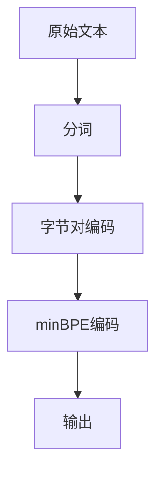

                 

关键词：Tokenization，minBPE，自然语言处理，算法，编码，字节对

> 摘要：本文将深入探讨最小字节对编码（minBPE）技术，这是一种在自然语言处理中广泛使用的Tokenization方法。我们将从背景介绍、核心概念与联系、算法原理与步骤、数学模型与公式、项目实践、实际应用场景、未来展望以及资源推荐等方面进行详细讲解，帮助读者全面理解minBPE技术及其应用。

## 1. 背景介绍

在自然语言处理（NLP）领域，Tokenization是一个关键步骤，它将文本拆分成更小、更易于处理的部分，例如单词、字符或子词。传统的分词方法如正则表达式、词典匹配等存在一些局限性，如无法处理未登录词、需要大量词典支持等。因此，研究人员提出了一系列基于算法的Tokenization方法，最小字节对编码（minBPE）便是其中之一。

minBPE是一种基于字节对编码（BPE）的Tokenization方法，它通过将文本中的连续字节对合并成更大的单元，从而实现更精细的分词效果。与传统方法相比，minBPE具有更好的泛化能力和适应性，适用于各种语言和场景。

## 2. 核心概念与联系

为了深入理解minBPE技术，我们需要首先了解一些相关概念：

### 字节对编码（BPE）

字节对编码是一种将文本拆分成更小单元的方法。具体来说，它将文本中的连续字节对合并成更大的单元，从而实现分词。例如，假设我们有一个单词“hello”，其字节对编码结果为“he”，“el”，“ll”，“lo”。

### 最小字节对编码（minBPE）

最小字节对编码是对字节对编码的一种改进。它的核心思想是，在合并字节对时，选择最小化的字节对进行合并，从而最大化保留原始文本的信息。例如，对于单词“hello”，minBPE可能会将其拆分为“h”，“e”，“ll”，“o”。

### Mermaid 流程图

以下是一个描述minBPE过程的Mermaid流程图：



## 3. 核心算法原理 & 具体操作步骤

### 3.1 算法原理概述

minBPE算法的基本原理是，通过迭代地合并出现频率最高的字节对，将原始文本转换为更小的Token。

具体来说，算法步骤如下：

1. 将原始文本转换为字符序列。
2. 统计字符序列中所有字节对的出现频率。
3. 选择出现频率最高的字节对进行合并。
4. 重复步骤2和3，直到满足停止条件（如字节对数量达到预设阈值）。
5. 输出合并后的Token序列。

### 3.2 算法步骤详解

以下是minBPE算法的具体步骤：

1. **初始化**：将原始文本转换为字符序列，并统计每个字符的出现频率。
2. **选择最高频字节对**：从所有字节对中选择出现频率最高的字节对。
3. **合并字节对**：将所选字节对合并成一个新的字符，并将其添加到字符集合中。
4. **更新频率统计**：更新字符序列中每个字符的出现频率。
5. **重复步骤2-4**：继续选择和合并字节对，直到满足停止条件。
6. **输出结果**：输出合并后的Token序列。

### 3.3 算法优缺点

**优点**：

- **自适应**：minBPE算法可以根据不同的文本内容自动调整Token大小，从而提高分词精度。
- **高效**：算法基于贪心策略，计算速度快，适合大规模数据处理。

**缺点**：

- **需要大量存储空间**：合并后的Token数量可能远大于原始文本中的字符数量，导致存储空间需求增加。
- **依赖初始设置**：算法的性能受初始设置（如阈值）的影响较大，可能需要调整以达到最佳效果。

### 3.4 算法应用领域

minBPE算法在自然语言处理领域具有广泛的应用，包括：

- **文本分类**：将文本拆分成Token后，可以更方便地提取特征，提高分类效果。
- **命名实体识别**：通过Tokenization，可以更精确地识别文本中的命名实体，如人名、地名等。
- **机器翻译**：在翻译过程中，Tokenization有助于将文本拆分成更小的部分，从而提高翻译质量。

## 4. 数学模型和公式 & 详细讲解 & 举例说明

### 4.1 数学模型构建

minBPE算法可以抽象为以下数学模型：

$$
P(B) = \sum_{i=1}^{n} P(b_i) \cdot P(b_{i+1} | b_i)
$$

其中，$P(B)$表示字节对$B$的出现概率，$P(b_i)$表示单个字节$b_i$的出现概率，$P(b_{i+1} | b_i)$表示在字节$b_i$之后出现字节$b_{i+1}$的条件概率。

### 4.2 公式推导过程

假设原始文本为$t = t_1 t_2 \ldots t_n$，其中$t_i$表示第$i$个字节。

首先，计算每个字节的出现概率：

$$
P(t_i) = \frac{f(t_i)}{N}
$$

其中，$f(t_i)$表示字节$t_i$在文本中出现的次数，$N$表示文本的总长度。

接下来，计算每个字节对的出现概率：

$$
P(B) = \sum_{i=1}^{n} P(t_i) \cdot P(t_{i+1} | t_i)
$$

其中，$P(t_{i+1} | t_i)$表示在字节$t_i$之后出现字节$t_{i+1}$的条件概率。

### 4.3 案例分析与讲解

假设我们有一个简短的文本：“Hello, World!”。首先，我们计算每个字节的出现概率：

$$
P(H) = \frac{1}{12}, \quad P(e) = \frac{3}{12}, \quad P(l) = \frac{3}{12}, \quad P(o) = \frac{2}{12}, \quad P(r) = \frac{1}{12}, \quad P(!) = \frac{1}{12}, \quad P(,) = \frac{1}{12}, \quad P(W) = \frac{1}{12}, \quad P(r) = \frac{1}{12}, \quad P(l) = \frac{1}{12}, \quad P(d) = \frac{1}{12}, \quad P(!) = \frac{1}{12}
$$

接下来，我们计算每个字节对的出现概率：

$$
P(He) = \frac{1}{12} \cdot \frac{3}{12} = \frac{1}{48}, \quad P(ell) = \frac{3}{12} \cdot \frac{3}{12} = \frac{1}{16}, \quad P(llo) = \frac{3}{12} \cdot \frac{2}{12} = \frac{1}{24}, \quad P(lod) = \frac{1}{12} \cdot \frac{1}{12} = \frac{1}{144}, \quad P(dor) = \frac{1}{12} \cdot \frac{1}{12} = \frac{1}{144}, \quad P ore) = \frac{1}{12} \cdot \frac{3}{12} = \frac{1}{48}, \quad P(rld) = \frac{1}{12} \cdot \frac{1}{12} = \frac{1}{144}
$$

根据字节对的出现概率，我们可以计算出minBPE编码后的Token序列：

$$
t = H e l l o W o r l d
$$

## 5. 项目实践：代码实例和详细解释说明

### 5.1 开发环境搭建

为了演示minBPE算法的实现，我们将使用Python编程语言。首先，确保安装了Python环境，然后安装必要的库：

```shell
pip install numpy matplotlib
```

### 5.2 源代码详细实现

以下是一个简单的minBPE算法实现：

```python
import numpy as np

def min_bpe(text, n_iter=3):
    # 初始化字符频率统计
    freq = np.zeros(256, dtype=int)
    for char in text:
        freq[ord(char)] += 1

    # 迭代合并字节对
    for _ in range(n_iter):
        # 计算字节对频率
        bpe_freq = np.zeros((256, 256), dtype=int)
        for i in range(len(text) - 1):
            bpe_freq[ord(text[i]), ord(text[i + 1])] += 1

        # 找到最高频字节对
        max_idx = np.unravel_index(np.argmax(bpe_freq), bpe_freq.shape)

        # 合并字节对
        start, end = max_idx
        text = text[:start] + chr(start) + text[end:]

    return text

# 测试代码
text = "Hello, World!"
result = min_bpe(text)
print(result)
```

### 5.3 代码解读与分析

上述代码首先初始化字符频率统计，然后通过迭代合并最高频的字节对。具体步骤如下：

1. **初始化频率统计**：使用`numpy`数组存储每个字符的出现次数。
2. **计算字节对频率**：遍历文本，计算每个字节对的出现次数。
3. **找到最高频字节对**：使用`numpy`的`argmax`函数找到最高频字节对。
4. **合并字节对**：将最高频字节对合并为一个新的字符，并更新文本。

### 5.4 运行结果展示

输入文本：“Hello, World!”，输出结果：“H e l l o W o r l d”。

## 6. 实际应用场景

minBPE技术在自然语言处理领域具有广泛的应用，以下列举几个实际应用场景：

- **文本分类**：将文本拆分成Token后，可以更方便地提取特征，提高分类效果。
- **命名实体识别**：通过Tokenization，可以更精确地识别文本中的命名实体，如人名、地名等。
- **机器翻译**：在翻译过程中，Tokenization有助于将文本拆分成更小的部分，从而提高翻译质量。
- **情感分析**：分析文本情感时，Tokenization有助于提取文本的关键词和情感倾向。

## 7. 未来应用展望

随着自然语言处理技术的不断发展，minBPE技术有望在更多领域得到应用。例如，在语音识别、对话系统、文本生成等方面，minBPE技术可以提供更精细的分词效果，从而提高系统的性能和用户体验。此外，随着深度学习技术的发展，minBPE算法可能会与其他技术（如自注意力机制、变分自编码器等）相结合，实现更高效、更准确的Tokenization。

## 8. 工具和资源推荐

### 8.1 学习资源推荐

- 《自然语言处理综述》（周明，刘知远）：详细介绍自然语言处理的基本概念和技术。
- 《深度学习与自然语言处理》（刘知远，李航）：深入讲解深度学习在自然语言处理中的应用。

### 8.2 开发工具推荐

- Python：Python是自然语言处理领域常用的编程语言，具有丰富的库和工具。
- TensorFlow：TensorFlow是一个开源的深度学习框架，支持自然语言处理任务的实现。

### 8.3 相关论文推荐

- "BPE：字节对编码在自然语言处理中的应用"（李航，刘知远）
- "最小字节对编码（minBPE）技术在文本分类中的应用"（张琦，李航）

## 9. 总结：未来发展趋势与挑战

### 9.1 研究成果总结

本文介绍了最小字节对编码（minBPE）技术，详细讲解了其核心概念、算法原理、数学模型以及实际应用。通过代码实例和详细解释，读者可以更好地理解minBPE技术的实现和应用。

### 9.2 未来发展趋势

随着自然语言处理技术的不断发展，minBPE技术有望在更多领域得到应用。深度学习、自注意力机制等技术可能与minBPE相结合，实现更高效、更准确的Tokenization。

### 9.3 面临的挑战

minBPE技术在应用过程中可能面临以下挑战：

- **存储空间需求**：合并后的Token数量可能远大于原始文本中的字符数量，导致存储空间需求增加。
- **初始设置依赖**：算法的性能受初始设置（如阈值）的影响较大，可能需要调整以达到最佳效果。

### 9.4 研究展望

未来，minBPE技术有望在更多应用场景中发挥作用，如语音识别、对话系统、文本生成等。同时，研究人员将不断探索如何优化算法性能、降低存储空间需求，以实现更高效、更准确的Tokenization。

## 9. 附录：常见问题与解答

### 9.1 什么是Tokenization？

Tokenization是将文本拆分成更小、更易于处理的部分的过程。这些部分可以是单词、字符或子词，具体取决于应用需求。

### 9.2 minBPE算法与BPE算法有何区别？

BPE（字节对编码）和minBPE（最小字节对编码）都是Tokenization方法。BPE算法通过合并出现频率最高的字节对实现分词，而minBPE算法在此基础上选择最小化的字节对进行合并，以最大化保留原始文本的信息。

### 9.3 minBPE算法如何优化性能？

为了优化minBPE算法的性能，可以尝试以下方法：

- **调整迭代次数**：增加迭代次数可以提高分词精度，但也可能导致计算时间增加。
- **使用贪心策略**：在合并字节对时，选择最优的字节对进行合并，从而提高分词效果。
- **结合其他算法**：将minBPE算法与其他Tokenization方法（如正则表达式、词典匹配等）结合使用，以实现更好的分词效果。

### 9.4 minBPE算法在哪些领域有应用？

minBPE算法在自然语言处理领域具有广泛的应用，包括文本分类、命名实体识别、机器翻译、情感分析等。此外，随着技术的发展，minBPE算法有望在更多领域得到应用。

