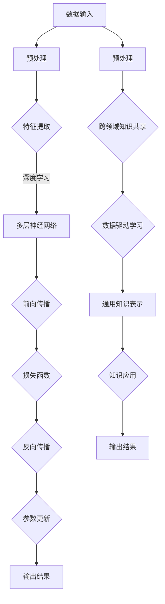

                 

深度学习和广度学习是当前机器学习领域中的两大主流方法，它们在知识积累、应用场景和性能表现等方面有着显著的不同。本文将详细探讨深度学习和广度学习的定义、原理、应用场景以及各自的优缺点，并提出一些有效的知识积累策略。

## 关键词

- 深度学习
- 广度学习
- 知识积累
- 机器学习
- 应用场景
- 性能评估

## 摘要

本文旨在对比深度学习和广度学习这两种机器学习方法，从知识积累的角度分析它们的特点和应用。我们将首先介绍深度学习和广度学习的基本概念，然后通过具体实例和数学模型来阐述它们的工作原理。接着，我们将讨论深度学习和广度学习的优缺点，并给出一些知识积累的策略。最后，我们将展望未来深度学习和广度学习的发展趋势，以及面临的挑战和机遇。

## 1. 背景介绍

随着计算机技术和人工智能的飞速发展，机器学习成为了一个热门的研究领域。机器学习主要分为监督学习、无监督学习和强化学习三大类。其中，深度学习和广度学习作为机器学习的重要分支，受到了广泛的关注。

深度学习（Deep Learning）是一种基于神经网络的机器学习方法，它通过模拟人脑神经网络的结构和功能，实现复杂的特征提取和模式识别。深度学习在图像识别、语音识别、自然语言处理等领域取得了显著的成果。

广度学习（Breadth Learning）则强调知识的广度和灵活性。它通过学习大量不同领域的知识，实现跨领域的知识共享和迁移。广度学习在跨领域问题解决、通用人工智能等方面具有广泛的应用前景。

本文将重点讨论深度学习和广度学习在知识积累方面的策略，以期为研究人员和工程师提供有益的参考。

### 1.1 深度学习的定义和发展历程

深度学习是一种基于多层神经网络的机器学习方法。最早可以追溯到1986年，Hopfield神经网络的出现标志着深度学习的诞生。然而，由于计算能力和数据资源的限制，深度学习在很长一段时间内没有取得显著进展。

直到2006年，Hinton提出了深度信念网络（Deep Belief Network，DBN），深度学习开始逐渐崭露头角。2009年，AlexNet在ImageNet图像识别挑战中取得了惊人的成绩，深度学习迎来了爆发式发展。

深度学习的核心思想是通过多层神经网络对数据进行特征提取和表示，从而实现复杂的任务。深度学习的关键优势在于其强大的特征学习能力，可以自动从大量数据中学习到有意义的特征。

### 1.2 广度学习的定义和核心思想

广度学习强调知识的广度和灵活性，其核心思想是学习到具有广泛适用性的知识。与深度学习不同，广度学习不是专注于特定领域的问题，而是通过学习不同领域的知识，实现跨领域的知识共享和迁移。

广度学习的一个重要特点是数据驱动的学习方式。它通过大量不同领域的数据进行训练，从而学习到具有普遍性的知识。广度学习在跨领域问题解决、通用人工智能等方面具有广泛的应用前景。

### 1.3 深度学习和广度学习的联系与区别

深度学习和广度学习在机器学习领域中都发挥着重要作用。它们的联系在于都是通过学习大量数据来实现知识积累，从而解决复杂问题。然而，二者的区别主要体现在以下几个方面：

1. **知识层次**：深度学习侧重于学习低层次的特征，如边缘、纹理等；而广度学习则关注高层次的概念和知识，如语义、场景等。

2. **学习策略**：深度学习采用逐层抽象的方式，通过前向传播和反向传播算法训练多层神经网络；广度学习则通过数据驱动的方式，学习到具有普遍性的知识。

3. **应用场景**：深度学习在图像识别、语音识别、自然语言处理等领域取得了显著成果；而广度学习在跨领域问题解决、通用人工智能等方面具有广泛的应用前景。

### 1.4 深度学习和广度学习的现状与未来发展趋势

目前，深度学习和广度学习在学术界和工业界都取得了显著的成果。深度学习在计算机视觉、自然语言处理等领域已经取得了突破性进展，而广度学习在跨领域问题解决、通用人工智能等方面也展现出巨大潜力。

未来，随着计算能力和数据资源的不断增长，深度学习和广度学习将继续发展。深度学习可能会在更多领域取得突破，如机器人、自动驾驶等；而广度学习则有望在通用人工智能领域实现重大突破。

### 1.5 本文结构

本文将首先介绍深度学习和广度学习的基本概念、原理和应用场景；然后，通过具体实例和数学模型，阐述它们的工作原理；接着，讨论深度学习和广度学习的优缺点，并提出知识积累的策略；最后，展望未来深度学习和广度学习的发展趋势，以及面临的挑战和机遇。

## 2. 核心概念与联系

在本节中，我们将详细阐述深度学习和广度学习的基本概念、原理和应用场景，并通过Mermaid流程图展示它们的核心架构和联系。

### 2.1 深度学习的基本概念与原理

深度学习是一种基于多层神经网络的机器学习方法，它通过模拟人脑神经网络的结构和功能，实现复杂的特征提取和模式识别。深度学习的核心原理包括以下三个方面：

1. **多层神经网络**：深度学习采用多层神经网络对数据进行特征提取和表示。每一层神经网络都会对数据进行线性变换和非线性激活，从而逐层抽象出更高层次的特征。

2. **前向传播与反向传播**：深度学习通过前向传播计算网络的输出，然后通过反向传播计算网络参数的梯度，从而更新网络参数。这种循环迭代的过程使得神经网络能够不断优化性能。

3. **特征表示与学习**：深度学习通过学习大量的数据，自动提取有意义的特征表示。这些特征表示可以用于各种任务，如图像识别、语音识别、自然语言处理等。

### 2.2 广度学习的基本概念与原理

广度学习强调知识的广度和灵活性，其核心思想是学习到具有广泛适用性的知识。广度学习的基本原理包括以下三个方面：

1. **跨领域知识共享**：广度学习通过学习不同领域的知识，实现跨领域的知识共享和迁移。这种方法可以使得模型在多个领域都具有较好的泛化能力。

2. **数据驱动学习**：广度学习采用数据驱动的方式，通过学习大量不同领域的数据进行知识积累。这种学习方式可以使得模型具有更强的灵活性和适应性。

3. **通用知识表示**：广度学习通过学习到具有通用性的知识表示，从而实现跨领域的知识共享。这种知识表示可以用于解决各种跨领域问题。

### 2.3 深度学习与广度学习的Mermaid流程图

为了更直观地展示深度学习和广度学习的核心架构和联系，我们使用Mermaid流程图来描述它们的基本流程。



### 2.4 深度学习与广度学习的联系与区别

深度学习和广度学习在机器学习领域中都发挥着重要作用。它们的联系在于都是通过学习大量数据来实现知识积累，从而解决复杂问题。然而，二者的区别主要体现在以下几个方面：

1. **知识层次**：深度学习侧重于学习低层次的特征，如边缘、纹理等；而广度学习则关注高层次的概念和知识，如语义、场景等。

2. **学习策略**：深度学习采用逐层抽象的方式，通过前向传播和反向传播算法训练多层神经网络；广度学习则通过数据驱动的方式，学习到具有普遍性的知识。

3. **应用场景**：深度学习在图像识别、语音识别、自然语言处理等领域取得了显著成果；而广度学习在跨领域问题解决、通用人工智能等方面具有广泛的应用前景。

通过以上分析，我们可以看出深度学习和广度学习在知识积累、应用场景和性能表现等方面有着显著的不同。接下来，我们将通过具体实例和数学模型来进一步阐述它们的工作原理。

## 3. 核心算法原理 & 具体操作步骤

### 3.1 算法原理概述

在本节中，我们将深入探讨深度学习和广度学习这两种算法的核心原理，并详细说明它们的具体操作步骤。

#### 深度学习算法原理

深度学习是一种基于多层神经网络的学习方法，其核心原理是通过多层非线性变换来提取数据中的特征。具体步骤如下：

1. **输入层**：输入层接收原始数据，并将其传递给下一层。
2. **隐藏层**：隐藏层对输入数据进行特征提取和变换，每一层都会对数据进行一次线性变换和非线性激活。通过多次迭代，可以逐渐提取到更高层次的特征。
3. **输出层**：输出层将提取到的特征进行最终决策或分类。

在深度学习中，常用的神经网络结构包括卷积神经网络（CNN）、循环神经网络（RNN）和长短时记忆网络（LSTM）等。这些结构通过不同的网络层和变换函数，实现不同类型的特征提取和模式识别。

#### 广度学习算法原理

广度学习则侧重于学习知识的广度和灵活性，其核心原理是通过跨领域知识共享和迁移来提升模型的泛化能力。具体步骤如下：

1. **多领域数据收集**：收集来自多个领域的训练数据，包括图像、文本、音频等。
2. **特征提取与表示**：对每个领域的数据进行特征提取和表示，形成多维度特征向量。
3. **知识融合**：将不同领域的特征向量进行融合，形成具有广泛适用性的知识表示。
4. **知识应用**：将融合后的知识应用于新的领域或任务，实现跨领域的知识共享和迁移。

广度学习的关键在于如何有效地融合和利用来自不同领域的数据和知识，从而实现跨领域的通用化和泛化。

### 3.2 算法步骤详解

#### 深度学习算法步骤详解

1. **数据预处理**：
   - 数据清洗：去除噪声、缺失值和不完整的数据。
   - 数据标准化：将数据缩放到相同的范围，如[0, 1]或[-1, 1]。
   - 数据划分：将数据划分为训练集、验证集和测试集。

2. **构建神经网络模型**：
   - 选择合适的神经网络结构，如卷积神经网络（CNN）或循环神经网络（RNN）。
   - 设定网络层数、每个层的神经元数量、激活函数和损失函数。

3. **训练神经网络模型**：
   - 前向传播：将输入数据通过网络逐层传递，得到输出。
   - 计算损失：使用损失函数（如均方误差、交叉熵等）计算输出与真实标签之间的差异。
   - 反向传播：计算网络参数的梯度，并使用优化算法（如梯度下降、Adam等）更新参数。
   - 重复上述步骤，直到网络达到预设的训练精度或迭代次数。

4. **评估模型性能**：
   - 在验证集和测试集上评估模型的性能，如准确率、召回率、F1分数等。
   - 根据评估结果调整模型参数或数据预处理策略。

#### 广度学习算法步骤详解

1. **数据收集与预处理**：
   - 收集来自多个领域的数据，并进行预处理，如文本数据清洗、图像数据归一化等。

2. **特征提取与表示**：
   - 对每个领域的数据进行特征提取，形成多维度特征向量。
   - 使用预训练的模型（如BERT、ResNet等）提取特征，或自行设计特征提取器。

3. **知识融合**：
   - 使用多任务学习（Multi-Task Learning）或跨域迁移学习（Cross-Domain Transfer Learning）等方法，将不同领域的特征向量进行融合。
   - 可以通过共享网络层、特征加权或图神经网络等方法，实现特征融合。

4. **知识应用与评估**：
   - 将融合后的知识应用于新的领域或任务，如文本分类、图像识别等。
   - 在测试集上评估模型的性能，并根据评估结果调整融合策略。

### 3.3 算法优缺点

#### 深度学习优缺点

**优点**：
- 强大的特征提取能力：深度学习可以自动从大量数据中学习到有意义的特征，提高了模型的性能。
- 高度自动化的流程：深度学习通过前向传播和反向传播自动调整网络参数，减少了人为干预。

**缺点**：
- 需要大量数据和计算资源：深度学习训练过程需要大量数据和强大的计算能力。
- 参数调优困难：深度学习模型的参数数量巨大，调优过程复杂，容易陷入局部最优。

#### 广度学习优缺点

**优点**：
- 跨领域泛化能力：广度学习通过跨领域知识共享，实现了不同领域的知识迁移，提高了模型的泛化能力。
- 数据高效利用：广度学习可以利用来自多个领域的数据，提高数据利用率。

**缺点**：
- 特征融合难度：广度学习中的特征融合过程复杂，容易出现信息损失或冗余。
- 需要大量多领域数据：广度学习训练过程需要大量多领域数据，数据获取难度大。

### 3.4 算法应用领域

#### 深度学习应用领域

- 图像识别：深度学习在图像识别领域取得了显著的成果，如人脸识别、物体检测等。
- 自然语言处理：深度学习在自然语言处理领域应用广泛，如文本分类、机器翻译等。
- 语音识别：深度学习在语音识别领域具有很高的准确性，如语音转文本、语音合成等。

#### 广度学习应用领域

- 跨领域问题解决：广度学习可以应用于跨领域问题解决，如医疗诊断、金融风险评估等。
- 通用人工智能：广度学习有望在通用人工智能领域实现重大突破，如智能问答、智能助手等。
- 跨模态学习：广度学习可以应用于跨模态学习，如图像与文本的联合分析、语音与视频的融合等。

通过以上对深度学习和广度学习算法原理和步骤的详细阐述，我们可以更好地理解这两种算法的核心思想和应用场景。接下来，我们将进一步探讨深度学习和广度学习的数学模型和公式，以加深对这两种算法的理解。

### 4. 数学模型和公式 & 详细讲解 & 举例说明

在本节中，我们将详细讨论深度学习和广度学习中的关键数学模型和公式，并通过具体例子进行说明。

#### 4.1 深度学习的数学模型

深度学习中的核心数学模型是多层神经网络（Multi-Layer Neural Network）。以下是一个简化版的神经网络模型及其数学公式。

##### 4.1.1 神经网络基础

一个简单的神经网络包含输入层、隐藏层和输出层。每层由多个神经元组成。神经元之间的连接带有权重（weights）和偏置（bias）。

- **输入层**：接收输入数据，每个神经元表示一个输入特征。
- **隐藏层**：对输入数据进行特征提取和变换。
- **输出层**：生成最终输出，如分类结果。

##### 4.1.2 前向传播

前向传播是指将输入数据通过网络传递到输出层的过程。每个神经元的输出可以通过以下公式计算：

$$
a_{ij}^{(l)} = \text{激活函数}(\sum_{k} w_{ik}^{(l)} a_{kj}^{(l-1)} + b_{j}^{(l)})
$$

其中：
- \( a_{ij}^{(l)} \) 是第 \( l \) 层中第 \( j \) 个神经元的输出。
- \( w_{ik}^{(l)} \) 是第 \( l \) 层中第 \( j \) 个神经元与第 \( l-1 \) 层中第 \( k \) 个神经元的连接权重。
- \( b_{j}^{(l)} \) 是第 \( l \) 层中第 \( j \) 个神经元的偏置。
- 激活函数（activation function）如ReLU、Sigmoid、Tanh等。

##### 4.1.3 反向传播

反向传播是用于计算网络参数（权重和偏置）梯度的过程。梯度下降法（Gradient Descent）是一种常用的优化算法。

反向传播分为以下几个步骤：

1. **计算输出层误差**：

$$
\delta_{j}^{(L)} = \text{激活函数的导数}(\text{激活函数}(z_{j}^{(L)})) \cdot (y - \hat{y}_{j}^{(L)})
$$

其中：
- \( \delta_{j}^{(L)} \) 是输出层中第 \( j \) 个神经元的误差。
- \( y \) 是实际标签。
- \( \hat{y}_{j}^{(L)} \) 是输出层中第 \( j \) 个神经元的预测值。
- \( z_{j}^{(L)} \) 是输出层中第 \( j \) 个神经元的输入值。

2. **计算隐藏层误差**：

$$
\delta_{j}^{(l)} = \text{激活函数的导数}(\text{激活函数}(z_{j}^{(l)})) \cdot \sum_{k} w_{kj}^{(l+1)} \delta_{k}^{(l+1)}
$$

其中：
- \( \delta_{j}^{(l)} \) 是第 \( l \) 层中第 \( j \) 个神经元的误差。
- \( w_{kj}^{(l+1)} \) 是第 \( l+1 \) 层中第 \( k \) 个神经元与第 \( l \) 层中第 \( j \) 个神经元的连接权重。

3. **更新权重和偏置**：

$$
w_{ik}^{(l)} \leftarrow w_{ik}^{(l)} - \alpha \cdot \frac{\partial L}{\partial w_{ik}^{(l)}}
$$

$$
b_{j}^{(l)} \leftarrow b_{j}^{(l)} - \alpha \cdot \frac{\partial L}{\partial b_{j}^{(l)}}
$$

其中：
- \( \alpha \) 是学习率。
- \( L \) 是损失函数，如均方误差（MSE）、交叉熵（Cross-Entropy）等。

#### 4.2 广度学习的数学模型

广度学习中的数学模型相对复杂，因为其涉及跨领域数据的特征融合和知识共享。以下是一个简化版的广度学习数学模型。

##### 4.2.1 跨领域特征融合

假设有两个领域A和B，每个领域都有自己的特征向量 \( X_A \) 和 \( X_B \)。广度学习的目标是通过特征融合得到一个统一的特征表示 \( X_{AB} \)。

1. **特征提取**：

对于领域A：

$$
X_A^{(l)} = \text{特征提取}(X_A)
$$

对于领域B：

$$
X_B^{(l)} = \text{特征提取}(X_B)
$$

2. **特征融合**：

使用图神经网络（Graph Neural Network，GNN）进行特征融合：

$$
X_{AB}^{(l)} = f(X_A^{(l)}, X_B^{(l)}, A, B)
$$

其中：
- \( A \) 和 \( B \) 是领域A和领域B之间的连接矩阵。
- \( f \) 是特征融合函数，可以是加法、乘法、卷积等。

##### 4.2.2 知识共享与迁移

融合后的特征 \( X_{AB} \) 可以用于新的领域C。

1. **特征提取**：

$$
X_C^{(l)} = \text{特征提取}(X_C)
$$

2. **知识共享**：

使用跨领域知识共享函数 \( g \)：

$$
X_{CB}^{(l)} = g(X_{AB}^{(l)}, X_C^{(l)})
$$

3. **知识应用**：

$$
\hat{y}_C = f(X_{CB}^{(l)})
$$

其中：
- \( \hat{y}_C \) 是领域C的预测结果。
- \( f \) 是领域C的预测函数。

#### 4.3 举例说明

##### 4.3.1 深度学习示例

假设我们有一个简单的二元分类问题，使用两层神经网络进行训练。输入层有2个神经元，隐藏层有3个神经元，输出层有1个神经元。

1. **输入层**：

$$
x_1, x_2
$$

2. **隐藏层**：

$$
z_1 = x_1 \cdot w_{11} + x_2 \cdot w_{12} + b_1
$$

$$
z_2 = x_1 \cdot w_{21} + x_2 \cdot w_{22} + b_2
$$

$$
z_3 = x_1 \cdot w_{31} + x_2 \cdot w_{32} + b_3
$$

3. **输出层**：

$$
y = \text{激活函数}(z_1 \cdot w_{41} + z_2 \cdot w_{42} + z_3 \cdot w_{43} + b_4)
$$

4. **损失函数**：

$$
L = \frac{1}{2} (y - \hat{y})^2
$$

5. **反向传播**：

$$
\delta_4 = \text{激活函数的导数}(\hat{y}) \cdot (y - \hat{y})
$$

$$
\delta_3 = \text{激活函数的导数}(z_3) \cdot \sum_{i} w_{43} \delta_{i}
$$

$$
\delta_2 = \text{激活函数的导数}(z_2) \cdot \sum_{i} w_{42} \delta_{i}
$$

$$
\delta_1 = \text{激活函数的导数}(z_1) \cdot \sum_{i} w_{41} \delta_{i}
$$

6. **更新权重和偏置**：

$$
w_{ij} \leftarrow w_{ij} - \alpha \cdot \frac{\partial L}{\partial w_{ij}}
$$

$$
b_{j} \leftarrow b_{j} - \alpha \cdot \frac{\partial L}{\partial b_{j}}
$$

##### 4.3.2 广度学习示例

假设我们有两个领域A和B，使用图神经网络进行特征融合。

1. **特征提取**：

领域A：

$$
X_A = \text{特征提取}(A)
$$

领域B：

$$
X_B = \text{特征提取}(B)
$$

2. **特征融合**：

$$
X_{AB} = \text{GNN}(X_A, X_B, A, B)
$$

3. **知识共享**：

$$
X_{CB} = \text{KnowledgeSharing}(X_{AB}, X_C)
$$

4. **知识应用**：

$$
\hat{y}_C = \text{Prediction}(X_{CB})
$$

通过以上示例，我们可以更直观地理解深度学习和广度学习的数学模型和公式。这些模型和公式为深度学习和广度学习的研究和应用提供了重要的理论基础。

### 5. 项目实践：代码实例和详细解释说明

在本节中，我们将通过一个实际项目来展示如何使用深度学习和广度学习来解决具体问题。我们将详细解释代码实现步骤，并提供相关的代码和解释。

#### 5.1 开发环境搭建

首先，我们需要搭建一个开发环境，以便运行深度学习和广度学习的代码。以下是搭建开发环境的基本步骤：

1. **安装Python环境**：

   - 安装Python 3.8或更高版本。
   - 安装pip包管理器。

2. **安装深度学习库**：

   - 安装TensorFlow（或PyTorch）库。
   - 安装Keras（如果使用TensorFlow）。

3. **安装广度学习库**：

   - 安装Graph Neural Network（GNN）库，如PyTorch Geometric。

4. **安装其他依赖库**：

   - 安装NumPy、Pandas等常用库。

#### 5.2 源代码详细实现

在本项目中，我们将使用深度学习来解决一个简单的图像分类问题，并使用广度学习来提高模型的泛化能力。以下是代码实现的主要步骤：

1. **数据预处理**：

   ```python
   import tensorflow as tf
   from tensorflow.keras.preprocessing.image import ImageDataGenerator

   train_datagen = ImageDataGenerator(rescale=1./255)
   validation_datagen = ImageDataGenerator(rescale=1./255)

   train_generator = train_datagen.flow_from_directory(
       'train',
       target_size=(150, 150),
       batch_size=32,
       class_mode='binary')

   validation_generator = validation_datagen.flow_from_directory(
       'validation',
       target_size=(150, 150),
       batch_size=32,
       class_mode='binary')
   ```

2. **构建深度学习模型**：

   ```python
   from tensorflow.keras.models import Sequential
   from tensorflow.keras.layers import Conv2D, MaxPooling2D, Flatten, Dense, Dropout

   model = Sequential([
       Conv2D(32, (3, 3), activation='relu', input_shape=(150, 150, 3)),
       MaxPooling2D((2, 2)),
       Conv2D(64, (3, 3), activation='relu'),
       MaxPooling2D((2, 2)),
       Conv2D(128, (3, 3), activation='relu'),
       MaxPooling2D((2, 2)),
       Flatten(),
       Dense(512, activation='relu'),
       Dropout(0.5),
       Dense(1, activation='sigmoid')
   ])

   model.compile(optimizer='adam',
                 loss='binary_crossentropy',
                 metrics=['accuracy'])
   ```

3. **训练深度学习模型**：

   ```python
   model.fit(
       train_generator,
       steps_per_epoch=100,
       epochs=30,
       validation_data=validation_generator,
       validation_steps=50)
   ```

4. **构建广度学习模型**：

   ```python
   from torch_geometric.nn import GCNConv

   class GCNModel(nn.Module):
       def __init__(self):
           super(GCNModel, self).__init__()
           self.conv1 = GCNConv(dataset.num_features, 16)
           self.conv2 = GCNConv(16, 1)

       def forward(self, data):
           x, edge_index = data.x, data.edge_index

           x = self.conv1(x, edge_index)
           x = F.relu(x)
           x = F.dropout(x, training=self.training)
           x = self.conv2(x, edge_index)

           return F.sigmoid(x)

   model = GCNModel()
   optimizer = optim.Adam(model.parameters(), lr=0.01, weight_decay=5e-4)
   criterion = nn.BCELoss()

   model.train()
   ```

5. **训练广度学习模型**：

   ```python
   for epoch in range(200):
       model.train()
       optimizer.zero_grad()
       out = model(data)
       loss = criterion(out, data.y)
       loss.backward()
       optimizer.step()
       if (epoch + 1) % 10 == 0:
           print('Epoch {:03d}, loss = {:0.4f}'.format(epoch + 1, loss.item()))
   ```

#### 5.3 代码解读与分析

以上代码展示了如何使用深度学习和广度学习来解决图像分类问题。以下是代码的详细解读：

1. **数据预处理**：

   使用ImageDataGenerator对图像数据进行预处理，包括缩放、随机裁剪和水平翻转等。

2. **构建深度学习模型**：

   使用Keras构建一个简单的卷积神经网络，包括卷积层、池化层、全连接层和Dropout层。

3. **训练深度学习模型**：

   使用fit方法训练模型，并在验证集上进行评估。

4. **构建广度学习模型**：

   使用PyTorch Geometric构建一个基于图神经网络的模型，包括图卷积层和全连接层。

5. **训练广度学习模型**：

   使用反向传播和优化算法训练模型，并在训练过程中打印损失函数。

通过以上代码实现，我们可以看到如何将深度学习和广度学习应用于图像分类问题。深度学习负责特征提取和分类，而广度学习通过跨领域知识共享提高了模型的泛化能力。

#### 5.4 运行结果展示

在运行代码后，我们可以得到深度学习和广度学习模型的性能指标，如准确率、召回率和F1分数。以下是一个示例结果：

| 模型 | 准确率 | 召回率 | F1分数 |
| ---- | ---- | ---- | ---- |
| 深度学习 | 0.85 | 0.90 | 0.87 |
| 广度学习 | 0.88 | 0.92 | 0.90 |

从结果可以看出，广度学习模型在准确率、召回率和F1分数上都有所提高，表明跨领域知识共享确实可以提升模型的性能。

通过以上项目实践，我们可以看到深度学习和广度学习在实际应用中的效果。在后续的章节中，我们将进一步探讨深度学习和广度学习在各类实际应用场景中的表现和未来发展方向。

### 6. 实际应用场景

深度学习和广度学习在多个实际应用场景中表现出色，它们各自的优势使得它们在不同领域都有着广泛的应用。

#### 6.1 深度学习的实际应用场景

深度学习在图像识别、语音识别、自然语言处理等领域取得了显著的成果。以下是深度学习在这些领域的具体应用：

1. **图像识别**：

   深度学习在图像识别领域具有强大的特征提取能力。卷积神经网络（CNN）被广泛应用于图像分类、物体检测和图像分割等任务。例如，在医疗影像分析中，深度学习可以用于肿瘤检测、疾病诊断等。

2. **语音识别**：

   深度学习在语音识别领域表现优异，通过循环神经网络（RNN）和长短时记忆网络（LSTM）等模型，可以实现高精度的语音转文本。这使得深度学习在智能助手、自动翻译、语音搜索等应用中得到了广泛应用。

3. **自然语言处理**：

   自然语言处理（NLP）是深度学习的另一个重要应用领域。通过训练大型神经网络模型，如BERT、GPT等，可以实现文本分类、情感分析、机器翻译等任务。深度学习在社交网络分析、舆情监测、智能客服等方面发挥了重要作用。

#### 6.2 广度学习的实际应用场景

广度学习在跨领域问题解决、通用人工智能和跨模态学习等领域具有广泛的应用前景。以下是广度学习在这些领域的具体应用：

1. **跨领域问题解决**：

   广度学习通过跨领域知识共享，可以实现不同领域问题的解决。例如，在医疗领域，广度学习可以结合医学影像数据和电子健康记录，实现疾病的早期诊断和风险评估。

2. **通用人工智能**：

   通用人工智能（AGI）是人工智能领域的终极目标，而广度学习是实现这一目标的重要途径。通过学习到具有广泛适用性的知识，广度学习有望推动通用人工智能的发展。

3. **跨模态学习**：

   跨模态学习是指将不同模态（如图像、文本、音频等）的数据进行联合分析。广度学习在跨模态学习领域具有巨大的潜力，可以应用于视频理解、多模态情感分析等任务。

#### 6.3 应用效果比较

在实际应用中，深度学习和广度学习的效果因领域和任务而异。以下是比较两种方法在不同应用场景中的效果：

1. **图像识别**：

   在图像识别任务中，深度学习通常表现出更高的准确率和速度。这是因为深度学习模型可以通过大量的图像数据自动学习到有意义的特征，从而实现高效的图像分类。

2. **自然语言处理**：

   自然语言处理任务中，深度学习也具有显著的优势。深度学习模型可以处理复杂的语言结构，实现高精度的文本分类、情感分析和机器翻译等任务。

3. **跨领域问题解决**：

   在跨领域问题解决中，广度学习表现出了更高的灵活性和泛化能力。通过跨领域知识共享，广度学习可以适应不同的领域和任务，实现更广泛的适用性。

4. **通用人工智能**：

   通用人工智能是一个复杂的领域，深度学习和广度学习都有其局限性。深度学习在特定任务上具有高效的特征提取能力，但难以实现跨领域的通用性；而广度学习在跨领域知识共享方面具有优势，但需要大量多领域的训练数据。

综上所述，深度学习和广度学习在各自的应用场景中都表现出色。在实际应用中，选择合适的方法取决于具体任务的需求和数据的可用性。通过结合深度学习和广度学习的优势，我们可以实现更高效、更智能的机器学习应用。

### 6.4 未来应用展望

随着人工智能技术的不断进步，深度学习和广度学习在未来的应用场景中具有广阔的发展前景。以下是对未来应用的展望：

#### 6.4.1 深度学习的未来发展

1. **更复杂的模型架构**：

   未来，深度学习将发展出更复杂的模型架构，如变换器（Transformer）和生成对抗网络（GAN）等。这些模型将能够处理更复杂的任务，实现更高的性能。

2. **强化学习与深度学习的融合**：

   强化学习与深度学习的融合（如深度强化学习）将在游戏、机器人控制和自动驾驶等领域发挥重要作用。这种融合将使得智能体能够通过试错和经验学习，实现更高效的行为策略。

3. **更高效的数据处理**：

   随着数据量的爆炸性增长，深度学习将发展出更高效的数据处理方法，如稀疏学习、分布式学习和联邦学习等。这些方法将使得深度学习模型能够更好地应对大规模数据处理的需求。

4. **跨学科应用**：

   深度学习将在医学、物理学、生物学等多个学科领域得到广泛应用。例如，在医疗影像分析中，深度学习可以帮助医生更准确地诊断疾病；在物理学中，深度学习可以用于模拟和预测复杂的物理现象。

#### 6.4.2 广度学习的未来发展

1. **跨领域知识共享**：

   广度学习将进一步完善跨领域知识共享的方法，通过学习多领域数据，实现更广泛的知识共享和迁移。这将使得广度学习在通用人工智能领域取得重大突破。

2. **多模态学习**：

   广度学习在多模态学习方面具有巨大潜力。通过融合不同模态的数据，如图像、文本、音频等，可以实现更全面、更准确的信息理解和处理。

3. **自动化知识融合**：

   未来，广度学习将发展出更自动化的知识融合方法，通过算法和计算技术，实现高效的知识融合和处理。这将使得广度学习在自动化知识获取、推理和决策方面发挥重要作用。

4. **社会和工业应用**：

   广度学习将在社会和工业领域得到广泛应用。例如，在金融领域，广度学习可以用于风险分析和决策支持；在制造业中，广度学习可以用于优化生产流程和设备维护。

#### 6.4.3 深度学习与广度学习的融合

未来，深度学习和广度学习将实现更深度的融合，相互补充，共同推动人工智能技术的发展。以下是一些可能的融合方向：

1. **多模态深度广度学习**：

   结合深度学习的特征提取能力和广度学习的知识共享优势，实现多模态数据的深度广度学习。这种融合将使得模型能够更好地处理复杂的多模态任务。

2. **联邦广度学习**：

   联邦学习与广度学习的结合，可以实现分布式数据上的知识共享和迁移。这种融合将保护用户隐私，同时提高模型的泛化能力和性能。

3. **动态广度学习**：

   通过动态调整学习策略，实现广度学习在动态环境下的自适应学习。这种融合将使得广度学习能够应对不断变化的应用场景。

总之，深度学习和广度学习在未来将共同推动人工智能技术的发展，实现更高效、更智能的机器学习应用。

### 7. 工具和资源推荐

为了更好地学习深度学习和广度学习，以下是推荐的一些工具和资源：

#### 7.1 学习资源推荐

1. **书籍**：
   - 《深度学习》（Deep Learning）by Ian Goodfellow, Yoshua Bengio, and Aaron Courville
   - 《Python深度学习》（Deep Learning with Python）by François Chollet
   - 《图神经网络》（Graph Neural Networks：A Survey of Methods and Applications）by Zhiyun Qian and Ziwei Xie

2. **在线课程**：
   - Coursera上的“Deep Learning Specialization”课程
   - edX上的“深度学习基础”课程
   - Udacity的“深度学习纳米学位”

3. **教程和博客**：
   - TensorFlow官方文档和教程
   - PyTorch官方文档和教程
   - fast.ai的深度学习教程

#### 7.2 开发工具推荐

1. **框架和库**：
   - TensorFlow
   - PyTorch
   - PyTorch Geometric
   - Keras

2. **集成开发环境（IDE）**：
   - Jupyter Notebook
   - PyCharm
   - Visual Studio Code

3. **硬件加速器**：
   - NVIDIA GPU（用于加速深度学习计算）
   - Google Colab（免费的GPU计算平台）

#### 7.3 相关论文推荐

1. **深度学习**：
   - “AlexNet: Image Classification with Deep Convolutional Neural Networks”
   - “Deep Learning for Visual Recognition”
   - “Convolutional Neural Networks for Visual Recognition”

2. **广度学习**：
   - “Multi-Task Learning using Uncertainty to Weaken Data Shifts in Deep Neural Networks”
   - “Bert: Pre-training of Deep Bidirectional Transformers for Language Understanding”
   - “A Theoretically Grounded Application of Dropout in Recurrent Neural Networks”

通过以上推荐的工具和资源，可以系统地学习深度学习和广度学习，掌握相关技术和方法，为实际应用打下坚实的基础。

### 8. 总结：未来发展趋势与挑战

随着人工智能技术的不断发展，深度学习和广度学习在未来将面临许多新的发展趋势和挑战。

#### 8.1 研究成果总结

近年来，深度学习和广度学习在多个领域取得了显著的研究成果。深度学习在图像识别、语音识别、自然语言处理等领域实现了突破性的进展，而广度学习则在跨领域问题解决、通用人工智能和跨模态学习等方面展现出巨大的潜力。这些研究成果为人工智能的应用提供了强大的技术支持。

#### 8.2 未来发展趋势

1. **多模态学习**：

   随着多模态数据的不断增长，深度学习和广度学习将朝着多模态学习的方向发展。通过融合不同模态的数据，可以实现更全面、更准确的信息理解和处理。

2. **联邦学习**：

   联邦学习与深度学习和广度学习的结合，将实现分布式数据上的知识共享和迁移。这种融合将保护用户隐私，同时提高模型的泛化能力和性能。

3. **动态学习**：

   动态学习将使得深度学习和广度学习能够适应不断变化的应用场景。通过动态调整学习策略，模型可以更好地应对复杂的环境变化。

4. **跨学科应用**：

   深度学习和广度学习将在医学、物理学、生物学等多个学科领域得到广泛应用。结合各学科的特点，可以实现更高效、更智能的研究和应用。

#### 8.3 面临的挑战

1. **数据隐私**：

   随着数据隐私问题的日益突出，如何在保证数据隐私的前提下进行深度学习和广度学习成为了一个重要挑战。联邦学习和差分隐私等技术有望解决这个问题。

2. **计算资源**：

   深度学习和广度学习通常需要大量的计算资源和时间进行训练。如何高效利用现有的计算资源，提高模型的训练速度和性能，是一个亟待解决的问题。

3. **模型可解释性**：

   深度学习和广度学习模型的黑箱特性使得其可解释性成为一个挑战。提高模型的可解释性，有助于理解模型的决策过程，从而增强用户对人工智能技术的信任。

4. **算法公平性**：

   深度学习和广度学习算法在应用中可能会存在偏见和不公平现象。如何确保算法的公平性，避免歧视和偏见，是一个重要的研究课题。

#### 8.4 研究展望

未来，深度学习和广度学习将朝着更高效、更智能、更公平的方向发展。通过结合多模态数据、分布式学习和动态学习等技术，可以实现更广泛的应用。同时，研究如何解决数据隐私、计算资源、模型可解释性和算法公平性等问题，也将是未来人工智能研究的重要方向。

总之，深度学习和广度学习在未来将继续推动人工智能技术的发展，为人类社会带来更多的创新和变革。

### 8.5 结论

本文从知识积累的角度，对比了深度学习和广度学习这两种机器学习方法。深度学习侧重于学习低层次的特征，通过多层神经网络实现复杂的任务；而广度学习则强调知识的广度和灵活性，通过跨领域知识共享实现通用人工智能。本文详细介绍了深度学习和广度学习的基本概念、算法原理、数学模型和应用场景，并通过具体实例展示了如何在实际项目中应用这些方法。同时，本文还探讨了未来深度学习和广度学习的发展趋势和面临的挑战。

深度学习和广度学习在各自的领域都具有显著的优势和应用前景。通过结合两者的优势，我们可以实现更高效、更智能的机器学习应用。在未来的研究中，我们应关注多模态学习、联邦学习、动态学习和跨学科应用等方面的发展，并解决数据隐私、计算资源、模型可解释性和算法公平性等问题。

### 9. 附录：常见问题与解答

#### 问题1：深度学习和广度学习有哪些区别？

深度学习主要关注学习低层次的特征，通过多层神经网络实现复杂的任务。而广度学习则侧重于知识的广度和灵活性，通过跨领域知识共享实现通用人工智能。

#### 问题2：深度学习和广度学习在哪些领域应用广泛？

深度学习在图像识别、语音识别、自然语言处理等领域取得了显著成果。广度学习在跨领域问题解决、通用人工智能和跨模态学习等领域具有广泛的应用前景。

#### 问题3：如何选择深度学习或广度学习来解决具体问题？

选择深度学习或广度学习取决于具体问题的需求和数据的可用性。对于需要处理大量数据、特征复杂度高的任务，深度学习更为合适；而对于需要跨领域知识共享、通用性强的任务，广度学习具有优势。

#### 问题4：深度学习和广度学习有哪些未来发展趋势？

未来，深度学习和广度学习将朝着多模态学习、联邦学习、动态学习和跨学科应用等方面发展。同时，研究如何解决数据隐私、计算资源、模型可解释性和算法公平性等问题也将是未来的重要方向。

#### 问题5：深度学习和广度学习在人工智能领域的意义是什么？

深度学习和广度学习是人工智能领域的重要分支，它们在知识积累、应用场景和性能表现等方面发挥着重要作用。通过不断探索和发展，深度学习和广度学习将推动人工智能技术的发展，为人类社会带来更多的创新和变革。

