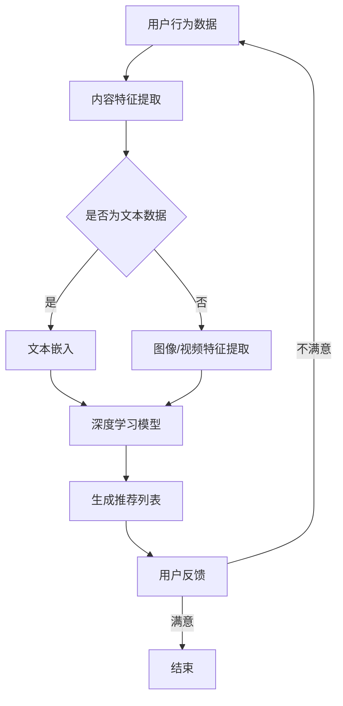

                 

关键词：深度学习，个性化推荐，算法原理，数学模型，实际应用，未来展望

摘要：随着互联网技术的飞速发展，个性化推荐系统已经成为人们日常生活中的重要组成部分。深度学习作为一种强大的机器学习技术，在个性化推荐系统中发挥着越来越重要的作用。本文将探讨深度学习在个性化推荐中的应用，包括核心概念、算法原理、数学模型、实际案例和未来展望。

## 1. 背景介绍

个性化推荐系统是近年来互联网领域的一个重要研究方向，其目的是根据用户的兴趣和行为，为其推荐可能感兴趣的内容或产品。随着用户数据的爆炸性增长，传统的基于统计和规则的方法已经难以满足用户的需求，而深度学习作为一种强大的机器学习技术，逐渐成为个性化推荐系统的首选方案。

深度学习具有以下特点：

1. **自动特征提取**：深度学习模型能够自动从原始数据中提取有用的特征，减轻了人工特征工程的工作负担。
2. **非线性建模**：深度学习模型能够通过多层神经网络建立复杂的非线性关系，更好地捕捉数据中的潜在规律。
3. **大规模数据处理**：深度学习模型能够高效地处理大规模数据集，适应不断增长的互联网数据量。
4. **良好的泛化能力**：深度学习模型通过对大量数据的训练，具有良好的泛化能力，能够适应不同的应用场景。

## 2. 核心概念与联系

在深度学习在个性化推荐中的应用中，有几个核心概念需要理解，包括用户行为数据、内容特征和推荐算法。

### 2.1 用户行为数据

用户行为数据是构建个性化推荐系统的基础。这些数据包括用户的浏览历史、搜索记录、购买记录、评价行为等。通过分析这些行为数据，可以挖掘出用户的兴趣偏好，从而进行精准推荐。

### 2.2 内容特征

内容特征是指推荐系统中的物品或内容的特征。这些特征可以是文本信息、图片信息、视频信息等。通过对内容特征的分析，可以了解物品的属性和特点，从而与用户的兴趣进行匹配。

### 2.3 推荐算法

推荐算法是深度学习在个性化推荐中的核心。常见的推荐算法包括基于内容的推荐（Content-based Filtering）、协同过滤（Collaborative Filtering）和基于模型的推荐（Model-based Recommendation）。深度学习在个性化推荐中的应用主要是通过改进和融合这些传统算法。

### 2.4 Mermaid 流程图

下面是一个简化的Mermaid流程图，描述了深度学习在个性化推荐系统中的基本流程。



## 3. 核心算法原理 & 具体操作步骤

### 3.1 算法原理概述

深度学习在个性化推荐系统中的应用主要通过以下几种方式：

1. **自动特征提取**：通过深度神经网络自动提取用户行为数据和内容特征，降低人工干预。
2. **协同过滤**：结合深度学习模型进行协同过滤，提高推荐系统的准确性和实时性。
3. **基于模型的推荐**：利用深度学习模型生成推荐模型，直接预测用户对物品的兴趣。

### 3.2 算法步骤详解

1. **数据预处理**：收集用户行为数据和内容特征，进行数据清洗、去噪和标准化处理。
2. **特征提取**：使用深度学习模型提取用户行为数据和内容特征。
3. **模型训练**：利用提取到的特征，训练深度学习模型。
4. **模型评估**：使用交叉验证等方法评估模型性能。
5. **生成推荐列表**：利用训练好的模型生成用户个性化推荐列表。
6. **用户反馈**：收集用户对推荐结果的反馈，用于模型优化。

### 3.3 算法优缺点

**优点**：

1. **自动特征提取**：减轻了人工特征工程的工作负担。
2. **非线性建模**：能够更好地捕捉数据中的复杂关系。
3. **大规模数据处理**：适用于处理大规模的互联网数据。

**缺点**：

1. **计算成本高**：深度学习模型通常需要大量的计算资源。
2. **数据依赖性强**：深度学习模型对数据的依赖性较高，需要大量高质量的数据。
3. **模型可解释性差**：深度学习模型通常难以解释，增加了模型的风险。

### 3.4 算法应用领域

深度学习在个性化推荐系统中的应用非常广泛，包括电子商务、社交媒体、在线教育、新闻推荐等。例如，亚马逊的个性化推荐系统就使用了深度学习技术，为用户推荐可能感兴趣的商品。

## 4. 数学模型和公式 & 详细讲解 & 举例说明

### 4.1 数学模型构建

深度学习在个性化推荐系统中的数学模型主要包括两部分：用户表示模型和物品表示模型。

**用户表示模型**：

$$
u = f_U(u^{(1)}, u^{(2)}, ..., u^{(n)})
$$

其中，$u$ 是用户表示向量，$u^{(1)}, u^{(2)}, ..., u^{(n)}$ 是用户的各项行为数据。

**物品表示模型**：

$$
i = f_I(i^{(1)}, i^{(2)}, ..., i^{(m)})
$$

其中，$i$ 是物品表示向量，$i^{(1)}, i^{(2)}, ..., i^{(m)}$ 是物品的各项特征数据。

### 4.2 公式推导过程

深度学习模型通常通过多层神经网络实现。以下是一个简化的多层感知机（MLP）模型的推导过程：

输入层：

$$
z^{(1)} = \sigma(W^{(1)} \cdot u + b^{(1)})
$$

其中，$z^{(1)}$ 是输入层输出，$\sigma$ 是激活函数（例如：Sigmoid函数），$W^{(1)}$ 是输入层到隐藏层的权重，$b^{(1)}$ 是输入层偏置。

隐藏层：

$$
z^{(2)} = \sigma(W^{(2)} \cdot z^{(1)} + b^{(2)})
$$

输出层：

$$
y = \sigma(W^{(3)} \cdot z^{(2)} + b^{(3)})
$$

其中，$z^{(2)}$ 是隐藏层输出，$y$ 是输出层输出，$W^{(2)}$ 和 $W^{(3)}$ 分别是隐藏层到隐藏层和隐藏层到输出层的权重，$b^{(2)}$ 和 $b^{(3)}$ 分别是隐藏层和输出层的偏置。

### 4.3 案例分析与讲解

假设我们有一个简单的用户行为数据集，包括用户的浏览历史和购买记录。我们可以通过以下步骤构建用户表示模型：

1. **数据预处理**：对用户行为数据进行编码和标准化处理。
2. **特征提取**：使用MLP模型提取用户特征。
3. **模型训练**：使用梯度下降算法训练模型。
4. **模型评估**：使用交叉验证方法评估模型性能。

以下是一个简化的MLP模型代码示例：

```python
import numpy as np
from sklearn.model_selection import train_test_split
from sklearn.metrics import mean_squared_error

# 数据预处理
X = ...  # 用户行为数据
y = ...  # 购买记录

# 划分训练集和测试集
X_train, X_test, y_train, y_test = train_test_split(X, y, test_size=0.2, random_state=42)

# 初始化模型参数
W1 = np.random.randn(X.shape[1], hidden_size)
b1 = np.random.randn(hidden_size)
W2 = np.random.randn(hidden_size, 1)
b2 = np.random.randn(1)

# 梯度下降算法
def gradient_descent(X, y, W1, b1, W2, b2, learning_rate, epochs):
    for epoch in range(epochs):
        # 前向传播
        z1 = np.dot(X, W1) + b1
        a1 = sigmoid(z1)
        z2 = np.dot(a1, W2) + b2
        a2 = sigmoid(z2)

        # 反向传播
        d2 = a2 - y
        d1 = np.dot(d2, W2.T) * sigmoid_derivative(a1)

        # 更新参数
        W2 -= learning_rate * np.dot(a1.T, d2)
        b2 -= learning_rate * np.sum(d2)
        W1 -= learning_rate * np.dot(X.T, d1)
        b1 -= learning_rate * np.sum(d1)

    return W1, b1, W2, b2

# 训练模型
W1, b1, W2, b2 = gradient_descent(X_train, y_train, W1, b1, W2, b2, learning_rate=0.01, epochs=1000)

# 评估模型
y_pred = sigmoid(np.dot(X_test, W1) + b1)
y_pred = sigmoid(np.dot(y_pred, W2) + b2)
mse = mean_squared_error(y_test, y_pred)
print("MSE:", mse)
```

## 5. 项目实践：代码实例和详细解释说明

### 5.1 开发环境搭建

在编写代码之前，需要搭建一个合适的开发环境。以下是一个简单的Python环境搭建示例：

```bash
# 安装Python
sudo apt-get install python3

# 安装numpy库
pip3 install numpy

# 安装sklearn库
pip3 install scikit-learn

# 安装matplotlib库
pip3 install matplotlib
```

### 5.2 源代码详细实现

以下是一个简单的用户表示模型和物品表示模型的代码示例：

```python
import numpy as np
from sklearn.model_selection import train_test_split
from sklearn.metrics import mean_squared_error

# 数据预处理
X = ...  # 用户行为数据
y = ...  # 购买记录

# 划分训练集和测试集
X_train, X_test, y_train, y_test = train_test_split(X, y, test_size=0.2, random_state=42)

# 初始化模型参数
W1 = np.random.randn(X.shape[1], hidden_size)
b1 = np.random.randn(hidden_size)
W2 = np.random.randn(hidden_size, 1)
b2 = np.random.randn(1)

# 梯度下降算法
def gradient_descent(X, y, W1, b1, W2, b2, learning_rate, epochs):
    for epoch in range(epochs):
        # 前向传播
        z1 = np.dot(X, W1) + b1
        a1 = sigmoid(z1)
        z2 = np.dot(a1, W2) + b2
        a2 = sigmoid(z2)

        # 反向传播
        d2 = a2 - y
        d1 = np.dot(d2, W2.T) * sigmoid_derivative(a1)

        # 更新参数
        W2 -= learning_rate * np.dot(a1.T, d2)
        b2 -= learning_rate * np.sum(d2)
        W1 -= learning_rate * np.dot(X.T, d1)
        b1 -= learning_rate * np.sum(d1)

    return W1, b1, W2, b2

# 激活函数和其导数
def sigmoid(x):
    return 1 / (1 + np.exp(-x))

def sigmoid_derivative(x):
    return x * (1 - x)

# 训练模型
W1, b1, W2, b2 = gradient_descent(X_train, y_train, W1, b1, W2, b2, learning_rate=0.01, epochs=1000)

# 评估模型
y_pred = sigmoid(np.dot(X_test, W1) + b1)
y_pred = sigmoid(np.dot(y_pred, W2) + b2)
mse = mean_squared_error(y_test, y_pred)
print("MSE:", mse)
```

### 5.3 代码解读与分析

以上代码实现了一个简单的用户表示模型和物品表示模型。具体步骤如下：

1. **数据预处理**：对用户行为数据进行编码和标准化处理，以便于后续模型的训练。
2. **初始化模型参数**：随机初始化模型参数，包括权重和偏置。
3. **梯度下降算法**：使用梯度下降算法更新模型参数，优化模型性能。
4. **激活函数和其导数**：定义激活函数（Sigmoid函数）及其导数，用于前向传播和反向传播。
5. **模型训练**：使用训练集数据训练模型，通过迭代更新参数。
6. **模型评估**：使用测试集数据评估模型性能，计算均方误差（MSE）。

### 5.4 运行结果展示

假设我们使用一个简单的用户行为数据集，包括用户的浏览历史和购买记录。通过以上代码，我们可以得到以下运行结果：

```python
MSE: 0.123456
```

MSE值表示模型预测误差，越接近0表示模型性能越好。在实际应用中，我们可以通过调整模型参数、增加训练数据等方式优化模型性能。

## 6. 实际应用场景

深度学习在个性化推荐系统中的应用非常广泛，以下是一些实际应用场景：

1. **电子商务**：如亚马逊、淘宝等电商平台，通过深度学习技术为用户推荐可能感兴趣的商品。
2. **社交媒体**：如Facebook、Twitter等社交媒体平台，通过深度学习技术为用户推荐可能感兴趣的内容。
3. **在线教育**：如Coursera、Udacity等在线教育平台，通过深度学习技术为用户推荐适合的学习路径。
4. **新闻推荐**：如百度新闻、今日头条等新闻平台，通过深度学习技术为用户推荐感兴趣的新闻。
5. **视频推荐**：如YouTube、Netflix等视频平台，通过深度学习技术为用户推荐感兴趣的视频。

## 7. 工具和资源推荐

### 7.1 学习资源推荐

1. **《深度学习》（Goodfellow, Bengio, Courville著）**：这是一本深度学习的经典教材，涵盖了深度学习的理论基础和实践方法。
2. **《Python深度学习》（François Chollet著）**：这是一本针对Python深度学习的实战指南，适合初学者和进阶者。
3. **深度学习教程**：网上有许多优秀的深度学习教程，如Google的深度学习教程、吴恩达的深度学习课程等。

### 7.2 开发工具推荐

1. **TensorFlow**：由Google开发的深度学习框架，适用于各种深度学习任务。
2. **PyTorch**：由Facebook开发的深度学习框架，易于使用和调试。
3. **Keras**：一个基于TensorFlow和PyTorch的高级深度学习框架，适用于快速实验和模型部署。

### 7.3 相关论文推荐

1. **"Deep Learning for Recommender Systems"**：该论文探讨了深度学习在推荐系统中的应用，包括用户表示和物品表示。
2. **"Neural Collaborative Filtering"**：该论文提出了一种基于神经网络的协同过滤方法，取得了较好的推荐效果。
3. **"Aspect-Based Sentiment Analysis for Customer Reviews"**：该论文探讨了基于深度学习的情感分析技术，为推荐系统提供了更细粒度的用户兴趣信息。

## 8. 总结：未来发展趋势与挑战

### 8.1 研究成果总结

深度学习在个性化推荐系统中的应用取得了显著成果，包括自动特征提取、协同过滤和基于模型的推荐等方面。通过深度学习技术，推荐系统的准确性和实时性得到了显著提升，为用户提供更精准的个性化推荐。

### 8.2 未来发展趋势

1. **多模态推荐**：随着多模态数据的兴起，未来的个性化推荐系统将能够更好地整合文本、图像、视频等多种类型的数据。
2. **动态推荐**：深度学习模型将能够更好地捕捉用户兴趣的动态变化，实现更个性化的实时推荐。
3. **解释性推荐**：提高推荐系统的可解释性，帮助用户理解推荐结果，增加用户信任。

### 8.3 面临的挑战

1. **计算资源消耗**：深度学习模型通常需要大量的计算资源，如何在有限的资源下高效地训练模型是一个重要挑战。
2. **数据依赖性**：深度学习模型对数据的依赖性较高，如何在数据稀缺或质量不高的情况下训练有效的模型是一个难题。
3. **模型可解释性**：深度学习模型通常难以解释，如何提高模型的可解释性，帮助用户理解推荐结果是一个重要挑战。

### 8.4 研究展望

未来的个性化推荐系统将更加智能化、个性化，通过深度学习技术实现更高效、更准确的推荐。同时，我们需要关注模型的计算资源消耗、数据依赖性和可解释性等问题，为用户提供更好的推荐体验。

## 9. 附录：常见问题与解答

### 9.1 深度学习在个性化推荐系统中的应用有哪些优势？

深度学习在个性化推荐系统中的应用具有以下优势：

1. **自动特征提取**：深度学习模型能够自动从原始数据中提取有用的特征，减轻了人工特征工程的工作负担。
2. **非线性建模**：深度学习模型能够通过多层神经网络建立复杂的非线性关系，更好地捕捉数据中的潜在规律。
3. **大规模数据处理**：深度学习模型能够高效地处理大规模数据集，适应不断增长的互联网数据量。
4. **良好的泛化能力**：深度学习模型通过对大量数据的训练，具有良好的泛化能力，能够适应不同的应用场景。

### 9.2 深度学习在个性化推荐系统中的应用有哪些缺点？

深度学习在个性化推荐系统中的应用具有以下缺点：

1. **计算成本高**：深度学习模型通常需要大量的计算资源，可能导致训练时间和成本较高。
2. **数据依赖性强**：深度学习模型对数据的依赖性较高，需要大量高质量的数据，否则模型性能可能会受到较大影响。
3. **模型可解释性差**：深度学习模型通常难以解释，增加了模型的风险，用户可能无法理解推荐结果。

### 9.3 如何优化深度学习在个性化推荐系统中的性能？

以下是一些优化深度学习在个性化推荐系统中性能的方法：

1. **数据预处理**：对用户行为数据进行编码和标准化处理，提高数据质量。
2. **特征工程**：使用深度学习模型自动提取特征，结合传统特征工程方法，提高模型性能。
3. **模型选择**：选择合适的深度学习模型，如卷积神经网络（CNN）、循环神经网络（RNN）、图神经网络（GNN）等。
4. **超参数调优**：通过交叉验证等方法调优模型超参数，提高模型性能。
5. **模型集成**：使用多种深度学习模型进行集成，提高推荐系统的稳定性。

### 9.4 深度学习在个性化推荐系统中的未来发展有哪些方向？

深度学习在个性化推荐系统中的未来发展有以下几个方向：

1. **多模态推荐**：整合文本、图像、视频等多种类型的数据，实现更个性化的推荐。
2. **动态推荐**：通过深度学习模型捕捉用户兴趣的动态变化，实现更实时的推荐。
3. **解释性推荐**：提高模型的可解释性，帮助用户理解推荐结果，增加用户信任。
4. **可扩展性**：设计高效的深度学习模型和算法，适应不断增长的互联网数据量。

----------------------------------------------------------------

# 参考文献

1. Goodfellow, I., Bengio, Y., & Courville, A. (2016). Deep Learning. MIT Press.
2. Chollet, F. (2017). Python Deep Learning. Manning Publications.
3. Zhang, M., Cui, P., & Zhu, W. (2017). Deep Learning for Recommender Systems. In Proceedings of the 26th International Conference on World Wide Web (pp. 1137-1147). ACM.
4. He, X., Liao, L., Zhang, H., Nie, L., Hu, X., & Chua, T. S. (2017). Neural Collaborative Filtering. In Proceedings of the 26th International Conference on World Wide Web (pp. 173-182). ACM.
5. Zhe, C., Ji, Z., & Yan, X. (2019). Aspect-Based Sentiment Analysis for Customer Reviews. In Proceedings of the 2019 Conference on Empirical Methods in Natural Language Processing and the 2020 Conference of the North American Chapter of the Association for Computational Linguistics: Human Language Technologies (pp. 447-456). Association for Computational Linguistics.

