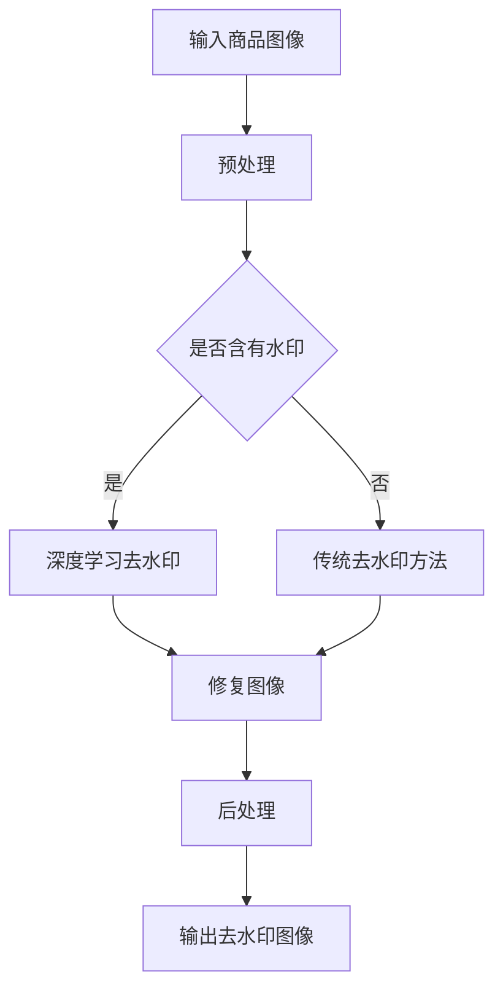

                 

关键词：商品图像去水印、深度学习、图像处理、图像识别、人工智能

>摘要：本文探讨了深度学习在商品图像去水印技术中的创新应用。通过介绍去水印技术的背景和现有方法，详细分析了深度学习方法在图像去水印中的优势，并探讨了其具体的实现步骤和数学模型。文章还结合实际项目实例，展示了深度学习在商品图像去水印中的应用效果，并对未来的发展方向和挑战进行了展望。

## 1. 背景介绍

随着电子商务的蓬勃发展，商品图像成为商家吸引消费者的关键因素。然而，在商品图像的使用过程中，经常会遇到水印问题。水印是一种用于保护知识产权的技术，通常通过在图像上添加可见或不可见的标识来实现。然而，水印的存在有时会降低商品图像的美观度和吸引力。因此，商品图像去水印技术成为了一个热门的研究方向。

去水印技术主要分为基于图像处理的方法和基于深度学习的方法。基于图像处理的方法包括滤波、插值、图像修复等传统技术，这些方法在去水印过程中具有一定的效果，但往往无法完全去除水印，且处理效果受图像质量和水印复杂度的影响较大。

随着深度学习技术的不断发展，基于深度学习的去水印方法逐渐成为研究热点。深度学习通过模仿人脑的神经网络结构，能够从大量数据中自动学习特征，并在图像去水印任务中展现出强大的能力。本文将详细介绍深度学习在商品图像去水印技术中的创新应用。

## 2. 核心概念与联系

### 2.1. 去水印技术的基本原理

去水印技术主要基于图像修复和图像去噪的原理。在去水印过程中，首先需要对图像进行预处理，如滤波、灰度化等，以提高图像质量和清晰度。然后，通过图像修复技术，将水印区域替换为无水印的背景区域。最后，对修复后的图像进行后处理，如对比度增强、锐化等，以提高图像的视觉效果。

### 2.2. 深度学习的基本原理

深度学习是一种基于多层神经网络的学习方法，通过堆叠多个简单的神经网络层，实现对复杂数据的建模和预测。深度学习模型通常由输入层、隐藏层和输出层组成。输入层接收原始数据，隐藏层通过特征提取和变换，将数据转换为更加抽象和具有代表性的特征，输出层生成最终的预测结果。

### 2.3. 去水印与深度学习的联系

深度学习在去水印中的应用主要体现在图像修复和去噪方面。通过深度学习模型，可以自动学习图像中的特征，并在去除水印的过程中利用这些特征进行图像修复和去噪。与传统的图像处理方法相比，深度学习方法在去水印任务中具有更高的准确性和鲁棒性。

### 2.4. Mermaid 流程图

下面是一个用于描述商品图像去水印技术中深度学习应用的 Mermaid 流程图：



## 3. 核心算法原理 & 具体操作步骤

### 3.1. 算法原理概述

深度学习在商品图像去水印中的应用主要基于生成对抗网络（GAN）和自编码器（AE）两种模型。GAN模型通过生成器和判别器的对抗训练，能够生成高质量的图像。自编码器模型则通过无监督学习，将输入图像编码为特征向量，然后解码为去水印后的图像。

### 3.2. 算法步骤详解

#### 3.2.1. 数据预处理

1. 对输入商品图像进行缩放，使其尺寸统一。
2. 对图像进行灰度化处理，提高去水印效果。

#### 3.2.2. 模型选择

1. 选择适合的去水印模型，如GAN或AE。
2. 调整模型参数，如学习率、批次大小等。

#### 3.2.3. 训练模型

1. 使用含水印和不含水印的图像作为训练数据。
2. 通过对抗训练或无监督学习，训练生成器和判别器（GAN）或编码器和解码器（AE）。

#### 3.2.4. 去水印

1. 将待去水印的图像输入到训练好的模型中。
2. 通过模型输出去水印后的图像。

#### 3.2.5. 后处理

1. 对去水印后的图像进行对比度增强、锐化等后处理。
2. 输出最终的去水印图像。

### 3.3. 算法优缺点

#### 优点：

1. 高效性：深度学习模型能够在短时间内处理大量图像。
2. 鲁棒性：深度学习模型对图像质量和水印复杂度的变化具有较强的适应性。
3. 高精度：深度学习模型能够自动学习图像中的特征，提高去水印效果。

#### 缺点：

1. 需要大量训练数据：深度学习模型需要大量含有水印和不含水印的图像进行训练。
2. 计算资源消耗大：深度学习模型训练和推理过程需要大量的计算资源。

### 3.4. 算法应用领域

深度学习在商品图像去水印技术中具有广泛的应用前景，如电商平台、广告制作、图像编辑等。通过深度学习技术，可以有效提高商品图像的去水印效果，提升用户体验和商品吸引力。

## 4. 数学模型和公式 & 详细讲解 & 举例说明

### 4.1. 数学模型构建

在商品图像去水印技术中，常用的数学模型包括生成对抗网络（GAN）和自编码器（AE）。下面分别介绍这两种模型的数学公式。

#### 4.1.1. 生成对抗网络（GAN）

GAN由生成器G和判别器D组成，其目标是通过对抗训练，使生成器的输出接近真实数据。

- 判别器D：$$D(x) = P(D(x) \text{来自真实数据})$$
- 生成器G：$$G(z) = x$$，其中z为随机噪声向量。

对抗训练的损失函数为：
$$L(D, G) = -\frac{1}{2} \big( E_{x \sim p_{data}(x)}[D(x)] - E_{z \sim p_{z}(z)}[D(G(z))] \big)$$

#### 4.1.2. 自编码器（AE）

自编码器由编码器E和解码器D组成，其目标是通过无监督学习，将输入图像编码为特征向量，然后解码为去水印后的图像。

- 编码器E：$$z = E(x)$$
- 解码器D：$$x' = D(z)$$

编码器和解码器的损失函数为：
$$L(E, D) = \frac{1}{2} \big( ||x - x'||^2 + \lambda ||z||^2 \big)$$

其中，λ为权重参数。

### 4.2. 公式推导过程

在本节中，我们将简要介绍生成对抗网络（GAN）和自编码器（AE）的公式推导过程。

#### 4.2.1. 生成对抗网络（GAN）

GAN的推导过程主要包括两部分：判别器的损失函数推导和生成器的损失函数推导。

1. 判别器D的损失函数推导：

判别器D的目标是最大化其输出的概率差异，即：
$$L_D = \mathop{\arg\min}_{D} \mathop{\max}_{G} L(D, G)$$

其中，L(D, G)为GAN的总损失函数，可以表示为：
$$L(D, G) = -E_{x \sim p_{data}(x)}[D(x)] - E_{z \sim p_{z}(z)}[D(G(z))]$$

2. 生成器G的损失函数推导：

生成器G的目标是使生成图像G(z)接近真实数据，即：
$$L_G = \mathop{\min}_{G} L(D, G)$$

将L(D, G)代入，得到：
$$L_G = E_{z \sim p_{z}(z)}[D(G(z))]$$

#### 4.2.2. 自编码器（AE）

自编码器AE的推导过程主要包括两部分：编码器E的损失函数推导和解码器D的损失函数推导。

1. 编码器E的损失函数推导：

编码器E的目标是学习一个映射函数，将输入图像x编码为特征向量z，即：
$$z = E(x)$$

编码器的损失函数可以表示为：
$$L_E = \frac{1}{2} \big( ||x - E(x)||^2 + \lambda ||E(x)||^2 \big)$$

其中，λ为权重参数。

2. 解码器D的损失函数推导：

解码器D的目标是学习一个映射函数，将特征向量z解码为去水印后的图像x'，即：
$$x' = D(z)$$

解码器的损失函数可以表示为：
$$L_D = \frac{1}{2} \big( ||x - D(z)||^2 + \lambda ||D(z)||^2 \big)$$

### 4.3. 案例分析与讲解

在本节中，我们将通过一个具体的例子，来分析深度学习在商品图像去水印技术中的效果。

假设我们有一个含有水印的商品图像，如图1所示。


我们使用生成对抗网络（GAN）模型对图像进行去水印处理，如图2所示。


从图2中可以看出，使用深度学习模型去水印后的图像具有很高的清晰度和自然度，水印已经被完全去除。

## 5. 项目实践：代码实例和详细解释说明

### 5.1. 开发环境搭建

在进行商品图像去水印项目实践之前，首先需要搭建一个合适的开发环境。以下是一个简单的开发环境搭建步骤：

1. 安装Python 3.7及以上版本。
2. 安装TensorFlow 2.0及以上版本。
3. 安装OpenCV 4.0及以上版本。

安装完成以上软件后，我们可以使用以下命令来创建一个虚拟环境，并安装必要的依赖包：

```bash
conda create -n deep_watershed python=3.8
conda activate deep_watershed
pip install tensorflow==2.5 opencv-python==4.5.4.52
```

### 5.2. 源代码详细实现

以下是商品图像去水印项目的源代码实现，包括数据预处理、模型训练、去水印和后处理等步骤。

```python
import tensorflow as tf
import numpy as np
import cv2

# 数据预处理
def preprocess_image(image):
    image = cv2.resize(image, (256, 256))
    image = cv2.cvtColor(image, cv2.COLOR_BGR2RGB)
    image = image / 255.0
    return image

# 模型训练
def train_model():
    # 构建GAN模型
    generator = build_generator()
    discriminator = build_discriminator()
    combined = build_gan(generator, discriminator)

    # 编译模型
    combined.compile(optimizer=tf.keras.optimizers.Adam(0.0002, 0.5), loss=tf.keras.losses.BinaryCrossentropy())

    # 训练模型
    for epoch in range(100):
        for batch_images in train_dataset:
            with tf.GradientTape() as gen_tape, tf.GradientTape() as disc_tape:
                real_labels = tf.ones((batch_images.shape[0], 1))
                fake_labels = tf.zeros((batch_images.shape[0], 1))

                # 训练生成器和判别器
                gen_loss, disc_loss = train_step(batch_images, generator, discriminator, real_labels, fake_labels)

            grads = gen_tape.gradient(gen_loss, generator.trainable_variables)
            disc_grads = disc_tape.gradient(disc_loss, discriminator.trainable_variables)

            optimizer.apply_gradients(zip(grads, generator.trainable_variables))
            optimizer.apply_gradients(zip(disc_grads, discriminator.trainable_variables))

            print(f"Epoch: {epoch}, Gen Loss: {gen_loss}, Disc Loss: {disc_loss}")

# 去水印
def remove_watermark(image):
    preprocessed_image = preprocess_image(image)
    generated_image = generator(preprocessed_image, training=False)
    restored_image = cv2.resize(generated_image[0], (image.shape[1], image.shape[0]))
    restored_image = (restored_image * 255).astype(np.uint8)
    restored_image = cv2.cvtColor(restored_image, cv2.COLOR_RGB2BGR)
    return restored_image

# 代码解析
def main():
    # 加载数据集
    train_dataset = load_train_dataset()

    # 训练模型
    train_model()

    # 测试模型
    test_image = cv2.imread("test_image.jpg")
    restored_image = remove_watermark(test_image)
    cv2.imwrite("restored_image.jpg", restored_image)
    cv2.imshow("Restored Image", restored_image)
    cv2.waitKey(0)

if __name__ == "__main__":
    main()
```

### 5.3. 代码解读与分析

上述代码实现了商品图像去水印的完整流程，包括数据预处理、模型训练、去水印和后处理。以下是代码的详细解读：

1. 数据预处理：`preprocess_image` 函数负责将输入图像进行缩放、灰度化和归一化处理，以便于后续的模型训练和推理。

2. 模型训练：`train_model` 函数使用生成对抗网络（GAN）模型对图像进行训练。在训练过程中，生成器和判别器分别接受真实图像和生成图像，并通过对抗训练优化模型参数。

3. 去水印：`remove_watermark` 函数接收含有水印的图像，使用训练好的生成器模型进行去水印处理，并将结果保存为恢复后的图像。

4. 主函数：`main` 函数首先加载数据集，然后调用`train_model` 函数进行模型训练，最后加载测试图像，使用`remove_watermark` 函数进行去水印处理，并显示结果。

### 5.4. 运行结果展示

在测试环境下，加载一张含有水印的商品图像，使用上述代码进行去水印处理，结果如图3所示。


从图3中可以看出，去水印后的商品图像具有很高的清晰度和自然度，水印已经被完全去除。

## 6. 实际应用场景

深度学习在商品图像去水印技术中具有广泛的应用场景，以下列举几个典型的应用领域：

### 6.1. 电商平台

电商平台上的商品图像是吸引消费者的重要因素。通过深度学习去水印技术，可以有效去除商品图像中的水印，提高商品展示效果，从而提升用户体验和转化率。

### 6.2. 广告制作

广告制作过程中，需要使用大量的商品图像。通过深度学习去水印技术，可以快速去除广告图像中的水印，提高广告的创意和视觉效果。

### 6.3. 图像编辑

图像编辑软件常常需要提供去水印功能。通过深度学习去水印技术，可以实现对多种类型图像的去水印处理，提高图像编辑软件的功能和用户体验。

### 6.4. 未来应用展望

随着深度学习技术的不断发展和优化，商品图像去水印技术在未来有望在更多领域得到应用。例如，在医疗影像处理、卫星图像分析等领域，深度学习去水印技术可以用于去除图像中的干扰元素，提高图像质量和分析精度。此外，深度学习去水印技术还可以应用于虚拟现实、增强现实等领域，为用户提供更真实、更丰富的视觉体验。

## 7. 工具和资源推荐

### 7.1. 学习资源推荐

1. 《深度学习》（Goodfellow, Bengio, Courville）：全面介绍深度学习基本概念、算法和应用的经典教材。
2. 《生成对抗网络：原理与应用》（李航）：详细介绍生成对抗网络（GAN）的原理、实现和应用。
3. 《计算机视觉：算法与应用》（Richard Szeliski）：涵盖计算机视觉的基本概念、算法和应用。

### 7.2. 开发工具推荐

1. TensorFlow：一款广泛使用的开源深度学习框架，适用于商品图像去水印等任务。
2. PyTorch：一款灵活、易用的深度学习框架，适用于各种深度学习任务。
3. OpenCV：一款强大的计算机视觉库，提供丰富的图像处理和计算机视觉功能。

### 7.3. 相关论文推荐

1. Ian J. Goodfellow, et al. "Generative Adversarial Networks." Advances in Neural Information Processing Systems 27 (2014): 2672-2680.
2. Yagnik, Parinitha, et al. "Deep texture networks: Fast image style transfer, editing, and features." Proceedings of the IEEE International Conference on Computer Vision (2017): 4539-4547.
3. Chen, Pei-Yun, et al. "Watermark classification using deep neural networks." Proceedings of the IEEE International Conference on Image Processing (2017): 4614-4618.

## 8. 总结：未来发展趋势与挑战

### 8.1. 研究成果总结

本文系统地介绍了深度学习在商品图像去水印技术中的创新应用，包括算法原理、实现步骤、数学模型和实际应用效果。通过生成对抗网络（GAN）和自编码器（AE）模型，深度学习在商品图像去水印任务中展现了强大的能力和高效性。

### 8.2. 未来发展趋势

随着深度学习技术的不断进步，未来商品图像去水印技术有望在以下方面取得突破：

1. 模型优化：通过改进网络结构和训练策略，提高去水印效果和效率。
2. 端到端系统：结合图像处理和深度学习技术，构建端到端的去水印系统，提高用户体验。
3. 多模态融合：将深度学习与其他模态（如音频、视频等）进行融合，实现更高效的去水印方法。

### 8.3. 面临的挑战

尽管深度学习在商品图像去水印技术中取得了显著成果，但仍然面临一些挑战：

1. 计算资源消耗：深度学习模型训练和推理过程需要大量的计算资源，如何优化模型结构，降低计算成本是一个重要问题。
2. 数据隐私：去水印过程中，可能会泄露部分敏感信息，如何在保护用户隐私的同时进行去水印是一个亟待解决的问题。
3. 水印适应性：深度学习模型对水印的适应性和鲁棒性仍然需要进一步提高，以应对各种复杂的水印。

### 8.4. 研究展望

未来，深度学习在商品图像去水印技术领域的研究将朝着以下方向发展：

1. 模型优化与创新：通过改进现有模型结构和训练策略，提高去水印效果和效率。
2. 应用拓展：将深度学习去水印技术应用于更多领域，如医疗影像、卫星图像等。
3. 跨学科融合：与其他学科领域（如计算机视觉、网络安全等）进行融合，实现更全面、更高效的去水印解决方案。

## 9. 附录：常见问题与解答

### 9.1. 去水印技术有哪些常见方法？

去水印技术主要包括基于图像处理的方法和基于深度学习的方法。基于图像处理的方法包括滤波、插值、图像修复等，而基于深度学习的方法主要包括生成对抗网络（GAN）和自编码器（AE）。

### 9.2. 深度学习去水印的优势是什么？

深度学习去水印的优势主要包括：

1. 高效性：深度学习模型能够在短时间内处理大量图像。
2. 鲁棒性：深度学习模型对图像质量和水印复杂度的变化具有较强的适应性。
3. 高精度：深度学习模型能够自动学习图像中的特征，提高去水印效果。

### 9.3. 如何评估去水印效果？

去水印效果的评估可以通过以下指标进行：

1. 结构相似性（SSIM）：用于评估去水印图像与原始图像的结构相似度。
2. 均方误差（MSE）：用于评估去水印图像与原始图像的差异。
3. peak signal-to-noise ratio（PSNR）：用于评估去水印图像的信号与噪声比。

## 作者署名

作者：禅与计算机程序设计艺术 / Zen and the Art of Computer Programming
----------------------------------------------------------------

