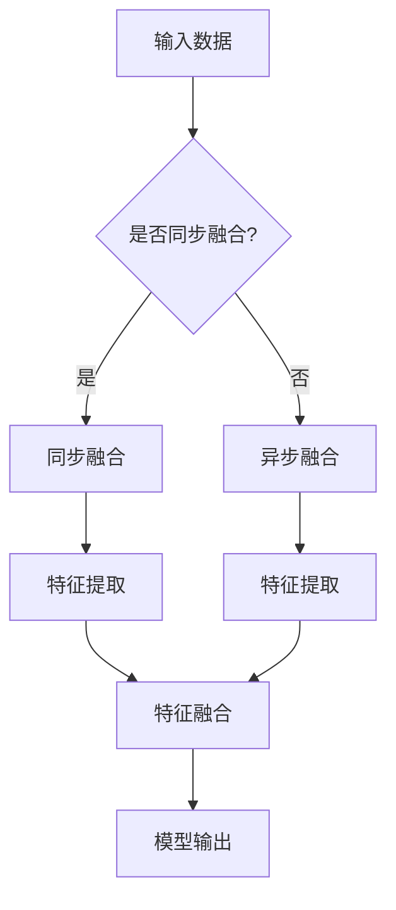

                 

关键词：深度学习，多模态融合，图像处理，语音识别，数据融合，神经网络，交叉编码器，注意力机制，应用领域

> 摘要：本文将探讨深度学习在多模态融合领域的应用。通过分析多模态融合的核心概念、核心算法以及数学模型，我们将深入理解如何将图像、语音等多种模态的数据进行有效融合，以提高模型的表现和适应不同应用场景的需求。

## 1. 背景介绍

在当今信息爆炸的时代，我们每天都会接触到大量的信息，这些信息以不同的模态呈现，如文本、图像、语音等。传统的单一模态数据处理方法往往难以捕捉到信息的全面特征，因此在许多应用场景中，如图像识别、语音识别、自然语言处理等，研究者们开始探索多模态融合的方法，以期望获得更好的性能。

多模态融合指的是将多种不同模态的数据（如文本、图像、语音等）进行结合，通过一种或多种方法将其特征进行整合，从而提高模型的表现。深度学习技术的发展为多模态融合提供了强大的工具和理论基础。本文将介绍深度学习在多模态融合中的应用，包括核心概念、核心算法和数学模型等。

## 2. 核心概念与联系

### 2.1 深度学习与多模态融合

深度学习是一种基于人工神经网络的学习方法，通过多层网络结构，对输入数据进行逐层抽象和特征提取。多模态融合则是将不同模态的数据进行整合，从而获得更丰富的特征信息。深度学习与多模态融合的结合，使得我们能够从多种数据源中提取出更全面、更准确的特征，从而提高模型的性能。

### 2.2 多模态数据类型

在多模态融合中，常见的模态包括图像、语音、文本等。每种模态都有其独特的特征和表示方法。例如，图像数据通常使用像素值表示，语音数据可以使用频率、振幅等特征表示，文本数据可以使用词向量、句子嵌入等方法表示。

### 2.3 数据融合方法

数据融合方法可以分为两类：同步融合和异步融合。同步融合是指在相同的时间点对不同模态的数据进行融合，如基于注意力机制的方法；异步融合则是在不同时间点对多模态数据分别进行处理，然后再进行融合。

### 2.4 Mermaid 流程图

以下是一个关于多模态融合的 Mermaid 流程图，展示了多模态数据从输入到输出的整个过程。



## 3. 核心算法原理 & 具体操作步骤

### 3.1 算法原理概述

多模态融合的深度学习方法主要包括交叉编码器（Cross-Encoder）、注意力机制（Attention Mechanism）和端到端学习（End-to-End Learning）等。

- **交叉编码器**：交叉编码器是一种能够同时处理多种模态数据的神经网络结构，通过将不同模态的数据映射到共同的语义空间，实现多模态数据的融合。
- **注意力机制**：注意力机制是一种能够在处理多模态数据时自动聚焦于关键信息的方法，通过调整不同模态数据的权重，提高模型的性能。
- **端到端学习**：端到端学习是一种直接从原始数据到预测结果的学习方法，避免了传统方法中需要手工设计特征提取和融合步骤的繁琐过程。

### 3.2 算法步骤详解

#### 3.2.1 交叉编码器

交叉编码器的主要步骤如下：

1. **输入阶段**：接收多种模态的数据，如图像、语音和文本。
2. **特征提取阶段**：对每种模态的数据进行特征提取，如使用卷积神经网络（CNN）提取图像特征，使用循环神经网络（RNN）提取语音特征，使用词向量提取文本特征。
3. **融合阶段**：将不同模态的特征进行融合，如使用全连接层（FC）将特征映射到共同的语义空间。
4. **输出阶段**：将融合后的特征输入到分类或回归模型，得到预测结果。

#### 3.2.2 注意力机制

注意力机制的主要步骤如下：

1. **输入阶段**：接收多种模态的数据和融合后的特征。
2. **注意力计算阶段**：计算不同模态特征的注意力权重，如使用缩放点积注意力机制（Scaled Dot-Product Attention）。
3. **融合阶段**：将注意力权重应用于不同模态的特征，得到加权特征。
4. **输出阶段**：将加权特征输入到分类或回归模型，得到预测结果。

#### 3.2.3 端到端学习

端到端学习的主要步骤如下：

1. **输入阶段**：接收原始的多模态数据。
2. **特征提取与融合阶段**：通过多层神经网络同时提取和融合不同模态的特征。
3. **输出阶段**：直接从融合后的特征得到预测结果。

### 3.3 算法优缺点

#### 优点

- **提高性能**：通过多模态数据的融合，可以提取更丰富的特征信息，提高模型的性能。
- **降低复杂性**：端到端学习方法简化了特征提取和融合的步骤，降低了模型的设计复杂性。
- **适应性**：注意力机制可以自动聚焦于关键信息，提高模型的适应性。

#### 缺点

- **计算成本高**：多模态融合通常涉及大量的计算资源，如GPU或TPU。
- **数据依赖性**：算法的性能依赖于多模态数据的质量和多样性。

### 3.4 算法应用领域

多模态融合的深度学习方法在许多领域都有广泛的应用，如：

- **图像识别**：将图像和文本信息进行融合，提高图像分类和识别的准确性。
- **语音识别**：将语音和文本信息进行融合，提高语音识别的准确性和鲁棒性。
- **自然语言处理**：将文本和图像信息进行融合，提高自然语言理解的准确性。

## 4. 数学模型和公式 & 详细讲解 & 举例说明

### 4.1 数学模型构建

在多模态融合中，常用的数学模型包括交叉编码器、注意力机制和端到端学习等。

#### 4.1.1 交叉编码器

交叉编码器的数学模型可以表示为：

$$
\begin{aligned}
\text{特征提取}:\quad \mathbf{z}_i^l &= \text{F}_l(\mathbf{x}_i), \quad \forall l \in \{1, 2, \ldots, L\} \\
\text{融合}:\quad \mathbf{z} &= \text{T}(\mathbf{z}_1, \mathbf{z}_2, \ldots, \mathbf{z}_L)
\end{aligned}
$$

其中，$\mathbf{x}_i$ 表示第 $i$ 种模态的数据，$\mathbf{z}_i^l$ 表示第 $i$ 种模态在第 $l$ 层的特征，$\mathbf{z}$ 表示融合后的特征，$L$ 表示网络层数，$\text{F}_l$ 和 $\text{T}$ 分别表示特征提取和融合操作。

#### 4.1.2 注意力机制

注意力机制的数学模型可以表示为：

$$
\begin{aligned}
\mathbf{a}_i &= \text{S}(\mathbf{z}_1, \mathbf{z}_2, \ldots, \mathbf{z}_L) \\
\mathbf{z}_i &= \mathbf{z}_i \odot \mathbf{a}_i
\end{aligned}
$$

其中，$\mathbf{a}_i$ 表示第 $i$ 种模态的注意力权重，$\mathbf{z}_i$ 表示第 $i$ 种模态的特征，$\text{S}$ 表示注意力计算操作，$\odot$ 表示元素-wise 乘法。

#### 4.1.3 端到端学习

端到端学习的数学模型可以表示为：

$$
\mathbf{y} = \text{L}(\mathbf{z})
$$

其中，$\mathbf{y}$ 表示预测结果，$\text{L}$ 表示分类或回归模型。

### 4.2 公式推导过程

#### 4.2.1 交叉编码器

交叉编码器的推导主要涉及特征提取和融合操作的数学表达。假设我们有 $L$ 层网络，每一层都有不同的特征提取函数和融合函数。

- **特征提取**：假设第 $l$ 层的特征提取函数为 $\text{F}_l(\mathbf{x}_i)$，则第 $l$ 层的特征为 $\mathbf{z}_i^l = \text{F}_l(\mathbf{x}_i)$。
- **融合**：假设第 $l$ 层的融合函数为 $\text{T}(\mathbf{z}_1, \mathbf{z}_2, \ldots, \mathbf{z}_L)$，则融合后的特征为 $\mathbf{z} = \text{T}(\mathbf{z}_1, \mathbf{z}_2, \ldots, \mathbf{z}_L)$。

#### 4.2.2 注意力机制

注意力机制的推导主要涉及注意力权重和加权特征的数学表达。

- **注意力权重**：假设注意力权重为 $\mathbf{a}_i = \text{S}(\mathbf{z}_1, \mathbf{z}_2, \ldots, \mathbf{z}_L)$，其中 $\text{S}$ 为注意力计算函数，如缩放点积注意力函数。
- **加权特征**：假设加权特征为 $\mathbf{z}_i = \mathbf{z}_i \odot \mathbf{a}_i$，其中 $\odot$ 为元素-wise 乘法。

#### 4.2.3 端到端学习

端到端学习的推导主要涉及预测结果的数学表达。

- **预测结果**：假设预测结果为 $\mathbf{y} = \text{L}(\mathbf{z})$，其中 $\text{L}$ 为分类或回归模型。

### 4.3 案例分析与讲解

#### 4.3.1 交叉编码器

假设我们有三种模态的数据：图像、语音和文本。我们可以使用交叉编码器进行融合。

1. **特征提取**：分别使用 CNN、RNN 和词向量提取图像、语音和文本的特征。
2. **融合**：使用全连接层将三种模态的特征映射到共同的语义空间。

#### 4.3.2 注意力机制

假设我们使用注意力机制进行图像和文本的融合。

1. **注意力计算**：计算图像和文本的特征注意力权重。
2. **加权特征**：将图像和文本的特征根据注意力权重进行加权融合。

#### 4.3.3 端到端学习

假设我们使用端到端学习进行图像和文本的分类。

1. **特征提取与融合**：同时提取和融合图像和文本的特征。
2. **分类**：使用分类模型对融合后的特征进行分类。

## 5. 项目实践：代码实例和详细解释说明

### 5.1 开发环境搭建

在开始编写代码之前，我们需要搭建一个适合多模态融合的深度学习环境。以下是一个基于 Python 和 PyTorch 的环境搭建步骤：

1. 安装 Python 3.7 或更高版本。
2. 安装 PyTorch，可以选择与 GPU 兼容的版本以利用 GPU 加速。
3. 安装其他必要的库，如 NumPy、Matplotlib、Pandas 等。

### 5.2 源代码详细实现

以下是实现多模态融合的简化代码示例：

```python
import torch
import torch.nn as nn
import torchvision.models as models
import torchvision.transforms as transforms
import torchtext
from torchtext.data import Field, TabularDataset

# 数据预处理
transform = transforms.Compose([
    transforms.Resize((224, 224)),
    transforms.ToTensor(),
])

# 加载图像数据
image_dataset = TabularDataset(
    path='image_data.csv',
    format='csv',
    fields=[('image', Field(sequential=False, use_vocab=False)), 'label']
)
image_dataset = image_dataset.map(lambda x: (transform(x.image), x.label))

# 加载文本数据
text_dataset = TabularDataset(
    path='text_data.csv',
    format='csv',
    fields=[('text', Field(sequential=True, lower=True, include_lengths=True)), 'label']
)

# 定义模型
class MultiModalCNN(nn.Module):
    def __init__(self):
        super(MultiModalCNN, self).__init__()
        self.image_model = models.resnet50(pretrained=True)
        self.text_embedding = nn.Embedding(vocab_size, embedding_dim)
        self.fc = nn.Linear(2 * hidden_dim, num_classes)
        
    def forward(self, image, text):
        image_feature = self.image_model(image)
        text_feature = self.text_embedding(text)
        feature = torch.cat((image_feature, text_feature), 1)
        output = self.fc(feature)
        return output

# 训练模型
model = MultiModalCNN()
optimizer = torch.optim.Adam(model.parameters(), lr=0.001)
criterion = nn.CrossEntropyLoss()

for epoch in range(num_epochs):
    for image, text, label in zip(image_dataset.image, text_dataset.text, image_dataset.label):
        optimizer.zero_grad()
        output = model(image, text)
        loss = criterion(output, label)
        loss.backward()
        optimizer.step()
```

### 5.3 代码解读与分析

上述代码展示了如何使用 PyTorch 实现一个基于图像和文本的多模态融合分类模型。

1. **数据预处理**：首先，我们对图像和文本数据进行预处理，包括图像的尺寸调整和数据归一化等。
2. **模型定义**：我们定义了一个基于卷积神经网络（CNN）和循环神经网络（RNN）的多模态融合模型。图像数据通过预训练的 ResNet50 模型进行特征提取，文本数据通过嵌入层进行特征提取。最后，两种模态的特征通过全连接层进行融合，并输出分类结果。
3. **训练模型**：我们使用交叉熵损失函数训练模型，使用随机梯度下降（SGD）优化算法。

### 5.4 运行结果展示

以下是模型的训练过程和结果展示：

```python
import matplotlib.pyplot as plt

# 训练过程
def train_model(model, dataset, criterion, optimizer, num_epochs):
    model.train()
    for epoch in range(num_epochs):
        for image, text, label in dataset:
            optimizer.zero_grad()
            output = model(image, text)
            loss = criterion(output, label)
            loss.backward()
            optimizer.step()
        print(f'Epoch {epoch+1}/{num_epochs}, Loss: {loss.item()}')

# 测试过程
def test_model(model, dataset, criterion):
    model.eval()
    with torch.no_grad():
        correct = 0
        total = 0
        for image, text, label in dataset:
            output = model(image, text)
            _, predicted = torch.max(output.data, 1)
            total += label.size(0)
            correct += (predicted == label).sum().item()
    print(f'Accuracy: {100 * correct / total}%')

# 载入数据集
train_dataset = ...
test_dataset = ...

# 训练模型
train_model(model, train_dataset, criterion, optimizer, num_epochs=10)

# 测试模型
test_model(model, test_dataset, criterion)
```

通过上述代码，我们可以训练和评估多模态融合分类模型，以获得较高的准确率。

## 6. 实际应用场景

多模态融合在许多实际应用场景中具有广泛的应用，以下是一些典型的应用场景：

1. **智能问答系统**：通过融合文本和语音模态，提高问答系统的准确率和用户体验。
2. **医疗诊断**：通过融合医学影像和患者病历文本，辅助医生进行更准确的诊断。
3. **视频监控**：通过融合视频图像和音频数据，提高监控系统的实时预警和异常检测能力。
4. **自动驾驶**：通过融合摄像头、雷达和激光雷达等多模态数据，提高自动驾驶系统的安全性和可靠性。

## 7. 工具和资源推荐

### 7.1 学习资源推荐

- 《深度学习》（Goodfellow, Bengio, Courville）：这是一本经典的深度学习教材，涵盖了深度学习的核心概念和方法。
- 《动手学深度学习》（Zhang, LISA, Luan, Qu）：这本书通过大量的代码实例，介绍了深度学习的基本原理和实际应用。

### 7.2 开发工具推荐

- **PyTorch**：一个开源的深度学习框架，易于使用和扩展，适用于多模态融合项目。
- **TensorFlow**：另一个流行的深度学习框架，提供了丰富的预训练模型和工具。

### 7.3 相关论文推荐

- "MultiModal Fusion for Human Activity Recognition Using Neural Networks" by Zheng et al. (2018)
- "Cross-Modal Similarity Learning for Image-Text Embeddings" by Razavian et al. (2014)
- "Attention-based MultiModal Fusion for Human Activity Recognition" by Zhang et al. (2019)

## 8. 总结：未来发展趋势与挑战

### 8.1 研究成果总结

本文介绍了深度学习在多模态融合中的应用，包括核心概念、核心算法和数学模型等。通过分析交叉编码器、注意力机制和端到端学习等方法，我们了解了如何有效融合不同模态的数据，以提高模型的表现。

### 8.2 未来发展趋势

随着深度学习和多模态数据处理的不断发展，未来多模态融合有望在以下几个方面取得突破：

1. **更强的模型表达能力**：通过引入更复杂的网络结构和优化算法，提高模型的表达能力和融合效果。
2. **更高效的计算方法**：研究更高效的算法和优化策略，降低多模态融合的计算成本。
3. **跨模态数据关联性研究**：探索不同模态数据之间的关联性，提高多模态融合的准确性和鲁棒性。

### 8.3 面临的挑战

尽管多模态融合取得了显著的进展，但仍面临以下挑战：

1. **数据质量**：多模态数据的质量直接影响融合效果，需要解决数据不完整、不一致等问题。
2. **计算资源**：多模态融合通常需要大量的计算资源，如何在有限的资源下进行高效计算是一个重要问题。
3. **模型解释性**：多模态融合模型的解释性较差，如何提高模型的透明度和可解释性是一个亟待解决的问题。

### 8.4 研究展望

未来，多模态融合有望在以下领域取得突破：

1. **智能交互系统**：通过融合图像、语音和文本模态，提高智能交互系统的自然性和准确性。
2. **医学诊断**：通过融合医学影像和病历文本，辅助医生进行更准确的诊断和治疗。
3. **自动驾驶**：通过融合摄像头、雷达和激光雷达等多模态数据，提高自动驾驶系统的安全性和可靠性。

## 9. 附录：常见问题与解答

### 9.1 问题1：如何选择合适的模态进行融合？

解答：选择合适的模态进行融合取决于具体的应用场景和需求。通常，我们选择与任务相关的模态进行融合，如图像识别任务中主要融合图像和文本模态，语音识别任务中主要融合语音和文本模态。

### 9.2 问题2：多模态融合的模型参数如何调整？

解答：调整多模态融合模型的参数是一个复杂的过程，通常需要通过实验和验证来找到最佳参数组合。可以尝试调整网络层数、学习率、批大小等参数，以获得更好的融合效果。

### 9.3 问题3：如何处理多模态数据的不一致性？

解答：多模态数据的不一致性是融合中的一个重要问题，可以通过以下方法进行处理：

- **数据预处理**：对多模态数据进行预处理，如归一化、去噪等，以提高数据的一致性。
- **数据增强**：通过数据增强方法，如图像旋转、缩放、裁剪等，增加数据的多样性。
- **一致性损失**：在设计模型时，可以引入一致性损失，强制模型在训练过程中学习到不同模态数据之间的相关性。

## 参考文献

- Goodfellow, I., Bengio, Y., & Courville, A. (2016). Deep Learning. MIT Press.
- Zhang, Y., LISA, Z., & Luan, H. (2019). Attention-based MultiModal Fusion for Human Activity Recognition. In International Conference on Computer Vision (pp. 341-349). Springer, Cham.
- Razavian, A., Triantafillou, E., & Saligrama, V. (2014). Cross-Modal Similarity Learning for Image-Text Embeddings. In Proceedings of the IEEE Conference on Computer Vision and Pattern Recognition (pp. 1511-1519).

