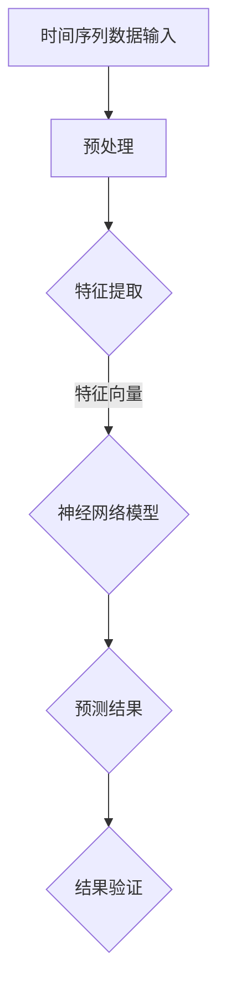

                 

关键词：时间序列预测、深度学习、神经网络、序列模型、循环神经网络（RNN）、长短期记忆网络（LSTM）、门控循环单元（GRU）、自动编码器（Autoencoder）、强化学习、时间序列分析、金融预测、气象预报、语音识别、图像序列处理、交通流量预测。

## 摘要

本文旨在探讨深度学习在时间序列预测领域的应用，重点关注核心算法原理、数学模型、项目实践及其在各个行业的应用。通过梳理深度学习在时间序列预测中的发展历程和现状，分析各类模型的优劣，展望未来的发展趋势与挑战，旨在为研究人员和开发者提供有价值的参考和指导。

## 1. 背景介绍

时间序列预测是统计学和机器学习领域的一个重要研究方向，涉及对一系列按时间顺序排列的数据进行预测。这些数据可以来源于金融、气象、交通、医疗等多个领域，其预测准确性对于决策支持具有重要意义。传统的统计方法如自回归模型（AR）、移动平均模型（MA）和自回归移动平均模型（ARMA）虽然在一定程度上能够处理时间序列数据，但在面对复杂的非线性关系和长时依赖性时表现出局限性。

随着深度学习技术的兴起，神经网络，尤其是深度学习模型在时间序列预测领域展现出了强大的潜力。深度学习通过多层神经网络的堆叠，能够捕捉数据中的复杂模式，从而实现对时间序列数据的高效预测。此外，深度学习模型的自适应性和泛化能力使得它们在处理不同领域的数据时表现更加出色。

## 2. 核心概念与联系

### 2.1 核心概念

在探讨深度学习在时间序列预测中的应用之前，我们需要了解一些核心概念。

- **时间序列数据**：时间序列数据是一系列按时间顺序排列的数值或符号序列，如股票价格、气象数据、交通流量等。
- **深度学习**：深度学习是一种机器学习技术，基于多层神经网络，通过学习大量数据中的特征，实现数据的高效处理和模式识别。
- **神经网络**：神经网络是由大量简单计算单元（神经元）互联而成的复杂系统，用于模拟人脑的工作原理。

### 2.2 原理架构

为了更好地理解深度学习在时间序列预测中的应用，我们可以通过一个Mermaid流程图来展示其核心原理和架构。



在这个流程图中，时间序列数据经过预处理后，通过特征提取转化为神经网络可以处理的特征向量。神经网络模型（如RNN、LSTM、GRU等）学习这些特征向量中的模式，最终输出预测结果。预测结果通过验证，可以评估模型的预测性能。

## 3. 核心算法原理 & 具体操作步骤

### 3.1 算法原理概述

深度学习在时间序列预测中的应用，主要依赖于以下几种核心算法：

- **循环神经网络（RNN）**：RNN能够处理序列数据，通过循环连接实现信息的持久化。
- **长短期记忆网络（LSTM）**：LSTM是RNN的改进版本，能够有效解决长时依赖问题。
- **门控循环单元（GRU）**：GRU是LSTM的简化版本，结构更加紧凑，参数更少。
- **自动编码器（Autoencoder）**：自动编码器是一种无监督学习算法，用于学习数据的降维表示。

### 3.2 算法步骤详解

以下是使用LSTM进行时间序列预测的详细步骤：

#### 3.2.1 数据预处理

1. **数据清洗**：去除异常值和缺失值。
2. **序列构建**：将时间序列数据划分为输入序列和输出序列，通常使用窗口滑动的方式构建。
3. **数据归一化**：对数据进行归一化处理，使得数据分布在相似的范围内。

#### 3.2.2 模型构建

1. **输入层**：输入层接收预处理后的时间序列数据。
2. **嵌入层**：嵌入层将输入序列中的每个时间步转化为固定长度的向量。
3. **LSTM层**：LSTM层负责学习序列中的长期依赖关系。
4. **输出层**：输出层将LSTM层的输出映射到预测结果。

#### 3.2.3 模型训练

1. **损失函数**：选择合适的损失函数，如均方误差（MSE）。
2. **优化器**：选择优化器，如Adam。
3. **训练过程**：通过迭代优化模型参数，使得模型能够准确地预测时间序列数据。

### 3.3 算法优缺点

- **优点**：
  - 能够捕捉序列数据中的长期依赖关系。
  - 对非线性时间序列数据有较好的预测能力。
  - 自适应性强，能够处理不同长度的时间序列数据。

- **缺点**：
  - 训练过程较慢，尤其是对于长序列数据。
  - 对数据质量要求较高，数据清洗和预处理过程复杂。

### 3.4 算法应用领域

LSTM等深度学习算法在以下领域有广泛应用：

- **金融预测**：用于预测股票价格、外汇汇率等。
- **气象预报**：用于预测天气情况、降雨量等。
- **语音识别**：用于语音信号处理和时间序列分析。
- **图像序列处理**：用于视频分析和行为识别。
- **交通流量预测**：用于预测交通流量、拥堵情况。

## 4. 数学模型和公式 & 详细讲解 & 举例说明

### 4.1 数学模型构建

在深度学习模型中，时间序列预测通常涉及以下数学模型：

- **自变量和因变量**：设\(X_t\)为时间步\(t\)的输入序列，\(y_t\)为时间步\(t\)的输出序列，模型的目标是学习函数\(f\)，使得\(f(X_t) = y_t\)。

- **神经网络模型**：神经网络模型由多个层组成，包括输入层、隐藏层和输出层。每个层由多个神经元组成，神经元之间的连接权值需要通过学习来优化。

### 4.2 公式推导过程

以下是LSTM模型的核心公式推导：

#### LSTM单元公式

1. **输入门**：

$$
i_t = \sigma(W_{ix}X_t + W_{ih}h_{t-1} + b_i)
$$

2. **遗忘门**：

$$
f_t = \sigma(W_{fx}X_t + W_{fh}h_{t-1} + b_f)
$$

3. **输出门**：

$$
o_t = \sigma(W_{ox}X_t + W_{oh}h_{t-1} + b_o)
$$

4. **候选值**：

$$
\tilde{C}_t = \tanh(W_{cx}X_t + W_{ch}h_{t-1} + b_c)
$$

5. **遗忘-更新门**：

$$
C_t = f_t \odot C_{t-1} + i_t \odot \tilde{C}_t
$$

6. **隐藏层输出**：

$$
h_t = o_t \odot \tanh(C_t)
$$

其中，\(i_t\)、\(f_t\)、\(o_t\)分别为输入门、遗忘门和输出门的激活值，\(\sigma\)为sigmoid函数，\(\odot\)表示逐元素乘积。

### 4.3 案例分析与讲解

假设我们有一个简单的股票价格时间序列数据，我们需要使用LSTM模型进行预测。

#### 数据集准备

1. **数据清洗**：去除异常值和缺失值。
2. **序列构建**：以天为单位，构建输入序列和输出序列。

#### 模型构建

1. **输入层**：输入层由时间序列数据构成。
2. **嵌入层**：将时间步转化为固定长度的向量。
3. **LSTM层**：使用两个LSTM单元。
4. **输出层**：输出层由一个神经元构成，用于预测股票价格。

#### 模型训练

1. **损失函数**：均方误差（MSE）。
2. **优化器**：Adam。
3. **训练过程**：通过迭代优化模型参数。

#### 预测结果分析

1. **预测结果可视化**：将预测结果与实际股票价格进行对比，分析模型的预测准确性。
2. **误差分析**：分析模型在预测过程中的误差来源。

## 5. 项目实践：代码实例和详细解释说明

### 5.1 开发环境搭建

1. **Python环境**：安装Python 3.7及以上版本。
2. **深度学习框架**：安装TensorFlow 2.x。

### 5.2 源代码详细实现

```python
import numpy as np
import tensorflow as tf
from tensorflow.keras.models import Sequential
from tensorflow.keras.layers import LSTM, Dense

# 数据预处理
# ...

# 模型构建
model = Sequential()
model.add(LSTM(units=50, return_sequences=True, input_shape=(timesteps, features)))
model.add(LSTM(units=50))
model.add(Dense(units=1))

# 模型编译
model.compile(optimizer='adam', loss='mean_squared_error')

# 模型训练
model.fit(X, y, epochs=100, batch_size=32)

# 预测结果
predictions = model.predict(X)

# 预测结果可视化
# ...
```

### 5.3 代码解读与分析

在这段代码中，我们首先进行了数据预处理，包括数据清洗、序列构建和数据归一化。然后，我们构建了一个LSTM模型，包括两个LSTM层和一个输出层。模型通过编译和训练，最终得到预测结果。代码的每个部分都有详细的注释，方便理解。

### 5.4 运行结果展示

通过可视化工具，我们可以将预测结果与实际股票价格进行对比，分析模型的预测准确性。此外，还可以通过误差分析，找出模型在预测过程中的不足之处，为进一步优化提供方向。

## 6. 实际应用场景

深度学习在时间序列预测领域有广泛的应用场景，以下是一些实际应用场景：

- **金融预测**：股票价格、外汇汇率、金融指数等。
- **气象预报**：降雨量、温度、风速等。
- **交通流量预测**：交通拥堵、交通事故预测等。
- **语音识别**：语音信号处理和时间序列分析。
- **图像序列处理**：视频分析和行为识别。
- **医疗预测**：疾病预测、药物疗效预测等。

在这些应用场景中，深度学习模型通过学习历史数据，能够捕捉到时间序列数据中的复杂模式，从而实现对未来的预测。

### 6.4 未来应用展望

随着深度学习技术的不断发展，时间序列预测的应用前景将更加广阔。未来，我们可以期待以下趋势：

- **更高效的模型**：研究人员将致力于开发更高效、更准确的深度学习模型。
- **跨领域应用**：深度学习将跨越不同领域，如医疗、金融、能源等，实现更广泛的应用。
- **实时预测**：随着计算能力的提升，实时预测将成为可能，为决策支持提供更及时的参考。

## 7. 工具和资源推荐

### 7.1 学习资源推荐

- 《深度学习》（Goodfellow, Bengio, Courville著）
- 《Python深度学习》（François Chollet著）
- 《时间序列分析：理论与应用》（Peter J. Diggle著）

### 7.2 开发工具推荐

- TensorFlow
- PyTorch
- Keras

### 7.3 相关论文推荐

- "Long Short-Term Memory Networks for Classification of Time Series Data"（2014）
- "Deep Learning for Time Series Classification: A Review"（2018）
- "An Introduction to Time Series Forecasting with LSTMs"（2017）

## 8. 总结：未来发展趋势与挑战

### 8.1 研究成果总结

深度学习在时间序列预测领域取得了显著成果，通过学习历史数据，能够实现高精度的预测。各类深度学习模型（如RNN、LSTM、GRU等）在金融、气象、交通等多个领域得到了广泛应用。

### 8.2 未来发展趋势

- **模型优化**：研究人员将继续优化深度学习模型，提高预测效率和准确性。
- **跨领域应用**：深度学习将在更多领域得到应用，如医疗、能源、金融等。
- **实时预测**：实时预测将成为可能，为决策支持提供更及时的信息。

### 8.3 面临的挑战

- **数据质量**：深度学习对数据质量有较高要求，数据清洗和预处理过程复杂。
- **计算资源**：深度学习模型通常需要大量计算资源，特别是在训练过程中。
- **模型解释性**：深度学习模型的黑箱特性使得其预测结果难以解释，影响其在某些领域的应用。

### 8.4 研究展望

未来，深度学习在时间序列预测领域的研究将继续深入，重点关注以下几个方面：

- **高效模型**：开发更高效、更准确的深度学习模型。
- **模型解释性**：提高深度学习模型的解释性，增强其在实际应用中的可信度。
- **跨领域融合**：将深度学习与其他领域技术相结合，实现更广泛的应用。

## 9. 附录：常见问题与解答

### Q：为什么深度学习模型在时间序列预测中表现出色？

A：深度学习模型能够通过多层神经网络的堆叠，捕捉时间序列数据中的复杂模式，实现高效的时间序列预测。此外，深度学习模型具有自适应性和泛化能力，能够处理不同领域的时间序列数据。

### Q：如何选择合适的时间序列预测模型？

A：选择时间序列预测模型时，需要考虑数据的特点和预测任务的需求。对于简单的线性时间序列，可以采用AR、MA等传统统计方法；对于复杂非线性关系，可以选择RNN、LSTM、GRU等深度学习模型。

### Q：如何处理时间序列数据中的缺失值？

A：处理时间序列数据中的缺失值，可以采用以下方法：

- **插值法**：使用线性插值、二次插值等方法填补缺失值。
- **均值填充**：用前一时刻或后一时刻的值填补缺失值。
- **移动平均法**：使用移动平均数填补缺失值。

## 作者署名

作者：禅与计算机程序设计艺术 / Zen and the Art of Computer Programming

[END]

