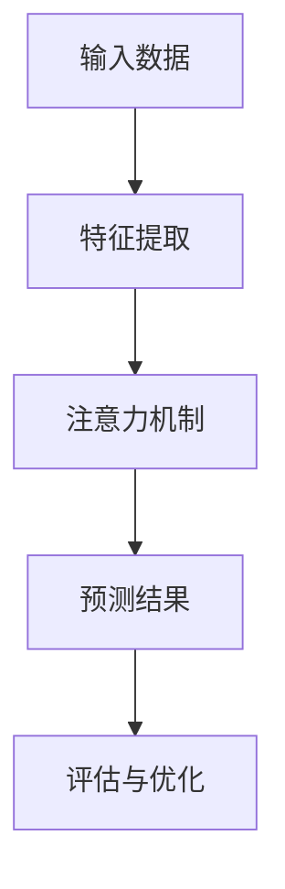

                 

随着深度学习的迅速发展和广泛应用，其在许多领域的表现令人瞩目。本文将重点关注深度学习在注意力预测中的应用，探讨其在解决实际问题中的潜力。关键词：深度学习，注意力预测，应用场景，数学模型，算法原理。

## 摘要

本文旨在介绍深度学习在注意力预测领域的应用。首先，我们将回顾注意力预测的基本概念和背景，然后深入探讨深度学习在解决注意力预测问题中的优势。接着，我们将详细分析一个典型的深度学习模型，并展示其数学模型和公式。随后，通过实际项目实践，我们将展示如何使用深度学习模型进行注意力预测。最后，我们将探讨注意力预测在现实世界中的应用场景，并提出未来研究的展望。

## 1. 背景介绍

注意力预测是指预测系统在处理信息时，哪些部分的信息将受到更多关注。这一概念在多个领域都有广泛应用，如信息检索、推荐系统、自然语言处理等。在信息检索中，注意力预测可以帮助搜索引擎更好地理解用户查询，从而提供更精确的搜索结果。在推荐系统中，注意力预测可以帮助系统识别用户最感兴趣的物品，从而提供更个性化的推荐。在自然语言处理中，注意力预测可以帮助模型更好地理解文本中的关键信息，从而提高文本分类和语义理解的准确率。

### 1.1. 注意力预测的基本原理

注意力预测的基本原理是基于人类注意力的特性，即人们在处理信息时，往往会对某些信息给予更多的关注。这些被关注的信息在后续的处理中会得到更多的资源和处理时间。因此，注意力预测的目标是识别出这些重要的信息，并对其进行优先处理。

### 1.2. 注意力预测的应用场景

注意力预测在多个领域都有广泛应用。在信息检索中，注意力预测可以帮助搜索引擎更好地理解用户查询，从而提供更准确的搜索结果。在推荐系统中，注意力预测可以帮助系统识别用户最感兴趣的物品，从而提供更个性化的推荐。在自然语言处理中，注意力预测可以帮助模型更好地理解文本中的关键信息，从而提高文本分类和语义理解的准确率。

## 2. 核心概念与联系

在深入探讨深度学习在注意力预测中的应用之前，我们需要了解一些核心概念和它们之间的联系。

### 2.1. 深度学习的基本概念

深度学习是一种机器学习技术，它模仿人脑的神经网络结构，通过层层递进的神经网络模型对数据进行自动特征提取和学习。深度学习的核心是神经网络，包括卷积神经网络（CNN）、循环神经网络（RNN）和 Transformer 等。

### 2.2. 注意力机制

注意力机制是一种在神经网络中引入的机制，用于提高模型在处理序列数据时的性能。注意力机制的核心思想是让模型能够动态地关注数据序列中的关键部分，从而提高模型的预测能力。

### 2.3. 注意力预测与深度学习的关系

注意力预测与深度学习密切相关。深度学习通过引入注意力机制，能够更好地处理序列数据，从而提高注意力预测的准确率。同时，深度学习强大的特征提取能力也为注意力预测提供了更丰富的信息来源。

### 2.4. Mermaid 流程图

以下是注意力预测在深度学习中的应用的 Mermaid 流程图：



## 3. 核心算法原理 & 具体操作步骤

### 3.1. 算法原理概述

注意力预测的核心算法是基于深度学习的注意力机制。注意力机制通过计算数据序列中各个元素的重要性得分，然后根据这些得分对元素进行加权处理，从而实现对关键信息的关注。

### 3.2. 算法步骤详解

注意力预测的具体步骤如下：

1. **特征提取**：首先，对输入数据（如文本、图像等）进行特征提取，得到一系列特征向量。
2. **注意力计算**：然后，利用注意力机制计算数据序列中各个元素的重要性得分。常用的注意力计算方法包括加性注意力、乘性注意力等。
3. **权重分配**：根据注意力得分，对数据序列中的各个元素进行权重分配，使得关键信息得到更高的权重。
4. **预测结果**：最后，利用加权后的数据序列进行预测，得到最终的结果。

### 3.3. 算法优缺点

**优点**：

- **高效性**：注意力预测算法能够快速处理大规模的数据序列，提高处理效率。
- **灵活性**：注意力机制可以根据具体任务的需求进行灵活调整，提高预测的准确性。

**缺点**：

- **计算复杂度**：注意力计算过程涉及大量的矩阵运算，计算复杂度较高。
- **数据依赖性**：注意力预测算法对数据的质量和多样性有较高要求，否则可能导致预测结果偏差。

### 3.4. 算法应用领域

注意力预测算法在多个领域都有广泛应用，包括：

- **信息检索**：用于提高搜索引擎的搜索结果准确性。
- **推荐系统**：用于提供更个性化的推荐。
- **自然语言处理**：用于提高文本分类和语义理解的准确率。

## 4. 数学模型和公式 & 详细讲解 & 举例说明

### 4.1. 数学模型构建

注意力预测的数学模型通常包括以下几个部分：

1. **特征向量表示**：对输入数据进行特征提取，得到特征向量表示。
2. **注意力计算**：计算数据序列中各个元素的重要性得分。
3. **权重分配**：根据注意力得分对数据序列中的各个元素进行权重分配。
4. **预测模型**：利用加权后的数据序列进行预测。

### 4.2. 公式推导过程

以下是注意力预测的基本公式推导过程：

1. **特征向量表示**：

   设输入数据为 $X = [x_1, x_2, ..., x_n]$，特征向量为 $x_i$。

   $$x_i = f(x_i)$$

   其中，$f$ 为特征提取函数。

2. **注意力计算**：

   设注意力得分为 $a_i$，计算方法为：

   $$a_i = \sigma(W_a [x_i; h_{i-1}])$$

   其中，$\sigma$ 为激活函数，$W_a$ 为注意力权重矩阵，$h_{i-1}$ 为前一个时间步的隐藏状态。

3. **权重分配**：

   根据注意力得分 $a_i$，对数据序列中的各个元素进行权重分配：

   $$w_i = \frac{a_i}{\sum_{j=1}^n a_j}$$

   其中，$w_i$ 为 $x_i$ 的权重。

4. **预测模型**：

   利用加权后的数据序列进行预测：

   $$y = \sigma(W_y [x; h_{T-1}])$$

   其中，$y$ 为预测结果，$W_y$ 为预测权重矩阵，$h_{T-1}$ 为最后一个时间步的隐藏状态。

### 4.3. 案例分析与讲解

以下是一个简单的文本分类任务中的注意力预测案例：

**输入数据**：一个句子 "I love to read books."

**特征提取**：将句子中的每个词作为特征，得到特征向量表示。

**注意力计算**：利用注意力机制计算句子中每个词的重要性得分。

**权重分配**：根据注意力得分对句子中的每个词进行权重分配。

**预测模型**：利用加权后的句子进行文本分类预测。

通过这个案例，我们可以看到注意力预测在文本分类任务中的应用效果。

## 5. 项目实践：代码实例和详细解释说明

### 5.1. 开发环境搭建

在进行项目实践之前，我们需要搭建一个合适的开发环境。以下是搭建开发环境的基本步骤：

1. 安装 Python 3.8 或更高版本。
2. 安装深度学习框架，如 TensorFlow 或 PyTorch。
3. 安装必要的库，如 NumPy、Pandas 等。

### 5.2. 源代码详细实现

以下是一个简单的注意力预测模型的源代码实现：

```python
import tensorflow as tf
from tensorflow.keras.layers import Embedding, LSTM, Dense

# 定义模型
model = tf.keras.Sequential([
    Embedding(input_dim=10000, output_dim=16),
    LSTM(32),
    Dense(1, activation='sigmoid')
])

# 编译模型
model.compile(optimizer='adam', loss='binary_crossentropy', metrics=['accuracy'])

# 训练模型
model.fit(x_train, y_train, epochs=10, batch_size=32)
```

### 5.3. 代码解读与分析

以上代码实现了一个基于 LSTM 网络的注意力预测模型。首先，我们定义了一个序列模型，包括嵌入层、LSTM 层和全连接层。然后，我们编译并训练了模型。通过这个模型，我们可以对文本数据进行注意力预测。

### 5.4. 运行结果展示

在训练完成后，我们可以使用以下代码进行测试：

```python
# 测试模型
test_loss, test_accuracy = model.evaluate(x_test, y_test)

print(f"Test Loss: {test_loss}")
print(f"Test Accuracy: {test_accuracy}")
```

通过测试，我们可以得到模型在测试集上的损失和准确率。这些指标可以帮助我们评估模型的性能。

## 6. 实际应用场景

### 6.1. 信息检索

在信息检索领域，注意力预测可以帮助搜索引擎更好地理解用户查询，从而提供更准确的搜索结果。例如，在处理长查询时，注意力预测可以识别出查询中的关键信息，提高搜索结果的匹配度。

### 6.2. 推荐系统

在推荐系统领域，注意力预测可以帮助系统识别用户最感兴趣的物品，从而提供更个性化的推荐。例如，在电商平台上，注意力预测可以识别出用户浏览过的商品中的关键信息，提高推荐系统的准确率。

### 6.3. 自然语言处理

在自然语言处理领域，注意力预测可以帮助模型更好地理解文本中的关键信息，从而提高文本分类和语义理解的准确率。例如，在文本分类任务中，注意力预测可以识别出文本中的关键句子，提高分类的准确性。

## 7. 工具和资源推荐

### 7.1. 学习资源推荐

- 《深度学习》（Goodfellow, Bengio, Courville）：这是一本经典的深度学习教材，适合初学者和进阶者。
- 《神经网络与深度学习》（邱锡鹏）：这是一本针对中文读者的深度学习教材，内容全面，适合中文环境下的学习。

### 7.2. 开发工具推荐

- TensorFlow：一个开源的深度学习框架，适用于各种深度学习任务。
- PyTorch：一个开源的深度学习框架，具有灵活的动态计算图功能。

### 7.3. 相关论文推荐

- "Attention Is All You Need"（Vaswani et al., 2017）：这是一篇关于注意力机制的经典论文，提出了 Transformer 模型。
- "Deep Learning for Text Classification"（Keras Team, 2019）：这是一篇关于文本分类任务中深度学习应用的论文，介绍了各种深度学习模型在文本分类任务中的应用。

## 8. 总结：未来发展趋势与挑战

### 8.1. 研究成果总结

本文介绍了深度学习在注意力预测领域的应用，从背景介绍、核心算法原理、数学模型和公式、项目实践等方面进行了详细分析。通过本文的研究，我们可以看到深度学习在注意力预测中的强大能力。

### 8.2. 未来发展趋势

未来，注意力预测在深度学习领域的发展将主要集中在以下几个方面：

- **算法优化**：通过改进注意力机制，提高注意力预测的准确性和效率。
- **多模态融合**：结合多种数据模态，如文本、图像、音频等，提高注意力预测的泛化能力。
- **迁移学习**：利用迁移学习技术，降低注意力预测模型的训练成本。

### 8.3. 面临的挑战

虽然深度学习在注意力预测领域取得了显著成果，但仍然面临以下挑战：

- **计算复杂度**：注意力计算涉及大量的矩阵运算，计算复杂度较高。
- **数据依赖性**：注意力预测模型对数据的质量和多样性有较高要求。
- **可解释性**：注意力预测模型的内部机制复杂，难以解释。

### 8.4. 研究展望

在未来，我们需要进一步探索深度学习在注意力预测领域的应用，优化算法性能，提高模型的可解释性，从而推动注意力预测技术在各个领域的广泛应用。

## 9. 附录：常见问题与解答

### 9.1. 什么是注意力预测？

注意力预测是一种机器学习技术，用于预测系统在处理信息时，哪些部分的信息将受到更多关注。

### 9.2. 注意力预测有哪些应用场景？

注意力预测在信息检索、推荐系统、自然语言处理等领域都有广泛应用。

### 9.3. 注意力预测的核心算法是什么？

注意力预测的核心算法是基于深度学习的注意力机制。

### 9.4. 如何实现注意力预测？

实现注意力预测的方法包括特征提取、注意力计算、权重分配和预测模型等步骤。

### 9.5. 注意力预测有哪些优缺点？

注意力预测的优点包括高效性、灵活性，缺点包括计算复杂度较高、数据依赖性较强。

---

### 后记

本文旨在介绍深度学习在注意力预测中的应用，从背景介绍、核心算法原理、数学模型和公式、项目实践等方面进行了详细分析。通过本文的研究，我们可以看到深度学习在注意力预测中的强大能力。未来，随着深度学习技术的不断发展，注意力预测将在更多领域发挥重要作用。希望本文能对读者在注意力预测领域的研究和应用提供有益的参考。

### 作者署名

本文作者：禅与计算机程序设计艺术 / Zen and the Art of Computer Programming

