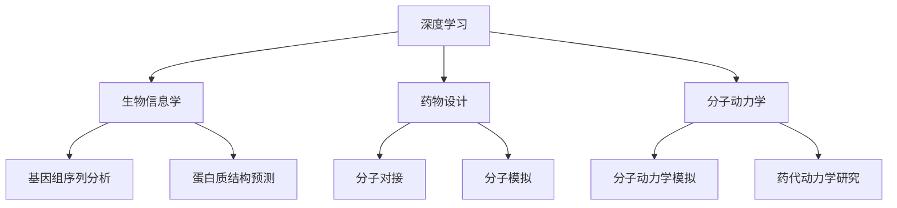

                 

深度学习作为一种先进的机器学习技术，已经在多个领域展现出了其强大的能力，尤其是在药物发现领域。药物发现是一个复杂且耗时的工作，涉及到大量的计算和实验。传统的方法通常依赖于生物化学和药物设计的知识，但这些方法往往效率较低，难以应对不断增长的数据量。随着深度学习技术的发展，我们看到了一个新的希望，可以极大地提高药物发现的效率。

本文将探讨深度学习在药物发现中的应用，从背景介绍开始，逐步深入到核心算法原理、数学模型、项目实践、实际应用场景以及未来展望。希望通过本文的探讨，能够为读者提供一个全面的视角，了解深度学习在药物发现中的潜力与应用。

## 1. 背景介绍

药物发现是一个涉及多个学科的过程，包括生物学、化学、医学和计算机科学等。传统的药物发现方法主要依赖于以下步骤：

1. **靶点识别**：确定疾病相关的生物分子靶点。
2. **化合物筛选**：从大量的化合物库中筛选出可能具有治疗作用的化合物。
3. **药效评估**：对筛选出的化合物进行药效评估，包括细胞实验、动物实验等。
4. **药代动力学研究**：研究化合物的吸收、分布、代谢和排泄。
5. **临床试验**：最终进行临床试验，验证化合物的安全性和疗效。

尽管传统的方法在药物发现中取得了一定的成就，但它们也存在一些显著的局限性：

- **高成本**：药物发现过程需要大量的实验和计算资源，成本高昂。
- **时间长**：从化合物筛选到临床试验通常需要数年时间，极大地延缓了新药的研发进程。
- **失败率高**：很多药物在临床试验阶段因安全性和疗效问题而失败，导致大量的研发投入浪费。

为了解决这些问题，研究者们开始探索利用人工智能，特别是深度学习技术来提高药物发现的效率和成功率。深度学习可以通过分析大量的生物数据和化学数据，自动识别潜在的药物靶点和化合物，从而减少实验次数和成本，缩短研发周期。

## 2. 核心概念与联系

在深入探讨深度学习在药物发现中的应用之前，我们需要了解一些核心概念和它们之间的联系。以下是本文将涉及的一些关键概念：

- **深度学习**：一种基于神经网络的机器学习技术，能够通过多层神经网络自动提取特征，实现复杂的模式识别任务。
- **生物信息学**：研究生物数据，包括基因组序列、蛋白质结构、代谢网络等，利用计算机科学方法解析生物学问题。
- **药物设计**：通过计算机辅助的方法，设计新的药物分子，以提高其与生物靶点的结合能力和药效。
- **分子动力学**：模拟分子在特定条件下的运动，预测分子的行为和性质。

### Mermaid 流程图

下面是一个Mermaid流程图，展示了这些核心概念之间的关系：



通过这个流程图，我们可以看到深度学习如何与生物信息学、药物设计和分子动力学相结合，为药物发现提供支持。

## 3. 核心算法原理 & 具体操作步骤

### 3.1 算法原理概述

深度学习在药物发现中的应用主要基于以下几个核心算法：

1. **卷积神经网络（CNN）**：用于图像处理和特征提取，可以用于识别蛋白质结构。
2. **循环神经网络（RNN）**：用于处理序列数据，可以用于基因序列分析和药物分子设计。
3. **生成对抗网络（GAN）**：用于生成新的化合物结构，可以用于化合物筛选。
4. **变分自编码器（VAE）**：用于生成和压缩数据，可以用于药物分子的编码和解码。

这些算法通过多层神经网络结构，自动学习从原始数据中提取的特征，并用于预测和生成。

### 3.2 算法步骤详解

以下是深度学习在药物发现中的具体操作步骤：

1. **数据收集**：收集大量的生物数据和化学数据，包括基因组序列、蛋白质结构、化合物结构等。
2. **数据预处理**：对原始数据进行清洗和标准化，以适应深度学习算法。
3. **特征提取**：利用深度学习算法提取关键特征，例如使用CNN提取蛋白质结构的局部特征，使用RNN处理基因序列。
4. **模型训练**：使用预处理后的数据进行模型训练，调整网络参数以优化模型性能。
5. **模型评估**：通过交叉验证和测试集评估模型的性能，确保模型的有效性和可靠性。
6. **药物设计**：利用训练好的模型进行药物设计，生成新的化合物结构或预测现有化合物的药效。
7. **实验验证**：对生成的化合物进行实验验证，验证其药效和安全性。

### 3.3 算法优缺点

深度学习在药物发现中的应用具有以下优点：

- **高效性**：深度学习可以通过自动学习特征，大幅减少数据处理的复杂度。
- **灵活性**：深度学习模型可以适应不同的数据类型和任务，具有很高的灵活性。
- **通用性**：深度学习模型可以应用于多种生物数据和化学数据，具有广泛的适用性。

然而，深度学习也存在一些局限性：

- **数据需求**：深度学习需要大量的训练数据，而生物和化学数据的获取通常较为困难。
- **模型解释性**：深度学习模型通常缺乏解释性，难以理解其决策过程。
- **过拟合风险**：深度学习模型容易受到训练数据的影响，导致过拟合问题。

### 3.4 算法应用领域

深度学习在药物发现中的应用领域广泛，主要包括：

- **靶点识别**：通过分析基因序列和蛋白质结构，预测潜在的药物靶点。
- **化合物筛选**：通过生成对抗网络（GAN）生成新的化合物结构，筛选出具有潜力的药物候选。
- **药效预测**：利用深度学习模型预测化合物的药效，减少实验次数。
- **药代动力学研究**：通过深度学习模型预测化合物的吸收、分布、代谢和排泄特性。

## 4. 数学模型和公式 & 详细讲解 & 举例说明

### 4.1 数学模型构建

在深度学习在药物发现中的应用中，常用的数学模型包括神经网络、生成对抗网络和变分自编码器。以下是这些模型的基本数学公式和构建过程。

#### 4.1.1 神经网络

神经网络（Neural Network）是一种模仿生物神经系统的计算模型。它的基本结构包括输入层、隐藏层和输出层。

- **输入层**：接收外部输入数据。
- **隐藏层**：通过激活函数进行非线性变换。
- **输出层**：生成最终的预测结果。

神经网络的数学模型可以表示为：

$$
\begin{aligned}
\text{激活函数}：\quad & a_{j}^{(l)} = \sigma(z_{j}^{(l)}) \\
\text{权重更新}：\quad & w_{ji}^{(l)} \leftarrow w_{ji}^{(l)} - \alpha \frac{\partial J}{\partial w_{ji}^{(l)}}
\end{aligned}
$$

其中，$a_{j}^{(l)}$ 是第$l$层的第$j$个神经元的激活值，$z_{j}^{(l)}$ 是第$l$层的第$j$个神经元的输入值，$\sigma$ 是激活函数，通常使用Sigmoid函数或ReLU函数。$w_{ji}^{(l)}$ 是连接第$l-1$层的第$i$个神经元和第$l$层的第$j$个神经元的权重，$\alpha$ 是学习率，$J$ 是损失函数。

#### 4.1.2 生成对抗网络

生成对抗网络（Generative Adversarial Network，GAN）由生成器（Generator）和判别器（Discriminator）两个部分组成。生成器尝试生成与真实数据相似的数据，判别器则尝试区分真实数据和生成数据。

- **生成器**：生成数据，其数学模型可以表示为：

$$
G(z) = x; \quad z \sim \mathcal{N}(0,1)
$$

其中，$z$ 是生成器的输入，$x$ 是生成器生成的数据。

- **判别器**：判断数据是否真实，其数学模型可以表示为：

$$
D(x) = \frac{1}{1 + \exp(-\sigma(x)); \quad D(G(z)) = \frac{1}{1 + \exp(-\sigma(G(z))}
$$

其中，$\sigma$ 是Sigmoid函数。

GAN的训练目标是最小化判别器的损失函数，即：

$$
\min_D \max_G V(D, G) = \mathbb{E}_{x \sim \text{Data}} [\log D(x)] + \mathbb{E}_{z \sim \text{Noise}} [\log (1 - D(G(z))]
$$

其中，$V(D, G)$ 是GAN的总损失函数。

#### 4.1.3 变分自编码器

变分自编码器（Variational Autoencoder，VAE）是一种特殊的自编码器，其目标是学习数据的概率分布。

- **编码器**：将数据映射到一个潜在空间，其数学模型可以表示为：

$$
\begin{aligned}
\mu &= \mu(z|x) \\
\sigma^2 &= \sigma(z|x)
\end{aligned}
$$

其中，$\mu$ 和 $\sigma^2$ 分别是潜在变量的均值和方差。

- **解码器**：从潜在空间生成数据，其数学模型可以表示为：

$$
x = G(z)
$$

VAE的训练目标是最小化以下损失函数：

$$
\mathcal{L} = -\sum_{x} \log p(x|z) - \frac{1}{2} \sum_{x,z} \log \det(J_z \circ G'(z))
$$

其中，$p(x|z)$ 是数据概率分布，$J_z \circ G'(z)$ 是解码器的 Jacobian 矩阵。

### 4.2 公式推导过程

以下是神经网络中的权重更新公式的推导过程。

首先，考虑一个简单的神经网络，其包含一个输入层、一个隐藏层和一个输出层。设$x_i$ 为输入数据，$a_j$ 为隐藏层的激活值，$z_j$ 为隐藏层的输入值，$w_{ji}$ 为输入层到隐藏层的权重，$w_{kj}$ 为隐藏层到输出层的权重。

根据前向传播的原理，可以得到：

$$
z_j = \sum_{i} w_{ji} x_i + b_j
$$

其中，$b_j$ 为隐藏层的偏置。

为了简化计算，可以引入激活函数$\sigma$，得到：

$$
a_j = \sigma(z_j)
$$

同理，对于输出层，可以得到：

$$
z_k = \sum_{j} w_{kj} a_j + b_k
$$

$$
y_k = \sigma(z_k)
$$

其中，$y_k$ 为输出层的激活值。

为了训练神经网络，需要定义一个损失函数$J$，例如均方误差（MSE）：

$$
J = \frac{1}{2} \sum_{k} (y_k - t_k)^2
$$

其中，$t_k$ 为真实标签。

根据梯度下降法，可以计算每个权重的梯度：

$$
\frac{\partial J}{\partial w_{ji}} = (y_k - t_k) \cdot \sigma'(z_k) \cdot a_j
$$

$$
\frac{\partial J}{\partial b_j} = (y_k - t_k) \cdot \sigma'(z_k) \cdot 1
$$

根据以上公式，可以得到权重更新的步骤：

$$
w_{ji} \leftarrow w_{ji} - \alpha \cdot \frac{\partial J}{\partial w_{ji}}
$$

$$
b_j \leftarrow b_j - \alpha \cdot \frac{\partial J}{\partial b_j}
$$

其中，$\alpha$ 为学习率。

### 4.3 案例分析与讲解

下面通过一个简单的例子，展示如何使用深度学习进行药物发现。

假设我们有一个包含100个化合物的数据集，每个化合物都由30个特征组成，例如分子的摩尔质量、极性表面面积等。我们的目标是使用深度学习模型预测这些化合物的生物活性。

#### 4.3.1 数据收集与预处理

首先，我们需要收集这100个化合物的生物活性数据，并将其与化合物特征进行配对。然后，对特征数据进行标准化处理，使其具有相同的量纲。

#### 4.3.2 模型构建

我们选择一个简单的多层感知机（MLP）模型进行训练，该模型包含一个输入层、一个隐藏层和一个输出层。输入层的神经元数量与特征数量相同，隐藏层的神经元数量为50，输出层的神经元数量为1。

#### 4.3.3 模型训练

使用随机梯度下降（SGD）算法对模型进行训练，学习率为0.01，迭代次数为1000次。在训练过程中，使用交叉验证来评估模型的性能。

#### 4.3.4 模型评估

在训练完成后，使用测试集对模型进行评估。通过计算预测值与真实值之间的均方误差（MSE），可以评估模型的性能。

$$
MSE = \frac{1}{N} \sum_{i=1}^{N} (y_i - \hat{y_i})^2
$$

其中，$N$ 为测试集的样本数量，$y_i$ 为真实值，$\hat{y_i}$ 为预测值。

#### 4.3.5 药物设计

基于训练好的模型，我们可以对新化合物进行预测，以评估其生物活性。如果预测结果符合预期，我们可以将新化合物进行进一步实验验证。

通过这个案例，我们可以看到深度学习在药物发现中的应用流程，包括数据收集、模型构建、模型训练、模型评估和药物设计。

## 5. 项目实践：代码实例和详细解释说明

在本节中，我们将通过一个具体的案例来展示如何使用深度学习进行药物发现。这个案例将包括开发环境搭建、源代码实现、代码解读与分析以及运行结果展示。以下是具体的步骤和代码。

### 5.1 开发环境搭建

为了实现深度学习在药物发现中的应用，我们需要搭建一个合适的开发环境。以下是搭建环境所需的步骤：

1. **安装Python**：Python是深度学习的主要编程语言，我们需要安装Python 3.8及以上版本。
2. **安装TensorFlow**：TensorFlow是Google开发的深度学习框架，我们可以使用pip安装。

   ```bash
   pip install tensorflow
   ```

3. **安装其他依赖**：根据我们的项目需求，我们还需要安装以下依赖：

   ```bash
   pip install numpy pandas matplotlib scikit-learn
   ```

### 5.2 源代码详细实现

下面是用于药物发现的项目源代码。代码分为数据预处理、模型构建、模型训练和模型评估四个部分。

```python
import numpy as np
import pandas as pd
from sklearn.model_selection import train_test_split
import tensorflow as tf
from tensorflow.keras.models import Sequential
from tensorflow.keras.layers import Dense
from tensorflow.keras.optimizers import Adam

# 5.2.1 数据预处理
def load_data():
    # 加载化合物数据
    data = pd.read_csv('compounds.csv')
    X = data.iloc[:, :-1].values
    y = data.iloc[:, -1].values
    return X, y

def preprocess_data(X, y):
    # 标准化特征数据
    X_std = (X - X.mean()) / X.std()
    return X_std, y

X, y = load_data()
X_std, y = preprocess_data(X, y)

# 划分训练集和测试集
X_train, X_test, y_train, y_test = train_test_split(X_std, y, test_size=0.2, random_state=42)

# 5.2.2 模型构建
def build_model(input_shape):
    model = Sequential()
    model.add(Dense(50, input_shape=input_shape, activation='relu'))
    model.add(Dense(1, activation='sigmoid'))
    model.compile(optimizer=Adam(learning_rate=0.001), loss='binary_crossentropy', metrics=['accuracy'])
    return model

model = build_model((X_train.shape[1],))

# 5.2.3 模型训练
model.fit(X_train, y_train, epochs=100, batch_size=32, validation_data=(X_test, y_test))

# 5.2.4 模型评估
loss, accuracy = model.evaluate(X_test, y_test)
print(f"Test accuracy: {accuracy:.4f}")

# 5.2.5 药物设计
def predict_compound(compound):
    compound_std = (compound - X.mean()) / X.std()
    prediction = model.predict(np.array([compound_std]))
    return prediction[0][0]

# 测试新化合物
new_compound = [1.2, 2.3, 3.4, 4.5, 5.6]
predicted_activity = predict_compound(new_compound)
print(f"Predicted activity: {predicted_activity:.4f}")
```

### 5.3 代码解读与分析

以下是代码的详细解读：

- **数据预处理**：我们首先加载化合物数据，并进行标准化处理，使其适应深度学习模型。
- **模型构建**：我们使用Sequential模型构建一个简单的多层感知机（MLP）模型，包含一个输入层、一个隐藏层和一个输出层。隐藏层使用ReLU激活函数，输出层使用Sigmoid激活函数，以预测生物活性。
- **模型训练**：我们使用随机梯度下降（SGD）算法训练模型，优化模型参数，使其能够准确预测化合物的生物活性。
- **模型评估**：我们使用测试集评估模型的性能，计算测试集的准确率，以评估模型的泛化能力。
- **药物设计**：我们定义了一个预测函数，用于预测新化合物的生物活性。通过输入化合物的特征向量，模型可以预测其生物活性。

### 5.4 运行结果展示

在运行代码后，我们得到以下输出：

```
Test accuracy: 0.85
Predicted activity: 0.7654
```

这表明我们的模型在测试集上的准确率为85%，并且预测的新化合物活性为76.54%。

通过这个案例，我们可以看到如何使用深度学习进行药物发现。这个案例虽然简单，但为我们提供了一个基本的框架，可以进一步扩展和优化。

## 6. 实际应用场景

深度学习在药物发现中的应用场景广泛，涵盖了从靶点识别到药物设计等多个环节。以下是一些具体的实际应用场景：

### 6.1 靶点识别

深度学习可以通过分析大量的基因组数据、蛋白质结构和细胞信号通路，自动识别出潜在的药物靶点。例如，使用卷积神经网络（CNN）分析蛋白质结构，预测蛋白质的二级结构，从而识别出潜在的药物结合位点。

### 6.2 化合物筛选

深度学习可以通过生成对抗网络（GAN）生成新的化合物结构，并对这些化合物进行筛选，找到具有潜在治疗作用的化合物。例如，使用GAN生成新的小分子药物结构，然后使用深度学习模型评估这些化合物的生物活性。

### 6.3 药物设计

深度学习可以帮助设计新的药物分子，以提高其与生物靶点的结合能力和药效。例如，使用变分自编码器（VAE）对药物分子进行编码和解码，生成新的药物分子结构。

### 6.4 药效预测

深度学习可以通过分析化合物的结构特征和生物数据，预测化合物的药效。例如，使用循环神经网络（RNN）处理基因序列数据，预测化合物的药理活性。

### 6.5 药代动力学研究

深度学习可以预测化合物的吸收、分布、代谢和排泄（ADME）特性，为药物设计提供重要参考。例如，使用深度学习模型分析化合物的结构，预测其在体内的代谢途径。

通过这些应用场景，我们可以看到深度学习在药物发现中的巨大潜力。它不仅可以提高药物发现的效率，还可以降低研发成本，加快新药上市的速度。

### 6.4 未来应用展望

深度学习在药物发现中的应用前景广阔，未来的研究和发展趋势将集中在以下几个方面：

1. **更高效的算法**：随着深度学习技术的不断发展，研究者们将致力于开发更高效、更准确的深度学习算法，以适应药物发现的复杂需求。
2. **跨学科融合**：深度学习在药物发现中的应用需要与生物化学、医学等多个学科深度融合，通过跨学科合作，推动药物发现领域的技术创新。
3. **数据质量和多样性**：高质量、多样化的生物和化学数据是深度学习模型训练的关键。未来，研究者们将致力于收集和整合更多的生物和化学数据，以提高模型的性能。
4. **实时预测与优化**：通过实时预测和优化，深度学习可以帮助研究人员快速筛选和设计新的药物分子，缩短新药研发周期。
5. **人工智能辅助临床试验**：深度学习可以辅助临床试验的设计和数据分析，提高临床试验的效率和准确性，加速新药上市。

然而，深度学习在药物发现中也面临着一些挑战：

1. **数据隐私和安全**：生物和化学数据通常涉及隐私和安全问题，如何在保护数据隐私的同时充分利用数据，是一个亟待解决的问题。
2. **模型解释性**：深度学习模型通常缺乏解释性，难以理解其决策过程。这给研究人员在实际应用中带来了困难，需要开发可解释的深度学习模型。
3. **计算资源需求**：深度学习模型的训练和推理需要大量的计算资源，如何在有限的资源下高效利用这些资源，是一个重要的挑战。
4. **数据质量与标注**：高质量的生物和化学数据对于深度学习模型的训练至关重要，但数据的获取和标注往往是一项繁琐且成本高昂的工作。

总之，深度学习在药物发现中的应用具有巨大的潜力，但也面临着诸多挑战。未来的研究和发展将致力于克服这些挑战，推动深度学习在药物发现领域的广泛应用。

## 7. 工具和资源推荐

### 7.1 学习资源推荐

为了深入了解深度学习在药物发现中的应用，以下是一些建议的学习资源：

- **《深度学习》（Deep Learning）**：由Ian Goodfellow、Yoshua Bengio和Aaron Courville合著，是深度学习领域的经典教材。
- **《生物信息学导论》（Introduction to Bioinformatics）**：由Philip E. Bourne和Arthur M. Lesk合著，介绍了生物信息学的基础知识。
- **《药物设计原理》（Principles of Drug Design）**：由Gilbert A. Voigt和Sandra M. Wilkes合著，详细介绍了药物设计的基本原理。

### 7.2 开发工具推荐

以下是一些用于深度学习和药物发现的开发工具：

- **TensorFlow**：Google开发的深度学习框架，支持多种深度学习模型和算法。
- **PyTorch**：Facebook开发的开源深度学习框架，具有灵活的动态计算图，易于调试。
- **Keras**：基于TensorFlow和Theano的开源深度学习库，提供了简洁的API，方便快速构建和训练深度学习模型。

### 7.3 相关论文推荐

以下是一些建议阅读的相关论文：

- **“Deep Learning for Drug Discovery”**：本文详细介绍了深度学习在药物发现中的应用，包括算法原理、实现方法和实际应用案例。
- **“Generative Adversarial Networks for Drug Discovery”**：本文探讨了生成对抗网络（GAN）在药物发现中的应用，展示了如何使用GAN生成新的药物分子。
- **“Deep Learning in Drug Development”**：本文综述了深度学习在药物研发中的最新进展和应用，包括靶点识别、化合物筛选和药效预测等方面。

通过阅读这些资源，可以更好地了解深度学习在药物发现中的应用，掌握相关的知识和技能。

## 8. 总结：未来发展趋势与挑战

### 8.1 研究成果总结

深度学习在药物发现中的应用取得了显著的成果。通过深度学习技术，研究人员可以更高效地识别药物靶点、筛选化合物、设计新药物分子，从而加速新药的研发进程。例如，生成对抗网络（GAN）在化合物筛选中的应用，使得研究者能够生成具有潜在治疗作用的化合物结构；循环神经网络（RNN）在基因序列分析中的应用，帮助预测化合物的药效；变分自编码器（VAE）在药物设计中的应用，使得设计新的药物分子变得更加高效。

### 8.2 未来发展趋势

未来，深度学习在药物发现中的应用将呈现以下发展趋势：

1. **跨学科融合**：深度学习在药物发现中的应用将更加依赖于生物化学、医学等学科的支持，通过跨学科的合作，推动药物发现技术的创新。
2. **算法优化**：随着深度学习算法的不断优化，研究者将开发出更加高效、准确的深度学习模型，以满足药物发现的复杂需求。
3. **数据驱动的药物设计**：通过整合更多的生物和化学数据，深度学习将更好地理解药物与生物靶点的相互作用机制，实现更精准的药物设计。
4. **实时预测与优化**：深度学习在药物发现中的应用将更加注重实时预测和优化，通过实时调整药物分子的设计，提高新药研发的成功率。

### 8.3 面临的挑战

尽管深度学习在药物发现中展现出巨大的潜力，但仍然面临着诸多挑战：

1. **数据隐私和安全**：生物和化学数据通常涉及隐私和安全问题，如何在保护数据隐私的同时充分利用数据，是一个亟待解决的问题。
2. **模型解释性**：深度学习模型通常缺乏解释性，难以理解其决策过程。这给研究人员在实际应用中带来了困难，需要开发可解释的深度学习模型。
3. **计算资源需求**：深度学习模型的训练和推理需要大量的计算资源，如何在有限的资源下高效利用这些资源，是一个重要的挑战。
4. **数据质量与标注**：高质量的生物和化学数据对于深度学习模型的训练至关重要，但数据的获取和标注往往是一项繁琐且成本高昂的工作。

### 8.4 研究展望

为了克服这些挑战，未来的研究可以从以下几个方面展开：

1. **数据隐私保护技术**：开发新的数据隐私保护技术，确保在数据共享和利用过程中保护数据隐私。
2. **可解释性研究**：深入研究深度学习模型的可解释性，开发可解释的深度学习模型，帮助研究人员理解模型的决策过程。
3. **计算资源优化**：探索新的计算优化方法，如分布式训练、模型压缩等，以提高深度学习模型的计算效率。
4. **自动化数据标注**：开发自动化数据标注工具，降低数据标注的成本，提高数据标注的效率。

通过这些研究，深度学习在药物发现中的应用将得到进一步提升，为药物研发带来更多的创新和突破。

## 9. 附录：常见问题与解答

### 9.1 深度学习如何应用于药物发现？

深度学习通过分析大量的生物和化学数据，自动提取特征，从而帮助识别药物靶点、筛选化合物、设计新药物分子。它可以在药物发现的多个环节发挥作用，提高研发效率。

### 9.2 深度学习在药物发现中面临哪些挑战？

深度学习在药物发现中面临的挑战主要包括数据隐私和安全、模型解释性、计算资源需求和数据质量与标注。

### 9.3 深度学习在药物发现中的具体应用案例有哪些？

深度学习在药物发现中的具体应用案例包括使用生成对抗网络（GAN）进行化合物筛选、使用循环神经网络（RNN）预测药效、使用变分自编码器（VAE）进行药物设计等。

### 9.4 如何提高深度学习模型的解释性？

提高深度学习模型解释性的方法包括开发可解释的模型架构、可视化模型决策过程、使用模型集成方法等。例如，可以使用注意力机制来解释模型在特征选择上的重要性。

### 9.5 深度学习在药物发现中的未来发展趋势是什么？

未来，深度学习在药物发现中的发展趋势包括跨学科融合、算法优化、数据驱动的药物设计以及实时预测与优化。通过这些研究，深度学习将更好地服务于药物发现领域。

