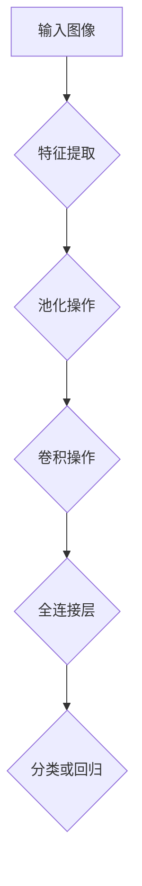

                 

在当今信息化时代，计算机视觉（Computer Vision）作为人工智能（AI）的一个重要分支，正经历着前所未有的快速发展。深度学习（Deep Learning）作为近年来计算机视觉领域的重要技术突破，为图像识别、目标检测、图像生成等任务提供了强大的工具。本文将深入探讨深度学习在计算机视觉中的最新进展，从核心概念、算法原理、数学模型、实际应用等方面展开详细分析。

## 文章关键词

- 深度学习
- 计算机视觉
- 图像识别
- 目标检测
- 图像生成

## 文章摘要

本文首先介绍了计算机视觉和深度学习的背景知识，接着讨论了深度学习在计算机视觉中的应用，包括核心算法、数学模型和具体实现。通过实例分析，展示了深度学习在实际项目中的效果。最后，本文对未来深度学习在计算机视觉领域的发展趋势进行了展望，并提出了面临的挑战和未来研究方向。

### 1. 背景介绍

计算机视觉是一门研究如何使计算机能够从图像或视频中自动提取信息并执行特定任务的学科。自20世纪80年代以来，计算机视觉取得了显著进展，但在某些复杂任务上仍存在局限性。传统的计算机视觉方法主要依赖于手工设计的特征提取和分类器，这些方法虽然在某些特定场景下取得了不错的性能，但无法应对多样化的图像和视频数据。

随着深度学习的兴起，计算机视觉领域迎来了新的变革。深度学习通过模拟人脑的神经网络结构，通过大规模数据训练，自动提取具有层次性的特征表示，从而在图像分类、目标检测、图像生成等任务中取得了突破性成果。特别是在2012年，深度卷积神经网络（CNN）在ImageNet图像识别挑战赛中取得了显著领先，这标志着深度学习在计算机视觉领域的崛起。

### 2. 核心概念与联系

#### 2.1 深度学习的核心概念

深度学习是一种基于多层神经网络的学习方法，通过逐层提取图像的层次化特征表示，从而实现复杂的图像理解和任务。深度学习的基本单元是神经元，它们通过前向传播和反向传播算法，对输入数据进行学习和调整。

#### 2.2 计算机视觉中的深度学习架构

在计算机视觉中，深度学习通常采用卷积神经网络（CNN）作为主要架构。CNN由多个卷积层、池化层和全连接层组成，通过卷积操作提取图像的特征，池化操作降低特征图的维度，全连接层进行分类或回归任务。

#### 2.3 Mermaid 流程图

以下是一个简化的深度学习在计算机视觉中的流程图：



### 3. 核心算法原理 & 具体操作步骤

#### 3.1 算法原理概述

深度学习在计算机视觉中的核心算法是卷积神经网络（CNN）。CNN通过卷积层、池化层和全连接层的组合，实现对图像的自动特征提取和分类。卷积层利用卷积操作提取图像的局部特征，池化层降低特征图的维度，全连接层完成分类或回归任务。

#### 3.2 算法步骤详解

1. **输入层**：输入一张图像，图像大小通常为 $224 \times 224$ 或 $299 \times 299$。
2. **卷积层**：使用卷积核对输入图像进行卷积操作，提取图像的局部特征。卷积核的大小通常为 $3 \times 3$ 或 $5 \times 5$。
3. **激活函数**：对卷积层的输出进行激活函数处理，常用的激活函数有ReLU（Rectified Linear Unit）和Sigmoid。
4. **池化层**：对卷积层的输出进行池化操作，常用的池化方式有最大池化和平均池化，池化窗口大小通常为 $2 \times 2$。
5. **全连接层**：将池化层的输出进行全连接操作，将图像的特征表示转换为分类或回归的结果。
6. **输出层**：根据训练任务，输出层的输出可以是分类概率或回归结果。

#### 3.3 算法优缺点

**优点**：
- 自动提取特征：深度学习能够自动从大规模数据中提取具有层次性的特征表示，无需手工设计特征。
- 高效性能：深度学习在计算机视觉任务中取得了显著的性能提升，特别是在图像分类和目标检测任务中。
- 泛化能力：深度学习通过大规模数据训练，能够泛化到未知数据上，具有较好的鲁棒性。

**缺点**：
- 需要大量数据：深度学习训练需要大量高质量的数据，数据获取和处理成本较高。
- 需要大量计算资源：深度学习训练需要大量计算资源，对硬件设备要求较高。
- 参数调优复杂：深度学习模型训练过程中需要调整大量参数，参数调优过程复杂。

#### 3.4 算法应用领域

深度学习在计算机视觉中的应用领域广泛，包括但不限于：
- 图像分类：对图像进行分类，如人脸识别、物体分类等。
- 目标检测：检测图像中的目标物体，如行人检测、车辆检测等。
- 图像生成：生成新的图像，如图像风格迁移、图像生成对抗网络（GAN）等。
- 增强现实（AR）：在现实场景中叠加虚拟图像，如AR眼镜等。

### 4. 数学模型和公式 & 详细讲解 & 举例说明

#### 4.1 数学模型构建

深度学习中的数学模型主要包括神经网络、卷积操作、激活函数等。

- **神经网络**：神经网络由多个神经元组成，每个神经元接收输入，通过权重和偏置计算输出。神经网络通过前向传播和反向传播算法进行训练。

- **卷积操作**：卷积操作是深度学习中的核心操作，用于提取图像的特征。卷积操作通过卷积核与图像进行卷积，从而得到特征图。

- **激活函数**：激活函数用于对神经网络的输出进行非线性变换，常用的激活函数有ReLU、Sigmoid等。

#### 4.2 公式推导过程

以卷积操作为例，卷积操作的公式如下：

$$
\text{output}(i, j) = \sum_{x=0}^{k-1} \sum_{y=0}^{k-1} w_{x,y} \cdot \text{input}(i-x, j-y)
$$

其中，$w_{x,y}$ 表示卷积核的权重，$\text{input}(i-x, j-y)$ 表示输入图像上的像素值。

#### 4.3 案例分析与讲解

假设我们有一个 $3 \times 3$ 的卷积核，权重为 $w_{0,0}=1, w_{0,1}=2, w_{0,2}=3, w_{1,0}=4, w_{1,1}=5, w_{1,2}=6, w_{2,0}=7, w_{2,1}=8, w_{2,2}=9$，输入图像为一个 $3 \times 3$ 的矩阵：

$$
\text{input} =
\begin{bmatrix}
1 & 2 & 3 \\
4 & 5 & 6 \\
7 & 8 & 9 \\
\end{bmatrix}
$$

根据卷积操作的公式，我们可以计算出卷积层的输出：

$$
\text{output} =
\begin{bmatrix}
26 & 28 & 30 \\
46 & 48 & 50 \\
66 & 68 & 70 \\
\end{bmatrix}
$$

### 5. 项目实践：代码实例和详细解释说明

#### 5.1 开发环境搭建

为了实现深度学习在计算机视觉中的应用，我们需要搭建一个合适的开发环境。以下是搭建Python深度学习环境的一些步骤：

1. 安装Python：版本要求为3.6及以上。
2. 安装深度学习框架：如TensorFlow、PyTorch等。
3. 安装必要的依赖库：如NumPy、Pandas等。

#### 5.2 源代码详细实现

以下是一个简单的深度学习项目，使用TensorFlow框架实现图像分类。

```python
import tensorflow as tf
from tensorflow.keras import layers

# 定义模型
model = tf.keras.Sequential([
    layers.Conv2D(32, (3, 3), activation='relu', input_shape=(28, 28, 1)),
    layers.MaxPooling2D((2, 2)),
    layers.Conv2D(64, (3, 3), activation='relu'),
    layers.MaxPooling2D((2, 2)),
    layers.Conv2D(64, (3, 3), activation='relu'),
    layers.Flatten(),
    layers.Dense(64, activation='relu'),
    layers.Dense(10, activation='softmax')
])

# 编译模型
model.compile(optimizer='adam',
              loss='sparse_categorical_crossentropy',
              metrics=['accuracy'])

# 训练模型
model.fit(train_images, train_labels, epochs=5)

# 评估模型
test_loss, test_acc = model.evaluate(test_images,  test_labels)
print('Test accuracy:', test_acc)
```

#### 5.3 代码解读与分析

上述代码实现了一个简单的卷积神经网络模型，用于图像分类。首先，我们使用`Sequential`模型定义了一个序列，包含了卷积层、池化层和全连接层。然后，我们使用`compile`方法编译模型，指定优化器、损失函数和评价指标。接下来，使用`fit`方法训练模型，指定训练数据和训练轮次。最后，使用`evaluate`方法评估模型在测试数据上的性能。

### 6. 实际应用场景

深度学习在计算机视觉领域有着广泛的应用，以下是一些实际应用场景：

- **人脸识别**：利用深度学习模型进行人脸识别，广泛应用于安防监控、人脸支付等领域。
- **自动驾驶**：深度学习在自动驾驶领域发挥着重要作用，通过实时处理摄像头和激光雷达数据，实现车辆自主驾驶。
- **医疗影像分析**：深度学习可以自动分析医疗影像，如X光片、CT图像等，帮助医生进行疾病诊断。
- **图像增强**：通过深度学习模型对低质量图像进行增强，提高图像的清晰度，应用于遥感图像处理、监控视频增强等领域。

### 7. 工具和资源推荐

#### 7.1 学习资源推荐

- **深度学习基础**：《深度学习》（Ian Goodfellow、Yoshua Bengio、Aaron Courville 著）
- **计算机视觉基础**：《计算机视觉：算法与应用》（刘利刚 著）
- **卷积神经网络**：《卷积神经网络》（Ian Jolliffe 著）

#### 7.2 开发工具推荐

- **TensorFlow**：https://www.tensorflow.org/
- **PyTorch**：https://pytorch.org/
- **Keras**：https://keras.io/

#### 7.3 相关论文推荐

- **ImageNet Large Scale Visual Recognition Challenge (ILSVRC)**：2012年ImageNet图像识别挑战赛的相关论文。
- **GoogLeNet**：2014年提出的深度学习模型，用于图像分类。
- **ResNet**：2015年提出的残差网络，解决了深度神经网络训练中的梯度消失问题。

### 8. 总结：未来发展趋势与挑战

深度学习在计算机视觉领域取得了显著进展，但仍面临一些挑战和机遇。未来发展趋势包括：

- **更高效的模型**：随着计算资源的增长，更高效的深度学习模型将得到广泛应用。
- **跨模态学习**：结合多模态数据，如图像、文本、语音等，进行更复杂的任务。
- **小样本学习**：降低对大量数据的依赖，实现小样本学习。
- **隐私保护**：在深度学习应用中，保护用户隐私和数据安全成为重要挑战。

### 9. 附录：常见问题与解答

**Q：深度学习和机器学习有什么区别？**
A：深度学习是机器学习的一个分支，它通过模拟人脑神经网络的结构，对大量数据进行训练，以实现复杂任务。而机器学习则是更广泛的概念，包括深度学习、决策树、支持向量机等算法。

**Q：深度学习模型的训练过程为什么需要大量数据？**
A：深度学习模型通过从大规模数据中学习特征，从而提高模型的泛化能力。大量数据可以帮助模型更好地理解数据的分布，从而在未知数据上获得更好的性能。

**Q：如何优化深度学习模型的性能？**
A：优化深度学习模型的性能可以从以下几个方面入手：
- 调整网络结构：选择合适的网络架构，如卷积神经网络、循环神经网络等。
- 调整超参数：调整学习率、批量大小、正则化参数等。
- 数据预处理：对输入数据进行适当的预处理，如数据增强、归一化等。
- 模型集成：使用多个模型进行集成，提高模型的预测性能。

---

通过本文的详细探讨，我们可以看到深度学习在计算机视觉领域的重要性和广泛应用。随着技术的不断进步，深度学习将继续推动计算机视觉领域的发展，为人类社会带来更多便利和创新。作者：禅与计算机程序设计艺术 / Zen and the Art of Computer Programming
```

