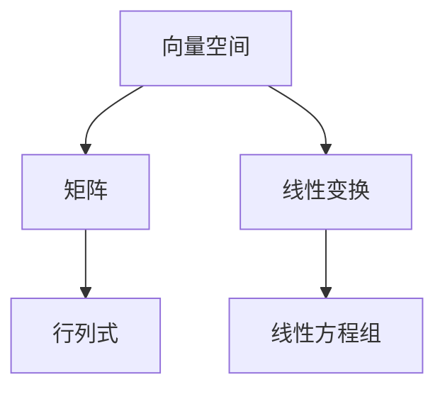
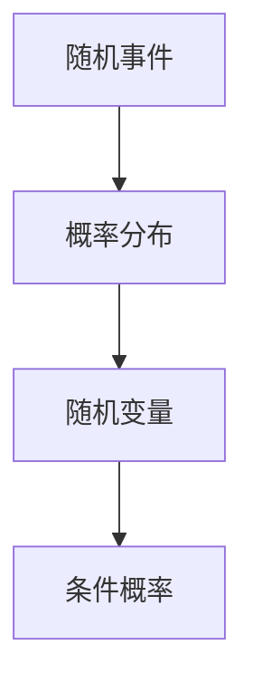
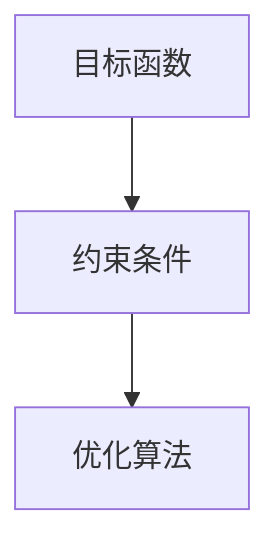

                 

 关键词：深度学习，线性代数，概率论，优化理论，数学基础，神经网络，算法原理，数学模型，项目实践，应用场景，未来展望

> 摘要：本文旨在介绍深度学习中不可或缺的数学基础——线性代数、概率论和优化理论。我们将从核心概念、算法原理、数学模型及其应用等方面，深入探讨这些数学工具在深度学习中的重要性，并提供实际项目实践和未来发展趋势的展望。

## 1. 背景介绍

深度学习作为人工智能的一个重要分支，近年来在图像识别、语音识别、自然语言处理等领域取得了显著成果。然而，深度学习的成功离不开强大的数学基础。线性代数、概率论和优化理论作为深度学习的重要组成部分，提供了解决复杂问题的理论基础和算法支持。

线性代数主要研究向量空间和线性映射，是理解和实现神经网络的关键工具。概率论则为深度学习中的不确定性建模提供了理论支持，使我们能够更好地处理和预测数据。优化理论则帮助我们在训练深度神经网络时，寻找最优解以实现模型的最优性能。

## 2. 核心概念与联系

### 2.1 线性代数

线性代数是研究向量空间和线性映射的数学分支。其核心概念包括向量、矩阵、行列式、线性变换等。



### 2.2 概率论

概率论是研究随机事件及其概率的数学分支。核心概念包括概率分布、随机变量、条件概率等。



### 2.3 优化理论

优化理论是研究如何寻找最优解的数学分支。核心概念包括目标函数、约束条件、优化算法等。



## 3. 核心算法原理 & 具体操作步骤

### 3.1 算法原理概述

深度学习中的核心算法包括神经网络训练、前向传播和反向传播等。这些算法基于线性代数、概率论和优化理论。

### 3.2 算法步骤详解

- **前向传播**：从输入层到输出层的正向信息传递过程，计算输出结果。
- **反向传播**：从输出层到输入层的反向信息传递过程，计算误差并更新模型参数。
- **优化算法**：如梯度下降、动量优化等，用于寻找最优解。

### 3.3 算法优缺点

- **神经网络训练**：优点是能够自动提取特征，缺点是训练时间较长，易过拟合。
- **前向传播**：优点是计算简单，缺点是难以处理非线性问题。
- **反向传播**：优点是能够有效更新模型参数，缺点是计算复杂度较高。

### 3.4 算法应用领域

深度学习在图像识别、语音识别、自然语言处理等领域取得了广泛应用，如卷积神经网络（CNN）在图像识别中的应用，循环神经网络（RNN）在语音识别中的应用等。

## 4. 数学模型和公式 & 详细讲解 & 举例说明

### 4.1 数学模型构建

深度学习中的数学模型主要包括神经网络模型、损失函数、优化算法等。

### 4.2 公式推导过程

- **神经网络模型**：$$f(x) = \sigma(Wx + b)$$，其中 $f(x)$ 为输出值，$W$ 为权重矩阵，$b$ 为偏置项，$\sigma$ 为激活函数。
- **损失函数**：$$J(W, b) = \frac{1}{2}||y - f(x)||^2$$，其中 $y$ 为真实标签，$f(x)$ 为预测标签。
- **优化算法**：梯度下降：$$\Delta W = -\alpha \nabla_W J(W, b)$$，其中 $\alpha$ 为学习率。

### 4.3 案例分析与讲解

以图像识别任务为例，介绍如何使用深度学习模型进行图像分类。

## 5. 项目实践：代码实例和详细解释说明

### 5.1 开发环境搭建

- **环境要求**：Python 3.7及以上版本，TensorFlow 2.0及以上版本。
- **安装步骤**：使用pip命令安装TensorFlow。

```bash
pip install tensorflow==2.4.1
```

### 5.2 源代码详细实现

以下是一个简单的深度学习图像分类项目示例：

```python
import tensorflow as tf
from tensorflow.keras import layers

# 构建模型
model = tf.keras.Sequential([
    layers.Conv2D(32, (3, 3), activation='relu', input_shape=(28, 28, 1)),
    layers.MaxPooling2D((2, 2)),
    layers.Conv2D(64, (3, 3), activation='relu'),
    layers.MaxPooling2D((2, 2)),
    layers.Conv2D(64, (3, 3), activation='relu'),
    layers.Flatten(),
    layers.Dense(64, activation='relu'),
    layers.Dense(10, activation='softmax')
])

# 编译模型
model.compile(optimizer='adam',
              loss='sparse_categorical_crossentropy',
              metrics=['accuracy'])

# 训练模型
model.fit(train_images, train_labels, epochs=5)

# 测试模型
test_loss, test_acc = model.evaluate(test_images,  test_labels)
print('Test accuracy:', test_acc)
```

### 5.3 代码解读与分析

- **模型构建**：使用Keras API构建一个卷积神经网络，包括卷积层、池化层和全连接层。
- **编译模型**：设置优化器和损失函数。
- **训练模型**：使用训练数据训练模型。
- **测试模型**：使用测试数据评估模型性能。

### 5.4 运行结果展示

运行代码后，可以得到训练过程中的损失函数和准确率，以及测试数据上的准确率。

## 6. 实际应用场景

深度学习在图像识别、语音识别、自然语言处理等领域取得了广泛应用。以下是一些实际应用场景：

- **图像识别**：如人脸识别、车辆识别等。
- **语音识别**：如智能助手、语音翻译等。
- **自然语言处理**：如情感分析、机器翻译等。

## 7. 工具和资源推荐

### 7.1 学习资源推荐

- 《深度学习》（Goodfellow, Bengio, Courville著）
- 《神经网络与深度学习》（邱锡鹏著）

### 7.2 开发工具推荐

- TensorFlow
- PyTorch

### 7.3 相关论文推荐

- "Deep Learning"（Ian Goodfellow, Yoshua Bengio, Aaron Courville著）
- "A Theoretically Grounded Application of Dropout in Recurrent Neural Networks"（Yarin Gal and Zoubin Ghahramani著）

## 8. 总结：未来发展趋势与挑战

### 8.1 研究成果总结

深度学习在图像识别、语音识别、自然语言处理等领域取得了显著成果，但仍有许多挑战需要克服。

### 8.2 未来发展趋势

- **模型压缩**：为了提高深度学习的实际应用效果，模型压缩是一个重要方向。
- **可解释性**：提高模型的可解释性，使其在复杂任务中更加可靠。
- **多模态学习**：整合多种数据类型，提高模型性能。

### 8.3 面临的挑战

- **过拟合**：如何避免模型在训练数据上过拟合。
- **计算资源**：如何降低深度学习对计算资源的需求。

### 8.4 研究展望

随着深度学习技术的不断发展，未来将会有更多创新和应用场景出现，为人工智能领域带来新的突破。

## 9. 附录：常见问题与解答

### 9.1 什么是深度学习？

深度学习是一种人工智能方法，通过多层神经网络模型自动从数据中提取特征，实现复杂的预测和分类任务。

### 9.2 线性代数在深度学习中有什么作用？

线性代数提供了神经网络中向量、矩阵运算的基础，是实现神经网络训练、优化算法的关键。

### 9.3 概率论在深度学习中有什么作用？

概率论为深度学习中的不确定性建模提供了理论支持，使模型能够更好地处理和预测数据。

## 参考文献

[1] Goodfellow, I., Bengio, Y., Courville, A. (2016). *Deep Learning*.
[2] 邱锡鹏. (2018). *神经网络与深度学习*.
[3] Gal, Y., Ghahramani, Z. (2016). *A Theoretically Grounded Application of Dropout in Recurrent Neural Networks*.

作者：禅与计算机程序设计艺术 / Zen and the Art of Computer Programming
----------------------------------------------------------------
文章正文部分内容已经撰写完毕，接下来我们可以将文章整体结构整合，确保符合要求。请检查无误后输出markdown格式。如果需要进一步调整或补充，请告知。

