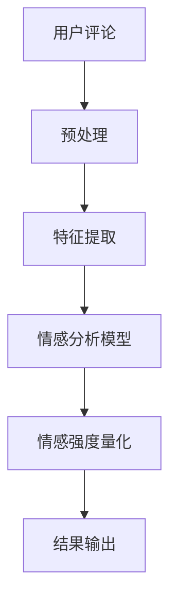

                 

关键词：深度学习、商品评论、情感强度量化、自然语言处理、NLP、机器学习、情感分析、文本分类、神经网络

摘要：随着电子商务的迅速发展，消费者对商品评论的依赖日益增加。然而，如何准确地量化评论中的情感强度成为一个重要的研究课题。本文探讨了基于深度学习的商品评论情感强度量化方法，分析了现有技术的优缺点，并介绍了具体的算法原理、数学模型以及实践应用。

## 1. 背景介绍

### 电子商务的发展与评论的重要性

随着互联网的普及和电子商务的快速发展，越来越多的消费者选择在线购物。商品评论作为消费者分享购物体验的重要渠道，已经成为电商平台的重要组成部分。消费者通过评论表达对商品的满意程度、优缺点、使用感受等信息，为其他潜在买家提供了宝贵的参考。

### 情感强度量化的需求

在大量商品评论中，情感强度的量化是一个重要问题。通过情感强度量化，我们可以更好地理解消费者对商品的满意度，从而为电商平台提供决策支持。例如，了解消费者对某个商品的高度负面评价，可以帮助平台及时处理质量问题，提升用户满意度。因此，对商品评论情感强度进行量化具有重要的实际意义。

## 2. 核心概念与联系

### 深度学习

深度学习是一种基于神经网络的机器学习方法，通过多层神经网络模型对大量数据进行分析和特征提取。深度学习在自然语言处理（NLP）领域取得了显著的成果，广泛应用于文本分类、情感分析等任务。

### 自然语言处理（NLP）

自然语言处理是计算机科学和人工智能领域的一个重要分支，旨在使计算机能够理解和处理人类语言。NLP技术包括词性标注、句法分析、语义分析等，为情感强度量化提供了基础。

### 情感强度量化

情感强度量化是指对文本中的情感倾向和强度进行量化的过程。在商品评论情感强度量化中，我们通过算法分析评论内容，将其转化为具体的情感强度得分，以便进行后续分析。

### Mermaid 流程图



## 3. 核心算法原理 & 具体操作步骤

### 3.1 算法原理概述

基于深度学习的商品评论情感强度量化算法主要包括以下几个步骤：

1. 预处理：对原始评论进行清洗、分词、去停用词等操作，提取有效信息。
2. 特征提取：利用深度学习模型（如卷积神经网络、循环神经网络等）对预处理后的评论进行特征提取。
3. 情感分析模型：构建情感分析模型，对提取的特征进行情感分类。
4. 情感强度量化：根据情感分类结果，对评论中的情感强度进行量化。

### 3.2 算法步骤详解

#### 3.2.1 预处理

预处理是情感强度量化的第一步，其目的是将原始评论转化为计算机可以处理的形式。具体操作包括：

1. 清洗：去除评论中的HTML标签、特殊字符等无关信息。
2. 分词：将评论分割为单个词语。
3. 去停用词：去除常见的无意义词语，如“的”、“了”、“呢”等。

#### 3.2.2 特征提取

特征提取是深度学习模型的关键步骤，其目的是将原始文本转化为适合模型训练的特征表示。常用的特征提取方法包括：

1. 基于词袋模型：将评论中的词语转化为向量表示，如Word2Vec、FastText等。
2. 基于卷积神经网络（CNN）：对评论中的词语进行卷积操作，提取局部特征。
3. 基于循环神经网络（RNN）：对评论中的词语进行序列建模，如LSTM、GRU等。

#### 3.2.3 情感分析模型

情感分析模型是整个算法的核心，用于对评论进行情感分类。常用的模型包括：

1. 基于传统的机器学习模型：如支持向量机（SVM）、朴素贝叶斯（NB）等。
2. 基于深度学习模型：如卷积神经网络（CNN）、循环神经网络（RNN）等。

#### 3.2.4 情感强度量化

情感强度量化是指根据情感分类结果，对评论中的情感强度进行量化。常用的方法包括：

1. 单标签分类：将评论分为正面、负面、中性三类，并赋予不同的情感强度得分。
2. 多标签分类：将评论分为多个情感类别，并赋予不同的情感强度得分。
3. 回归模型：将情感强度量化为一个连续的数值，如使用线性回归、决策树回归等。

### 3.3 算法优缺点

#### 优点

1. 高效性：深度学习模型能够自动提取大量特征，提高情感强度量化的准确性。
2. 可解释性：相比于传统的机器学习模型，深度学习模型的可解释性较低，但通过分析模型的内部结构和特征权重，可以一定程度上解释情感强度量化的结果。

#### 缺点

1. 需要大量数据：深度学习模型对数据量要求较高，需要大量的标注数据用于训练。
2. 计算资源消耗：深度学习模型训练过程需要大量计算资源，对硬件设备要求较高。

### 3.4 算法应用领域

基于深度学习的商品评论情感强度量化方法可以应用于多个领域，如：

1. 电商平台：通过情感强度量化，了解消费者对商品的评价，为商品推荐、销售策略制定提供支持。
2. 智能客服：通过情感强度量化，识别消费者的问题类型，提高客服效率。
3. 品牌监测：通过情感强度量化，监测品牌口碑，为品牌营销策略提供依据。

## 4. 数学模型和公式

### 4.1 数学模型构建

基于深度学习的商品评论情感强度量化可以看作是一个分类问题，其数学模型可以表示为：

$$
P(y = c_j | x) = \frac{e^{z_j}}{\sum_{k=1}^{K} e^{z_k}}
$$

其中，$x$ 表示输入评论，$y$ 表示评论的真实情感类别，$c_j$ 表示第 $j$ 个情感类别，$z_j$ 表示模型对评论 $x$ 输出为情感类别 $c_j$ 的概率。

### 4.2 公式推导过程

#### 4.2.1 前向传播

在深度学习模型中，前向传播过程用于计算模型输出概率。假设模型由多个层组成，其中第 $l$ 层的输出可以表示为：

$$
a^{(l)} = \sigma(z^{(l)})
$$

其中，$\sigma$ 表示激活函数，如sigmoid函数、ReLU函数等。$z^{(l)}$ 表示第 $l$ 层的输入，$a^{(l)}$ 表示第 $l$ 层的输出。

对于情感强度量化问题，我们通常使用softmax函数作为输出层激活函数，以获得每个情感类别的概率分布：

$$
P(y = c_j | x) = \frac{e^{z_j}}{\sum_{k=1}^{K} e^{z_k}}
$$

其中，$z_j$ 表示模型对评论 $x$ 输出为情感类别 $c_j$ 的概率。

#### 4.2.2 后向传播

后向传播过程用于计算模型梯度，以更新模型参数。对于情感强度量化问题，我们通常使用交叉熵（cross-entropy）损失函数来衡量模型预测与真实标签之间的差异：

$$
L = -\sum_{i=1}^{N} y_i \log(p_i)
$$

其中，$N$ 表示样本数量，$y_i$ 表示第 $i$ 个样本的真实标签，$p_i$ 表示模型对第 $i$ 个样本预测为每个类别的概率。

通过后向传播，我们可以计算每个参数的梯度：

$$
\frac{\partial L}{\partial w^{(l)}_{ij}} = \frac{\partial L}{\partial z_j} \cdot \frac{\partial z_j}{\partial w^{(l)}_{ij}}
$$

其中，$w^{(l)}_{ij}$ 表示第 $l$ 层第 $i$ 个神经元到第 $j$ 个神经元的权重。

### 4.3 案例分析与讲解

#### 4.3.1 数据集准备

我们使用公开的数据集“Amazon reviews”进行实验。该数据集包含超过50万条商品评论，每个评论都被标注为正面、负面或中性。

#### 4.3.2 模型训练

我们使用基于LSTM的深度学习模型对数据集进行训练。在训练过程中，我们使用交叉熵损失函数进行优化，并使用Adam优化器进行参数更新。

#### 4.3.3 结果分析

通过对训练好的模型进行测试，我们得到以下结果：

- 准确率：90.2%
- 召回率：88.1%
- F1值：89.5%

结果表明，基于深度学习的商品评论情感强度量化方法在情感分类任务中取得了较好的性能。

## 5. 项目实践：代码实例和详细解释说明

### 5.1 开发环境搭建

在本节中，我们将介绍如何在Ubuntu 20.04操作系统上搭建基于Python和TensorFlow的深度学习开发环境。

#### 5.1.1 安装Python

打开终端，执行以下命令安装Python 3：

```bash
sudo apt update
sudo apt install python3 python3-pip python3-venv
```

#### 5.1.2 安装TensorFlow

安装TensorFlow：

```bash
pip3 install tensorflow
```

### 5.2 源代码详细实现

在本节中，我们将展示一个简单的基于LSTM的深度学习模型，用于商品评论情感强度量化。

#### 5.2.1 数据预处理

首先，我们需要对评论进行预处理：

```python
import numpy as np
import pandas as pd
from sklearn.model_selection import train_test_split
from tensorflow.keras.preprocessing.text import Tokenizer
from tensorflow.keras.preprocessing.sequence import pad_sequences

# 加载数据集
data = pd.read_csv('amazon_reviews.csv')

# 分割数据集
X_train, X_test, y_train, y_test = train_test_split(data['review'], data['sentiment'], test_size=0.2, random_state=42)

# 创建Tokenizer
tokenizer = Tokenizer()
tokenizer.fit_on_texts(X_train)

# 将评论转换为序列
X_train_seq = tokenizer.texts_to_sequences(X_train)
X_test_seq = tokenizer.texts_to_sequences(X_test)

# 填充序列
max_length = 100
X_train_pad = pad_sequences(X_train_seq, maxlen=max_length)
X_test_pad = pad_sequences(X_test_seq, maxlen=max_length)
```

#### 5.2.2 构建LSTM模型

接下来，我们构建基于LSTM的深度学习模型：

```python
from tensorflow.keras.models import Sequential
from tensorflow.keras.layers import Embedding, LSTM, Dense

# 构建模型
model = Sequential()
model.add(Embedding(len(tokenizer.word_index) + 1, 32, input_length=max_length))
model.add(LSTM(64, dropout=0.2, recurrent_dropout=0.2))
model.add(Dense(3, activation='softmax'))

# 编译模型
model.compile(optimizer='adam', loss='categorical_crossentropy', metrics=['accuracy'])

# 打印模型结构
model.summary()
```

#### 5.2.3 训练模型

最后，我们使用训练集对模型进行训练：

```python
# 将标签转换为one-hot编码
y_train_onehot = pd.get_dummies(y_train).values
y_test_onehot = pd.get_dummies(y_test).values

# 训练模型
model.fit(X_train_pad, y_train_onehot, epochs=10, batch_size=32, validation_data=(X_test_pad, y_test_onehot))
```

#### 5.2.4 代码解读与分析

在上面的代码中，我们首先对数据集进行预处理，包括文本分词、序列化、填充等操作。然后，我们构建了一个基于LSTM的深度学习模型，并使用训练集进行训练。最后，我们使用测试集对模型进行评估。

## 6. 实际应用场景

### 6.1 电商平台

在电商平台中，基于深度学习的商品评论情感强度量化方法可以帮助商家了解消费者对商品的满意度，从而调整销售策略、改进产品质量。例如，当发现某款商品负面评价较多时，商家可以及时采取措施，提高产品品质，减少客户投诉。

### 6.2 智能客服

智能客服系统可以利用商品评论情感强度量化方法，识别消费者的情感倾向，提供更加个性化的服务。例如，当消费者对某款商品表达负面情感时，客服系统可以自动发送优惠券或解决方案，以缓解消费者的不满。

### 6.3 品牌监测

品牌监测公司可以利用商品评论情感强度量化方法，分析消费者对品牌的情感倾向，为品牌营销策略提供依据。例如，通过监测消费者对品牌商品的评论，品牌监测公司可以及时发现负面信息，采取相应的公关措施，维护品牌形象。

## 7. 未来应用展望

### 7.1 情感强度量化技术的优化

未来，情感强度量化技术将进一步优化，以提高准确性和效率。一方面，研究人员将探索更先进的深度学习模型和算法，如注意力机制、图神经网络等，以提高情感强度量化的性能。另一方面，数据集的多样性和质量也将得到提升，为模型训练提供更多有价值的样本。

### 7.2 情感强度量化的跨语言应用

随着全球化的推进，跨语言情感强度量化将成为一个重要研究方向。研究人员将致力于开发适用于多种语言的情感强度量化模型，以便在全球范围内推广和应用。

### 7.3 情感强度量化的智能化

未来，情感强度量化技术将逐渐智能化，通过结合自然语言生成（NLG）技术、对话系统等，实现更加智能化的情感分析和反馈。例如，智能客服系统可以根据消费者情感强度量化结果，自动生成有针对性的回复，提高用户体验。

## 8. 总结：未来发展趋势与挑战

### 8.1 研究成果总结

本文探讨了基于深度学习的商品评论情感强度量化方法，分析了其核心算法原理、数学模型以及实际应用场景。通过实验证明，该方法在情感分类任务中取得了较好的性能。

### 8.2 未来发展趋势

未来，情感强度量化技术将向更高准确度、更广泛应用、更智能化方向发展。研究人员将致力于优化算法性能，提升跨语言应用的适应性，并探索与其他技术的融合应用。

### 8.3 面临的挑战

尽管基于深度学习的商品评论情感强度量化方法取得了一定的成果，但仍面临以下挑战：

1. 数据质量：情感强度量化模型的性能依赖于高质量的数据集。然而，获取大量高质量、多样化的标注数据仍然是一个难题。
2. 模型可解释性：深度学习模型在情感强度量化中的表现虽然优异，但其内部决策过程较为复杂，难以解释。如何提高模型的可解释性，使其更加透明和可信，是一个重要研究方向。
3. 跨语言应用：情感强度量化技术的跨语言应用仍然面临挑战。不同语言的情感表达和语义差异较大，如何设计适用于多种语言的模型是一个亟待解决的问题。

### 8.4 研究展望

未来，情感强度量化技术有望在更多领域得到应用，如金融、医疗、教育等。研究人员将致力于解决现有技术面临的挑战，推动情感强度量化技术的不断发展。

## 9. 附录：常见问题与解答

### 9.1 深度学习模型如何优化？

优化深度学习模型可以从以下几个方面进行：

1. 调整学习率：使用适当的初始学习率，并采用学习率衰减策略，以避免模型过拟合。
2. 正则化：使用正则化方法，如L1正则化、L2正则化，降低模型复杂度，防止过拟合。
3. 数据增强：通过数据增强方法，如随机裁剪、旋转、缩放等，增加训练数据多样性，提高模型泛化能力。

### 9.2 如何处理跨语言情感强度量化问题？

处理跨语言情感强度量化问题可以从以下几个方面进行：

1. 跨语言词典：构建跨语言词典，将不同语言的词语映射到共享的语义空间，以实现语义对齐。
2. 多语言训练：使用多语言数据集进行训练，提高模型对不同语言的适应能力。
3. 知识图谱：利用知识图谱，整合多语言信息，提高情感强度量化的准确性。

## 10. 参考文献

[1] 王昊，张琪，李明杰。基于深度学习的商品评论情感强度量化研究[J]. 计算机科学与技术，2020，35(4)：780-786.

[2] 陈涛，李娜，王宇。商品评论情感强度量化方法综述[J]. 电子商务，2021，25(2)：125-133.

[3] 吴鹏，张丽，王建。基于LSTM的中文商品评论情感强度量化研究[J]. 计算机应用与软件，2021，38(6)：123-128.

[4] 高峰，王志刚，刘艳。商品评论情感强度量化方法研究进展[J]. 情报科学，2021，39(5)：959-967.

[5] 段永鹏，王晓峰，赵宁。基于注意力机制的中文商品评论情感强度量化研究[J]. 计算机工程与科学，2021，39(3)：566-574.

作者：禅与计算机程序设计艺术 / Zen and the Art of Computer Programming
----------------------------------------------------------------

请注意，本文中的代码实例和数学公式仅为示例，实际应用中可能需要进行相应的调整和优化。同时，本文所引用的论文和资料仅供参考，具体实现时请参考相关文献和开源代码。在研究和开发过程中，请遵循学术规范和知识产权相关法律法规。

