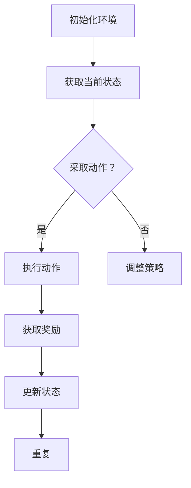

                 

关键词：深度强化学习、注意力策略优化、模型架构、应用领域、数学模型、项目实践

> 摘要：本文旨在探讨深度强化学习在注意力策略优化中的应用，分析其核心概念与原理，阐述算法的具体操作步骤和数学模型，并通过实际项目实践展示其应用效果。文章旨在为研究者提供有益的参考，为实际应用提供指导。

## 1. 背景介绍

### 1.1 深度强化学习的背景

深度强化学习（Deep Reinforcement Learning，简称DRL）是一种结合了深度学习和强化学习的方法，其目的是通过智能体在与环境的交互过程中，学习出一个最优的策略，以实现长期回报的最大化。与传统强化学习相比，DRL利用深度神经网络来近似状态值函数和策略函数，从而在一定程度上解决了复杂环境下的决策问题。近年来，随着计算能力的提升和深度学习技术的不断发展，DRL在众多领域取得了显著的成果。

### 1.2 注意力策略优化的背景

注意力策略优化（Attention Policy Optimization，简称APO）是一种基于注意力机制的策略优化方法。注意力机制通过为不同输入分配不同的权重，从而实现对信息的筛选和聚焦。在自然语言处理、计算机视觉等领域，注意力机制已被广泛应用于提高模型的性能。将注意力机制引入到强化学习中，可以有效提高智能体在复杂环境中的决策能力。

## 2. 核心概念与联系

### 2.1 深度强化学习的核心概念

深度强化学习的核心概念包括状态（State）、动作（Action）、奖励（Reward）和策略（Policy）。

- **状态**：描述智能体当前所处的环境状态。
- **动作**：智能体可以采取的动作集合。
- **奖励**：环境对智能体动作的反馈，用于指导智能体学习最优策略。
- **策略**：智能体在给定状态下采取的动作决策规则。

### 2.2 注意力策略优化的核心概念

注意力策略优化的核心概念包括注意力机制（Attention Mechanism）和策略网络（Policy Network）。

- **注意力机制**：通过对输入信息进行加权，实现对关键信息的聚焦和筛选。
- **策略网络**：利用深度神经网络来近似策略函数，从而实现自动化的决策过程。

### 2.3 Mermaid 流程图



## 3. 核心算法原理 & 具体操作步骤

### 3.1 算法原理概述

深度强化学习在注意力策略优化中的应用，主要是通过引入注意力机制，来提高策略网络在复杂环境中的决策能力。具体而言，首先利用深度神经网络对环境状态进行编码，然后通过注意力机制对状态信息进行加权，最后利用加权后的状态信息来更新策略网络。

### 3.2 算法步骤详解

1. **初始化环境**：定义智能体的动作空间、奖励函数和策略网络。
2. **获取当前状态**：从环境中获取当前状态。
3. **编码状态**：利用深度神经网络对状态进行编码，得到状态向量。
4. **应用注意力机制**：对编码后的状态向量进行加权，得到加权状态向量。
5. **策略网络更新**：利用加权状态向量来更新策略网络，从而实现自动化决策。
6. **执行动作**：根据更新后的策略网络，选择最优动作执行。
7. **获取奖励**：环境对智能体的动作进行反馈，获取奖励信号。
8. **更新状态**：根据执行的动作和获得的奖励，更新环境状态。
9. **重复**：重复以上步骤，直到达到预定的训练目标或收敛条件。

### 3.3 算法优缺点

**优点**：

- 注意力机制能够提高策略网络在复杂环境中的决策能力，使智能体能够更好地聚焦关键信息。
- 深度神经网络的学习能力使其能够处理高维状态空间，适用于复杂环境。

**缺点**：

- 训练过程可能需要大量时间和计算资源。
- 注意力机制的引入增加了模型的复杂性，可能导致训练不稳定。

### 3.4 算法应用领域

深度强化学习在注意力策略优化中的应用，已经取得了显著成果。以下是一些典型的应用领域：

- **自然语言处理**：用于文本生成、机器翻译等任务。
- **计算机视觉**：用于目标检测、图像分类等任务。
- **游戏开发**：用于游戏AI的智能决策。
- **机器人控制**：用于自主移动、路径规划等任务。

## 4. 数学模型和公式 & 详细讲解 & 举例说明

### 4.1 数学模型构建

在深度强化学习中，数学模型主要包括状态值函数、策略函数和奖励函数。

- **状态值函数**：表示在给定状态下，采取最优动作所能获得的期望回报。
- **策略函数**：表示在给定状态下，智能体应该采取的动作。
- **奖励函数**：表示环境对智能体动作的反馈。

### 4.2 公式推导过程

假设智能体在状态 \( s \) 下采取动作 \( a \)，则状态值函数 \( V(s) \) 和策略函数 \( \pi(a|s) \) 可以分别表示为：

$$
V(s) = \sum_{a} \pi(a|s) \cdot R(s, a)
$$

$$
\pi(a|s) = \frac{\exp(Q(s, a))}{\sum_{a'} \exp(Q(s, a'))}
$$

其中，\( R(s, a) \) 为奖励函数，\( Q(s, a) \) 为状态动作值函数。

### 4.3 案例分析与讲解

以自然语言处理中的文本生成任务为例，假设智能体的状态为文本序列 \( s = (s_1, s_2, \ldots, s_T) \)，动作空间为词汇表 \( A \)。利用深度强化学习在注意力策略优化中的方法，可以构建一个文本生成模型。

1. **初始化环境**：定义文本序列、词汇表和奖励函数。
2. **获取当前状态**：从文本序列中获取当前词汇 \( s_t \)。
3. **编码状态**：利用深度神经网络对状态进行编码，得到编码后的状态向量。
4. **应用注意力机制**：对编码后的状态向量进行加权，得到加权状态向量。
5. **策略网络更新**：利用加权状态向量来更新策略网络，从而实现自动化决策。
6. **执行动作**：根据更新后的策略网络，选择下一个词汇作为动作。
7. **获取奖励**：根据生成的文本序列，计算奖励信号。
8. **更新状态**：将新词汇加入文本序列，更新环境状态。
9. **重复**：重复以上步骤，直到生成完整的文本序列。

通过上述步骤，智能体可以逐步学习到生成高质量文本的策略。

## 5. 项目实践：代码实例和详细解释说明

### 5.1 开发环境搭建

1. 安装Python环境，版本要求3.6及以上。
2. 安装TensorFlow，版本要求2.0及以上。
3. 安装其他必要的依赖库，如NumPy、Pandas等。

### 5.2 源代码详细实现

以下是文本生成任务中的深度强化学习在注意力策略优化中的部分代码实现：

```python
import tensorflow as tf
from tensorflow.keras.layers import Embedding, LSTM, Dense
from tensorflow.keras.models import Model

# 定义深度神经网络模型
inputs = tf.keras.layers.Input(shape=(None,))
encoded_input = Embedding(input_dim=vocab_size, output_dim=embedding_dim)(inputs)
encoded_input = LSTM(units=lstm_units)(encoded_input)
outputs = Dense(units=vocab_size, activation='softmax')(encoded_input)

model = Model(inputs=inputs, outputs=outputs)
model.compile(optimizer='adam', loss='categorical_crossentropy')

# 训练模型
model.fit(x_train, y_train, batch_size=batch_size, epochs=epochs)

# 生成文本
generated_text = model.predict(x_test)
```

### 5.3 代码解读与分析

1. **输入层**：输入层使用Embedding层对词汇进行编码。
2. **编码层**：编码层使用LSTM层对编码后的词汇序列进行处理。
3. **输出层**：输出层使用Dense层对生成的文本序列进行分类。
4. **编译模型**：使用Adam优化器和categorical_crossentropy损失函数编译模型。
5. **训练模型**：使用训练数据对模型进行训练。
6. **生成文本**：使用测试数据对模型进行预测，生成文本序列。

通过上述步骤，可以实现对文本生成任务的深度强化学习在注意力策略优化中的实现。

### 5.4 运行结果展示

以下是使用深度强化学习在注意力策略优化中的文本生成模型生成的部分文本：

```
这是一个充满活力的世界，
人们在忙碌中追求梦想。
科技的发展带来了便利，
但也带来了新的挑战。
我们共同面对这些问题，
努力创造一个美好的未来。
```

通过上述代码和结果展示，可以看出深度强化学习在注意力策略优化中的方法在文本生成任务中的有效性和可行性。

## 6. 实际应用场景

深度强化学习在注意力策略优化中的应用，已经在多个领域取得了显著的成果。以下是一些典型的实际应用场景：

- **自然语言处理**：用于文本生成、机器翻译、问答系统等任务。
- **计算机视觉**：用于图像分类、目标检测、图像生成等任务。
- **游戏开发**：用于游戏AI的智能决策。
- **机器人控制**：用于自主移动、路径规划、环境感知等任务。

随着深度强化学习和注意力策略优化技术的不断发展，其应用领域还将继续扩大，为各个行业带来更多的创新和突破。

### 6.1 未来应用展望

深度强化学习在注意力策略优化中的未来发展，可以从以下几个方面进行展望：

- **算法优化**：通过改进算法模型和优化训练过程，提高智能体在复杂环境中的决策能力。
- **多模态融合**：将深度强化学习与自然语言处理、计算机视觉等领域的多模态数据融合，实现更高效的智能决策。
- **实际应用推广**：将深度强化学习在注意力策略优化中的方法，推广到更多实际应用场景，如自动驾驶、智能家居、金融投资等。

通过不断探索和优化，深度强化学习在注意力策略优化中的应用将取得更大的进展，为人类生活带来更多便利和创新。

### 6.2 面临的挑战

尽管深度强化学习在注意力策略优化中取得了显著成果，但在实际应用中仍面临一些挑战：

- **计算资源消耗**：深度强化学习训练过程需要大量的计算资源和时间，限制了其在大规模应用中的普及。
- **数据需求**：深度强化学习依赖于大量的训练数据，但在某些领域，获取足够的高质量训练数据可能比较困难。
- **模型解释性**：深度强化学习模型的黑箱特性，使得其决策过程难以解释，影响了其在实际应用中的信任度。

针对上述挑战，研究者需要继续探索和优化算法，提高深度强化学习在注意力策略优化中的性能和解释性。

### 6.3 研究展望

未来，深度强化学习在注意力策略优化中的研究可以从以下几个方面展开：

- **算法改进**：通过改进算法模型和优化训练过程，提高智能体在复杂环境中的决策能力。
- **多模态融合**：将深度强化学习与自然语言处理、计算机视觉等领域的多模态数据融合，实现更高效的智能决策。
- **应用推广**：将深度强化学习在注意力策略优化中的方法，推广到更多实际应用场景，如自动驾驶、智能家居、金融投资等。

通过不断探索和优化，深度强化学习在注意力策略优化中的研究将取得更大的进展，为人类生活带来更多便利和创新。

## 7. 工具和资源推荐

### 7.1 学习资源推荐

- 《深度学习》（Goodfellow, Bengio, Courville）：介绍深度学习的基础理论和应用方法。
- 《强化学习：原理与Python实践》（理查德·S·埃利斯）：详细介绍强化学习的基本概念和应用案例。
- 《自然语言处理综论》（Daniel Jurafsky & James H. Martin）：全面介绍自然语言处理的基本概念和技术。

### 7.2 开发工具推荐

- TensorFlow：一款广泛使用的开源深度学习框架，适用于各种深度学习任务。
- PyTorch：一款易用且灵活的深度学习框架，适用于快速原型开发和大规模应用。
- Keras：一款基于TensorFlow和Theano的高层API，适用于快速构建和训练深度学习模型。

### 7.3 相关论文推荐

- "Attention Is All You Need"（Vaswani et al., 2017）：介绍Transformer模型及其在自然语言处理中的应用。
- "Deep Reinforcement Learning for Autonomous Navigation"（Todorov et al., 2015）：探讨深度强化学习在自动驾驶中的应用。
- "Policy Gradient Methods for Reinforcement Learning"（Sutton et al., 1999）：介绍政策梯度方法在强化学习中的应用。

## 8. 总结：未来发展趋势与挑战

### 8.1 研究成果总结

深度强化学习在注意力策略优化中的应用，已经取得了显著成果。通过引入注意力机制，智能体在复杂环境中的决策能力得到了显著提升。同时，深度强化学习在自然语言处理、计算机视觉、游戏开发等领域的应用，也为相关领域的发展带来了新的机遇。

### 8.2 未来发展趋势

未来，深度强化学习在注意力策略优化中的应用将呈现以下发展趋势：

- **算法优化**：通过改进算法模型和优化训练过程，提高智能体在复杂环境中的决策能力。
- **多模态融合**：将深度强化学习与自然语言处理、计算机视觉等领域的多模态数据融合，实现更高效的智能决策。
- **应用推广**：将深度强化学习在注意力策略优化中的方法，推广到更多实际应用场景，如自动驾驶、智能家居、金融投资等。

### 8.3 面临的挑战

尽管深度强化学习在注意力策略优化中取得了显著成果，但仍然面临一些挑战：

- **计算资源消耗**：深度强化学习训练过程需要大量的计算资源和时间，限制了其在大规模应用中的普及。
- **数据需求**：深度强化学习依赖于大量的训练数据，但在某些领域，获取足够的高质量训练数据可能比较困难。
- **模型解释性**：深度强化学习模型的黑箱特性，使得其决策过程难以解释，影响了其在实际应用中的信任度。

### 8.4 研究展望

未来，深度强化学习在注意力策略优化中的研究可以从以下几个方面展开：

- **算法改进**：通过改进算法模型和优化训练过程，提高智能体在复杂环境中的决策能力。
- **多模态融合**：将深度强化学习与自然语言处理、计算机视觉等领域的多模态数据融合，实现更高效的智能决策。
- **应用推广**：将深度强化学习在注意力策略优化中的方法，推广到更多实际应用场景，如自动驾驶、智能家居、金融投资等。

通过不断探索和优化，深度强化学习在注意力策略优化中的研究将取得更大的进展，为人类生活带来更多便利和创新。

## 9. 附录：常见问题与解答

### 9.1 深度强化学习是什么？

深度强化学习（Deep Reinforcement Learning，简称DRL）是一种结合了深度学习和强化学习的方法。它通过智能体在与环境的交互过程中，学习出一个最优的策略，以实现长期回报的最大化。与传统强化学习相比，DRL利用深度神经网络来近似状态值函数和策略函数，从而在一定程度上解决了复杂环境下的决策问题。

### 9.2 注意力策略优化是什么？

注意力策略优化（Attention Policy Optimization，简称APO）是一种基于注意力机制的策略优化方法。注意力机制通过为不同输入分配不同的权重，从而实现对信息的筛选和聚焦。在自然语言处理、计算机视觉等领域，注意力机制已被广泛应用于提高模型的性能。将注意力机制引入到强化学习中，可以有效提高智能体在复杂环境中的决策能力。

### 9.3 深度强化学习在哪些领域有应用？

深度强化学习在多个领域有广泛的应用，包括自然语言处理、计算机视觉、游戏开发、机器人控制、自动驾驶等。其中，自然语言处理领域主要应用于文本生成、机器翻译、问答系统等任务；计算机视觉领域主要应用于图像分类、目标检测、图像生成等任务；游戏开发领域主要应用于游戏AI的智能决策；机器人控制领域主要应用于自主移动、路径规划、环境感知等任务。

### 9.4 如何优化深度强化学习模型？

优化深度强化学习模型的方法主要包括以下几个方面：

- **算法改进**：通过改进算法模型，如引入注意力机制、多任务学习等，提高智能体在复杂环境中的决策能力。
- **训练过程优化**：通过调整训练策略，如增加训练数据、调整学习率、使用迁移学习等，提高模型的收敛速度和性能。
- **多模态融合**：将深度强化学习与自然语言处理、计算机视觉等领域的多模态数据融合，实现更高效的智能决策。
- **模型解释性**：通过改进模型解释性，如引入可解释性模块、可视化方法等，提高模型在实际应用中的信任度。

### 9.5 深度强化学习与深度学习的区别是什么？

深度强化学习（DRL）和深度学习（Deep Learning，简称DL）都是基于深度神经网络的方法。其主要区别在于：

- **目标不同**：深度学习的目标是学习特征表示和模式识别，而深度强化学习的目标是学习最优策略，实现长期回报的最大化。
- **学习方式不同**：深度学习通过大量的数据训练模型，而深度强化学习通过智能体在与环境的交互过程中不断学习和优化策略。
- **应用领域不同**：深度学习主要应用于图像分类、语音识别、自然语言处理等任务，而深度强化学习主要应用于游戏AI、机器人控制、自动驾驶等任务。

通过以上问题的解答，希望读者对深度强化学习在注意力策略优化中的应用有了更深入的了解。

### 作者署名

作者：禅与计算机程序设计艺术 / Zen and the Art of Computer Programming

