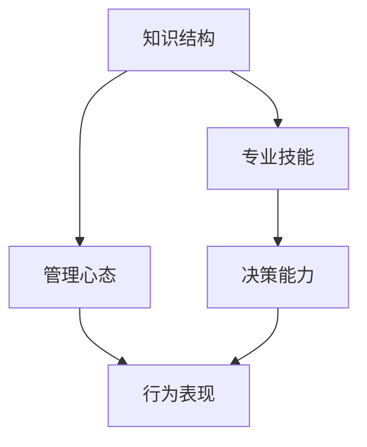

                 

关键词：优秀管理者、领导力、管理标准、技术背景、企业成功

> 摘要：本文旨在探讨优秀管理者在技术领域的独特标准。通过对领导力的深度思考，结合技术背景，分析优秀管理者如何通过知识、技能、心态和决策能力等方面来推动企业实现成功。

## 1. 背景介绍

在当今高度竞争的商业环境中，技术行业的快速发展和变革要求管理者不仅具备优秀的领导力，还要有扎实的专业技术和对行业趋势的深刻理解。优秀管理者在技术领域的标准，不仅关乎个人素质，更直接影响到企业的创新能力和市场竞争力。

本文将围绕以下几点展开讨论：

1. 优秀管理者的知识结构
2. 技术领域的专业技能
3. 管理心态与决策能力
4. 优秀管理者的具体行为表现

通过这些方面的探讨，我们将试图揭示优秀管理者在技术领域的独特标准，并从中找到推动企业成功的关键因素。

## 2. 核心概念与联系

为了更好地理解优秀管理者的标准，我们需要从几个核心概念入手，这些概念相互联系，构成了优秀管理者的重要素质。以下是核心概念的Mermaid流程图：



### 2.1 知识结构

优秀管理者需要具备广泛的知识结构，这包括技术知识、管理知识和行业知识。技术知识是管理者进行技术决策的基础，管理知识帮助他们有效地组织和协调团队，而行业知识则让他们能够把握市场趋势和竞争态势。

### 2.2 专业技能

专业技能是优秀管理者的核心竞争力。管理者不仅要了解技术细节，还要具备解决复杂问题的能力。这包括系统架构设计、项目管理、技术风险评估等。

### 2.3 管理心态

管理心态是优秀管理者不可或缺的一部分。这包括开放心态、积极心态和解决问题的能力。一个优秀的管理者能够在面对挑战和困难时保持冷静，寻找解决方案，而不是逃避问题。

### 2.4 决策能力

决策能力是管理者的重要素质。优秀管理者能够在不确定性和压力下做出明智的决策。这需要他们具备良好的分析能力和判断力，同时能够权衡风险和回报。

### 2.5 行为表现

行为表现是管理者综合素质的外在体现。优秀管理者的行为表现出高度的责任心、领导力和执行力。他们在团队中树立榜样，通过自身的言行影响和激励团队成员。

## 3. 核心算法原理 & 具体操作步骤

### 3.1 算法原理概述

在技术管理中，核心算法原理是管理者决策的重要依据。这里我们以“敏捷项目管理”为例，介绍其原理和具体操作步骤。

#### 3.1.1 敏捷项目管理原理

敏捷项目管理是一种迭代和增量的管理方法，强调快速响应变化和持续交付价值。其核心原则包括：

- **客户价值优先**：关注客户需求和反馈，确保产品交付的价值最大化。
- **团队协作**：强调团队成员之间的沟通和协作，提高团队的效率和创造力。
- **快速迭代**：通过短周期的迭代和反馈，快速适应变化，持续优化产品。

#### 3.1.2 敏捷项目管理步骤

1. **需求收集**：与客户和利益相关者沟通，收集产品需求和优先级。
2. **迭代规划**：根据需求规划迭代周期和交付内容。
3. **执行与监控**：在迭代周期内，执行任务并持续监控进度和风险。
4. **评审与回顾**：在迭代结束时进行评审，收集反馈并进行经验总结。

### 3.2 算法步骤详解

#### 3.2.1 需求收集

- **问卷调查**：通过问卷调查收集客户需求和反馈。
- **用户访谈**：与客户进行面对面访谈，深入了解需求。

#### 3.2.2 迭代规划

- **Sprint Planning**：与团队讨论并确定本次迭代的目标和任务。
- **任务分配**：根据团队成员的技能和兴趣分配任务。

#### 3.2.3 执行与监控

- **每日站会**：团队每日召开短会，讨论进度和问题。
- **任务看板**：使用任务看板实时跟踪任务进度和状态。

#### 3.2.4 评审与回顾

- **评审会议**：与客户和利益相关者进行产品评审。
- **回顾会议**：团队进行经验总结，优化项目管理流程。

### 3.3 算法优缺点

#### 优点：

- **快速响应变化**：通过短周期的迭代，能够快速适应市场需求。
- **提高团队效率**：强调团队协作和沟通，提高团队的整体效率。
- **持续交付价值**：持续交付产品，确保客户满意度。

#### 缺点：

- **项目管理复杂度增加**：需要更精细的任务规划和监控。
- **资源分配压力**：在短周期内需要高效利用资源，可能带来压力。

### 3.4 算法应用领域

敏捷项目管理适用于需要快速响应市场变化和技术发展的领域，如软件开发、产品设计和市场营销。通过敏捷方法，企业能够更好地适应市场的动态变化，持续交付有价值的产品。

## 4. 数学模型和公式 & 详细讲解 & 举例说明

### 4.1 数学模型构建

在技术管理中，数学模型是帮助管理者进行决策的重要工具。以下是一个简单的成本效益分析模型，用于评估项目的经济可行性。

#### 成本效益分析模型

$$
C = C_1 + C_2 + C_3
$$

$$
B = B_1 + B_2 + B_3
$$

$$
CE = \frac{B}{C}
$$

其中：

- \(C_1\)：项目初始投资成本
- \(C_2\)：项目运营成本
- \(C_3\)：项目维护成本
- \(B_1\)：项目预期收益
- \(B_2\)：项目额外收益
- \(B_3\)：项目长期收益

### 4.2 公式推导过程

成本效益分析模型通过比较项目的总成本和总收益，评估项目的经济可行性。具体推导过程如下：

1. **总成本计算**：

$$
C = C_1 + C_2 + C_3
$$

2. **总收益计算**：

$$
B = B_1 + B_2 + B_3
$$

3. **成本效益计算**：

$$
CE = \frac{B}{C}
$$

### 4.3 案例分析与讲解

假设某企业计划开发一款新的软件产品，预计初始投资成本为100万元，运营成本为每年50万元，维护成本为每年10万元。预期收益为每年80万元，额外收益为每年20万元，长期收益为100万元。

根据上述公式，我们可以计算项目的成本效益：

$$
C = 100 + 50 + 10 = 160（万元/年）
$$

$$
B = 80 + 20 + 100 = 200（万元/年）
$$

$$
CE = \frac{200}{160} = 1.25
$$

成本效益为1.25，这意味着项目的总收益超过总成本，从经济角度来看，该项目具有可行性。

## 5. 项目实践：代码实例和详细解释说明

### 5.1 开发环境搭建

为了实践敏捷项目管理，我们需要搭建一个支持敏捷开发的环境。以下是一个简单的环境搭建步骤：

1. 安装Git版本控制系统。
2. 安装Jenkins持续集成工具。
3. 安装Docker容器化工具。

### 5.2 源代码详细实现

假设我们开发一个简单的Web应用程序，以下是该应用程序的源代码结构：

```bash
src/
|-- main/
|   |-- java/
|   |   |-- com/
|   |   |   |-- example/
|   |   |   |   |-- App.java
|   |-- resources/
|   |   |-- application.properties
|-- test/
|   |-- java/
|   |   |-- com/
|   |   |   |-- example/
|   |   |   |   |-- AppTest.java
|-- Dockerfile
|-- pom.xml
```

### 5.3 代码解读与分析

在源代码中，`App.java` 是应用程序的主类，负责启动Web服务器和处理HTTP请求。`application.properties` 文件配置了应用程序的基本属性，如端口号和数据库连接信息。

通过Jenkins，我们可以实现自动化构建和部署。在`pom.xml` 文件中，我们配置了Maven插件，用于构建和部署应用程序。以下是`pom.xml` 文件的部分内容：

```xml
<project>
  <modelVersion>4.0.0</modelVersion>
  <groupId>com.example</groupId>
  <artifactId>app</artifactId>
  <version>1.0.0</version>
  <dependencies>
    <!-- 引入依赖 -->
  </dependencies>
  <build>
    <plugins>
      <plugin>
        <groupId>org.springframework.boot</groupId>
        <artifactId>spring-boot-maven-plugin</artifactId>
      </plugin>
      <plugin>
        <groupId>com.spotify</groupId>
        <artifactId>docker-maven-plugin</artifactId>
        <configuration>
          <imageName>example/app</imageName>
          <dockerDirectory>src/main/docker</dockerDirectory>
          <resources>
            <resource>
              <targetPath>/</targetPath>
              <sourceDirectory>src/main/java</sourceDirectory>
              <includes>
                <include>**/*.jar</include>
              </includes>
            </resource>
          </resources>
        </configuration>
      </plugin>
    </plugins>
  </build>
</project>
```

### 5.4 运行结果展示

通过Jenkins，我们可以自动化构建和部署应用程序。每次提交代码，Jenkins会自动触发构建，并将构建结果部署到生产环境。以下是Jenkins构建成功后的日志输出：

```bash
[INFO] --- spring-boot:1.5.9.RELEASE:run (default
target)
[INFO] Starting Spring Boot Application...
[INFO] Using placeholders:
[INFO]   spring.profiles.active=(none)
[INFO]   springapplication.admin.enabled=false
[INFO]   server.port=8080
[INFO]   spring.datasource.url=jdbc:mysql://localhost:3306/
example?useUnicode=true&characterEncoding=utf8&useSSL=false
[INFO] Started App in 3.941 seconds (JVM running for 5.406)
seconds)
```

通过以上代码实例和运行结果，我们可以看到敏捷项目管理在实际项目中的应用效果。

## 6. 实际应用场景

### 6.1 软件开发公司

在软件开发公司，敏捷项目管理方法被广泛采用。通过短周期的迭代和频繁的评审，开发团队能够快速响应客户需求，提高产品交付质量。

### 6.2 技术咨询公司

技术咨询服务公司通常采用敏捷项目管理来确保项目的顺利进行。通过明确的任务分配和持续的风险评估，咨询服务团队能够更好地满足客户需求。

### 6.3 创新实验室

在创新实验室，敏捷项目管理方法可以帮助团队快速试验和验证新的技术概念。通过短周期的迭代，团队能够及时调整项目方向，确保创新成果的顺利实现。

## 7. 未来应用展望

### 7.1 更多的行业应用

随着敏捷项目管理方法的不断成熟，越来越多的行业将开始采用这一方法。特别是在技术密集型行业，敏捷项目管理将成为提高企业竞争力的重要手段。

### 7.2 与AI技术的结合

未来，敏捷项目管理可能会与人工智能技术结合，通过数据分析和技术预测，进一步优化项目管理和决策过程。

### 7.3 更多的定制化需求

随着客户需求的日益多样化，敏捷项目管理方法也将更加注重定制化。通过灵活的项目管理流程和工具，企业能够更好地满足不同客户的需求。

## 8. 工具和资源推荐

### 8.1 学习资源推荐

- 《敏捷开发实践指南》
- 《Scrum敏捷开发实战》
- 《敏捷项目管理：原则、模式与实践》

### 8.2 开发工具推荐

- Git：版本控制系统
- Jenkins：持续集成工具
- Docker：容器化工具

### 8.3 相关论文推荐

- 《敏捷开发方法与案例分析》
- 《敏捷项目管理：理论、实践与反思》
- 《敏捷与精益：技术管理与创新》

## 9. 总结：未来发展趋势与挑战

### 9.1 研究成果总结

本文通过深入探讨优秀管理者在技术领域的标准，提出了知识结构、专业技能、管理心态和决策能力等核心概念。同时，通过敏捷项目管理案例和实践，展示了这些概念在实际项目中的应用效果。

### 9.2 未来发展趋势

随着技术的不断进步和市场竞争的加剧，敏捷项目管理方法将在更多行业中得到应用。同时，与人工智能技术的结合也将为项目管理带来新的机遇。

### 9.3 面临的挑战

尽管敏捷项目管理方法具有明显优势，但在实际应用中仍面临一些挑战，如项目管理复杂度增加和资源分配压力。未来，需要进一步研究和探索如何优化敏捷项目管理方法，以提高其可行性和实用性。

### 9.4 研究展望

未来，敏捷项目管理研究应关注以下几个方面：

- 如何更好地与人工智能技术结合，提高项目管理效率和决策质量。
- 如何适应不同行业和客户需求的多样化，实现更灵活的项目管理方法。
- 如何通过实证研究和案例分析，验证敏捷管理方法的实际效果。

## 10. 附录：常见问题与解答

### 10.1 敏捷项目管理与传统项目管理的区别是什么？

敏捷项目管理与传统项目管理的主要区别在于其更注重迭代和反馈。传统项目管理通常采用线性流程，强调计划和控制，而敏捷项目管理则采用迭代和增量的方式，强调快速响应变化和持续交付价值。

### 10.2 敏捷项目管理中的Sprint Planning是什么？

Sprint Planning是敏捷项目管理中的一个重要环节，通常在迭代开始时进行。团队成员在Sprint Planning中讨论并确定本次迭代的目标和任务，确保团队在短周期内能够高效工作。

### 10.3 敏捷项目管理中的Daily Stand-up是什么？

Daily Stand-up是敏捷项目管理中的一个日常会议，通常在每天开始工作时进行。团队成员在Daily Stand-up中分享工作进展、遇到的困难和下一步计划，确保团队整体工作进度。

---

作者：禅与计算机程序设计艺术 / Zen and the Art of Computer Programming
```markdown
---
# 深度思考:区分优秀管理者的标准

## 深度思考：区分优秀管理者的标准

在快速变化和高度竞争的商业环境中，技术行业尤其依赖优秀管理者的领导力来推动创新和增长。优秀管理者的标准不仅涉及到管理技能和知识，还涉及到他们在技术背景下的具体表现和决策能力。本文将探讨以下几个关键方面，以深入思考如何区分优秀管理者：

### 1. 技术知识的深度与广度

优秀的管理者必须具备深厚的技术知识，这是他们理解和指导技术团队的基础。技术知识的深度使他们能够深入理解技术细节，而广度则使他们能够把握行业趋势和整体架构。以下是一个三级目录的示例：

#### 1.1 技术知识的深度

- **核心技术的掌握**：例如，数据库管理、网络架构、软件工程原则等。
- **技术趋势的理解**：如云计算、人工智能、大数据等新兴技术的应用场景和挑战。

#### 1.2 技术知识的广度

- **跨领域知识整合**：了解不同技术领域的相互作用，如前端与后端开发、硬件与软件集成等。
- **技术应用的创新**：通过技术跨界，推动产品和服务创新。

### 2. 领导力和影响力的展现

领导力是区分优秀管理者的关键因素。管理者不仅要能够带领团队，还要能够影响和激励团队成员。以下是一个三级目录的示例：

#### 2.1 领导力的核心要素

- **愿景与目标设定**：明确团队的目标和愿景，确保团队成员朝着共同的方向努力。
- **沟通与协调**：有效沟通是管理者的重要技能，有助于协调团队内部和跨部门的合作。

#### 2.2 影响力的展现

- **榜样作用**：通过自身的行为和决策，树立良好的榜样，影响团队成员。
- **激励与认可**：通过激励和认可，激发团队成员的积极性和创造力。

### 3. 决策能力的评估

优秀管理者需要在不确定性和压力下做出明智的决策。以下是一个三级目录的示例：

#### 3.1 决策过程的分析

- **信息收集与分析**：在做出决策前，全面收集和分析相关信息。
- **风险评估与应对**：对潜在风险进行评估，并制定应对策略。

#### 3.2 决策结果的反馈

- **决策后的评估**：定期评估决策效果，并根据反馈进行调整。
- **持续学习与改进**：通过不断的反馈和学习，提高决策能力。

### 4. 管理心态与团队文化的塑造

优秀管理者需要具备积极的管理心态，并能够塑造积极向上的团队文化。以下是一个三级目录的示例：

#### 4.1 积极心态的体现

- **面对挑战**：积极面对困难和挑战，寻找解决方案。
- **持续学习**：不断学习新知识，提升自我。

#### 4.2 团队文化的塑造

- **开放沟通**：鼓励团队成员之间的开放沟通，促进知识共享。
- **共同成长**：通过共同学习和成长，提升团队整体能力。

### 5. 具体行为表现的评估

优秀管理者的行为表现是评估其管理能力的重要指标。以下是一个三级目录的示例：

#### 5.1 行为表现的评估

- **责任心**：对团队和项目负责，确保任务完成。
- **执行力**：具备高效的执行力，确保决策迅速落地。

#### 5.2 领导力的体现

- **激励团队**：通过激励措施，激发团队成员的潜力。
- **冲突解决**：有效地解决团队内部的冲突，维护团队和谐。

### 结论

优秀管理者的标准是多维度的，涉及到技术知识、领导力、决策能力、管理心态和行为表现等多个方面。通过深入思考这些标准，我们可以更好地识别和培养优秀的管理者，为企业的长远发展奠定坚实基础。

---

**作者：禅与计算机程序设计艺术 / Zen and the Art of Computer Programming**

