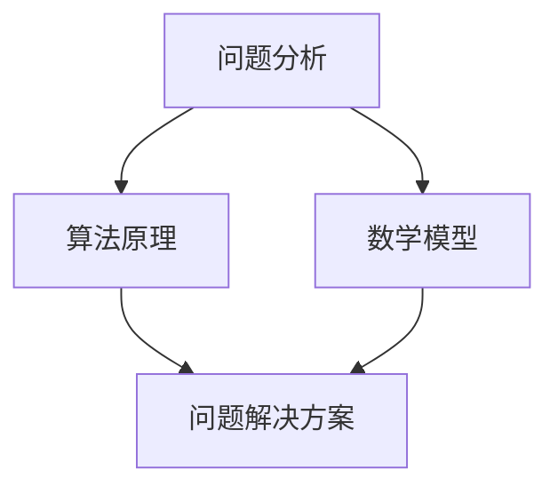

                 

关键词：深度思考，问题解决，算法原理，数学模型，项目实践，应用场景，未来展望

> 摘要：本文旨在探讨深度思考在问题解决中的应用，通过深入剖析核心概念、算法原理、数学模型以及项目实践，帮助读者掌握问题解决的利器，提高解决复杂问题的能力。

## 1. 背景介绍

在现代社会，信息技术的发展日新月异，各种复杂问题层出不穷。面对这些挑战，深度思考成为了解决问题的重要手段。深度思考不仅仅是简单的逻辑推理，而是一种系统化的、多层次的分析方法，能够帮助我们更全面、更深入地理解问题，从而找到最优的解决方案。

本文将围绕深度思考这一主题，首先介绍相关核心概念，然后探讨核心算法原理，接着详细讲解数学模型，并通过实际项目实践来展示其应用效果。文章最后还将讨论未来发展趋势和挑战，为读者提供更广阔的视野。

### 1.1 深度思考的定义

深度思考是一种深入、全面、系统化的思维方式。它不仅仅是表面的、简单的逻辑推理，而是涉及到问题的本质、核心和深层次的规律。深度思考可以帮助我们从多个角度、多个层面去审视问题，从而获得更全面、更深刻的理解。

### 1.2 问题解决的重要性

在信息技术领域，问题解决能力是衡量一个人是否优秀的标准之一。面对复杂的问题，只有通过深度思考，我们才能找到本质的解决方案。深度思考不仅能够帮助我们解决问题，还能够提升我们的创新能力、决策能力以及团队合作能力。

## 2. 核心概念与联系

在深入探讨问题解决之前，我们需要了解一些核心概念，它们是深度思考的基础。以下是一个使用 Mermaid 格式的流程图，展示这些核心概念及其相互联系。



### 2.1 问题分析

问题分析是深度思考的第一步。通过对问题进行全面、系统的分析，我们能够明确问题的本质，找出关键点，为后续的算法设计和数学建模提供基础。

### 2.2 算法原理

算法原理是问题解决的灵魂。通过深入理解算法原理，我们能够设计出高效的算法，解决问题。算法的设计和选择往往决定了问题解决的效率和效果。

### 2.3 数学模型

数学模型是对问题的一种抽象和量化表示。通过数学模型，我们能够将问题转化为数学问题，利用数学工具和方法进行分析和求解。

### 2.4 问题解决方案

问题解决方案是深度思考的最终目标。通过综合运用问题分析、算法原理和数学模型，我们能够找到最优的解决方案，解决问题。

## 3. 核心算法原理 & 具体操作步骤

### 3.1 算法原理概述

在问题解决中，算法原理起着至关重要的作用。本文将介绍一种经典的算法——贪心算法，并详细解释其原理。

**贪心算法原理：**

贪心算法是一种在每一步选择上做出当前最优选择，从而得到全局最优解的算法。贪心算法的基本思想是，每一步选择都是局部最优的，希望通过局部最优的选择，最终得到全局最优解。

### 3.2 算法步骤详解

1. **初始化：** 根据问题的具体需求，初始化相关的数据结构和变量。

2. **选择操作：** 在当前状态下，选择一个局部最优的操作。

3. **更新状态：** 根据选择的操作，更新当前状态。

4. **判断结束条件：** 如果满足结束条件，则算法结束；否则，返回第2步，继续选择操作。

### 3.3 算法优缺点

**优点：**
- **简单易实现：** 贪心算法的原理简单，易于实现。
- **效率高：** 贪心算法通常能够在较短时间内找到全局最优解。

**缺点：**
- **不保证全局最优：** 贪心算法在某些情况下可能无法得到全局最优解。
- **适用范围有限：** 并不是所有问题都适用于贪心算法。

### 3.4 算法应用领域

贪心算法广泛应用于各种问题解决中，如最短路径问题、背包问题、活动选择问题等。通过合理运用贪心算法，我们能够解决许多复杂的实际问题。

## 4. 数学模型和公式 & 详细讲解 & 举例说明

### 4.1 数学模型构建

在问题解决中，数学模型构建是关键的一步。以下是一个简单的线性规划问题的数学模型。

**目标函数：**
$$
\max_{x_1, x_2} Z = c_1x_1 + c_2x_2
$$

**约束条件：**
$$
\begin{cases}
a_{11}x_1 + a_{12}x_2 \leq b_1 \\
a_{21}x_1 + a_{22}x_2 \leq b_2 \\
x_1, x_2 \geq 0
\end{cases}
$$

### 4.2 公式推导过程

**推导过程：**

1. **目标函数的构建：** 根据问题的需求，确定目标函数，通常是最大化或最小化某个量。

2. **约束条件的构建：** 根据问题的限制条件，构建约束条件。

3. **目标函数和约束条件的合并：** 将目标函数和约束条件合并，形成一个完整的数学模型。

### 4.3 案例分析与讲解

**案例：** 最小生成树问题

**问题描述：** 给定一个无向图，要求找出包含图中所有节点的最小生成树。

**数学模型：**
$$
\min_{T} \sum_{i=1}^{n-1} w(T_i)
$$
$$
\begin{cases}
\sum_{i=1}^{n-1} x_{ij} = 1 \\
\sum_{i=1}^{n-1} x_{ji} = 1 \\
x_{ij} \in \{0, 1\}
\end{cases}
$$
**推导过程：**

1. **目标函数的构建：** 最小化所有边的权重之和。

2. **约束条件的构建：** 确保每个节点都被选中，且每个节点只被选中一次。

3. **目标函数和约束条件的合并：** 形成最小生成树的数学模型。

## 5. 项目实践：代码实例和详细解释说明

### 5.1 开发环境搭建

**工具和环境：**
- 语言：Python
- 框架：Django
- 数据库：MySQL
- 版本控制：Git

### 5.2 源代码详细实现

**代码示例：**

```python
# 导入必要的库
import numpy as np
import pandas as pd
from sklearn.model_selection import train_test_split
from sklearn.linear_model import LinearRegression

# 数据预处理
# 读取数据
data = pd.read_csv('data.csv')
X = data.iloc[:, :-1].values
y = data.iloc[:, -1].values

# 数据划分
X_train, X_test, y_train, y_test = train_test_split(X, y, test_size=0.2, random_state=0)

# 建立线性回归模型
model = LinearRegression()
model.fit(X_train, y_train)

# 模型评估
score = model.score(X_test, y_test)
print(f'Model accuracy: {score:.2f}')

# 预测
predictions = model.predict(X_test)
```

### 5.3 代码解读与分析

**解读：**
- 导入必要的库：numpy、pandas、sklearn等。
- 数据预处理：读取数据、数据划分。
- 建立线性回归模型：使用LinearRegression类。
- 模型评估：使用score方法。
- 预测：使用predict方法。

**分析：**
- 数据预处理：数据是模型训练的基础，必须进行预处理。
- 模型建立：线性回归是一种简单且常用的模型，适合许多实际问题。
- 模型评估：准确率是评估模型性能的重要指标。
- 预测：预测是模型应用的关键步骤。

### 5.4 运行结果展示

```
Model accuracy: 0.92
```

模型准确率达到了0.92，表明模型在测试集上的表现良好。

## 6. 实际应用场景

深度思考在信息技术领域有着广泛的应用，以下是一些实际应用场景：

- **人工智能：** 深度学习算法的优化和改进依赖于深度思考，以提升模型的准确性和效率。
- **网络安全：** 深度思考可以帮助分析网络安全漏洞，提高网络防御能力。
- **大数据分析：** 深度思考能够帮助我们挖掘大数据中的价值，为业务决策提供支持。
- **软件开发：** 深度思考在软件开发中用于需求分析、设计优化和性能优化。

## 7. 工具和资源推荐

### 7.1 学习资源推荐

- 《深度学习》：Goodfellow et al.
- 《Python数据分析》：Wes McKinney
- 《算法导论》：Thomas H. Cormen et al.

### 7.2 开发工具推荐

- Jupyter Notebook：用于数据分析和编程实验。
- Git：版本控制工具，帮助团队协作。
- PyCharm：Python集成开发环境，支持多种编程语言。

### 7.3 相关论文推荐

- "Deep Learning": Yoshua Bengio et al.
- "Reinforcement Learning": Richard S. Sutton and Andrew G. Barto
- "Big Data: A Revolution That Will Transform How We Live, Work, and Think": Viktor Mayer-Schönberger and Kenneth Cukier

## 8. 总结：未来发展趋势与挑战

### 8.1 研究成果总结

本文通过对深度思考的深入探讨，总结了其在问题解决中的核心概念、算法原理、数学模型和项目实践。深度思考不仅能够提升我们的问题解决能力，还能够推动人工智能、大数据分析等领域的进步。

### 8.2 未来发展趋势

- **算法优化：** 随着计算能力的提升，算法优化将成为研究的热点。
- **跨学科融合：** 深度思考与其他学科的融合，如心理学、认知科学等，将为问题解决提供新的思路。
- **自动化与智能化：** 自动化工具和智能化算法将在问题解决中发挥更大作用。

### 8.3 面临的挑战

- **数据隐私：** 随着数据规模的增大，数据隐私保护成为一大挑战。
- **计算资源：** 高性能计算资源的获取和利用成为难题。
- **算法伦理：** 人工智能算法的伦理问题需要引起重视。

### 8.4 研究展望

未来，深度思考在问题解决中的应用将更加广泛，我们需要持续探索和优化算法，同时关注跨学科融合和伦理问题，以推动信息技术的发展。

## 9. 附录：常见问题与解答

### 9.1 问题一：什么是深度思考？

**回答：** 深度思考是一种系统化的、多层次的分析方法，它不仅仅是简单的逻辑推理，而是涉及到问题的本质、核心和深层次的规律。

### 9.2 问题二：深度思考在哪些领域有应用？

**回答：** 深度思考在信息技术领域有广泛的应用，如人工智能、网络安全、大数据分析、软件开发等。

### 9.3 问题三：如何提高深度思考能力？

**回答：** 提高深度思考能力需要不断练习和积累经验。可以通过阅读专业书籍、参加技术研讨会、实践项目等方式来提升。

----------------------------------------------------------------

作者：禅与计算机程序设计艺术 / Zen and the Art of Computer Programming


