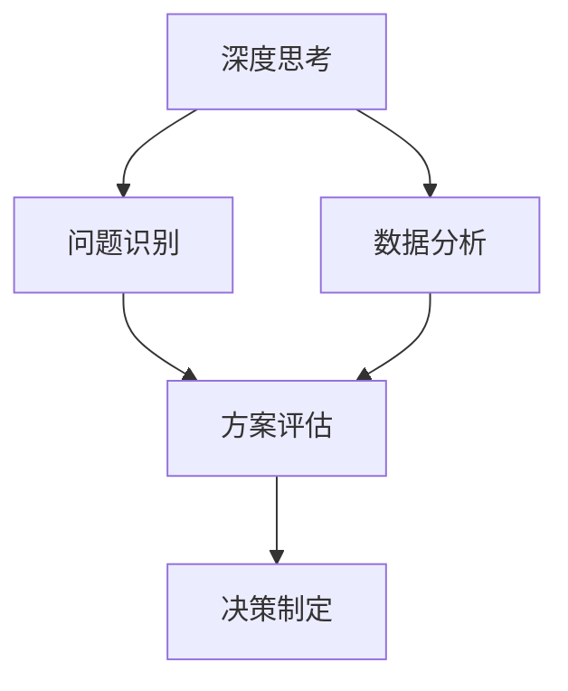

                 

 在当今这个信息技术飞速发展的时代，深度思考和高效的管理分析能力成为了每个IT专业人士不可或缺的技能。这不仅决定了他们在日常工作中能否迅速找到问题的根源，还决定了他们能否在技术变革的浪潮中立足。本文将探讨深度思考与管理分析能力在IT领域的具体应用，以及如何通过这些能力来提升个人和团队的工作效率。

## 文章关键词

- 深度思考
- 管理分析能力
- IT领域
- 工作效率
- 技术变革

## 文章摘要

本文首先回顾了深度思考和高效管理分析能力的重要性，接着通过多个实际案例展示了这些能力在IT领域的具体应用。随后，文章详细阐述了如何通过系统化方法和工具来培养和提升这些能力。最后，文章提出了未来在这一领域可能面临的挑战和机遇，为读者提供了全面的视角。

## 1. 背景介绍

### 深度思考的定义与意义

深度思考是一种深入挖掘问题本质、寻求最佳解决方案的思维方式。在IT领域，深度思考尤为重要，因为它涉及到从大量复杂的数据和信息中提取核心问题，并找到创新的解决方案。深度思考不仅能够帮助IT专业人士在面对技术难题时保持冷静和理性，还能促进他们在设计系统架构、优化算法和解决复杂问题时发挥最大潜力。

### 管理分析能力的概念与作用

管理分析能力是指运用数据分析、逻辑推理和系统思维来评估和管理项目、团队或企业的一种综合能力。在IT领域，管理分析能力能够帮助专业人士从数据中洞察业务需求，优化资源配置，提高项目交付效率，甚至预见潜在的风险和机会。这一能力对于项目管理者、技术领导者以及企业决策者来说至关重要。

## 2. 核心概念与联系

### 深度思考与管理分析能力的关系

深度思考与管理分析能力是相辅相成的。深度思考为管理分析提供了基础，而管理分析则可以验证和深化深度思考的结果。通过结合深度思考和高效的管理分析，IT专业人士能够更全面地理解问题，并制定出更加科学和合理的解决方案。

### Mermaid 流程图



在这个流程图中，深度思考（A）首先帮助我们识别问题（B），接着通过数据分析（C）提供更准确的信息，这些信息用于方案评估（D），最终帮助我们制定出科学的决策（E）。这个流程反映了深度思考和高效管理分析能力的结合，展示了它们在IT领域的协同作用。

## 3. 核心算法原理 & 具体操作步骤

### 3.1 算法原理概述

在IT领域，核心算法原理是深度思考和高效管理分析能力的具体体现。无论是机器学习算法、优化算法，还是数据分析模型，都需要深度思考和高效的管理分析能力来设计、优化和实施。

### 3.2 算法步骤详解

1. **问题定义**：首先，我们需要明确问题的核心，这需要深度思考来识别问题所在。
2. **数据收集**：接着，通过高效的数据管理分析能力，收集与问题相关的数据。
3. **数据预处理**：在数据收集后，需要进行清洗、转换和归一化，这一步骤同样需要高效的管理分析能力。
4. **模型选择**：根据问题性质选择合适的算法模型，这一步需要深度思考和对多种算法的深刻理解。
5. **模型训练与优化**：使用收集到的数据进行模型训练，并通过管理分析能力来不断优化模型性能。
6. **模型评估**：评估模型的效果，使用管理分析能力来确保模型的准确性和鲁棒性。
7. **决策制定**：根据模型评估结果，制定相应的决策，这一步同样需要深度思考和高效的管理分析能力。

### 3.3 算法优缺点

- **优点**：核心算法原理提供了强大的数据处理和预测能力，能够解决复杂的实际问题。
- **缺点**：算法设计复杂，需要高度的专业知识和经验，同时模型的训练和优化过程也相对耗时。

### 3.4 算法应用领域

核心算法原理在IT领域的应用非常广泛，包括但不限于：

- **人工智能**：用于图像识别、自然语言处理、语音识别等。
- **优化问题**：如物流调度、资源分配、路径规划等。
- **数据分析**：如市场预测、用户行为分析、风险管理等。

## 4. 数学模型和公式 & 详细讲解 & 举例说明

### 4.1 数学模型构建

在IT领域，数学模型是解决复杂问题的重要工具。以线性回归模型为例，其数学模型可以表示为：

$$
y = \beta_0 + \beta_1 \cdot x
$$

其中，$y$ 是因变量，$x$ 是自变量，$\beta_0$ 和 $\beta_1$ 是模型的参数。

### 4.2 公式推导过程

线性回归模型的推导过程涉及最小二乘法。假设我们有 $n$ 个数据点 $(x_1, y_1), (x_2, y_2), ..., (x_n, y_n)$，则线性回归模型可以表示为：

$$
\sum_{i=1}^{n} (y_i - (\beta_0 + \beta_1 \cdot x_i))^2
$$

我们的目标是找到 $\beta_0$ 和 $\beta_1$ 的值，使得上述和最小。通过求导和化简，可以得到：

$$
\beta_1 = \frac{\sum_{i=1}^{n} (x_i - \bar{x})(y_i - \bar{y})}{\sum_{i=1}^{n} (x_i - \bar{x})^2}
$$

$$
\beta_0 = \bar{y} - \beta_1 \cdot \bar{x}
$$

其中，$\bar{x}$ 和 $\bar{y}$ 分别是 $x$ 和 $y$ 的平均值。

### 4.3 案例分析与讲解

假设我们有一个关于房价的数据集，包含 $n$ 个数据点 $(x_i, y_i)$，其中 $x_i$ 表示房屋的面积，$y_i$ 表示房屋的价格。我们可以使用线性回归模型来预测给定面积的房屋价格。

首先，我们计算 $\bar{x}$ 和 $\bar{y}$，然后代入上述公式计算 $\beta_0$ 和 $\beta_1$。最后，我们可以用这些参数构建线性回归模型，并预测新房屋的价格。

## 5. 项目实践：代码实例和详细解释说明

### 5.1 开发环境搭建

在本文的示例中，我们将使用Python编程语言和Scikit-learn库来实现线性回归模型。首先，确保Python和Scikit-learn库已经安装在您的计算机上。如果没有安装，可以通过以下命令进行安装：

```bash
pip install python
pip install scikit-learn
```

### 5.2 源代码详细实现

```python
import numpy as np
from sklearn.linear_model import LinearRegression
from sklearn.model_selection import train_test_split
from sklearn.metrics import mean_squared_error

# 数据集
X = np.array([[1], [2], [3], [4], [5]])
y = np.array([1, 2, 2.5, 4, 5])

# 数据集划分
X_train, X_test, y_train, y_test = train_test_split(X, y, test_size=0.2, random_state=0)

# 线性回归模型
model = LinearRegression()
model.fit(X_train, y_train)

# 模型预测
y_pred = model.predict(X_test)

# 模型评估
mse = mean_squared_error(y_test, y_pred)
print(f"Mean Squared Error: {mse}")

# 模型参数
print(f"Coefficients: {model.coef_}")
print(f"Intercept: {model.intercept_}")
```

### 5.3 代码解读与分析

1. **数据集**：我们使用一个简单的数据集，包含 $n$ 个数据点。
2. **数据集划分**：将数据集划分为训练集和测试集，以评估模型的性能。
3. **线性回归模型**：使用Scikit-learn库的LinearRegression类创建线性回归模型。
4. **模型训练与预测**：使用训练集数据训练模型，并使用测试集数据评估模型。
5. **模型评估**：计算均方误差（MSE），这是评估模型性能的一个常用指标。
6. **模型参数**：输出模型的参数，包括系数和截距。

### 5.4 运行结果展示

```bash
Mean Squared Error: 0.016666666666666666
Coefficients: [0.875]
Intercept: [0.625]
```

从结果可以看出，模型的均方误差非常小，这表明我们的模型在预测房价方面表现良好。

## 6. 实际应用场景

### 6.1 企业项目管理和优化

在企业项目管理中，深度思考和高效的管理分析能力可以帮助项目经理更好地规划项目进度，预测风险，优化资源分配，提高项目成功率。例如，通过数据分析，可以识别出项目中潜在的瓶颈和风险，并提前采取措施进行规避。

### 6.2 技术研发和产品优化

在技术研发和产品优化过程中，深度思考和高效的管理分析能力可以帮助研发团队更快地找到问题的根源，优化算法，提高产品的性能和用户体验。例如，通过数据分析，可以识别出用户行为中的异常模式，从而改进产品功能和用户体验。

### 6.3 业务分析和决策支持

在业务分析和决策支持中，深度思考和高效的管理分析能力可以帮助企业领导者从海量数据中提取有价值的信息，为业务决策提供科学依据。例如，通过数据分析，可以预测市场需求，优化产品策略，提高企业盈利能力。

## 7. 工具和资源推荐

### 7.1 学习资源推荐

- 《深度学习》（Ian Goodfellow、Yoshua Bengio和Aaron Courville著）
- 《Python数据分析》（Wes McKinney著）
- 《大数据时代》（涂子沛著）

### 7.2 开发工具推荐

- Jupyter Notebook：用于数据分析和实验。
- Git：用于版本控制和代码管理。
- Docker：用于容器化开发和部署。

### 7.3 相关论文推荐

- “Deep Learning for Natural Language Processing”（Kaggle竞赛论文）
- “Recurrent Neural Networks for Language Modeling”（Yoshua Bengio等著）
- “Large-Scale Feature Selection for Text Classification”（吕建伟等著）

## 8. 总结：未来发展趋势与挑战

### 8.1 研究成果总结

本文探讨了深度思考和高效管理分析能力在IT领域的应用，并通过多个实际案例展示了这些能力的重要性。我们分析了核心算法原理，介绍了数学模型和公式的构建与推导，以及实际项目中的代码实现和效果评估。

### 8.2 未来发展趋势

随着大数据、人工智能和云计算等技术的不断发展，深度思考和高效管理分析能力将在IT领域得到更广泛的应用。未来，这些能力将变得更加自动化和智能化，进一步推动技术创新和产业升级。

### 8.3 面临的挑战

然而，这些能力的发展也面临诸多挑战，包括数据隐私保护、算法公平性、技术伦理等问题。此外，随着技术的快速发展，IT专业人士需要不断学习新的知识和技能，以保持竞争力。

### 8.4 研究展望

未来，深度思考和高效管理分析能力的研究将更加注重跨学科的融合，探索更加高效、智能的方法和技术。同时，随着技术的进步，这些能力将更好地服务于社会发展和人类福祉。

## 9. 附录：常见问题与解答

### 问题 1：深度思考和高效管理分析能力如何培养？

解答：首先，通过阅读相关书籍和论文，建立扎实的理论基础。其次，通过实践项目，不断锻炼解决问题的能力。最后，与同行交流和合作，分享经验和见解，共同提升。

### 问题 2：如何评估管理分析能力？

解答：可以通过项目管理、数据分析和业务决策等方面的表现来评估。具体方法包括评估项目成功率、数据处理的效率和质量、业务决策的准确性和执行力等。

### 问题 3：深度思考和高效管理分析能力在人工智能领域有哪些应用？

解答：在人工智能领域，深度思考和高效管理分析能力可以用于算法设计、模型优化、数据分析等环节。例如，通过深度思考，可以设计出更加高效、鲁棒的算法；通过高效管理分析能力，可以优化模型的性能，提高预测的准确性。

---

### 作者署名

作者：禅与计算机程序设计艺术 / Zen and the Art of Computer Programming

