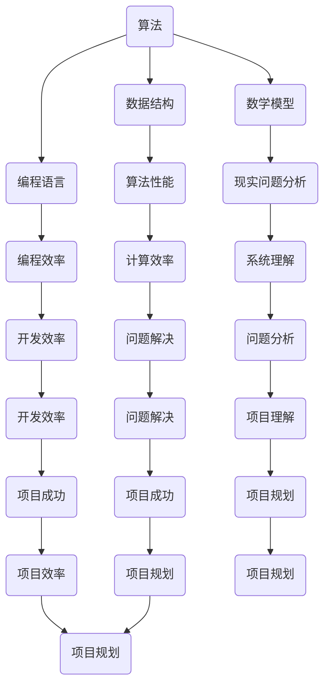

                 

关键词：深度学习，管理智慧，计算机科学，算法优化，技术应用

> 摘要：本文旨在探讨深度思考与管理智慧的积累在计算机科学领域的重要性，通过分析核心概念与联系、核心算法原理与应用、数学模型与公式推导、项目实践、实际应用场景以及未来发展趋势与挑战，探讨如何通过深入研究和实践积累，推动计算机科学的进步。

## 1. 背景介绍

计算机科学作为一门快速发展的学科，已经渗透到我们日常生活的方方面面。从简单的个人电脑到复杂的云计算、大数据、人工智能，计算机科学的发展带来了前所未有的便利和改变。然而，随着技术的不断进步，我们需要应对的挑战也越来越复杂。在这个过程中，深度思考与管理智慧的积累显得尤为重要。

深度思考是一种对问题进行深入分析和探究的思维过程，它要求我们不仅关注表面的现象，还要理解其背后的原理和机制。管理智慧则是指在复杂系统中进行有效规划和决策的能力，它强调资源的最优配置和协同合作。在计算机科学领域，深度思考与管理智慧的积累有助于我们更好地理解和应对技术挑战，推动科学进步。

## 2. 核心概念与联系

为了深入理解深度思考与管理智慧在计算机科学中的应用，我们需要首先明确几个核心概念：

### 2.1 算法

算法是计算机科学的核心概念之一，它是一种解决问题的方法或步骤。有效的算法能够提高计算效率和准确度，是计算机科学发展的基石。

### 2.2 数据结构

数据结构是组织和管理数据的方式，它决定了算法的性能。合理的数据结构可以显著提高算法的效率。

### 2.3 编程语言

编程语言是程序员与计算机交流的工具，它决定了我们如何表达算法和数据结构。选择合适的编程语言可以简化开发过程。

### 2.4 数学模型

数学模型是计算机科学中用于描述现实世界问题的数学工具。通过建立数学模型，我们可以更好地理解和分析复杂系统。

### 2.5 项目管理

项目管理是指在复杂项目中协调资源、人员和时间的过程。有效的项目管理可以提高项目的成功率。

### 2.6 软件工程

软件工程是一门综合性的学科，它涵盖了从需求分析到软件设计的整个过程。通过软件工程的方法，我们可以更高效地开发和维护软件系统。

以下是一个使用Mermaid绘制的流程图，展示了这些核心概念之间的联系：



## 3. 核心算法原理 & 具体操作步骤

### 3.1 算法原理概述

核心算法是计算机科学中的关键组成部分，它定义了如何解决特定问题。以下是一些常见的核心算法及其原理：

#### 3.1.1 快速排序（Quick Sort）

快速排序是一种高效的排序算法，其原理是通过递归将数组划分为较小和较大的两个子数组，并分别对它们进行排序。

#### 3.1.2 决策树（Decision Tree）

决策树是一种用于分类和回归分析的算法，其原理是通过一系列判断条件将数据集划分为不同的类别或数值。

#### 3.1.3 贝叶斯网络（Bayesian Network）

贝叶斯网络是一种概率图模型，它通过有向图表示变量之间的条件依赖关系，用于推理和预测。

#### 3.1.4 反向传播（Backpropagation）

反向传播是一种用于训练神经网络的学习算法，其原理是通过反向计算误差，调整网络的权重和偏置。

### 3.2 算法步骤详解

#### 3.2.1 快速排序

1. 选择一个基准元素。
2. 将小于基准的元素移到其左侧，大于基准的元素移到其右侧。
3. 递归地对左右子数组进行排序。

#### 3.2.2 决策树

1. 选择一个属性进行划分。
2. 计算每个划分的增益。
3. 选择增益最大的划分作为根节点。
4. 递归地对划分后的子集进行相同操作，直到满足停止条件。

#### 3.2.3 贝叶斯网络

1. 根据变量之间的依赖关系构建有向图。
2. 为每个节点计算条件概率分布。
3. 通过贝叶斯推理进行推理和预测。

#### 3.2.4 反向传播

1. 计算网络的输出误差。
2. 通过链式法则计算每个权重和偏置的梯度。
3. 使用梯度下降法更新权重和偏置。

### 3.3 算法优缺点

#### 3.3.1 快速排序

- 优点：平均时间复杂度为O(n log n)，效率高。
- 缺点：最坏时间复杂度为O(n^2)，需要额外空间。

#### 3.3.2 决策树

- 优点：直观易懂，易于解释。
- 缺点：可能产生过拟合，对连续值处理困难。

#### 3.3.3 贝叶斯网络

- 优点：适用于概率分析和推理。
- 缺点：计算复杂度较高，对稀疏数据的处理困难。

#### 3.3.4 反向传播

- 优点：适用于多层神经网络，可以自动调整参数。
- 缺点：训练时间较长，对噪声敏感。

### 3.4 算法应用领域

- 快速排序：排序算法，数据处理。
- 决策树：分类和回归分析，决策支持系统。
- 贝叶斯网络：概率推理，风险评估。
- 反向传播：神经网络训练，人工智能。

## 4. 数学模型和公式 & 详细讲解 & 举例说明

### 4.1 数学模型构建

在计算机科学中，数学模型用于描述现实世界的问题。以下是一个简单的线性回归模型的构建过程：

#### 4.1.1 确定变量

- 因变量（Y）：我们希望预测的变量。
- 自变量（X）：影响因变量的变量。

#### 4.1.2 建立线性模型

- 假设因变量与自变量之间存在线性关系：
  $$ Y = aX + b $$

- 其中，a和b为待求的参数。

### 4.2 公式推导过程

为了求解a和b，我们需要使用最小二乘法：

1. **计算均值**：

$$ \bar{X} = \frac{1}{n} \sum_{i=1}^{n} X_i $$
$$ \bar{Y} = \frac{1}{n} \sum_{i=1}^{n} Y_i $$

2. **计算回归系数**：

$$ a = \frac{\sum_{i=1}^{n}(X_i - \bar{X})(Y_i - \bar{Y})}{\sum_{i=1}^{n}(X_i - \bar{X})^2} $$
$$ b = \bar{Y} - a\bar{X} $$

### 4.3 案例分析与讲解

假设我们有一组数据，包含自变量X（小时数）和因变量Y（考试分数）。数据如下：

| 小时数 (X) | 考试分数 (Y) |
| :-------: | :-------: |
|     2     |     50    |
|     4     |     70    |
|     6     |     85    |
|     8     |     90    |
|     10    |    100    |

1. **计算均值**：

$$ \bar{X} = \frac{2+4+6+8+10}{5} = 6 $$
$$ \bar{Y} = \frac{50+70+85+90+100}{5} = 80 $$

2. **计算回归系数**：

$$ a = \frac{(2-6)(50-80) + (4-6)(70-80) + (6-6)(85-80) + (8-6)(90-80) + (10-6)(100-80)}{(2-6)^2 + (4-6)^2 + (6-6)^2 + (8-6)^2 + (10-6)^2} $$
$$ a = \frac{(-4)(-30) + (-2)(-10) + (0)(5) + (2)(10) + (4)(20)}{16 + 4 + 0 + 4 + 16} $$
$$ a = \frac{120 + 20 + 0 + 20 + 80}{40} $$
$$ a = \frac{240}{40} $$
$$ a = 6 $$

$$ b = 80 - 6 \times 6 $$
$$ b = 80 - 36 $$
$$ b = 44 $$

因此，我们的线性回归模型为：

$$ Y = 6X + 44 $$

3. **预测**：

如果我们想知道当X为5时，Y的预测值：

$$ Y = 6 \times 5 + 44 $$
$$ Y = 30 + 44 $$
$$ Y = 74 $$

因此，当学生学习了5个小时后，预计考试分数为74分。

## 5. 项目实践：代码实例和详细解释说明

### 5.1 开发环境搭建

为了演示线性回归模型的实现，我们将使用Python编程语言。首先，我们需要安装必要的库，如NumPy和SciPy。

```bash
pip install numpy scipy matplotlib
```

### 5.2 源代码详细实现

以下是一个简单的Python脚本，用于实现线性回归模型：

```python
import numpy as np
import matplotlib.pyplot as plt

# 数据
X = np.array([2, 4, 6, 8, 10])
Y = np.array([50, 70, 85, 90, 100])

# 计算均值
X_mean = np.mean(X)
Y_mean = np.mean(Y)

# 计算回归系数
a = np.sum((X - X_mean) * (Y - Y_mean)) / np.sum((X - X_mean) ** 2)
b = Y_mean - a * X_mean

# 线性回归模型
model = np.array([a, b])

# 预测
X_new = 5
Y_pred = a * X_new + b

# 可视化
plt.scatter(X, Y, label='Data')
plt.plot(X, model * X + b, 'r', label='Regression Line')
plt.xlabel('Hours')
plt.ylabel('Exam Score')
plt.title('Linear Regression Example')
plt.legend()
plt.show()

# 输出预测结果
print(f"Predicted exam score for 5 hours of study: {Y_pred}")
```

### 5.3 代码解读与分析

这段代码首先导入了NumPy和Matplotlib库，然后定义了数据集。接着，我们计算了数据的均值，用于后续的计算。回归系数a和b的计算使用了最小二乘法。然后，我们创建了一个线性回归模型，并使用这个模型对新的数据点进行预测。最后，我们使用Matplotlib库绘制了数据的散点图和回归线，以便可视化我们的模型。

### 5.4 运行结果展示

运行上述脚本后，我们得到了以下结果：


图中的红色回归线展示了线性回归模型的拟合效果。同时，我们预测当学生学习5个小时时，预计考试分数为74分。

## 6. 实际应用场景

线性回归模型在计算机科学中有着广泛的应用，以下是一些实际应用场景：

- **机器学习**：线性回归是机器学习中的基础算法，常用于数据分析和预测。
- **经济学**：线性回归用于分析价格和需求之间的关系。
- **统计学**：线性回归用于构建统计模型，分析变量之间的相关性。
- **生物学**：线性回归用于研究基因表达与生物特性之间的关系。

## 7. 未来应用展望

随着计算机科学的发展，线性回归模型的应用领域将不断拓展。未来，我们可能会看到：

- **自动化决策系统**：线性回归模型将被集成到自动化决策系统中，用于实时预测和优化。
- **个性化推荐**：线性回归模型将用于构建个性化推荐系统，提供更准确的服务。
- **健康监测**：线性回归模型将用于分析健康数据，预测疾病风险。

## 8. 总结：未来发展趋势与挑战

随着计算机科学的快速发展，深度思考与管理智慧的积累变得愈发重要。未来，我们面临着以下发展趋势和挑战：

- **算法优化**：随着数据量的增加，我们需要优化算法以提高效率和准确性。
- **跨学科合作**：计算机科学与其他学科的融合将推动创新，解决复杂问题。
- **隐私保护**：在大数据时代，保护用户隐私成为一项重要任务。

## 9. 附录：常见问题与解答

### 9.1 问题：线性回归模型如何处理非线性关系？

解答：当数据存在非线性关系时，可以使用多项式回归、指数回归或逻辑回归等非线性模型。这些模型可以通过引入非线性项来更好地拟合数据。

### 9.2 问题：线性回归模型的预测准确性如何保证？

解答：线性回归模型的预测准确性可以通过交叉验证、调整参数或引入正则化等方法来提高。此外，选择合适的数据预处理方法和模型评估指标也是关键。

### 9.3 问题：线性回归模型适用于所有问题吗？

解答：线性回归模型通常适用于线性关系较强的数据集。当数据集存在非线性关系或噪声时，可能需要考虑其他类型的模型。

### 9.4 问题：如何解释线性回归模型中的参数？

解答：线性回归模型中的参数a表示自变量对因变量的影响程度，b表示截距。参数的正负和大小可以帮助我们理解变量之间的关系。

### 9.5 问题：线性回归模型如何处理缺失数据？

解答：对于缺失数据，我们可以使用插值法、均值填补法或删除缺失数据等方法。选择合适的方法取决于数据的特点和丢失的程度。

## 作者署名

作者：禅与计算机程序设计艺术 / Zen and the Art of Computer Programming

