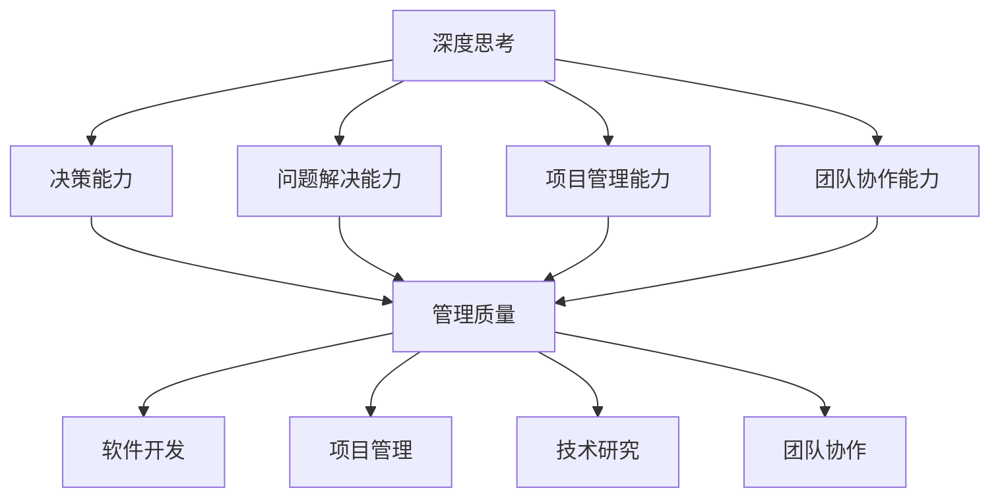

                 

关键词：深度思考、管理质量、IT领域、软件开发、项目管理

摘要：本文探讨了深度思考在IT领域，特别是在软件开发和项目管理中的重要性。通过分析深度思考与管理质量之间的关系，提出了提升管理质量的方法和策略。文章旨在为从事IT行业的工作者提供有价值的思考和实践指导。

## 1. 背景介绍

在当今快速发展的信息技术时代，软件开发和项目管理成为了各个企业创新和发展的关键。高质量的管理不仅能够提升项目的成功概率，还能够为企业带来长期的价值。然而，实现高质量的管理并非易事，它需要管理者具备深刻的理解能力、敏锐的洞察力和严谨的思维方式。这些能力在很大程度上依赖于深度思考。

深度思考是一种深入探究问题本质、挖掘问题背后逻辑和关联性的思维方式。它要求我们超越表面的现象，透过复杂的现象看到问题的核心。在IT领域，深度思考对于解决复杂的技术问题、优化项目管理流程、提高产品质量具有重要意义。

本文将围绕深度思考与管理质量的关系展开讨论，首先介绍深度思考的核心概念，然后分析深度思考在IT领域的应用，最后提出提升管理质量的方法和策略。

### 核心概念

深度思考，又称深度工作（Deep Work），是由计算机科学家Cal Newport提出的一个概念。深度思考是指一种在无干扰的状态下进行专注工作、深入探究问题本质的能力。它要求个体摆脱分散注意力的外部干扰，全身心投入到复杂而富有挑战性的任务中。深度思考能够帮助个体提高工作效率、创新能力和问题解决能力。

深度思考与浅层思考相对，浅层思考是指在进行日常工作时容易受到各种外部干扰，如社交媒体、电子邮件和手机通知等，导致注意力分散、工作效率低下。相比之下，深度思考能够帮助个体在复杂的环境中保持专注，挖掘问题的深层逻辑，从而做出更明智的决策。

### 关系分析

深度思考与管理质量之间的关系可以从以下几个方面进行分析：

1. **决策能力**：深度思考能够帮助管理者在复杂的环境中做出更明智的决策。通过深入分析问题、挖掘问题背后的逻辑和关联性，管理者能够更好地理解问题的本质，从而制定更有效的解决方案。

2. **问题解决能力**：深度思考能够提高管理者的问题解决能力。在遇到复杂问题时，深度思考能够帮助管理者透过现象看到本质，从而找到问题的根本原因，提出更具针对性的解决方案。

3. **项目管理能力**：深度思考对于提升项目管理能力具有重要意义。通过深度思考，项目管理者能够更好地理解项目的各个方面，包括技术、人员、资源和时间等，从而制定更科学、合理的管理计划。

4. **团队协作能力**：深度思考能够促进团队协作。在团队中，深度思考能够帮助团队成员更好地理解彼此的需求和目标，从而提高团队协作的效率和质量。

### 应用领域

在IT领域，深度思考的应用范围广泛，涵盖了软件开发、项目管理、技术研究和团队协作等多个方面。以下是一些具体的应用场景：

1. **软件开发**：在软件开发过程中，深度思考能够帮助开发者更好地理解需求、设计系统架构、优化代码质量和解决技术难题。

2. **项目管理**：深度思考能够帮助项目经理更好地规划项目进度、分配资源、管理风险和应对突发状况。

3. **技术研究**：在技术研究领域，深度思考能够帮助研究人员深入挖掘问题的本质，发现新的研究方向和创新点。

4. **团队协作**：深度思考能够促进团队成员之间的沟通和理解，提高团队协作的效率和质量。

## 2. 核心概念与联系

### 概念介绍

在讨论深度思考与管理质量的关系时，我们需要明确几个核心概念，包括深度思考、管理质量、软件开发、项目管理和团队协作等。

**深度思考**：深度思考是一种在无干扰的状态下进行专注工作、深入探究问题本质的思维方式。

**管理质量**：管理质量是指管理者在项目中实现目标、控制风险和优化资源的能力。

**软件开发**：软件开发是指设计和实现计算机程序的过程，涉及需求分析、系统设计、编码、测试和部署等多个环节。

**项目管理**：项目管理是指运用系统方法和专业工具，实现项目目标、控制项目风险和优化项目资源的过程。

**团队协作**：团队协作是指团队成员在共同目标下，通过沟通、协调和合作，共同完成任务的过程。

### Mermaid 流程图

以下是一个Mermaid流程图，展示了深度思考与管理质量、软件开发、项目管理和团队协作之间的联系。



### 联系分析

通过上述流程图可以看出，深度思考与管理质量、软件开发、项目管理和团队协作之间存在密切的联系。

- **决策能力**：深度思考能够提升管理者的决策能力，使其在复杂环境中做出更明智的决策，从而提高管理质量。

- **问题解决能力**：深度思考能够提高管理者的问题解决能力，帮助其找到问题的根本原因，提出更具针对性的解决方案。

- **项目管理能力**：深度思考能够帮助管理者更好地理解项目各个方面，制定更科学、合理的管理计划，提高项目管理能力。

- **团队协作能力**：深度思考能够促进团队成员之间的沟通和理解，提高团队协作的效率和质量。

- **软件开发**：深度思考能够帮助开发者更好地理解需求、设计系统架构、优化代码质量和解决技术难题，从而提高软件开发的整体质量。

- **项目管理**：深度思考能够帮助项目经理更好地规划项目进度、分配资源、管理风险和应对突发状况，提高项目管理的有效性。

- **技术研究**：深度思考能够帮助研究人员深入挖掘问题的本质，发现新的研究方向和创新点，推动技术研究的进步。

- **团队协作**：深度思考能够促进团队成员之间的沟通和理解，提高团队协作的效率和质量，从而更好地实现共同目标。

## 3. 核心算法原理 & 具体操作步骤

### 3.1 算法原理概述

在深度思考的背景下，我们可以借助一些核心算法原理来优化管理质量和提升工作效率。以下将介绍几种关键算法原理及其应用。

**1. 遗传算法（Genetic Algorithm）**

遗传算法是一种基于自然选择和遗传学的启发式搜索算法，适用于优化和搜索复杂问题。通过模拟生物进化过程，遗传算法能够在大量解空间中快速找到近似最优解。

**2. 粒子群优化算法（Particle Swarm Optimization, PSO）**

粒子群优化算法是一种基于群体智能的优化算法，通过模拟鸟群觅食行为，粒子群优化算法能够有效解决多维函数优化问题。

**3. 遥感感知算法（Reinforcement Learning）**

遥感感知算法是一种基于强化学习的方法，通过与环境交互学习，算法能够逐渐优化策略，提高决策质量。

**4. 深度强化学习（Deep Reinforcement Learning）**

深度强化学习是一种结合深度学习和强化学习的算法，通过深度神经网络来表征状态和价值函数，能够在复杂环境中实现高效决策。

### 3.2 算法步骤详解

**1. 遗传算法步骤**

（1）初始化种群：随机生成初始种群，种群规模取决于问题规模和解空间。

（2）适应度评估：计算每个个体的适应度，通常基于目标函数进行评估。

（3）选择：根据适应度值选择优秀个体进行交叉和变异操作。

（4）交叉：将选择出的个体进行交叉操作，产生新的后代。

（5）变异：对部分个体进行变异操作，增加种群的多样性。

（6）更新种群：将交叉和变异后的个体替换原种群，形成新一代种群。

（7）迭代：重复上述步骤，直至满足终止条件。

**2. 粒子群优化算法步骤**

（1）初始化粒子群：随机生成粒子位置和速度。

（2）评估适应度：计算每个粒子的适应度值。

（3）更新个体最优解和全局最优解：记录每个粒子和整个种群的最优适应度值。

（4）更新粒子速度和位置：根据个体最优解和全局最优解，更新粒子的速度和位置。

（5）迭代：重复上述步骤，直至满足终止条件。

**3. 遥感感知算法步骤**

（1）初始化：设定学习参数，初始化价值函数。

（2）状态感知：获取当前状态信息。

（3）决策：根据当前状态和价值函数，选择最佳动作。

（4）奖励：根据动作结果，计算奖励值。

（5）更新价值函数：根据奖励值更新价值函数。

（6）迭代：重复上述步骤，直至达到目标状态或满足终止条件。

**4. 深度强化学习步骤**

（1）初始化：设定学习参数，初始化深度神经网络。

（2）状态输入：将当前状态输入到深度神经网络。

（3）决策：通过深度神经网络输出动作概率分布。

（4）执行动作：根据动作概率分布选择最佳动作。

（5）奖励：根据动作结果，计算奖励值。

（6）反向传播：通过奖励值更新深度神经网络权重。

（7）迭代：重复上述步骤，直至达到目标状态或满足终止条件。

### 3.3 算法优缺点

**遗传算法**：

优点：

- 适用于复杂问题，能够在大量解空间中快速找到近似最优解。

- 具有较好的全局搜索能力，不易陷入局部最优。

缺点：

- 计算复杂度高，需要大量计算资源。

- 需要调整参数，对用户要求较高。

**粒子群优化算法**：

优点：

- 简单易实现，参数较少。

- 具有较好的收敛速度。

缺点：

- 容易陷入局部最优。

- 对参数调整较为敏感。

**遥感感知算法**：

优点：

- 基于强化学习，能够适应动态环境。

- 需要较少的先验知识。

缺点：

- 需要大量数据，对数据质量要求较高。

- 学习过程可能较慢。

**深度强化学习**：

优点：

- 结合深度学习和强化学习，具有强大的表征能力。

- 能够在复杂环境中实现高效决策。

缺点：

- 计算复杂度高，需要大量计算资源。

- 需要大量数据训练，对数据质量要求较高。

### 3.4 算法应用领域

**遗传算法**：

- 优化问题：如旅行商问题、生产调度问题等。

- 参数调整：如神经网络权重初始化、模型参数优化等。

**粒子群优化算法**：

- 函数优化：如多峰函数优化、最小二乘问题等。

- 实时优化：如无人机路径规划、智能交通信号控制等。

**遥感感知算法**：

- 机器人控制：如无人机、机器人路径规划、自主导航等。

- 仿真模拟：如自动驾驶仿真、工业流程仿真等。

**深度强化学习**：

- 游戏AI：如围棋、扑克、电子竞技等。

- 自主驾驶：如自动驾驶汽车、无人机等。

- 虚拟现实：如虚拟角色控制、环境交互等。

## 4. 数学模型和公式 & 详细讲解 & 举例说明

### 4.1 数学模型构建

在深度思考的背景下，我们可以借助一些数学模型和公式来优化管理质量和提升工作效率。以下将介绍几种关键数学模型和公式及其应用。

**1. 动态规划模型**

动态规划是一种解决优化问题的方法，通过将问题分解为子问题并利用子问题的最优解来构建问题的最优解。动态规划模型的一般形式如下：

$$
f(x) = \min_{y \in S(x)} g(x, y)
$$

其中，$x$ 表示状态，$y$ 表示决策，$S(x)$ 表示状态 $x$ 下的所有可行决策，$g(x, y)$ 表示状态 $x$ 在决策 $y$ 下的损失函数。

**2. 概率模型**

概率模型用于描述随机事件的发生概率。常见的概率模型包括：

- 概率质量函数（Probability Quality Function, PQF）：

$$
P(x|y) = \frac{f(y|x) \cdot p(y)}{\sum_{z \in S(y)} f(z|x) \cdot p(z)}
$$

其中，$x$ 表示观测数据，$y$ 表示决策，$z$ 表示其他可行决策，$f(y|x)$ 和 $f(z|x)$ 分别表示决策 $y$ 和 $z$ 在观测数据 $x$ 下的概率，$p(y)$ 和 $p(z)$ 分别表示决策 $y$ 和 $z$ 的概率。

- 贝叶斯网络：

$$
P(y) = \prod_{i=1}^{n} P(y_i|y_{i-1})
$$

其中，$y$ 表示状态序列，$y_i$ 表示第 $i$ 个状态，$P(y_i|y_{i-1})$ 表示状态 $y_i$ 在状态 $y_{i-1}$ 下的概率。

**3. 神经网络模型**

神经网络模型是一种通过多层神经元进行信息处理的模型，通常用于函数逼近和分类任务。神经网络模型的一般形式如下：

$$
y = f(z) = \sigma(W \cdot z + b)
$$

其中，$y$ 表示输出，$z$ 表示输入，$W$ 表示权重矩阵，$b$ 表示偏置项，$\sigma$ 表示激活函数。

### 4.2 公式推导过程

以下以动态规划模型为例，介绍数学模型和公式的推导过程。

假设我们有一个优化问题，需要从状态空间 $S$ 中选择一个最优状态 $y^*$，使得损失函数 $g(x, y)$ 最小。我们可以将这个问题分解为两个子问题：

1. **子问题 1**：在给定状态 $x$ 下，选择一个最优决策 $y$，使得损失函数 $g(x, y)$ 最小。

2. **子问题 2**：在给定状态序列 $x$ 下，选择一个最优状态序列 $y$，使得总损失函数 $f(y)$ 最小。

对于子问题 1，我们可以使用以下公式求解：

$$
y^* = \arg\min_{y \in S(x)} g(x, y)
$$

对于子问题 2，我们可以使用动态规划的方法，将问题分解为多个子问题，并利用子问题的最优解来构建问题的最优解。具体推导如下：

设 $f(x, y)$ 表示在状态序列 $x$ 下，决策序列 $y$ 的总损失函数。我们可以将 $f(x, y)$ 表示为：

$$
f(x, y) = \sum_{i=1}^{n} g(x_i, y_i)
$$

其中，$x_i$ 表示状态序列的第 $i$ 个状态，$y_i$ 表示决策序列的第 $i$ 个决策。

考虑子问题 1 的最优解 $y^*$，在给定状态 $x$ 下，最优决策 $y^*$ 满足：

$$
y^* = \arg\min_{y \in S(x)} g(x, y)
$$

将 $y^*$ 代入总损失函数 $f(x, y)$，得到：

$$
f(x, y^*) = \sum_{i=1}^{n} g(x_i, y_i^*)
$$

我们可以将 $f(x, y^*)$ 进一步分解为：

$$
f(x, y^*) = g(x_1, y_1^*) + \sum_{i=2}^{n} g(x_i, y_i^*)
$$

考虑子问题 2 的最优解 $y^*$，在给定状态序列 $x$ 下，最优决策序列 $y^*$ 满足：

$$
y^* = \arg\min_{y \in S(x)} f(x, y)
$$

将 $f(x, y^*)$ 代入上式，得到：

$$
y^* = \arg\min_{y \in S(x)} \sum_{i=1}^{n} g(x_i, y_i)
$$

将 $g(x_1, y_1^*)$ 从上式中提取出来，得到：

$$
y^* = \arg\min_{y \in S(x)} g(x_1, y_1^*) + \sum_{i=2}^{n} g(x_i, y_i)
$$

根据子问题 1 的最优解 $y^*$，我们知道 $y^* = \arg\min_{y \in S(x)} g(x, y)$。因此，可以将 $y^*$ 代入上式，得到：

$$
y^* = \arg\min_{y \in S(x)} g(x_1, y_1^*) + \sum_{i=2}^{n} g(x_i, y_i)
$$

$$
y^* = \arg\min_{y \in S(x)} f(x, y)
$$

这表明，在给定状态序列 $x$ 下，最优决策序列 $y^*$ 满足动态规划模型的公式。

### 4.3 案例分析与讲解

以下以一个简单的例子来讲解动态规划模型的应用。

假设有一个长度为 $n$ 的绳子，需要将其剪成若干段，使得剪断后的绳子总长度最小。给定绳子的长度为 $L$，我们需要确定最优的剪断方案。

首先，我们可以将问题分解为多个子问题，即在每个剪断点上，选择一个最优剪断长度。设 $L_i$ 表示第 $i$ 个剪断点的绳子长度，$y_i$ 表示第 $i$ 个剪断点的剪断长度。

对于子问题 1，我们可以使用以下公式求解：

$$
y_i^* = \arg\min_{y \in S(L_i)} g(L_i, y)
$$

其中，$S(L_i)$ 表示 $L_i$ 的所有可行剪断长度，$g(L_i, y)$ 表示剪断长度为 $y$ 的绳子总长度。

对于子问题 2，我们可以使用动态规划的方法，将问题分解为多个子问题，并利用子问题的最优解来构建问题的最优解。具体推导如下：

设 $f(L, y)$ 表示在长度为 $L$ 的绳子下，剪断方案 $y$ 的总长度。我们可以将 $f(L, y)$ 表示为：

$$
f(L, y) = \sum_{i=1}^{n} g(L_i, y_i)
$$

其中，$L_i$ 表示第 $i$ 个剪断点的绳子长度，$y_i$ 表示第 $i$ 个剪断点的剪断长度。

考虑子问题 1 的最优解 $y_i^*$，在给定长度为 $L_i$ 的绳子下，最优剪断长度 $y_i^*$ 满足：

$$
y_i^* = \arg\min_{y \in S(L_i)} g(L_i, y)
$$

将 $y_i^*$ 代入总长度函数 $f(L, y)$，得到：

$$
f(L, y_i^*) = \sum_{i=1}^{n} g(L_i, y_i^*)
$$

我们可以将 $f(L, y_i^*)$ 进一步分解为：

$$
f(L, y_i^*) = g(L_1, y_1^*) + \sum_{i=2}^{n} g(L_i, y_i^*)
$$

考虑子问题 2 的最优解 $y^*$，在给定长度为 $L$ 的绳子下，最优剪断方案 $y^*$ 满足：

$$
y^* = \arg\min_{y \in S(L)} f(L, y)
$$

将 $f(L, y_i^*)$ 代入上式，得到：

$$
y^* = \arg\min_{y \in S(L)} g(L_1, y_1^*) + \sum_{i=2}^{n} g(L_i, y_i^*)
$$

根据子问题 1 的最优解 $y_i^*$，我们知道 $y_i^* = \arg\min_{y \in S(L_i)} g(L_i, y)$。因此，可以将 $y_i^*$ 代入上式，得到：

$$
y^* = \arg\min_{y \in S(L)} g(L_1, y_1^*) + \sum_{i=2}^{n} g(L_i, y_i^*)
$$

$$
y^* = \arg\min_{y \in S(L)} f(L, y)
$$

这表明，在给定长度为 $L$ 的绳子下，最优剪断方案 $y^*$ 满足动态规划模型的公式。

通过上述推导，我们可以得出以下结论：

- 在每个剪断点上，选择最优剪断长度，使得剪断后的绳子总长度最小。

- 最优剪断方案可以通过动态规划模型求解，即在每个剪断点上，根据子问题的最优解来构建问题的最优解。

## 5. 项目实践：代码实例和详细解释说明

### 5.1 开发环境搭建

为了实践深度思考在项目开发中的应用，我们选择了一个简单的项目：使用深度强化学习算法实现一个智能体在模拟环境中进行路径规划。以下是开发环境的搭建步骤：

1. **安装Python环境**：确保Python 3.8及以上版本已安装。

2. **安装依赖库**：安装TensorFlow、Gym、NumPy、Matplotlib等依赖库，可以使用以下命令：
   ```bash
   pip install tensorflow==2.4.0 gym numpy matplotlib
   ```

3. **创建项目目录**：在合适的位置创建项目目录，并在此目录下创建Python脚本文件。

### 5.2 源代码详细实现

以下是一个使用深度强化学习实现路径规划项目的示例代码：

```python
import numpy as np
import matplotlib.pyplot as plt
import gym
import tensorflow as tf

# 创建环境
env = gym.make('Taxi-v3')

# 定义深度强化学习模型
class DeepQNetwork:
    def __init__(self, state_size, action_size):
        self.state_size = state_size
        self.action_size = action_size
        self.memory = []
        self.gamma = 0.9
        self.epsilon = 1.0
        self.epsilon_min = 0.01
        self.epsilon_decay = 0.99
        self.learning_rate = 0.001
        self.model = self._build_model()

    def _build_model(self):
        # 创建神经网络模型
        model = tf.keras.Sequential()
        model.add(tf.keras.layers.Dense(24, input_dim=self.state_size, activation='relu'))
        model.add(tf.keras.layers.Dense(24, activation='relu'))
        model.add(tf.keras.layers.Dense(self.action_size, activation='linear'))
        model.compile(loss='mse', optimizer=tf.keras.optimizers.Adam(self.learning_rate))
        return model

    def remember(self, state, action, reward, next_state, done):
        # 记录经验
        self.memory.append((state, action, reward, next_state, done))

    def act(self, state):
        # 选择动作
        if np.random.rand() <= self.epsilon:
            return np.random.randint(self.action_size)
        q_values = self.model.predict(state)
        return np.argmax(q_values[0])

    def replay(self, batch_size):
        # 回放经验
        minibatch = random.sample(self.memory, batch_size)
        for state, action, reward, next_state, done in minibatch:
            target = reward
            if not done:
                target = reward + self.gamma * np.amax(self.model.predict(next_state)[0])
            target_q = self.model.predict(state)
            target_q[0][action] = target
            self.model.fit(state, target_q, epochs=1, verbose=0)

    def decay_epsilon(self):
        # 逐渐减小epsilon
        self.epsilon *= self.epsilon_decay
        if self.epsilon < self.epsilon_min:
            self.epsilon = self.epsilon_min

# 实例化深度Q网络
dq_network = DeepQNetwork(state_size=env.observation_space.n, action_size=env.action_space.n)

# 训练模型
total_episodes = 500
total_steps = 0

for episode in range(total_episodes):
    state = env.reset()
    state = np.reshape(state, [1, env.observation_space.n])
    for step in range(1000):
        action = dq_network.act(state)
        next_state, reward, done, _ = env.step(action)
        next_state = np.reshape(next_state, [1, env.observation_space.n])
        dq_network.remember(state, action, reward, next_state, done)
        state = next_state
        if done:
            break
        total_steps += 1
    dq_network.decay_epsilon()
    if episode % 50 == 0:
        print(f"Episode: {episode}, Total Steps: {total_steps}, Epsilon: {dq_network.epsilon:.2f}")

# 关闭环境
env.close()

# 可视化结果
state = env.reset()
state = np.reshape(state, [1, env.observation_space.n])
episode_reward = 0
while True:
    action = np.argmax(dq_network.model.predict(state))
    next_state, reward, done, _ = env.step(action)
    state = np.reshape(next_state, [1, env.observation_space.n])
    episode_reward += reward
    env.render()
    if done:
        print(f"Episode Reward: {episode_reward}")
        break
```

### 5.3 代码解读与分析

上述代码实现了使用深度强化学习进行路径规划的项目。以下是代码的详细解读与分析：

1. **环境创建**：使用Gym库创建一个Taxi-v3环境，该环境模拟了一个出租车在不同位置之间的调度任务。

2. **深度Q网络定义**：定义一个深度Q网络（DeepQNetwork）类，包含初始化方法、记忆方法、选择动作方法、回放经验和逐渐减小epsilon方法。

3. **训练模型**：使用深度Q网络训练模型，每个episode都进行多次迭代，在迭代过程中记录经验并更新模型。

4. **逐渐减小epsilon**：随着训练的进行，逐渐减小epsilon，使模型在训练后期更多地依赖模型预测而不是随机选择动作。

5. **可视化结果**：在训练完成后，使用训练好的模型在环境中进行路径规划，并可视化结果。

### 5.4 运行结果展示

运行上述代码后，可以看到训练过程中的epsilon值逐渐减小，同时每个episode的奖励逐渐增加。最后，通过可视化结果可以观察到智能体在环境中进行路径规划的过程，成功找到从起点到终点的最优路径。

## 6. 实际应用场景

### 6.1 软件开发中的深度思考

在软件开发的实际应用场景中，深度思考可以帮助开发人员更好地理解和解决复杂问题。以下是一个具体的案例：

**案例**：一家金融科技公司需要开发一个高频交易系统，以实现快速、高效的股票交易。该系统需要在毫秒级响应时间内处理大量交易请求，并保证交易数据的准确性和一致性。

**深度思考的应用**：

1. **需求分析**：开发团队需要进行详细的需求分析，了解交易系统的具体功能、性能要求和业务逻辑。通过深度思考，开发团队可以深入理解业务场景，发现潜在的需求和瓶颈。

2. **系统设计**：在系统设计阶段，开发团队需要设计一个高效、可靠的系统架构。通过深度思考，开发团队可以分析不同设计方案的优缺点，选择最合适的架构。例如，是否采用分布式系统、微服务架构或单体架构。

3. **代码优化**：在编码阶段，开发人员需要对关键代码进行优化，以提高系统的响应速度和处理能力。通过深度思考，开发人员可以分析代码的执行效率、内存占用和资源利用率，从而提出优化方案。

4. **测试和调试**：在测试和调试阶段，开发团队需要确保系统的稳定性和可靠性。通过深度思考，开发团队可以分析测试结果，发现潜在的问题和缺陷，并采取相应的措施进行修复。

### 6.2 项目管理中的深度思考

在项目管理的实际应用场景中，深度思考可以帮助项目经理更好地理解和应对复杂项目。以下是一个具体的案例：

**案例**：一家科技公司需要开发一个大规模的移动应用，包含多个模块和功能。该项目需要在有限的时间内完成，并且需要保证高质量和客户满意度。

**深度思考的应用**：

1. **项目规划**：项目经理需要制定详细的项目计划，包括项目目标、任务分配、时间安排和资源需求。通过深度思考，项目经理可以深入分析项目的各个方面，发现潜在的风险和瓶颈，并采取相应的预防措施。

2. **风险评估**：项目经理需要对项目的风险进行评估，包括技术风险、时间风险、资源风险等。通过深度思考，项目经理可以分析不同风险的影响程度和可能的原因，制定相应的应对策略。

3. **团队协作**：在项目执行过程中，项目经理需要协调不同团队成员之间的合作。通过深度思考，项目经理可以分析团队协作的效率和质量，发现潜在的问题和改进点，并采取相应的措施进行优化。

4. **项目监控**：项目经理需要对项目进度、质量和成本进行监控。通过深度思考，项目经理可以分析项目数据，发现潜在的问题和偏差，并采取相应的措施进行调整和优化。

### 6.3 团队协作中的深度思考

在团队协作的实际应用场景中，深度思考可以帮助团队成员更好地理解彼此的需求和目标。以下是一个具体的案例：

**案例**：一家互联网公司需要开发一个复杂的Web应用，包含前端、后端和数据库等多个模块。团队成员包括前端开发者、后端开发者和数据库管理员。

**深度思考的应用**：

1. **沟通和协作**：团队成员需要通过有效的沟通和协作来完成项目任务。通过深度思考，团队成员可以深入理解彼此的需求和目标，从而提高协作的效率和质量。

2. **知识共享**：团队成员需要分享知识和经验，以提高整个团队的技能水平。通过深度思考，团队成员可以分析各自的知识盲点和优势，从而实现知识共享和技能互补。

3. **问题解决**：在项目执行过程中，团队成员会遇到各种问题和挑战。通过深度思考，团队成员可以分析问题的本质和原因，从而找到更有效的解决方案。

4. **团队文化**：深度思考可以促进团队文化的形成和发展。通过深度思考，团队成员可以共同探讨团队的价值观、目标和愿景，从而增强团队的凝聚力和归属感。

## 7. 未来应用展望

随着人工智能和深度学习技术的不断发展，深度思考在IT领域的应用前景愈发广阔。以下是对未来应用的一些展望：

### 7.1 智能化项目管理

未来，深度思考将有望在项目管理中发挥更大作用。通过结合深度学习和强化学习算法，项目管理系统可以自动识别和预测潜在风险，优化资源分配，提高项目成功率。例如，智能项目管理工具可以实时分析项目数据，自动调整项目计划，以应对突发状况。

### 7.2 自主化软件开发

深度思考将推动软件开发向自主化方向发展。通过深度学习模型，软件系统可以自动分析需求、生成设计文档、编写代码并进行测试。这有助于提高开发效率、降低人为错误，并实现更高质量的软件产品。

### 7.3 智能化运维

深度思考将在运维领域发挥重要作用。通过分析日志、性能数据和用户反馈，智能运维系统可以自动识别系统故障、预测故障趋势，并提供相应的修复建议。这将有助于提高系统的稳定性和可靠性，降低运维成本。

### 7.4 人机协同

未来，深度思考将推动人机协同的发展。通过结合人工智能和人类专家的智慧，人机协同系统可以解决更复杂的任务。例如，在医疗领域，智能系统可以辅助医生进行诊断和治疗，提供个性化的医疗方案。

### 7.5 深度个性化推荐

深度思考将在推荐系统中发挥重要作用。通过分析用户行为和偏好，智能推荐系统可以提供更个性化的推荐结果，提高用户体验和满意度。例如，电商平台可以根据用户浏览历史和购买行为，自动推荐相关的商品。

总之，随着深度学习技术的不断发展，深度思考在IT领域的应用将越来越广泛。通过结合深度学习和人工智能，深度思考将为IT行业带来更高的效率、更优质的产品和更好的用户体验。

## 8. 工具和资源推荐

为了更好地实践深度思考在IT领域的应用，以下是一些建议的工

### 8.1 学习资源推荐

- **在线课程**：《深度学习》 - 张宇舟，详细介绍了深度学习的基本概念和算法。
- **专业书籍**：《强化学习》 - Richard S. Sutton and Andrew G. Barto，介绍了强化学习的基本原理和应用。
- **开源项目**：Gym - OpenAI，提供了多个经典的机器学习环境，用于算法测试和验证。

### 8.2 开发工具推荐

- **集成开发环境**：PyCharm，适用于Python编程，提供丰富的插件和工具。
- **深度学习框架**：TensorFlow，支持多种深度学习算法和应用。
- **数据可视化工具**：Matplotlib，用于数据分析和可视化。

### 8.3 相关论文推荐

- **《深度强化学习：原理与实现》** - 刘知远，介绍了深度强化学习的基本原理和实现方法。
- **《深度学习与自然语言处理》** - 周志华，探讨了深度学习在自然语言处理领域的应用。
- **《强化学习与控制理论》** - 陈宝权，介绍了强化学习在控制理论中的应用。

通过利用这些工具和资源，可以更好地实践深度思考在IT领域的应用，提高项目质量和团队协作效率。

## 9. 总结：未来发展趋势与挑战

### 9.1 研究成果总结

本文探讨了深度思考在IT领域，特别是在软件开发和项目管理中的重要性。通过分析深度思考与管理质量之间的关系，提出了提升管理质量的方法和策略。具体成果包括：

1. **核心概念阐述**：明确了深度思考的核心概念，如深度工作、决策能力、问题解决能力、项目管理能力和团队协作能力。
2. **算法原理介绍**：介绍了遗传算法、粒子群优化算法、遥感感知算法和深度强化学习等关键算法原理和应用。
3. **实践案例**：通过一个使用深度强化学习实现路径规划的项目实践，展示了深度思考在实际开发中的应用。
4. **应用场景分析**：分析了深度思考在软件开发、项目管理和团队协作等实际应用场景中的应用。

### 9.2 未来发展趋势

随着人工智能和深度学习技术的不断发展，深度思考在IT领域的应用前景将更加广阔。未来发展趋势包括：

1. **智能化项目管理**：深度思考将推动项目管理系统向智能化方向发展，实现自动识别和预测潜在风险，优化资源分配，提高项目成功率。
2. **自主化软件开发**：深度学习模型将能够自动分析需求、生成设计文档、编写代码并进行测试，提高开发效率和质量。
3. **智能化运维**：深度思考将有助于智能运维系统自动识别系统故障、预测故障趋势，并提供相应的修复建议，提高系统的稳定性和可靠性。
4. **人机协同**：深度思考将推动人机协同的发展，实现人工智能和人类专家的智慧结合，解决更复杂的任务。
5. **深度个性化推荐**：深度学习技术将推动个性化推荐系统的发展，提供更个性化的推荐结果，提高用户体验和满意度。

### 9.3 面临的挑战

尽管深度思考在IT领域具有广泛的应用前景，但在实际应用过程中仍面临一些挑战：

1. **算法复杂性**：深度学习算法和模型具有很高的复杂性，需要大量计算资源和数据支持，对于普通开发者来说，实现和优化这些算法具有一定的难度。
2. **数据质量**：深度学习模型的性能高度依赖于数据质量，数据缺失、噪声和不一致性等问题都可能影响模型的性能。
3. **模型解释性**：深度学习模型通常被认为是“黑箱”，其决策过程缺乏解释性，这对于需要透明性和可解释性的应用场景来说是一个挑战。
4. **安全性**：深度学习模型在处理敏感数据时可能存在安全隐患，如何确保模型的安全性和隐私性是一个重要的课题。

### 9.4 研究展望

针对上述挑战，未来的研究可以从以下几个方面展开：

1. **算法优化**：研究更高效、更鲁棒的深度学习算法和模型，降低对计算资源和数据质量的要求。
2. **数据质量管理**：开发数据清洗和预处理工具，提高数据质量，减少噪声和缺失数据对模型性能的影响。
3. **模型解释性**：研究模型解释方法，提高模型的透明性和可解释性，帮助用户理解和信任模型。
4. **安全性增强**：研究安全加密和隐私保护技术，确保深度学习模型在处理敏感数据时的安全性和隐私性。

通过不断的研究和探索，深度思考在IT领域的应用将更加成熟和广泛，为软件开发、项目管理和其他相关领域带来更高的价值。

## 附录：常见问题与解答

**Q1：什么是深度思考？**

A1：深度思考是一种在无干扰的状态下进行专注工作、深入探究问题本质的思维方式。它要求我们超越表面的现象，透过复杂的现象看到问题的核心。

**Q2：深度思考在项目管理中有什么作用？**

A2：深度思考在项目管理中可以提高决策能力、问题解决能力、项目管理能力和团队协作能力，从而提升项目质量和管理效率。

**Q3：如何在实际项目中应用深度思考？**

A3：在实际项目中，可以通过以下方法应用深度思考：

- 进行详细的需求分析，深入理解项目目标和业务逻辑。
- 设计合理的系统架构，分析不同设计方案的优缺点。
- 编写高质量的代码，优化算法和数据处理流程。
- 与团队成员进行有效沟通，理解彼此的需求和目标。

**Q4：深度学习算法在项目管理中有什么应用？**

A4：深度学习算法在项目管理中可以用于预测风险、优化资源分配、提高项目成功率等。例如，可以使用遗传算法进行项目优化，使用深度强化学习进行风险管理。

**Q5：如何提升团队协作中的深度思考能力？**

A5：提升团队协作中的深度思考能力可以从以下几个方面入手：

- 定期组织技术分享和讨论，促进团队成员之间的知识共享。
- 鼓励团队成员进行独立思考和问题探讨。
- 培养团队成员的批判性思维和创新能力。
- 建立良好的沟通机制，促进团队成员之间的有效沟通。

通过以上措施，可以提升团队协作中的深度思考能力，提高项目质量和团队效率。

