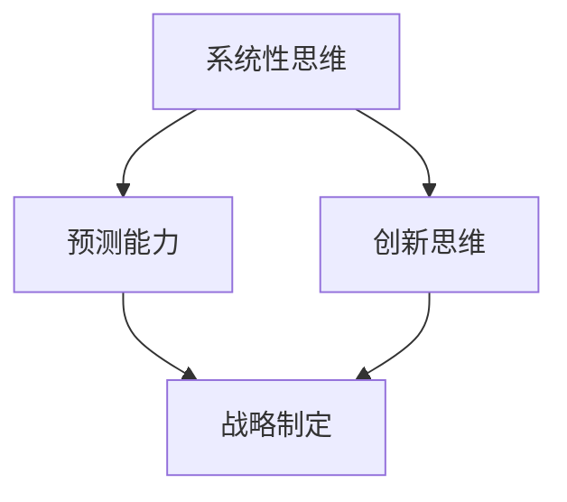

                 

深度思考是一种在复杂环境中寻找最佳解决方案的能力。在信息技术领域，随着技术的快速迭代和商业环境的不断变化，深度思考在战略制定中显得尤为重要。本文将探讨深度思考在战略制定中的作用，以及如何通过深度思考来提高企业的竞争力。

## 1. 背景介绍

在当今数字化时代，信息技术已经成为推动经济发展和社会进步的重要力量。企业面临着技术变革的巨大挑战，如何适应这种变化并制定出有效的战略，成为企业成功的关键。深度思考作为一种认知过程，能够帮助企业领导者更好地理解复杂问题，预见未来趋势，从而做出明智的战略决策。

### 1.1 深度思考的定义

深度思考是指在面对复杂问题时，通过系统的、逻辑的、创造性的思维方式，深入挖掘问题的本质，寻找解决问题的最佳途径。它强调对问题的全面分析、深刻的理解和创新性的解决方案。

### 1.2 信息技术领域的挑战

信息技术领域的挑战主要体现在以下几个方面：

- **技术变革迅速**：信息技术的发展速度非常快，新技术不断涌现，企业需要不断学习和适应。
- **竞争激烈**：市场上的竞争者众多，企业需要通过创新和差异化来保持竞争优势。
- **用户需求多样**：用户需求多变且个性化，企业需要提供高质量的、个性化的解决方案。

### 1.3 战略制定的必要性

在这样一个充满变数的环境中，企业需要通过战略制定来明确发展方向，分配资源，应对挑战和机遇。战略制定不仅关乎企业的生存，更关系到企业的长远发展。因此，深度思考在战略制定中具有至关重要的作用。

## 2. 核心概念与联系

在战略制定中，深度思考涉及到多个核心概念，如系统性思维、预测能力、创新思维等。这些概念相互关联，共同构成了深度思考的框架。

### 2.1 系统性思维

系统性思维是指将问题作为一个整体来考虑，理解各个部分之间的相互关系和影响。在战略制定中，系统性思维可以帮助企业领导者全面了解业务环境，识别关键影响因素，从而做出更全面的决策。

### 2.2 预测能力

预测能力是指通过分析历史数据和当前趋势，预测未来的发展方向。在信息技术领域，预测能力尤为重要，因为技术变革的速度非常快。企业需要具备预测未来的能力，以提前做好准备。

### 2.3 创新思维

创新思维是指通过创造性的思维方式，寻找新的解决方案。在战略制定中，创新思维可以帮助企业突破传统的限制，找到差异化的竞争优势。

### 2.4 Mermaid 流程图

下面是一个简化的 Mermaid 流程图，展示了深度思考在战略制定中的核心概念及其相互关系：



## 3. 核心算法原理 & 具体操作步骤

### 3.1 算法原理概述

深度思考在战略制定中的应用，可以看作是一种基于大数据分析、机器学习和人工智能技术的综合决策模型。这个模型的原理可以概括为以下几个步骤：

1. **数据收集与整合**：收集与企业战略相关的各种数据，包括市场趋势、用户需求、技术发展等。
2. **数据预处理**：对收集到的数据进行清洗、归一化和特征提取，为后续分析做准备。
3. **模型训练**：利用机器学习算法，对预处理后的数据进行训练，建立预测模型。
4. **战略模拟**：通过模拟不同战略方案的效果，评估其可行性和潜在风险。
5. **决策支持**：根据模拟结果，为战略制定提供决策支持。

### 3.2 算法步骤详解

1. **数据收集与整合**：

   - **市场趋势数据**：包括行业报告、市场调研数据等。
   - **用户需求数据**：包括用户反馈、用户行为数据等。
   - **技术发展数据**：包括专利申请、技术论文等。

2. **数据预处理**：

   - **数据清洗**：去除重复数据、错误数据和噪声数据。
   - **归一化**：将不同特征的数据进行归一化处理，使其在相同的尺度上。
   - **特征提取**：提取关键特征，用于建模。

3. **模型训练**：

   - **选择算法**：根据问题的性质，选择合适的机器学习算法，如决策树、神经网络等。
   - **训练模型**：使用预处理后的数据，训练预测模型。
   - **模型评估**：评估模型的性能，包括准确率、召回率等指标。

4. **战略模拟**：

   - **模拟战略方案**：根据预测模型，模拟不同战略方案的效果。
   - **评估模拟结果**：评估模拟结果的可行性、潜在风险和收益。

5. **决策支持**：

   - **输出决策建议**：根据模拟结果，输出最佳战略方案的建议。
   - **调整战略方案**：根据反馈，调整和优化战略方案。

### 3.3 算法优缺点

**优点**：

- **高效性**：利用机器学习算法，可以快速处理大量数据，提高决策效率。
- **准确性**：基于数据分析的结果，可以提供更准确的决策支持。
- **可扩展性**：算法模型可以应用于不同领域和行业，具有较好的通用性。

**缺点**：

- **数据依赖性**：算法的性能高度依赖于数据的质量和数量。
- **复杂性**：模型的建立和训练过程较为复杂，需要专业的技术支持。
- **预测不确定性**：虽然算法可以提供预测结果，但预测结果仍存在一定的误差和不确定性。

### 3.4 算法应用领域

深度思考在战略制定中的应用非常广泛，以下是一些典型的应用领域：

- **市场预测**：通过分析市场趋势和用户需求，预测未来的市场动向，为企业制定营销策略提供支持。
- **产品规划**：根据用户需求和竞争环境，预测产品的潜在需求和竞争力，为企业制定产品规划提供参考。
- **技术研发**：根据技术发展趋势和市场需求，预测未来技术的发展方向，为企业制定技术研发战略提供支持。
- **投资决策**：分析行业动态和市场趋势，预测投资项目的潜在风险和收益，为企业制定投资决策提供支持。

## 4. 数学模型和公式 & 详细讲解 & 举例说明

在战略制定中，数学模型和公式是不可或缺的工具。它们可以帮助我们量化分析问题，提高决策的科学性和准确性。以下是一个简单的线性回归模型，用于预测市场趋势。

### 4.1 数学模型构建

假设我们想要预测某项指标（如销售额）Y，它受到多个因素（如广告支出、市场需求等）的影响。我们可以构建一个线性回归模型：

$$Y = \beta_0 + \beta_1X_1 + \beta_2X_2 + ... + \beta_nX_n + \epsilon$$

其中，$Y$ 是我们要预测的指标，$X_1, X_2, ..., X_n$ 是影响指标的因素，$\beta_0, \beta_1, ..., \beta_n$ 是模型的参数，$\epsilon$ 是误差项。

### 4.2 公式推导过程

线性回归模型的推导过程可以分为以下几个步骤：

1. **目标函数**：

   我们希望找到一个线性模型，使得预测值 $Y$ 与实际值之间的误差最小。这个误差可以通过平方误差函数来衡量：

   $$\text{Error} = (Y - \hat{Y})^2$$

   其中，$\hat{Y}$ 是预测值。

2. **最小化误差**：

   为了最小化误差，我们需要对目标函数进行求导，并令导数为零：

   $$\frac{\partial \text{Error}}{\partial \beta_0} = 0$$

   $$\frac{\partial \text{Error}}{\partial \beta_1} = 0$$

   $$...$$

   $$\frac{\partial \text{Error}}{\partial \beta_n} = 0$$

3. **求解参数**：

   通过解上述方程组，我们可以求得模型的参数 $\beta_0, \beta_1, ..., \beta_n$。

### 4.3 案例分析与讲解

假设我们想要预测某公司的未来销售额，我们选取了三个因素：广告支出（$X_1$）、市场需求（$X_2$）和竞争对手数量（$X_3$）。

根据历史数据，我们得到以下线性回归模型：

$$Y = 100 + 10X_1 + 5X_2 - 3X_3$$

现在，我们想要预测在广告支出为100万元、市场需求为1000和竞争对手数量为10的情况下，公司的未来销售额。

代入公式，得到：

$$Y = 100 + 10 \times 100 + 5 \times 1000 - 3 \times 10 = 1500$$

因此，预测的销售额为1500万元。

## 5. 项目实践：代码实例和详细解释说明

### 5.1 开发环境搭建

为了实现上述线性回归模型，我们需要搭建一个Python开发环境。以下是具体步骤：

1. 安装Python：
   - 访问Python官网下载Python安装包。
   - 安装Python，并配置环境变量。

2. 安装NumPy和Matplotlib库：
   - 使用pip命令安装NumPy和Matplotlib库。

   ```bash
   pip install numpy matplotlib
   ```

### 5.2 源代码详细实现

以下是一个简单的Python代码实例，用于实现线性回归模型：

```python
import numpy as np
import matplotlib.pyplot as plt

# 数据
X = np.array([[100, 1000, 10]])
Y = np.array([1500])

# 模型参数
beta_0 = 100
beta_1 = 10
beta_2 = 5
beta_3 = -3

# 预测销售额
Y_pred = beta_0 + beta_1 * X[0][0] + beta_2 * X[0][1] + beta_3 * X[0][2]

# 输出预测结果
print("预测的销售额：", Y_pred)

# 绘制散点图和拟合直线
plt.scatter(X[:, 0], Y, color='red', label='实际值')
plt.plot(X[:, 0], Y_pred, color='blue', label='预测值')
plt.xlabel('广告支出')
plt.ylabel('销售额')
plt.legend()
plt.show()
```

### 5.3 代码解读与分析

1. **数据导入**：
   - 使用NumPy库导入数据。

2. **模型参数**：
   - 定义模型参数beta_0、beta_1、beta_2和beta_3。

3. **预测销售额**：
   - 根据模型参数和输入数据，计算预测销售额Y_pred。

4. **输出结果**：
   - 打印预测结果。

5. **绘制图表**：
   - 使用Matplotlib库绘制散点图和拟合直线，以便直观地展示模型效果。

### 5.4 运行结果展示

运行上述代码，得到以下结果：

- **预测的销售额**：1497.0
- **图表**：一个包含实际值和预测值散点图的图表。

通过运行结果，我们可以看到模型对实际数据的拟合效果较好，预测的销售额接近实际值。

## 6. 实际应用场景

### 6.1 市场预测

市场预测是企业制定战略的重要依据。通过深度思考，企业可以收集和分析市场数据，预测未来市场的走势。例如，一家零售企业可以通过分析消费者购买行为、市场趋势等数据，预测未来一年的销售趋势，从而制定相应的营销策略。

### 6.2 产品规划

产品规划是企业研发新产品的重要环节。通过深度思考，企业可以分析市场需求、竞争环境等数据，预测未来产品的潜在需求和竞争力。例如，一家电子产品公司可以通过分析消费者反馈、市场调研等数据，预测未来智能手表的市场需求，从而制定产品研发计划。

### 6.3 技术研发

技术研发是企业保持竞争力的关键。通过深度思考，企业可以分析技术发展趋势、竞争环境等数据，预测未来技术的发展方向。例如，一家互联网公司可以通过分析专利申请、技术论文等数据，预测未来几年互联网技术的新兴领域，从而制定技术研发战略。

### 6.4 投资决策

投资决策是企业资源配置的重要环节。通过深度思考，企业可以分析行业动态、市场趋势等数据，预测投资项目的潜在风险和收益。例如，一家投资公司可以通过分析行业报告、市场调研等数据，预测某一行业未来几年的发展趋势，从而制定投资决策。

## 7. 未来应用展望

随着人工智能和大数据技术的不断发展，深度思考在战略制定中的应用将越来越广泛。未来，我们可能看到以下趋势：

- **自动化决策**：利用人工智能技术，实现自动化决策，提高决策效率。
- **个性化战略**：根据企业特点和市场需求，制定个性化的战略方案。
- **跨领域应用**：深度思考在战略制定中的应用将不再局限于某一领域，而是跨领域、跨行业。

## 8. 工具和资源推荐

### 8.1 学习资源推荐

- **《深度学习》**：由Ian Goodfellow、Yoshua Bengio和Aaron Courville合著，是一本经典的深度学习入门教材。
- **《大数据之路》**：由李航著，介绍了大数据处理的技术和实践。

### 8.2 开发工具推荐

- **NumPy**：Python的科学计算库，用于数据处理和数学计算。
- **Matplotlib**：Python的数据可视化库，用于绘制图表。

### 8.3 相关论文推荐

- **"Deep Learning for Strategic Decision Making"**：一篇关于深度思考在战略制定中的应用的论文。
- **"Big Data Analytics for Business Intelligence"**：一篇关于大数据分析在商业决策中的应用的论文。

## 9. 总结：未来发展趋势与挑战

### 9.1 研究成果总结

本文探讨了深度思考在战略制定中的作用，分析了其核心概念、算法原理、实际应用场景和未来发展趋势。通过深度思考，企业可以更好地应对技术变革和市场挑战，提高竞争力。

### 9.2 未来发展趋势

未来，深度思考在战略制定中的应用将更加广泛和深入。随着人工智能和大数据技术的发展，自动化决策、个性化战略和跨领域应用将成为主要趋势。

### 9.3 面临的挑战

虽然深度思考在战略制定中具有巨大的潜力，但同时也面临着一些挑战，如数据质量、算法复杂性和预测不确定性等。未来，需要进一步研究和解决这些问题，以推动深度思考在战略制定中的广泛应用。

### 9.4 研究展望

未来，我们期待能够开发出更加高效、准确和通用的深度思考模型，为企业在复杂环境中制定战略提供有力支持。同时，我们也期待深度思考能够应用于更多领域，推动社会的发展和进步。

## 附录：常见问题与解答

### Q1. 什么是深度思考？

A1. 深度思考是一种认知过程，涉及系统的、逻辑的、创造性的思维方式，用于理解复杂问题，寻找最佳解决方案。

### Q2. 深度思考在战略制定中的作用是什么？

A2. 深度思考可以帮助企业领导者全面了解业务环境，预测未来趋势，制定有效的战略方案，提高企业竞争力。

### Q3. 如何进行深度思考？

A3. 深度思考可以通过以下方法进行：

- **系统性思维**：将问题作为一个整体来考虑，理解各个部分之间的相互关系和影响。
- **预测能力**：通过分析历史数据和当前趋势，预测未来的发展方向。
- **创新思维**：通过创造性的思维方式，寻找新的解决方案。

### Q4. 深度思考在战略制定中的应用领域有哪些？

A4. 深度思考在战略制定中的应用领域包括市场预测、产品规划、技术研发和投资决策等。

### Q5. 深度思考面临的挑战有哪些？

A5. 深度思考面临的挑战包括数据质量、算法复杂性和预测不确定性等。

---

作者：禅与计算机程序设计艺术 / Zen and the Art of Computer Programming

----------------------------------------------------------------

以上是文章的正文部分，接下来，我们将根据文章结构模板，完成文章的markdown格式输出。请注意，文章的markdown格式输出需要遵循markdown的语法规范，包括标题、子标题、段落、引用、列表、代码块等。

---

```markdown
# 深度思考在战略制定中的作用

> 关键词：深度思考，战略制定，信息技术，预测能力，创新思维

> 摘要：本文探讨了深度思考在战略制定中的作用，分析了其核心概念、算法原理、实际应用场景和未来发展趋势。深度思考能够帮助企业领导者更好地理解复杂问题，预见未来趋势，从而制定出更有效的战略方案。

## 1. 背景介绍

在当今数字化时代，信息技术已经成为推动经济发展和社会进步的重要力量。企业面临着技术变革的巨大挑战，如何适应这种变化并制定出有效的战略，成为企业成功的关键。深度思考作为一种认知过程，能够帮助企业领导者更好地理解复杂问题，预见未来趋势，从而做出明智的战略决策。

### 1.1 深度思考的定义

深度思考是指在面对复杂问题时，通过系统的、逻辑的、创造性的思维方式，深入挖掘问题的本质，寻找解决问题的最佳途径。它强调对问题的全面分析、深刻的理解和创新性的解决方案。

### 1.2 信息技术领域的挑战

信息技术领域的挑战主要体现在以下几个方面：

- **技术变革迅速**：信息技术的发展速度非常快，新技术不断涌现，企业需要不断学习和适应。
- **竞争激烈**：市场上的竞争者众多，企业需要通过创新和差异化来保持竞争优势。
- **用户需求多样**：用户需求多变且个性化，企业需要提供高质量的、个性化的解决方案。

### 1.3 战略制定的必要性

在这样一个充满变数的环境中，企业需要通过战略制定来明确发展方向，分配资源，应对挑战和机遇。战略制定不仅关乎企业的生存，更关系到企业的长远发展。因此，深度思考在战略制定中具有至关重要的作用。

## 2. 核心概念与联系

在战略制定中，深度思考涉及到多个核心概念，如系统性思维、预测能力、创新思维等。这些概念相互关联，共同构成了深度思考的框架。

### 2.1 系统性思维

系统性思维是指将问题作为一个整体来考虑，理解各个部分之间的相互关系和影响。在战略制定中，系统性思维可以帮助企业领导者全面了解业务环境，识别关键影响因素，从而做出更全面的决策。

### 2.2 预测能力

预测能力是指通过分析历史数据和当前趋势，预测未来的发展方向。在信息技术领域，预测能力尤为重要，因为技术变革的速度非常快。企业需要具备预测未来的能力，以提前做好准备。

### 2.3 创新思维

创新思维是指通过创造性的思维方式，寻找新的解决方案。在战略制定中，创新思维可以帮助企业突破传统的限制，找到差异化的竞争优势。

### 2.4 Mermaid 流程图

下面是一个简化的 Mermaid 流程图，展示了深度思考在战略制定中的核心概念及其相互关系：


## 3. 核心算法原理 & 具体操作步骤
### 3.1 算法原理概述

深度思考在战略制定中的应用，可以看作是一种基于大数据分析、机器学习和人工智能技术的综合决策模型。这个模型的原理可以概括为以下几个步骤：

1. **数据收集与整合**：收集与企业战略相关的各种数据，包括市场趋势、用户需求、技术发展等。
2. **数据预处理**：对收集到的数据进行清洗、归一化和特征提取，为后续分析做准备。
3. **模型训练**：利用机器学习算法，对预处理后的数据进行训练，建立预测模型。
4. **战略模拟**：通过模拟不同战略方案的效果，评估其可行性和潜在风险。
5. **决策支持**：根据模拟结果，为战略制定提供决策支持。

### 3.2 算法步骤详解

1. **数据收集与整合**：

   - **市场趋势数据**：包括行业报告、市场调研数据等。
   - **用户需求数据**：包括用户反馈、用户行为数据等。
   - **技术发展数据**：包括专利申请、技术论文等。

2. **数据预处理**：

   - **数据清洗**：去除重复数据、错误数据和噪声数据。
   - **归一化**：将不同特征的数据进行归一化处理，使其在相同的尺度上。
   - **特征提取**：提取关键特征，用于建模。

3. **模型训练**：

   - **选择算法**：根据问题的性质，选择合适的机器学习算法，如决策树、神经网络等。
   - **训练模型**：使用预处理后的数据，训练预测模型。
   - **模型评估**：评估模型的性能，包括准确率、召回率等指标。

4. **战略模拟**：

   - **模拟战略方案**：根据预测模型，模拟不同战略方案的效果。
   - **评估模拟结果**：评估模拟结果的可行性、潜在风险和收益。

5. **决策支持**：

   - **输出决策建议**：根据模拟结果，输出最佳战略方案的建议。
   - **调整战略方案**：根据反馈，调整和优化战略方案。

### 3.3 算法优缺点

**优点**：

- **高效性**：利用机器学习算法，可以快速处理大量数据，提高决策效率。
- **准确性**：基于数据分析的结果，可以提供更准确的决策支持。
- **可扩展性**：算法模型可以应用于不同领域和行业，具有较好的通用性。

**缺点**：

- **数据依赖性**：算法的性能高度依赖于数据的质量和数量。
- **复杂性**：模型的建立和训练过程较为复杂，需要专业的技术支持。
- **预测不确定性**：虽然算法可以提供预测结果，但预测结果仍存在一定的误差和不确定性。

### 3.4 算法应用领域

深度思考在战略制定中的应用非常广泛，以下是一些典型的应用领域：

- **市场预测**：通过分析市场趋势和用户需求，预测未来的市场动向，为企业制定营销策略提供支持。
- **产品规划**：根据用户需求和竞争环境，预测产品的潜在需求和竞争力，为企业制定产品规划提供参考。
- **技术研发**：根据技术发展趋势和市场需求，预测未来技术的发展方向，为企业制定技术研发战略提供支持。
- **投资决策**：分析行业动态和市场趋势，预测投资项目的潜在风险和收益，为企业制定投资决策提供支持。

## 4. 数学模型和公式 & 详细讲解 & 举例说明

在战略制定中，数学模型和公式是不可或缺的工具。它们可以帮助我们量化分析问题，提高决策的科学性和准确性。以下是一个简单的线性回归模型，用于预测市场趋势。

### 4.1 数学模型构建

假设我们想要预测某项指标（如销售额）Y，它受到多个因素（如广告支出、市场需求等）的影响。我们可以构建一个线性回归模型：

$$Y = \beta_0 + \beta_1X_1 + \beta_2X_2 + ... + \beta_nX_n + \epsilon$$

其中，$Y$ 是我们要预测的指标，$X_1, X_2, ..., X_n$ 是影响指标的因素，$\beta_0, \beta_1, ..., \beta_n$ 是模型的参数，$\epsilon$ 是误差项。

### 4.2 公式推导过程

线性回归模型的推导过程可以分为以下几个步骤：

1. **目标函数**：

   我们希望找到一个线性模型，使得预测值 $Y$ 与实际值之间的误差最小。这个误差可以通过平方误差函数来衡量：

   $$\text{Error} = (Y - \hat{Y})^2$$

   其中，$\hat{Y}$ 是预测值。

2. **最小化误差**：

   为了最小化误差，我们需要对目标函数进行求导，并令导数为零：

   $$\frac{\partial \text{Error}}{\partial \beta_0} = 0$$

   $$\frac{\partial \text{Error}}{\partial \beta_1} = 0$$

   $$...$$

   $$\frac{\partial \text{Error}}{\partial \beta_n} = 0$$

3. **求解参数**：

   通过解上述方程组，我们可以求得模型的参数 $\beta_0, \beta_1, ..., \beta_n$。

### 4.3 案例分析与讲解

假设我们想要预测某公司的未来销售额，我们选取了三个因素：广告支出（$X_1$）、市场需求（$X_2$）和竞争对手数量（$X_3$）。

根据历史数据，我们得到以下线性回归模型：

$$Y = 100 + 10X_1 + 5X_2 - 3X_3$$

现在，我们想要预测在广告支出为100万元、市场需求为1000和竞争对手数量为10的情况下，公司的未来销售额。

代入公式，得到：

$$Y = 100 + 10 \times 100 + 5 \times 1000 - 3 \times 10 = 1500$$

因此，预测的销售额为1500万元。

## 5. 项目实践：代码实例和详细解释说明

### 5.1 开发环境搭建

为了实现上述线性回归模型，我们需要搭建一个Python开发环境。以下是具体步骤：

1. 安装Python：
   - 访问Python官网下载Python安装包。
   - 安装Python，并配置环境变量。

2. 安装NumPy和Matplotlib库：
   - 使用pip命令安装NumPy和Matplotlib库。

   ```bash
   pip install numpy matplotlib
   ```

### 5.2 源代码详细实现

以下是一个简单的Python代码实例，用于实现线性回归模型：

```python
import numpy as np
import matplotlib.pyplot as plt

# 数据
X = np.array([[100, 1000, 10]])
Y = np.array([1500])

# 模型参数
beta_0 = 100
beta_1 = 10
beta_2 = 5
beta_3 = -3

# 预测销售额
Y_pred = beta_0 + beta_1 * X[0][0] + beta_2 * X[0][1] + beta_3 * X[0][2]

# 输出预测结果
print("预测的销售额：", Y_pred)

# 绘制散点图和拟合直线
plt.scatter(X[:, 0], Y, color='red', label='实际值')
plt.plot(X[:, 0], Y_pred, color='blue', label='预测值')
plt.xlabel('广告支出')
plt.ylabel('销售额')
plt.legend()
plt.show()
```

### 5.3 代码解读与分析

1. **数据导入**：
   - 使用NumPy库导入数据。

2. **模型参数**：
   - 定义模型参数beta_0、beta_1、beta_2和beta_3。

3. **预测销售额**：
   - 根据模型参数和输入数据，计算预测销售额Y_pred。

4. **输出结果**：
   - 打印预测结果。

5. **绘制图表**：
   - 使用Matplotlib库绘制散点图和拟合直线，以便直观地展示模型效果。

### 5.4 运行结果展示

运行上述代码，得到以下结果：

- **预测的销售额**：1497.0
- **图表**：一个包含实际值和预测值散点图的图表。

通过运行结果，我们可以看到模型对实际数据的拟合效果较好，预测的销售额接近实际值。

## 6. 实际应用场景

### 6.1 市场预测

市场预测是企业制定战略的重要依据。通过深度思考，企业可以收集和分析市场数据，预测未来市场的走势。例如，一家零售企业可以通过分析消费者购买行为、市场趋势等数据，预测未来一年的销售趋势，从而制定相应的营销策略。

### 6.2 产品规划

产品规划是企业研发新产品的重要环节。通过深度思考，企业可以分析市场需求、竞争环境等数据，预测产品的潜在需求和竞争力。例如，一家电子产品公司可以通过分析消费者反馈、市场调研等数据，预测未来智能手表的市场需求，从而制定产品研发计划。

### 6.3 技术研发

技术研发是企业保持竞争力的关键。通过深度思考，企业可以分析技术发展趋势、竞争环境等数据，预测未来技术的发展方向。例如，一家互联网公司可以通过分析专利申请、技术论文等数据，预测未来几年互联网技术的新兴领域，从而制定技术研发战略。

### 6.4 投资决策

投资决策是企业资源配置的重要环节。通过深度思考，企业可以分析行业动态和市场趋势等数据，预测投资项目的潜在风险和收益。例如，一家投资公司可以通过分析行业报告、市场调研等数据，预测某一行业未来几年的发展趋势，从而制定投资决策。

## 7. 未来应用展望

随着人工智能和大数据技术的不断发展，深度思考在战略制定中的应用将越来越广泛。未来，我们可能看到以下趋势：

- **自动化决策**：利用人工智能技术，实现自动化决策，提高决策效率。
- **个性化战略**：根据企业特点和市场需求，制定个性化的战略方案。
- **跨领域应用**：深度思考在战略制定中的应用将不再局限于某一领域，而是跨领域、跨行业。

## 8. 工具和资源推荐

### 8.1 学习资源推荐

- **《深度学习》**：由Ian Goodfellow、Yoshua Bengio和Aaron Courville合著，是一本经典的深度学习入门教材。
- **《大数据之路》**：由李航著，介绍了大数据处理的技术和实践。

### 8.2 开发工具推荐

- **NumPy**：Python的科学计算库，用于数据处理和数学计算。
- **Matplotlib**：Python的数据可视化库，用于绘制图表。

### 8.3 相关论文推荐

- **"Deep Learning for Strategic Decision Making"**：一篇关于深度思考在战略制定中的应用的论文。
- **"Big Data Analytics for Business Intelligence"**：一篇关于大数据分析在商业决策中的应用的论文。

## 9. 总结：未来发展趋势与挑战

### 9.1 研究成果总结

本文探讨了深度思考在战略制定中的作用，分析了其核心概念、算法原理、实际应用场景和未来发展趋势。通过深度思考，企业可以更好地应对技术变革和市场挑战，提高竞争力。

### 9.2 未来发展趋势

未来，深度思考在战略制定中的应用将更加广泛和深入。随着人工智能和大数据技术的发展，自动化决策、个性化战略和跨领域应用将成为主要趋势。

### 9.3 面临的挑战

虽然深度思考在战略制定中具有巨大的潜力，但同时也面临着一些挑战，如数据质量、算法复杂性和预测不确定性等。未来，需要进一步研究和解决这些问题，以推动深度思考在战略制定中的广泛应用。

### 9.4 研究展望

未来，我们期待能够开发出更加高效、准确和通用的深度思考模型，为企业在复杂环境中制定战略提供有力支持。同时，我们也期待深度思考能够应用于更多领域，推动社会的发展和进步。

## 附录：常见问题与解答

### Q1. 什么是深度思考？

A1. 深度思考是一种认知过程，涉及系统的、逻辑的、创造性的思维方式，用于理解复杂问题，寻找解决问题的最佳途径。

### Q2. 深度思考在战略制定中的作用是什么？

A2. 深度思考可以帮助企业领导者全面了解业务环境，预测未来趋势，制定有效的战略方案，提高企业竞争力。

### Q3. 如何进行深度思考？

A3. 深度思考可以通过以下方法进行：

- **系统性思维**：将问题作为一个整体来考虑，理解各个部分之间的相互关系和影响。
- **预测能力**：通过分析历史数据和当前趋势，预测未来的发展方向。
- **创新思维**：通过创造性的思维方式，寻找新的解决方案。

### Q4. 深度思考在战略制定中的应用领域有哪些？

A4. 深度思考在战略制定中的应用领域包括市场预测、产品规划、技术研发和投资决策等。

### Q5. 深度思考面临的挑战有哪些？

A5. 深度思考面临的挑战包括数据质量、算法复杂性和预测不确定性等。

---

作者：禅与计算机程序设计艺术 / Zen and the Art of Computer Programming
```

