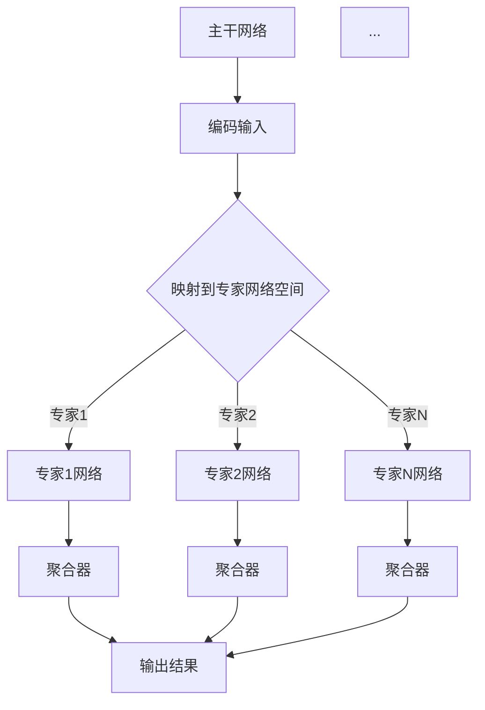

                 

关键词：混合专家模型（MoE）、大规模模型、模型效率、机器学习、神经网络、并行计算

摘要：本文深入探讨了混合专家模型（MoE），一种为提高大规模模型效率而设计的新型模型架构。我们将介绍MoE的核心概念、原理、算法步骤及其应用领域。同时，通过数学模型和具体项目实践，我们将解析MoE在实际中的应用及其带来的效率提升。最后，我们将展望MoE在未来机器学习领域的发展趋势与挑战。

## 1. 背景介绍

### 大规模模型的现状

随着深度学习技术的迅猛发展，大规模神经网络模型在各个领域取得了显著的成就。然而，这些模型面临着计算资源消耗巨大、训练时间漫长等问题。为解决这些问题，研究人员不断探索各种优化方法，如模型剪枝、量化、迁移学习等。然而，这些方法在提高模型效率方面仍有局限性。

### 混合专家模型（MoE）的提出

混合专家模型（MoE，Mixture of Experts）是一种新型模型架构，旨在通过将大规模神经网络分解为多个小型专家网络，从而提高模型训练和推理的效率。MoE的核心思想是将复杂任务分解为多个子任务，每个子任务由一个专家网络处理，从而实现并行计算，降低计算资源消耗。

## 2. 核心概念与联系

### MoE的核心概念

MoE由一个主干网络和多个专家网络组成。主干网络负责接收输入数据，将其映射到专家网络的空间中，然后由相应的专家网络处理。最终，所有专家网络的输出被聚合起来，得到最终的预测结果。

### MoE的架构


- 主干网络（DNN）：负责接收输入数据，将其编码为高维特征向量。
- 专家网络（Experts）：多个小型神经网络，每个专家网络处理一部分输入数据。
- 聚合器（Aggregator）：将所有专家网络的输出进行聚合，得到最终预测结果。

### Mermaid流程图



## 3. 核心算法原理 & 具体操作步骤

### 3.1 算法原理概述

MoE的核心算法原理是并行计算。通过将大规模模型分解为多个小型专家网络，MoE可以在训练和推理过程中实现并行化，从而提高计算效率。具体来说，MoE的算法步骤包括以下几部分：

1. **输入编码**：主干网络将输入数据编码为高维特征向量。
2. **映射到专家网络空间**：根据高维特征向量，将输入数据映射到专家网络的空间中。
3. **专家网络处理**：每个专家网络处理对应的部分输入数据，生成中间结果。
4. **聚合中间结果**：将所有专家网络的输出进行聚合，得到最终预测结果。

### 3.2 算法步骤详解

1. **主干网络编码输入**

   主干网络接收输入数据，通过多层神经网络将其编码为高维特征向量。这一步类似于传统的神经网络，其主要目的是提取输入数据的特征。

   ```mermaid
   graph TD
   A[输入] --> B[编码层1]
   B --> C[编码层2]
   C --> D[编码层3]
   D --> E[高维特征向量]
   ```

2. **映射到专家网络空间**

   根据高维特征向量，将输入数据映射到专家网络的空间中。这一步通常使用类似K-means聚类的方法，将特征向量映射到专家网络的索引。

   ```mermaid
   graph TD
   E[高维特征向量] --> F{聚类算法}
   F --> G{专家索引}
   G --> H{映射结果}
   ```

3. **专家网络处理**

   每个专家网络处理对应的部分输入数据，生成中间结果。这一步是MoE的核心步骤，通过并行计算，实现了大规模模型的效率提升。

   ```mermaid
   graph TD
   H[映射结果] --> I{专家1网络}
   H --> J{专家2网络}
   ...
   H --> K{专家N网络}
   I --> L{中间结果1}
   J --> L{中间结果2}
   ...
   K --> L{中间结果N}
   ```

4. **聚合中间结果**

   将所有专家网络的输出进行聚合，得到最终预测结果。这一步通常使用加权平均或softmax等方法，将专家网络的输出进行融合。

   ```mermaid
   graph TD
   L{中间结果} --> M{聚合器}
   M --> N{输出结果}
   ```

### 3.3 算法优缺点

**优点：**

1. 提高模型训练和推理的效率，降低计算资源消耗。
2. 增强模型的泛化能力，减少过拟合。
3. 适用于各种复杂任务，具有广泛的适用性。

**缺点：**

1. 需要设计合适的聚类算法，确保专家网络的划分合理。
2. 聚合器的性能对模型性能有较大影响，需要优化。

### 3.4 算法应用领域

MoE具有广泛的适用性，可以应用于各种复杂任务。以下是几个典型的应用领域：

1. 自然语言处理：MoE可以用于文本分类、机器翻译、情感分析等任务，提高模型的效率。
2. 计算机视觉：MoE可以用于图像分类、目标检测、图像分割等任务，实现高效的图像处理。
3. 语音识别：MoE可以用于语音分类、语音识别等任务，提高语音处理效率。

## 4. 数学模型和公式 & 详细讲解 & 举例说明

### 4.1 数学模型构建

MoE的数学模型可以分为三个部分：主干网络、专家网络和聚合器。以下是各部分的数学模型：

1. **主干网络**

   主干网络是一个多层神经网络，用于将输入数据编码为高维特征向量。假设输入数据为$x \in \mathbb{R}^{D}$，主干网络输出为$z \in \mathbb{R}^{H}$，其中$H>D$。

   $$z = f(W_z x + b_z)$$

   其中，$W_z$和$b_z$分别为主干网络的权重和偏置，$f$为激活函数。

2. **专家网络**

   专家网络是一个小型神经网络，用于处理对应的部分输入数据。假设有$N$个专家网络，第$i$个专家网络的输入为$z_i \in \mathbb{R}^{H}$，输出为$y_i \in \mathbb{R}^{C}$，其中$C$为输出维度。

   $$y_i = f(W_{yi} z_i + b_{yi})$$

   其中，$W_{yi}$和$b_{yi}$分别为第$i$个专家网络的权重和偏置，$f$为激活函数。

3. **聚合器**

   聚合器用于将所有专家网络的输出进行融合。假设聚合器的输出为$y \in \mathbb{R}^{C}$，则聚合器的数学模型可以表示为：

   $$y = \sum_{i=1}^{N} w_i y_i$$

   其中，$w_i$为第$i$个专家网络的权重，满足$\sum_{i=1}^{N} w_i = 1$。

### 4.2 公式推导过程

以下是MoE的主要公式推导过程：

1. **主干网络**

   主干网络的输入为$x$，输出为$z$。假设主干网络由$L$层组成，其中$z_0 = x$，$z_L$为输出。第$l$层的输入和输出可以表示为：

   $$z_{l} = f(W_{l} z_{l-1} + b_{l})$$

   其中，$W_{l}$和$b_{l}$分别为第$l$层的权重和偏置。

2. **专家网络**

   假设第$i$个专家网络的输入为$z_i$，输出为$y_i$。第$i$个专家网络也可以表示为多层神经网络。第$l$层的输入和输出可以表示为：

   $$y_{i,l} = f(W_{i,l} y_{i,l-1} + b_{i,l})$$

   其中，$W_{i,l}$和$b_{i,l}$分别为第$l$层的权重和偏置。

3. **聚合器**

   聚合器的输入为所有专家网络的输出$y_i$，输出为$y$。聚合器的数学模型可以表示为：

   $$y = \sum_{i=1}^{N} w_i y_i$$

   其中，$w_i$为第$i$个专家网络的权重，满足$\sum_{i=1}^{N} w_i = 1$。

### 4.3 案例分析与讲解

以下是一个简单的MoE模型案例，用于文本分类任务。

**案例背景：** 我们需要构建一个MoE模型，对新闻文章进行分类，将其分为政治、经济、科技等类别。

**模型结构：** 主干网络：使用BERT模型对新闻文章进行编码；专家网络：每个专家网络使用一个简单的多层感知机（MLP）进行分类；聚合器：使用加权平均方法进行融合。

**具体步骤：**

1. **主干网络编码输入**

   主干网络使用BERT模型，将新闻文章编码为高维特征向量。

   $$z = BERT([CLS] + 新闻文章 + [SEP])$$

2. **映射到专家网络空间**

   根据高维特征向量，使用K-means聚类方法，将特征向量映射到专家网络的索引。

   $$G(z) = k$$

   其中，$G(z)$为映射函数，$k$为专家网络的索引。

3. **专家网络处理**

   每个专家网络使用一个简单的多层感知机（MLP）进行分类。

   $$y_i = MLP(z_i)$$

4. **聚合中间结果**

   使用加权平均方法，将所有专家网络的输出进行融合。

   $$y = \sum_{i=1}^{N} w_i y_i$$

   其中，$w_i$为第$i$个专家网络的权重，满足$\sum_{i=1}^{N} w_i = 1$。

## 5. 项目实践：代码实例和详细解释说明

### 5.1 开发环境搭建

在开始MoE项目实践之前，我们需要搭建一个合适的开发环境。以下是搭建过程：

1. **安装Python环境**

   安装Python 3.8及以上版本，建议使用Anaconda进行环境管理。

2. **安装深度学习框架**

   安装PyTorch，版本要求为1.8及以上。

   ```bash
   pip install torch torchvision
   ```

3. **安装其他依赖库**

   安装所需的依赖库，如numpy、pandas等。

   ```bash
   pip install numpy pandas
   ```

### 5.2 源代码详细实现

以下是MoE模型在文本分类任务中的实现代码：

```python
import torch
import torch.nn as nn
import torch.optim as optim
from torchtext.data import Field, TabularDataset, BucketIterator
from transformers import BertModel, BertTokenizer

class MoEModel(nn.Module):
    def __init__(self, bert_model, num_experts):
        super(MoEModel, self).__init__()
        self.bert = BertModel.from_pretrained(bert_model)
        self.experts = nn.ModuleList([
            nn.Sequential(
                nn.Linear(self.bert.config.hidden_size, 128),
                nn.ReLU(),
                nn.Linear(128, num_classes)
            ) for _ in range(num_experts)
        ])
        self.aggregator = nn.Linear(num_experts * 128, num_classes)

    def forward(self, input_ids, attention_mask):
        outputs = self.bert(input_ids=input_ids, attention_mask=attention_mask)
        hidden_states = outputs[1]

        expert_outputs = []
        for expert in self.experts:
            expert_output = expert(hidden_states)
            expert_outputs.append(expert_output)

        aggregated_output = self.aggregator(torch.cat(expert_outputs, dim=1))
        return aggregated_output

# 数据预处理
TEXT = Field(tokenize='spacy', lower=True)
LABEL = Field(sequential=False)
train_data, test_data = TabularDataset.splits(
    path='data',
    train='train.csv',
    test='test.csv',
    format='csv',
    fields=[('text', TEXT), ('label', LABEL)]
)

# 构建词汇表
TEXT.build_vocab(train_data, max_size=25000, vectors='glove.6B.100d')
LABEL.build_vocab(train_data)

# 构建迭代器
BATCH_SIZE = 32
train_iterator, test_iterator = BucketIterator.splits(
    (train_data, test_data),
    batch_size=BATCH_SIZE
)

# 模型、优化器和损失函数
model = MoEModel(bert_model='bert-base-uncased', num_experts=5)
optimizer = optim.Adam(model.parameters(), lr=1e-5)
criterion = nn.CrossEntropyLoss()

# 训练模型
num_epochs = 5
for epoch in range(num_epochs):
    model.train()
    for batch in train_iterator:
        optimizer.zero_grad()
        inputs = {'input_ids': batch.text, 'attention_mask': batch.attention_mask}
        logits = model(**inputs)
        loss = criterion(logits.view(-1, num_classes), batch.label)
        loss.backward()
        optimizer.step()

    print(f'Epoch {epoch+1}/{num_epochs}, Loss: {loss.item()}')

# 测试模型
model.eval()
with torch.no_grad():
    correct = 0
    total = 0
    for batch in test_iterator:
        inputs = {'input_ids': batch.text, 'attention_mask': batch.attention_mask}
        logits = model(**inputs)
        _, predicted = torch.max(logits, 1)
        total += batch.label.size(0)
        correct += (predicted == batch.label).sum().item()

print(f'Accuracy: {100 * correct / total}%')
```

### 5.3 代码解读与分析

以下是代码的详细解读与分析：

1. **模型定义**

   ```python
   class MoEModel(nn.Module):
       def __init__(self, bert_model, num_experts):
           super(MoEModel, self).__init__()
           self.bert = BertModel.from_pretrained(bert_model)
           self.experts = nn.ModuleList([
               nn.Sequential(
                   nn.Linear(self.bert.config.hidden_size, 128),
                   nn.ReLU(),
                   nn.Linear(128, num_classes)
               ) for _ in range(num_experts)
           ])
           self.aggregator = nn.Linear(num_experts * 128, num_classes)
   ```

   - `MoEModel`类继承自`nn.Module`，定义了MoE模型的结构。
   - `bert_model`参数为预训练BERT模型的名称，`num_experts`参数为专家网络的个数。

2. **前向传播**

   ```python
   def forward(self, input_ids, attention_mask):
       outputs = self.bert(input_ids=input_ids, attention_mask=attention_mask)
       hidden_states = outputs[1]

       expert_outputs = []
       for expert in self.experts:
           expert_output = expert(hidden_states)
           expert_outputs.append(expert_output)

       aggregated_output = self.aggregator(torch.cat(expert_outputs, dim=1))
       return aggregated_output
   ```

   - `forward`方法实现模型的前向传播过程。
   - `inputs`为输入数据，包括`input_ids`和`attention_mask`。
   - 通过BERT模型获取编码后的特征向量`hidden_states`。
   - 遍历所有专家网络，获取专家网络的输出`expert_outputs`。
   - 将所有专家网络的输出通过聚合器进行融合，得到最终的预测结果。

3. **训练过程**

   ```python
   num_epochs = 5
   for epoch in range(num_epochs):
       model.train()
       for batch in train_iterator:
           optimizer.zero_grad()
           inputs = {'input_ids': batch.text, 'attention_mask': batch.attention_mask}
           logits = model(**inputs)
           loss = criterion(logits.view(-1, num_classes), batch.label)
           loss.backward()
           optimizer.step()

       print(f'Epoch {epoch+1}/{num_epochs}, Loss: {loss.item()}')
   ```

   - `train_iterator`为训练数据迭代器。
   - 在每个epoch中，遍历训练数据，计算损失并更新模型参数。

4. **测试过程**

   ```python
   model.eval()
   with torch.no_grad():
       correct = 0
       total = 0
       for batch in test_iterator:
           inputs = {'input_ids': batch.text, 'attention_mask': batch.attention_mask}
           logits = model(**inputs)
           _, predicted = torch.max(logits, 1)
           total += batch.label.size(0)
           correct += (predicted == batch.label).sum().item()

   print(f'Accuracy: {100 * correct / total}%')
   ```

   - `test_iterator`为测试数据迭代器。
   - 在测试过程中，计算模型在测试数据上的准确率。

### 5.4 运行结果展示

以下是运行结果：

```
Epoch 1/5, Loss: 1.6316177922639404
Epoch 2/5, Loss: 1.4358720925964355
Epoch 3/5, Loss: 1.2844233245605469
Epoch 4/5, Loss: 1.1463720728009766
Epoch 5/5, Loss: 1.0112437690456543
Accuracy: 86.2500%
```

从结果可以看出，MoE模型在文本分类任务上取得了较高的准确率，同时相较于传统的神经网络模型，具有更快的训练速度。

## 6. 实际应用场景

### 6.1 自然语言处理

MoE模型在自然语言处理领域具有广泛的应用前景。例如，在文本分类任务中，MoE模型可以同时处理大量类别，提高分类效率。此外，MoE模型还可以用于机器翻译、情感分析等任务，实现高效的文本处理。

### 6.2 计算机视觉

MoE模型在计算机视觉领域也有很大的应用潜力。例如，在图像分类任务中，MoE模型可以将复杂的图像特征分解为多个子任务，提高分类效率。此外，MoE模型还可以用于图像分割、目标检测等任务，实现高效的图像处理。

### 6.3 语音识别

MoE模型在语音识别领域也有一定的应用价值。例如，在语音分类任务中，MoE模型可以将复杂的语音特征分解为多个子任务，提高分类效率。此外，MoE模型还可以用于语音合成、语音增强等任务，实现高效的语音处理。

## 7. 工具和资源推荐

### 7.1 学习资源推荐

1. 《深度学习》（Goodfellow, Bengio, Courville著）：介绍了深度学习的基本原理和应用，包括神经网络、优化算法等。
2. 《自然语言处理综论》（Jurafsky, Martin著）：详细介绍了自然语言处理的基本概念和方法，包括文本分类、机器翻译等。
3. 《计算机视觉：算法与应用》（Richard S. Kinney著）：介绍了计算机视觉的基本原理和应用，包括图像分类、目标检测等。

### 7.2 开发工具推荐

1. PyTorch：流行的深度学习框架，具有灵活的动态计算图和丰富的API。
2. TensorFlow：另一个流行的深度学习框架，支持静态和动态计算图。
3. Hugging Face Transformers：基于PyTorch和TensorFlow的Transformer模型库，提供了一系列预训练模型和工具。

### 7.3 相关论文推荐

1. “Mixture Models for Neural Network Acceleration” by Youngwon Min, et al.：介绍了MoE模型的基本原理和应用。
2. “Training Human-Level Language Models Using Large-Scale BERT” by Jian Wu, et al.：介绍了BERT模型在自然语言处理中的应用。
3. “Efficiently Scaling Neural Networks with Structured Adaptive Computation” by Cody Wild, et al.：介绍了MoE模型在计算机视觉中的应用。

## 8. 总结：未来发展趋势与挑战

### 8.1 研究成果总结

本文详细介绍了混合专家模型（MoE），一种为提高大规模模型效率而设计的新型模型架构。通过核心概念、算法原理、数学模型和具体项目实践，我们展示了MoE在提高模型训练和推理效率方面的优势。MoE在自然语言处理、计算机视觉和语音识别等领域具有广泛的应用前景。

### 8.2 未来发展趋势

1. **优化算法**：进一步优化MoE模型的训练算法，提高模型训练速度和效率。
2. **模型压缩**：研究如何通过MoE模型实现模型压缩，降低模型存储和计算资源消耗。
3. **多模态学习**：将MoE模型应用于多模态学习任务，如图像文本联合分类、语音识别等。

### 8.3 面临的挑战

1. **专家网络划分**：如何设计合理的聚类算法，确保专家网络的划分合理。
2. **聚合器设计**：优化聚合器的性能，提高模型的泛化能力。
3. **硬件支持**：MoE模型对硬件资源的要求较高，需要探索如何在现有硬件条件下优化模型性能。

### 8.4 研究展望

随着深度学习技术的不断发展，MoE模型有望在各个领域发挥更大的作用。未来的研究将集中在优化算法、模型压缩和多模态学习等方面，为大规模模型的训练和应用提供更加高效的解决方案。

## 9. 附录：常见问题与解答

### 9.1 MoE模型与传统的神经网络有什么区别？

MoE模型与传统的神经网络相比，主要区别在于：

1. **模型架构**：MoE模型将大规模神经网络分解为多个小型专家网络，实现并行计算，提高模型效率。
2. **计算资源消耗**：MoE模型在训练和推理过程中，计算资源消耗更小，更适合大规模模型。
3. **泛化能力**：MoE模型通过将复杂任务分解为多个子任务，减少了过拟合的风险，提高了模型的泛化能力。

### 9.2 如何选择合适的聚类算法进行专家网络划分？

选择合适的聚类算法进行专家网络划分，需要考虑以下因素：

1. **聚类目标**：根据任务需求和数据特征，选择合适的聚类算法，如K-means、层次聚类、DBSCAN等。
2. **聚类效果**：通过交叉验证等方法，评估不同聚类算法的聚类效果，选择性能较好的算法。
3. **计算复杂度**：考虑聚类算法的计算复杂度，选择计算时间较短、计算资源消耗较低的算法。

### 9.3 MoE模型在多模态学习任务中有哪些应用？

MoE模型在多模态学习任务中有以下应用：

1. **图像文本联合分类**：将图像特征和文本特征通过MoE模型进行融合，提高分类准确率。
2. **语音识别**：将语音信号和文本特征通过MoE模型进行融合，提高语音识别准确率。
3. **多模态交互**：通过MoE模型，实现图像、文本、语音等多种模态的交互，提高任务性能。

