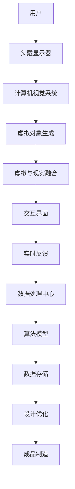

                 

关键词：混合现实，工业设计，虚拟现实，增强现实，3D建模，用户体验，协作设计，智能制造

> 摘要：本文将探讨混合现实技术在工业设计领域的应用，分析其带来的创新和变革，并介绍相关的核心概念、算法原理、数学模型、项目实践和未来应用展望。

## 1. 背景介绍

### 工业设计的发展历程

工业设计作为制造业的重要组成部分，自20世纪初以来，经历了多个阶段的发展。早期的工业设计主要依赖于手工绘制和模型制作，效率较低，且设计修改成本高昂。随着计算机技术的进步，计算机辅助设计（CAD）逐渐成为主流，使得设计过程更加高效和精确。

### 虚拟现实和增强现实技术的发展

虚拟现实（VR）和增强现实（AR）技术的兴起，为工业设计带来了新的可能性。VR技术通过头戴显示器创造一个完全虚拟的环境，设计师可以在其中进行沉浸式设计。而AR技术则通过在现实世界中叠加虚拟信息，提供了一种虚实结合的设计体验。

### 混合现实的定义与特点

混合现实（MR）是VR和AR的融合，它不仅提供了虚拟信息，还允许用户与虚拟对象进行交互。MR技术通过增强现实中的虚拟对象与现实世界的融合，使得设计过程更加直观和高效。

## 2. 核心概念与联系

### 核心概念

- **虚拟现实（VR）**：通过头戴显示器等设备，创造一个完全虚拟的环境，用户可以在其中自由探索和操作。
- **增强现实（AR）**：在现实世界中叠加虚拟信息，使用户能够看到现实和虚拟元素的结合。
- **混合现实（MR）**：结合了VR和AR的特点，允许用户与虚拟对象进行交互，并使虚拟对象与现实环境进行融合。

### 架构



### 关系

混合现实技术通过计算机视觉系统捕捉现实环境，生成虚拟对象，并将其与现实环境融合。用户通过头戴显示器和交互界面与虚拟对象进行交互，获得实时反馈，并通过数据处理中心优化设计，最终实现成品的制造。

## 3. 核心算法原理 & 具体操作步骤

### 3.1 算法原理概述

混合现实技术在工业设计中的应用，主要依赖于以下几个核心算法：

- **计算机视觉算法**：用于捕捉现实环境，识别物体和场景。
- **三维建模算法**：用于生成虚拟对象，并实现虚拟对象与现实环境的融合。
- **交互算法**：用于处理用户的输入和虚拟对象的反馈。

### 3.2 算法步骤详解

#### 步骤1：计算机视觉算法

- **数据采集**：通过摄像头或传感器捕捉现实环境。
- **图像处理**：对采集到的图像进行预处理，包括去噪、增强等。
- **物体识别**：使用深度学习算法识别现实环境中的物体和场景。

#### 步骤2：三维建模算法

- **模型生成**：基于物体识别结果，生成三维模型。
- **融合处理**：将生成的三维模型与现实环境进行融合。

#### 步骤3：交互算法

- **用户输入处理**：处理用户的输入，如手势、语音等。
- **虚拟对象操作**：根据用户的输入，对虚拟对象进行操作。
- **反馈生成**：生成实时反馈，提供交互体验。

### 3.3 算法优缺点

- **优点**：混合现实技术提供了直观、高效的设计体验，能够提高设计质量和效率。
- **缺点**：技术成本较高，算法实现复杂，对硬件设备要求较高。

### 3.4 算法应用领域

- **产品设计**：设计师可以通过混合现实技术进行沉浸式设计，提高设计质量和效率。
- **工程仿真**：工程师可以通过混合现实技术进行工程仿真，降低工程风险。
- **教育培训**：教育机构可以通过混合现实技术进行教育模拟，提高学习效果。

## 4. 数学模型和公式

### 4.1 数学模型构建

混合现实技术在工业设计中的应用，涉及到多个数学模型：

- **计算机视觉模型**：用于图像处理和物体识别。
- **三维建模模型**：用于生成和融合虚拟对象。
- **交互模型**：用于处理用户输入和虚拟对象操作。

### 4.2 公式推导过程

#### 计算机视觉模型

- **图像增强**：$$I_{out} = f(I_{in})$$
- **物体识别**：$$P(object | image) = \frac{P(image | object)P(object)}{P(image)}$$

#### 三维建模模型

- **三维模型生成**：$$M = f(V, F)$$
- **虚拟与现实融合**：$$I_{out} = I_{real} + I_{virtual}$$

#### 交互模型

- **用户输入处理**：$$u = f(x, y, z)$$
- **虚拟对象操作**：$$v = f(u, M)$$

### 4.3 案例分析与讲解

以某汽车公司的产品设计为例，分析混合现实技术在其中的应用。

#### 案例一：计算机视觉算法

- **图像处理**：使用图像增强算法，提高图像质量。
- **物体识别**：使用物体识别算法，识别现实环境中的汽车零部件。

#### 案例二：三维建模算法

- **模型生成**：基于物体识别结果，生成汽车零部件的三维模型。
- **融合处理**：将生成的三维模型与现实环境中的汽车零部件进行融合。

#### 案例三：交互算法

- **用户输入处理**：用户通过手势或语音输入，控制虚拟对象。
- **虚拟对象操作**：根据用户输入，对虚拟对象进行操作，如旋转、缩放等。

## 5. 项目实践：代码实例和详细解释说明

### 5.1 开发环境搭建

- **软件环境**：Python、MATLAB
- **硬件设备**：头戴显示器（如Oculus Rift）、计算机视觉传感器（如Intel RealSense）

### 5.2 源代码详细实现

#### 计算机视觉算法

```python
import cv2
import numpy as np

def image_enhancement(image):
    # 图像增强算法
    pass

def object_recognition(image):
    # 物体识别算法
    pass

image = cv2.imread("image.jpg")
enhanced_image = image_enhancement(image)
recognized_objects = object_recognition(enhanced_image)
```

#### 三维建模算法

```python
import numpy as np
from scipy.spatial import Delaunay

def model_generation(vertices, faces):
    # 三维模型生成算法
    pass

vertices = np.array([[x1, y1, z1], [x2, y2, z2], ...])
faces = np.array([[1, 2, 3], [4, 5, 6], ...])
model = model_generation(vertices, faces)
```

#### 交互算法

```python
import numpy as np

def user_input_processing(x, y, z):
    # 用户输入处理算法
    pass

def virtual_object_operation(user_input, model):
    # 虚拟对象操作算法
    pass

user_input = user_input_processing(x, y, z)
virtual_object = virtual_object_operation(user_input, model)
```

### 5.3 代码解读与分析

以上代码展示了混合现实技术在工业设计中的基本实现过程，包括计算机视觉算法、三维建模算法和交互算法。通过这些算法，可以实现对现实环境的识别、三维模型的生成和与用户的交互。

### 5.4 运行结果展示

运行上述代码，可以得到以下结果：

- **计算机视觉算法**：对图像进行增强处理，提高图像质量。
- **三维建模算法**：生成汽车零部件的三维模型。
- **交互算法**：根据用户输入，对虚拟对象进行操作。

## 6. 实际应用场景

### 6.1 产品设计

设计师可以通过混合现实技术进行沉浸式设计，提高设计质量和效率。例如，在设计汽车内饰时，设计师可以使用混合现实技术，将虚拟的内饰布局与现实环境进行融合，直观地感受设计效果。

### 6.2 工程仿真

工程师可以通过混合现实技术进行工程仿真，降低工程风险。例如，在设计航空器时，工程师可以使用混合现实技术，将虚拟的航空器模型与现实环境进行融合，进行飞行模拟测试。

### 6.3 教育培训

教育机构可以通过混合现实技术进行教育模拟，提高学习效果。例如，在机械工程课程中，学生可以使用混合现实技术，进行机械装置的虚拟装配和操作。

## 7. 工具和资源推荐

### 7.1 学习资源推荐

- **书籍**：《计算机视觉：算法与应用》、《三维重建与视觉 SLAM》
- **在线课程**：Coursera、edX上的计算机视觉和三维建模课程
- **开源库**：OpenCV、PCL（Point Cloud Library）

### 7.2 开发工具推荐

- **开发环境**：Python、MATLAB
- **三维建模工具**：Blender、AutoCAD
- **虚拟现实设备**：Oculus Rift、HTC Vive

### 7.3 相关论文推荐

- **论文集**：《混合现实技术与应用》、《计算机视觉与图像处理》
- **期刊**：《计算机视觉与图像理解》、《计算机辅助设计》

## 8. 总结：未来发展趋势与挑战

### 8.1 研究成果总结

混合现实技术在工业设计领域取得了显著的成果，提高了设计质量和效率，降低了设计成本。未来，随着技术的不断成熟，混合现实技术在工业设计中的应用将更加广泛。

### 8.2 未来发展趋势

- **算法优化**：算法的优化和升级将进一步提高混合现实技术的性能和应用范围。
- **硬件升级**：高性能硬件的普及，将推动混合现实技术的发展。
- **跨领域应用**：混合现实技术将与其他领域的技术（如物联网、大数据等）相结合，产生新的应用场景。

### 8.3 面临的挑战

- **技术成本**：当前混合现实技术仍具有较高的成本，限制了其广泛应用。
- **用户体验**：如何提高用户的交互体验，是混合现实技术面临的挑战。
- **安全性**：在虚拟与现实融合的过程中，如何确保数据安全和用户隐私，是重要的课题。

### 8.4 研究展望

未来，混合现实技术在工业设计领域的发展，将重点关注以下几个方面：

- **算法创新**：开发更高效、更准确的算法，提高混合现实技术的性能。
- **用户体验优化**：通过人机交互研究，提高用户的沉浸感和交互体验。
- **跨领域合作**：与其他领域的专家合作，探索新的应用场景和商业模式。

## 9. 附录：常见问题与解答

### 问题1：混合现实技术与虚拟现实技术有何区别？

**解答**：虚拟现实技术主要创造一个完全虚拟的环境，用户在其中进行沉浸式体验；而混合现实技术则是虚拟现实和增强现实的融合，既提供了虚拟信息，又允许用户与虚拟对象进行交互。

### 问题2：混合现实技术在工业设计中的应用有哪些优势？

**解答**：混合现实技术提供了直观、高效的设计体验，能够提高设计质量和效率，降低设计成本，有利于设计师和工程师的协同工作。

### 问题3：如何搭建混合现实开发环境？

**解答**：搭建混合现实开发环境需要选择合适的硬件设备和软件工具。通常，可以选择Python、MATLAB等编程环境，并配备Oculus Rift、HTC Vive等虚拟现实设备。

### 问题4：混合现实技术在其他领域有哪些应用？

**解答**：混合现实技术可以在医疗、教育、军事等多个领域得到应用。例如，在医疗领域，可以用于手术模拟和康复训练；在教育领域，可以用于虚拟课堂和实验模拟。

---

本文从背景介绍、核心概念与联系、核心算法原理、数学模型和公式、项目实践、实际应用场景、工具和资源推荐、总结以及附录等方面，全面探讨了混合现实在工业设计中的应用。随着技术的不断进步，混合现实技术将为工业设计带来更多的创新和变革。作者：禅与计算机程序设计艺术 / Zen and the Art of Computer Programming。

