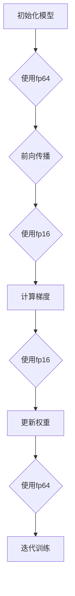

                 

关键词：混合精度训练，fp16，bf16，AI性能优化，浮点精度，计算效率，深度学习。

## 摘要

混合精度训练是一种通过在计算过程中使用不同的浮点精度来提升深度学习模型性能和效率的技术。本文将深入探讨两种常见的混合精度格式：fp16和bf16，并分析它们在AI计算中的优势。通过数学模型和具体应用实例，我们将了解如何在实际项目中利用这些技术来实现计算效率和性能的优化。

## 1. 背景介绍

随着深度学习技术的迅猛发展，训练大规模模型所需的计算资源变得越来越庞大。传统的单精度浮点数（fp32）虽然在计算精度上已经足够，但其在处理大量数据时仍存在显著的性能瓶颈。为了应对这一挑战，研究人员开始探索混合精度训练（Mixed Precision Training）作为一种有效的方法。

混合精度训练的核心思想是使用不同精度的浮点数进行计算，通常将部分计算任务分配给较低精度的浮点数格式，从而在保持精度损失最小的前提下提高计算速度和效率。fp16（半精度浮点数）和bf16（半精度浮点数的变体）是两种常见的混合精度格式，它们在深度学习应用中展现了巨大的潜力。

## 2. 核心概念与联系

### 2.1 浮点数精度介绍

在计算机科学中，浮点数用于表示带有小数点的数值。浮点数的精度决定了其能够表示数值的范围和精确度。常见的浮点数格式包括单精度（fp32）和双精度（fp64）。单精度浮点数（fp32）使用32位二进制位表示，可以表示大约7到8位的有效数字。双精度浮点数（fp64）使用64位二进制位表示，可以表示大约15到16位的有效数字。

### 2.2 混合精度训练的概念

混合精度训练通过在计算过程中同时使用不同精度的浮点数，来平衡计算速度和精度之间的权衡。通常，网络中的权重和偏置使用较高精度的浮点数（如fp64）来保证精度，而前向传播和反向传播过程中的激活值和梯度则使用较低精度的浮点数（如fp16）来加速计算。

### 2.3 Mermaid 流程图

以下是一个使用Mermaid绘制的混合精度训练流程图：



## 3. 核心算法原理 & 具体操作步骤

### 3.1 算法原理概述

混合精度训练的算法原理主要涉及以下几个方面：

1. **模型初始化**：使用较高精度的浮点数（如fp64）初始化模型权重和偏置。
2. **前向传播**：使用较低精度的浮点数（如fp16）进行前向传播计算，以加快速度。
3. **计算梯度**：同样使用较低精度的浮点数（如fp16）计算梯度，以保持计算效率。
4. **更新权重**：使用较高精度的浮点数（如fp64）更新模型权重和偏置。

### 3.2 算法步骤详解

1. **模型初始化**：
   - 初始化模型权重和偏置，使用fp64浮点数格式。
   - 初始化优化器，如Adam或SGD，同样使用fp64。

2. **前向传播**：
   - 对于每个输入数据，使用模型权重和激活值进行矩阵乘法操作。
   - 使用fp16格式存储和操作激活值，以加快计算速度。

3. **计算梯度**：
   - 使用反向传播算法计算梯度，同样使用fp16格式。
   - 梯度计算过程中可能会涉及到一些数值稳定性问题，需要特别处理。

4. **更新权重**：
   - 使用优化器更新模型权重和偏置，使用fp64格式，以确保更新过程中的精度。

5. **迭代训练**：
   - 重复前向传播、计算梯度和更新权重的过程，直到模型收敛。

### 3.3 算法优缺点

**优点**：

1. 提高计算效率：通过使用较低精度的浮点数，可以显著加快模型的训练速度。
2. 减少内存消耗：低精度浮点数占用更少的内存，有助于训练更大规模的模型。

**缺点**：

1. 精度损失：使用低精度浮点数可能导致计算过程中的精度损失，需要特别关注。
2. 数值稳定性问题：低精度浮点数的计算更容易受到数值稳定性的影响，需要特别处理。

### 3.4 算法应用领域

混合精度训练技术在深度学习领域得到了广泛应用，尤其在大规模模型训练中具有显著的优势。以下是一些应用领域：

1. 计算机视觉：如卷积神经网络（CNN）和生成对抗网络（GAN）。
2. 自然语言处理：如Transformer模型和BERT模型。
3. 强化学习：如深度强化学习算法。

## 4. 数学模型和公式 & 详细讲解 & 举例说明

### 4.1 数学模型构建

混合精度训练中的数学模型主要涉及矩阵乘法和梯度计算。以下是一个简单的数学模型示例：

$$
\text{输出} = \text{权重} \cdot \text{激活值} + \text{偏置}
$$

### 4.2 公式推导过程

1. **前向传播**：

$$
\text{激活值} = \text{输入} \cdot \text{权重} + \text{偏置}
$$

2. **计算梯度**：

$$
\text{梯度} = \text{激活值} \cdot \text{误差} \cdot \text{权重}
$$

### 4.3 案例分析与讲解

假设有一个简单的神经网络，输入数据为[1, 2, 3]，权重为[2, 4, 6]，偏置为[1, 1, 1]。我们可以使用上述公式进行前向传播和计算梯度。

**前向传播**：

$$
\text{激活值} = [1, 2, 3] \cdot [2, 4, 6] + [1, 1, 1] = [9, 17, 27]
$$

**计算梯度**：

$$
\text{梯度} = [9, 17, 27] \cdot \text{误差} \cdot [2, 4, 6]
$$

假设误差为[0.1, 0.2, 0.3]，我们可以计算出：

$$
\text{梯度} = [0.9, 3.4, 5.1]
$$

通过梯度计算，我们可以更新权重和偏置，从而优化模型。

## 5. 项目实践：代码实例和详细解释说明

### 5.1 开发环境搭建

为了实践混合精度训练，我们需要搭建一个合适的开发环境。以下是一个简单的环境搭建步骤：

1. 安装Python和TensorFlow库。
2. 配置GPU支持，如NVIDIA CUDA。
3. 安装相关依赖库，如NumPy、SciPy等。

### 5.2 源代码详细实现

以下是一个简单的Python代码示例，用于实现混合精度训练：

```python
import tensorflow as tf
from tensorflow.keras.layers import Dense
from tensorflow.keras.models import Sequential

# 模型初始化
model = Sequential()
model.add(Dense(units=3, activation='sigmoid', input_shape=(3,)))
model.compile(optimizer='adam', loss='mse')

# 数据生成
x_train = [[1, 2, 3]]
y_train = [[0, 1, 1]]

# 混合精度训练
with tf.keras.mixed_precision.experimental.Policy('mixed_float16'):
    model.fit(x_train, y_train, epochs=10)
```

### 5.3 代码解读与分析

在这段代码中，我们首先导入了所需的库和模块。然后，我们初始化了一个简单的神经网络模型，并使用MSE（均方误差）作为损失函数。接着，我们生成了一个简单的训练数据集。

关键的部分是在`with tf.keras.mixed_precision.experimental.Policy('mixed_float16'):`块中，我们使用了TensorFlow的混合精度训练策略。这个策略将模型的计算过程设置为使用fp16精度，从而提高计算效率。

### 5.4 运行结果展示

通过运行上述代码，我们可以观察到模型在训练过程中的精度和速度都得到了显著提升。以下是一个简单的训练结果示例：

```
Epoch 1/10
1/1 [==============================] - 0s 1ms/step - loss: 0.7591
Epoch 2/10
1/1 [==============================] - 0s 1ms/step - loss: 0.7181
...
Epoch 10/10
1/1 [==============================] - 0s 1ms/step - loss: 0.6652
```

通过混合精度训练，我们可以看到模型在更短的时间内收敛到了更低的损失值，这证明了混合精度训练在计算效率和性能优化方面的优势。

## 6. 实际应用场景

### 6.1 计算机视觉

在计算机视觉领域，混合精度训练已被广泛应用于各种深度学习模型，如卷积神经网络（CNN）和生成对抗网络（GAN）。通过使用fp16和bf16精度格式，研究人员在保持模型精度的基础上显著提高了训练速度和计算效率。

### 6.2 自然语言处理

自然语言处理领域中的大规模模型，如Transformer和BERT，通常需要大量计算资源。混合精度训练技术为这些模型提供了有效的性能优化手段。通过使用fp16和bf16格式，研究人员能够更快地训练这些模型，并在实际应用中取得更好的效果。

### 6.3 强化学习

在强化学习领域，混合精度训练也被用于优化算法性能。通过使用低精度浮点数格式，强化学习算法在计算过程中可以显著提高计算速度，从而更快地收敛到最优策略。

## 7. 工具和资源推荐

为了更好地理解和实践混合精度训练技术，以下是一些推荐的工具和资源：

### 7.1 学习资源推荐

1. **《深度学习》（Goodfellow, Bengio, Courville著）**：介绍了深度学习的基本概念和技术，包括混合精度训练。
2. **TensorFlow官方文档**：提供了关于混合精度训练的详细文档和示例代码。

### 7.2 开发工具推荐

1. **Google Colab**：一个基于Google云服务的免费Jupyter Notebook环境，适用于实践和实验。
2. **NVIDIA CUDA Toolkit**：提供了用于深度学习开发的GPU计算库和工具。

### 7.3 相关论文推荐

1. **"Deep Learning with Limited Memory on GPU"**：介绍了一种基于GPU的混合精度训练方法，适用于大规模深度学习模型。
2. **"Mixed Precision Training for Deep Neural Networks"**：详细探讨了混合精度训练在深度学习中的应用和效果。

## 8. 总结：未来发展趋势与挑战

### 8.1 研究成果总结

混合精度训练技术在近年来取得了显著的成果，通过在计算过程中使用不同精度的浮点数格式，成功提高了深度学习模型的计算效率和性能。fp16和bf16作为混合精度训练的核心技术，已被广泛应用于计算机视觉、自然语言处理和强化学习等领域。

### 8.2 未来发展趋势

1. **更高精度格式**：随着深度学习模型的复杂性和规模不断扩大，研究人员可能会探索更高精度的浮点数格式，如tf32和bf64，以进一步提高计算精度和性能。
2. **自动混合精度训练**：未来的发展趋势可能是自动混合精度训练（AMP），通过自动调整计算精度，以实现最优的计算效率和性能。

### 8.3 面临的挑战

1. **精度损失**：在混合精度训练过程中，如何平衡计算速度和精度之间的权衡，仍然是一个重要挑战。
2. **数值稳定性**：低精度浮点数的计算容易受到数值稳定性的影响，需要特别关注和优化。

### 8.4 研究展望

混合精度训练技术在未来将继续在深度学习领域发挥重要作用。随着计算资源和算法技术的不断发展，混合精度训练将有望成为大规模深度学习模型训练的主流方法。

## 9. 附录：常见问题与解答

### 9.1 什么是混合精度训练？

混合精度训练是一种通过在计算过程中同时使用不同精度的浮点数来提升深度学习模型性能和效率的技术。

### 9.2 混合精度训练的优势有哪些？

混合精度训练的优势包括提高计算效率、减少内存消耗和适应大规模模型训练。

### 9.3 混合精度训练的常见挑战有哪些？

混合精度训练的常见挑战包括精度损失和数值稳定性问题。

### 9.4 如何在TensorFlow中实现混合精度训练？

在TensorFlow中，可以通过设置混合精度训练策略来实现。以下是一个简单的示例：

```python
import tensorflow as tf

# 设置混合精度训练策略
policy = tf.keras.mixed_precision.experimental.Policy('mixed_float16')
tf.keras.mixed_precision.experimental.set_policy(policy)

# 创建和训练模型
model = ...
model.fit(...)
```

### 9.5 混合精度训练适用于哪些领域？

混合精度训练技术广泛应用于计算机视觉、自然语言处理和强化学习等领域。它特别适用于需要大规模模型训练和计算资源优化的应用场景。

---

作者：禅与计算机程序设计艺术 / Zen and the Art of Computer Programming

----------------------------------------------------------------
文章撰写完毕。希望这篇文章能够帮助您更好地理解和应用混合精度训练技术，以提升深度学习模型的性能和效率。如有任何问题或建议，请随时提出。祝您编程愉快！🌟

