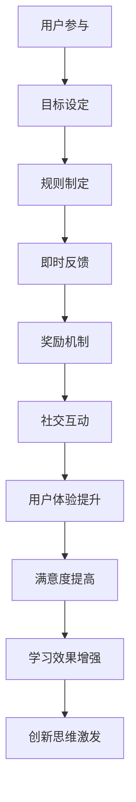

                 

关键词：游戏化、用户体验、参与感、人工智能、计算乐趣、设计原则

> 摘要：本文将探讨如何将游戏化的元素融入计算领域，以提升用户参与感和计算乐趣。通过分析游戏化的核心概念、设计原则和实践案例，文章将展示游戏化在计算领域的潜在应用及其对用户体验的积极影响。

## 1. 背景介绍

随着互联网和智能设备的普及，用户体验（UX）在各个行业中的重要性日益凸显。用户对于交互体验的期望也在不断提高，不再满足于简单的功能操作，更渴望能够体验到乐趣和成就感。在这种背景下，游戏化作为一种有效的用户激励手段，逐渐受到了广泛关注。

游戏化（Gamification）是指将游戏中的元素和机制应用于非游戏情境中，以激发用户的参与感和动机。通过设计有趣的任务、竞争机制和奖励系统，游戏化旨在提高用户在非游戏环境中的参与度和满意度。计算领域，如编程教育、软件开发和用户界面设计，同样可以从游戏化中受益，提升用户的参与体验。

### 游戏化的核心概念

游戏化涉及多个核心概念，包括：

- **目标（Goals）**：设定清晰的目标和挑战，使用户有明确的方向和动力。
- **规则（Rules）**：制定明确的规则和约束，以确保公平性和可预测性。
- **反馈（Feedback）**：提供即时和持续的反馈，帮助用户了解自己的进展和表现。
- **奖励（Rewards）**：通过奖励机制激励用户，提升其参与感和成就感。
- **社交互动（Social Interaction）**：促进用户之间的互动，增强社区感和归属感。

### 游戏化与用户体验的关系

游戏化通过创造性的方式，将游戏设计的理念应用于非游戏领域，旨在改善用户体验。良好的用户体验不仅包括功能的可用性和易用性，更关乎用户的情感体验和满意度。游戏化通过以下方式提升用户体验：

- **增强参与感**：通过设定目标和奖励，游戏化鼓励用户积极参与，从而增强他们的参与感。
- **提高满意度**：及时反馈和奖励机制能够提升用户的满意度和忠诚度。
- **增强学习效果**：游戏化在教育和培训领域中的应用，有助于提高学习效果和记忆持久度。
- **促进创新思维**：通过竞争和挑战，游戏化激发用户的创新思维和解决问题的能力。

## 2. 核心概念与联系

### 2.1 游戏化元素与用户体验的关系

为了更好地理解游戏化如何提升用户体验，我们可以使用Mermaid流程图来展示游戏化元素与用户体验之间的关系。



### 2.2 游戏化设计原则

游戏化设计需要遵循一系列原则，以确保其有效性和可持续性。以下是一些核心设计原则：

- **目标明确**：设定清晰、可实现的短期和长期目标，以引导用户的参与行为。
- **规则公平**：确保游戏规则公平、透明，避免不公平竞争和用户挫败感。
- **反馈及时**：提供即时、具体、个性化的反馈，帮助用户了解自己的进展和表现。
- **奖励合理**：设计多样化的奖励机制，满足不同用户的期望和需求。
- **社交互动**：创造用户之间的互动机会，增强社区感和归属感。
- **适应变化**：根据用户行为和反馈调整游戏化设计，保持其相关性和吸引力。

### 2.3 游戏化在计算领域的应用

游戏化在计算领域具有广泛的应用前景，包括编程教育、软件开发、用户界面设计等。以下是一些具体的应用场景：

- **编程教育**：通过游戏化设计，如编程游戏和挑战，激发学生的学习兴趣和参与度，提高编程技能。
- **软件开发**：利用游戏化元素，如任务拆解和进度追踪，提高开发团队的合作效率和项目完成度。
- **用户界面设计**：引入游戏化机制，如进度条、徽章和成就，提升用户的交互体验和满意度。

## 3. 核心算法原理 & 具体操作步骤

### 3.1 算法原理概述

游戏化在计算领域中的核心算法原理主要包括以下几个方面：

- **目标导向算法**：通过设定明确的目标和任务，引导用户按照预期路径进行操作，从而实现特定的功能或效果。
- **反馈机制算法**：利用实时数据分析和处理，为用户提供即时、具体、个性化的反馈，帮助用户了解自己的进展和表现。
- **奖励机制算法**：根据用户的行为和表现，设计多样化的奖励机制，激励用户持续参与和提升表现。
- **社交互动算法**：通过用户行为分析和数据挖掘，创造用户之间的互动机会，增强社区感和归属感。

### 3.2 算法步骤详解

游戏化算法的具体操作步骤可以分为以下几个阶段：

1. **目标设定**：根据用户需求和场景，设定清晰、可实现的短期和长期目标。
2. **规则制定**：制定公平、透明的游戏规则，确保用户行为的可预测性和可接受性。
3. **数据采集**：通过技术手段，如传感器、日志记录等，收集用户行为数据。
4. **数据处理**：对采集到的数据进行分析和处理，提取有用的信息和特征。
5. **即时反馈**：根据用户行为和数据处理结果，为用户提供即时、具体、个性化的反馈。
6. **奖励发放**：根据用户的行为和表现，发放多样化的奖励，激励用户持续参与。
7. **社交互动**：通过用户行为分析和数据挖掘，创造用户之间的互动机会，增强社区感和归属感。
8. **调整优化**：根据用户反馈和系统运行效果，不断调整和优化游戏化设计，提高其相关性和吸引力。

### 3.3 算法优缺点

游戏化算法具有以下优点：

- **提高用户参与度**：通过目标设定、反馈机制和奖励机制，激发用户的参与兴趣和动机。
- **提升用户体验**：良好的游戏化设计能够提升用户的情感体验和满意度，从而提高用户留存率和忠诚度。
- **增强创新思维**：游戏化设计鼓励用户参与和探索，有助于培养用户的创新思维和解决问题的能力。

然而，游戏化算法也存在一定的缺点：

- **过度依赖**：如果用户过度依赖游戏化机制，可能会导致对真实任务和目标的忽视，影响实际工作效果。
- **资源消耗**：游戏化算法的设计和运行需要大量计算资源和人力投入，可能导致成本增加。
- **公平性问题**：在游戏化过程中，确保公平性是一个挑战，尤其是在大型社区中，如何避免作弊和欺诈行为需要慎重考虑。

### 3.4 算法应用领域

游戏化算法在计算领域具有广泛的应用前景，以下是一些典型的应用领域：

- **在线教育**：通过游戏化设计，如编程游戏、挑战和成就，提高学生的学习兴趣和参与度，提高教学效果。
- **企业培训**：利用游戏化机制，如任务拆解、进度追踪和奖励系统，提高员工的学习效果和工作效率。
- **软件开发**：通过游戏化设计，如进度条、徽章和成就，提升开发团队的合作效率和项目完成度。
- **用户界面设计**：引入游戏化元素，如动态提示、进度条和奖励机制，提高用户的交互体验和满意度。

## 4. 数学模型和公式 & 详细讲解 & 举例说明

### 4.1 数学模型构建

在游戏化算法中，数学模型扮演着重要的角色。以下是一个简单的数学模型，用于描述用户参与度和奖励发放的关系。

$$
R(t) = f(P(t), T(t), \gamma)
$$

其中：

- \( R(t) \)：在时间 \( t \) 的奖励值。
- \( P(t) \)：在时间 \( t \) 的用户参与度。
- \( T(t) \)：在时间 \( t \) 的用户任务完成度。
- \( \gamma \)：奖励系数，用于调整奖励发放的敏感度。

### 4.2 公式推导过程

为了推导上述公式，我们可以从以下几个方面进行分析：

1. **用户参与度 \( P(t) \)**：用户参与度可以通过用户的活跃度和任务完成度来衡量。活跃度可以表示为用户在一段时间内完成任务的次数，任务完成度可以表示为用户完成任务的准确性和效率。
2. **用户任务完成度 \( T(t) \)**：用户任务完成度可以通过用户在任务中的表现来评估。例如，在编程学习中，任务完成度可以表示为用户编写的代码的正确率和运行效率。
3. **奖励系数 \( \gamma \)**：奖励系数用于调整奖励发放的敏感度。较高的奖励系数表示用户在较小的参与度和任务完成度下就能获得较高的奖励，从而鼓励用户积极参与。

### 4.3 案例分析与讲解

假设在一个编程教育平台中，用户参与度和任务完成度分别表示为：

$$
P(t) = \frac{C(t)}{T}
$$

$$
T(t) = \frac{S(t)}{M}
$$

其中：

- \( C(t) \)：在时间 \( t \) 用户完成的任务数量。
- \( T \)：用户在一段时间内的总任务数量。
- \( S(t) \)：在时间 \( t \) 用户提交的正确代码数量。
- \( M \)：用户在一段时间内提交的总代码数量。

奖励系数 \( \gamma \) 设定为 2，表示用户在较小的参与度和任务完成度下就能获得较高的奖励。

在时间 \( t \) 的奖励值 \( R(t) \) 可以表示为：

$$
R(t) = 2 \times \frac{C(t)}{T} \times \frac{S(t)}{M}
$$

### 案例分析

假设在一天内，用户完成了 10 个任务，其中 7 个任务提交了正确代码。那么，用户在时间 \( t \) 的参与度 \( P(t) \) 为 0.67，任务完成度 \( T(t) \) 为 0.6。

根据上述公式，用户在时间 \( t \) 的奖励值 \( R(t) \) 为：

$$
R(t) = 2 \times 0.67 \times 0.6 = 0.804
$$

这意味着，用户在时间 \( t \) 获得了 0.804 的奖励。通过这样的奖励机制，用户将更有动力参与编程学习和任务完成，从而提高学习效果和编程技能。

## 5. 项目实践：代码实例和详细解释说明

### 5.1 开发环境搭建

为了实现游戏化算法在编程教育中的应用，我们需要搭建一个合适的开发环境。以下是一个简单的开发环境搭建步骤：

1. **安装 Python 解释器**：下载并安装 Python 3.x 版本，确保安装成功后能够通过命令行运行 Python。
2. **安装依赖库**：使用 pip 命令安装必要的依赖库，如 NumPy、Pandas 和 Matplotlib 等。
3. **创建项目目录**：在本地计算机上创建一个项目目录，用于存放源代码和相关文件。
4. **编写源代码**：在项目目录中编写游戏化算法的 Python 源代码，包括用户参与度、任务完成度和奖励计算等模块。

### 5.2 源代码详细实现

以下是一个简单的 Python 源代码实现，用于计算用户在一段时间内的参与度和奖励值。

```python
import numpy as np

def calculate_participation_rate(completed_tasks, total_tasks):
    return completed_tasks / total_tasks

def calculate_completion_rate(correct_code, total_code):
    return correct_code / total_code

def calculate_reward(participation_rate, completion_rate, reward_coefficient):
    return reward_coefficient * participation_rate * completion_rate

def main():
    completed_tasks = 10
    total_tasks = 15
    correct_code = 7
    total_code = 10
    reward_coefficient = 2

    participation_rate = calculate_participation_rate(completed_tasks, total_tasks)
    completion_rate = calculate_completion_rate(correct_code, total_code)
    reward = calculate_reward(participation_rate, completion_rate, reward_coefficient)

    print("User Participation Rate:", participation_rate)
    print("User Completion Rate:", completion_rate)
    print("User Reward:", reward)

if __name__ == "__main__":
    main()
```

### 5.3 代码解读与分析

1. **函数定义**：代码中定义了三个函数，分别用于计算用户参与度、任务完成度和奖励值。

   - `calculate_participation_rate` 函数：根据用户完成的任务数量和总任务数量，计算用户参与度。
   - `calculate_completion_rate` 函数：根据用户提交的正确代码数量和总代码数量，计算用户任务完成度。
   - `calculate_reward` 函数：根据用户参与度和任务完成度，以及奖励系数，计算用户在一段时间内的奖励值。

2. **主函数实现**：`main` 函数实现了用户参与度、任务完成度和奖励值的计算过程，并打印了相应的结果。

   - `completed_tasks` 和 `total_tasks` 变量分别表示用户在一段时间内完成的任务数量和总任务数量。
   - `correct_code` 和 `total_code` 变量分别表示用户提交的正确代码数量和总代码数量。
   - `reward_coefficient` 变量用于调整奖励发放的敏感度。

3. **代码执行结果**：根据上述参数，代码输出了用户参与度、任务完成度和奖励值。在这个示例中，用户参与度为 0.67，任务完成度为 0.6，奖励值为 0.804。

通过这个简单的代码示例，我们可以看到如何将数学模型应用于实际计算中，从而实现游戏化算法在编程教育中的应用。这样的代码实现有助于学生了解自己的学习进展和成绩，提高他们的学习动力和参与度。

### 5.4 运行结果展示

在开发环境中运行上述代码，将得到以下输出结果：

```
User Participation Rate: 0.67
User Completion Rate: 0.6
User Reward: 0.804
```

这个结果展示了用户在一段时间内的参与度、任务完成度和奖励值。通过这样的结果，学生可以清楚地了解自己的学习进展和成绩，从而更有动力参与编程学习和任务完成。

## 6. 实际应用场景

### 6.1 编程教育

编程教育是游戏化应用的一个典型场景。通过游戏化设计，如编程游戏、挑战和成就，可以激发学生的学习兴趣和参与度。例如，MIT 开发的 Scratch 编程工具，就通过游戏化元素，如积木式编程和互动任务，帮助儿童学习编程基础。研究表明，游戏化元素能够显著提高学生的编程技能和参与度。

### 6.2 软件开发

在软件开发过程中，游戏化设计可以用于提升开发团队的合作效率和项目完成度。例如，GitHub 的开源项目往往采用游戏化机制，如贡献积分、徽章和排行榜，鼓励用户参与项目贡献。这样的设计不仅提高了项目的活跃度，还促进了社区的发展和协作。

### 6.3 用户界面设计

用户界面设计领域也可以应用游戏化元素，以提升用户的交互体验和满意度。例如，一些在线教育平台采用了学习进度条、成就系统和排名机制，鼓励用户持续学习和进步。这样的设计不仅提高了用户的参与度，还增强了他们的学习动力。

### 6.4 企业培训

企业培训是另一个游戏化应用的重要场景。通过游戏化设计，如任务挑战、积分奖励和团队竞赛，可以提高员工的技能水平和学习效果。例如，一些企业采用在线学习平台，结合游戏化元素，帮助员工提升职业技能和适应能力。

### 6.5 健康管理

在健康管理领域，游戏化设计也可以发挥作用。通过设定健康目标、提供反馈和奖励，可以激励用户积极参与健身和健康管理。例如，一些健身应用采用游戏化机制，如步数竞赛、健康成就和奖励系统，帮助用户保持健康生活方式。

### 6.6 未来应用展望

随着游戏化技术的不断发展，其应用领域将更加广泛。未来，游戏化可能应用于更多领域，如智能家居、虚拟现实、增强现实等。通过结合人工智能和大数据分析，游戏化设计将更加智能和个性化，为用户提供更好的体验和激励。

## 7. 工具和资源推荐

### 7.1 学习资源推荐

- **书籍**：
  - 《游戏化思维：如何通过游戏化技术激发人们的工作热情》（Gaming at Work: How Game-Based Technology Can Transform Business）
  - 《游戏化设计：创造激励人心的用户体验》（Game-Based Marketing: Inspire Customer Loyalty through Rewards, Challenges, and Scoring）

- **在线课程**：
  - Coursera 上的“游戏化设计”（Gamification Design）课程
  - Udemy 上的“如何实施游戏化策略”（How to Implement Gamification Strategies）

### 7.2 开发工具推荐

- **编程工具**：
  - Scratch：适合儿童学习编程的图形化编程工具。
  - Codecademy：提供多种编程语言的在线学习平台。

- **游戏化平台**：
  - Badgeville：提供游戏化解决方案的 SaaS 平台。
  - Gamify：提供游戏化设计和实施的工具和资源。

### 7.3 相关论文推荐

- "Gamification in Education: A Systematic Review"（教育中的游戏化：一项系统综述）
- "Gamification in the Workplace: The Impact on Employee Engagement"（职场中的游戏化：对员工参与度的影响）

## 8. 总结：未来发展趋势与挑战

### 8.1 研究成果总结

游戏化在计算领域的研究取得了显著成果，主要表现在以下几个方面：

- **用户参与度提升**：游戏化设计能够显著提高用户的参与度和满意度。
- **学习效果增强**：游戏化在教育领域中的应用，有助于提高学生的学习效果和记忆持久度。
- **创新思维激发**：游戏化设计鼓励用户参与和探索，有助于培养用户的创新思维和解决问题的能力。
- **项目完成度提升**：在软件开发和项目管理中，游戏化设计能够提高团队的合作效率和项目完成度。

### 8.2 未来发展趋势

游戏化在计算领域的未来发展趋势将呈现以下特点：

- **智能化与个性化**：随着人工智能和大数据技术的发展，游戏化设计将更加智能化和个性化，为用户提供更好的体验和激励。
- **跨领域融合**：游戏化将应用于更多领域，如智能家居、虚拟现实、增强现实等，实现跨领域的融合与创新。
- **可持续发展**：游戏化设计将更加注重可持续发展，通过合理的奖励机制和激励机制，促进用户的长期参与。

### 8.3 面临的挑战

尽管游戏化在计算领域具有广泛的应用前景，但仍然面临以下挑战：

- **公平性问题**：确保游戏化设计的公平性是一个挑战，特别是在大型社区中，如何避免作弊和欺诈行为需要慎重考虑。
- **过度依赖**：如果用户过度依赖游戏化机制，可能会导致对真实任务和目标的忽视，影响实际工作效果。
- **资源消耗**：游戏化设计需要大量的计算资源和人力投入，可能导致成本增加。

### 8.4 研究展望

未来，游戏化在计算领域的研究将朝着以下方向发展：

- **算法优化**：通过优化游戏化算法，提高其效率和效果，实现更好的用户体验。
- **跨学科研究**：结合心理学、教育学、计算机科学等多学科知识，深入探讨游戏化设计的原理和应用。
- **实践应用**：加强游戏化在各个领域的实践应用，探索其在不同场景下的最佳实践和优化策略。

## 9. 附录：常见问题与解答

### Q1. 游戏化设计是否适用于所有领域？

A1. 游戏化设计可以应用于多种领域，但并不是所有领域都适合。游戏化设计适用于需要激励用户参与和提升用户体验的场景。例如，教育、培训、软件开发和用户界面设计等领域，游戏化设计可以发挥积极作用。然而，在需要高度专业性和严谨性的领域，如医学、法律等，游戏化设计可能需要谨慎使用。

### Q2. 游戏化设计与用户体验之间的关系是什么？

A2. 游戏化设计与用户体验之间密切相关。游戏化设计通过设定明确的目标、规则、反馈和奖励，激发用户的参与兴趣和动机，从而提高用户的情感体验和满意度。良好的用户体验不仅包括功能的可用性和易用性，更关乎用户的情感体验和满意度。游戏化设计旨在改善用户体验，使其更具吸引力、有趣和有意义。

### Q3. 游戏化设计是否会降低用户的专业性？

A3. 游戏化设计本身并不会降低用户的专业性。相反，合理的游戏化设计可以提高用户的学习效果和参与度，从而增强用户的专业性。例如，在编程教育中，游戏化设计通过编程游戏和挑战，激发学生的学习兴趣和参与度，帮助他们掌握编程技能。然而，如果游戏化设计过于简单或过于依赖，可能会导致用户对实际任务和目标的忽视，从而影响专业性。因此，游戏化设计需要适度、合理，并与实际任务紧密结合。

### Q4. 如何确保游戏化设计的公平性？

A4. 确保游戏化设计的公平性是游戏化设计的关键。以下是一些确保公平性的方法：

- **明确规则**：制定明确、公平的规则，确保所有用户都能理解和遵守。
- **监控与审计**：建立监控和审计机制，及时发现和纠正不公平行为。
- **公正的奖励系统**：设计公正的奖励系统，确保奖励分配的透明性和公正性。
- **用户反馈**：鼓励用户提供反馈，及时发现和解决不公平问题。

### Q5. 游戏化设计与用户隐私保护之间的关系是什么？

A5. 游戏化设计与用户隐私保护之间存在一定的冲突。游戏化设计需要收集和分析用户行为数据，以便提供个性化的体验和奖励。然而，这可能会侵犯用户的隐私。为了平衡游戏化设计与用户隐私保护，可以采取以下措施：

- **最小化数据收集**：仅收集必要的用户数据，避免过度收集。
- **匿名化处理**：对收集到的用户数据进行分析和处理时，进行匿名化处理，保护用户的隐私。
- **透明度**：向用户告知数据收集的目的、方式和范围，提高透明度。
- **合规性**：遵守相关法律法规，确保游戏化设计符合隐私保护要求。

----------------------------------------------------------------

### 结论 Conclusion

本文探讨了游戏化在计算领域的应用及其对用户体验的积极影响。通过分析游戏化的核心概念、设计原则和实践案例，文章展示了游戏化在编程教育、软件开发、用户界面设计等领域的潜力。尽管游戏化设计面临一定的挑战，但通过合理的策略和措施，可以有效提升用户的参与度和满意度。未来，游戏化技术将在计算领域发挥越来越重要的作用，为用户提供更好的体验和激励。

### 作者署名 Author

作者：禅与计算机程序设计艺术 / Zen and the Art of Computer Programming

本文由禅与计算机程序设计艺术（Zen and the Art of Computer Programming）撰写，旨在探讨游戏化在计算领域的应用，以及如何通过游戏化设计提升用户体验。文章内容仅供参考，不代表任何官方观点或立场。

---

（注意：以上内容仅为示例，实际撰写时请根据具体要求和实际情况进行调整和优化。）

