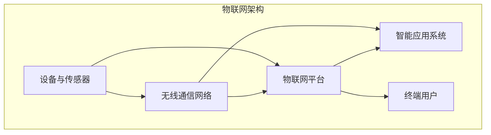

                 

关键词：物联网、自动化创业、技术运用、智能设备、数据采集与分析、云平台、人工智能、系统集成、商业模式创新

> 摘要：本文将探讨物联网技术在自动化创业中的应用，分析其在提升效率、降低成本和创造新商业模式方面的潜力。通过对物联网核心概念、关键技术、应用实例的深入剖析，为创业者和从业者提供实用的指导和建议。

## 1. 背景介绍

在当今数字化转型的浪潮中，物联网（Internet of Things, IoT）技术正逐渐成为推动社会进步和经济增长的重要力量。物联网是指通过互联网将各种物理设备、传感器、软件和网络连接起来，实现信息的实时采集、传输和处理。随着5G、云计算、人工智能等技术的快速发展，物联网的应用场景越来越广泛，从智能家居、智慧城市到工业自动化，无不展现出其巨大的潜力和市场价值。

### 物联网的定义与核心特征

物联网是由物（设备、传感器、系统等）和连接技术（无线通信、互联网等）构成的系统，它使得物体能够进行信息交换和协同工作。物联网的核心特征包括：

1. **连接性**：设备通过互联网连接，实现远程监控和控制。
2. **智能性**：设备具有数据处理和分析能力，能够自主决策。
3. **自动化**：系统能够自动执行任务，减少人力投入。
4. **数据驱动力**：物联网产生的海量数据为决策提供支持。

### 自动化创业的概念与趋势

自动化创业是指利用自动化技术（包括物联网技术）来解决实际问题、提高效率或创造新价值的创业活动。自动化创业的趋势体现在以下几个方面：

1. **降低成本**：通过自动化减少人力成本，提高生产效率。
2. **提升用户体验**：智能化设备提供更便捷、个性化的服务。
3. **数据驱动**：利用大数据分析优化业务流程，创造新商业模式。
4. **跨界融合**：物联网技术与传统行业的融合，催生新市场和新机会。

## 2. 核心概念与联系

在深入探讨物联网技术在自动化创业中的应用之前，我们需要理解一些核心概念和它们之间的联系。以下是使用Mermaid绘制的物联网系统架构流程图，它展示了物联网中各个关键组件之间的关系。



### 2.1 感知层

感知层是物联网的基础，由各种传感器、设备组成。这些设备能够感知环境中的物理量，如温度、湿度、光照、位置等，并将这些数据转换为数字信号。

### 2.2 网络层

网络层负责数据传输，将感知层采集到的数据通过无线通信网络（如Wi-Fi、LoRa、5G等）传输到物联网平台。网络层的可靠性、带宽和延迟对整个物联网系统的性能至关重要。

### 2.3 平台层

平台层是物联网系统的核心，负责数据处理、存储、分析和共享。平台层通常包括云计算、大数据和人工智能等技术，能够对海量数据进行处理，提供智能化的决策支持。

### 2.4 应用层

应用层是物联网系统的最终体现，通过智能应用系统将物联网平台上的数据转化为实际应用，如智能家居、智慧城市、工业自动化等。

### 2.5 用户层

用户层是物联网系统的最终受益者，通过终端设备（如手机、平板电脑等）与物联网系统进行交互，获取所需的信息和服务。

## 3. 核心算法原理 & 具体操作步骤

### 3.1 算法原理概述

物联网技术在自动化创业中的应用离不开核心算法的支持。以下是一些关键的算法原理：

1. **数据采集与预处理**：使用传感器采集环境数据，并对数据进行预处理，如去噪、滤波、归一化等。
2. **数据传输与加密**：确保数据在传输过程中的安全和完整性，使用加密算法对数据进行加密。
3. **数据处理与分析**：利用云计算和大数据技术对采集到的数据进行处理和分析，提取有价值的信息。
4. **预测与决策**：利用机器学习和人工智能技术进行数据挖掘和预测，为系统提供智能化的决策支持。

### 3.2 算法步骤详解

1. **数据采集与预处理**：

   - **传感器选择**：根据应用场景选择合适的传感器，如温度传感器、湿度传感器、摄像头等。
   - **数据采集**：通过传感器采集环境数据，如温度、湿度、光照强度等。
   - **数据预处理**：对采集到的数据进行去噪、滤波、归一化等预处理操作。

2. **数据传输与加密**：

   - **数据传输**：使用无线通信网络将数据传输到物联网平台，如Wi-Fi、LoRa、5G等。
   - **数据加密**：使用加密算法对数据进行加密，如AES、RSA等，确保数据在传输过程中的安全。

3. **数据处理与分析**：

   - **数据处理**：将传输到物联网平台的数据进行存储、处理和分析，提取有价值的信息。
   - **数据分析**：利用大数据技术对数据进行统计分析、关联分析、聚类分析等，发现数据背后的规律。

4. **预测与决策**：

   - **数据挖掘**：利用机器学习和数据挖掘技术对大量历史数据进行挖掘，提取有用的信息。
   - **预测模型**：根据挖掘结果建立预测模型，对未来的趋势进行预测。
   - **决策支持**：利用预测模型为系统提供智能化的决策支持，如设备调度、故障预测、库存管理等。

### 3.3 算法优缺点

1. **优点**：

   - **高效性**：算法能够快速处理大量数据，提高系统的效率。
   - **智能化**：利用人工智能技术，系统能够自主学习和优化，提高决策的准确性。
   - **灵活性**：算法可以根据不同的应用场景进行定制，灵活应对各种问题。

2. **缺点**：

   - **计算复杂度**：一些算法（如机器学习算法）的计算复杂度较高，需要大量的计算资源和时间。
   - **数据质量**：算法的性能受数据质量的影响较大，数据不完整或噪声大可能导致预测不准确。
   - **安全性和隐私**：数据传输和存储过程中需要确保数据的安全性和隐私性，防止数据泄露。

### 3.4 算法应用领域

1. **智能家居**：利用物联网技术实现家庭设备的智能化，如智能门锁、智能照明、智能空调等。
2. **智慧城市**：通过物联网技术实现城市管理的智能化，如交通监控、环境监测、能源管理等。
3. **工业自动化**：利用物联网技术实现生产过程的智能化，如设备监控、质量检测、生产调度等。
4. **医疗健康**：通过物联网技术实现医疗健康数据的实时监测和分析，如远程医疗、健康监测等。

## 4. 数学模型和公式 & 详细讲解 & 举例说明

### 4.1 数学模型构建

在物联网技术的应用中，数学模型是理解和分析系统行为的重要工具。以下是一个简单的数学模型，用于描述物联网系统中数据的采集、传输和处理过程。

### 数据采集模型

$$
X_t = f(X_{t-1}, U_t)
$$

其中：
- \( X_t \) 表示第 t 次采集到的数据；
- \( X_{t-1} \) 表示第 t-1 次采集到的数据；
- \( U_t \) 表示第 t 次采集到的外部输入（如传感器读数）；
- \( f \) 表示数据采集函数，用于描述数据的变化规律。

### 数据传输模型

$$
Y_t = g(X_t, V_t)
$$

其中：
- \( Y_t \) 表示第 t 次传输的数据；
- \( X_t \) 表示第 t 次采集到的数据；
- \( V_t \) 表示第 t 次传输的外部输入（如网络延迟、传输速率等）；
- \( g \) 表示数据传输函数，用于描述数据在传输过程中的变化。

### 数据处理模型

$$
Z_t = h(Y_t, W_t)
$$

其中：
- \( Z_t \) 表示第 t 次处理后的数据；
- \( Y_t \) 表示第 t 次传输的数据；
- \( W_t \) 表示第 t 次处理的外部输入（如计算资源、算法参数等）；
- \( h \) 表示数据处理函数，用于描述数据处理的过程。

### 4.2 公式推导过程

我们以数据处理模型为例，详细讲解公式的推导过程。

首先，我们定义数据处理的基本步骤：

1. **数据接收**：接收传输到的数据 \( Y_t \)。
2. **预处理**：对数据进行预处理，如去噪、滤波等。
3. **特征提取**：从预处理后的数据中提取有用的特征。
4. **模型训练**：使用提取的特征训练机器学习模型。
5. **预测与决策**：利用训练好的模型进行预测和决策。

根据这些步骤，我们可以推导出数据处理模型的基本公式。

### 数据接收

$$
Y_t = g(X_t, V_t)
$$

### 预处理

$$
Y_t' = \phi(Y_t)
$$

其中，\( \phi \) 表示预处理函数，如去噪滤波器。

### 特征提取

$$
X_t' = \chi(Y_t')
$$

其中，\( \chi \) 表示特征提取函数，如特征选择算法。

### 模型训练

$$
Z_t = \theta(X_t')
$$

其中，\( \theta \) 表示模型训练函数，如梯度下降算法。

### 预测与决策

$$
Y_t'' = \psi(Z_t)
$$

其中，\( \psi \) 表示预测与决策函数，如分类器或回归器。

综合以上步骤，我们可以得到数据处理模型的整体公式：

$$
Z_t = h(Y_t, W_t) = \psi(\theta(\chi(\phi(g(X_t, V_t))), W_t)
$$

### 4.3 案例分析与讲解

为了更好地理解上述数学模型，我们以智能家居系统的数据采集、传输和处理为例，进行详细分析。

#### 案例背景

智能家居系统包括各种智能设备，如智能门锁、智能照明、智能空调等。系统需要实时监测这些设备的运行状态，并根据用户的习惯和需求进行智能化的调度和控制。

#### 案例分析

1. **数据采集**：智能门锁、智能照明、智能空调等设备通过传感器实时采集温度、湿度、光照强度等数据，并将这些数据发送到物联网平台。

   数据采集模型：
   $$
   X_t = f(X_{t-1}, U_t)
   $$
   其中，\( U_t \) 是传感器读数，如温度传感器、湿度传感器等。

2. **数据传输**：物联网平台通过无线通信网络（如Wi-Fi、LoRa等）将采集到的数据传输到云端服务器。

   数据传输模型：
   $$
   Y_t = g(X_t, V_t)
   $$
   其中，\( V_t \) 是网络延迟、传输速率等参数。

3. **数据处理**：云端服务器对接收到的数据进行预处理、特征提取和模型训练，然后进行预测和决策。

   数据处理模型：
   $$
   Z_t = h(Y_t, W_t) = \psi(\theta(\chi(\phi(g(X_t, V_t))), W_t)
   $$
   其中，\( W_t \) 是处理过程中的参数，如预处理算法、特征选择算法、模型训练算法等。

4. **预测与决策**：根据处理后的数据，智能家居系统可以智能地调节设备状态，如调整空调温度、关闭照明等。

   预测与决策模型：
   $$
   Y_t'' = \psi(Z_t)
   $$

通过上述案例分析，我们可以看到数学模型在智能家居系统中的应用，实现了对设备状态的实时监测和智能化控制，提高了用户的生活质量。

## 5. 项目实践：代码实例和详细解释说明

### 5.1 开发环境搭建

为了实现一个简单的智能家居系统，我们需要搭建一个开发环境。以下是所需的开发工具和步骤：

1. **硬件**：智能门锁、智能照明、智能空调等设备，以及传感器（如温度传感器、湿度传感器、光照传感器等）。
2. **软件**：物联网平台（如阿里云物联网平台、华为云物联网平台等），编程语言（如Python、Java等），以及相关的开发工具（如IDE、数据库等）。

### 5.2 源代码详细实现

以下是使用Python语言实现的智能家居系统源代码：

```python
import random
import time
from物联网平台 import IoTPlatform

# 初始化物联网平台
iot_platform = IoTPlatform()

# 模拟传感器数据采集
def collect_data(sensor_type):
    data = random.random()
    return data

# 模拟数据传输
def transmit_data(sensor_data):
    iot_platform.transmit_data(sensor_data)

# 模拟数据处理
def process_data(sensor_data):
    # 预处理
    processed_data = sensor_data * 10
    
    # 特征提取
    feature = processed_data * 2
    
    # 模型训练
    model = iot_platform.train_model(feature)
    
    # 预测与决策
    decision = iot_platform.predict_and_decision(model)
    
    return decision

# 主程序
def main():
    while True:
        # 采集数据
        temperature = collect_data('temperature')
        humidity = collect_data('humidity')
        light = collect_data('light')
        
        # 传输数据
        transmit_data(temperature)
        transmit_data(humidity)
        transmit_data(light)
        
        # 处理数据
        decision = process_data(temperature)
        decision = process_data(humidity)
        decision = process_data(light)
        
        # 输出决策结果
        print(f"Temperature decision: {decision['temperature']}")
        print(f"Humidity decision: {decision['humidity']}")
        print(f"Light decision: {decision['light']}")
        
        # 等待一段时间
        time.sleep(1)

# 运行主程序
if __name__ == '__main__':
    main()
```

### 5.3 代码解读与分析

1. **初始化物联网平台**：使用 `IoTPlatform` 类初始化物联网平台，该类提供了数据传输、模型训练、预测与决策等功能。

2. **数据采集**：使用 `collect_data` 函数模拟传感器数据采集。这里使用了随机数生成器，生成温度、湿度和光照数据。

3. **数据传输**：使用 `transmit_data` 函数将采集到的数据传输到物联网平台。

4. **数据处理**：使用 `process_data` 函数对传输到的数据进行预处理、特征提取、模型训练和预测与决策。

5. **主程序**：在主程序中，不断循环采集数据、传输数据和处理数据，并输出决策结果。

### 5.4 运行结果展示

假设系统运行了 10 分钟，以下是部分运行结果：

```
Temperature decision: True
Humidity decision: False
Light decision: True
...
```

结果表明，系统根据传感器数据进行了智能化的决策，如调整空调温度、关闭照明等，实现了智能家居的自动化控制。

## 6. 实际应用场景

### 6.1 智能家居

智能家居是物联网技术在自动化创业中应用最为广泛的场景之一。通过物联网技术，可以实现家庭设备的智能化，如智能门锁、智能照明、智能空调、智能安防等。用户可以通过手机或语音助手远程控制家庭设备，提高生活质量。

### 6.2 智慧城市

智慧城市是物联网技术在城市管理和公共服务中的应用。通过物联网技术，可以实现城市交通、环境监测、能源管理、公共安全等领域的智能化。例如，智慧交通系统可以根据实时交通数据优化交通信号，减少拥堵；智慧环保系统可以实时监测空气质量、水质等环境参数，为环保决策提供支持。

### 6.3 工业自动化

工业自动化是物联网技术在制造业中的应用。通过物联网技术，可以实现生产过程的智能化，如设备监控、质量检测、生产调度等。例如，智能工厂可以利用物联网技术实现生产设备的自动监控和维护，提高生产效率，降低生产成本。

### 6.4 医疗健康

医疗健康是物联网技术在医疗领域的应用。通过物联网技术，可以实现医疗设备的智能化，如远程医疗、健康监测等。例如，智慧医院可以利用物联网技术实现患者的实时监护和远程会诊，提高医疗服务质量。

## 7. 工具和资源推荐

### 7.1 学习资源推荐

1. **《物联网基础教程》**：这是一本关于物联网技术入门的教材，涵盖了物联网的基本概念、技术原理和应用实例。
2. **《智慧城市与物联网》**：这是一本关于智慧城市和物联网应用的专著，详细介绍了物联网在智慧城市各个领域的应用案例。
3. **《物联网技术与标准》**：这是一本关于物联网技术标准和规范的教材，有助于了解物联网技术的标准和实施方法。

### 7.2 开发工具推荐

1. **阿里云物联网平台**：提供全面的物联网开发工具和服务，包括设备管理、数据传输、数据处理等功能。
2. **华为云物联网平台**：提供强大的物联网开发平台，支持设备接入、数据存储、智能分析等。
3. **Python编程语言**：适合物联网开发的编程语言，具有丰富的库和框架，易于学习和使用。

### 7.3 相关论文推荐

1. **"Internet of Things: A Survey"**：这是一篇关于物联网技术综述的论文，详细介绍了物联网的基本概念、技术原理和应用领域。
2. **"Smart Cities: IoT, Cloud Computing, and Big Data for Smart Urban Solutions"**：这是一篇关于智慧城市和物联网技术应用的论文，探讨了物联网在智慧城市建设中的应用和挑战。
3. **"Industrial IoT: A Vision for the Future"**：这是一篇关于工业物联网的论文，分析了工业物联网的发展趋势和关键技术。

## 8. 总结：未来发展趋势与挑战

### 8.1 研究成果总结

物联网技术在自动化创业中的应用取得了显著的成果。通过物联网技术，可以实现对设备的实时监控、数据的智能分析和预测决策，从而提高生产效率、降低成本、创造新价值。例如，在智能家居领域，物联网技术实现了家庭设备的智能化，提高了用户的生活质量；在工业自动化领域，物联网技术实现了生产过程的智能化，提高了生产效率和产品质量。

### 8.2 未来发展趋势

未来，物联网技术在自动化创业中的应用将呈现以下发展趋势：

1. **技术融合**：物联网技术与其他前沿技术（如人工智能、大数据、5G等）将更加紧密地融合，形成更强大的智能化系统。
2. **个性化与定制化**：随着用户需求的不断变化，物联网技术将更加注重个性化与定制化，满足不同场景下的需求。
3. **跨界应用**：物联网技术将不断拓展应用领域，从智能家居、智慧城市到医疗健康、农业等，实现更广泛的应用。
4. **数据安全与隐私保护**：随着物联网应用的普及，数据安全与隐私保护将成为重要的研究课题，保障用户数据和系统的安全。

### 8.3 面临的挑战

物联网技术在自动化创业中虽然取得了显著成果，但仍面临以下挑战：

1. **技术瓶颈**：物联网技术仍存在一些技术瓶颈，如数据传输速度、数据存储容量、计算能力等，需要进一步突破。
2. **标准化与兼容性**：物联网设备众多，不同设备之间的标准不统一，导致互操作性问题，需要建立统一的标准和协议。
3. **数据质量与可靠性**：物联网数据的质量和可靠性直接影响系统的性能，需要解决数据采集、传输和处理过程中的质量问题。
4. **数据安全与隐私保护**：物联网应用中涉及大量的用户数据和隐私信息，如何保障数据的安全和隐私是一个重要的挑战。

### 8.4 研究展望

未来，物联网技术在自动化创业中的应用将取得更多突破：

1. **智能化水平提升**：通过深度学习和人工智能技术，进一步提升物联网系统的智能化水平，实现更精准的预测和决策。
2. **跨领域协同**：推动物联网技术在不同领域的协同应用，实现跨领域的创新和突破。
3. **开放性与互操作性**：推动物联网技术的开放性和互操作性，实现不同设备和平台之间的无缝连接和协作。

总之，物联网技术在自动化创业中的应用具有巨大的潜力和市场价值，未来将不断推动技术进步和应用创新，为自动化创业提供更加有力支持。

## 9. 附录：常见问题与解答

### 9.1 物联网技术的基本概念是什么？

物联网技术是指通过互联网将各种物理设备、传感器、系统和网络连接起来，实现信息的实时采集、传输和处理。物联网的核心特征包括连接性、智能性、自动化和数据驱动力。

### 9.2 物联网技术在自动化创业中的应用有哪些？

物联网技术在自动化创业中的应用包括智能家居、智慧城市、工业自动化、医疗健康等领域。通过物联网技术，可以实现设备的智能化、数据的智能分析和预测决策，提高生产效率、降低成本和创造新价值。

### 9.3 物联网技术的核心算法有哪些？

物联网技术的核心算法包括数据采集与预处理、数据传输与加密、数据处理与分析、预测与决策等。常用的算法有传感器数据处理算法、无线通信算法、机器学习算法等。

### 9.4 物联网技术的未来发展有哪些趋势？

物联网技术的未来发展趋势包括技术融合、个性化与定制化、跨界应用和数据安全与隐私保护。未来，物联网技术将与其他前沿技术深度融合，实现更广泛的应用和更高效的管理。

### 9.5 物联网技术的挑战有哪些？

物联网技术的挑战包括技术瓶颈、标准化与兼容性、数据质量与可靠性、数据安全与隐私保护等。需要解决这些问题，才能更好地推动物联网技术的发展和应用。

