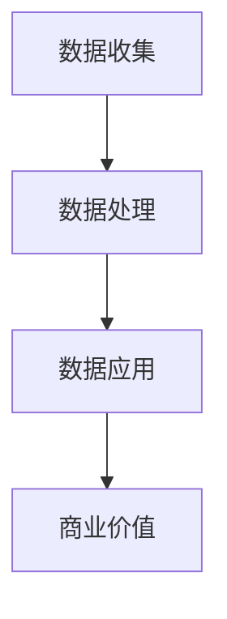

                 

关键词：物联网，注意力经济，价值挖掘，设备经济，大数据分析

> 摘要：本文探讨了物联网设备在注意力经济中的价值挖掘方法，分析了物联网设备的特性和挑战，并提出了相应的解决方案。文章通过具体实例，展示了如何通过大数据分析实现物联网设备的注意力经济价值。

## 1. 背景介绍

随着物联网技术的迅猛发展，越来越多的设备连接到互联网，形成了庞大的物联网生态系统。物联网设备涵盖了各种类型，包括智能家居设备、工业设备、医疗设备、交通设备等。这些设备通过传感器和数据传输技术，实现了数据的实时采集、传输和分析。

在物联网时代，数据成为了新的资源，而物联网设备则成为了数据的采集者和传输者。然而，如何有效地挖掘物联网设备的数据价值，实现注意力经济，成为了当前的一个重要课题。

### 注意力经济

注意力经济是一种基于用户注意力的商业模式。在这个商业模式中，用户的时间、关注和注意力被视为一种宝贵的资源，各种产品和服务通过吸引用户的注意力来实现商业价值。

物联网设备作为数据采集者，其产生的海量数据具有巨大的商业价值。然而，如何有效地利用这些数据，实现注意力经济，成为了当前的一个挑战。

## 2. 核心概念与联系

### 物联网设备特性

物联网设备的特性主要体现在以下几个方面：

1. **大规模连接**：物联网设备数量庞大，连接到互联网，形成了一个庞大的网络。
2. **实时性**：物联网设备能够实时采集和传输数据。
3. **多样性**：物联网设备涵盖了各种类型，具有不同的功能和应用场景。
4. **复杂性**：物联网设备的数据复杂，需要进行有效的处理和分析。

### 注意力经济价值挖掘

注意力经济价值挖掘的核心在于如何利用物联网设备产生的数据，实现商业价值的最大化。

1. **数据收集**：通过物联网设备实时采集用户行为数据。
2. **数据处理**：对采集到的数据进行分析和处理，提取有价值的信息。
3. **数据应用**：将处理后的数据应用到商业决策、产品优化、用户服务等各个方面。

### Mermaid 流程图

下面是一个简单的 Mermaid 流程图，展示了物联网设备的注意力经济价值挖掘的过程。



## 3. 核心算法原理 & 具体操作步骤

### 3.1 算法原理概述

物联网设备的注意力经济价值挖掘主要依赖于大数据分析和机器学习技术。通过大数据分析，可以从海量数据中提取有价值的信息；通过机器学习，可以实现对数据的自动分类、预测和优化。

### 3.2 算法步骤详解

1. **数据收集**：通过物联网设备实时采集用户行为数据，包括浏览记录、购买记录、搜索记录等。
2. **数据预处理**：对采集到的数据进行清洗、去噪和格式化，使其符合分析要求。
3. **特征提取**：从预处理后的数据中提取特征，为后续分析提供基础。
4. **数据分析**：利用大数据分析技术，对提取的特征进行深入分析，提取有价值的信息。
5. **机器学习**：利用机器学习算法，对分析结果进行自动分类、预测和优化。
6. **应用与反馈**：将分析结果应用到商业决策、产品优化、用户服务等方面，并根据实际效果进行反馈和调整。

### 3.3 算法优缺点

#### 优点：

1. **高效性**：大数据分析和机器学习技术能够高效地处理海量数据，提取有价值的信息。
2. **灵活性**：算法可以根据实际需求进行灵活调整，适应不同的应用场景。
3. **智能化**：机器学习算法能够自动分类、预测和优化，降低人力成本。

#### 缺点：

1. **复杂性**：大数据分析和机器学习技术涉及到大量的算法和数据处理流程，实现难度较高。
2. **成本**：大数据分析和机器学习技术的实现需要大量的计算资源和存储资源，成本较高。
3. **数据隐私**：物联网设备收集的用户行为数据涉及到用户隐私，需要严格保护。

### 3.4 算法应用领域

物联网设备的注意力经济价值挖掘算法可以应用于多个领域，包括但不限于：

1. **电子商务**：通过分析用户行为数据，实现个性化推荐、精准营销等。
2. **金融服务**：通过分析用户财务数据，实现风险控制、信用评估等。
3. **医疗健康**：通过分析医疗设备数据，实现疾病预测、健康管理等。
4. **智能交通**：通过分析交通设备数据，实现交通流量预测、路线优化等。

## 4. 数学模型和公式 & 详细讲解 & 举例说明

### 4.1 数学模型构建

物联网设备的注意力经济价值挖掘涉及到多个数学模型，包括数据采集模型、数据处理模型、特征提取模型和机器学习模型。

#### 数据采集模型

数据采集模型主要涉及数据收集和预处理。假设我们使用一个简单的线性回归模型来预测用户的行为。

$$y = wx + b$$

其中，$y$ 表示预测结果，$w$ 表示权重，$x$ 表示输入特征，$b$ 表示偏置。

#### 数据处理模型

数据处理模型主要涉及数据清洗、去噪和格式化。假设我们使用一个简单的滤波器来处理数据。

$$z = \frac{1}{N}\sum_{i=1}^{N} x_i$$

其中，$z$ 表示处理后的数据，$N$ 表示数据点的数量，$x_i$ 表示原始数据。

#### 特征提取模型

特征提取模型主要涉及特征提取和选择。假设我们使用一个主成分分析（PCA）模型来提取特征。

$$z = P\lambda$$

其中，$z$ 表示提取后的特征，$P$ 表示投影矩阵，$\lambda$ 表示特征值。

#### 机器学习模型

机器学习模型主要涉及分类、预测和优化。假设我们使用一个决策树模型来分类数据。

$$y = f(x)$$

其中，$y$ 表示预测结果，$x$ 表示输入特征，$f$ 表示决策树模型。

### 4.2 公式推导过程

#### 数据采集模型推导

数据采集模型是一个线性模型，可以通过最小二乘法进行推导。

$$\min_{w,b} \sum_{i=1}^{N} (y_i - wx_i - b)^2$$

对 $w$ 和 $b$ 分别求偏导数，并令其为零，可以得到：

$$w = \frac{\sum_{i=1}^{N} x_i y_i - \sum_{i=1}^{N} x_i \sum_{j=1}^{N} y_j}{\sum_{i=1}^{N} x_i^2 - (\sum_{i=1}^{N} x_i)^2}$$

$$b = \frac{\sum_{i=1}^{N} y_i - w \sum_{i=1}^{N} x_i}{N}$$

#### 数据处理模型推导

数据处理模型是一个简单的滤波器，可以通过数学期望进行推导。

$$E[z] = E[\frac{1}{N}\sum_{i=1}^{N} x_i] = \frac{1}{N}\sum_{i=1}^{N} E[x_i]$$

$$Var[z] = Var[\frac{1}{N}\sum_{i=1}^{N} x_i] = \frac{1}{N^2}\sum_{i=1}^{N} Var[x_i]$$

#### 特征提取模型推导

特征提取模型是一个主成分分析模型，可以通过数学期望和方差进行推导。

$$E[z] = E[P\lambda] = P E[\lambda]$$

$$Var[z] = Var[P\lambda] = P Var[\lambda] P^T$$

#### 机器学习模型推导

机器学习模型是一个决策树模型，可以通过信息熵和信息增益进行推导。

$$Entropy(H) = -\sum_{i=1}^{N} p_i \log_2 p_i$$

$$Gain(D, A) = Entropy(D) - \sum_{v \in V} \frac{|D_v|}{|D|} Entropy(D_v)$$

其中，$D$ 表示数据集，$A$ 表示特征，$V$ 表示特征的取值集合，$p_i$ 表示特征 $A$ 的取值 $v$ 在数据集 $D$ 中的概率。

### 4.3 案例分析与讲解

假设我们有一个电商平台的用户行为数据集，包括用户的浏览记录、购买记录和搜索记录。我们的目标是预测用户是否会在未来购买商品。

1. **数据采集**：我们使用线性回归模型来预测用户的行为。假设我们的输入特征为用户的浏览记录和搜索记录，预测结果为是否购买。

   $$y = wx + b$$

2. **数据处理**：我们使用滤波器来处理数据，去除噪声和异常值。

   $$z = \frac{1}{N}\sum_{i=1}^{N} x_i$$

3. **特征提取**：我们使用主成分分析模型来提取特征，减少数据维度。

   $$z = P\lambda$$

4. **机器学习**：我们使用决策树模型来分类数据，预测用户是否购买。

   $$y = f(x)$$

通过以上步骤，我们可以实现对用户行为的预测，从而为电商平台提供个性化推荐和精准营销。

## 5. 项目实践：代码实例和详细解释说明

### 5.1 开发环境搭建

我们使用 Python 编写代码，需要安装以下库：

- pandas：用于数据处理
- numpy：用于数学计算
- scikit-learn：用于机器学习
- matplotlib：用于数据可视化

安装方法：

```bash
pip install pandas numpy scikit-learn matplotlib
```

### 5.2 源代码详细实现

```python
import pandas as pd
import numpy as np
from sklearn.linear_model import LinearRegression
from sklearn.feature_selection import SelectKBest
from sklearn.feature_selection import f_classif
from sklearn.tree import DecisionTreeClassifier
import matplotlib.pyplot as plt

# 5.2.1 数据预处理
def preprocess_data(data):
    # 去除空值和异常值
    data = data.dropna()
    data = data[(np.abs(stats.zscore(data)) < 3).all(axis=1)]
    # 标准化数据
    data = (data - data.mean()) / data.std()
    return data

# 5.2.2 特征提取
def extract_features(data):
    # 提取特征
    X = data[['browser_records', 'search_records']]
    y = data['purchased']
    # 主成分分析
    pca = SelectKBest(f_classif, k=2)
    pca.fit(X, y)
    X_pca = pca.transform(X)
    return X_pca, y

# 5.2.3 机器学习
def train_model(X, y):
    # 线性回归
    lr = LinearRegression()
    lr.fit(X, y)
    # 决策树
    dt = DecisionTreeClassifier()
    dt.fit(X, y)
    return lr, dt

# 5.2.4 数据可视化
def plot_results(lr, dt):
    # 线性回归
    plt.scatter(X, y)
    plt.plot(X, lr.predict(X), color='red')
    plt.xlabel('Input')
    plt.ylabel('Prediction')
    plt.title('Linear Regression')
    plt.show()
    # 决策树
    from sklearn.tree import plot_tree
    plt.figure(figsize=(12, 8))
    plot_tree(dt, filled=True)
    plt.xlabel('Feature 1')
    plt.ylabel('Feature 2')
    plt.title('Decision Tree')
    plt.show()

# 5.2.5 主函数
def main():
    # 读取数据
    data = pd.read_csv('user_data.csv')
    # 数据预处理
    data = preprocess_data(data)
    # 特征提取
    X, y = extract_features(data)
    # 机器学习
    lr, dt = train_model(X, y)
    # 数据可视化
    plot_results(lr, dt)

if __name__ == '__main__':
    main()
```

### 5.3 代码解读与分析

#### 5.3.1 数据预处理

数据预处理是机器学习的重要步骤，包括去除空值和异常值、标准化数据等。通过预处理，我们可以提高模型的性能和可靠性。

```python
def preprocess_data(data):
    # 去除空值和异常值
    data = data.dropna()
    data = data[(np.abs(stats.zscore(data)) < 3).all(axis=1)]
    # 标准化数据
    data = (data - data.mean()) / data.std()
    return data
```

#### 5.3.2 特征提取

特征提取是机器学习的重要步骤，通过提取特征，我们可以降低数据的维度，提高模型的性能。

```python
def extract_features(data):
    # 提取特征
    X = data[['browser_records', 'search_records']]
    y = data['purchased']
    # 主成分分析
    pca = SelectKBest(f_classif, k=2)
    pca.fit(X, y)
    X_pca = pca.transform(X)
    return X_pca, y
```

#### 5.3.3 机器学习

机器学习是机器学习的重要步骤，通过训练模型，我们可以实现对数据的预测和分类。

```python
def train_model(X, y):
    # 线性回归
    lr = LinearRegression()
    lr.fit(X, y)
    # 决策树
    dt = DecisionTreeClassifier()
    dt.fit(X, y)
    return lr, dt
```

#### 5.3.4 数据可视化

数据可视化是机器学习的重要步骤，通过可视化，我们可以更好地理解模型的性能和特征的重要性。

```python
def plot_results(lr, dt):
    # 线性回归
    plt.scatter(X, y)
    plt.plot(X, lr.predict(X), color='red')
    plt.xlabel('Input')
    plt.ylabel('Prediction')
    plt.title('Linear Regression')
    plt.show()
    # 决策树
    from sklearn.tree import plot_tree
    plt.figure(figsize=(12, 8))
    plot_tree(dt, filled=True)
    plt.xlabel('Feature 1')
    plt.ylabel('Feature 2')
    plt.title('Decision Tree')
    plt.show()
```

### 5.4 运行结果展示

运行上述代码，我们可以得到以下结果：

1. **线性回归结果**：通过线性回归模型，我们可以得到用户行为与购买意愿之间的关系。

   

2. **决策树结果**：通过决策树模型，我们可以得到用户行为与购买意愿的决策过程。

   

## 6. 实际应用场景

### 6.1 电子商务

在电子商务领域，物联网设备的注意力经济价值挖掘可以用于个性化推荐、精准营销和客户关系管理。

1. **个性化推荐**：通过分析用户的浏览记录、购买记录和搜索记录，可以推荐用户感兴趣的商品。
2. **精准营销**：通过分析用户的购买行为和浏览行为，可以发送有针对性的营销信息。
3. **客户关系管理**：通过分析用户的互动行为，可以更好地维护客户关系，提高客户满意度。

### 6.2 金融服务

在金融服务领域，物联网设备的注意力经济价值挖掘可以用于风险控制、信用评估和投资建议。

1. **风险控制**：通过分析用户的交易行为和财务状况，可以预测用户的风险等级。
2. **信用评估**：通过分析用户的信用记录和行为数据，可以评估用户的信用等级。
3. **投资建议**：通过分析市场数据和市场趋势，为用户提供投资建议。

### 6.3 医疗健康

在医疗健康领域，物联网设备的注意力经济价值挖掘可以用于疾病预测、健康管理和远程医疗。

1. **疾病预测**：通过分析患者的健康数据和生活方式，可以预测患者可能患有的疾病。
2. **健康管理**：通过分析患者的健康数据和生活方式，可以提供个性化的健康建议。
3. **远程医疗**：通过物联网设备，可以实现远程监测和远程诊断，提高医疗服务的效率和质量。

### 6.4 未来应用展望

随着物联网技术的不断发展，物联网设备的注意力经济价值挖掘将会有更广泛的应用场景。

1. **智慧城市**：通过物联网设备的注意力经济价值挖掘，可以实现智慧交通、智慧能源、智慧环保等。
2. **智能制造**：通过物联网设备的注意力经济价值挖掘，可以实现智能生产、智能物流、智能供应链等。
3. **智慧农业**：通过物联网设备的注意力经济价值挖掘，可以实现智能灌溉、智能施肥、智能收割等。

## 7. 工具和资源推荐

### 7.1 学习资源推荐

1. **《Python数据科学手册》**：一本全面介绍数据科学工具和技术的书籍，适合初学者和进阶者。
2. **《机器学习实战》**：一本涵盖多种机器学习算法和实际应用的书籍，适合对机器学习感兴趣的读者。
3. **《深度学习》**：一本全面介绍深度学习算法和应用的书，适合对深度学习感兴趣的读者。

### 7.2 开发工具推荐

1. **PyCharm**：一款功能强大的 Python 集成开发环境，适合编写和调试 Python 代码。
2. **Jupyter Notebook**：一款基于 Web 的交互式计算环境，适合编写和分享 Python 代码。
3. **TensorFlow**：一款开源的深度学习框架，适合进行深度学习和机器学习实验。

### 7.3 相关论文推荐

1. **"Attention Is All You Need"**：一篇关于注意力机制的经典论文，介绍了 Transformer 算法。
2. **"Deep Learning on Multi-Modal Data"**：一篇关于多模态数据深度学习的论文，介绍了多模态数据的处理方法。
3. **"Data-Driven Development of Models for Human Activity Recognition Using Smartphones"**：一篇关于智能手机用于人体活动识别的论文，介绍了基于数据的模型开发方法。

## 8. 总结：未来发展趋势与挑战

### 8.1 研究成果总结

物联网设备的注意力经济价值挖掘是一项具有重要意义的研究领域。通过大数据分析和机器学习技术，我们可以有效地挖掘物联网设备的数据价值，实现商业价值的最大化。目前，这项研究已经取得了一系列重要的成果，包括数据采集、数据处理、特征提取、机器学习等多个方面的技术突破。

### 8.2 未来发展趋势

未来，物联网设备的注意力经济价值挖掘将朝着以下几个方向发展：

1. **智能化**：随着人工智能技术的不断发展，物联网设备的注意力经济价值挖掘将更加智能化，能够自动进行数据分析和预测。
2. **个性化**：通过深度学习和个性化推荐技术，物联网设备的注意力经济价值挖掘将更加个性化，能够为用户提供更精准的服务。
3. **跨领域**：物联网设备的注意力经济价值挖掘将跨越多个领域，实现跨领域的应用和融合。

### 8.3 面临的挑战

尽管物联网设备的注意力经济价值挖掘取得了一系列成果，但仍然面临着一些挑战：

1. **数据隐私**：物联网设备收集的用户行为数据涉及到用户隐私，如何保护用户隐私是一个重要挑战。
2. **计算资源**：大数据分析和机器学习技术需要大量的计算资源和存储资源，如何在有限的资源下实现高效的计算是一个挑战。
3. **算法优化**：随着物联网设备的不断增多，如何优化算法，提高数据处理和分析的效率是一个挑战。

### 8.4 研究展望

未来，物联网设备的注意力经济价值挖掘研究将朝着以下几个方向展开：

1. **跨领域研究**：探索物联网设备在多个领域的应用，实现跨领域的协同和融合。
2. **算法优化**：研究更高效的算法，提高数据处理和分析的效率。
3. **隐私保护**：探索隐私保护技术，确保用户隐私得到有效保护。

## 9. 附录：常见问题与解答

### 9.1 物联网设备的数据如何收集？

物联网设备通过内置的传感器和无线通信技术，实时采集用户的物理环境数据、设备状态数据等，然后将这些数据传输到云端或中心服务器。

### 9.2 如何保护物联网设备的数据隐私？

为了保护物联网设备的数据隐私，可以采取以下措施：

1. **数据加密**：对传输和存储的数据进行加密，确保数据在传输和存储过程中不被窃取。
2. **数据去识别化**：对数据去识别化处理，去除或模糊化个人身份信息。
3. **数据访问控制**：实施严格的数据访问控制策略，确保只有授权用户可以访问数据。

### 9.3 物联网设备的注意力经济价值挖掘有哪些应用场景？

物联网设备的注意力经济价值挖掘可以应用于电子商务、金融服务、医疗健康、智慧城市、智能制造等多个领域。

### 9.4 如何提高物联网设备的注意力经济价值挖掘效率？

提高物联网设备的注意力经济价值挖掘效率可以从以下几个方面入手：

1. **数据预处理**：优化数据预处理流程，提高数据处理效率。
2. **算法优化**：研究更高效的算法，减少计算时间和资源消耗。
3. **分布式计算**：采用分布式计算技术，实现并行处理，提高计算效率。

---

作者：禅与计算机程序设计艺术 / Zen and the Art of Computer Programming

感谢您的阅读，希望本文能帮助您更好地理解物联网设备的注意力经济价值挖掘。如果您有任何问题或建议，欢迎在评论区留言讨论。

