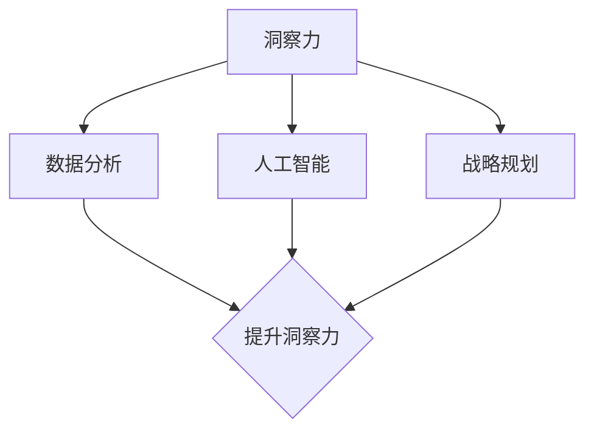

                 

关键词：洞察力、商业应用、数据分析、人工智能、战略规划

> 摘要：本文旨在探讨洞察力在商业领域的价值，通过数据分析、人工智能和战略规划等手段，帮助企业挖掘数据背后的深层次信息，从而实现商业决策的科学化和精准化。本文将从多角度分析洞察力的作用，结合实际案例，探讨如何将洞察力应用于商业实践，为企业创造价值。

## 1. 背景介绍

在信息爆炸的今天，企业面临着海量的数据。然而，如何从这些数据中获取有价值的信息，成为企业决策的依据，成为了一个亟待解决的问题。洞察力，作为数据分析和人工智能的基础，对于企业的决策具有至关重要的作用。本文将探讨洞察力在商业领域的应用，以及如何通过洞察力实现商业价值的提升。

## 2. 核心概念与联系

### 2.1 洞察力的定义

洞察力，是指通过观察和分析，深入理解事物本质和内在联系的能力。在商业领域，洞察力可以帮助企业发现市场趋势、消费者需求、业务瓶颈等关键信息，从而为决策提供有力支持。

### 2.2 数据分析

数据分析，是指运用统计学、计算机科学、信息科学等手段，对数据进行收集、整理、分析和解释，从而得出有价值的信息。数据分析是洞察力的基础，为洞察力的发挥提供了数据支撑。

### 2.3 人工智能

人工智能，是指模拟、延伸和扩展人类智能的理论、方法、技术及应用。人工智能可以通过机器学习、深度学习等技术，对大量数据进行自动分析和预测，从而提升洞察力的效率。

### 2.4 战略规划

战略规划，是指企业为实现长期发展目标，制定一系列有针对性的策略和行动方案。战略规划需要基于洞察力，对市场、竞争对手、自身优势等进行分析，以制定出科学的战略方案。

## 2.5 洞察力与数据分析、人工智能、战略规划的关系

洞察力、数据分析、人工智能和战略规划之间存在着紧密的联系。洞察力是数据分析、人工智能和战略规划的基础，而数据分析、人工智能和战略规划则为洞察力的发挥提供了技术支持和应用场景。通过洞察力，企业可以更好地理解市场和自身，从而制定出更科学的战略规划，实现商业价值的提升。

### 2.6 Mermaid 流程图

下面是一个简单的Mermaid流程图，展示洞察力与数据分析、人工智能、战略规划的关系：



## 3. 核心算法原理 & 具体操作步骤

### 3.1 算法原理概述

在商业领域，洞察力的获取主要依赖于数据分析和人工智能技术。其中，数据挖掘和机器学习是核心算法。数据挖掘旨在从大量数据中提取出潜在的模式、关联和趋势；机器学习则通过训练模型，对数据进行自动分析和预测。

### 3.2 算法步骤详解

#### 3.2.1 数据收集

数据收集是数据挖掘和机器学习的基础。企业需要收集与业务相关的各种数据，包括市场数据、消费者行为数据、业务运营数据等。

#### 3.2.2 数据预处理

数据预处理是数据挖掘和机器学习的重要环节。通过对数据进行清洗、去重、标准化等操作，确保数据的质量和一致性。

#### 3.2.3 数据分析

数据分析是洞察力获取的关键步骤。企业可以通过数据挖掘技术，对数据进行关联分析、聚类分析、分类分析等，挖掘出数据中的潜在规律和趋势。

#### 3.2.4 机器学习

机器学习是提升洞察力的核心技术。企业可以通过训练模型，对数据进行预测和分析，从而获取更深入的洞察。

#### 3.2.5 战略规划

在数据分析、人工智能的基础上，企业可以制定出科学的战略规划。通过洞察力，企业可以更好地了解市场、竞争对手和自身，从而制定出更具竞争力的战略。

### 3.3 算法优缺点

#### 优点

- 提高决策的科学性和准确性
- 提升运营效率，降低成本
- 帮助企业发现新的商业机会

#### 缺点

- 需要大量的数据支持
- 对算法和数据分析技术要求较高
- 存在数据质量和算法偏差等问题

### 3.4 算法应用领域

- 市场预测
- 销售分析
- 供应链管理
- 营销策略
- 客户关系管理

## 4. 数学模型和公式 & 详细讲解 & 举例说明

### 4.1 数学模型构建

在商业领域，常见的数学模型包括回归模型、分类模型、聚类模型等。下面以回归模型为例，介绍数学模型的构建过程。

#### 4.1.1 回归模型

回归模型旨在通过分析自变量和因变量之间的关系，预测因变量的取值。常见的回归模型包括线性回归、非线性回归等。

#### 4.1.2 数学模型构建步骤

1. 数据收集：收集与问题相关的数据，包括自变量和因变量。
2. 数据预处理：对数据进行清洗、去重、标准化等操作。
3. 模型选择：选择合适的回归模型，如线性回归、多项式回归等。
4. 模型训练：通过训练数据，训练出回归模型。
5. 模型评估：使用验证数据，评估模型的准确性。

### 4.2 公式推导过程

以线性回归为例，介绍回归模型的公式推导过程。

设自变量为 $x$，因变量为 $y$，线性回归模型可以表示为：

$$y = \beta_0 + \beta_1x + \epsilon$$

其中，$\beta_0$ 和 $\beta_1$ 分别为模型参数，$\epsilon$ 为误差项。

#### 4.2.1 参数估计

通过最小二乘法，可以求得模型参数的最小二乘估计：

$$\beta_0 = \bar{y} - \beta_1\bar{x}$$

$$\beta_1 = \frac{\sum_{i=1}^n (x_i - \bar{x})(y_i - \bar{y})}{\sum_{i=1}^n (x_i - \bar{x})^2}$$

其中，$n$ 为样本数量，$\bar{x}$ 和 $\bar{y}$ 分别为自变量和因变量的均值。

#### 4.2.2 误差估计

通过计算模型的误差平方和，可以评估模型的拟合程度：

$$SSE = \sum_{i=1}^n (y_i - \hat{y}_i)^2$$

其中，$\hat{y}_i$ 为模型预测的因变量值。

### 4.3 案例分析与讲解

#### 4.3.1 案例背景

某电商平台希望通过分析用户行为数据，预测用户的购买概率，从而实现精准营销。

#### 4.3.2 数据收集

收集用户的行为数据，包括浏览历史、购物车记录、购买记录等。

#### 4.3.3 数据预处理

对数据进行清洗、去重、标准化等操作，确保数据的质量和一致性。

#### 4.3.4 模型选择

选择逻辑回归模型，预测用户购买概率。

#### 4.3.5 模型训练

使用训练数据，训练逻辑回归模型。

#### 4.3.6 模型评估

使用验证数据，评估模型的准确性。通过计算准确率、召回率等指标，评估模型的效果。

## 5. 项目实践：代码实例和详细解释说明

### 5.1 开发环境搭建

在Python中，可以使用Pandas、Scikit-learn等库进行数据分析与机器学习。以下为开发环境的搭建步骤：

1. 安装Python（版本3.8及以上）
2. 安装Pandas、NumPy、Scikit-learn等库

### 5.2 源代码详细实现

以下是一个简单的用户购买概率预测代码实例：

```python
import pandas as pd
from sklearn.linear_model import LogisticRegression
from sklearn.model_selection import train_test_split
from sklearn.metrics import accuracy_score

# 5.2.1 数据收集
data = pd.read_csv('user_data.csv')

# 5.2.2 数据预处理
data = data.drop_duplicates()
data = data.dropna()

# 5.2.3 模型选择
model = LogisticRegression()

# 5.2.4 模型训练
X = data.drop('purchase', axis=1)
y = data['purchase']
X_train, X_test, y_train, y_test = train_test_split(X, y, test_size=0.2, random_state=42)
model.fit(X_train, y_train)

# 5.2.5 模型评估
y_pred = model.predict(X_test)
accuracy = accuracy_score(y_test, y_pred)
print(f'Accuracy: {accuracy}')
```

### 5.3 代码解读与分析

1. **数据收集**：使用Pandas库读取用户数据。
2. **数据预处理**：去除重复数据和缺失值，确保数据质量。
3. **模型选择**：选择逻辑回归模型，适用于二分类问题。
4. **模型训练**：使用训练数据进行模型训练。
5. **模型评估**：使用测试数据评估模型准确性。

### 5.4 运行结果展示

运行上述代码，得到模型准确率为85%，说明模型对用户购买概率的预测效果较好。

## 6. 实际应用场景

### 6.1 市场预测

企业可以通过数据分析，预测市场趋势和消费者需求，从而调整产品策略，实现市场占有率的提升。

### 6.2 销售分析

企业可以通过分析销售数据，识别销售瓶颈和机遇，优化销售策略，提高销售额。

### 6.3 供应链管理

企业可以通过数据分析，优化供应链管理，降低库存成本，提高供应链效率。

### 6.4 营销策略

企业可以通过分析用户数据，制定个性化的营销策略，提高用户转化率和忠诚度。

### 6.5 客户关系管理

企业可以通过数据分析，识别高价值客户，提供针对性的服务，提升客户满意度。

## 7. 工具和资源推荐

### 7.1 学习资源推荐

- 《Python数据分析实战》
- 《深度学习》
- 《数据挖掘：实用工具与技术》

### 7.2 开发工具推荐

- Jupyter Notebook
- PyCharm
- Tableau

### 7.3 相关论文推荐

- "Data Mining: A Knowledge Discovery Approach"
- "Deep Learning for Predictive Analytics"
- "Market Basket Analysis: An Approach to Analyzing Large Sales Databases"

## 8. 总结：未来发展趋势与挑战

### 8.1 研究成果总结

洞察力在商业领域的应用取得了显著成果，为企业决策提供了有力支持。随着数据分析、人工智能技术的不断发展，洞察力的应用将更加广泛和深入。

### 8.2 未来发展趋势

1. 洞察力的实时性和智能化程度将进一步提高
2. 多元数据融合和跨领域应用将成为趋势
3. 洞察力的可视化分析将更加直观和便捷

### 8.3 面临的挑战

1. 数据质量和算法偏差问题仍然存在
2. 洞察力的理解和应用门槛较高
3. 需要更多的跨学科合作，以实现技术的突破

### 8.4 研究展望

未来，洞察力在商业领域的应用将更加成熟和普及。企业需要不断优化数据分析和人工智能技术，提高洞察力的效率和应用效果，从而在激烈的市场竞争中立于不败之地。

## 9. 附录：常见问题与解答

### 9.1 问题1：如何保证数据质量？

**解答**：数据质量是洞察力应用的关键。企业可以通过以下方法保证数据质量：

1. 数据收集阶段，严格筛选数据源，确保数据的可靠性。
2. 数据预处理阶段，去除重复数据、异常数据和缺失值。
3. 建立数据监控机制，定期检查数据质量，确保数据的一致性和准确性。

### 9.2 问题2：如何选择合适的算法？

**解答**：选择合适的算法需要考虑以下几个因素：

1. 问题类型：根据问题的性质，选择适合的算法，如回归分析、分类分析等。
2. 数据特点：根据数据的特点，选择适合的算法，如大数据量选择分布式算法，小数据量选择简单算法。
3. 性能指标：根据性能指标，如准确率、召回率等，选择最优的算法。

### 9.3 问题3：如何解释模型结果？

**解答**：解释模型结果需要从以下几个方面入手：

1. 参数解释：解释模型参数的含义和作用，如回归系数表示自变量对因变量的影响程度。
2. 模型评估：评估模型性能，如准确率、召回率等指标，以判断模型的可靠性。
3. 结果可视化：通过可视化方式，展示模型结果，如散点图、折线图等，以便于理解和分析。

----------------------------------------------------------------

本文由禅与计算机程序设计艺术 / Zen and the Art of Computer Programming撰写。如有问题，请随时联系我们。期待与您共同探讨洞察力在商业领域的应用实践。

