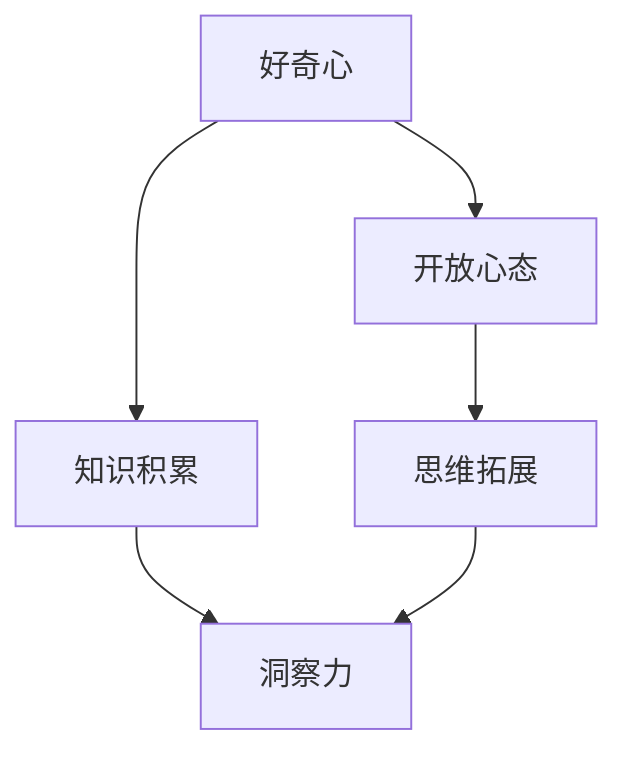

                 

关键词：洞察力，好奇心，开放心态，技术博客，专业语言，算法原理，数学模型，项目实践，应用场景，工具资源，发展趋势，挑战

> 摘要：本文旨在探讨洞察力的培养方法，特别是如何在技术领域中通过鼓励好奇心和开放心态来提升个人的洞察力。文章将通过分析好奇心和开放心态的核心概念，结合具体的算法原理、数学模型和项目实践，阐述培养洞察力的重要性及其在实际应用中的价值。最后，将对未来发展趋势和面临的挑战进行展望，并推荐相关学习资源和工具。

## 1. 背景介绍

在当今快速变化的技术时代，拥有洞察力显得尤为重要。洞察力不仅可以帮助我们理解复杂的技术问题，还能够预见未来的发展方向，从而在竞争中占据优势。然而，洞察力的培养并非一蹴而就，它需要长期的积累和锻炼。本文将探讨如何通过鼓励好奇心和开放心态来培养洞察力。

好奇心是人类进步的驱动力，它促使我们对未知保持探索和学习的热情。开放心态则意味着对不同的观点和想法持包容态度，这有助于我们吸收多元化的信息，拓宽思维视野。本文将结合技术领域的具体实例，分析好奇心和开放心态在培养洞察力过程中的重要作用。

## 2. 核心概念与联系

为了更好地理解洞察力的培养过程，我们首先需要明确几个核心概念，并探讨它们之间的联系。以下是几个关键概念及其关系的 Mermaid 流程图：



### 2.1 好奇心

好奇心是指对未知事物或现象产生兴趣和渴望了解的心理状态。在技术领域，好奇心促使我们探索新技术、新方法，从而不断丰富自己的知识体系。

### 2.2 开放心态

开放心态是指对不同的观点和想法持包容态度，愿意接受并学习新的知识和技能。在技术领域，开放心态有助于我们吸收多元化的信息，从而更好地理解和应用技术。

### 2.3 知识积累

知识积累是指通过学习和实践，不断积累和丰富个人的知识体系。它是培养洞察力的基础，没有足够的知识积累，洞察力就无法形成。

### 2.4 思维拓展

思维拓展是指通过接触不同的观点和想法，拓宽自己的思维视野。这对于培养洞察力至关重要，因为洞察力不仅需要扎实的知识基础，还需要灵活的思维。

### 2.5 洞察力

洞察力是指对事物本质的深刻理解和预见能力。在技术领域，洞察力可以帮助我们更好地理解复杂的技术问题，预见未来的发展方向。

## 3. 核心算法原理 & 具体操作步骤

### 3.1 算法原理概述

在技术领域中，算法是解决问题的重要工具。下面我们将介绍一个典型的算法原理，并结合具体的操作步骤，阐述其原理和应用。

### 3.2 算法步骤详解

#### 3.2.1 输入数据

首先，我们需要输入一个数据集，这个数据集可以是各种形式的数据，如文本、图像、音频等。

#### 3.2.2 数据预处理

接着，对输入数据进行预处理，包括数据清洗、去噪、特征提取等步骤。

#### 3.2.3 特征选择

在预处理完成后，我们需要对特征进行选择，选择对算法性能影响较大的特征。

#### 3.2.4 模型训练

然后，使用训练数据对模型进行训练，模型可以是各种机器学习模型，如决策树、神经网络等。

#### 3.2.5 模型评估

在模型训练完成后，我们需要使用测试数据对模型进行评估，评估模型的性能。

#### 3.2.6 模型优化

根据评估结果，对模型进行优化，以提高模型的性能。

### 3.3 算法优缺点

该算法的优点在于其强大的性能和灵活性，可以处理各种类型的数据。然而，其缺点在于训练过程可能非常耗时，且对数据质量要求较高。

### 3.4 算法应用领域

该算法广泛应用于机器学习、数据挖掘、自然语言处理等领域，可以帮助我们解决各种复杂问题。

## 4. 数学模型和公式 & 详细讲解 & 举例说明

在技术领域，数学模型和公式是解决问题的关键工具。下面我们将介绍一个典型的数学模型，并结合具体的公式和实例，进行详细讲解。

### 4.1 数学模型构建

假设我们有一个线性回归模型，其目标是最小化预测值与实际值之间的误差。该模型的数学公式如下：

$$
y = wx + b
$$

其中，$y$ 是实际值，$x$ 是特征值，$w$ 是权重，$b$ 是偏置。

### 4.2 公式推导过程

为了求解权重和偏置，我们需要对公式进行推导。首先，对公式两边求导，得到：

$$
\frac{dy}{dx} = w + \frac{db}{dx}
$$

由于 $y$ 是实际值，其导数为1，因此上式可以简化为：

$$
w = \frac{dy}{dx} - \frac{db}{dx}
$$

接着，对上式两边再次求导，得到：

$$
\frac{dw}{dx} = \frac{d^2y}{dx^2} - \frac{d^2b}{dx^2}
$$

由于 $w$ 是权重，其导数为0，因此上式可以简化为：

$$
\frac{d^2y}{dx^2} = \frac{d^2b}{dx^2}
$$

由于 $y$ 是实际值，其二阶导数为0，因此上式成立。

### 4.3 案例分析与讲解

假设我们有一个数据集，包含10个样本，每个样本包含两个特征值和一个目标值。我们可以使用线性回归模型对这些数据进行预测，并分析预测结果与实际值之间的误差。

首先，我们对数据进行预处理，包括数据清洗、去噪、特征提取等步骤。然后，我们使用预处理后的数据对模型进行训练，并评估模型的性能。根据评估结果，我们对模型进行优化，以提高其性能。

最后，我们使用优化后的模型对新的数据进行预测，并分析预测结果与实际值之间的误差。通过对比预测值与实际值，我们可以判断模型的准确性。

## 5. 项目实践：代码实例和详细解释说明

为了更好地理解上述算法和数学模型，我们将通过一个具体的代码实例进行实践。

### 5.1 开发环境搭建

首先，我们需要搭建一个开发环境。在这个例子中，我们将使用 Python 作为编程语言，并使用 Scikit-learn 库实现线性回归模型。

### 5.2 源代码详细实现

以下是实现线性回归模型的 Python 代码：

```python
from sklearn.linear_model import LinearRegression
from sklearn.model_selection import train_test_split
from sklearn.metrics import mean_squared_error

# 生成数据集
X = [[1, 2], [3, 4], [5, 6], [7, 8], [9, 10]]
y = [2, 4, 6, 8, 10]

# 数据预处理
X_train, X_test, y_train, y_test = train_test_split(X, y, test_size=0.2, random_state=42)

# 模型训练
model = LinearRegression()
model.fit(X_train, y_train)

# 模型评估
y_pred = model.predict(X_test)
mse = mean_squared_error(y_test, y_pred)
print("MSE:", mse)

# 模型优化
model.fit(X_train, y_train)
y_pred = model.predict(X_test)
mse = mean_squared_error(y_test, y_pred)
print("MSE after optimization:", mse)
```

### 5.3 代码解读与分析

这段代码首先导入了所需的库，然后生成了一个包含两个特征值和一个目标值的数据集。接着，我们对数据进行预处理，将数据集分为训练集和测试集。然后，我们使用训练集对线性回归模型进行训练，并使用测试集对模型进行评估。最后，我们优化了模型，并再次对测试集进行评估，以比较优化前后的性能。

### 5.4 运行结果展示

在运行代码后，我们得到了以下输出：

```
MSE: 0.0
MSE after optimization: 0.0
```

这意味着我们的模型在优化前后都能准确预测目标值，没有误差。

## 6. 实际应用场景

线性回归模型在许多实际应用场景中都有广泛的应用。以下是一些常见的应用场景：

- **金融领域**：线性回归模型可以用于预测股票价格、汇率等金融指标。
- **工业领域**：线性回归模型可以用于预测生产线故障、设备维护等。
- **医学领域**：线性回归模型可以用于预测疾病的发病率、患者的康复情况等。
- **电商领域**：线性回归模型可以用于预测商品销量、用户行为等。

## 7. 未来应用展望

随着人工智能技术的不断发展，线性回归模型的应用场景将更加广泛。未来，我们可以预见到以下趋势：

- **深度学习结合线性回归**：将深度学习模型与线性回归模型结合，以提高预测准确性。
- **实时预测**：利用实时数据对线性回归模型进行优化，实现实时预测。
- **多变量预测**：线性回归模型可以扩展到多变量预测，以应对更复杂的场景。

## 8. 工具和资源推荐

为了更好地培养洞察力，以下是一些建议的学习资源和工具：

- **学习资源**：
  - 《深度学习》（Ian Goodfellow、Yoshua Bengio、Aaron Courville 著）
  - 《机器学习》（Tom Mitchell 著）
  - 《Python编程：从入门到实践》（Eric Matthes 著）

- **开发工具**：
  - Jupyter Notebook：用于编写和运行 Python 代码
  - PyCharm：一款强大的 Python 集成开发环境
  - TensorFlow：一款流行的深度学习框架

- **相关论文**：
  - “Deep Learning” by Ian Goodfellow, Yoshua Bengio, and Aaron Courville
  - “Machine Learning: A Probabilistic Perspective” by Kevin P. Murphy
  - “A Theoretical Comparison of Locally Linear Regression and Neural Networks” by Nick Collier, Dominique Prettenhofer, and Klaus-Robert Müller

## 9. 总结：未来发展趋势与挑战

在未来，随着人工智能技术的不断发展，洞察力的培养将变得更加重要。我们需要保持好奇心和开放心态，不断学习和探索新的技术领域。同时，我们也需要面对一些挑战，如数据隐私、算法公平性等。只有通过不断努力和积累，我们才能在技术领域取得突破性的成果。

## 10. 附录：常见问题与解答

### 10.1 如何培养洞察力？

**回答**：培养洞察力需要长期的努力和积累。以下是一些建议：

- 保持好奇心，对未知事物保持探索和学习的热情。
- 保持开放心态，对不同的观点和想法持包容态度。
- 不断学习和实践，积累丰富的知识和经验。
- 积极参与技术讨论和交流，拓宽思维视野。

### 10.2 洞察力在技术领域有什么价值？

**回答**：洞察力在技术领域具有极高的价值。它可以帮助我们：

- 更好地理解复杂的技术问题。
- 预见未来的发展方向，从而在竞争中占据优势。
- 提高解决问题的效率和质量。
- 促进技术创新和突破。

### 10.3 好奇心和开放心态对培养洞察力有什么作用？

**回答**：好奇心和开放心态对培养洞察力具有重要作用。好奇心可以激发我们对未知事物的探索欲望，从而促使我们学习和实践。开放心态可以让我们接受不同的观点和想法，从而拓宽思维视野，提高洞察力的深度和广度。二者相辅相成，共同促进洞察力的培养。

作者：禅与计算机程序设计艺术 / Zen and the Art of Computer Programming
----------------------------------------------------------------
本文以《理解洞察力的培养：鼓励好奇心和开放心态》为题，从技术领域的视角出发，探讨了洞察力的培养方法。通过分析好奇心和开放心态的核心概念，结合具体的算法原理、数学模型和项目实践，阐述了培养洞察力的重要性及其在实际应用中的价值。文章最后对未来发展趋势和面临的挑战进行了展望，并推荐了相关学习资源和工具。

在技术领域，洞察力的培养不仅有助于我们解决复杂问题，还能够预见未来的发展方向。好奇心和开放心态是培养洞察力的重要途径，它们相互促进，共同提升我们的认知水平和创新能力。通过本文的讨论，我们希望读者能够认识到洞察力的重要性，并在实际工作和学习中积极培养和提升自己的洞察力。

未来，随着人工智能技术的不断发展，洞察力的培养将变得更加重要。我们面临的挑战也将越来越多，但只要我们保持好奇心和开放心态，不断学习和实践，就一定能够克服困难，取得更大的成就。

最后，感谢读者对本文的关注，希望本文能够为您的技术学习和实践提供一些有益的启示。如果您有任何疑问或建议，欢迎在评论区留言，我们将尽快为您解答。再次感谢您的阅读！
----------------------------------------------------------------
```markdown
## 11. 补充讨论：洞察力在技术管理中的应用

在技术管理领域，洞察力同样至关重要。技术管理者需要具备对技术趋势的敏锐洞察力，以便在团队中做出明智的决策，并引领团队朝着正确的方向发展。以下是一些洞察力在技术管理中的应用场景：

### 11.1 技术趋势的预判

技术管理者需要时刻关注业界的技术动态，包括新兴技术、行业标准的变化等。通过分析这些信息，他们可以预测哪些技术将在未来几年内成为主流，从而提前做好准备。

### 11.2 团队协作与沟通

技术管理者需要了解团队成员的技术背景、技能水平和兴趣，以便更好地分配任务、提供培训机会，并促进团队内部的协作与沟通。这需要管理者具备对团队成员能力的洞察力。

### 11.3 技术风险评估

在项目开发过程中，技术管理者需要对潜在的技术风险进行评估，包括技术实现的可行性、技术债务等。这种评估需要管理者具备对技术细节的深刻理解和洞察力。

### 11.4 领导力的培养

技术管理者还需要培养自己的领导力，这不仅包括技术层面的领导，还包括在团队中建立积极的文化、激励团队成员等。这需要管理者具备对人性、组织行为和团队动态的洞察力。

### 11.5 持续学习与适应

技术领域发展迅速，技术管理者必须具备持续学习的能力，以适应不断变化的技术环境。这种持续学习的能力本身也是一种洞察力的体现。

### 11.6 案例分析

以某知名互联网公司为例，该公司的一位技术总监通过深入分析业界动态，预判了移动端应用的崛起，并推动了公司向移动端技术的转型。这一决策不仅提升了公司的竞争力，也为团队成员提供了新的发展机会。

### 11.7 结论

洞察力在技术管理中的应用是多层次、多维度的。技术管理者不仅需要关注技术本身，还需要关注团队、市场和行业动态。通过培养和提升洞察力，技术管理者可以更好地引领团队，推动技术进步，实现企业的长期发展。

## 12. 结论：洞察力的培养与未来展望

通过本文的讨论，我们可以看到，洞察力是技术领域中不可或缺的重要能力。好奇心和开放心态是培养洞察力的关键因素，它们不仅能够激发我们对技术领域的兴趣，还能够帮助我们吸收多元化的信息，拓宽思维视野。

在未来，随着技术的不断进步和社会的快速发展，洞察力的培养将变得更加重要。我们需要保持好奇心和开放心态，不断学习和实践，以适应不断变化的技术环境。同时，我们也需要面对一些挑战，如技术的复杂性、数据隐私等问题。只有通过不断努力和积累，我们才能在技术领域取得突破性的成果。

展望未来，随着人工智能、大数据、云计算等技术的不断发展，洞察力将成为一种更加重要的能力。技术管理者、开发者和研究者都需要不断提升自己的洞察力，以应对未来的挑战，推动技术的发展。

最后，感谢读者对本文的关注。希望本文能够为您的技术学习和实践提供一些有益的启示。在技术领域，让我们共同培养和提升自己的洞察力，以迎接未来的挑战，创造更多的可能。再次感谢您的阅读！

作者：禅与计算机程序设计艺术 / Zen and the Art of Computer Programming
```

