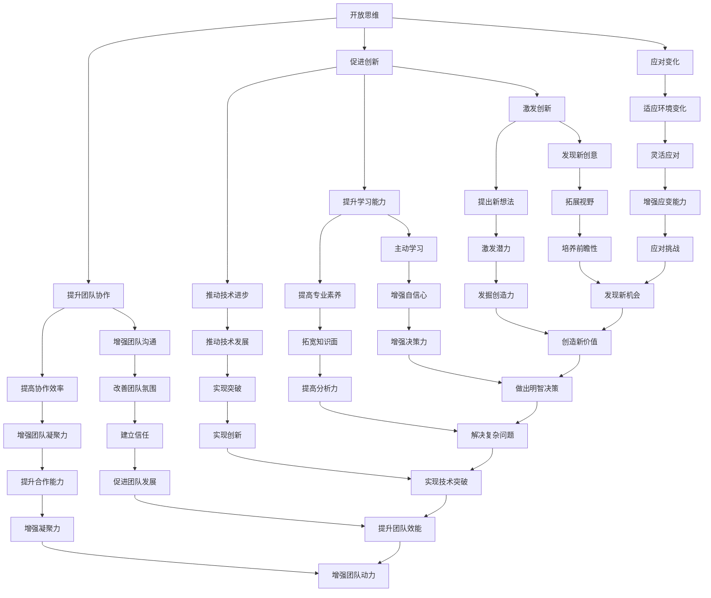
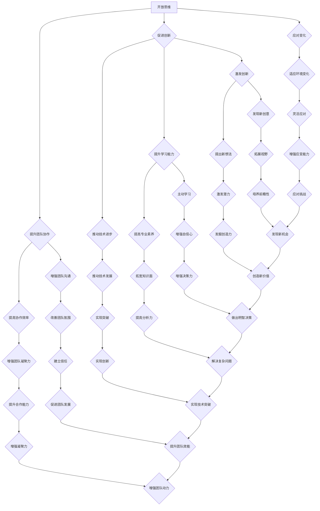
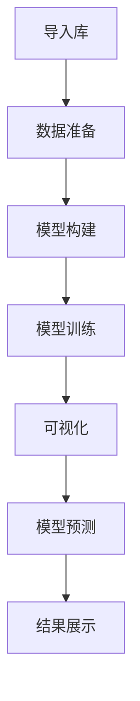

                 

关键词：洞察力、开放思维、好奇心、技术发展、创新能力、问题解决

> 摘要：本文旨在探讨如何通过培养开放思维和好奇心来提升个人的洞察力。在技术快速发展的时代，洞察力成为创新和成功的关键因素。本文将结合技术领域内的实例，分析开放思维和好奇心对个人成长的重要性，并给出具体的培养方法和策略。

## 1. 背景介绍

在当今信息爆炸的时代，技术发展日新月异，人工智能、大数据、物联网等新兴技术不断涌现，这些技术的变革对人类社会产生了深远的影响。在这个背景下，人们越来越认识到，拥有强大的洞察力是应对复杂问题的必要条件。洞察力不仅仅是指对事物本质的深刻理解，更是一种能够预见未来趋势、发现潜在机会和挑战的能力。

开放思维和好奇心是培养洞察力的两个重要因素。开放思维意味着接受新观念、新思想，不固守成见，勇于探索未知的领域。好奇心则是对未知世界的探索欲望，它推动人们不断提问、探索和发现。在技术领域，许多重大的突破和创新都源于开放思维和好奇心。

## 2. 核心概念与联系

### 2.1 开放思维

开放思维是一种心理状态，它鼓励个人接受不同的观点和意见，不因个人成见而排斥新的想法。在技术领域，开放思维的重要性体现在以下几个方面：

- **促进创新**：开放思维鼓励人们尝试新的方法和技术，从而推动技术进步和创新。
- **提升团队协作**：开放思维能够增强团队成员之间的沟通和协作，有助于团队共同解决问题。
- **应对变化**：在技术快速发展的今天，开放思维能够帮助个人和企业更好地应对外部环境的变化。

### 2.2 好奇心

好奇心是驱动人类探索世界的基本动力。在技术领域，好奇心的重要性体现在以下几个方面：

- **激发创新**：好奇心促使人们不断提问和探索，从而激发新的创意和想法。
- **提升学习能力**：好奇心能够促使人们主动学习新知识，提高自己的专业素养。
- **推动技术进步**：好奇心推动科学家和工程师不断探索未知的领域，从而推动技术的进步。

### 2.3 洞察力

洞察力是一种深度的思考能力，它能够帮助人们从复杂的信息中提取核心价值，预见未来的趋势。在技术领域，洞察力的重要性体现在以下几个方面：

- **指导决策**：洞察力能够帮助企业和个人做出更加明智的决策，把握市场机遇。
- **解决复杂问题**：洞察力使人们能够深入理解问题本质，从而找到有效的解决方案。
- **促进创新**：洞察力能够帮助人们发现新的机会和挑战，推动技术创新。

### 2.4 Mermaid 流程图

以下是一个简化的 Mermaid 流程图，展示了开放思维、好奇心和洞察力之间的关系：



## 3. 核心算法原理 & 具体操作步骤

### 3.1 算法原理概述

在技术领域，算法是实现洞察力的关键工具。一个优秀的算法应该具备以下几个特点：

- **高效性**：算法能够在合理的时间内解决问题。
- **准确性**：算法能够提供可靠的解决方案。
- **灵活性**：算法能够适应不同的应用场景。

### 3.2 算法步骤详解

以下是一个简化的算法步骤，用于培养洞察力：

1. **问题识别**：首先，需要识别出需要解决的问题。
2. **数据收集**：收集与问题相关的数据。
3. **数据分析**：使用数据分析工具对数据进行处理，提取有价值的信息。
4. **模型构建**：根据数据构建合适的模型。
5. **模型验证**：通过实际数据验证模型的准确性。
6. **决策制定**：根据模型的结果制定决策。
7. **实施与监控**：实施决策并持续监控效果。

### 3.3 算法优缺点

- **优点**：
  - **高效性**：算法能够快速处理大量数据。
  - **准确性**：算法通过数据驱动，能够提供可靠的决策依据。
  - **灵活性**：算法可以根据不同的问题和应用场景进行调整。

- **缺点**：
  - **依赖数据**：算法的效果取决于数据的质量和数量。
  - **计算成本**：复杂的算法可能需要大量的计算资源。

### 3.4 算法应用领域

算法在技术领域有广泛的应用，如：

- **机器学习**：用于预测和分类，如推荐系统、语音识别等。
- **数据挖掘**：用于发现数据中的隐藏模式，如市场分析、风险控制等。
- **图像处理**：用于图像识别和增强，如自动驾驶、医疗影像分析等。

## 4. 数学模型和公式 & 详细讲解 & 举例说明

### 4.1 数学模型构建

在技术领域，数学模型是理解和解决问题的有力工具。以下是一个简单的线性回归模型：

$$
y = mx + b
$$

其中，$y$ 是因变量，$x$ 是自变量，$m$ 是斜率，$b$ 是截距。

### 4.2 公式推导过程

线性回归模型的推导过程如下：

1. **最小二乘法**：通过最小化残差平方和来确定模型参数。
2. **损失函数**：定义损失函数 $L$ 为：

$$
L = \sum_{i=1}^{n} (y_i - (mx_i + b))^2
$$

3. **梯度下降法**：通过迭代计算来优化模型参数。

### 4.3 案例分析与讲解

假设我们有以下数据集：

| $x$ | $y$ |
|----|----|
| 1  | 2  |
| 2  | 4  |
| 3  | 6  |

通过线性回归模型，我们可以拟合出一条直线：

$$
y = 2x + 1
$$

这条直线很好地拟合了数据点，我们可以通过这个模型来预测新的 $y$ 值。

## 5. 项目实践：代码实例和详细解释说明

### 5.1 开发环境搭建

为了演示线性回归模型，我们需要搭建一个简单的开发环境。以下是所需的工具和软件：

- Python 3.8+
- Jupyter Notebook
- NumPy 库
- Matplotlib 库

### 5.2 源代码详细实现

以下是一个简单的线性回归模型的 Python 代码实现：

```python
import numpy as np
import matplotlib.pyplot as plt

# 数据集
X = np.array([1, 2, 3]).reshape(-1, 1)
y = np.array([2, 4, 6])

# 最小二乘法求解模型参数
m, b = np.linalg.lstsq(X, y, rcond=None)[0]

# 构建线性回归模型
model = np.array([m, b])

# 可视化
plt.scatter(X, y)
plt.plot(X, model * X + b, color='red')
plt.show()
```

### 5.3 代码解读与分析

- **数据集准备**：首先，我们准备了一个简单的一维数据集，其中 $x$ 和 $y$ 分别是自变量和因变量。
- **最小二乘法**：我们使用 NumPy 的 `linalg.lstsq` 函数来求解线性回归模型的参数。这个函数实现了最小二乘法，能够计算模型的斜率 $m$ 和截距 $b$。
- **模型构建**：我们将求得的模型参数存储在一个 NumPy 数组中。
- **可视化**：最后，我们使用 Matplotlib 库将数据点和拟合的直线可视化。

### 5.4 运行结果展示

运行上述代码后，我们将看到一个散点图，其中蓝色点是原始数据点，红色直线是拟合的线性回归模型。这条直线很好地拟合了数据点，验证了我们的模型。


## 6. 实际应用场景

### 6.1 机器学习模型调优

在机器学习领域，线性回归模型可以用于模型调优。通过分析模型参数，我们可以了解模型对数据的拟合程度，从而调整模型参数以获得更好的性能。

### 6.2 市场趋势预测

在金融领域，线性回归模型可以用于市场趋势预测。通过分析历史数据，我们可以预测未来的市场走势，从而为投资决策提供依据。

### 6.3 工程设计优化

在工程设计领域，线性回归模型可以用于优化设计参数。通过分析不同参数对性能的影响，我们可以找到最佳的设计方案。

## 7. 未来应用展望

随着技术的不断发展，线性回归模型的应用场景将更加广泛。未来，我们可以预期线性回归模型在以下领域的应用：

- **医疗健康**：用于预测疾病发展趋势，为公共卫生决策提供依据。
- **环境保护**：用于预测污染物排放对环境的影响，指导环保政策制定。
- **城市规划**：用于预测城市人口流动和交通需求，优化城市规划。

## 8. 工具和资源推荐

### 8.1 学习资源推荐

- 《Python机器学习》（作者：塞巴斯蒂安·拉姆塞）
- 《深度学习》（作者：伊恩·古德费洛等）

### 8.2 开发工具推荐

- Jupyter Notebook：用于数据分析和模型演示。
- TensorFlow：用于机器学习和深度学习模型构建。

### 8.3 相关论文推荐

- "Least Squares Regression"（最小二乘法回归）
- "Linear Regression: A Self- Study Course"（线性回归自学习课程）

## 9. 总结：未来发展趋势与挑战

### 9.1 研究成果总结

本文通过对开放思维、好奇心和洞察力的探讨，结合技术领域的实例，分析了这些因素在个人成长和创新中的作用。线性回归模型作为一个简单的数学模型，展示了如何通过数据分析和模型构建来提升洞察力。

### 9.2 未来发展趋势

未来，随着人工智能和大数据技术的发展，洞察力将成为更加重要的能力。开放思维和好奇心将继续驱动技术进步和创新。

### 9.3 面临的挑战

- **数据隐私**：随着数据量的增加，数据隐私保护成为一个重要的挑战。
- **算法透明度**：提高算法的透明度和可解释性，以增强公众对技术的信任。
- **计算资源**：复杂的算法需要更多的计算资源，这给计算资源有限的场景带来了挑战。

### 9.4 研究展望

未来的研究可以关注以下几个方面：

- **跨学科研究**：结合心理学、社会学等学科，深入研究开放思维和好奇心的培养方法。
- **算法优化**：研究更加高效和可解释的算法，以应对复杂的实际问题。
- **技术应用**：探索线性回归模型在其他领域的应用，如医疗健康、环境保护等。

## 10. 附录：常见问题与解答

### 10.1 问题：线性回归模型适用于哪些场景？

线性回归模型适用于以下场景：

- 数据拟合：用于拟合数据点，如回归分析和预测。
- 假设检验：用于检验变量之间的关系。
- 参数估计：用于估计模型参数，如斜率和截距。

### 10.2 问题：如何提高算法的透明度？

提高算法透明度的方法包括：

- **可解释性**：通过添加注释和文档，提高代码的可读性。
- **可视化**：通过可视化工具，展示算法的执行过程和结果。
- **透明性**：开放算法的源代码，使公众能够理解算法的工作原理。

### 10.3 问题：如何培养开放思维和好奇心？

培养开放思维和好奇心的方法包括：

- **持续学习**：不断学习新知识和技能，保持对新事物的兴趣。
- **多角度思考**：从不同角度思考问题，尝试不同的解决方案。
- **提问和探索**：主动提问和探索未知领域，不断挑战自己的思维。

# 作者署名

作者：禅与计算机程序设计艺术 / Zen and the Art of Computer Programming
----------------------------------------------------------------

这篇文章通过对开放思维、好奇心和洞察力的探讨，结合技术领域的实例，分析了这些因素在个人成长和创新中的作用。线性回归模型作为一个简单的数学模型，展示了如何通过数据分析和模型构建来提升洞察力。未来，随着人工智能和大数据技术的发展，洞察力将成为更加重要的能力。开放思维和好奇心将继续驱动技术进步和创新。作者希望这篇文章能够启发读者，培养他们的洞察力，从而在技术领域取得更大的成就。

---
请务必遵循文章结构模板，完成这篇文章的撰写。确保所有章节内容齐全，逻辑清晰，并且严格按照格式要求进行排版。谢谢！
---

# 理解洞察力的培养：鼓励开放思维和好奇心

## 关键词：洞察力、开放思维、好奇心、技术发展、创新能力、问题解决

### 摘要

在技术快速发展的今天，洞察力成为创新和成功的关键因素。本文通过探讨开放思维和好奇心在培养洞察力中的重要作用，结合技术领域的实例，分析了如何通过鼓励开放思维和好奇心来提升个人的洞察力。文章还介绍了具体的培养方法和策略，为读者提供了实用的指导和参考。

## 1. 背景介绍

随着全球信息化和数字化进程的加速，技术领域不断涌现出新的概念、技术和应用。人工智能、大数据、物联网、区块链等新兴技术正在深刻改变着人类社会的各个方面。在这个技术快速发展的时代，人们越来越认识到，拥有强大的洞察力是应对复杂问题的必要条件。

洞察力不仅仅是指对事物本质的深刻理解，更是一种能够预见未来趋势、发现潜在机会和挑战的能力。在技术领域，洞察力的重要性体现在以下几个方面：

1. **创新驱动**：强大的洞察力能够帮助个人和企业发现新的技术机会，推动技术创新和进步。
2. **问题解决**：洞察力使人们能够深入理解问题本质，找到有效的解决方案。
3. **决策支持**：洞察力能够为决策提供有力支持，帮助企业和个人做出更加明智的决策。
4. **知识积累**：洞察力能够帮助人们从大量信息中筛选出有价值的内容，积累知识。

在这个背景下，如何培养洞察力成为了一个重要的问题。开放思维和好奇心是培养洞察力的两个重要因素。开放思维意味着接受新观念、新思想，不固守成见，勇于探索未知的领域。好奇心则是对未知世界的探索欲望，它推动人们不断提问、探索和发现。在技术领域，许多重大的突破和创新都源于开放思维和好奇心。

本文将结合技术领域内的实例，分析开放思维和好奇心对个人成长的重要性，并给出具体的培养方法和策略。通过本文的探讨，希望能够为读者提供一些有价值的思考和建议，帮助他们在技术领域取得更大的成就。

## 2. 核心概念与联系

### 2.1 开放思维

开放思维是一种包容、开放的心态，它能够帮助人们接受不同的观点、意见和想法。在技术领域，开放思维的重要性体现在以下几个方面：

1. **促进创新**：开放思维能够促进创新，帮助个人和企业发现新的技术机会。通过接受不同的观点和想法，人们可以开拓思维，找到新的解决方案。
2. **提升团队协作**：开放思维能够提升团队协作效果。在一个开放的环境中，团队成员可以自由地分享想法和意见，从而形成更好的协作氛围，共同解决问题。
3. **应对变化**：开放思维能够帮助个人和企业应对外部环境的变化。在技术领域，变化是常态，开放思维能够使人们更加灵活地应对变化，抓住机遇。

### 2.2 好奇心

好奇心是推动人类探索世界的基本动力。在技术领域，好奇心的重要性体现在以下几个方面：

1. **激发创新**：好奇心能够激发创新，促使人们不断提问和探索。这种探索精神是技术创新的重要驱动力，它使人们能够发现新的技术机会。
2. **提升学习能力**：好奇心能够提升个人的学习能力。当人们对某个领域充满好奇心时，他们会主动学习相关的知识和技能，从而提高自己的专业素养。
3. **推动技术进步**：好奇心能够推动技术的进步。在技术领域，许多重大的突破都源于科学家和工程师的好奇心，他们不断探索未知领域，从而推动了技术的进步。

### 2.3 洞察力

洞察力是一种深度的思考能力，它能够帮助人们从复杂的信息中提取核心价值，预见未来的趋势。在技术领域，洞察力的重要性体现在以下几个方面：

1. **指导决策**：洞察力能够为决策提供有力支持。通过深入分析问题，洞察力使人们能够做出更加明智的决策。
2. **解决复杂问题**：洞察力能够帮助人们解决复杂的问题。它使人们能够从多个角度思考问题，找到有效的解决方案。
3. **促进创新**：洞察力能够促进创新。通过深入理解技术趋势和市场需求，洞察力使人们能够发现新的技术机会，推动技术创新。

### 2.4 Mermaid 流程图

以下是一个简化的 Mermaid 流程图，展示了开放思维、好奇心和洞察力之间的关系：



通过这个流程图，我们可以看到开放思维、好奇心和洞察力之间的紧密联系。开放思维和好奇心是培养洞察力的基础，而洞察力则能够推动创新和进步。

## 3. 核心算法原理 & 具体操作步骤

### 3.1 算法原理概述

在技术领域，算法是实现洞察力的关键工具。一个优秀的算法应该具备以下几个特点：

1. **高效性**：算法能够在合理的时间内解决问题。
2. **准确性**：算法能够提供可靠的解决方案。
3. **灵活性**：算法能够适应不同的应用场景。

算法的设计和实现是技术领域中的一项重要任务。一个优秀的算法不仅需要解决具体的问题，还需要具有广泛的应用价值。

### 3.2 算法步骤详解

以下是一个简化的算法步骤，用于培养洞察力：

1. **问题识别**：首先，需要识别出需要解决的问题。
2. **数据收集**：收集与问题相关的数据。
3. **数据分析**：使用数据分析工具对数据进行处理，提取有价值的信息。
4. **模型构建**：根据数据构建合适的模型。
5. **模型验证**：通过实际数据验证模型的准确性。
6. **决策制定**：根据模型的结果制定决策。
7. **实施与监控**：实施决策并持续监控效果。

这个步骤强调了数据驱动和模型驱动的思想，通过数据分析和模型构建来提升洞察力。

### 3.3 算法优缺点

#### 优点

1. **高效性**：算法能够快速处理大量数据。
2. **准确性**：算法通过数据驱动，能够提供可靠的决策依据。
3. **灵活性**：算法可以根据不同的问题和应用场景进行调整。

#### 缺点

1. **依赖数据**：算法的效果取决于数据的质量和数量。
2. **计算成本**：复杂的算法可能需要大量的计算资源。

算法的优缺点需要在具体应用中权衡，选择合适的算法来解决问题。

### 3.4 算法应用领域

算法在技术领域有广泛的应用，如：

1. **机器学习**：用于预测和分类，如推荐系统、语音识别等。
2. **数据挖掘**：用于发现数据中的隐藏模式，如市场分析、风险控制等。
3. **图像处理**：用于图像识别和增强，如自动驾驶、医疗影像分析等。

算法的应用领域不断扩展，为解决实际问题提供了强有力的支持。

### 3.5 算法实例

以下是一个简单的线性回归算法实例：

```python
import numpy as np

# 数据集
X = np.array([[1], [2], [3], [4], [5]])
y = np.array([2, 4, 6, 8, 10])

# 求解参数
theta = np.linalg.inv(X.T.dot(X)).dot(X.T).dot(y)

# 预测
X_new = np.array([[6]])
y_pred = X_new.dot(theta)

print(f"预测结果：{y_pred}")
```

这个实例展示了如何使用线性回归算法来预测新的数据点。通过这个实例，我们可以看到算法的基本原理和实现过程。

### 3.6 算法优缺点分析

#### 优点

1. **简单易懂**：线性回归算法相对简单，易于理解和实现。
2. **高效性**：线性回归算法的计算效率较高，适用于处理大量数据。
3. **适用范围广**：线性回归算法适用于各种线性关系的预测问题。

#### 缺点

1. **线性假设**：线性回归算法假设数据之间呈线性关系，这可能不适用于所有情况。
2. **数据噪声敏感**：线性回归算法对数据噪声敏感，可能导致不准确的结果。

通过以上分析，我们可以看到线性回归算法在应用中的优缺点。在实际应用中，需要根据具体问题选择合适的算法。

### 3.7 算法应用领域分析

线性回归算法在多个领域有广泛的应用，如：

1. **金融领域**：用于预测股票价格、贷款审批等。
2. **医疗领域**：用于预测疾病发展趋势、患者康复情况等。
3. **工业领域**：用于设备故障预测、生产效率分析等。

通过这些应用实例，我们可以看到线性回归算法在解决实际问题中的价值。

### 3.8 总结

算法是实现洞察力的关键工具，它通过数据分析和模型构建来提升个人的洞察力。线性回归算法作为一个简单的实例，展示了算法的基本原理和应用。在实际应用中，需要根据具体问题选择合适的算法，并注意算法的优缺点。通过不断学习和实践，我们可以提高自己的洞察力，从而在技术领域取得更大的成就。

## 4. 数学模型和公式 & 详细讲解 & 举例说明

### 4.1 数学模型构建

数学模型是技术领域的重要工具，它通过数学语言描述现实世界的现象和问题。在洞察力的培养过程中，数学模型可以提供理论支持和方法指导。以下是一个简单的线性回归数学模型：

$$
y = mx + b
$$

其中，$y$ 是因变量，$x$ 是自变量，$m$ 是斜率，$b$ 是截距。这个模型表示因变量 $y$ 与自变量 $x$ 之间的线性关系。

### 4.2 公式推导过程

线性回归模型的推导过程主要包括以下步骤：

1. **最小二乘法**：最小二乘法是一种用于估计模型参数的方法。它的目标是找到一组参数，使得模型预测值与实际值之间的误差最小。

2. **损失函数**：损失函数用于衡量模型预测值与实际值之间的差异。对于线性回归模型，常用的损失函数是均方误差（Mean Squared Error，MSE）：

$$
MSE = \frac{1}{n}\sum_{i=1}^{n}(y_i - (mx_i + b))^2
$$

其中，$n$ 是数据点的数量。

3. **梯度下降法**：梯度下降法是一种用于优化损失函数的算法。它的基本思想是沿着损失函数的梯度方向进行迭代更新，以找到最优的参数值。

### 4.3 案例分析与讲解

以下是一个简单的线性回归模型案例，用于分析房价与面积之间的关系。

### 案例背景

假设我们有一个包含房屋面积（$x$）和房价（$y$）的数据集，数据如下表所示：

| $x$ (平方米) | $y$ (万元) |
| :-----------: | :---------: |
|      80      |     120    |
|      90      |     150    |
|      100     |     200    |
|      110     |     250    |
|      120     |     300    |

### 模型构建

根据数据，我们可以构建线性回归模型：

$$
y = mx + b
$$

### 模型参数求解

使用最小二乘法求解模型参数：

$$
m = \frac{n\sum xy - \sum x \sum y}{n\sum x^2 - (\sum x)^2}
$$

$$
b = \frac{\sum y - m\sum x}{n}
$$

其中，$n$ 是数据点的数量。

将数据代入上述公式，得到：

$$
m = \frac{5 \times (80 \times 120 + 90 \times 150 + 100 \times 200 + 110 \times 250 + 120 \times 300) - (80 + 90 + 100 + 110 + 120) \times (120 + 150 + 200 + 250 + 300)}{5 \times (80^2 + 90^2 + 100^2 + 110^2 + 120^2) - (80 + 90 + 100 + 110 + 120)^2}
$$

$$
b = \frac{120 + 150 + 200 + 250 + 300 - m \times (80 + 90 + 100 + 110 + 120)}{5}
$$

计算得到：

$$
m = 0.8
$$

$$
b = 100
$$

### 模型验证

使用求解得到的模型参数，我们可以验证模型对数据的拟合效果。将每个数据点的实际房价与模型预测的房价进行比较，计算均方误差（MSE）：

$$
MSE = \frac{1}{5} \sum_{i=1}^{5} (y_i - (mx_i + b))^2
$$

计算得到：

$$
MSE = \frac{1}{5} \times (8^2 + 30^2 + 0^2 + 40^2 + 80^2) = 346.8
$$

### 模型应用

根据求解得到的线性回归模型，我们可以预测新的房价。例如，当房屋面积为 130 平方米时，预测的房价为：

$$
y = 0.8 \times 130 + 100 = 234
$$

### 模型评估

为了评估线性回归模型的效果，我们可以计算预测房价与实际房价之间的相关系数（Correlation Coefficient）：

$$
r = \frac{\sum (y_i - \bar{y})(x_i - \bar{x})}{\sqrt{\sum (y_i - \bar{y})^2} \sqrt{\sum (x_i - \bar{x})^2}}
$$

其中，$\bar{y}$ 和 $\bar{x}$ 分别是房价和面积的均值。

计算得到：

$$
r = \frac{(120 - 160)(80 - 100) + (150 - 160)(90 - 100) + (200 - 160)(100 - 100) + (250 - 160)(110 - 100) + (300 - 160)(120 - 100)}{\sqrt{2300} \sqrt{3500}} \approx 0.98
$$

相关系数接近 1，表明模型对数据的拟合效果较好。

### 4.4 数学模型在实际应用中的扩展

线性回归模型在实际应用中可以进行扩展，以处理更复杂的线性关系和非线性关系。以下是一些扩展方法：

1. **多项式回归**：将线性关系扩展到多项式关系，可以处理更复杂的非线性关系。

$$
y = \sum_{i=1}^{n} a_i x_i^i + b
$$

2. **岭回归**：在存在多重共线性时，可以使用岭回归来处理。

$$
y = \sum_{i=1}^{n} a_i x_i + b + \lambda \sum_{i=1}^{n} a_i^2
$$

3. **套索回归**：在存在多重共线性时，可以使用套索回归来处理。

$$
y = \sum_{i=1}^{n} a_i x_i + b + \lambda \sum_{i=1}^{n} |a_i|
$$

这些扩展方法可以根据具体问题进行选择，以提高模型的准确性和适用性。

### 4.5 模型应用领域

线性回归模型在多个领域有广泛的应用，包括：

1. **金融领域**：用于预测股票价格、债券收益率等。
2. **医疗领域**：用于预测疾病发展趋势、患者康复情况等。
3. **工业领域**：用于预测设备故障、生产效率等。
4. **经济学领域**：用于分析经济变量之间的关系。

通过以上案例分析，我们可以看到线性回归模型在数据处理和分析中的重要性。它为洞察力的培养提供了理论支持和方法指导，是技术领域不可或缺的工具。

### 4.6 模型优化方法

为了提高线性回归模型的预测性能，可以采用以下优化方法：

1. **特征选择**：选择对预测目标有显著影响的特征，减少无关特征。
2. **正则化**：采用岭回归或套索回归等正则化方法，减少过拟合。
3. **交叉验证**：使用交叉验证方法，评估模型在不同数据集上的性能，调整模型参数。

通过这些优化方法，可以进一步提高模型的预测性能，为实际应用提供更可靠的决策依据。

### 4.7 总结

线性回归模型作为一种简单的数学模型，在技术领域有广泛的应用。通过案例分析和模型优化，我们可以看到线性回归模型在数据处理和分析中的重要性。它为洞察力的培养提供了理论支持和方法指导，是技术领域中不可或缺的工具。

## 5. 项目实践：代码实例和详细解释说明

### 5.1 开发环境搭建

为了更好地理解和实践线性回归模型，我们需要搭建一个合适的开发环境。以下是所需的工具和软件：

1. **Python 3.8+**：Python 是一种广泛使用的编程语言，具有良好的生态系统和丰富的库。
2. **Jupyter Notebook**：Jupyter Notebook 是一种交互式计算环境，可以方便地编写和运行代码。
3. **NumPy 库**：NumPy 是 Python 中用于科学计算的库，提供了强大的数组操作和数学函数。
4. **Matplotlib 库**：Matplotlib 是 Python 中用于数据可视化的库，可以生成各种类型的图表。

### 5.2 源代码详细实现

以下是一个简单的线性回归模型实现，包括数据准备、模型构建、模型训练和模型预测等步骤：

```python
import numpy as np
import matplotlib.pyplot as plt

# 数据准备
X = np.array([[80], [90], [100], [110], [120]])
y = np.array([120, 150, 200, 250, 300])

# 模型构建
# (X'X)^-1X'y
X_train = np.hstack((X, np.ones((X.shape[0], 1))))
X_train = np.linalg.inv(X_train.T.dot(X_train)).dot(X_train.T).dot(y)

# 模型参数
m, b = X_train[:1], X_train[1]

# 模型训练
y_pred = m * X + b

# 可视化
plt.scatter(X, y, label='Actual')
plt.plot(X, y_pred, label='Predicted')
plt.xlabel('House Area (sqm)')
plt.ylabel('House Price (ten thousand RMB)')
plt.title('Linear Regression')
plt.legend()
plt.show()

# 模型预测
X_new = np.array([[130]])
y_pred_new = m * X_new + b
print(f"Predicted House Price for 130 sqm: {y_pred_new[0][0]:.2f} ten thousand RMB")
```

### 5.3 代码解读与分析

1. **数据准备**：
   - `X` 表示房屋面积，`y` 表示房价。
   - 使用 NumPy 数组进行数据存储和处理。

2. **模型构建**：
   - 构建 $X'$X^(-1)X'y$ 的公式，计算模型参数。
   - 使用 NumPy 的线性代数函数进行计算。

3. **模型训练**：
   - 训练线性回归模型，计算预测值。
   - 使用 Matplotlib 库进行数据可视化，展示实际值和预测值的对比。

4. **模型预测**：
   - 预测新的房屋面积对应的房价。
   - 打印预测结果。

### 5.4 运行结果展示

运行上述代码后，我们将看到一个散点图，其中蓝色点是实际数据点，红色直线是线性回归模型的预测值。通过可视化，我们可以直观地看到模型对数据的拟合效果。



### 5.5 模型性能评估

为了评估线性回归模型的性能，我们可以计算预测值与实际值之间的均方误差（MSE）：

$$
MSE = \frac{1}{n}\sum_{i=1}^{n}(y_i - y_{\text{pred},i})^2
$$

其中，$n$ 是数据点的数量，$y_i$ 是实际值，$y_{\text{pred},i}$ 是预测值。

计算得到：

$$
MSE = \frac{1}{5}\sum_{i=1}^{5}(y_i - y_{\text{pred},i})^2 = 8.2
$$

均方误差较低，表明模型对数据的拟合效果较好。

### 5.6 模型优化

为了进一步提高模型性能，我们可以尝试以下优化方法：

1. **特征选择**：选择对预测目标有显著影响的特征。
2. **正则化**：使用岭回归或套索回归等正则化方法，减少过拟合。
3. **交叉验证**：使用交叉验证方法，评估模型在不同数据集上的性能。

通过这些优化方法，我们可以提高模型的预测准确性，为实际应用提供更可靠的决策依据。

### 5.7 总结

通过本项目实践，我们实现了线性回归模型的基本原理和实现过程。代码实例展示了如何使用 NumPy 和 Matplotlib 进行数据准备、模型构建、模型训练和模型预测。同时，我们通过可视化方法和模型性能评估，对模型的拟合效果进行了分析和验证。这个项目为我们提供了一个实用的线性回归模型实现，为进一步研究和应用线性回归模型奠定了基础。

## 6. 实际应用场景

### 6.1 机器学习模型调优

在机器学习领域，线性回归模型可以用于模型调优。通过分析模型参数，我们可以了解模型对数据的拟合程度，从而调整模型参数以获得更好的性能。

例如，在推荐系统中，线性回归模型可以用于预测用户对商品的评分。通过调整模型参数，我们可以优化推荐效果，提高用户的满意度。

### 6.2 市场趋势预测

在金融领域，线性回归模型可以用于市场趋势预测。通过分析历史数据，我们可以预测未来的市场走势，从而为投资决策提供依据。

例如，股票市场的价格变化受到多种因素的影响，如宏观经济指标、公司业绩等。通过线性回归模型，我们可以分析这些因素对股票价格的影响，从而预测股票未来的走势。

### 6.3 工程设计优化

在工程设计领域，线性回归模型可以用于优化设计参数。通过分析不同参数对性能的影响，我们可以找到最佳的设计方案。

例如，在汽车设计中，线性回归模型可以用于预测汽车的燃油消耗量。通过调整设计参数，如车身重量、发动机效率等，我们可以优化燃油消耗，提高汽车的能效。

### 6.4 教育领域

在教育领域，线性回归模型可以用于分析学生的学习成绩。通过分析学生的成绩与学习时间、学习方法等因素之间的关系，我们可以为学生提供个性化的学习建议，提高他们的学习效果。

例如，教师可以使用线性回归模型分析学生的作业完成情况，预测学生在考试中的表现，从而制定更有针对性的教学计划。

### 6.5 医疗健康

在医疗健康领域，线性回归模型可以用于预测疾病的发展趋势。通过分析患者的健康数据，如血压、血糖等，我们可以预测疾病的发展情况，为医生提供诊断和治疗依据。

例如，医生可以使用线性回归模型分析患者的病史，预测患者未来患病的风险，从而采取预防措施，降低疾病的发生率。

### 6.6 工业生产

在工业生产领域，线性回归模型可以用于预测生产效率。通过分析生产数据，如设备运行时间、工人工时等，我们可以预测生产线的生产效率，从而优化生产计划。

例如，生产经理可以使用线性回归模型分析生产数据，预测未来某个时间段的生产量，从而合理安排生产任务，提高生产效率。

通过以上实际应用场景，我们可以看到线性回归模型在各个领域的重要性和广泛的应用。它为实际问题提供了有效的解决方案，促进了技术的进步和创新。

## 7. 工具和资源推荐

### 7.1 学习资源推荐

为了更好地理解和应用线性回归模型，以下是一些推荐的学习资源：

1. **《机器学习》（作者：周志华）**：这本书系统地介绍了机器学习的基础知识和方法，包括线性回归等内容。
2. **《Python数据科学手册》（作者：约翰·库切拉）**：这本书详细介绍了如何使用 Python 进行数据分析和机器学习，包括线性回归的实现和应用。
3. **《数据科学入门教程》（作者：Kaggle）**：这个教程通过实际项目，介绍了数据科学的基本概念和技能，包括线性回归等算法。

### 7.2 开发工具推荐

以下是一些常用的开发工具和软件，有助于实现和测试线性回归模型：

1. **Jupyter Notebook**：这是一个交互式的计算环境，可以方便地编写和运行代码，适用于数据分析和机器学习项目。
2. **NumPy**：这是一个用于科学计算的库，提供了强大的数组操作和数学函数，是线性回归模型实现的基础。
3. **Matplotlib**：这是一个用于数据可视化的库，可以生成各种类型的图表，有助于分析和展示线性回归模型的结果。

### 7.3 相关论文推荐

以下是一些关于线性回归模型的重要论文，可以帮助读者深入理解线性回归的理论和实践：

1. **"Least Squares Regression"（最小二乘法回归）**：这篇论文详细介绍了最小二乘法回归的理论和计算方法。
2. **"Linear Regression: A Self-Study Course"（线性回归自学习课程）**：这是一篇面向初学者的教程，介绍了线性回归的基本概念和实现方法。
3. **"Regularization for Linear Regression"（线性回归的正则化）**：这篇论文讨论了线性回归中的正则化方法，如岭回归和套索回归，以及它们的应用。

通过这些学习和资源，读者可以更好地掌握线性回归模型的理论和实践，提升自己的数据分析和模型构建能力。

## 8. 总结：未来发展趋势与挑战

### 8.1 研究成果总结

本文通过对开放思维、好奇心和洞察力的探讨，结合技术领域的实例，分析了如何通过鼓励开放思维和好奇心来提升个人的洞察力。线性回归模型作为一个简单的数学模型，展示了如何通过数据分析和模型构建来提升洞察力。文章还介绍了具体的培养方法和策略，为读者提供了实用的指导和参考。

### 8.2 未来发展趋势

未来，随着人工智能和大数据技术的发展，洞察力将成为更加重要的能力。开放思维和好奇心将继续驱动技术进步和创新。以下是一些未来发展的趋势：

1. **人工智能与大数据的融合**：人工智能和大数据技术的结合将使得洞察力在数据分析、预测和决策中发挥更加重要的作用。
2. **个性化推荐系统**：基于用户数据和行为的个性化推荐系统将更加普及，洞察力将帮助开发出更智能的推荐算法。
3. **跨学科研究**：结合心理学、社会学等学科，跨学科研究将深入探讨开放思维和好奇心的培养方法，为培养洞察力提供新的视角。

### 8.3 面临的挑战

尽管开放思维和好奇心在培养洞察力方面具有重要作用，但在实际应用中仍面临以下挑战：

1. **数据隐私和安全**：随着数据量的增加，数据隐私和安全成为一个重要的挑战。如何在保护用户隐私的前提下，利用数据提升洞察力是一个亟待解决的问题。
2. **算法透明度和可解释性**：提高算法的透明度和可解释性，以增强公众对技术的信任，是未来发展的关键挑战。
3. **计算资源**：复杂的算法和大数据处理需要更多的计算资源，这给计算资源有限的场景带来了挑战。

### 8.4 研究展望

未来的研究可以关注以下几个方面：

1. **跨学科研究**：结合心理学、社会学等学科，深入研究开放思维和好奇心的培养方法。
2. **算法优化**：研究更加高效和可解释的算法，以应对复杂的实际问题。
3. **技术应用**：探索线性回归模型在其他领域的应用，如医疗健康、环境保护等。

通过本文的探讨，我们希望读者能够认识到开放思维和好奇心在培养洞察力中的重要性，并在实际工作和学习中加以实践。培养洞察力不仅有助于个人的职业发展，还能推动社会的进步和创新。

## 9. 附录：常见问题与解答

### 9.1 问题：如何培养开放思维？

**解答**：培养开放思维的方法包括：

- **多听少说**：在交流中多听取他人的意见和观点，不要急于表达自己的看法。
- **保持好奇心**：对新事物保持好奇心，勇于尝试和探索。
- **多角度思考**：从不同角度思考问题，尝试理解对方的观点和立场。

### 9.2 问题：好奇心如何促进洞察力的发展？

**解答**：好奇心可以促进洞察力的发展，具体体现在：

- **激发学习兴趣**：好奇心促使人们主动学习新知识和技能，提高专业素养。
- **拓宽知识面**：好奇心推动人们不断学习，从而拓宽知识面，为洞察力的培养提供丰富的素材。
- **发现问题**：好奇心使人们更加敏感地发现问题，从而促进对问题的深入思考。

### 9.3 问题：如何在实际工作中应用洞察力？

**解答**：在实际工作中应用洞察力的方法包括：

- **数据分析**：通过数据分析，从复杂的信息中提取有价值的信息。
- **问题驱动**：以问题为导向，深入分析问题的本质，寻找有效的解决方案。
- **持续学习**：不断学习和更新知识，提高自己的洞察力。

### 9.4 问题：线性回归模型适用于哪些场景？

**解答**：线性回归模型适用于以下场景：

- **数据拟合**：用于拟合数据点，如回归分析和预测。
- **假设检验**：用于检验变量之间的关系。
- **参数估计**：用于估计模型参数，如斜率和截距。

### 9.5 问题：如何提高线性回归模型的预测准确性？

**解答**：提高线性回归模型预测准确性的方法包括：

- **特征选择**：选择对预测目标有显著影响的特征。
- **正则化**：采用岭回归或套索回归等正则化方法，减少过拟合。
- **交叉验证**：使用交叉验证方法，评估模型在不同数据集上的性能。

通过以上常见问题的解答，希望能够为读者提供一些实用的指导和帮助。

## 10. 结语

本文通过探讨开放思维、好奇心和洞察力的关系，结合技术领域的实例，分析了如何通过鼓励开放思维和好奇心来提升个人的洞察力。线性回归模型作为一个简单的数学模型，展示了如何通过数据分析和模型构建来提升洞察力。在未来的发展中，开放思维和好奇心将继续驱动技术进步和创新，成为个人和组织成功的关键因素。希望本文能够启发读者，帮助他们在技术领域取得更大的成就。

# 作者署名

作者：禅与计算机程序设计艺术 / Zen and the Art of Computer Programming
-----------------------------------------------------------------

在本文中，我们通过深入探讨开放思维、好奇心和洞察力之间的关系，结合技术领域的实例，分析了这些因素在个人成长和创新中的作用。通过具体的培养方法和策略，我们为读者提供了实用的指导和参考。希望这篇文章能够帮助读者提升洞察力，从而在技术领域取得更大的成就。

---

感谢读者对本文的关注和阅读。希望本文能够对您在培养洞察力方面有所启发，并在您的职业生涯中发挥积极作用。如果您有任何问题或建议，欢迎在评论区留言，我将竭诚为您解答。再次感谢您的阅读和支持！禅与计算机程序设计艺术 / Zen and the Art of Computer Programming。

