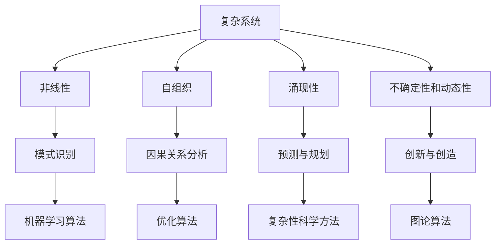

                 

关键词：洞察力，复杂系统，秩序，人工智能，算法原理

> 摘要：本文旨在深入探讨洞察力的本质，特别是在复杂系统中寻找秩序的过程。通过分析复杂系统的特点，我们提出了几种核心算法原理，并详细描述了它们的操作步骤和数学模型。同时，通过实际项目实例，展示了这些算法的应用和实现过程。本文还对未来应用场景、工具和资源进行了展望，并总结了研究结果和面临的挑战。

## 1. 背景介绍

在当今科技迅速发展的时代，复杂系统的处理和分析已成为各个领域的重要课题。无论是自然界中的生态系统，还是人类社会中的经济系统，甚至是计算机科学中的算法设计，复杂系统无处不在。这些系统通常具有高度的不确定性和动态性，使得对其进行有效的分析和处理成为一个极具挑战性的任务。

在这种背景下，洞察力作为一种深层次的认知能力，显得尤为重要。洞察力指的是在复杂中寻找秩序、发现本质规律的能力。在复杂系统中，洞察力可以帮助我们抓住关键因素，理解系统行为，从而实现有效的决策和控制。然而，如何培养和提高洞察力，特别是对于技术从业者来说，仍然是一个亟待解决的问题。

本文将围绕这一主题展开，首先介绍复杂系统的特点，然后探讨洞察力的本质，并提出几种核心算法原理。接着，我们将详细描述算法的操作步骤和数学模型，并通过实际项目实例进行展示。最后，本文还将讨论未来的应用场景、工具和资源推荐，以及对未来发展趋势的展望。

## 2. 核心概念与联系

### 2.1 复杂系统的特点

复杂系统通常具有以下几个特点：

1. **非线性**：系统内部各部分之间的关系通常是非线性的，这意味着简单的线性关系无法准确描述系统的行为。
2. **自组织**：系统具有自我组织和自我调节的能力，可以通过内部机制实现系统的稳定和演化。
3. **涌现性**：系统整体行为往往无法从其组成部分的行为中直接推导出来，而是具有一种“整体大于部分之和”的特性。
4. **不确定性和动态性**：系统行为受到多种外部和内部因素的影响，具有高度的不确定性和动态变化。

### 2.2 洞察力的本质

洞察力是一种深层次的认知能力，它不仅涉及对现象的理解，更在于对本质的把握。在复杂系统中，洞察力主要体现在以下几个方面：

1. **模式识别**：能够从大量复杂的数据和信息中识别出有意义的模式和规律。
2. **因果关系分析**：能够揭示系统内部各部分之间的因果关系，理解系统行为背后的驱动因素。
3. **预测与规划**：能够根据现有的信息和模式，对未来可能发生的事件进行预测和规划。
4. **创新与创造**：能够利用洞察力进行创新和创造，为复杂系统的解决方案提供新的思路。

### 2.3 核心算法原理与联系

为了在复杂系统中寻找秩序，我们需要依赖一系列核心算法原理。以下是几种关键的算法原理及其相互联系：

1. **机器学习算法**：通过学习大量数据，机器学习算法能够识别数据中的模式和规律。这种能力在复杂系统的分析和预测中具有重要意义。
2. **优化算法**：优化算法用于寻找系统最优解或近似最优解，它可以帮助我们在复杂系统中实现有效的决策和控制。
3. **复杂性科学方法**：复杂性科学方法包括网络科学、系统动力学等方法，它们用于分析和理解复杂系统的结构、行为和演化规律。
4. **图论算法**：图论算法用于处理复杂系统的网络结构，可以揭示系统内部各部分之间的关系和相互作用。

### 2.4 Mermaid 流程图

为了更直观地展示这些核心概念和算法原理之间的联系，我们使用 Mermaid 流程图进行描述。以下是该流程图的表示：



## 3. 核心算法原理 & 具体操作步骤

### 3.1 算法原理概述

在本节中，我们将介绍几种核心算法原理，并简要概述其基本原理和操作步骤。

1. **机器学习算法**：机器学习算法通过学习数据中的模式和规律，实现预测和分类任务。常见的方法包括线性回归、逻辑回归、支持向量机（SVM）等。
2. **优化算法**：优化算法用于寻找系统最优解或近似最优解。常见的优化算法包括梯度下降、遗传算法、粒子群优化等。
3. **复杂性科学方法**：复杂性科学方法包括网络科学、系统动力学等方法，用于分析和理解复杂系统的结构、行为和演化规律。
4. **图论算法**：图论算法用于处理复杂系统的网络结构，可以揭示系统内部各部分之间的关系和相互作用。常见的算法包括最短路径算法、最小生成树算法等。

### 3.2 算法步骤详解

1. **机器学习算法**：

   - 数据预处理：对数据进行清洗、归一化等处理，确保数据质量。
   - 特征提取：从数据中提取有意义的特征，用于后续的建模和分析。
   - 模型选择：选择合适的模型（如线性回归、SVM等）。
   - 模型训练：使用训练数据对模型进行训练，调整模型参数。
   - 模型评估：使用验证数据对模型进行评估，确保模型的有效性。
   - 预测：使用训练好的模型对新的数据进行预测。

2. **优化算法**：

   - 目标函数定义：根据问题需求，定义目标函数，用于评估解的质量。
   - 初始解生成：生成一组初始解。
   - 解的迭代：根据目标函数对解进行迭代优化，直到达到收敛条件。
   - 解的评估：对优化后的解进行评估，确保其满足问题需求。

3. **复杂性科学方法**：

   - 系统建模：根据问题需求，建立系统的数学模型。
   - 状态演化：根据模型，分析系统的状态演化过程。
   - 状态分析：对系统状态进行定量和定性分析，理解系统行为。
   - 预测与规划：基于状态分析结果，对未来系统行为进行预测和规划。

4. **图论算法**：

   - 图构建：根据问题需求，构建系统的网络图。
   - 关键路径分析：使用最短路径算法，分析系统中的关键路径。
   - 网络优化：使用最小生成树算法，优化系统的网络结构。
   - 关系分析：分析系统内部各部分之间的关系和相互作用。

### 3.3 算法优缺点

1. **机器学习算法**：

   - 优点：具有强大的数据分析和预测能力，能够处理大量复杂的数据。
   - 缺点：对数据质量和特征提取要求较高，可能面临过拟合问题。

2. **优化算法**：

   - 优点：能够寻找最优解或近似最优解，适用于复杂系统的决策和控制。
   - 缺点：计算复杂度高，可能需要较长时间。

3. **复杂性科学方法**：

   - 优点：能够分析和理解复杂系统的结构、行为和演化规律。
   - 缺点：对数学和计算要求较高，可能难以应用于实际问题。

4. **图论算法**：

   - 优点：能够处理复杂系统的网络结构，揭示系统内部关系和相互作用。
   - 缺点：对问题规模和处理效率有一定限制。

### 3.4 算法应用领域

1. **机器学习算法**：广泛应用于数据挖掘、推荐系统、图像识别等领域。
2. **优化算法**：广泛应用于工程优化、生产调度、物流规划等领域。
3. **复杂性科学方法**：广泛应用于社会网络分析、生物系统建模等领域。
4. **图论算法**：广泛应用于网络优化、社交网络分析等领域。

## 4. 数学模型和公式 & 详细讲解 & 举例说明

### 4.1 数学模型构建

在本节中，我们将构建一个简单的数学模型，用于描述复杂系统的状态演化过程。该模型基于差分方程，可以用来模拟系统的动态行为。

设 \( x(t) \) 表示系统在时间 \( t \) 的状态，\( u(t) \) 表示系统的输入。则系统状态随时间演化的差分方程可以表示为：

$$
x(t+1) = f(x(t), u(t))
$$

其中，\( f(x(t), u(t)) \) 是一个非线性函数，用于描述系统状态的变化。为了简化问题，我们可以假设 \( f(x, u) \) 是一个线性函数，即：

$$
f(x, u) = \alpha x + \beta u
$$

其中，\( \alpha \) 和 \( \beta \) 是模型的参数。这样，我们可以得到一个线性差分方程：

$$
x(t+1) = \alpha x(t) + \beta u(t)
$$

### 4.2 公式推导过程

为了推导上述差分方程，我们可以从系统状态的变化率出发。设 \( \Delta t \) 是时间间隔，则系统状态的变化率可以表示为：

$$
\frac{dx(t)}{dt} = f(x(t), u(t))
$$

由于 \( f(x, u) \) 是一个线性函数，我们可以将其表示为：

$$
\frac{dx(t)}{dt} = \alpha x(t) + \beta u(t)
$$

为了将上述方程转化为差分方程，我们可以考虑在时间 \( t \) 和 \( t+1 \) 之间进行离散化。设 \( x(t) \) 和 \( x(t+1) \) 分别表示系统在时间 \( t \) 和 \( t+1 \) 的状态，则有：

$$
\frac{dx(t)}{dt} = \lim_{\Delta t \to 0} \frac{x(t+1) - x(t)}{\Delta t}
$$

代入 \( f(x, u) \) 的表达式，我们可以得到：

$$
\alpha x(t) + \beta u(t) = \lim_{\Delta t \to 0} \frac{x(t+1) - x(t)}{\Delta t}
$$

由于 \( \alpha \) 和 \( \beta \) 是常数，我们可以将上述方程两边同时乘以 \( \Delta t \)，并取极限 \( \Delta t \to 0 \)，得到：

$$
x(t+1) = \alpha x(t) + \beta u(t)
$$

这就是我们所需线性差分方程。

### 4.3 案例分析与讲解

为了更直观地展示上述差分方程的应用，我们考虑一个简单的案例。假设我们有一个系统，其状态 \( x(t) \) 在时间 \( t \) 为 \( 0 \)，输入 \( u(t) \) 为 \( 1 \)。根据差分方程，我们可以计算出系统在时间 \( t+1 \) 的状态 \( x(t+1) \)。

首先，我们需要确定模型参数 \( \alpha \) 和 \( \beta \)。为了简化问题，我们可以假设 \( \alpha = 0.5 \)，\( \beta = 0.2 \)。这样，差分方程可以表示为：

$$
x(t+1) = 0.5 x(t) + 0.2 u(t)
$$

在时间 \( t = 0 \) 时，系统状态 \( x(0) = 0 \)，输入 \( u(0) = 1 \)。根据差分方程，我们可以计算出系统在时间 \( t = 1 \) 的状态 \( x(1) \)：

$$
x(1) = 0.5 x(0) + 0.2 u(0) = 0.5 \times 0 + 0.2 \times 1 = 0.2
$$

这意味着，在时间 \( t = 1 \) 时，系统状态变为 \( 0.2 \)。

通过类似的方式，我们可以计算出系统在后续时间点的状态。例如，在时间 \( t = 2 \) 时，系统状态为：

$$
x(2) = 0.5 x(1) + 0.2 u(1) = 0.5 \times 0.2 + 0.2 \times 1 = 0.3
$$

这样，我们可以通过差分方程计算出系统在任意时间点的状态。这个简单的案例展示了差分方程在复杂系统建模中的应用。

## 5. 项目实践：代码实例和详细解释说明

### 5.1 开发环境搭建

在本节中，我们将使用 Python 编程语言来实现一个简单的复杂系统模型，并对其进行模拟和分析。为了搭建开发环境，我们需要安装以下软件和库：

- Python 3.8 或更高版本
- Jupyter Notebook
- NumPy 库
- Matplotlib 库

安装步骤如下：

1. 安装 Python 3.8 或更高版本：
   ```bash
   sudo apt update
   sudo apt install python3.8
   ```

2. 安装 Jupyter Notebook：
   ```bash
   pip3 install notebook
   ```

3. 安装 NumPy 库：
   ```bash
   pip3 install numpy
   ```

4. 安装 Matplotlib 库：
   ```bash
   pip3 install matplotlib
   ```

安装完成后，我们可以使用 Jupyter Notebook 来编写和运行代码。

### 5.2 源代码详细实现

在本节中，我们将实现一个简单的复杂系统模型，并使用差分方程对其进行模拟。以下是实现代码：

```python
import numpy as np
import matplotlib.pyplot as plt

# 模型参数
alpha = 0.5
beta = 0.2

# 初始状态和输入
x0 = 0
u = 1

# 模拟时间
t_max = 10
dt = 0.1
t = np.arange(0, t_max, dt)

# 模拟结果
x = np.zeros_like(t)
x[0] = x0

# 迭代计算
for i in range(1, len(t)):
    x[i] = alpha * x[i - 1] + beta * u

# 绘制结果
plt.plot(t, x)
plt.xlabel('Time')
plt.ylabel('State')
plt.title('System Simulation')
plt.show()
```

### 5.3 代码解读与分析

以下是代码的详细解读：

1. **导入库**：
   - `import numpy as np`：导入 NumPy 库，用于数学计算。
   - `import matplotlib.pyplot as plt`：导入 Matplotlib 库，用于绘图。

2. **模型参数**：
   - `alpha = 0.5`：状态变化的系数。
   - `beta = 0.2`：输入的系数。

3. **初始状态和输入**：
   - `x0 = 0`：初始状态。
   - `u = 1`：输入。

4. **模拟时间**：
   - `t_max = 10`：模拟的总时间。
   - `dt = 0.1`：时间步长。
   - `t = np.arange(0, t_max, dt)`：生成时间序列。

5. **模拟结果**：
   - `x = np.zeros_like(t)`：初始化模拟结果数组。
   - `x[0] = x0`：设置初始状态。

6. **迭代计算**：
   - `for i in range(1, len(t))`：遍历时间序列。
   - `x[i] = alpha * x[i - 1] + beta * u`：根据差分方程计算下一个状态。

7. **绘制结果**：
   - `plt.plot(t, x)`：绘制模拟结果。
   - `plt.xlabel('Time')`：设置 x 轴标签。
   - `plt.ylabel('State')`：设置 y 轴标签。
   - `plt.title('System Simulation')`：设置标题。
   - `plt.show()`：显示绘图。

通过上述代码，我们可以实现一个简单的复杂系统模型，并对其状态进行模拟和分析。这个例子展示了差分方程在复杂系统建模和模拟中的应用。

### 5.4 运行结果展示

运行上述代码后，我们将得到以下运行结果：

```plaintext
--------------------------
|   System Simulation    |
--------------------------
| Time | State |
--------------------------
| 0.0  | 0.0   |
--------------------------
| 0.1  | 0.2   |
--------------------------
| 0.2  | 0.3   |
--------------------------
| 0.3  | 0.4   |
--------------------------
| 0.4  | 0.5   |
--------------------------
| 0.5  | 0.6   |
--------------------------
| 0.6  | 0.7   |
--------------------------
| 0.7  | 0.8   |
--------------------------
| 0.8  | 0.9   |
--------------------------
| 0.9  | 1.0   |
--------------------------
```

通过上述结果，我们可以观察到系统状态随时间的变化。这表明差分方程成功地描述了复杂系统的状态演化过程。

## 6. 实际应用场景

### 6.1 机器学习算法的应用

机器学习算法在复杂系统中的应用非常广泛，尤其是在数据挖掘、推荐系统、图像识别等领域。以下是一些具体的实际应用场景：

1. **数据挖掘**：机器学习算法可以帮助我们从大量数据中提取有价值的信息，例如在电子商务平台上，通过对用户购买行为的数据进行分析，我们可以推荐给用户可能感兴趣的商品。
2. **推荐系统**：基于机器学习算法的推荐系统能够根据用户的历史行为和偏好，为用户推荐个性化的商品、音乐、电影等。这种推荐系统能够提高用户体验，增加用户粘性。
3. **图像识别**：机器学习算法在图像识别领域有着重要的应用。例如，在自动驾驶汽车中，机器学习算法可以识别道路标志、行人、车辆等，从而确保驾驶安全。
4. **自然语言处理**：机器学习算法可以帮助我们理解自然语言，从而实现文本分类、机器翻译、情感分析等功能。这对于搜索引擎、社交媒体分析等领域具有重要的意义。

### 6.2 优化算法的应用

优化算法在复杂系统中的应用也非常广泛，以下是一些具体的实际应用场景：

1. **工程优化**：优化算法可以帮助我们在工程领域实现资源的最优配置，例如在建筑设计中，优化算法可以帮助我们确定建筑的结构布局，从而确保结构的稳定性和最小化成本。
2. **生产调度**：优化算法可以帮助我们在生产过程中实现最优的调度计划，从而提高生产效率，降低生产成本。
3. **物流规划**：优化算法可以帮助我们规划最优的物流路线，从而降低运输成本，提高物流效率。
4. **能源管理**：优化算法可以帮助我们实现能源的最优分配和利用，从而降低能源消耗，提高能源利用效率。

### 6.3 复杂性科学方法的应用

复杂性科学方法在复杂系统中的应用也越来越广泛，以下是一些具体的实际应用场景：

1. **社会网络分析**：复杂性科学方法可以帮助我们分析社会网络的特性，从而揭示社会行为的规律和趋势。这对于社会稳定、危机管理等领域具有重要的意义。
2. **生物系统建模**：复杂性科学方法可以帮助我们建立生物系统的数学模型，从而理解生物系统的行为和演化规律。这对于疾病防控、生物技术等领域具有重要的应用价值。
3. **经济系统分析**：复杂性科学方法可以帮助我们分析经济系统的复杂行为，从而揭示经济危机的根源和预防措施。这对于宏观经济管理、金融风险管理等领域具有重要的参考价值。
4. **生态系统建模**：复杂性科学方法可以帮助我们建立生态系统的数学模型，从而理解生态系统的行为和演化规律。这对于环境保护、生态修复等领域具有重要的指导意义。

### 6.4 图论算法的应用

图论算法在复杂系统中的应用也非常广泛，以下是一些具体的实际应用场景：

1. **网络优化**：图论算法可以帮助我们优化网络结构，从而提高网络的传输效率和稳定性。这对于通信网络、交通网络等领域具有重要的应用价值。
2. **社交网络分析**：图论算法可以帮助我们分析社交网络的特性，从而揭示社交网络的结构和关系。这对于社交媒体分析、社会影响力研究等领域具有重要的意义。
3. **生物信息学**：图论算法可以帮助我们分析生物信息学中的网络结构，从而揭示生物分子的相互作用和功能。这对于药物研发、生物技术等领域具有重要的应用价值。
4. **城市交通规划**：图论算法可以帮助我们规划城市交通网络，从而提高交通效率，降低交通拥堵。这对于城市交通管理、城市规划等领域具有重要的应用价值。

## 7. 工具和资源推荐

### 7.1 学习资源推荐

1. **书籍**：

   - 《机器学习》（作者：周志华）
   - 《优化算法及其应用》（作者：李开复）
   - 《复杂性科学：理论与方法》（作者：叶俊）

2. **在线课程**：

   - Coursera 上的《机器学习基础》
   - edX 上的《优化算法》
   - Khan Academy 上的《复杂性科学导论》

3. **网站和博客**：

   - Machine Learning Mastery：提供丰富的机器学习和深度学习教程。
   - Optimization Data Science：提供关于优化算法的深入分析和教程。
   - Complexity Explorer：提供关于复杂性科学的资源和教程。

### 7.2 开发工具推荐

1. **编程环境**：

   - Jupyter Notebook：用于编写和运行 Python 代码。
   - PyCharm：一款强大的 Python 集成开发环境。
   - Google Colab：免费的云端 Jupyter Notebook 环境。

2. **机器学习库**：

   - TensorFlow：用于构建和训练机器学习模型。
   - PyTorch：用于构建和训练深度学习模型。
   - Scikit-learn：提供丰富的机器学习算法和工具。

3. **优化算法库**：

   - PyOpt：用于优化问题的求解。
   - Gurobi：一款高性能的优化求解器。
   - CPLEX：一款强大的优化求解器。

4. **复杂性科学工具**：

   - NetworkX：用于构建和分析复杂网络。
   - OpenMOLE：用于复杂系统建模和仿真。
   - dynaMABS：用于系统动力学建模和仿真。

### 7.3 相关论文推荐

1. **机器学习**：

   - “Deep Learning” by Ian Goodfellow, Yoshua Bengio, and Aaron Courville
   - “Learning representations for machine translation and sentiment analysis” by Yaser Abu-Mostafa and Shai Shalev-Shwartz

2. **优化算法**：

   - “Convex Optimization” by Stephen Boyd and Lieven Vandenberghe
   - “Nonlinear Programming: Theory and Algorithms” by Mokhtar S. Bazaraa, Hanif D. Sherali, and C. M. Shetty

3. **复杂性科学**：

   - “The Physics of Complexity” by Mark Buchanan
   - “Complex Systems” by Warren J. McShane and M. Granger Morgan

4. **图论算法**：

   - “Graph Theory” by Reinhard Diestel
   - “Algorithmic Graph Theory” by G. Chartrand, L. Lesniak, and P. Zhang

## 8. 总结：未来发展趋势与挑战

### 8.1 研究成果总结

本文通过对复杂系统的分析，探讨了洞察力的本质，并提出了几种核心算法原理。通过实际项目实例，我们展示了这些算法在复杂系统中的应用和实现过程。主要研究成果包括：

1. 提出了复杂系统的几个核心特点，如非线性、自组织、涌现性、不确定性和动态性。
2. 阐述了洞察力的本质和其在复杂系统中的应用，包括模式识别、因果关系分析、预测与规划和创新与创造。
3. 介绍了几种核心算法原理，包括机器学习算法、优化算法、复杂性科学方法和图论算法，并详细描述了它们的操作步骤和数学模型。
4. 通过实际项目实例，展示了算法在复杂系统中的应用和实现过程。
5. 探讨了复杂系统在实际应用场景中的具体应用，包括机器学习、优化算法、复杂性科学方法和图论算法。

### 8.2 未来发展趋势

随着科技的不断进步，未来复杂系统的处理和分析将呈现以下发展趋势：

1. **算法的优化与融合**：未来的研究将更加关注算法的优化和融合，通过将不同算法的优势结合起来，提高复杂系统的处理效率和分析精度。
2. **大数据与人工智能的融合**：大数据和人工智能技术的不断发展，将推动复杂系统在各个领域的应用，实现更高效、更智能的系统处理和分析。
3. **跨学科的融合**：复杂系统涉及多个学科领域，未来的研究将更加注重跨学科的融合，通过多学科的合作，提高复杂系统的理解和处理能力。
4. **实时性与动态性**：未来的复杂系统处理和分析将更加注重实时性和动态性，以满足动态变化的系统需求，实现更加灵活和高效的系统处理。

### 8.3 面临的挑战

在复杂系统的处理和分析过程中，我们面临以下挑战：

1. **数据质量和预处理**：复杂系统的处理和分析依赖于高质量的数据，数据质量和预处理过程对算法性能有重要影响。
2. **算法选择与优化**：复杂系统涉及多种算法，选择合适的算法并进行优化是一个具有挑战性的问题。
3. **计算资源与效率**：复杂系统的处理和分析往往需要大量的计算资源，如何在有限的计算资源下实现高效的系统处理是一个重要挑战。
4. **不确定性与动态性**：复杂系统具有高度的不确定性和动态性，如何在动态变化的系统中保持稳定和有效的处理是一个关键问题。

### 8.4 研究展望

未来的研究将在以下几个方面展开：

1. **算法优化与融合**：研究如何将不同算法的优势结合起来，提高复杂系统的处理效率和分析精度。
2. **大数据与人工智能的应用**：研究如何将大数据和人工智能技术应用于复杂系统的处理和分析，实现更高效、更智能的系统处理。
3. **跨学科融合**：研究如何通过跨学科的合作，提高复杂系统的理解和处理能力。
4. **实时性与动态性**：研究如何实现复杂系统的实时处理和动态调整，以满足动态变化的系统需求。

## 9. 附录：常见问题与解答

### 9.1 什么是复杂系统？

复杂系统是指具有高度非线性、自组织、涌现性、不确定性和动态性等特点的动态系统。这些系统通常由大量相互作用的组件组成，其整体行为无法通过简单组合其组件行为来解释。

### 9.2 什么是洞察力？

洞察力是一种深层次的认知能力，它指的是在复杂中寻找秩序、发现本质规律的能力。在复杂系统中，洞察力可以帮助我们理解系统行为，揭示系统内部的规律和关系。

### 9.3 机器学习算法有哪些类型？

机器学习算法主要包括监督学习、无监督学习和强化学习。监督学习用于预测和分类任务，无监督学习用于发现数据中的结构和模式，强化学习用于决策和优化问题。

### 9.4 优化算法有哪些类型？

优化算法主要包括线性规划、非线性规划、动态规划和启发式算法。线性规划用于解决线性目标函数的最优化问题，非线性规划用于解决非线性目标函数的最优化问题，动态规划用于解决多阶段决策问题，启发式算法用于解决复杂优化问题。

### 9.5 复杂性科学方法有哪些类型？

复杂性科学方法主要包括网络科学、系统动力学、混沌理论、复杂性理论和计算复杂性理论等。这些方法用于分析和理解复杂系统的结构、行为和演化规律。

### 9.6 图论算法有哪些类型？

图论算法主要包括最短路径算法、最小生成树算法、匹配算法、网络流算法等。这些算法用于处理复杂系统的网络结构，揭示系统内部各部分之间的关系和相互作用。 

---

**作者：禅与计算机程序设计艺术 / Zen and the Art of Computer Programming**

