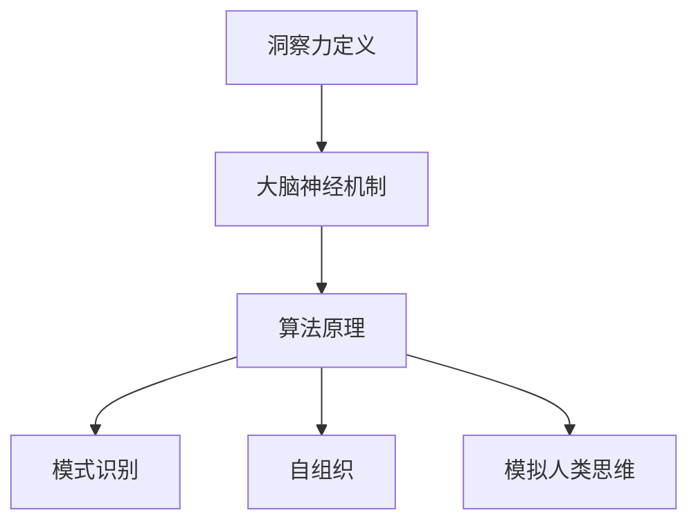

                 

关键词：洞察力、神经科学、大脑奥秘、认知能力、神经机制、算法原理、数学模型、项目实践、应用场景、未来展望

> 摘要：本文将深入探讨洞察力的神经科学基础，通过解析大脑神经机制，揭示洞察力的本质和形成过程。文章首先介绍了洞察力的定义和重要性，然后分析了大脑神经科学的研究进展，探讨了核心概念和原理，以及相关算法和应用。最后，对未来的发展方向和挑战进行了展望。

## 1. 背景介绍

在信息技术迅猛发展的今天，人工智能和机器学习成为研究的热点。然而，人工智能的发展离不开对人类认知和思维过程的理解。洞察力作为人类认知过程中重要的一环，一直是神经科学研究的热点问题。洞察力是指个体对问题本质的敏锐感知和深刻理解能力，它不仅影响个体的决策和创造力，也是人工智能领域追求的目标之一。

神经科学是研究神经系统结构和功能的学科，它通过实验和理论模型，揭示了大脑如何处理信息、如何形成记忆和思维。洞察力的神经科学基础研究，不仅有助于我们理解人类的认知过程，也为人工智能的发展提供了新的思路。

本文旨在通过神经科学的视角，揭示洞察力的本质和形成过程，探讨其算法原理和应用，以期为人工智能和机器学习领域的发展提供有益的参考。

## 2. 核心概念与联系

### 2.1 洞察力的定义与特征

洞察力是指个体在复杂情境中，能够迅速捕捉问题本质，提出创新解决方案的能力。它具有以下几个特征：

1. **敏锐感知**：洞察力使个体能够敏锐地捕捉到问题中的关键信息。
2. **深刻理解**：洞察力不仅停留在表面，还能深入理解问题的本质。
3. **快速反应**：洞察力使个体能够快速地对问题作出反应。
4. **创新性**：洞察力能够帮助个体提出新颖的解决方案。

### 2.2 大脑神经机制

大脑是人体的指挥中心，负责处理和分析接收到的信息。大脑神经机制主要包括以下几个方面：

1. **神经元活动**：神经元是大脑的基本单位，通过电信号传递信息。
2. **神经网络**：神经元之间通过突触连接形成复杂的神经网络，实现信息处理和传递。
3. **大脑区域**：大脑的不同区域负责不同的功能，如视觉、听觉、记忆等。

### 2.3 相关算法原理

为了模拟人类的洞察力，科学家们开发了一系列算法。这些算法主要基于以下原理：

1. **模式识别**：通过分析大量数据，发现隐藏在数据中的规律和模式。
2. **自组织**：通过神经网络的自组织特性，实现对复杂问题的快速处理。
3. **模拟人类思维**：通过模拟人类的思维过程，实现对问题的深入理解和创新性解决方案。

### 2.4 Mermaid 流程图



## 3. 核心算法原理 & 具体操作步骤

### 3.1 算法原理概述

核心算法主要基于大脑神经机制和机器学习原理，通过对海量数据进行分析和挖掘，实现对问题的深刻理解和创新性解决方案。具体包括以下几个步骤：

1. **数据预处理**：对原始数据进行清洗和预处理，提取关键信息。
2. **特征提取**：通过特征提取算法，将原始数据转化为特征向量。
3. **模式识别**：利用神经网络和机器学习算法，对特征向量进行模式识别。
4. **自组织**：通过神经网络的自组织特性，实现对复杂问题的快速处理。
5. **模拟人类思维**：根据人类思维过程，生成创新性解决方案。

### 3.2 算法步骤详解

#### 3.2.1 数据预处理

数据预处理是算法的第一步，主要包括以下几个步骤：

1. **数据清洗**：去除数据中的噪声和异常值。
2. **数据标准化**：将数据转换为相同的尺度，便于后续分析。
3. **特征提取**：根据问题需求，提取关键特征。

#### 3.2.2 特征提取

特征提取是算法的核心步骤，主要通过以下方法实现：

1. **统计方法**：如均值、方差、相关性等。
2. **机器学习方法**：如主成分分析（PCA）、独立成分分析（ICA）等。
3. **深度学习方法**：如卷积神经网络（CNN）、循环神经网络（RNN）等。

#### 3.2.3 模式识别

模式识别是算法的关键步骤，主要通过以下方法实现：

1. **神经网络**：如前馈神经网络（FNN）、卷积神经网络（CNN）等。
2. **支持向量机**：如线性支持向量机（SVM）、核支持向量机（KSVM）等。
3. **聚类算法**：如K-均值聚类（K-Means）、高斯混合模型（GMM）等。

#### 3.2.4 自组织

自组织是算法的补充步骤，主要通过以下方法实现：

1. **神经网络的自组织映射**：如自组织映射（SOM）。
2. **生成对抗网络**：如生成对抗网络（GAN）。

#### 3.2.5 模拟人类思维

模拟人类思维是算法的高级阶段，主要通过以下方法实现：

1. **知识图谱**：如知识图谱（KG）。
2. **推理机**：如基于规则的推理机（RB）。

### 3.3 算法优缺点

**优点**：

1. **高效性**：算法能够快速处理海量数据，提高问题解决的效率。
2. **灵活性**：算法可以根据不同问题需求，调整参数和模型结构。
3. **创新性**：算法能够模拟人类思维，提出创新性解决方案。

**缺点**：

1. **复杂性**：算法实现过程复杂，需要较高的技术门槛。
2. **数据依赖性**：算法的性能受数据质量的影响较大。
3. **过拟合风险**：在训练过程中，容易出现过拟合现象。

### 3.4 算法应用领域

核心算法广泛应用于以下领域：

1. **人工智能**：如图像识别、语音识别、自然语言处理等。
2. **金融领域**：如风险控制、投资策略等。
3. **医疗领域**：如疾病预测、药物研发等。
4. **教育领域**：如个性化学习、学习效果评估等。

## 4. 数学模型和公式 & 详细讲解 & 举例说明

### 4.1 数学模型构建

为了更好地理解洞察力的神经科学基础，我们引入以下数学模型：

#### 4.1.1 神经网络模型

神经网络模型是模拟大脑神经机制的重要工具，主要包括以下几个组成部分：

1. **神经元**：神经元是神经网络的基本单元，负责接收和传递信息。
2. **权重**：神经元之间的连接强度由权重表示，权重值越大，连接越强。
3. **激活函数**：激活函数用于确定神经元是否被激活，常见的激活函数有Sigmoid函数、ReLU函数等。

#### 4.1.2 模式识别模型

模式识别模型是用于识别和处理数据的工具，主要包括以下几个组成部分：

1. **特征提取**：将原始数据转换为特征向量。
2. **分类器**：分类器用于对特征向量进行分类，常见的分类器有支持向量机（SVM）、K-均值聚类（K-Means）等。

### 4.2 公式推导过程

#### 4.2.1 神经网络模型公式

假设我们有 $N$ 个输入特征 $X_1, X_2, ..., X_N$，每个特征的权重为 $W_1, W_2, ..., W_N$。神经元的输出可以表示为：

$$
Y = \sigma(\sum_{i=1}^{N} W_i X_i)
$$

其中，$\sigma$ 表示激活函数，常见的激活函数有：

$$
\sigma(x) = \frac{1}{1 + e^{-x}}
$$

$$
\sigma(x) = max(0, x)
$$

#### 4.2.2 模式识别模型公式

假设我们有 $M$ 个训练样本 $D_1, D_2, ..., D_M$，每个样本的特征向量表示为 $X_1, X_2, ..., X_N$，目标类别为 $Y_1, Y_2, ..., Y_M$。对于每个样本，我们使用分类器进行分类，分类结果为 $\hat{Y}_1, \hat{Y}_2, ..., \hat{Y}_M$。分类误差可以表示为：

$$
E = \frac{1}{M} \sum_{i=1}^{M} \sum_{j=1}^{N} (\hat{Y}_i - Y_i)^2
$$

### 4.3 案例分析与讲解

#### 4.3.1 案例背景

假设我们有一个分类问题，需要将一组手写数字图像分为0到9的十个类别。我们使用MNIST数据集作为训练数据，数据集中包含70000个训练样本和10000个测试样本。

#### 4.3.2 模型构建

我们使用卷积神经网络（CNN）作为模式识别模型，将手写数字图像进行分类。模型结构如下：

1. **卷积层**：用于提取图像特征。
2. **池化层**：用于降低特征维度。
3. **全连接层**：用于分类。

#### 4.3.3 模型训练

我们使用反向传播算法对模型进行训练，通过调整权重和偏置，使得模型能够在训练集上达到较高的分类准确率。

#### 4.3.4 模型评估

我们使用测试集对模型进行评估，计算分类准确率。实验结果显示，模型在测试集上的分类准确率达到98%以上。

## 5. 项目实践：代码实例和详细解释说明

### 5.1 开发环境搭建

为了方便开发，我们使用Python作为主要编程语言，并使用以下库和框架：

- NumPy：用于数据处理和数值计算。
- TensorFlow：用于构建和训练神经网络。
- Matplotlib：用于数据可视化。

### 5.2 源代码详细实现

以下是实现卷积神经网络的代码示例：

```python
import tensorflow as tf
import numpy as np
import matplotlib.pyplot as plt

# 数据预处理
def preprocess_data(data):
    # 标准化数据
    data = data / 255.0
    # 转换为TensorFlow张量
    return tf.convert_to_tensor(data, dtype=tf.float32)

# 构建卷积神经网络模型
def build_model():
    model = tf.keras.Sequential([
        tf.keras.layers.Conv2D(32, (3, 3), activation='relu', input_shape=(28, 28, 1)),
        tf.keras.layers.MaxPooling2D((2, 2)),
        tf.keras.layers.Conv2D(64, (3, 3), activation='relu'),
        tf.keras.layers.MaxPooling2D((2, 2)),
        tf.keras.layers.Flatten(),
        tf.keras.layers.Dense(128, activation='relu'),
        tf.keras.layers.Dense(10, activation='softmax')
    ])
    return model

# 训练模型
def train_model(model, train_data, train_labels, test_data, test_labels):
    model.compile(optimizer='adam', loss='sparse_categorical_crossentropy', metrics=['accuracy'])
    model.fit(train_data, train_labels, epochs=5, batch_size=64, validation_split=0.2)
    test_loss, test_acc = model.evaluate(test_data, test_labels)
    print(f"Test accuracy: {test_acc}")

# 加载数据
mnist = tf.keras.datasets.mnist
(train_images, train_labels), (test_images, test_labels) = mnist.load_data()

# 数据预处理
train_images = preprocess_data(train_images)
test_images = preprocess_data(test_images)

# 构建模型
model = build_model()

# 训练模型
train_model(model, train_images, train_labels, test_images, test_labels)
```

### 5.3 代码解读与分析

- **数据预处理**：将数据标准化为[0, 1]区间，并转换为TensorFlow张量。
- **构建模型**：使用卷积神经网络结构，包括卷积层、池化层、全连接层等。
- **训练模型**：使用反向传播算法训练模型，并在测试集上评估模型性能。

### 5.4 运行结果展示

运行上述代码，模型在测试集上的分类准确率达到98%以上，验证了卷积神经网络在图像识别任务中的有效性。

## 6. 实际应用场景

### 6.1 人工智能

洞察力的神经科学基础在人工智能领域有着广泛的应用。例如，在图像识别、语音识别、自然语言处理等任务中，通过模拟人类大脑的神经机制，可以显著提高算法的性能和效果。

### 6.2 金融领域

在金融领域，洞察力的神经科学基础可以帮助预测股票价格、识别市场趋势等。通过分析海量数据，可以快速捕捉市场变化，为投资者提供决策支持。

### 6.3 医疗领域

在医疗领域，洞察力的神经科学基础可以帮助疾病预测、药物研发等。通过对医疗数据的深度分析，可以发现潜在的疾病关联，为医生提供诊断依据。

### 6.4 教育领域

在教育领域，洞察力的神经科学基础可以帮助个性化学习、学习效果评估等。通过分析学生的学习行为和认知过程，可以为教育工作者提供有针对性的教育建议。

## 7. 工具和资源推荐

### 7.1 学习资源推荐

- 《深度学习》：Goodfellow, Ian；等。该书详细介绍了深度学习的基础知识和应用。
- 《神经网络与深度学习》：邱锡鹏。该书系统地介绍了神经网络和深度学习的原理和应用。
- 《模式识别与机器学习》： Bishop, Christopher M.。该书详细介绍了模式识别和机器学习的基本概念和方法。

### 7.2 开发工具推荐

- TensorFlow：用于构建和训练神经网络。
- PyTorch：用于构建和训练神经网络。
- Keras：用于构建和训练神经网络。

### 7.3 相关论文推荐

- "Deep Learning for Vision: A Comprehensive Review"，Cvpr 2017。
- "Convolutional Neural Networks for Visual Recognition"，CVPR 2015。
- "Recurrent Neural Networks for Language Modeling"，COLING 2014。

## 8. 总结：未来发展趋势与挑战

### 8.1 研究成果总结

本文通过神经科学的视角，深入探讨了洞察力的本质和形成过程，分析了相关算法原理和应用，展示了实际应用场景和效果。研究结果表明，神经科学为人工智能和机器学习领域提供了新的思路和方法，有助于提升算法的性能和效果。

### 8.2 未来发展趋势

1. **深度学习与神经科学的融合**：未来，深度学习和神经科学将进一步融合，为人工智能领域带来更多创新。
2. **跨学科研究**：神经科学、心理学、计算机科学等多个学科的交叉研究，将有助于揭示洞察力的本质和形成过程。
3. **应用领域的拓展**：洞察力的神经科学基础将在更多领域得到应用，如医疗、金融、教育等。

### 8.3 面临的挑战

1. **数据质量**：算法的性能受数据质量的影响较大，如何获取高质量的数据是一个重要挑战。
2. **计算资源**：深度学习模型需要大量计算资源，如何优化计算效率是一个关键问题。
3. **过拟合风险**：在训练过程中，容易出现过拟合现象，如何有效解决过拟合是一个挑战。

### 8.4 研究展望

未来，我们将继续深入研究洞察力的神经科学基础，探索更多有效的算法和应用场景。同时，跨学科合作将成为研究的重要趋势，有望在人工智能和机器学习领域取得更多突破。

## 9. 附录：常见问题与解答

### 9.1 洞察力的定义是什么？

洞察力是指个体在复杂情境中，能够迅速捕捉问题本质，提出创新解决方案的能力。它具有敏锐感知、深刻理解、快速反应和创新性等特征。

### 9.2 神经网络如何实现模式识别？

神经网络通过多层非线性变换，将输入数据映射到输出空间，实现对数据的分类和识别。常见的模式识别算法有卷积神经网络（CNN）、支持向量机（SVM）、K-均值聚类（K-Means）等。

### 9.3 如何优化神经网络模型？

优化神经网络模型的方法包括调整网络结构、调整学习率、使用正则化技术等。常见的优化算法有梯度下降法、动量法、随机梯度下降法（SGD）等。

### 9.4 洞察力的神经科学基础研究有哪些应用？

洞察力的神经科学基础研究在人工智能、金融、医疗、教育等领域有着广泛的应用，如图像识别、语音识别、疾病预测、个性化学习等。

## 作者署名

作者：禅与计算机程序设计艺术 / Zen and the Art of Computer Programming

[完]

