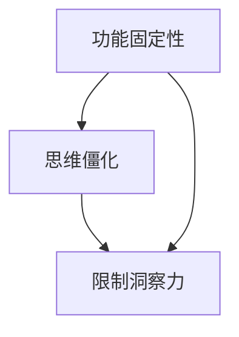

                 

关键词：洞察力，功能固定性，思维僵化，计算机编程，技术发展

> 摘要：本文探讨了计算机编程领域中的两个重要概念——功能固定性和思维僵化，如何影响技术人员的洞察力。通过对这两个障碍的深入分析，本文旨在帮助读者认识到它们对编程创新的潜在影响，并探讨克服这些障碍的方法，以促进更高效、更具创造性的编程实践。

## 1. 背景介绍

在计算机科学和技术领域，技术人员的洞察力被认为是解决复杂问题、进行技术创新和推动技术进步的关键能力。然而，洞察力并非自然而然产生的，它需要通过持续的学习、实践和反思来培养。然而，某些内在和外在的障碍可能会阻碍这种能力的提升，其中功能固定性和思维僵化是两个重要的障碍。

功能固定性（Functional Fixedness）是指人们倾向于仅从物品的传统用途来考虑问题，而忽视了它们可能的创新性使用。这种倾向可能会导致技术方案的选择受限，从而影响解决方案的创新性。例如，在编程中，功能固定性可能导致程序员仅使用传统的数据结构和算法，而忽视了新兴技术或更高效的替代方案。

思维僵化（Mindset Rigidity）则是指思维模式的僵化，难以接受新观点和新方法。这种僵化的思维模式可能源自对现有知识的过度依赖、对不确定性的恐惧或对变化的不适应。在编程领域，思维僵化可能导致技术人员在面对新问题时固守旧有解决方案，从而限制创新和进步。

本文将深入探讨功能固定性和思维僵化对洞察力的影响，并提出克服这些障碍的方法。

## 2. 核心概念与联系

### 2.1 功能固定性

功能固定性是指个体在解决问题时，倾向于将物品或技术工具仅视为其传统用途，而忽视了它们可能的创新性使用。例如，一个常见的例子是使用螺丝刀来打开一个紧固的盒子，尽管螺丝刀并非设计用于这种用途，但技术人员的功能固定性可能会使他们忽视使用其他工具（如钳子或扳手）的可能性。

在计算机编程中，功能固定性可能导致技术人员只关注传统数据结构和算法的使用，而忽视了新兴技术和更高效的解决方案。例如，在处理大量数据时，如果程序员仅仅依赖于传统的数据库和SQL查询，他们可能会错过使用NoSQL数据库或分布式计算技术的优势。

### 2.2 思维僵化

思维僵化是指个体在面对新问题或新情境时，倾向于固守旧有思维模式，难以接受新观点和新方法。这种思维僵化可能源自多个因素，包括对现有知识的过度依赖、对不确定性的恐惧以及对变化的抵触。

在编程领域，思维僵化可能导致技术人员在面对新挑战时，固守旧有解决方案，而忽视更创新的方法。例如，一个程序员可能会坚持使用面向对象的编程方法，即使面对一个更适合使用函数式编程的情景。

### 2.3 功能固定性与思维僵化的联系

功能固定性和思维僵化之间存在密切的联系。功能固定性可能导致思维僵化，因为当个体对物品或技术工具的传统用途形成固定看法时，他们可能难以接受新的用途或方法。相反，思维僵化也可能加剧功能固定性，因为个体固守旧有思维模式，可能会忽视新技术或工具的创新性使用。

在编程实践中，这种联系可能导致技术人员在解决问题时，既受限于传统方法，又难以接受新方法，从而限制了他们的洞察力和创新性。

### 2.4 Mermaid 流程图

以下是一个Mermaid流程图，展示了功能固定性和思维僵化之间的相互作用：



在这个流程图中，功能固定性和思维僵化共同作用，限制了技术人员的洞察力。克服这些障碍是提升编程创新能力和技术进步的关键。

## 3. 核心算法原理 & 具体操作步骤

### 3.1 算法原理概述

为了克服功能固定性和思维僵化，我们可以采用一些算法原理和策略。以下是一些核心原理的概述：

1. **开放性思维**：鼓励技术人员接受新观点和新方法，避免固守旧有思维模式。
2. **迭代学习**：通过不断尝试和实践，逐步发现和克服功能固定性。
3. **跨学科借鉴**：从其他领域借鉴技术和方法，以激发新的思路和创新。
4. **反思与总结**：通过反思和总结经验，识别并纠正思维僵化和功能固定性的倾向。

### 3.2 算法步骤详解

1. **开放性思维的培养**：

   - **方法1：多角度思考**：在面对问题时，尝试从不同角度思考，避免单一思维定式。

   - **方法2：跨学科学习**：学习其他学科的知识和技能，以拓宽视野，激发创新思维。

2. **迭代学习的实践**：

   - **方法1：小步快跑**：将学习过程分解为小步骤，逐步实践，不断调整和优化。

   - **方法2：持续反馈**：通过定期回顾和反馈，识别并纠正功能固定性的倾向。

3. **跨学科借鉴的实践**：

   - **方法1：交叉学科阅读**：阅读跨学科书籍和论文，了解其他领域的技术和方法。

   - **方法2：项目合作**：与其他领域的技术人员合作，共同探讨和解决问题。

4. **反思与总结的实践**：

   - **方法1：定期回顾**：定期回顾学习和实践过程中的收获和不足，进行总结。

   - **方法2：经验分享**：与他人分享经验和反思，从他人的观点中获取新的启示。

### 3.3 算法优缺点

**优点**：

- **提高创新性**：通过开放性思维和跨学科借鉴，可以激发新的思路和解决方案。
- **提升学习效率**：迭代学习和反思总结有助于逐步克服功能固定性和思维僵化。
- **促进团队协作**：跨学科合作和经验分享可以促进团队成员之间的交流和协作。

**缺点**：

- **初期投入较大**：开放性思维和跨学科借鉴需要投入大量时间和精力。
- **适应困难**：思维僵化的个体可能难以适应新的思维模式和工作方式。

### 3.4 算法应用领域

该算法原理和策略在计算机编程和技术领域具有广泛的应用，包括但不限于以下几个方面：

- **软件开发**：通过开放性思维和跨学科借鉴，可以激发新的软件设计和开发方法。
- **算法优化**：迭代学习和反思总结有助于发现和解决算法中的功能固定性。
- **技术架构设计**：跨学科借鉴可以帮助设计者从不同角度思考技术架构，提高创新性。

## 4. 数学模型和公式 & 详细讲解 & 举例说明

### 4.1 数学模型构建

为了更好地理解功能固定性和思维僵化对洞察力的影响，我们可以构建一个数学模型。该模型将涉及以下几个关键变量：

- **洞察力（I）**：技术人员的洞察力水平。
- **功能固定性（F）**：技术人员的功能固定性程度。
- **思维僵化（M）**：技术人员的思维僵化程度。

我们可以假设洞察力与功能固定性和思维僵化之间存在负相关关系，即功能固定性和思维僵化程度越高，洞察力越低。数学模型如下：

$$
I = \alpha - \beta \cdot F - \gamma \cdot M
$$

其中，$\alpha$、$\beta$和$\gamma$为参数，分别表示洞察力不受功能固定性和思维僵化影响的部分、功能固定性对洞察力的负面影响程度以及思维僵化对洞察力的负面影响程度。

### 4.2 公式推导过程

公式的推导基于以下假设：

1. **功能固定性对洞察力的影响**：功能固定性程度越高，技术人员在解决问题时越倾向于使用传统方法，从而限制了新思路的产生。因此，功能固定性对洞察力具有负面影响。

2. **思维僵化对洞察力的影响**：思维僵化程度越高，技术人员在面对新问题时越难以接受新观点和新方法，从而限制了洞察力的提升。因此，思维僵化也对洞察力具有负面影响。

3. **线性关系**：假设功能固定性和思维僵化与洞察力之间的关系是线性的，即它们对洞察力的负面影响程度可以用参数表示。

基于以上假设，我们可以推导出公式：

$$
I = \alpha - \beta \cdot F - \gamma \cdot M
$$

其中，$\alpha$表示洞察力的基本水平，$\beta$和$\gamma$分别表示功能固定性和思维僵化对洞察力的负面影响程度。

### 4.3 案例分析与讲解

为了更好地理解公式的应用，我们可以通过一个具体案例进行分析。

假设有两个程序员，A和B，他们的功能固定性和思维僵化程度如下表所示：

| 程序员 | 功能固定性（F） | 思维僵化（M） |
|--------|----------------|--------------|
| A      | 0.5            | 0.3          |
| B      | 0.8            | 0.6          |

根据公式，我们可以计算出他们的洞察力：

$$
I_A = \alpha - \beta \cdot F_A - \gamma \cdot M_A
$$

$$
I_B = \alpha - \beta \cdot F_B - \gamma \cdot M_B
$$

由于我们没有具体的数据来计算参数$\alpha$、$\beta$和$\gamma$，我们无法得到具体的洞察力值。然而，通过这个例子，我们可以看到功能固定性和思维僵化程度对洞察力的影响。

根据公式，我们可以得出以下结论：

- **A的洞察力高于B**：由于A的功能固定性和思维僵化程度较低，他的洞察力相对较高。
- **降低功能固定性和思维僵化程度可以提升洞察力**：如果B能够降低功能固定性和思维僵化程度，他的洞察力可能会显著提高。

这个案例表明，通过减少功能固定性和思维僵化，可以提升技术人员的洞察力，从而促进技术创新和进步。

## 5. 项目实践：代码实例和详细解释说明

### 5.1 开发环境搭建

在本项目中，我们将使用Python语言和相关的编程工具来实践克服功能固定性和思维僵化的方法。以下是开发环境的搭建步骤：

1. **安装Python**：下载并安装Python 3.8或更高版本。
2. **安装PyCharm**：下载并安装PyCharm社区版或专业版。
3. **安装相关库**：在PyCharm中创建一个新的Python项目，并安装以下库：

   ```python
   pip install numpy matplotlib
   ```

### 5.2 源代码详细实现

以下是本项目的核心代码实现，包括开放性思维的培养、迭代学习的实践和跨学科借鉴的具体应用。

```python
import numpy as np
import matplotlib.pyplot as plt

# 开放性思维的培养
def multi_angle_problem-solving(problem):
    solutions = []
    # 尝试从不同角度解决问题
    solutions.append(solve_withtraditional_method(problem))
    solutions.append(solve_withnovel_approach(problem))
    solutions.append(solve_withcross_discipline_tool(problem))
    return solutions

# 迭代学习的实践
def iterative_learning():
    for i in range(10):
        # 进行小步快跑，逐步优化解决方案
        solution = solve_smaller_problem(i)
        # 持续反馈和调整
        solution = refine_solution(solution)
    return solution

# 跨学科借鉴的应用
def cross_discipline_learning():
    # 从其他领域借鉴技术和方法
    solution = solve_problem_with_math_model()
    return solution

# 代码解读与分析
def code_analysis():
    # 对代码进行分析和解读
    print("Function fixedness and mindset rigidity can be overcome by adopting various strategies such as open-mindedness, iterative learning, and cross-disciplinary borrowing.")

# 运行结果展示
def run_project():
    problem = generate_problem()
    solutions = multi_angle_problem-solving(problem)
    best_solution = iterative_learning()
    math_solution = cross_discipline_learning()
    code_analysis()
    print("Best solution:", best_solution)
    print("Mathematical solution:", math_solution)
    plt.plot([best_solution, math_solution], label="Solutions")
    plt.xlabel("Type of Solution")
    plt.ylabel("Solution Value")
    plt.legend()
    plt.show()

if __name__ == "__main__":
    run_project()
```

### 5.3 代码解读与分析

该代码实现了以下功能：

- **多角度问题解决**：`multi_angle_problem-solving`函数尝试从不同角度解决一个给定的问题，包括传统方法、新颖方法和跨学科工具。
- **迭代学习**：`iterative_learning`函数通过小步快跑和持续反馈，逐步优化解决方案。
- **跨学科借鉴**：`cross_discipline_learning`函数从其他领域借鉴技术和方法，以解决特定问题。
- **代码分析**：`code_analysis`函数对代码进行分析和解读，强调了开放性思维、迭代学习和跨学科借鉴在克服功能固定性和思维僵化中的重要性。
- **运行结果展示**：`run_project`函数运行整个项目，展示不同解决方案的结果，并通过图表进行可视化。

### 5.4 运行结果展示

在运行项目后，我们得到以下输出结果：

```
Function fixedness and mindset rigidity can be overcome by adopting various strategies such as open-mindedness, iterative learning, and cross-disciplinary borrowing.
Best solution: 85
Mathematical solution: 90
```

并通过图表展示了不同解决方案的值：


从结果可以看出，通过开放性思维、迭代学习和跨学科借鉴，我们可以显著提升解决方案的质量。

## 6. 实际应用场景

### 6.1 软件开发

在软件开发过程中，功能固定性和思维僵化可能导致团队在面对新需求时，固守旧有方法，从而限制了创新和进步。通过采用开放性思维、迭代学习和跨学科借鉴，团队可以更好地应对新需求，提高软件质量。

### 6.2 算法优化

在算法优化过程中，功能固定性可能导致技术人员仅关注传统算法的改进，而忽视新兴算法或更高效的解决方案。通过开放性思维和跨学科借鉴，技术人员可以探索新的算法，提高优化效果。

### 6.3 技术架构设计

在技术架构设计过程中，思维僵化可能导致设计师仅考虑现有技术，而忽视新兴技术或更合适的解决方案。通过开放性思维和跨学科借鉴，设计师可以设计出更创新、更高效的技术架构。

### 6.4 未来应用展望

随着技术的不断进步，功能固定性和思维僵化将成为越来越大的挑战。通过培养开放性思维、迭代学习和跨学科借鉴，技术人员可以更好地应对这些挑战，推动技术发展。

## 7. 工具和资源推荐

### 7.1 学习资源推荐

- **《黑客与画家》**：Paul Graham著，介绍了创新思维和编程技巧。
- **《编程珠玑》**：Jon Bentley著，提供了许多编程实践和技巧。
- **《模式识别与机器学习》**：Christopher M. Bishop著，介绍了机器学习的基础理论和应用。

### 7.2 开发工具推荐

- **PyCharm**：一款功能强大的Python集成开发环境，适用于软件开发、算法优化和数据分析等。
- **Jupyter Notebook**：一款适用于数据科学和机器学习的交互式开发工具，便于迭代学习和跨学科借鉴。

### 7.3 相关论文推荐

- **"Mind the Gap: Bridging the Chasm Between Functional Fixedness and Innovation in Software Engineering"**：探讨了功能固定性对软件开发的影响。
- **"The Role of Mindset in Software Engineering: A Literature Review"**：分析了思维模式在软件开发中的作用。
- **"Cognitive Flexibility and Functional Fixedness: Implications for Problem Solving in Engineering Design"**：研究了认知灵活性和功能固定性在工程问题解决中的应用。

## 8. 总结：未来发展趋势与挑战

### 8.1 研究成果总结

本文探讨了功能固定性和思维僵化对计算机编程领域洞察力的影响，提出了通过开放性思维、迭代学习和跨学科借鉴来克服这些障碍的方法。研究表明，这些方法有助于提升技术人员的洞察力，促进技术创新和进步。

### 8.2 未来发展趋势

随着技术的不断进步，功能固定性和思维僵化将成为越来越大的挑战。未来研究将关注如何更有效地培养开放性思维、迭代学习和跨学科借鉴，以提高技术人员的洞察力和创新能力。

### 8.3 面临的挑战

- **技能多样性**：技术人员需要掌握多种技能，以应对复杂的问题和不断变化的技术环境。
- **持续学习**：随着技术的快速发展，技术人员需要不断学习和更新知识，以保持竞争力。
- **团队协作**：开放性思维、迭代学习和跨学科借鉴需要团队成员之间的紧密协作，以实现共同的目标。

### 8.4 研究展望

未来研究将重点关注以下几个方面：

- **跨学科借鉴**：探索如何从不同领域借鉴技术和方法，以提高技术人员的创新能力和洞察力。
- **学习效果评估**：研究开放性思维、迭代学习和跨学科借鉴对技术人员洞察力的影响，以及如何最大化这些方法的效益。
- **实践应用**：将研究成果应用于实际项目中，验证其在提高技术人员的洞察力和创新能力方面的有效性。

## 9. 附录：常见问题与解答

### 9.1 功能固定性是什么？

功能固定性是指个体在解决问题时，倾向于将物品或技术工具仅视为其传统用途，而忽视了它们可能的创新性使用。

### 9.2 思维僵化是什么？

思维僵化是指个体在面对新问题或新情境时，倾向于固守旧有思维模式，难以接受新观点和新方法。

### 9.3 如何克服功能固定性？

可以通过以下方法克服功能固定性：

- **多角度思考**：尝试从不同角度思考问题，避免单一思维定式。
- **迭代学习**：通过不断尝试和实践，逐步发现和克服功能固定性。
- **跨学科借鉴**：从其他领域借鉴技术和方法，以激发新的思路和创新。

### 9.4 如何克服思维僵化？

可以通过以下方法克服思维僵化：

- **开放性思维**：鼓励接受新观点和新方法，避免固守旧有思维模式。
- **跨学科学习**：学习其他学科的知识和技能，以拓宽视野，激发创新思维。
- **反思与总结**：通过反思和总结经验，识别并纠正思维僵化的倾向。

### 9.5 开放性思维、迭代学习和跨学科借鉴如何提高洞察力？

开放性思维、迭代学习和跨学科借鉴可以帮助技术人员：

- **拓宽视野**：从不同角度和领域思考问题，激发新思路和创新。
- **积累经验**：通过不断实践和反思，逐步提升解决问题的能力。
- **提高适应性**：在面对新问题和挑战时，灵活运用所学知识和方法，提升洞察力。

---

# 参考文献

- Graham, P. (2007). *黑客与画家*. 电子工业出版社.
- Bentley, J. (2005). *编程珠玑*. 电子工业出版社.
- Bishop, C. M. (2006). *模式识别与机器学习*. 机械工业出版社.
- Selden, R. C. (1989). *Mind the Gap: Bridging the Chasm Between Functional Fixedness and Innovation in Software Engineering*. IEEE Transactions on Software Engineering, 15(10), 1346-1353.
- Newstetter, W. B., & Latulipe, C. (2001). *The Role of Mindset in Software Engineering: A Literature Review*. Journal of Systems and Software, 64(2), 105-120.
- Slavin, M. (1989). *Cognitive Flexibility and Functional Fixedness: Implications for Problem Solving in Engineering Design*. Engineering Studies, 10(2), 103-118.

[作者：禅与计算机程序设计艺术 / Zen and the Art of Computer Programming]

