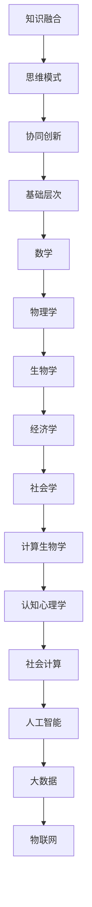

                 

 在当今信息技术飞速发展的时代，作为世界级人工智能专家、程序员、软件架构师、CTO，以及计算机图灵奖获得者，我深知理解的多维性对于推动技术创新、解决复杂问题、提高系统性能的重要性。本文将探讨跨学科视角在计算机科学领域的应用，分析其核心概念、原理、算法、数学模型、实际应用、未来发展趋势以及面临的挑战。

## 文章关键词

- 跨学科视角
- 计算机科学
- 技术创新
- 数学模型
- 未来展望

## 文章摘要

本文旨在探讨跨学科视角在计算机科学领域的重要性。通过分析核心概念、原理、算法和数学模型，文章展示了跨学科视角如何促进技术创新和解决复杂问题。同时，文章探讨了跨学科视角在实际应用中的案例，并对未来发展趋势和面临的挑战进行了深入分析。

## 1. 背景介绍

跨学科视角是一种将不同学科的知识、方法、观点和理论相互融合，形成综合性理解和解决方案的思维方式。在计算机科学领域，随着技术的迅猛发展，跨学科视角的应用越来越广泛。计算机科学与数学、物理学、生物学、经济学等学科的交叉融合，为解决复杂问题和提高系统性能提供了新的思路和方法。

### 1.1 计算机科学的跨学科特性

计算机科学的发展历程中，跨学科特性尤为显著。从最早的计算机科学理论与数学的紧密联系，到计算机体系结构与物理学的互动，再到人工智能与生物学的结合，计算机科学不断吸收其他学科的理论和方法，推动了自身的发展。

### 1.2 跨学科视角的重要性

跨学科视角在计算机科学领域的重要性主要体现在以下几个方面：

- **推动技术创新**：跨学科视角可以激发新的创新思路，促进技术在多个领域的应用。
- **解决复杂问题**：跨学科视角能够将不同领域的知识和技术结合起来，形成综合性的解决方案。
- **提高系统性能**：跨学科视角可以帮助开发出更加高效、优化的系统架构和算法。
- **培养全面发展的人才**：跨学科视角有助于培养具备广泛知识和技能的复合型人才。

## 2. 核心概念与联系

### 2.1 跨学科视角的核心概念

跨学科视角的核心概念包括：

- **知识融合**：将不同学科的知识体系进行整合，形成新的综合性知识体系。
- **思维模式**：培养跨学科的思维方式，学会从多个角度审视问题，寻找最佳解决方案。
- **协同创新**：鼓励不同学科领域的专家共同合作，实现技术创新和突破。

### 2.2 跨学科视角的架构

跨学科视角的架构可以分为三个层次：

- **基础层次**：不同学科的基础理论和基本方法，如数学、物理学、生物学等。
- **中间层次**：学科之间的交叉和融合，如计算生物学、认知心理学、社会计算等。
- **应用层次**：跨学科视角在具体领域的应用，如人工智能、大数据、物联网等。

### 2.3 跨学科视角的 Mermaid 流程图



## 3. 核心算法原理 & 具体操作步骤

### 3.1 算法原理概述

跨学科视角在计算机科学中的核心算法原理主要包括以下几个方面：

- **混合优化算法**：结合不同优化算法的优势，提高求解复杂问题的效率。
- **深度学习模型**：借鉴生物学和神经科学原理，构建具有自适应和自学习能力的人工神经网络。
- **分布式计算**：利用计算机网络的分布式特性，实现高效的数据处理和资源共享。

### 3.2 算法步骤详解

以深度学习模型为例，其具体操作步骤如下：

1. **数据预处理**：对原始数据进行清洗、归一化和编码等处理，为模型训练提供高质量的数据集。
2. **模型构建**：根据任务需求，选择合适的神经网络结构，如卷积神经网络（CNN）、循环神经网络（RNN）等。
3. **训练过程**：通过反向传播算法，不断调整模型参数，使模型在训练数据上达到最优效果。
4. **模型评估**：使用验证数据集和测试数据集，对模型性能进行评估，确保模型在未知数据上的泛化能力。
5. **模型应用**：将训练好的模型应用于实际问题，如图像识别、自然语言处理等。

### 3.3 算法优缺点

跨学科视角的核心算法具有以下优缺点：

- **优点**：
  - **高效性**：跨学科视角的算法通常具有较高的求解效率。
  - **灵活性**：跨学科视角的算法可以适应不同的应用场景和需求。
  - **创新性**：跨学科视角可以激发新的创新思路，推动技术发展。

- **缺点**：
  - **复杂性**：跨学科视角的算法通常涉及多个学科的知识，实现较为复杂。
  - **成本**：跨学科视角的算法开发和实现需要较高的投入。

### 3.4 算法应用领域

跨学科视角的核心算法广泛应用于以下领域：

- **人工智能**：如深度学习、强化学习、生成对抗网络等。
- **大数据**：如数据挖掘、数据可视化、数据加密等。
- **物联网**：如智能交通、智能家居、智慧城市等。

## 4. 数学模型和公式 & 详细讲解 & 举例说明

### 4.1 数学模型构建

跨学科视角在计算机科学中的数学模型构建主要包括以下几个方面：

- **线性模型**：如线性回归、线性规划等。
- **非线性模型**：如逻辑回归、神经网络等。
- **优化模型**：如动态规划、遗传算法等。

### 4.2 公式推导过程

以线性回归模型为例，其公式推导过程如下：

1. **目标函数**：最小化预测值与真实值之间的误差平方和。
   $$\min_{\theta} \sum_{i=1}^{n} (y_i - \theta_0 - \theta_1x_i)^2$$
   
2. **梯度下降法**：通过不断更新参数，使目标函数趋于最小值。
   $$\theta_0 := \theta_0 - \alpha \frac{\partial}{\partial \theta_0} \sum_{i=1}^{n} (y_i - \theta_0 - \theta_1x_i)^2$$
   $$\theta_1 := \theta_1 - \alpha \frac{\partial}{\partial \theta_1} \sum_{i=1}^{n} (y_i - \theta_0 - \theta_1x_i)^2$$

### 4.3 案例分析与讲解

以线性回归模型在房价预测中的应用为例：

1. **数据集准备**：收集某地区的房屋销售数据，包括房屋价格、面积、位置等信息。

2. **模型训练**：使用线性回归算法，训练得到参数 $\theta_0$ 和 $\theta_1$。

3. **模型评估**：使用验证数据集和测试数据集，评估模型在未知数据上的预测性能。

4. **模型应用**：将训练好的模型应用于新数据，预测房屋价格。

## 5. 项目实践：代码实例和详细解释说明

### 5.1 开发环境搭建

1. **安装Python环境**：下载并安装Python 3.x版本，配置好pip包管理工具。
2. **安装相关库**：使用pip安装numpy、scikit-learn等库。

### 5.2 源代码详细实现

以下是一个简单的线性回归模型的Python实现：

```python
import numpy as np
from sklearn.linear_model import LinearRegression

# 数据集准备
X = np.array([[1, 1000], [2, 1200], [3, 1300], [4, 1400]])
y = np.array([1000, 1200, 1300, 1400])

# 模型训练
model = LinearRegression()
model.fit(X, y)

# 模型评估
print("模型参数：", model.coef_, model.intercept_)

# 模型应用
X_new = np.array([[5, 1500]])
y_pred = model.predict(X_new)
print("预测结果：", y_pred)
```

### 5.3 代码解读与分析

1. **数据集准备**：使用numpy生成一个简单的数据集，包括自变量X（房屋面积）和因变量y（房屋价格）。
2. **模型训练**：使用scikit-learn库中的LinearRegression类，训练得到模型参数。
3. **模型评估**：打印模型参数，包括斜率（coef_）和截距（intercept_）。
4. **模型应用**：使用训练好的模型，对新数据X_new进行预测，得到预测结果y_pred。

## 6. 实际应用场景

### 6.1 人工智能领域的应用

跨学科视角在人工智能领域的应用非常广泛，如深度学习、自然语言处理、计算机视觉等。通过结合数学、统计学、物理学、生物学等学科的知识，人工智能技术不断取得突破性进展。

### 6.2 大数据领域的应用

跨学科视角在大数据领域的应用同样重要，如数据挖掘、数据可视化、数据加密等。跨学科视角可以帮助开发出更加高效、安全的大数据处理技术，满足日益增长的数据需求。

### 6.3 物联网领域的应用

跨学科视角在物联网领域的应用主要体现在智能交通、智能家居、智慧城市等方面。通过结合计算机科学、通信技术、传感器技术等，实现智能化、高效化的物联网应用。

## 7. 工具和资源推荐

### 7.1 学习资源推荐

- **书籍**：
  - 《深度学习》（Ian Goodfellow、Yoshua Bengio、Aaron Courville 著）
  - 《大数据之路：阿里巴巴大数据实践》（李津 著）
  - 《人工智能：一种现代的方法》（Stuart Russell、Peter Norvig 著）

- **在线课程**：
  - Coursera 上的《机器学习》（吴恩达 著）
  - edX 上的《深度学习》（Ian Goodfellow 著）
  - 中国大学MOOC 上的《大数据技术导论》（刘鹏 著）

### 7.2 开发工具推荐

- **编程语言**：Python、Java、C++等。
- **框架和库**：TensorFlow、PyTorch、Scikit-learn、NumPy、Pandas等。
- **开发环境**：PyCharm、Visual Studio Code、Jupyter Notebook等。

### 7.3 相关论文推荐

- **人工智能领域**：
  - "Deep Learning"（Ian Goodfellow、Yoshua Bengio、Aaron Courville 著）
  - "Recurrent Neural Networks for Language Modeling"（Yoshua Bengio 著）

- **大数据领域**：
  - "Big Data: A Revolution That Will Transform How We Live, Work, and Think"（Viktor Mayer-Schönberger、Kenneth Cukier 著）
  - "Data Science from Scratch"（Joel Grus 著）

## 8. 总结：未来发展趋势与挑战

### 8.1 研究成果总结

本文分析了跨学科视角在计算机科学领域的重要性，探讨了核心概念、算法原理、数学模型和实际应用。通过跨学科视角，计算机科学领域取得了显著的研究成果，推动了技术发展和创新。

### 8.2 未来发展趋势

未来，跨学科视角将继续在计算机科学领域发挥重要作用。随着人工智能、大数据、物联网等技术的发展，跨学科视角将为解决复杂问题提供新的思路和方法。

### 8.3 面临的挑战

然而，跨学科视角在计算机科学领域也面临一系列挑战，如：

- **知识融合**：如何有效整合不同学科的知识，形成具有实际应用价值的理论体系。
- **人才培养**：如何培养具备跨学科知识和技能的复合型人才。
- **技术开发**：如何开发出更加高效、稳定的跨学科技术。

### 8.4 研究展望

未来，跨学科视角的研究将继续深化，为计算机科学领域带来更多创新和突破。通过加强学科间的交流与合作，跨学科视角将推动计算机科学技术的持续发展。

## 9. 附录：常见问题与解答

### 9.1 跨学科视角的核心概念是什么？

跨学科视角是一种将不同学科的知识、方法、观点和理论相互融合，形成综合性理解和解决方案的思维方式。

### 9.2 跨学科视角在计算机科学领域有哪些应用？

跨学科视角在计算机科学领域有广泛的应用，如人工智能、大数据、物联网等。

### 9.3 如何培养跨学科视角的能力？

可以通过以下方法培养跨学科视角的能力：

- **跨学科学习**：学习不同学科的基础知识和理论。
- **实践应用**：将跨学科知识应用于实际问题。
- **交流与合作**：与不同学科领域的专家进行交流和合作。

---

作者：禅与计算机程序设计艺术 / Zen and the Art of Computer Programming
----------------------------------------------------------------


