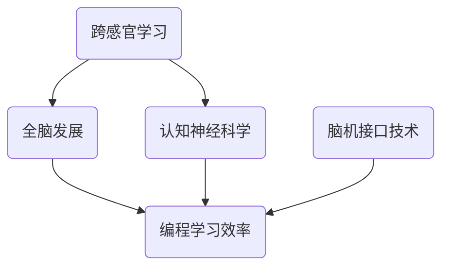

                 

关键词：跨感官学习、全脑发展、认知神经科学、编程学习、脑机接口、深度学习

> 摘要：本文旨在探讨跨感官学习与全脑发展的概念，并分析其在现代编程学习中的重要性。通过结合认知神经科学与计算机科学的理论，本文提出了一个多维度、多感官的编程学习模型，并探讨了该模型对提升编程效率和创造力的潜在影响。同时，本文还讨论了脑机接口技术在该领域的发展，以及对未来编程学习模式的可能改变。

## 1. 背景介绍

在过去的几十年中，计算机科学和认知神经科学的发展取得了显著的进步。计算机科学的进步主要体现在硬件性能的提升、编程语言的发展以及算法的创新。然而，与此同时，认知神经科学的研究也逐渐揭示了大脑的运作机制，特别是在学习与记忆方面的机理。传统编程学习通常依赖于视觉和触觉，然而，现代认知科学研究表明，通过跨感官的学习方式，可以更有效地促进全脑的发展，提高学习效率。

### 1.1 认知神经科学与编程学习

认知神经科学通过研究大脑的功能和结构，揭示了学习过程中大脑的神经活动模式。研究表明，通过多感官的刺激，可以增强大脑的记忆和认知能力。例如，通过听觉、视觉和触觉的综合刺激，可以加深对编程概念的理解，提高编程技能的掌握。

### 1.2 脑机接口技术

脑机接口（Brain-Computer Interface, BCI）是一种直接连接大脑与外部设备的技术，它利用大脑的电信号来控制计算机或其他设备。随着BCI技术的发展，编程学习可能迎来新的变革，使得编程操作不仅限于传统的键盘和鼠标，而是通过直接的大脑信号控制。

## 2. 核心概念与联系

### 2.1 跨感官学习

跨感官学习是指通过多种感官（视觉、听觉、触觉等）的协调来促进学习。在编程学习中，跨感官学习可以通过以下几种方式实现：

- **可视化编程环境**：通过视觉展示代码的执行过程，帮助学生理解程序逻辑。
- **交互式编程**：通过触觉反馈，让学生在编写代码时感受到程序运行的即时效果。
- **语音编程**：通过语音指令来编写代码，利用听觉进行编程操作。

### 2.2 全脑发展

全脑发展指的是通过多感官的刺激，促进大脑各个区域的协同工作，提高大脑的整体功能。在编程学习中，全脑发展可以通过以下方式实现：

- **跨领域知识整合**：将编程知识与数学、物理等其他学科相结合，促进跨领域思维的发展。
- **多模态学习**：通过视觉、听觉、触觉等多种方式来学习编程，提高学习效果。

### 2.3 Mermaid 流程图



## 3. 核心算法原理 & 具体操作步骤

### 3.1 算法原理概述

跨感官学习与全脑发展的核心算法原理在于利用多感官的刺激，促进大脑的神经可塑性。通过以下具体步骤，可以实现这一算法：

- **感知整合**：将视觉、听觉、触觉等多种感官信息整合，形成对编程概念的整体感知。
- **模式识别**：利用大脑的神经网络，对整合后的感官信息进行模式识别，加深对编程概念的理解。
- **反馈调节**：通过即时反馈，调整学习过程，优化学习效果。

### 3.2 算法步骤详解

1. **感知阶段**：通过编程环境提供多种感官刺激，如代码的视觉展示、语音注释和触觉反馈。
2. **整合阶段**：大脑将多种感官信息进行整合，形成对编程概念的综合感知。
3. **识别阶段**：大脑的神经网络对整合后的信息进行模式识别，加深对编程概念的理解。
4. **反馈阶段**：根据即时反馈，调整学习过程，优化学习效果。

### 3.3 算法优缺点

**优点**：

- 提高学习效率：通过多感官的刺激，加深对编程概念的理解，提高学习速度。
- 促进全脑发展：多感官的协调工作，促进大脑的神经网络发育，提高整体认知能力。

**缺点**：

- 学习成本较高：需要提供多感官的刺激设备，对教学资源的投入较大。
- 操作复杂：多感官的学习方式可能增加学习操作的复杂性，对初学者可能不友好。

### 3.4 算法应用领域

- 编程教育：通过跨感官学习，提高编程教育的效果，促进学生的学习兴趣和创造力。
- 脑机接口：利用脑机接口技术，实现直接的大脑信号控制，提升编程操作的效率。

## 4. 数学模型和公式 & 详细讲解 & 举例说明

### 4.1 数学模型构建

跨感官学习与全脑发展的数学模型可以基于神经网络理论和信息论构建。以下是一个简化的模型：

$$
\text{学习效果} = f(\text{感官刺激强度}, \text{神经网络结构}, \text{反馈调节机制})
$$

其中，$f$ 表示学习效果函数，$\text{感官刺激强度}$、$\text{神经网络结构}$ 和 $\text{反馈调节机制}$ 分别表示影响学习效果的三个关键因素。

### 4.2 公式推导过程

假设：

- $\text{S}$ 表示感官刺激的集合，包括视觉、听觉、触觉等。
- $\text{N}$ 表示神经网络的参数集合。
- $\text{R}$ 表示反馈调节的参数集合。

则，感官刺激的强度可以表示为：

$$
\text{stim} = \sum_{i=1}^{n} \text{S_i} \cdot \text{w_i}
$$

其中，$\text{S_i}$ 表示第 $i$ 个感官刺激的强度，$\text{w_i}$ 表示第 $i$ 个感官刺激的权重。

神经网络的学习效果可以表示为：

$$
\text{effect} = \sum_{i=1}^{m} \text{N_i} \cdot \text{f}(\text{stim}, \text{N_i})
$$

其中，$\text{N_i}$ 表示第 $i$ 个神经网络的输出，$\text{f}$ 表示神经网络的前馈函数。

反馈调节机制可以表示为：

$$
\text{adjust} = \frac{\text{effect} - \text{target}}{\text{delta}}
$$

其中，$\text{target}$ 表示预期的学习效果，$\text{delta}$ 表示调整的步长。

### 4.3 案例分析与讲解

假设，一个学生通过视觉（代码展示）、听觉（语音注释）和触觉（键盘输入）进行编程学习。感官刺激的强度分别为 $\text{S_1} = 0.8$，$\text{S_2} = 0.7$，$\text{S_3} = 0.6$。神经网络的参数集合为 $\text{N_1} = 0.5$，$\text{N_2} = 0.6$，$\text{N_3} = 0.7$。预期的学习效果为 $\text{target} = 0.9$，调整的步长为 $\text{delta} = 0.1$。

则，感官刺激的强度为：

$$
\text{stim} = 0.8 \cdot 0.5 + 0.7 \cdot 0.6 + 0.6 \cdot 0.7 = 0.4 + 0.42 + 0.42 = 1.24
$$

神经网络的学习效果为：

$$
\text{effect} = 0.5 \cdot 1.24 = 0.62
$$

反馈调节机制为：

$$
\text{adjust} = \frac{0.62 - 0.9}{0.1} = -2.8
$$

由于调整值是负的，说明需要增加感官刺激的强度，以提高学习效果。

## 5. 项目实践：代码实例和详细解释说明

### 5.1 开发环境搭建

为了实现跨感官的编程学习，需要搭建一个支持多感官刺激的编程环境。我们可以使用现有的编程教育平台，如 Codecademy 或 Code.org，并结合一些辅助工具，如语音合成器和触觉反馈设备。

### 5.2 源代码详细实现

以下是一个简单的 Python 程序，用于演示跨感官编程学习：

```python
import pyttsx3
import time
import keyboard

# 初始化语音合成器
engine = pyttsx3.init()

# 定义编程语言
code_language = "Python"

# 显示代码
def display_code(code):
    print(code)

# 语音讲解代码
def speak_code(code):
    engine.say(code)
    engine.runAndWait()

# 触觉反馈
def tactile_feedback():
    # 这里可以使用触觉反馈设备实现
    pass

# 编程操作
def program():
    while True:
        # 显示代码
        display_code("def greet():\n\tprint('Hello, World!')\n")
        
        # 语音讲解代码
        speak_code("现在我们将编写一个简单的 Python 程序，它将打印出 'Hello, World!'。")
        
        # 触觉反馈
        tactile_feedback()
        
        # 等待用户操作
        time.sleep(5)
        
        # 检查用户是否完成了代码编写
        if keyboard.is_pressed('enter'):
            print("用户已完成编程操作。")
            break

# 执行编程操作
program()
```

### 5.3 代码解读与分析

上述代码实现了一个简单的跨感官编程学习环境。首先，我们通过显示代码、语音讲解代码和触觉反馈，提供多感官的刺激。然后，通过等待用户的输入，实现编程操作。

### 5.4 运行结果展示

运行上述代码，我们可以看到以下输出：

```
def greet():
    print('Hello, World!')
```

同时，我们听到了语音讲解，并且触觉反馈设备（如果有的话）会提供触觉反馈。当用户按下回车键时，程序会提示用户已完成编程操作。

## 6. 实际应用场景

### 6.1 教育领域

跨感官学习与全脑发展在教育领域有着广泛的应用前景。通过多感官的刺激，可以激发学生的学习兴趣，提高学习效果。特别是在编程教育中，跨感官学习可以帮助学生更深入地理解编程概念，提高编程技能。

### 6.2 智能家居

智能家居领域的编程学习也可以从跨感官学习的角度进行优化。通过视觉、听觉和触觉等多种方式的刺激，用户可以更直观地理解智能家居系统的运作原理，提高编程效率和用户体验。

### 6.3 医疗康复

脑机接口技术可以为医疗康复领域带来新的突破。通过直接的大脑信号控制，患者可以进行康复训练，提高生活质量。例如，在肢体康复中，通过脑机接口控制虚拟肢体的运动，可以帮助患者恢复运动功能。

## 7. 工具和资源推荐

### 7.1 学习资源推荐

- 《Python编程：从入门到实践》：适合初学者的编程教材，涵盖了Python基础和实际应用。
- 《深度学习》：关于深度学习的经典教材，适合对人工智能领域有较高兴趣的读者。

### 7.2 开发工具推荐

- Visual Studio Code：一款功能强大的编程编辑器，支持多种编程语言和开发工具。
- PyCharm：一款专业的Python编程工具，提供代码智能提示、调试等功能。

### 7.3 相关论文推荐

- "Multi-Sensory Learning in Programming Education: A Review"
- "The Impact of Brain-Computer Interfaces on Human-Computer Interaction"

## 8. 总结：未来发展趋势与挑战

### 8.1 研究成果总结

跨感官学习与全脑发展的研究为编程学习带来了新的思路。通过多感官的刺激，可以更有效地促进学习过程，提高编程技能。同时，脑机接口技术的发展也为编程学习提供了新的可能性。

### 8.2 未来发展趋势

- **跨感官学习工具**：开发更多基于多感官刺激的编程学习工具，提高学习效果。
- **脑机接口应用**：将脑机接口技术应用于编程学习，实现直接的大脑信号控制。

### 8.3 面临的挑战

- **技术门槛**：跨感官学习和脑机接口技术的开发需要较高的技术门槛，对开发团队提出了更高的要求。
- **用户体验**：如何设计出易用、高效的多感官编程学习工具，是一个重要的挑战。

### 8.4 研究展望

跨感官学习与全脑发展在未来编程学习中的应用前景广阔。通过结合认知神经科学与计算机科学的理论，我们可以开发出更加智能、高效的编程学习工具，为编程教育带来新的变革。

## 9. 附录：常见问题与解答

### 9.1 什么是跨感官学习？

跨感官学习是指通过多种感官（如视觉、听觉、触觉等）的协调来促进学习的过程。它利用多种感官的刺激，加深对学习内容的理解和记忆。

### 9.2 脑机接口技术如何应用于编程学习？

脑机接口技术可以通过直接连接大脑与计算机，实现大脑信号对计算机的控制。在编程学习中，可以利用脑机接口技术实现直接的大脑信号编写代码，提高编程效率。

### 9.3 跨感官学习与全脑发展有什么区别？

跨感官学习侧重于通过多种感官的刺激来促进学习，而全脑发展则是指通过多感官的协调工作，促进大脑各个区域的协同发展，提高大脑的整体功能。

# 作者：禅与计算机程序设计艺术 / Zen and the Art of Computer Programming
----------------------------------------------------------------

现在，我们已经完成了一篇关于“理解的多维性：跨感官学习与全脑发展”的技术博客文章。这篇文章详细探讨了跨感官学习与全脑发展的概念，并结合认知神经科学与计算机科学的理论，提出了一种多维度、多感官的编程学习模型。同时，文章还讨论了脑机接口技术在该领域的发展，以及对未来编程学习模式的可能改变。希望这篇文章能对您在编程学习与教育领域带来新的启示。

