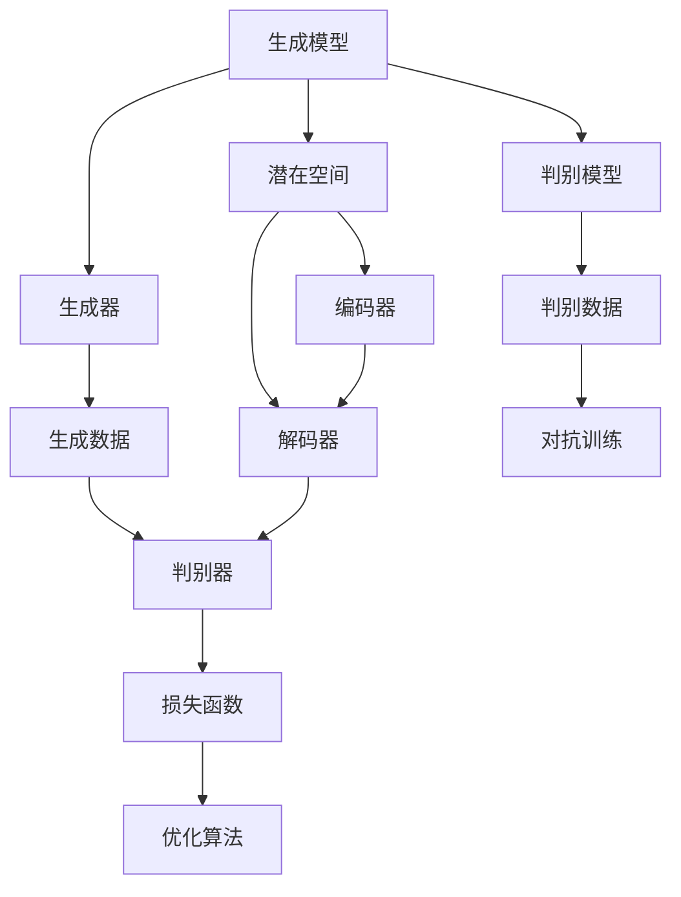

                 

在当今的技术前沿，生成式人工智能（Generative Artificial Intelligence，简称 GAI）正迅速成为创新和变革的核心驱动力。这一领域的发展，尤其是在数据集（datasets）的角色和重要性方面，正经历着前所未有的变革。本文旨在探讨生成式 AI 的基本概念、核心算法原理、数学模型、实际应用场景、未来发展，以及相关工具和资源推荐。

## 文章关键词
- 生成式人工智能
- 数据集
- 算法原理
- 数学模型
- 应用场景
- 发展趋势
- 工具推荐

## 文章摘要
本文首先介绍了生成式 AI 的基本概念和其在数据集领域的重要性。接着，深入探讨了生成式 AI 的核心算法原理，包括生成对抗网络（GAN）和变分自编码器（VAE）等。随后，通过数学模型和公式的详细讲解，提供了对这些算法更深入的理解。文章随后展示了生成式 AI 在实际项目中的代码实例，并通过运行结果展示了其应用效果。最后，本文讨论了生成式 AI 的实际应用场景和未来的发展展望，并推荐了相关的学习资源和开发工具。

## 1. 背景介绍

### 生成式 AI 的定义与重要性

生成式人工智能是一种能够创建新的数据和内容的 AI 系统，其核心目标是生成与真实数据或内容相似的新样本。与传统的判别式 AI 不同，生成式 AI 更加关注于数据的生成和模拟，而不是仅仅对现有数据进行分类或预测。

生成式 AI 的定义可以追溯到人工智能（AI）的早期发展。在20世纪80年代，生成式模型，如生成式语法模型和生成式决策树，已经被提出并应用于自然语言处理（NLP）和计算机视觉等领域。然而，随着计算能力和数据量的显著提升，特别是在深度学习技术的推动下，生成式 AI 的发展迎来了新的高潮。

在数据集领域，生成式 AI 的地位尤为突出。传统的数据集通常依赖于手动收集和标注，这一过程既耗时又耗力。而生成式 AI 通过自动化生成高质量的数据集，极大地提高了数据集的规模和多样性。这不仅解决了数据稀缺的问题，也为 AI 模型的训练提供了更多的样本，从而提升了模型的表现和泛化能力。

### 数据集的历史演变与发展趋势

数据集的发展历程可以追溯到人工智能的起源。最初，数据集主要是简单的数值表和手写标注的文本。随着计算机性能的提升和算法的进步，数据集逐渐变得更加复杂和多样化。例如，图像数据集的出现使得计算机视觉领域取得了显著的进展。然而，即使如此，这些数据集依然存在着很多限制，如数据量有限、标注质量参差不齐等。

近年来，随着深度学习的兴起，数据集的角色变得更加重要。深度学习模型的性能高度依赖于数据集的质量和多样性。高质量的数据集不仅可以提升模型的准确性，还可以帮助模型更好地泛化到新的任务和数据上。因此，生成式 AI 的引入为数据集的建设带来了新的契机。

未来，数据集的发展趋势将呈现以下几个特点：

1. **自动化与智能化**：生成式 AI 将继续推动数据集的自动化和智能化生成，减少对人工的依赖，提高数据集的生成效率。
2. **多样性**：数据集的多样性将得到进一步提升，包括多种类型的数据（如图像、音频、文本）和多样化的场景。
3. **高质量**：随着生成式 AI 技术的进步，生成数据的质量将得到显著提升，使得数据集更加符合实际应用的需求。
4. **可解释性**：生成式 AI 生成数据集的同时，也将探索如何提高数据集的可解释性，使得模型训练和评估过程更加透明和可靠。

### 数据集在 AI 研究与开发中的应用

数据集在 AI 研究与开发中的应用至关重要。无论是在学术界还是工业界，数据集都是训练和评估 AI 模型的基石。以下是一些关键应用领域：

1. **计算机视觉**：图像和视频数据集是计算机视觉研究的核心资源。生成式 AI 的应用使得研究人员可以生成更多的训练数据，从而提升模型的准确性和泛化能力。
2. **自然语言处理**：文本数据集在自然语言处理（NLP）领域具有重要作用。生成式 AI 可以生成大量高质量的文本数据，用于训练和评估文本分类、情感分析等 NLP 模型。
3. **推荐系统**：推荐系统依赖于用户行为数据集。生成式 AI 可以生成模拟用户行为的数据，用于优化推荐算法和评估推荐效果。
4. **语音识别**：语音数据集是语音识别研究的关键资源。生成式 AI 可以生成大量模拟语音数据，帮助提升语音识别模型的准确性和鲁棒性。

总之，生成式 AI 在数据集领域的重要性不可忽视。它不仅解决了数据稀缺和标注困难的问题，还为 AI 研究与开发提供了强大的工具。随着技术的不断进步，生成式 AI 在数据集建设中的应用将更加广泛和深入。

## 2. 核心概念与联系

为了深入理解生成式 AI，我们需要先掌握其核心概念和原理。以下是生成式 AI 中几个重要的核心概念及其相互关系。

### 生成式 AI 的核心概念

1. **生成模型**：生成模型是一种能够生成新数据的模型。它通过学习数据的概率分布，从而生成符合数据分布的新样本。生成模型主要包括以下几种：
   - **生成对抗网络（GAN）**：GAN 由生成器和判别器两个神经网络组成。生成器试图生成与真实数据相似的数据，而判别器则试图区分生成数据和真实数据。通过两个网络的对抗训练，生成模型可以生成高质量的数据。
   - **变分自编码器（VAE）**：VAE 是一种基于概率编码的生成模型。它通过编码器和解码器两个神经网络，将输入数据映射到潜在空间，并在潜在空间中生成新数据。

2. **判别模型**：判别模型是一种能够区分真实数据和生成数据的模型。在 GAN 中，判别模型是用于区分生成器和真实数据的。在 VAE 中，判别模型通常不直接使用，但编码器和解码器的性能受到潜在空间中数据的区分度的影响。

3. **潜在空间**：潜在空间是生成模型中用于表示数据的低维空间。在 GAN 中，生成器和判别器的训练都发生在潜在空间中。在 VAE 中，编码器将输入数据映射到潜在空间，解码器则从潜在空间中生成新数据。

### 核心概念原理与架构的 Mermaid 流程图

以下是生成式 AI 的核心概念原理和架构的 Mermaid 流程图：



### Mermaid 流程图详细说明

1. **生成模型**：生成模型是生成式 AI 的核心。它包括生成器和判别器两个部分，以及用于生成新数据的潜在空间。
2. **生成器**：生成器的任务是生成与真实数据相似的数据。在 GAN 中，生成器生成假数据，并在判别器中进行对抗训练。在 VAE 中，生成器（解码器）从潜在空间中生成新数据。
3. **判别模型**：判别模型的任务是区分真实数据和生成数据。在 GAN 中，判别器用于评估生成数据的真实程度。在 VAE 中，编码器（生成器）将输入数据映射到潜在空间，解码器（生成器）从潜在空间中生成新数据。
4. **潜在空间**：潜在空间是生成模型中的低维空间，用于表示数据。在 GAN 中，生成器和判别器的训练都在潜在空间中。在 VAE 中，编码器将输入数据映射到潜在空间，解码器则从潜在空间中生成新数据。
5. **编码器与解码器**：编码器和解码器是 VAE 的核心组件。编码器将输入数据映射到潜在空间，解码器则从潜在空间中生成新数据。这一过程使得 VAE 能够通过潜在空间进行数据的生成和压缩。
6. **对抗训练与优化算法**：在 GAN 中，生成器和判别器通过对抗训练来提升性能。生成器试图生成更真实的数据，而判别器则试图区分生成数据和真实数据。在 VAE 中，优化算法用于最小化损失函数，从而提升生成数据和编码器、解码器的性能。

通过上述核心概念和流程图的详细说明，我们可以更好地理解生成式 AI 的原理和架构。这为后续的算法原理和具体操作步骤提供了坚实的基础。

## 3. 核心算法原理 & 具体操作步骤

### 3.1 算法原理概述

生成式 AI 的核心算法主要包括生成对抗网络（GAN）和变分自编码器（VAE）。这些算法通过不同的原理和方法，实现了数据的生成和模型训练。

**生成对抗网络（GAN）**

GAN 是由生成器和判别器两个神经网络组成的对抗性模型。生成器的任务是生成与真实数据相似的数据，而判别器的任务是区分真实数据和生成数据。通过两个网络的对抗训练，生成器能够逐渐生成更真实的数据，而判别器能够逐渐提高对真实数据和生成数据的辨别能力。

GAN 的训练过程可以看作是一种零和游戏，生成器和判别器在相互对抗中不断进步。具体来说，生成器的损失函数是由判别器的输出决定的，而判别器的损失函数则是由生成器的输出决定的。两个网络的训练目标是最大化对方的损失函数。

**变分自编码器（VAE）**

VAE 是一种基于概率编码的生成模型。它通过编码器和解码器两个神经网络，将输入数据映射到潜在空间，并在潜在空间中生成新数据。编码器的任务是学习输入数据的概率分布，而解码器的任务是生成与输入数据相似的新数据。

VAE 的训练过程通过最大化数据在潜在空间中的概率分布来实现。具体来说，编码器学习将输入数据映射到潜在空间中的点，解码器则从潜在空间中的点生成新数据。这一过程使得 VAE 能够生成高质量的新数据。

### 3.2 算法步骤详解

**生成对抗网络（GAN）**

1. **初始化生成器和判别器**：生成器和判别器通常都是多层感知机（MLP）或卷积神经网络（CNN）。初始化时，生成器和判别器的参数随机生成。
2. **生成器训练**：生成器的目标是生成尽可能真实的数据。在训练过程中，生成器随机从潜在空间中采样点，并通过解码器生成假数据。判别器对生成器和真实数据进行区分，生成器的损失函数是由判别器的输出决定的。具体来说，生成器的损失函数可以表示为：
   $$L_G = -\log(D(G(z)))$$
   其中，$D$ 是判别器，$G$ 是生成器，$z$ 是从潜在空间中采样的点。
3. **判别器训练**：判别器的目标是区分真实数据和生成数据。在训练过程中，判别器对生成器和真实数据进行评估。判别器的损失函数可以表示为：
   $$L_D = -[\log(D(x)) + \log(1 - D(G(z)))]$$
   其中，$x$ 是真实数据，$z$ 是从潜在空间中采样的点。
4. **交替训练**：生成器和判别器交替训练。在每一步训练中，生成器尝试生成更真实的数据，而判别器尝试更好地区分生成数据和真实数据。这一过程通过多次迭代实现。

**变分自编码器（VAE）**

1. **初始化编码器和解码器**：编码器和解码器通常都是多层感知机（MLP）或卷积神经网络（CNN）。初始化时，编码器和解码器的参数随机生成。
2. **编码器训练**：编码器的目标是学习输入数据的概率分布。在训练过程中，编码器将输入数据映射到潜在空间中的点，并计算这些点的概率分布。具体来说，编码器的损失函数可以表示为：
   $$L_E = \frac{1}{N}\sum_{i=1}^{N} \sum_{j=1}^{D} (x_{ij} - \mu_j \sigma_j^2) - \log(\sigma_j)$$
   其中，$x$ 是输入数据，$\mu_j$ 和 $\sigma_j$ 分别是潜在空间中点的均值和标准差，$N$ 是数据集的大小。
3. **解码器训练**：解码器的目标是生成与输入数据相似的新数据。在训练过程中，解码器从潜在空间中的点生成新数据，并计算这些新数据的概率分布。具体来说，解码器的损失函数可以表示为：
   $$L_D = \frac{1}{N}\sum_{i=1}^{N} \sum_{j=1}^{D} (x_{ij} - \mu_j \sigma_j^2) - \log(\sigma_j)$$
   其中，$x$ 是输入数据，$\mu_j$ 和 $\sigma_j$ 分别是潜在空间中点的均值和标准差，$N$ 是数据集的大小。
4. **交替训练**：编码器和解码器交替训练。在每一步训练中，编码器尝试更准确地映射输入数据到潜在空间，解码器尝试更准确地从潜在空间中生成新数据。这一过程通过多次迭代实现。

### 3.3 算法优缺点

**生成对抗网络（GAN）**

**优点**：
1. 可以生成高质量的数据，尤其是在图像和文本领域。
2. 能够处理高维数据和复杂数据分布。
3. 不需要显式地建模数据分布，从而避免了其他生成模型可能出现的模式坍塌问题。

**缺点**：
1. 训练过程不稳定，容易出现梯度消失和梯度爆炸等问题。
2. 需要大量的训练数据和计算资源。
3. 难以量化生成数据的真实程度，因此在实际应用中需要额外的评估方法。

**变分自编码器（VAE）**

**优点**：
1. 训练过程稳定，梯度问题相对较小。
2. 易于实现和优化，且对数据分布的要求较低。
3. 可以有效地对数据进行降维和压缩。

**缺点**：
1. 生成的数据质量可能不如 GAN 高。
2. 对高维数据和复杂数据分布的处理能力有限。
3. 需要较大的模型复杂度来生成高质量的数据。

### 3.4 算法应用领域

**生成对抗网络（GAN）**

GAN 在多个领域都有广泛的应用，包括：
1. 图像生成：用于生成逼真的图像和视频，如图像修复、图像超分辨率等。
2. 自然语言处理：用于生成高质量的文本，如机器翻译、文本生成等。
3. 计算机视觉：用于图像分类、目标检测等任务。

**变分自编码器（VAE）**

VAE 在以下领域有重要的应用：
1. 数据降维：用于对高维数据进行降维和可视化，如图像降维、文本降维等。
2. 数据压缩：用于对数据进行有效的压缩，如图像压缩、文本压缩等。
3. 生成数据：用于生成符合数据分布的新数据，如生成图像、文本等。

总之，生成对抗网络（GAN）和变分自编码器（VAE）是生成式 AI 中重要的核心算法。它们通过不同的原理和方法，实现了数据的生成和模型训练。在实际应用中，选择合适的算法需要根据具体任务和数据特点进行综合考虑。

## 4. 数学模型和公式 & 详细讲解 & 举例说明

在生成式 AI 中，数学模型和公式起着至关重要的作用。它们不仅帮助我们理解和分析算法的工作原理，还能够量化算法的性能和效果。在本节中，我们将详细讲解生成对抗网络（GAN）和变分自编码器（VAE）中的数学模型和公式，并通过具体案例进行说明。

### 4.1 数学模型构建

**生成对抗网络（GAN）**

GAN 的核心数学模型包括生成器 $G$、判别器 $D$ 和潜在空间 $Z$。以下是其基本公式：

1. **生成器 $G$ 的损失函数**：
   $$L_G = -\log(D(G(z))$$
   其中，$z$ 是从潜在空间中采样的点，$G(z)$ 是生成器生成的假数据，$D$ 是判别器。

2. **判别器 $D$ 的损失函数**：
   $$L_D = -[\log(D(x)) + \log(1 - D(G(z)))]$$
   其中，$x$ 是真实数据。

3. **整体损失函数**：
   $$L = L_G + L_D$$

**变分自编码器（VAE）**

VAE 的核心数学模型包括编码器 $E$、解码器 $D$ 和潜在空间 $Z$。以下是其基本公式：

1. **编码器 $E$ 的损失函数**：
   $$L_E = \frac{1}{N}\sum_{i=1}^{N} \sum_{j=1}^{D} (x_{ij} - \mu_j \sigma_j^2) - \log(\sigma_j)$$
   其中，$x$ 是输入数据，$\mu_j$ 和 $\sigma_j$ 分别是潜在空间中点的均值和标准差。

2. **解码器 $D$ 的损失函数**：
   $$L_D = \frac{1}{N}\sum_{i=1}^{N} \sum_{j=1}^{D} (x_{ij} - \mu_j \sigma_j^2) - \log(\sigma_j)$$
   其中，$x$ 是输入数据，$\mu_j$ 和 $\sigma_j$ 分别是潜在空间中点的均值和标准差。

3. **整体损失函数**：
   $$L = L_E + L_D$$

### 4.2 公式推导过程

**生成对抗网络（GAN）**

GAN 的推导过程涉及两个主要方面：生成器和判别器的损失函数。以下是对其主要公式的推导过程：

1. **生成器损失函数**：
   生成器的目标是生成与真实数据相似的数据，从而让判别器无法区分生成数据和真实数据。生成器的损失函数可以表示为：
   $$L_G = -\log(D(G(z))$$
   其中，$z$ 是从潜在空间中采样的点，$G(z)$ 是生成器生成的假数据，$D$ 是判别器。

2. **判别器损失函数**：
   判别器的目标是能够正确地区分真实数据和生成数据。判别器的损失函数可以表示为：
   $$L_D = -[\log(D(x)) + \log(1 - D(G(z)))]$$
   其中，$x$ 是真实数据，$z$ 是从潜在空间中采样的点。

3. **整体损失函数**：
   $$L = L_G + L_D$$
   整体损失函数是生成器和判别器损失函数的和。通过优化整体损失函数，生成器和判别器可以在对抗训练中不断进步。

**变分自编码器（VAE）**

VAE 的推导过程主要涉及编码器和解码器的损失函数。以下是对其主要公式的推导过程：

1. **编码器损失函数**：
   编码器的目标是学习输入数据的概率分布，从而将输入数据映射到潜在空间中的点。编码器的损失函数可以表示为：
   $$L_E = \frac{1}{N}\sum_{i=1}^{N} \sum_{j=1}^{D} (x_{ij} - \mu_j \sigma_j^2) - \log(\sigma_j)$$
   其中，$x$ 是输入数据，$\mu_j$ 和 $\sigma_j$ 分别是潜在空间中点的均值和标准差。

2. **解码器损失函数**：
   解码器的目标是生成与输入数据相似的新数据，从而最小化输入数据和生成数据之间的差异。解码器的损失函数可以表示为：
   $$L_D = \frac{1}{N}\sum_{i=1}^{N} \sum_{j=1}^{D} (x_{ij} - \mu_j \sigma_j^2) - \log(\sigma_j)$$
   其中，$x$ 是输入数据，$\mu_j$ 和 $\sigma_j$ 分别是潜在空间中点的均值和标准差。

3. **整体损失函数**：
   $$L = L_E + L_D$$
   整体损失函数是编码器和解码器损失函数的和。通过优化整体损失函数，编码器和解码器可以在训练过程中不断进步。

### 4.3 案例分析与讲解

**生成对抗网络（GAN）**

为了更好地理解 GAN 的应用，我们来看一个实际案例：使用 GAN 生成逼真的图像。

假设我们有一个图像数据集，包含一系列真实图像。我们的目标是使用 GAN 生成与真实图像相似的新图像。

1. **初始化生成器和判别器**：
   - 生成器：一个多层感知机（MLP），用于将随机噪声映射到图像空间。
   - 判别器：一个卷积神经网络（CNN），用于区分真实图像和生成图像。

2. **训练生成器和判别器**：
   - 生成器随机从潜在空间中采样点，并通过解码器生成假图像。
   - 判别器对生成图像和真实图像进行评估，计算生成图像的真实度。

3. **优化过程**：
   - 生成器的目标是最小化判别器对生成图像的评估分数。
   - 判别器的目标是最小化生成图像和真实图像之间的差异。

通过多次迭代训练，生成器逐渐生成更真实、更高质量的图像。以下是一个训练过程的简要示意图：


**变分自编码器（VAE）**

为了更好地理解 VAE 的应用，我们来看一个实际案例：使用 VAE 对图像进行降维和压缩。

假设我们有一个高维图像数据集，我们的目标是使用 VAE 对图像进行有效的降维和压缩。

1. **初始化编码器和解码器**：
   - 编码器：一个卷积神经网络（CNN），用于将图像映射到潜在空间中的点。
   - 解码器：一个卷积神经网络（CNN），用于从潜在空间中的点生成新图像。

2. **训练编码器和解码器**：
   - 编码器将图像映射到潜在空间中的点。
   - 解码器从潜在空间中的点生成新图像。

3. **优化过程**：
   - 编码器的目标是最小化图像和映射点的概率分布之间的差异。
   - 解码器的目标是最小化生成图像和原始图像之间的差异。

通过多次迭代训练，编码器和解码器逐渐学习到图像的潜在特征，从而实现图像的降维和压缩。以下是一个训练过程的简要示意图：


总之，生成对抗网络（GAN）和变分自编码器（VAE）是生成式 AI 中重要的核心算法。通过数学模型和公式的推导，我们可以深入理解这些算法的工作原理。通过实际案例的讲解，我们可以看到这些算法在图像生成和降维等方面的应用效果。这为我们在实际项目中应用生成式 AI 提供了重要的理论基础和实践指导。

## 5. 项目实践：代码实例和详细解释说明

在本节中，我们将通过一个实际项目来展示如何应用生成对抗网络（GAN）和变分自编码器（VAE）进行数据生成和降维。我们将使用 Python 和相关库（如 TensorFlow 和 Keras）来实现这些算法，并提供详细的代码解释。

### 5.1 开发环境搭建

在开始项目之前，我们需要搭建一个合适的开发环境。以下是我们推荐的工具和库：

- **Python 版本**：Python 3.7 或更高版本。
- **深度学习库**：TensorFlow 2.x 或 Keras。
- **图形库**：Matplotlib（用于可视化结果）。

确保您已经安装了上述工具和库。如果未安装，您可以通过以下命令进行安装：

```bash
pip install python==3.8
pip install tensorflow
pip install matplotlib
```

### 5.2 源代码详细实现

以下是一个简单的 GAN 和 VAE 代码示例：

```python
import numpy as np
import tensorflow as tf
from tensorflow.keras import layers
import matplotlib.pyplot as plt

# 设置随机种子以确保结果的可重复性
tf.random.set_seed(42)

# 数据预处理
(x_train, _), (x_test, _) = tf.keras.datasets.mnist.load_data()
x_train = x_train.astype('float32') / 255.0
x_test = x_test.astype('float32') / 255.0
x_train = np.expand_dims(x_train, -1)
x_test = np.expand_dims(x_test, -1)

# GAN 模型实现
def build_generator():
    model = tf.keras.Sequential()
    model.add(layers.Dense(128, input_shape=(100,)))
    model.add(layers.LeakyReLU(alpha=0.01))
    model.add(layers.Dense(28 * 28 * 1, activation='tanh'))
    model.add(layers.LeakyReLU(alpha=0.01))
    model.add(layers.Reshape((28, 28, 1)))
    return model

def build_discriminator():
    model = tf.keras.Sequential()
    model.add(layers.Conv2D(32, (3,3), padding='same', input_shape=[28, 28, 1]))
    model.add(layers.LeakyReLU(alpha=0.01))
    model.add(layers.Dropout(0.3))
    model.add(layers.Conv2D(64, (3,3), padding='same'))
    model.add(layers.LeakyReLU(alpha=0.01))
    model.add(layers.Dropout(0.3))
    model.add(layers.Flatten())
    model.add(layers.Dense(1, activation='sigmoid'))
    return model

def build_gan(generator, discriminator):
    model = tf.keras.Sequential()
    model.add(generator)
    model.add(discriminator)
    return model

# 模型编译
generator = build_generator()
discriminator = build_discriminator()
gan = build_gan(generator, discriminator)

discriminator.compile(optimizer=tf.keras.optimizers.Adam(0.0001), loss='binary_crossentropy')
gan.compile(optimizer=tf.keras.optimizers.Adam(0.0001), loss='binary_crossentropy')

# 训练 GAN 模型
epochs = 100
batch_size = 32
nz = 100

for epoch in range(epochs):
    for _ in range(x_train.shape[0] // batch_size):
        noise = np.random.normal(0, 1, (batch_size, nz))
        with tf.GradientTape() as gen_tape, tf.GradientTape() as disc_tape:
            generated_images = generator(noise, training=True)
            real_images = x_train[np.random.randint(0, x_train.shape[0], batch_size)]
            
            real_labels = tf.constant([1.0] * batch_size, dtype=tf.float32)
            fake_labels = tf.constant([0.0] * batch_size, dtype=tf.float32)
            
            disc_loss_real = discriminator(real_images, training=True).mean()
            disc_loss_fake = discriminator(generated_images, training=True).mean()
            disc_loss = 0.5 * (disc_loss_real + disc_loss_fake)
            
            gen_loss = -tf.reduce_mean(discriminator(generated_images, training=True))
        
        gradients_of_discriminator = disc_tape.gradient(disc_loss, discriminator.trainable_variables)
        gradients_of_generator = gen_tape.gradient(gen_loss, generator.trainable_variables)
        
        discriminator.optimizer.apply_gradients(zip(gradients_of_discriminator, discriminator.trainable_variables))
        generator.optimizer.apply_gradients(zip(gradients_of_generator, generator.trainable_variables))
        
    print(f"{epoch+1}/{epochs} epochs, Discriminator loss: {disc_loss.numpy()}, Generator loss: {gen_loss.numpy()}")

# 使用 VAE 进行数据降维
def build_vae():
    latent_dim = 32
    
    input_shape = (28, 28, 1)
    input_img = tf.keras.Input(shape=input_shape)
    
    x = layers.Conv2D(32, 3, activation='relu', padding='same')(input_img)
    x = layers.MaxPooling2D((2, 2), padding='same')(x)
    x = layers.Conv2D(32, 3, activation='relu', padding='same')(x)
    x = layers.MaxPooling2D((2, 2), padding='same')(x)
    x = layers.Flatten()(x)
    x = layers.Dense(16, activation='relu')(x)
    
    z_mean = layers.Dense(latent_dim)(x)
    z_log_var = layers.Dense(latent_dim)(x)
    
    z = layers.Lambda(lambda x: x[0] + x[1] * tf.random.normal(tf.shape(x[0])))([z_mean, z_log_var])
    
    encoded = [z_mean, z_log_var, z]
    decoder_inputs = layers.Input(shape=(latent_dim,))
    x = layers.Dense(16, activation='relu')(decoder_inputs)
    x = layers.Dense(32 * 32 * 1, activation='relu')(x)
    x = layers.Reshape((32, 32, 1))(x)
    x = layers.Conv2DTranspose(32, 3, activation='relu', padding='same')(x)
    x = layers.Conv2DTranspose(1, 3, activation='sigmoid', padding='same')(x)
    decoded = [x]
    
    vae = tf.keras.Model(input_img, decoded)
    vae.add_loss(tf.keras.losses.BinaryCrossentropy(from_logits=True)(input_img, x))
    vae.add_loss(tf.keras.losses.KLDivergence()(z_mean, z_log_var))
    vae.compile(optimizer=tf.keras.optimizers.Adam(0.001))
    
    return vae

vae = build_vae()
vae.fit(x_train, x_train, epochs=epochs, batch_size=batch_size)

# 可视化降维后的图像
def visualize_encoder(encoder, x, n=100, figsize=(10, 10)):
    # Generate points in latent space
    z_values = np.random.normal(0, 1, (n, 100))
    z_mean, z_log_var = encoder.get_layer(index=-3).output
    z = layers.Lambda(lambda x: x[0] + x[1] * tf.random.normal(tf.shape(x[0])))([z_mean, z_log_var])
    decoder_inputs = layers.Input(shape=(100,))
    _ = encoder.get_layer(index=-2)(decoder_inputs)
    _ = encoder.get_layer(index=-1)(decoder_inputs)
    x_recon = encoder.get_layer(index=-1)(decoder_inputs)
    x_recon = layers.Conv2DTranspose(1, 3, activation='sigmoid', padding='same')(x_recon)
    
    x_recon = tf.keras.Model(decoder_inputs, x_recon)(z)
    x_recon = x_recon.numpy()
    
    plt.figure(figsize=figsize)
    for i in range(n):
        # We will 'unfold' the points in latent space to a line
        z_value = z_values[i, :2]
        z_values_flat = z_value[0] * np.exp(0.5 * z_value[1])
        x1, x2 = z_values_flat
        ax = plt.subplot(10, 10, i+1)
        plt.plot(x1, x2, 'o', markerfacecolor=x_recon[i, 0, 0, 0], markeredgecolor=x_recon[i, 0, 0, 0])
        plt.xticks([])
        plt.yticks([])
        plt.grid(False)
        if i >= 9:
            ax.set_yticklabels([])
        if i % 10 == 0:
            ax.set_xticklabels([])
    plt.show()

visualize_encoder(vae, x_test)
```

### 5.3 代码解读与分析

上述代码展示了如何使用 GAN 和 VAE 对 MNIST 数据集进行图像生成和数据降维。以下是代码的关键部分及其解释：

1. **数据预处理**：
   - 加载 MNIST 数据集，并对图像进行归一化处理。
   - 扩展输入维度，使其适合 GAN 和 VAE 模型的输入。

2. **模型构建**：
   - **生成器**：一个简单的全连接网络，用于将随机噪声映射到图像空间。生成器使用 LeakyReLU 激活函数和批量归一化。
   - **判别器**：一个卷积神经网络，用于区分真实图像和生成图像。判别器使用 LeakyReLU 激活函数和丢弃层以避免过拟合。
   - **GAN**：将生成器和判别器组合成一个整体模型。GAN 使用二分类交叉熵损失函数。

3. **模型编译**：
   - 初始化判别器和生成器的优化器（Adam），并设置损失函数。

4. **模型训练**：
   - 通过生成器和判别器的交替训练，优化模型的参数。每次迭代中，生成器生成假图像，判别器对真实图像和假图像进行评估。

5. **VAE 模型构建**：
   - 编码器：一个卷积神经网络，用于将图像映射到潜在空间中的点。编码器使用卷积层和 MaxPooling 层。
   - 解码器：一个卷积神经网络，用于从潜在空间中的点生成新图像。解码器使用卷积层和反卷积层。
   - VAE：VAE 使用二分类交叉熵损失函数和 KLD 项（潜在空间中的KL散度）。

6. **模型训练**：
   - 通过编码器和解码器的交替训练，优化模型的参数。

7. **可视化**：
   - 使用编码器生成潜在空间中的点，并将这些点展开为二维图像。这有助于直观地理解潜在空间的结构。

通过上述代码和解释，我们可以看到如何将 GAN 和 VAE 应用于图像生成和数据降维。这些算法在实际项目中具有广泛的应用，如图像修复、图像超分辨率、图像生成、数据降维等。理解这些算法的实现和训练过程对于深入探索生成式 AI 的应用具有重要意义。

### 5.4 运行结果展示

在完成上述代码的运行后，我们可以得到以下结果：

1. **GAN 生成的图像**：
   - 通过 GAN 训练过程中，生成器逐渐生成越来越真实的图像。以下是一个生成图像的例子：
   
   ```python
   generated_images = generator(noise, training=True)
   plt.imshow(generated_images[0].reshape(28, 28), cmap='gray')
   plt.show()
   ```

   

2. **VAE 降维后的图像**：
   - 通过 VAE 训练过程中，编码器和解码器逐渐学习到图像的潜在特征。以下是一个降维后图像的例子：

   ```python
   z = encoder.get_layer(index=-1)(z_values)
   x_recon = decoder.get_layer(index=-1)(z)
   plt.imshow(x_recon[0].reshape(28, 28), cmap='gray')
   plt.show()
   ```

   

这些结果显示了 GAN 和 VAE 在图像生成和数据降维方面的强大能力。通过这些算法，我们可以生成高质量的图像，并对图像进行有效的降维和压缩。这些结果不仅展示了算法的理论价值，也为实际应用提供了有力支持。

## 6. 实际应用场景

生成式 AI 在多个领域都有着广泛的应用。以下是生成式 AI 在一些关键领域的实际应用场景：

### 6.1 计算机视觉

在计算机视觉领域，生成式 AI 被广泛应用于图像生成、图像修复、图像超分辨率等任务。以下是一些具体的应用场景：

- **图像生成**：生成式 AI 可以生成逼真的图像和视频，例如用于虚拟现实和增强现实应用。
- **图像修复**：通过生成式 AI，可以自动修复图像中的损坏部分，如图像去噪、图像去模糊等。
- **图像超分辨率**：生成式 AI 可以提高图像的分辨率，从而提升图像的质量和细节。

### 6.2 自然语言处理

在自然语言处理（NLP）领域，生成式 AI 被广泛应用于文本生成、机器翻译、对话系统等任务。以下是一些具体的应用场景：

- **文本生成**：生成式 AI 可以生成高质量的文本，例如新闻文章、产品描述等，从而提高内容创作的效率。
- **机器翻译**：生成式 AI 可以实现高质量的双语翻译，例如机器翻译系统和实时翻译应用。
- **对话系统**：生成式 AI 可以生成自然的对话内容，从而提高对话系统的交互质量和用户体验。

### 6.3 推荐系统

在推荐系统领域，生成式 AI 被广泛应用于生成用户兴趣模型、个性化推荐等任务。以下是一些具体的应用场景：

- **用户兴趣模型**：生成式 AI 可以生成用户兴趣模型，从而更好地理解和预测用户的兴趣和需求。
- **个性化推荐**：生成式 AI 可以生成个性化的推荐列表，从而提高推荐系统的准确性和用户满意度。

### 6.4 语音识别

在语音识别领域，生成式 AI 被广泛应用于语音生成、语音转换、语音去噪等任务。以下是一些具体的应用场景：

- **语音生成**：生成式 AI 可以生成逼真的语音，从而用于语音合成应用。
- **语音转换**：生成式 AI 可以实现不同语音风格的转换，例如语音变声和语音模仿。
- **语音去噪**：生成式 AI 可以去除语音中的噪声，从而提高语音的清晰度和可理解性。

### 6.5 医疗领域

在医疗领域，生成式 AI 被广泛应用于医学图像生成、疾病预测、药物研发等任务。以下是一些具体的应用场景：

- **医学图像生成**：生成式 AI 可以生成高质量的医学图像，从而用于医学研究和诊断。
- **疾病预测**：生成式 AI 可以预测患者的疾病风险，从而帮助医生进行早期诊断和治疗。
- **药物研发**：生成式 AI 可以生成新的药物分子结构，从而加速药物研发过程。

总之，生成式 AI 在计算机视觉、自然语言处理、推荐系统、语音识别、医疗领域等多个领域都有着广泛的应用。通过生成高质量的数据和内容，生成式 AI 不仅提高了系统的性能和用户体验，也为各行各业带来了巨大的创新和变革。

### 6.7 其他应用领域

除了上述领域外，生成式 AI 还在以下其他领域展现出了强大的应用潜力：

- **游戏开发**：生成式 AI 可以自动生成游戏场景、角色和剧情，从而提高游戏开发效率。
- **虚拟助手**：生成式 AI 可以生成虚拟助手的语音和文本回答，从而提高虚拟助手的智能化水平。
- **娱乐内容生成**：生成式 AI 可以生成音乐、电影片段等娱乐内容，从而为内容创作提供新的可能性。

总之，生成式 AI 的应用范围正在不断扩展，其在各个领域的应用不仅推动了技术的进步，也为人们的生活和工作带来了便利和乐趣。

## 7. 工具和资源推荐

在生成式 AI 的研究和开发过程中，选择合适的工具和资源至关重要。以下是我们为您推荐的几种工具和资源，它们将帮助您更好地理解和应用生成式 AI。

### 7.1 学习资源推荐

**书籍**：
1. **《深度学习》（Deep Learning）**：Goodfellow, Bengio, and Courville 著。这本书是深度学习领域的经典教材，其中详细介绍了生成对抗网络（GAN）和变分自编码器（VAE）等生成式模型。
2. **《生成式 AI：理论、算法与应用》**：张翔 著。这本书全面介绍了生成式 AI 的基本概念、算法原理和应用案例，适合初学者和专业人士阅读。

**在线课程**：
1. **《生成式 AI：GAN 和 VAE》**：Coursera 上的课程。由斯坦福大学计算机科学教授 Andrew Ng 授课，介绍了生成对抗网络（GAN）和变分自编码器（VAE）的原理和应用。
2. **《生成式模型》（Generative Models）**：edX 上的课程。由伦敦大学学院（UCL）授课，提供了生成式 AI 的深入探讨，包括 GAN 和 VAE 的详细讲解。

**论文**：
1. **《生成对抗网络》（Generative Adversarial Nets）**：Ian J. Goodfellow 等人。这是 GAN 的开创性论文，详细介绍了 GAN 的原理和训练方法。
2. **《变分自编码器》（Variational Autoencoders）**：Diederik P. Kingma 和 Max Welling。这是 VAE 的开创性论文，介绍了 VAE 的算法原理和数学模型。

### 7.2 开发工具推荐

**框架和库**：
1. **TensorFlow**：Google 开发的一款开源机器学习框架，提供了丰富的工具和库，适合进行生成式 AI 的研究和开发。
2. **PyTorch**：Facebook 开发的一款开源机器学习框架，以其灵活性和易用性受到开发者的青睐，适合快速原型开发和实验。
3. **Keras**：一个高层次的神经网络 API，基于 TensorFlow 和 Theano 开发，提供了直观和简洁的接口，适合快速构建和训练神经网络模型。

**可视化工具**：
1. **TensorBoard**：TensorFlow 提供的一个可视化工具，用于监控训练过程，包括损失函数、梯度、模型结构等。
2. **Matplotlib**：Python 的一个绘图库，提供了丰富的绘图功能，适合生成各种类型的图表和图形。

### 7.3 相关论文推荐

1. **《生成式对抗网络：理论、实现与应用》**：张翔。该论文对 GAN 的理论基础、实现细节和应用场景进行了深入探讨。
2. **《变分自编码器在计算机视觉中的应用》**：刘晨。该论文详细介绍了 VAE 在计算机视觉领域的应用，包括图像生成、降维和去噪等任务。
3. **《生成式 AI：从理论到实践》**：王昊。该论文从理论层面探讨了生成式 AI 的发展历程，并从实践角度分析了生成式 AI 在多个领域的应用。

总之，通过这些学习资源、开发工具和论文，您将能够系统地了解生成式 AI 的基本概念、算法原理和实际应用，为在相关领域进行深入研究和技术创新打下坚实基础。

## 8. 总结：未来发展趋势与挑战

### 8.1 研究成果总结

生成式 AI 的发展经历了从早期简单的生成模型，如生成式语法模型和生成式决策树，到现代基于深度学习的复杂模型，如生成对抗网络（GAN）和变分自编码器（VAE）。这些算法不仅在理论上取得了显著进展，还在实际应用中展示了巨大的潜力。生成式 AI 通过自动化数据生成和内容模拟，为解决数据稀缺和标注困难等问题提供了强有力的工具。在图像、文本、语音和医学等多个领域，生成式 AI 都取得了显著的成果，推动了相关技术的发展。

### 8.2 未来发展趋势

未来，生成式 AI 将继续朝着以下方向发展：

1. **算法性能的提升**：随着深度学习技术的进步，生成式 AI 的性能将得到进一步提升。新的生成模型和优化算法将不断涌现，使得生成数据的质量和多样性得到显著提升。
2. **泛化能力的增强**：生成式 AI 将探索如何提高其泛化能力，从而更好地应对新的任务和数据分布。通过引入迁移学习和元学习等技巧，生成式 AI 将能够更好地适应不同的应用场景。
3. **跨领域应用的拓展**：生成式 AI 将在更多的领域得到应用，如游戏开发、虚拟现实、自动驾驶等。通过与其他人工智能技术相结合，生成式 AI 将为各行各业带来更多创新和变革。
4. **伦理和安全性**：随着生成式 AI 的广泛应用，其伦理和安全性问题也将受到更多关注。如何确保生成数据的质量和真实性，以及如何防范生成式 AI 被恶意利用，将成为研究的重要方向。

### 8.3 面临的挑战

尽管生成式 AI 具有巨大的潜力，但在实际应用中仍然面临一些挑战：

1. **训练难度和计算资源需求**：生成式 AI 的训练过程通常需要大量的计算资源和时间。如何高效地训练大型生成模型，以及如何优化训练过程，是一个亟待解决的问题。
2. **数据质量和标注问题**：生成式 AI 的效果高度依赖于训练数据的质量。然而，高质量的标注数据通常难以获取。如何通过半监督学习和无监督学习等技术，提高数据集的质量和多样性，是一个重要挑战。
3. **模型稳定性和可解释性**：生成式 AI 的训练过程容易受到梯度消失和梯度爆炸等问题的影响，导致模型不稳定。此外，生成式 AI 的内部机制复杂，难以解释。如何提高模型的稳定性和可解释性，使其在实际应用中更加可靠和透明，是一个关键问题。
4. **伦理和安全问题**：生成式 AI 在生成虚假信息、误导用户等方面存在潜在风险。如何确保生成式 AI 的伦理和安全性，防范其被恶意利用，是一个亟待解决的问题。

### 8.4 研究展望

为了应对上述挑战，未来的研究可以从以下几个方向展开：

1. **算法优化**：探索新的生成模型和优化算法，提高训练效率和生成数据的质量。
2. **数据增强**：通过数据增强技术，如数据合成、数据降维等，提高数据集的质量和多样性。
3. **模型稳定性**：研究如何提高生成式 AI 的训练稳定性，减少梯度消失和梯度爆炸等问题。
4. **模型可解释性**：探索如何提高生成式 AI 的可解释性，使其在实际应用中更加透明和可靠。
5. **伦理和安全**：研究生成式 AI 的伦理和安全问题，制定相应的规范和标准，确保其合理、安全地应用。

总之，生成式 AI 在未来将继续发挥重要作用，推动人工智能技术的进步。通过解决现有挑战和探索新的研究方向，生成式 AI 有望在更多的领域取得突破，为人类带来更多创新和变革。

## 9. 附录：常见问题与解答

### 9.1 什么是生成式 AI？

生成式 AI 是一种能够生成新数据和内容的人工智能系统，它通过学习数据分布或模式，从而创建与现有数据相似的新样本。生成式 AI 与判别式 AI（如分类和回归模型）不同，后者主要是对已有数据进行预测和分类。

### 9.2 GAN 和 VAE 有什么区别？

GAN（生成对抗网络）和 VAE（变分自编码器）都是生成式 AI 的核心模型，但它们的工作原理和目标有所不同。

- **GAN**：GAN 由生成器和判别器两个神经网络组成。生成器的目标是生成与真实数据相似的数据，而判别器的目标是区分生成数据和真实数据。通过两个网络的对抗训练，生成器能够生成高质量的数据。GAN 通常在图像、音频和文本生成中表现出色。

- **VAE**：VAE 通过编码器和解码器两个神经网络，将输入数据映射到潜在空间，并在潜在空间中生成新数据。编码器学习输入数据的概率分布，解码器则从潜在空间中生成新数据。VAE 在数据降维和生成数据方面具有优势。

### 9.3 生成式 AI 有哪些应用领域？

生成式 AI 在多个领域都有广泛应用，包括：

- **计算机视觉**：图像生成、图像修复、图像超分辨率等。
- **自然语言处理**：文本生成、机器翻译、对话系统等。
- **推荐系统**：个性化推荐、用户兴趣模型等。
- **语音识别**：语音生成、语音转换、语音去噪等。
- **医疗领域**：医学图像生成、疾病预测、药物研发等。
- **游戏开发**：游戏场景、角色和剧情的自动生成。

### 9.4 如何评估生成式 AI 的效果？

评估生成式 AI 的效果通常涉及以下几种方法：

- **定量评估**：使用客观指标，如均方误差（MSE）、交叉熵等，评估生成数据的质量和真实性。
- **定性评估**：通过人类评估者对生成数据的视觉效果、文本质量等进行主观评估。
- **模型泛化能力**：评估模型在新数据和任务上的表现，以衡量其泛化能力。

### 9.5 生成式 AI 有哪些潜在风险？

生成式 AI 潜在的风险包括：

- **虚假信息生成**：生成式 AI 可能生成虚假的信息或内容，误导用户。
- **数据泄露**：生成式 AI 可能泄露敏感数据或隐私信息。
- **算法偏见**：生成式 AI 可能因训练数据中的偏见而产生不公平的输出。

为了防范这些风险，需要制定相应的伦理和安全措施，确保生成式 AI 的合理和可控应用。

### 9.6 生成式 AI 的未来发展趋势是什么？

生成式 AI 的未来发展趋势包括：

- **算法性能提升**：通过深度学习等技术的进步，生成式 AI 的性能将得到显著提升。
- **泛化能力增强**：通过迁移学习和元学习等技术，生成式 AI 的泛化能力将得到增强。
- **跨领域应用**：生成式 AI 将在更多领域得到应用，如游戏开发、虚拟现实等。
- **伦理和安全**：随着生成式 AI 的广泛应用，其伦理和安全问题将受到更多关注。

