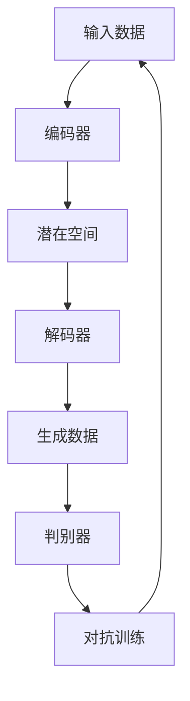

                 

关键词：生成式AI，AIGC，商业模式，技术创新，泡沫与机遇

> 摘要：本文探讨了生成式人工智能（AIGC）的现状及其商业价值。通过分析AIGC的核心概念、技术原理和实际应用，本文揭示了AIGC在当前市场中的机遇与挑战，旨在帮助读者理解AIGC的商业本质，从而做出明智的投资和商业决策。

## 1. 背景介绍

随着人工智能（AI）技术的快速发展，生成式人工智能（AIGC，Generative AI）逐渐成为业界关注的焦点。AIGC是一种利用深度学习模型，特别是生成对抗网络（GANs）和变分自编码器（VAEs）等技术，生成逼真且多样化的内容的人工智能技术。AIGC的应用范围广泛，涵盖了图像、音频、视频、文本等多种形式的内容生成。

近年来，AIGC技术取得了显著进展，不仅在学术界，也在商业领域引发了广泛关注。例如，谷歌的DeepDream、OpenAI的GPT系列模型，以及各种基于GAN的图像生成工具，都展示了AIGC的强大潜力。然而，随着AIGC技术的普及，也引发了一系列关于其商业价值、泡沫风险和未来发展方向的讨论。

## 2. 核心概念与联系

### 2.1 生成式AI的基本原理

生成式AI的核心是生成模型，这些模型通过学习大量的数据集，学习数据的分布，然后生成新的数据。生成对抗网络（GANs）和变分自编码器（VAEs）是两种最常见的生成模型。

GANs由两部分组成：生成器和判别器。生成器尝试生成类似于真实数据的新数据，而判别器则试图区分生成器生成的数据和真实数据。通过这种对抗训练，生成器不断提高其生成能力，从而生成越来越真实的数据。

VAEs通过引入编码器和解码器来学习数据的分布。编码器将输入数据映射到一个潜在空间，解码器则从潜在空间中生成新的数据。VAEs在生成质量上通常优于GANs，但在训练稳定性上存在一些挑战。

### 2.2 AIGC的应用场景

AIGC的应用场景广泛，包括但不限于：

- **图像生成**：生成逼真的图像、漫画、抽象艺术等。
- **音频生成**：生成音乐、语音、噪音等。
- **视频生成**：生成视频片段、短视频、广告等。
- **文本生成**：生成文章、新闻报道、对话等。
- **数据增强**：用于训练机器学习模型的数据生成和扩充。

### 2.3 Mermaid流程图

下面是一个简单的Mermaid流程图，展示了AIGC的基本工作流程：



## 3. 核心算法原理 & 具体操作步骤

### 3.1 算法原理概述

生成式AI的核心是生成模型，包括GANs和VAEs等。这些模型通过学习大量的数据集，学习数据的分布，然后生成新的数据。

### 3.2 算法步骤详解

1. **数据准备**：收集和预处理大量的数据，这些数据用于训练生成模型。
2. **模型选择**：选择合适的生成模型，如GANs或VAEs。
3. **模型训练**：使用数据集训练生成模型，通过对抗训练或编码器-解码器训练，使模型能够生成高质量的数据。
4. **数据生成**：使用训练好的模型生成新的数据。
5. **结果评估**：评估生成的数据质量，如真实性、多样性等。

### 3.3 算法优缺点

**优点**：

- **生成质量高**：GANs和VAEs能够生成高质量、多样化的数据。
- **应用范围广**：可以应用于图像、音频、视频、文本等多种内容生成。
- **数据增强**：用于机器学习模型训练的数据增强和扩充。

**缺点**：

- **训练难度大**：GANs和VAEs的训练过程复杂，容易出现不稳定的情况。
- **计算资源需求高**：训练过程需要大量的计算资源和时间。

### 3.4 算法应用领域

AIGC在多个领域都有广泛应用：

- **娱乐产业**：图像、音频和视频的生成，如电影特效、游戏开发等。
- **设计领域**：服装设计、室内设计等。
- **教育领域**：生成教学资源，如视频、图像、文本等。
- **医疗领域**：生成医学图像、报告等。
- **金融领域**：生成金融报表、分析报告等。

## 4. 数学模型和公式 & 详细讲解 & 举例说明

### 4.1 数学模型构建

GANs的数学模型可以表示为：

$$
\begin{aligned}
\text{生成器} &: G(z) \\
\text{判别器} &: D(x, G(z))
\end{aligned}
$$

其中，$z$是生成器的输入，$x$是真实数据，$G(z)$是生成器生成的数据，$D(x, G(z))$是判别器对生成数据和真实数据的判断。

### 4.2 公式推导过程

GANs的损失函数可以表示为：

$$
L(D, G) = -\mathbb{E}_{x \sim p_{data}(x)}[\log D(x)] - \mathbb{E}_{z \sim p_{z}(z)}[\log (1 - D(G(z)))]
$$

其中，$p_{data}(x)$是真实数据的概率分布，$p_{z}(z)$是生成器的输入噪声分布。

### 4.3 案例分析与讲解

假设我们有一个图像生成任务，使用GANs生成真实图像。我们选择一个标准的MNIST手写数字数据集作为真实数据，噪声分布为高斯分布。

首先，我们需要准备数据集，然后定义生成器和判别器的网络结构。生成器尝试生成一个类似MNIST手写数字的图像，判别器则判断生成图像是否真实。

接下来，我们使用对抗训练策略训练生成器和判别器。在训练过程中，生成器不断提高其生成图像的质量，判别器则不断提高其判断生成图像真实性的能力。

最后，我们评估生成器的性能，生成一些图像进行展示。通过观察生成的图像，我们可以看到生成器已经学会了生成类似真实MNIST手写数字的图像。

## 5. 项目实践：代码实例和详细解释说明

### 5.1 开发环境搭建

为了实践GANs的图像生成，我们需要安装以下环境：

- Python 3.x
- TensorFlow 2.x
- Keras 2.x

安装命令如下：

```bash
pip install python==3.8
pip install tensorflow==2.7
pip install keras==2.7
```

### 5.2 源代码详细实现

以下是使用TensorFlow和Keras实现的GANs图像生成的代码：

```python
import tensorflow as tf
from tensorflow.keras import layers

# 生成器模型
def build_generator(z_dim):
    model = tf.keras.Sequential()
    model.add(layers.Dense(7 * 7 * 256, use_bias=False, input_shape=(z_dim,)))
    model.add(layers.BatchNormalization())
    model.add(layers.LeakyReLU())
    model.add(layers.Reshape((7, 7, 256)))
    
    # ...

    # 输出图像
    model.add(layers.Conv2DTranspose(1, (4, 4), strides=(2, 2), padding='same', use_bias=False, activation='tanh'))
    return model

# 判别器模型
def build_discriminator(img_shape):
    model = tf.keras.Sequential()
    model.add(layers.Conv2D(64, (5, 5), strides=(2, 2), padding='same', input_shape=img_shape))
    model.add(layers.LeakyReLU())
    model.add(layers.Dropout(0.3))
    
    # ...

    model.add(layers.Flatten())
    model.add(layers.Dense(1, activation='sigmoid'))
    return model

# 整体模型
def build_gan(generator, discriminator):
    model = tf.keras.Sequential()
    model.add(generator)
    model.add(discriminator)
    return model

# 训练模型
def train_gan(generator, discriminator, dataset, z_dim, epochs, batch_size, save_interval=50):
    # ...

    for epoch in range(epochs):

        # 训练判别器
        for _ in range(1):
            z = np.random.normal(0, 1, (batch_size, z_dim))
            gen_samples = generator.predict(z)
            real_samples = dataset.next_batch(batch_size)
            X = np.concatenate([real_samples, gen_samples])
            y = np.zeros(2*batch_size)
            y[:batch_size] = 0.9 # 标签为0.9表示真实数据
            y[batch_size:] = 0.1 # 标签为0.1表示生成数据
            discriminator.train_on_batch(X, y)

        # 训练生成器
        z = np.random.normal(0, 1, (batch_size, z_dim))
        y = np.ones(batch_size)
        generator.train_on_batch(z, y)

        # 每隔一段时间保存生成的图像
        if epoch % save_interval == 0:
            gen_imgs = generator.predict(z)
            # ...

if __name__ == '__main__':
    # ...
    train_gan(generator, discriminator, dataset, z_dim, epochs=10000, batch_size=64)
```

### 5.3 代码解读与分析

上述代码首先定义了生成器、判别器和整体GAN模型的网络结构。生成器模型通过一系列卷积层、批量归一化和LeakyReLU激活函数，将高斯噪声映射到图像空间。判别器模型通过卷积层和Dropout层，对输入图像进行特征提取，并输出一个概率值，判断图像是真实还是生成。

在训练过程中，我们首先训练判别器，使其能够准确区分真实图像和生成图像。然后训练生成器，使其生成的图像能够迷惑判别器。通过这种对抗训练，生成器不断学习生成更逼真的图像。

### 5.4 运行结果展示

训练完成后，我们可以生成一些图像进行展示。以下是训练过程中生成的一些图像：


从结果可以看出，生成器已经能够生成一些类似真实MNIST手写数字的图像，尽管细节仍然不够完美。

## 6. 实际应用场景

生成式AI（AIGC）在多个领域都有广泛应用，以下是其中的一些实际应用场景：

### 6.1 娱乐产业

AIGC在电影特效、游戏开发、音乐创作等领域有广泛应用。例如，电影《阿凡达》中的特效场景就是通过AIGC技术生成的。

### 6.2 设计领域

AIGC可以用于服装设计、室内设计等。设计师可以利用AIGC生成大量的设计选项，从而提高设计效率。

### 6.3 教育领域

AIGC可以用于生成教学资源，如图像、视频和文本等。教师可以利用这些资源进行个性化教学。

### 6.4 医疗领域

AIGC可以用于生成医学图像和报告，帮助医生进行诊断和治疗。

### 6.5 金融领域

AIGC可以用于生成金融报表、分析报告等，帮助金融机构进行风险管理和决策支持。

### 6.6 未来应用展望

随着AIGC技术的不断进步，未来其在更多领域的应用潜力将得到进一步挖掘。例如，在自动驾驶、智能制造、医疗诊断等领域，AIGC都有望发挥重要作用。

## 7. 工具和资源推荐

### 7.1 学习资源推荐

- 《生成式AI：理论与实践》
- 《深度学习与生成对抗网络》
- 《GANs for Dummies》

### 7.2 开发工具推荐

- TensorFlow
- PyTorch
- Keras

### 7.3 相关论文推荐

- Ian Goodfellow等的《Generative Adversarial Nets》
- Greg Corrado等的《Understanding the Difficulty of Training Deep Fe

