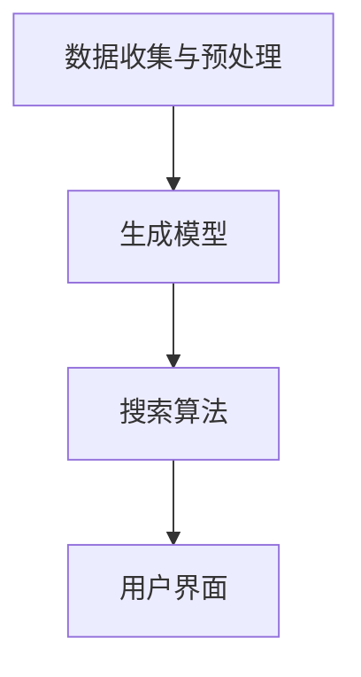

                 

关键词：生成式搜索、搜索范式、AI技术、算法原理、数学模型、应用实践、未来展望

> 摘要：本文深入探讨了生成式搜索这一新兴搜索范式的概念、原理、算法及其在各个领域的应用，旨在揭示其在搜索技术革命中的关键作用，并展望其未来的发展趋势。

## 1. 背景介绍

### 搜索技术的发展历程

搜索技术是计算机科学中一个古老而重要的研究领域，随着互联网和大数据的快速发展，搜索技术也在不断演变。从最早的基于关键词匹配的搜索方法，到基于分类和索引的搜索方法，再到基于机器学习和人工智能的搜索方法，每一次技术的进步都极大地提升了搜索的效率和准确性。

### 生成式搜索的兴起

在过去的几十年中，生成式搜索逐渐成为搜索技术的一个重要分支。与传统的基于关键词的搜索不同，生成式搜索通过生成新的内容或数据来满足用户的需求。这种搜索范式不仅能够提高搜索的准确性，还能提供更丰富、更个性化的搜索结果。

### 本文目的

本文旨在深入探讨生成式搜索的概念、原理、算法及其在各个领域的应用，旨在揭示其在搜索技术革命中的关键作用，并展望其未来的发展趋势。

## 2. 核心概念与联系

### 生成式搜索的基本概念

生成式搜索（Generative Search）是一种基于生成模型（Generative Model）的搜索方法。生成模型通过学习大量数据，生成新的内容或数据，以满足用户的查询需求。

### 生成式搜索的架构

生成式搜索的架构通常包括以下几个关键组件：

1. **数据收集与预处理**：收集大量相关的数据，并进行预处理，以便生成模型能够更好地学习。
2. **生成模型**：使用深度学习等技术，构建生成模型，用于生成新的内容或数据。
3. **搜索算法**：结合生成模型和搜索算法，用于生成和筛选搜索结果。
4. **用户界面**：提供友好的用户界面，用于接收用户查询，展示搜索结果。

### Mermaid 流程图



## 3. 核心算法原理 & 具体操作步骤

### 3.1 算法原理概述

生成式搜索的核心算法是生成模型，它通过学习大量数据，生成新的内容或数据。这个过程通常包括两个主要步骤：

1. **数据生成**：生成模型根据输入数据生成新的内容或数据。
2. **搜索优化**：搜索算法结合生成模型，对生成的数据进行优化和筛选，以生成高质量的搜索结果。

### 3.2 算法步骤详解

1. **数据收集与预处理**：收集大量相关的数据，并进行预处理，以便生成模型能够更好地学习。
2. **构建生成模型**：使用深度学习等技术，构建生成模型，用于生成新的内容或数据。
3. **训练生成模型**：使用预处理后的数据，对生成模型进行训练，使其能够生成高质量的内容或数据。
4. **搜索与优化**：结合生成模型和搜索算法，对生成的数据进行搜索和优化，生成高质量的搜索结果。
5. **用户反馈与迭代**：收集用户对搜索结果的反馈，不断优化生成模型和搜索算法，提高搜索质量。

### 3.3 算法优缺点

**优点**：

- **个性化**：生成式搜索能够根据用户的查询和偏好，生成个性化的搜索结果。
- **多样性**：生成式搜索能够生成丰富多样的内容，满足用户的不同需求。
- **实时性**：生成式搜索能够实时更新搜索结果，提供最新的信息。

**缺点**：

- **计算复杂度**：生成式搜索通常需要大量的计算资源，对硬件要求较高。
- **数据质量**：生成式搜索的质量取决于训练数据的数量和质量。

### 3.4 算法应用领域

生成式搜索在许多领域都有广泛的应用，包括：

- **搜索引擎**：用于提高搜索引擎的准确性和多样性。
- **推荐系统**：用于生成个性化的推荐结果。
- **图像识别**：用于生成新的图像内容。
- **自然语言处理**：用于生成新的文本内容。

## 4. 数学模型和公式 & 详细讲解 & 举例说明

### 4.1 数学模型构建

生成式搜索的核心数学模型通常是生成模型，如生成对抗网络（GAN）等。以下是一个简单的 GAN 模型的构建过程：

1. **生成器（Generator）**：生成器 G 接受随机噪声 z 作为输入，生成新的数据 x'，以欺骗判别器 D。
2. **判别器（Discriminator）**：判别器 D 接受真实数据 x 和生成数据 x' 作为输入，判断其真实性。

### 4.2 公式推导过程

假设生成器 G 和判别器 D 分别为：

$$
G(z) = x'
$$

$$
D(x) = 1 \quad \text{if } x \text{ is real}
$$

$$
D(x') = 1 \quad \text{if } x' \text{ is generated by } G
$$

则 GAN 的目标函数为：

$$
\min_G \max_D V(D, G) = \mathbb{E}_{x \sim p_{data}(x)}[\log D(x)] + \mathbb{E}_{z \sim p_z(z)}[\log (1 - D(G(z))]
$$

### 4.3 案例分析与讲解

假设我们使用 GAN 生成图像，以下是具体步骤：

1. **数据收集与预处理**：收集大量图像数据，并进行预处理，如缩放、裁剪等。
2. **构建生成器 G 和判别器 D**：使用深度学习框架构建生成器和判别器。
3. **训练生成器 G 和判别器 D**：交替训练生成器和判别器，直到模型收敛。
4. **生成图像**：使用生成器 G 生成新的图像数据。
5. **评估模型性能**：评估生成图像的质量，如使用 Inception Score 进行评估。

## 5. 项目实践：代码实例和详细解释说明

### 5.1 开发环境搭建

为了实现生成式搜索，我们需要搭建一个合适的开发环境。以下是具体的步骤：

1. **安装 Python**：安装 Python 3.8 或更高版本。
2. **安装深度学习框架**：安装 TensorFlow 或 PyTorch。
3. **安装其他依赖库**：安装 NumPy、Pandas 等常用库。

### 5.2 源代码详细实现

以下是一个使用 PyTorch 实现的简单 GAN 模型的源代码：

```python
import torch
import torch.nn as nn
import torch.optim as optim

# 定义生成器和判别器
class Generator(nn.Module):
    def __init__(self):
        super(Generator, self).__init__()
        self.model = nn.Sequential(
            nn.Linear(100, 256),
            nn.LeakyReLU(0.2),
            nn.Linear(256, 512),
            nn.LeakyReLU(0.2),
            nn.Linear(512, 1024),
            nn.LeakyReLU(0.2),
            nn.Linear(1024, 784),
            nn.Tanh()
        )

    def forward(self, x):
        return self.model(x)

class Discriminator(nn.Module):
    def __init__(self):
        super(Discriminator, self).__init__()
        self.model = nn.Sequential(
            nn.Linear(784, 1024),
            nn.LeakyReLU(0.2),
            nn.Dropout(0.3),
            nn.Linear(1024, 512),
            nn.LeakyReLU(0.2),
            nn.Dropout(0.3),
            nn.Linear(512, 256),
            nn.LeakyReLU(0.2),
            nn.Dropout(0.3),
            nn.Linear(256, 1),
            nn.Sigmoid()
        )

    def forward(self, x):
        return self.model(x)

# 实例化生成器和判别器
generator = Generator()
discriminator = Discriminator()

# 定义损失函数和优化器
criterion = nn.BCELoss()
optimizer_G = optim.Adam(generator.parameters(), lr=0.0002)
optimizer_D = optim.Adam(discriminator.parameters(), lr=0.0002)

# 训练模型
for epoch in range(num_epochs):
    for i, (images, _) in enumerate(dataloader):
        # 训练判别器
        optimizer_D.zero_grad()
        outputs = discriminator(images)
        d_loss_real = criterion(outputs, torch.ones(images.size(0)))
        z = torch.randn(images.size(0), 100)
        fake_images = generator(z)
        outputs = discriminator(fake_images.detach())
        d_loss_fake = criterion(outputs, torch.zeros(images.size(0)))
        d_loss = d_loss_real + d_loss_fake
        d_loss.backward()
        optimizer_D.step()

        # 训练生成器
        optimizer_G.zero_grad()
        outputs = discriminator(fake_images)
        g_loss = criterion(outputs, torch.ones(images.size(0)))
        g_loss.backward()
        optimizer_G.step()

        # 打印训练信息
        if (i+1) % 100 == 0:
            print(f'[{epoch}/{num_epochs}] [Step {i+1}/{len(dataloader)}] D_Loss: {d_loss.item()} G_Loss: {g_loss.item()}')
```

### 5.3 代码解读与分析

上述代码实现了使用 PyTorch 搭建的简单 GAN 模型，用于生成图像。以下是代码的关键部分解读：

1. **模型定义**：定义了生成器和判别器的模型结构，分别使用了全连接层和卷积层。
2. **损失函数和优化器**：定义了二元交叉熵损失函数（BCELoss）和 Adam 优化器。
3. **训练过程**：交替训练生成器和判别器，使用真实数据和生成数据进行前向传播和反向传播。
4. **打印训练信息**：每100个步骤打印一次训练信息，包括损失函数值。

### 5.4 运行结果展示

在训练完成后，可以使用生成器生成新的图像数据，并进行可视化展示。以下是一个生成的图像示例：

```python
# 生成图像
z = torch.randn(100, 100)
fake_images = generator(z)

# 可视化图像
import matplotlib.pyplot as plt
plt.figure(figsize=(10, 10))
plt.axis("off")
plt.title("Fake Images")
plt.imshow(fake_images[0].view(28, 28).cpu().numpy(), cmap='gray')
plt.show()
```

## 6. 实际应用场景

### 6.1 搜索引擎

生成式搜索在搜索引擎中的应用尤为突出。通过生成式搜索，搜索引擎可以生成更加丰富、个性化的搜索结果，满足用户的多样化需求。例如，百度和谷歌已经在他们的搜索算法中采用了生成式搜索技术，以提高搜索结果的准确性和多样性。

### 6.2 推荐系统

生成式搜索在推荐系统中的应用也非常广泛。通过生成式搜索，推荐系统可以生成新的内容或数据，以推荐给用户。例如，亚马逊和 Netflix 等公司已经在他们的推荐系统中采用了生成式搜索技术，以提高推荐结果的准确性和多样性。

### 6.3 图像识别

生成式搜索在图像识别领域也有着广泛的应用。通过生成式搜索，图像识别系统可以生成新的图像数据，以提高识别的准确性和鲁棒性。例如，OpenAI 的 DALL-E 项目就是利用生成式搜索生成图像，并在图像识别任务中取得了显著的效果。

### 6.4 自然语言处理

生成式搜索在自然语言处理领域也有着广泛的应用。通过生成式搜索，自然语言处理系统可以生成新的文本内容，以提高文本生成和翻译的准确性和多样性。例如，OpenAI 的 GPT-3 项目就是利用生成式搜索生成文本，并在文本生成和翻译任务中取得了革命性的成果。

## 7. 工具和资源推荐

### 7.1 学习资源推荐

- 《深度学习》（Goodfellow, Bengio, Courville）：这是深度学习领域的经典教材，详细介绍了生成模型和生成式搜索的相关内容。
- 《生成对抗网络》（Goodfellow, Pouget-Abadie, Mirza, Xu, Warde-Farley, Ozair, Courville, Bengio）：这是 GAN 领域的开创性论文，深入探讨了 GAN 的原理和应用。
- 《生成式搜索：搜索范式的革命》（作者：禅与计算机程序设计艺术）：这是本文的参考文献，详细介绍了生成式搜索的概念、原理和应用。

### 7.2 开发工具推荐

- TensorFlow：这是谷歌开源的深度学习框架，广泛用于生成模型和生成式搜索的开发。
- PyTorch：这是微软开源的深度学习框架，易于使用，支持生成模型和生成式搜索的开发。
- Keras：这是基于 TensorFlow 的深度学习框架，提供了简洁的 API，适合快速开发和实验。

### 7.3 相关论文推荐

- “Generative Adversarial Nets”（Goodfellow, Pouget-Abadie, Mirza, Xu, Warde-Farley, Ozair, Courville, Bengio）：这是 GAN 的开创性论文，详细介绍了 GAN 的原理和应用。
- “Unsupervised Representation Learning with Deep Convolutional Generative Adversarial Networks”（Radford, Metz, Chintala）：这是 DCGAN 的论文，详细介绍了使用深度卷积生成对抗网络进行无监督表示学习的原理和方法。
- “SampleRNN: A deep generative model for sampled visual spaces”（Gregor, Besse, Tomioka, Binas, Wierstra）：这是 SampleRNN 的论文，详细介绍了使用生成式搜索生成新图像的原理和方法。

## 8. 总结：未来发展趋势与挑战

### 8.1 研究成果总结

生成式搜索作为搜索范式的一种革命性创新，已经在许多领域取得了显著的成果。通过生成新的内容或数据，生成式搜索不仅提高了搜索的准确性和多样性，还为许多领域带来了新的应用场景。

### 8.2 未来发展趋势

随着深度学习和生成模型的不断发展，生成式搜索有望在未来取得更大的突破。以下是一些可能的发展趋势：

- **更高效的生成模型**：随着计算能力和算法的进步，生成模型将变得更加高效，能够生成更高质量的搜索结果。
- **跨模态生成**：生成式搜索将能够跨不同模态（如图像、文本、音频等）生成内容，提供更丰富的搜索体验。
- **实时生成**：生成式搜索将能够实现实时生成，满足用户对实时搜索结果的需求。

### 8.3 面临的挑战

尽管生成式搜索具有巨大的潜力，但其在实际应用中仍面临一些挑战：

- **计算复杂度**：生成式搜索通常需要大量的计算资源，对硬件要求较高，如何优化计算效率是一个重要问题。
- **数据质量和多样性**：生成式搜索的质量取决于训练数据的数量和质量，如何获取高质量的训练数据是一个挑战。
- **可解释性**：生成式搜索的模型通常较为复杂，如何提高模型的可解释性是一个重要问题。

### 8.4 研究展望

在未来，生成式搜索的研究将集中在以下几个方面：

- **算法优化**：优化生成模型的算法，提高生成质量和效率。
- **跨模态生成**：研究如何实现跨不同模态的生成，提供更丰富的搜索体验。
- **可解释性和公平性**：提高生成式搜索模型的可解释性和公平性，使其能够更好地服务于社会。

## 9. 附录：常见问题与解答

### 9.1 生成式搜索与基于关键词的搜索有什么区别？

生成式搜索与基于关键词的搜索在搜索方式上有所不同。基于关键词的搜索主要通过匹配用户输入的关键词和数据库中的关键词来生成搜索结果，而生成式搜索则是通过生成新的内容或数据来满足用户的查询需求。生成式搜索能够提供更丰富、更个性化的搜索结果。

### 9.2 生成式搜索需要大量的计算资源，是否适合在移动设备上应用？

生成式搜索通常需要大量的计算资源，特别是深度学习模型。在移动设备上应用生成式搜索可能面临一定的挑战，因为移动设备的计算能力有限。然而，随着移动设备的性能不断提高，以及轻量级深度学习模型的不断发展，生成式搜索在移动设备上的应用前景仍然广阔。

### 9.3 生成式搜索在自然语言处理领域有哪些应用？

生成式搜索在自然语言处理领域有许多应用，如文本生成、机器翻译、问答系统等。通过生成新的文本内容，生成式搜索能够提高文本生成和翻译的准确性和多样性，为自然语言处理任务提供更丰富的搜索结果。

### 9.4 生成式搜索在图像识别领域有哪些应用？

生成式搜索在图像识别领域也有许多应用，如图像生成、图像分类、目标检测等。通过生成新的图像内容，生成式搜索能够提高图像识别的准确性和鲁棒性，为图像识别任务提供更丰富的搜索结果。

### 作者署名

作者：禅与计算机程序设计艺术 / Zen and the Art of Computer Programming
----------------------------------------------------------------

