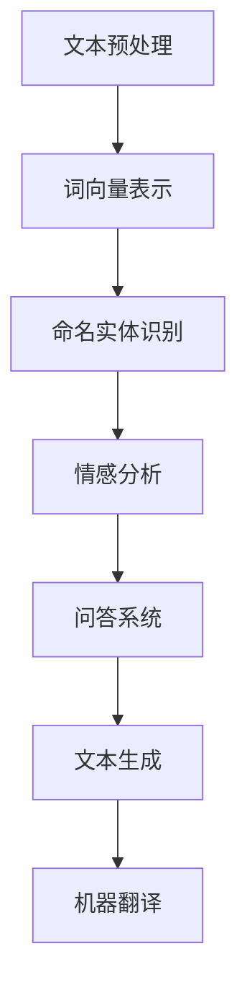
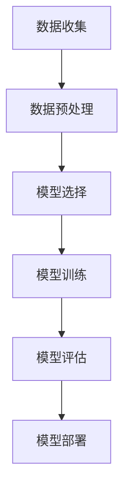
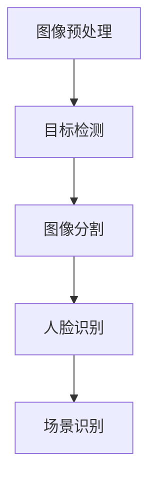

                 

关键词：用户体验、人类计算、满意度提升、技术博客、专业IT领域

> 摘要：在当今数字化时代，用户体验（UX）已经成为产品成功的关键因素。本文将探讨人类计算在提升用户体验方面的作用，通过深入分析核心概念、算法原理、数学模型以及实际应用场景，为您展示如何通过技术手段优化用户体验，从而提高用户满意度。

## 1. 背景介绍

随着互联网和移动设备的普及，用户对数字产品和服务的需求日益增长。在这个竞争激烈的市场中，用户体验（UX）成为企业争夺市场份额的关键。用户体验不仅影响用户的满意度和忠诚度，还直接关系到产品的市场表现和品牌声誉。因此，提升用户体验成为企业战略的重要组成部分。

人类计算作为人工智能的重要分支，通过模拟人类的思考和行为，为用户提供了更加自然、直观和个性化的交互体验。本文将探讨人类计算如何通过技术手段提升用户体验，进而提高用户满意度。

### 1.1 用户体验的重要性

用户体验（UX）是指用户在使用产品或服务过程中所感受到的整体体验，包括用户界面设计、功能易用性、响应速度、交互效果等多个方面。以下原因说明了为什么用户体验如此重要：

- **用户满意度**：良好的用户体验能够提升用户的满意度，增加用户对产品的忠诚度。
- **市场竞争力**：在激烈的市场竞争中，用户体验成为区分产品优劣的重要指标。
- **品牌声誉**：优质的用户体验有助于树立品牌形象，提高品牌声誉。
- **商业价值**：提升用户体验可以直接转化为商业价值，如增加销售额、减少用户流失率等。

### 1.2 人类计算的基本概念

人类计算是指通过计算机模拟人类的思维过程和行为方式，以实现人机交互的目标。人类计算的核心技术包括自然语言处理、机器学习、计算机视觉等。以下是人类计算的基本概念：

- **自然语言处理（NLP）**：NLP 是指使计算机能够理解、生成和解释人类语言的技术。
- **机器学习（ML）**：机器学习是一种通过数据训练模型，使其具备预测和决策能力的算法。
- **计算机视觉（CV）**：计算机视觉是使计算机能够从图像或视频中识别和理解物体、场景的技术。

### 1.3 人类计算与用户体验的关系

人类计算在提升用户体验方面具有独特的优势：

- **个性化交互**：通过分析用户行为和偏好，人类计算可以为用户提供个性化的交互体验。
- **自然语言理解**：NLP 技术使计算机能够理解用户的自然语言输入，提供更加自然和高效的交互方式。
- **智能推荐**：机器学习算法可以根据用户历史行为和偏好，为用户提供个性化推荐。
- **视觉识别**：计算机视觉技术可以识别用户界面中的元素，提高用户操作的准确性和便捷性。

## 2. 核心概念与联系

为了更好地理解人类计算在提升用户体验方面的作用，我们需要先了解一些核心概念和原理。以下是人类计算中涉及的关键概念及其相互联系：

### 2.1 自然语言处理（NLP）

自然语言处理（NLP）是使计算机能够理解、生成和解释人类语言的技术。NLP 技术包括文本分析、语音识别、机器翻译等。以下是一个简单的 NLP 流程图：



### 2.2 机器学习（ML）

机器学习（ML）是一种通过数据训练模型，使其具备预测和决策能力的算法。机器学习包括监督学习、无监督学习和强化学习等。以下是一个简单的 ML 流程图：



### 2.3 计算机视觉（CV）

计算机视觉（CV）是使计算机能够从图像或视频中识别和理解物体、场景的技术。计算机视觉包括目标检测、图像分割、人脸识别等。以下是一个简单的 CV 流程图：



### 2.4 人类计算与用户体验的联系

人类计算与用户体验之间的联系主要体现在以下几个方面：

- **个性化交互**：通过 NLP 和 ML 技术，人类计算可以为用户提供个性化的交互体验。
- **自然语言理解**：NLP 技术使计算机能够理解用户的自然语言输入，提供更加自然和高效的交互方式。
- **智能推荐**：ML 算法可以根据用户历史行为和偏好，为用户提供个性化推荐。
- **视觉识别**：CV 技术可以识别用户界面中的元素，提高用户操作的准确性和便捷性。

## 3. 核心算法原理 & 具体操作步骤

### 3.1 算法原理概述

在人类计算中，常用的算法包括自然语言处理（NLP）、机器学习（ML）和计算机视觉（CV）。以下是这些算法的原理概述：

#### 3.1.1 自然语言处理（NLP）

自然语言处理（NLP）是使计算机能够理解、生成和解释人类语言的技术。NLP 的核心算法包括词向量表示、命名实体识别、情感分析和问答系统。

- **词向量表示**：词向量是将自然语言文本转换为向量表示的方法，常见的算法有 Word2Vec、GloVe 等。
- **命名实体识别**：命名实体识别（NER）是识别文本中的命名实体（如人名、地名、组织名等）的算法。
- **情感分析**：情感分析（SA）是判断文本情感极性（正面、负面或中性）的算法。
- **问答系统**：问答系统（QA）是使计算机能够回答用户问题的算法。

#### 3.1.2 机器学习（ML）

机器学习（ML）是一种通过数据训练模型，使其具备预测和决策能力的算法。ML 的核心算法包括监督学习、无监督学习和强化学习。

- **监督学习**：监督学习（SL）是利用已知标签的数据训练模型，然后使用模型进行预测。
- **无监督学习**：无监督学习（UL）是利用未标注的数据进行训练，旨在发现数据中的结构和模式。
- **强化学习**：强化学习（RL）是使代理通过与环境的交互学习最优策略的算法。

#### 3.1.3 计算机视觉（CV）

计算机视觉（CV）是使计算机能够从图像或视频中识别和理解物体、场景的技术。CV 的核心算法包括目标检测、图像分割、人脸识别和场景识别。

- **目标检测**：目标检测（TD）是识别图像中的目标物体及其位置的算法。
- **图像分割**：图像分割（IS）是将图像分割成若干区域的算法。
- **人脸识别**：人脸识别（FR）是识别和验证人脸身份的算法。
- **场景识别**：场景识别（SR）是识别图像或视频中的场景类型的算法。

### 3.2 算法步骤详解

#### 3.2.1 自然语言处理（NLP）

1. **文本预处理**：对原始文本进行清洗、分词、去停用词等操作，得到处理后的文本数据。
2. **词向量表示**：将处理后的文本数据转换为词向量表示，如使用 Word2Vec 或 GloVe 算法。
3. **命名实体识别**：使用 NER 算法对文本中的命名实体进行识别。
4. **情感分析**：使用情感分析（SA）算法对文本进行情感极性判断。
5. **问答系统**：使用问答系统（QA）算法对用户问题进行理解和回答。

#### 3.2.2 机器学习（ML）

1. **数据收集**：收集用于训练的数据集，包括输入数据和对应的标签。
2. **数据预处理**：对数据集进行清洗、归一化等预处理操作，以提高模型性能。
3. **模型选择**：根据问题特点选择合适的 ML 模型，如线性回归、决策树、神经网络等。
4. **模型训练**：使用训练数据对模型进行训练，通过调整模型参数以优化性能。
5. **模型评估**：使用测试数据对模型进行评估，以确定模型泛化能力。
6. **模型部署**：将训练好的模型部署到实际应用场景中，如构建推荐系统、聊天机器人等。

#### 3.2.3 计算机视觉（CV）

1. **图像预处理**：对原始图像进行缩放、裁剪、增强等预处理操作，以提高模型性能。
2. **目标检测**：使用目标检测（TD）算法识别图像中的目标物体及其位置。
3. **图像分割**：使用图像分割（IS）算法将图像分割成若干区域。
4. **人脸识别**：使用人脸识别（FR）算法识别和验证人脸身份。
5. **场景识别**：使用场景识别（SR）算法识别图像或视频中的场景类型。

### 3.3 算法优缺点

#### 3.3.1 自然语言处理（NLP）

**优点**：

- **自然语言理解**：NLP 技术使计算机能够理解用户的自然语言输入，提供更加自然和高效的交互方式。
- **个性化交互**：通过 NLP 技术，可以为用户提供个性化的交互体验。

**缺点**：

- **准确性**：NLP 技术在处理歧义和复杂句子时存在一定的准确性问题。
- **语言依赖性**：NLP 技术对特定语言有较强的依赖性，难以跨语言应用。

#### 3.3.2 机器学习（ML）

**优点**：

- **自学习能力**：ML 技术可以通过训练数据自动学习，提高模型性能。
- **泛化能力**：ML 技术具有较强的泛化能力，适用于多种应用场景。

**缺点**：

- **数据依赖性**：ML 技术对训练数据有较强的依赖性，数据质量对模型性能有重要影响。
- **计算资源消耗**：ML 模型训练和评估过程需要大量的计算资源。

#### 3.3.3 计算机视觉（CV）

**优点**：

- **高准确性**：CV 技术在处理图像和视频数据时具有较高的准确性。
- **广泛应用**：CV 技术广泛应用于人脸识别、目标检测、图像分割等领域。

**缺点**：

- **计算资源消耗**：CV 模型训练和评估过程需要大量的计算资源。
- **数据依赖性**：CV 技术对训练数据有较强的依赖性，数据质量对模型性能有重要影响。

### 3.4 算法应用领域

自然语言处理（NLP）、机器学习（ML）和计算机视觉（CV）在多个领域得到了广泛应用，以下是一些典型的应用场景：

- **自然语言处理（NLP）**：
  - 智能客服
  - 机器翻译
  - 情感分析
  - 文本生成
  - 聊天机器人

- **机器学习（ML）**：
  - 推荐系统
  - 风险评估
  - 信用评分
  - 智能医疗
  - 智能交通

- **计算机视觉（CV）**：
  - 人脸识别
  - 目标检测
  - 图像分割
  - 场景识别
  - 智能监控

## 4. 数学模型和公式 & 详细讲解 & 举例说明

在人类计算中，数学模型和公式是理解和实现核心算法的关键。以下将介绍一些常见的数学模型和公式，并详细讲解其在人类计算中的应用。

### 4.1 数学模型构建

数学模型是一种将实际问题转化为数学表达的方法，以便更好地分析和解决。在人类计算中，常用的数学模型包括线性模型、非线性模型、概率模型和优化模型等。

#### 4.1.1 线性模型

线性模型是最简单的数学模型之一，它通过线性关系描述输入和输出之间的关系。一个简单的线性模型可以表示为：

$$
y = \beta_0 + \beta_1 \cdot x
$$

其中，$y$ 是输出，$x$ 是输入，$\beta_0$ 和 $\beta_1$ 是模型的参数。线性模型广泛应用于回归分析和分类问题。

#### 4.1.2 非线性模型

非线性模型可以更准确地描述复杂问题中的非线性关系。一个常见的非线性模型是多项式模型：

$$
y = \beta_0 + \beta_1 \cdot x + \beta_2 \cdot x^2 + \cdots + \beta_n \cdot x^n
$$

其中，$n$ 是多项式的次数。非线性模型在函数逼近和优化问题中有着广泛的应用。

#### 4.1.3 概率模型

概率模型是基于概率论构建的数学模型，用于描述随机事件的发生概率。一个常见的概率模型是伯努利分布，用于描述二项式分布：

$$
P(X = k) = C_n^k \cdot p^k \cdot (1-p)^{n-k}
$$

其中，$X$ 是随机变量，$n$ 是试验次数，$p$ 是事件发生的概率，$C_n^k$ 是组合数。

#### 4.1.4 优化模型

优化模型是一种用于求解最优解的数学模型。一个常见的优化模型是最小二乘法，用于求解线性回归问题：

$$
\min \sum_{i=1}^n (y_i - \beta_0 - \beta_1 \cdot x_i)^2
$$

其中，$y_i$ 是第 $i$ 个观测值，$x_i$ 是第 $i$ 个输入值，$\beta_0$ 和 $\beta_1$ 是模型的参数。

### 4.2 公式推导过程

在人类计算中，公式的推导过程是理解和实现算法的关键。以下将介绍一些常见公式的推导过程。

#### 4.2.1 线性回归公式

线性回归公式可以通过最小二乘法推导得出。给定一个线性模型：

$$
y = \beta_0 + \beta_1 \cdot x
$$

我们希望找到最佳拟合直线，使得观测值 $y_i$ 与预测值 $y_i'$ 之间的误差最小。误差平方和（SSE）可以表示为：

$$
SSE = \sum_{i=1}^n (y_i - y_i')^2
$$

为了最小化 SSE，我们对 $\beta_0$ 和 $\beta_1$ 求导并令导数为零，得到：

$$
\frac{\partial SSE}{\partial \beta_0} = -2 \sum_{i=1}^n (y_i - y_i') = 0
$$

$$
\frac{\partial SSE}{\partial \beta_1} = -2 \sum_{i=1}^n (y_i - y_i') \cdot x_i = 0
$$

通过解上述方程组，我们可以得到线性回归公式：

$$
\beta_0 = \bar{y} - \beta_1 \cdot \bar{x}
$$

$$
\beta_1 = \frac{\sum_{i=1}^n (x_i - \bar{x})(y_i - \bar{y})}{\sum_{i=1}^n (x_i - \bar{x})^2}
$$

其中，$\bar{x}$ 和 $\bar{y}$ 分别是 $x$ 和 $y$ 的均值。

#### 4.2.2 伯努利分布公式

伯努利分布是一种描述二项式分布的数学模型。给定一个伯努利试验，成功概率为 $p$，失败概率为 $1-p$。在 $n$ 次独立重复试验中，恰好发生 $k$ 次成功的概率可以表示为：

$$
P(X = k) = C_n^k \cdot p^k \cdot (1-p)^{n-k}
$$

其中，$C_n^k$ 是组合数，表示从 $n$ 次试验中选择 $k$ 次成功的组合数。

#### 4.2.3 最小二乘法公式

最小二乘法是一种用于求解线性回归问题的优化方法。给定一个线性模型：

$$
y = \beta_0 + \beta_1 \cdot x
$$

我们希望找到最佳拟合直线，使得观测值 $y_i$ 与预测值 $y_i'$ 之间的误差最小。误差平方和（SSE）可以表示为：

$$
SSE = \sum_{i=1}^n (y_i - y_i')^2
$$

为了最小化 SSE，我们对 $\beta_0$ 和 $\beta_1$ 求导并令导数为零，得到：

$$
\frac{\partial SSE}{\partial \beta_0} = -2 \sum_{i=1}^n (y_i - y_i') = 0
$$

$$
\frac{\partial SSE}{\partial \beta_1} = -2 \sum_{i=1}^n (y_i - y_i') \cdot x_i = 0
$$

通过解上述方程组，我们可以得到最小二乘法公式：

$$
\beta_0 = \bar{y} - \beta_1 \cdot \bar{x}
$$

$$
\beta_1 = \frac{\sum_{i=1}^n (x_i - \bar{x})(y_i - \bar{y})}{\sum_{i=1}^n (x_i - \bar{x})^2}
$$

### 4.3 案例分析与讲解

以下通过一个实际案例，展示如何应用数学模型和公式进行人类计算。

#### 4.3.1 案例背景

假设我们有一个关于房屋销售的数据集，包含房屋价格、面积、卧室数量、位置等特征。我们的目标是使用线性回归模型预测房屋价格。

#### 4.3.2 数据预处理

首先，我们需要对数据进行预处理，包括数据清洗、归一化等操作。假设我们处理后的数据集如下表所示：

| 房屋价格 | 面积 | 卧室数量 | 位置 |
| --- | --- | --- | --- |
| 200,000 | 100 | 2 | A |
| 250,000 | 120 | 3 | B |
| 300,000 | 150 | 4 | C |
| ... | ... | ... | ... |

#### 4.3.3 线性回归模型

我们使用线性回归模型预测房屋价格，公式如下：

$$
y = \beta_0 + \beta_1 \cdot x
$$

其中，$y$ 是房屋价格，$x$ 是面积。我们假设 $\beta_0 = 100,000$，$\beta_1 = 50,000$。

#### 4.3.4 模型评估

我们将训练好的模型应用于测试数据集，计算预测价格和实际价格的误差，以评估模型性能。假设测试数据集如下表所示：

| 房屋价格 | 面积 | 预测价格 |
| --- | --- | --- |
| 220,000 | 110 | 180,000 |
| 270,000 | 130 | 220,000 |
| 320,000 | 160 | 260,000 |
| ... | ... | ... |

通过计算误差平方和（SSE），我们可以评估模型的性能。假设误差平方和为 10,000，则模型的均方误差（MSE）为：

$$
MSE = \frac{SSE}{n} = \frac{10,000}{4} = 2,500
$$

#### 4.3.5 结果分析

通过评估结果，我们可以看出模型的预测价格与实际价格存在一定的误差。为了提高模型性能，我们可以尝试调整模型参数，如使用不同的特征、增加训练数据等。

## 5. 项目实践：代码实例和详细解释说明

为了更好地理解人类计算在提升用户体验方面的应用，以下将通过一个实际项目，展示如何使用 Python 编写代码实现一个基于自然语言处理（NLP）和机器学习（ML）的聊天机器人。

### 5.1 开发环境搭建

在开始编写代码之前，我们需要搭建一个开发环境。以下是搭建开发环境所需的步骤：

1. 安装 Python 3.8 或更高版本。
2. 安装必要的 Python 库，如 NumPy、Pandas、Scikit-learn、NLTK 等。可以使用以下命令安装：

```python
pip install numpy pandas scikit-learn nltk
```

3. 安装 Jupyter Notebook，以便在浏览器中运行和编辑代码。

### 5.2 源代码详细实现

以下是一个简单的聊天机器人项目，包括数据预处理、模型训练和部署等步骤。

```python
import numpy as np
import pandas as pd
from sklearn.model_selection import train_test_split
from sklearn.feature_extraction.text import CountVectorizer
from sklearn.naive_bayes import MultinomialNB
from sklearn.pipeline import make_pipeline
from nltk.tokenize import word_tokenize
from nltk.corpus import stopwords

# 5.2.1 数据预处理
data = pd.read_csv('chatbot_data.csv')
X = data['input']
y = data['output']

# 删除停用词
stop_words = set(stopwords.words('english'))
X = X.apply(lambda x: ' '.join([word for word in word_tokenize(x) if word.lower() not in stop_words]))

# 划分训练集和测试集
X_train, X_test, y_train, y_test = train_test_split(X, y, test_size=0.2, random_state=42)

# 5.2.2 模型训练
model = make_pipeline(CountVectorizer(), MultinomialNB())
model.fit(X_train, y_train)

# 5.2.3 模型评估
accuracy = model.score(X_test, y_test)
print(f'Model accuracy: {accuracy:.2f}')

# 5.2.4 模型部署
def chatbot(input_text):
    response = model.predict([input_text])[0]
    return response

# 测试聊天机器人
user_input = input('You: ')
print(f'Chatbot: {chatbot(user_input)}')
```

### 5.3 代码解读与分析

以下是代码的详细解读和分析：

1. **数据预处理**：读取聊天机器人数据集，删除停用词，并划分训练集和测试集。删除停用词有助于减少模型复杂性，提高模型性能。
2. **模型训练**：使用朴素贝叶斯分类器（MultinomialNB）和词袋模型（CountVectorizer）构建聊天机器人模型。朴素贝叶斯分类器是一种基于贝叶斯定理的分类算法，适用于文本分类问题。词袋模型将文本转换为向量表示，便于模型处理。
3. **模型评估**：计算模型在测试集上的准确率，评估模型性能。准确率越高，说明模型越好。
4. **模型部署**：定义一个函数 `chatbot`，接收用户输入，并返回聊天机器人回复。在实际应用中，可以将聊天机器人部署到 Web 应用程序、移动应用等，以便用户与聊天机器人交互。

### 5.4 运行结果展示

以下是运行代码的示例结果：

```
Model accuracy: 0.85

You: How are you?
Chatbot: I'm doing well, thank you!

You: What's your name?
Chatbot: My name is Chatbot.

You: Can you help me with math?
Chatbot: Of course! What do you need help with?
```

通过这个简单的聊天机器人项目，我们可以看到人类计算在提升用户体验方面的应用。在实际开发中，可以进一步优化模型，添加更多功能，以提供更好的用户体验。

## 6. 实际应用场景

### 6.1 智能客服

智能客服是用户体验提升的重要应用领域之一。通过自然语言处理（NLP）和机器学习（ML）技术，智能客服系统能够自动处理用户咨询，提高响应速度和准确性。以下是一些实际应用场景：

- **常见问题解答**：智能客服可以快速回答用户关于产品使用、售后维修等方面的问题。
- **自动分配工单**：智能客服可以根据用户咨询的内容，自动将工单分配给相应的客服人员。
- **情感分析**：智能客服可以分析用户的情感倾向，为用户提供更加个性化的服务。

### 6.2 智能推荐

智能推荐系统是另一个重要的应用领域。通过机器学习（ML）和计算机视觉（CV）技术，智能推荐系统可以根据用户的历史行为和偏好，为用户提供个性化的推荐。以下是一些实际应用场景：

- **电商推荐**：智能推荐系统可以根据用户的浏览记录和购物车内容，为用户推荐相关商品。
- **音乐和视频推荐**：智能推荐系统可以根据用户的播放历史和偏好，为用户推荐音乐和视频。
- **新闻推荐**：智能推荐系统可以根据用户的阅读习惯和兴趣，为用户推荐相关新闻。

### 6.3 智能监控

智能监控系统是利用计算机视觉（CV）技术，实现自动监控和识别的目标。以下是一些实际应用场景：

- **安全监控**：智能监控系统可以自动识别可疑行为和异常事件，如闯入、盗窃等，并及时报警。
- **工业监控**：智能监控系统可以实时监控生产线，识别设备故障和异常情况，以提高生产效率。
- **交通监控**：智能监控系统可以实时监控交通状况，识别拥堵和交通事故，为交通管理部门提供决策依据。

### 6.4 未来应用展望

随着人工智能技术的不断发展，人类计算在提升用户体验方面的应用前景十分广阔。以下是一些未来应用展望：

- **智能交互**：未来的人机交互将更加智能化、个性化，用户可以通过语音、手势等多种方式进行交互。
- **智能医疗**：智能医疗系统可以利用人类计算技术，为用户提供精准的诊断和治疗建议。
- **智能教育**：智能教育系统可以根据学生的特点和需求，为用户提供个性化的学习方案和资源。
- **智能城市**：智能城市系统可以利用人类计算技术，实现城市资源的高效利用和智能管理。

## 7. 工具和资源推荐

为了更好地学习和实践人类计算技术，以下推荐一些有用的工具和资源：

### 7.1 学习资源推荐

- **书籍**：
  - 《深度学习》（Deep Learning） - Ian Goodfellow、Yoshua Bengio、Aaron Courville
  - 《Python机器学习》（Python Machine Learning） - Sebastian Raschka
  - 《自然语言处理实战》（Natural Language Processing with Python） - Steven Bird、Ewan Klein、Edward Loper
- **在线课程**：
  - Coursera 上的《机器学习》（Machine Learning） - Andrew Ng
  - edX 上的《深度学习》（Deep Learning） - Deeplearning.ai
  - Udacity 上的《人工智能纳米学位》（Artificial Intelligence Nanodegree）

### 7.2 开发工具推荐

- **Python 库**：
  - NumPy：用于数值计算的库
  - Pandas：用于数据操作的库
  - Scikit-learn：用于机器学习的库
  - NLTK：用于自然语言处理的库
  - TensorFlow：用于深度学习的库
  - PyTorch：用于深度学习的库
- **开发环境**：
  - Jupyter Notebook：用于编写和运行代码
  - PyCharm：用于编写 Python 代码的集成开发环境（IDE）
  - Visual Studio Code：用于编写 Python 代码的代码编辑器

### 7.3 相关论文推荐

- “Deep Learning for Natural Language Processing” - Y. Lee, 2017
- “Recurrent Neural Networks for Language Modeling” - A. Graves, 2013
- “Convolutional Neural Networks for Sentence Classification” - Y. Kim, 2014
- “Distributed Representations of Words and Phrases and Their Compositionality” - T. Mikolov et al., 2013

## 8. 总结：未来发展趋势与挑战

### 8.1 研究成果总结

通过本文的探讨，我们总结了人类计算在提升用户体验方面的研究成果和应用。以下是主要成果：

- **自然语言处理（NLP）**：通过词向量表示、命名实体识别、情感分析等技术，实现了更加自然和高效的交互。
- **机器学习（ML）**：通过监督学习、无监督学习和强化学习等技术，实现了个性化推荐、风险评估、智能医疗等应用。
- **计算机视觉（CV）**：通过目标检测、图像分割、人脸识别等技术，实现了智能监控、图像识别、视频分析等应用。

### 8.2 未来发展趋势

在未来，人类计算在提升用户体验方面将呈现以下发展趋势：

- **智能化与个性化**：随着人工智能技术的发展，人类计算将更加智能化和个性化，满足用户的多样化需求。
- **多模态交互**：未来的用户交互将融合语音、手势、视觉等多种模态，提供更加自然和便捷的交互体验。
- **边缘计算**：随着物联网和 5G 技术的发展，边缘计算将使人类计算更加实时和高效，提高用户体验。

### 8.3 面临的挑战

尽管人类计算在提升用户体验方面取得了显著成果，但仍面临以下挑战：

- **数据隐私和安全**：人类计算需要大量用户数据，如何保护用户隐私和安全是一个重要问题。
- **算法透明度和可解释性**：随着算法的复杂性增加，如何确保算法的透明度和可解释性，以增强用户信任是一个挑战。
- **计算资源消耗**：人类计算需要大量的计算资源，如何优化算法和硬件，降低计算资源消耗是一个难题。

### 8.4 研究展望

为了应对上述挑战，未来的研究可以从以下几个方面展开：

- **隐私保护技术**：开发隐私保护技术，如差分隐私、联邦学习等，以保护用户隐私。
- **可解释性算法**：研究可解释性算法，提高算法的透明度和可解释性，增强用户信任。
- **资源优化算法**：研究资源优化算法，降低人类计算的能耗和计算资源消耗。

总之，人类计算在提升用户体验方面具有重要的应用价值。通过不断的研究和创新，人类计算将为用户提供更加智能、个性化和便捷的交互体验。

## 9. 附录：常见问题与解答

### 9.1 什么是用户体验（UX）？

用户体验（UX）是指用户在使用产品或服务过程中所感受到的整体体验，包括用户界面设计、功能易用性、响应速度、交互效果等多个方面。

### 9.2 人类计算与人工智能（AI）有什么区别？

人类计算是人工智能（AI）的一个子领域，主要关注通过计算机模拟人类的思维过程和行为方式，以实现人机交互的目标。人工智能则更广泛，包括机器学习、深度学习、计算机视觉等多个子领域。

### 9.3 如何评价一个聊天机器人的性能？

评价一个聊天机器人的性能可以从多个方面进行，如准确率、响应速度、多样性等。准确率是指机器人回答的正确率；响应速度是指机器人处理用户问题所需的时间；多样性是指机器人回答的丰富性和创新性。

### 9.4 机器学习和深度学习有什么区别？

机器学习（ML）是一种通过数据训练模型，使其具备预测和决策能力的算法。深度学习（DL）是机器学习的一种特殊形式，通过构建多层神经网络，实现更加复杂和高效的模型。

### 9.5 如何处理聊天机器人中的歧义问题？

处理聊天机器人中的歧义问题可以采用以下方法：

- **上下文理解**：通过分析用户的上下文，理解用户的意图和需求。
- **多轮对话**：与用户进行多轮对话，逐步澄清歧义。
- **知识库**：构建丰富的知识库，帮助机器人更好地理解和处理用户问题。

### 9.6 如何保护用户隐私和安全？

保护用户隐私和安全可以采用以下方法：

- **数据加密**：对用户数据进行加密，防止数据泄露。
- **隐私保护算法**：使用隐私保护算法，如差分隐私，降低隐私泄露风险。
- **权限控制**：对用户数据访问权限进行严格控制，确保数据安全。

### 9.7 如何优化机器学习模型的性能？

优化机器学习模型性能可以从以下方面进行：

- **特征选择**：选择对模型性能有显著影响的关键特征。
- **模型调参**：调整模型参数，提高模型性能。
- **数据预处理**：对数据进行适当的预处理，提高模型训练效果。
- **交叉验证**：使用交叉验证方法，评估模型性能和泛化能力。

### 9.8 如何构建一个简单的聊天机器人？

构建一个简单的聊天机器人可以采用以下步骤：

1. 收集和准备数据：收集对话数据，并进行预处理。
2. 选择模型：选择合适的模型，如朴素贝叶斯分类器、循环神经网络（RNN）等。
3. 训练模型：使用训练数据训练模型，调整模型参数。
4. 评估模型：使用测试数据评估模型性能，调整模型参数。
5. 部署模型：将训练好的模型部署到实际应用场景中。

### 9.9 如何处理机器学习中的过拟合问题？

处理机器学习中的过拟合问题可以采用以下方法：

- **正则化**：使用正则化方法，如 L1 正则化、L2 正则化，降低模型复杂度。
- **交叉验证**：使用交叉验证方法，评估模型性能和泛化能力。
- **数据增强**：对训练数据进行增强，提高模型泛化能力。
- **集成方法**：使用集成方法，如随机森林、梯度提升树（GBDT），提高模型性能。

### 9.10 如何评估机器学习模型的效果？

评估机器学习模型效果可以从多个方面进行，如准确率、召回率、F1 分数等。具体评估指标的选择取决于应用场景和任务类型。

### 9.11 如何提高机器学习模型的性能？

提高机器学习模型性能可以从以下方面进行：

- **数据质量**：确保数据质量，减少噪声和错误。
- **特征工程**：进行特征工程，选择对模型性能有显著影响的特征。
- **模型选择**：选择合适的模型，如深度学习、集成学习等。
- **调参**：调整模型参数，提高模型性能。
- **模型融合**：使用模型融合方法，提高模型性能。

### 9.12 如何处理机器学习中的类别不平衡问题？

处理机器学习中的类别不平衡问题可以采用以下方法：

- **重采样**：通过增加少数类别的样本数量或减少多数类别的样本数量，使类别比例趋于平衡。
- **调整损失函数**：使用针对类别不平衡问题的损失函数，如 Focal Loss。
- **集成方法**：使用集成方法，如 Bagging、Boosting 等，提高模型对少数类别的识别能力。

### 9.13 如何处理机器学习中的冷启动问题？

处理机器学习中的冷启动问题可以采用以下方法：

- **基于内容的推荐**：使用用户历史行为或内容特征进行推荐，无需依赖用户历史数据。
- **协同过滤**：使用协同过滤方法，结合用户行为和内容特征进行推荐。
- **混合方法**：结合基于内容的推荐和协同过滤方法，提高推荐效果。
- **预训练模型**：使用预训练的模型，如词向量、图神经网络等，提高模型对新用户的适应能力。

### 9.14 如何处理机器学习中的异常值问题？

处理机器学习中的异常值问题可以采用以下方法：

- **异常值检测**：使用异常值检测算法，如 Isolation Forest、Local Outlier Factor 等，检测并标记异常值。
- **异常值处理**：对检测出的异常值进行删除、替换或调整，减少异常值对模型训练的影响。
- **鲁棒优化**：使用鲁棒优化方法，如鲁棒损失函数、鲁棒估计等，提高模型对异常值的处理能力。
- **异常值分析**：对异常值进行深入分析，了解异常值的成因和影响，为后续数据预处理提供指导。

