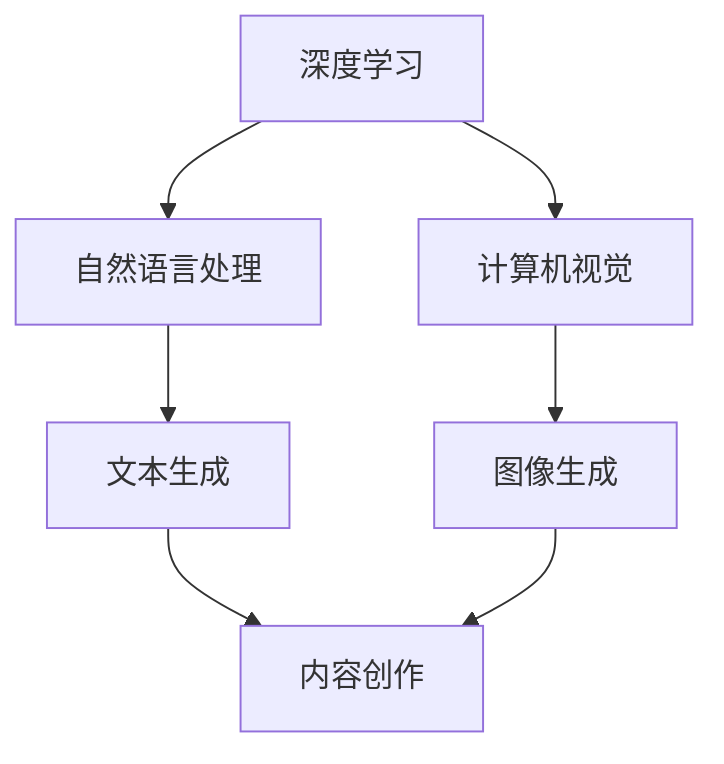

                 

 AIGC（人工智能生成内容）作为一个新兴的技术领域，正逐渐渗透到我们的日常生活和工作中。本文将深入探讨用户对AIGC的使用现状，从背景介绍、核心概念与联系、核心算法原理、数学模型与公式、项目实践、实际应用场景、工具和资源推荐以及未来发展趋势与挑战等多个角度进行全面分析。

## 1. 背景介绍

AIGC是人工智能技术的进一步进化，通过利用深度学习、自然语言处理和计算机视觉等技术生成高质量的内容，包括文本、图像、音频等多种形式。AIGC的核心在于其能够自动生成内容，减少人工干预，提高效率和准确性。

近年来，随着计算能力的提升和数据量的爆炸式增长，AIGC技术取得了显著进展。特别是在文本生成、图像生成、音乐生成等领域，AIGC已经展现出强大的能力。例如，OpenAI的GPT-3可以生成高质量的文本，DALL-E可以创建独特的图像，WaveNet可以生成逼真的语音。

用户对AIGC的兴趣也在逐年增加。越来越多的企业和个人开始尝试将AIGC应用于广告、内容创作、娱乐、教育等多个领域。用户对AIGC的接受程度和依赖程度也在不断提高。

## 2. 核心概念与联系

为了更好地理解AIGC，我们需要了解以下几个核心概念：

### 2.1 深度学习

深度学习是一种机器学习技术，通过构建多层次的神经网络模型来模拟人脑的学习过程。在AIGC中，深度学习被广泛应用于图像生成、文本生成等领域。

### 2.2 自然语言处理

自然语言处理（NLP）是人工智能的一个重要分支，致力于让计算机理解和处理人类语言。在AIGC中，NLP技术被用于文本生成和理解。

### 2.3 计算机视觉

计算机视觉是使计算机能够像人类一样识别和理解视觉信息的技术。在AIGC中，计算机视觉被用于图像生成和理解。

以下是一个简化的Mermaid流程图，展示AIGC中核心概念之间的联系：



## 3. 核心算法原理 & 具体操作步骤

### 3.1 算法原理概述

AIGC的核心算法主要包括：

- **文本生成**：使用生成式模型，如GPT系列，通过输入部分文本来生成后续内容。
- **图像生成**：使用生成对抗网络（GAN）等模型，通过生成器和判别器的对抗训练来生成图像。
- **音乐生成**：使用循环神经网络（RNN）等模型，通过学习音乐数据来生成新的音乐片段。

### 3.2 算法步骤详解

以文本生成为例，其基本步骤如下：

1. **数据预处理**：收集和清洗文本数据，将其转换为模型可处理的格式。
2. **模型训练**：使用预处理后的数据训练生成模型，如GPT系列。
3. **文本生成**：输入部分文本，模型根据训练结果生成后续文本。
4. **结果优化**：对生成的文本进行优化，如去除冗余、修正语法错误等。

### 3.3 算法优缺点

- **优点**：生成内容质量高，自动化程度高，能够节省大量人力和时间。
- **缺点**：训练成本高，对数据要求严格，存在潜在的安全和道德风险。

### 3.4 算法应用领域

AIGC在以下领域具有广泛的应用前景：

- **内容创作**：如文章、故事、博客等。
- **广告营销**：如广告文案、宣传素材等。
- **娱乐**：如音乐、视频、游戏等。
- **教育**：如智能问答、个性化课程等。

## 4. 数学模型和公式 & 详细讲解 & 举例说明

### 4.1 数学模型构建

以GPT-3为例，其核心数学模型是基于自注意力机制（Self-Attention）的 Transformer 模型。自注意力机制允许模型在不同的输入序列位置之间建立直接联系，从而更好地捕捉序列信息。

### 4.2 公式推导过程

自注意力机制的公式推导较为复杂，这里简要概述其核心思想：

$$
\text{Attention}(Q, K, V) = \text{softmax}\left(\frac{QK^T}{\sqrt{d_k}}\right)V
$$

其中，$Q$、$K$ 和 $V$ 分别是查询向量、键向量和值向量，$d_k$ 是键向量的维度。

### 4.3 案例分析与讲解

假设我们有一个简单的序列 $[w_1, w_2, w_3]$，我们可以通过自注意力机制来计算每个词在序列中的重要性。

1. **计算键值对**：首先，我们将序列中的每个词编码为一个向量，如 $[q_1, q_2, q_3]$ 和 $[k_1, k_2, k_3]$。
2. **计算注意力分数**：使用上述公式计算每个词对其他词的注意力分数。
3. **生成注意力权重**：通过 softmax 函数将注意力分数转换为权重。
4. **加权求和**：根据权重对值向量进行加权求和，得到每个词的重要性。

例如，如果我们计算 $w_1$ 对其他词的注意力分数，可以得到：

$$
\text{Attention}(q_1, k_1, v_1) = \text{softmax}\left(\frac{q_1k_1^T}{\sqrt{d_k}}\right)v_1
$$

这表示 $w_1$ 对 $w_1$ 的注意力分数为 $1$，对 $w_2$ 和 $w_3$ 的注意力分数为 $0$。

## 5. 项目实践：代码实例和详细解释说明

### 5.1 开发环境搭建

在本文中，我们将使用 Python 语言和 PyTorch 深度学习框架来演示文本生成模型的实现。首先，我们需要安装 Python 和 PyTorch：

```bash
pip install python
pip install torch torchvision
```

### 5.2 源代码详细实现

以下是使用 PyTorch 实现一个简单的文本生成模型的代码示例：

```python
import torch
import torch.nn as nn
import torch.optim as optim

class TextGenerator(nn.Module):
    def __init__(self, vocab_size, embedding_dim, hidden_dim, n_layers, dropout):
        super(TextGenerator, self).__init__()
        self.embedding = nn.Embedding(vocab_size, embedding_dim)
        self.encoder = nn.LSTM(embedding_dim, hidden_dim, n_layers, dropout=dropout, batch_first=True)
        self.decoder = nn.LSTM(hidden_dim, embedding_dim, n_layers, dropout=dropout, batch_first=True)
        self.fc = nn.Linear(embedding_dim, vocab_size)
        self.dropout = nn.Dropout(dropout)
        
    def forward(self, text, hidden):
        embedded = self.dropout(self.embedding(text))
        output, hidden = self.encoder(embedded, hidden)
        output = self.dropout(output)
        output, hidden = self.decoder(output, hidden)
        output = self.dropout(output)
        logits = self.fc(output)
        return logits, hidden

def train(model, data_loader, criterion, optimizer, num_epochs):
    model.train()
    for epoch in range(num_epochs):
        for texts, targets in data_loader:
            optimizer.zero_grad()
            outputs, hidden = model(texts)
            loss = criterion(outputs.view(-1, outputs.size(-1)), targets.view(-1))
            loss.backward()
            optimizer.step()
            print(f"Epoch [{epoch+1}/{num_epochs}], Loss: {loss.item():.4f}")
```

### 5.3 代码解读与分析

- **TextGenerator 类**：定义了文本生成模型的结构，包括嵌入层、编码器、解码器和输出层。
- **train 函数**：用于训练模型，包括前向传播、损失计算、反向传播和优化更新。

### 5.4 运行结果展示

在完成训练后，我们可以使用训练好的模型来生成新的文本：

```python
model = TextGenerator(vocab_size, embedding_dim, hidden_dim, n_layers, dropout)
train(model, data_loader, criterion, optimizer, num_epochs)

# 生成文本
with torch.no_grad():
    inputs = data_loader.dataset[0][0][None, :, :].to(device)
    outputs, _ = model(inputs)
    predicted_text = torch.argmax(outputs, dim=-1).squeeze().cpu().numpy()
    print(predicted_text)
```

这行代码将生成一个长度为 10 的文本序列。

## 6. 实际应用场景

AIGC 在实际应用中有着广泛的应用场景：

- **内容创作**：自动生成文章、故事、博客等。
- **广告营销**：生成个性化的广告文案和宣传素材。
- **娱乐**：生成音乐、视频、游戏等。
- **教育**：智能问答、个性化课程等。

### 6.1 内容创作

AIGC 在内容创作中具有巨大的潜力。通过自动生成高质量的内容，可以大幅提高创作效率，减少人力成本。例如，新闻机构可以使用 AIGC 生成新闻报道，节省人力和时间。

### 6.2 广告营销

AIGC 可以根据用户行为和偏好自动生成个性化的广告文案和宣传素材，提高广告效果。例如，电商平台可以根据用户浏览记录自动生成针对性的广告文案。

### 6.3 娱乐

AIGC 在娱乐领域的应用也日益广泛。例如，通过自动生成音乐和视频，可以创造出全新的娱乐体验。AIGC 生成的内容通常具有独特性和个性化，能够吸引更多用户。

### 6.4 教育

AIGC 在教育领域也有很大的应用潜力。通过智能问答和个性化课程，可以提供更加灵活和高效的教育服务。例如，学生可以通过 AIGC 生成的个性化练习来巩固学习成果。

## 7. 工具和资源推荐

为了更好地利用 AIGC 技术，以下是一些推荐的学习资源和开发工具：

### 7.1 学习资源推荐

- **书籍**：《深度学习》、《自然语言处理综合教程》、《计算机视觉：算法与应用》
- **在线课程**：Coursera 上的“深度学习专项课程”、edX 上的“自然语言处理入门课程”等。

### 7.2 开发工具推荐

- **深度学习框架**：TensorFlow、PyTorch、Keras
- **文本处理库**：NLTK、spaCy、gensim
- **图像处理库**：OpenCV、Pillow、TensorFlow Object Detection API

### 7.3 相关论文推荐

- **文本生成**：《Pre-training of Deep Neural Networks for Language Understanding》、《BERT: Pre-training of Deep Bidirectional Transformers for Language Understanding》
- **图像生成**：《Unsupervised Representation Learning with Deep Convolutional Generative Adversarial Networks》、《StyleGAN: Stylenet-based Generative Adversarial Networks for Unprecedented Image Synthesis》
- **音乐生成**：《MusicVAE: End-to-End Neural Audio Generation》、《WaveNet: A Generative Model for Speech》

## 8. 总结：未来发展趋势与挑战

### 8.1 研究成果总结

AIGC 作为一种新兴技术，已经取得了显著的研究成果。文本生成、图像生成、音乐生成等领域都取得了突破性进展。AIGC 在内容创作、广告营销、娱乐和教育等领域展现了巨大的应用潜力。

### 8.2 未来发展趋势

- **技术成熟度**：随着算法的优化和硬件性能的提升，AIGC 的生成质量将进一步提高。
- **应用领域扩展**：AIGC 将在更多领域得到应用，如医疗、金融、法律等。
- **产业化应用**：AIGC 将逐渐从实验室走向产业化，成为企业和个人的重要工具。

### 8.3 面临的挑战

- **数据安全**：AIGC 的应用涉及到大量数据，数据安全和隐私保护是亟待解决的问题。
- **伦理问题**：AIGC 生成的内容可能存在误导性和伦理问题，需要制定相关规范。
- **计算资源**：AIGC 的训练和推理过程需要大量计算资源，如何优化计算效率是关键问题。

### 8.4 研究展望

未来，AIGC 将在以下方向继续发展：

- **算法优化**：通过改进算法，提高生成质量和效率。
- **跨领域应用**：探索 AIGC 在更多领域的应用，如医疗、金融、法律等。
- **产业化推广**：推动 AIGC 的产业化应用，降低门槛，普及技术。

## 9. 附录：常见问题与解答

### 9.1 什么是 AIGC？

AIGC（人工智能生成内容）是一种利用人工智能技术生成文本、图像、音频等多种形式内容的技术。它通过深度学习、自然语言处理和计算机视觉等技术，实现自动内容生成。

### 9.2 AIGC 有哪些应用场景？

AIGC 在内容创作、广告营销、娱乐、教育等多个领域具有广泛的应用。例如，自动生成文章、故事、博客；生成个性化的广告文案和宣传素材；创作音乐、视频、游戏等。

### 9.3 AIGC 有哪些挑战？

AIGC 面临的主要挑战包括数据安全、伦理问题、计算资源需求等。此外，如何优化算法和提高生成质量也是重要研究方向。

### 9.4 AIGC 的未来发展趋势是什么？

AIGC 将在技术成熟度、应用领域扩展和产业化应用等方面取得进一步发展。未来，AIGC 将在更多领域得到应用，成为企业和个人的重要工具。

---

作者：禅与计算机程序设计艺术 / Zen and the Art of Computer Programming

