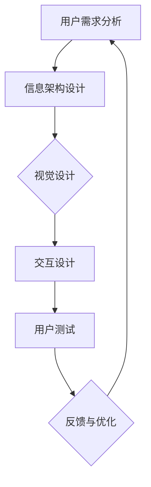

                 

关键词：用户界面设计、人机交互、用户体验、UI/UX设计、交互设计、设计原则、案例分析、工具和技术

## 摘要

随着科技的发展，用户界面设计在软件和硬件产品中变得越来越重要。本文旨在深入探讨用户界面设计的关键概念、原则和方法，以及它们如何影响人机交互的效率和用户体验。通过案例分析、算法原理和数学模型，我们将了解如何在实践中构建友好、易用的用户界面，为用户提供无缝、愉悦的交互体验。

## 1. 背景介绍

用户界面设计（User Interface Design，简称UI设计）和人机交互（Human-Computer Interaction，简称HCI）是现代科技产品开发中不可或缺的部分。UI设计专注于如何通过视觉元素和布局来引导用户操作，而HCI则研究用户与系统之间的交互过程，包括用户的行为模式、心理感受和系统响应。

随着互联网和移动设备的普及，用户对界面设计的要求越来越高。一方面，用户希望界面美观、简洁，易于导航；另一方面，界面设计还需满足功能性和实用性，以提升用户工作效率。因此，如何在UI设计中平衡美观与实用，成为当前研究的重要课题。

本文将首先回顾用户界面设计的历史与发展，然后介绍核心概念和设计原则，接着探讨人机交互的理论基础和实践方法，并通过具体案例进行分析。最后，我们将总结研究成果，展望未来发展趋势和面临的挑战。

## 2. 核心概念与联系

### 2.1 用户界面设计

用户界面设计是指通过视觉元素、布局和交互元素等手段，为用户提供易于操作和理解的交互界面。它包括以下几个方面：

- **视觉设计**：涉及颜色、字体、图标、布局等，旨在创造美观、和谐的界面。
- **交互设计**：关注用户如何与系统进行交互，包括按钮、菜单、滚动条等。
- **信息架构**：定义信息组织和导航结构，帮助用户快速找到所需信息。

### 2.2 人机交互

人机交互是指用户与计算机系统之间的交互过程，涉及用户行为、系统响应和交互体验。关键概念包括：

- **用户行为**：用户在使用界面时的操作方式、习惯和偏好。
- **系统响应**：系统对用户操作的反馈和响应，包括视觉、听觉和触觉反馈。
- **交互体验**：用户在使用界面过程中所感受到的愉悦、效率和满意度。

### 2.3 UI与HCI的联系

UI设计与人机交互密不可分，它们相互影响、相互补充：

- **UI设计为人机交互提供基础**：通过良好的UI设计，用户可以更轻松地理解和使用系统功能。
- **人机交互反馈UI设计**：通过对用户行为的分析，优化UI设计，提升用户体验。

### 2.4 Mermaid 流程图

以下是一个简化的UI设计与人机交互的流程图，展示了它们之间的关联：



## 3. 核心算法原理 & 具体操作步骤

### 3.1 算法原理概述

用户界面设计的核心算法通常涉及以下几个方面：

- **信息可视化**：将复杂的信息以直观的方式呈现给用户。
- **交互流程优化**：通过分析用户行为，优化界面操作流程，提高效率。
- **用户体验评估**：使用问卷调查、用户访谈等方法，评估用户对界面的满意度。

### 3.2 算法步骤详解

#### 3.2.1 信息可视化

1. **数据预处理**：清洗和整理数据，确保数据质量。
2. **可视化设计**：选择合适的图表类型和色彩搭配，创建可视化界面。
3. **用户测试**：收集用户反馈，优化可视化设计。

#### 3.2.2 交互流程优化

1. **用户行为分析**：使用日志分析、眼动追踪等技术，收集用户行为数据。
2. **流程分析**：分析用户行为数据，识别操作中的瓶颈和痛点。
3. **界面优化**：根据分析结果，调整界面布局和交互元素，提高操作效率。

#### 3.2.3 用户体验评估

1. **问卷调查**：设计问卷，收集用户对界面的满意度、易用性等评价。
2. **用户访谈**：与用户面对面交流，深入了解用户对界面的体验。
3. **数据分析**：对问卷和访谈结果进行分析，识别用户关注的重点和改进方向。

### 3.3 算法优缺点

#### 优缺点

- **信息可视化**：优点在于能够直观展示数据，缺点是设计难度大，可能影响视觉效果。
- **交互流程优化**：优点是提高用户操作效率，缺点是需大量数据支持，且优化效果可能有限。
- **用户体验评估**：优点是能够直接获取用户反馈，缺点是成本较高，且结果可能受主观因素影响。

### 3.4 算法应用领域

- **企业应用**：如企业管理系统、客户关系管理系统等，优化界面设计，提高工作效率。
- **教育领域**：如在线教育平台，通过可视化设计和交互流程优化，提升教学效果。
- **医疗领域**：如电子病历系统、远程医疗平台，通过友好界面设计，方便医护人员操作和患者使用。

## 4. 数学模型和公式 & 详细讲解 & 举例说明

### 4.1 数学模型构建

用户界面设计中的数学模型通常涉及以下方面：

- **信息传递模型**：描述用户通过界面获取信息的过程。
- **用户满意度模型**：衡量用户对界面的满意度。
- **交互效率模型**：衡量用户在界面上的操作效率。

### 4.2 公式推导过程

以下是一个简化的用户满意度模型推导过程：

$$
S = \frac{U}{T} + \frac{E}{C}
$$

其中，$S$ 表示用户满意度，$U$ 表示用户获取的信息量，$T$ 表示用户获取信息的时间，$E$ 表示用户感受到的娱乐性，$C$ 表示用户对界面的认知成本。

### 4.3 案例分析与讲解

#### 案例背景

某在线教育平台希望通过优化用户界面设计，提高用户满意度。平台提供在线课程、学习资源、作业提交等功能，用户主要集中在18-35岁的年轻群体。

#### 分析过程

1. **信息传递模型**：通过用户行为数据，分析用户在学习过程中获取的信息量。使用以下公式计算：

$$
U = \sum_{i=1}^{n} \frac{X_i}{T_i}
$$

其中，$U$ 表示用户获取的信息量，$X_i$ 表示第$i$个知识点的重要性，$T_i$ 表示用户获取该知识点的时间。

2. **用户满意度模型**：通过问卷调查，收集用户对界面设计的满意度。使用以下公式计算：

$$
S = \frac{N_{\text{满意}}}{N_{\text{总}}}
$$

其中，$S$ 表示用户满意度，$N_{\text{满意}}$ 表示满意用户数量，$N_{\text{总}}$ 表示总用户数量。

3. **交互效率模型**：通过用户行为数据，分析用户在界面上的操作效率。使用以下公式计算：

$$
E = \frac{T_{\text{实际}}}{T_{\text{标准}}}
$$

其中，$E$ 表示交互效率，$T_{\text{实际}}$ 表示用户实际操作时间，$T_{\text{标准}}$ 表示标准操作时间。

#### 改进方案

根据分析结果，平台采取以下改进措施：

- **优化信息传递**：通过调整课程内容布局，提高用户获取信息量。
- **提高用户满意度**：优化界面设计，增加娱乐性元素，降低认知成本。
- **提高交互效率**：简化操作流程，减少用户操作时间。

## 5. 项目实践：代码实例和详细解释说明

### 5.1 开发环境搭建

在开始项目实践之前，我们需要搭建一个开发环境。以下是使用Python进行用户界面设计的开发环境搭建步骤：

1. **安装Python**：下载并安装Python 3.x版本。
2. **安装PyQt5**：在命令行中运行以下命令安装PyQt5库：

   ```shell
   pip install PyQt5
   ```

3. **安装PyQt Designer**：PyQt Designer 是一个用于创建 UI 界面的图形界面工具。安装完成后，可以通过命令行启动：

   ```shell
   pyqt5 designer
   ```

### 5.2 源代码详细实现

以下是一个简单的Python代码实例，展示了如何使用PyQt5创建一个用户界面。代码分为以下几个部分：

1. **导入模块**：

   ```python
   from PyQt5 import QtWidgets, QtGui
   ```

2. **创建主窗口**：

   ```python
   class MainWindow(QtWidgets.QMainWindow):
       def __init__(self):
           super().__init__()
           self.initUI()
   
       def initUI(self):
           self.setWindowTitle('用户界面设计示例')
           self.setGeometry(100, 100, 400, 300)
   
           # 创建菜单栏
           menuBar = self.menuBar()
           fileMenu = menuBar.addMenu('文件')
           fileMenu.addAction('退出')
   
           # 创建工具栏
           toolbar = self.addToolBar('工具栏')
           toolbar.addAction('按钮1')
           toolbar.addAction('按钮2')
   
           # 创建状态栏
           self.setStatusBar(QtWidgets.QStatusBar())
   
           # 创建主窗口内容
           centralWidget = QtWidgets.QWidget(self)
           self.setCentralWidget(centralWidget)
           layout = QtWidgets.QVBoxLayout(centralWidget)
   
           # 创建文本框和按钮
           self.textEdit = QtWidgets.QTextEdit()
           self.addButton = QtWidgets.QPushButton('添加文本')
           self.addButton.clicked.connect(self.onButtonClick)
           layout.addWidget(self.textEdit)
           layout.addWidget(self.addButton)
   
           # 显示窗口
           self.show()
   
       def onButtonClick(self):
           self.textEdit.append('用户点击了按钮')
   ```

3. **运行程序**：

   ```python
   if __name__ == '__main__':
       app = QtWidgets.QApplication([])
       mainWin = MainWindow()
       mainWin.show()
       app.exec_()
   ```

### 5.3 代码解读与分析

- **导入模块**：导入PyQt5库中的QtWidgets模块，用于创建窗口、按钮、文本框等界面组件。
- **创建主窗口**：定义`MainWindow`类，继承`QtWidgets.QMainWindow`，初始化窗口属性和布局。
- **创建菜单栏**：使用`menuBar`方法创建菜单栏，添加文件菜单和退出选项。
- **创建工具栏**：使用`addToolBar`方法创建工具栏，添加按钮组件。
- **创建状态栏**：使用`setStatusBar`方法创建状态栏。
- **创建主窗口内容**：使用`QVBoxLayout`创建垂直布局，添加文本框和按钮组件。
- **按钮点击事件**：定义`onButtonClick`方法，实现按钮点击后的文本框内容更新。

### 5.4 运行结果展示

运行程序后，将显示一个带有菜单栏、工具栏、文本框和按钮的主窗口。用户可以通过菜单栏、工具栏和按钮与程序进行交互。

## 6. 实际应用场景

### 6.1 企业应用

在企业应用中，用户界面设计对于提高工作效率和用户体验至关重要。例如，在企业管理系统中，良好的UI设计可以帮助员工快速找到所需功能，简化操作流程，提高工作效率。通过优化界面布局和交互元素，企业可以更好地满足员工的需求，提升员工的工作满意度。

### 6.2 教育领域

在教育领域，用户界面设计对于在线教育平台和电子学习资源尤为重要。良好的UI设计可以提高学生的学习兴趣和参与度，帮助他们更轻松地掌握知识。例如，通过使用动画、图表和交互式元素，在线教育平台可以为学生提供更加生动、有趣的学习体验。

### 6.3 医疗领域

在医疗领域，用户界面设计对于医护人员和患者都具有重要意义。对于医护人员，良好的UI设计可以提高工作效率，减少操作错误。对于患者，友好的界面设计可以帮助他们更轻松地理解自己的病情和治疗方案，提高就医体验。

### 6.4 未来应用展望

随着人工智能和虚拟现实技术的发展，用户界面设计将迎来更多创新和挑战。例如，通过使用语音识别和自然语言处理技术，界面设计可以实现更加智能化的交互方式。此外，虚拟现实技术将为用户界面设计带来全新的体验，让用户在虚拟环境中与系统进行更加自然、直观的交互。

## 7. 工具和资源推荐

### 7.1 学习资源推荐

- **《用户界面设计》**：由唐纳德·诺曼（Donald Norman）著，系统介绍了用户界面设计的原则和方法。
- **《人机交互》**：由史蒂文·陆基斯（Steven R. Landry）著，全面讲述了人机交互的理论和实践。

### 7.2 开发工具推荐

- **PyQt5**：用于Python的图形用户界面开发库，支持多种平台。
- **Sketch**：一款流行的界面设计工具，适用于移动端和网页端设计。

### 7.3 相关论文推荐

- **"A Survey of User Interface Software and Systems"**：综述了用户界面设计的最新研究进展。
- **"The Design of Everyday Things"**：探讨了用户界面设计的核心原则，对实际设计工作具有指导意义。

## 8. 总结：未来发展趋势与挑战

### 8.1 研究成果总结

用户界面设计和人机交互研究取得了显著成果，为软件和硬件产品的用户体验提供了有力支持。通过信息可视化、交互流程优化和用户体验评估等方法，设计师可以构建友好、易用的界面，提高用户满意度。

### 8.2 未来发展趋势

- **智能化交互**：随着人工智能技术的发展，智能化交互将成为未来用户界面设计的重要趋势。
- **个性化定制**：通过大数据和机器学习技术，界面设计将更加个性化和智能化，满足用户的个性化需求。
- **虚拟现实**：虚拟现实技术将为用户界面设计带来全新的体验，拓展人机交互的边界。

### 8.3 面临的挑战

- **技术实现**：随着界面设计的复杂性增加，实现高效的界面设计和技术支持将面临挑战。
- **用户需求**：用户需求多样且不断变化，如何平衡不同用户的需求将是一大挑战。
- **伦理和隐私**：在界面设计过程中，如何保护用户隐私、遵循伦理规范是亟待解决的问题。

### 8.4 研究展望

未来用户界面设计和人机交互研究应重点关注以下方面：

- **跨学科融合**：结合心理学、认知科学等领域的知识，提高界面设计的科学性和实用性。
- **技术创新**：积极探索新技术在界面设计中的应用，提高用户体验。
- **用户体验研究**：通过长期跟踪和数据分析，深入了解用户行为和需求，为界面设计提供有力支持。

## 9. 附录：常见问题与解答

### 9.1 问题1

**问题**：如何平衡界面美观和实用性？

**解答**：在界面设计过程中，首先要明确目标用户群体和产品定位。针对目标用户的需求和习惯，设计美观且实用的界面。同时，可以采用A/B测试等方法，收集用户反馈，不断优化界面设计，以达到平衡美观与实用的目的。

### 9.2 问题2

**问题**：如何进行用户测试？

**解答**：用户测试是评估界面设计的重要手段。可以通过以下步骤进行用户测试：

1. **确定测试目标**：明确测试目的和预期效果。
2. **设计测试任务**：创建与实际使用场景相似的测试任务。
3. **招募测试用户**：选择具有代表性的测试用户。
4. **执行测试任务**：观察用户在测试过程中的操作和反馈。
5. **数据分析**：分析测试结果，找出界面设计的不足和改进方向。

## 作者署名

作者：禅与计算机程序设计艺术 / Zen and the Art of Computer Programming
----------------------------------------------------------------

以上就是《用户界面设计：打造友好易用的人机交互》的完整文章内容。这篇文章全面阐述了用户界面设计的重要概念、设计原则和方法，并结合实际案例进行了深入分析和实践。希望这篇文章能够为读者提供有价值的参考和启示，帮助他们在实际工作中更好地进行用户界面设计。

