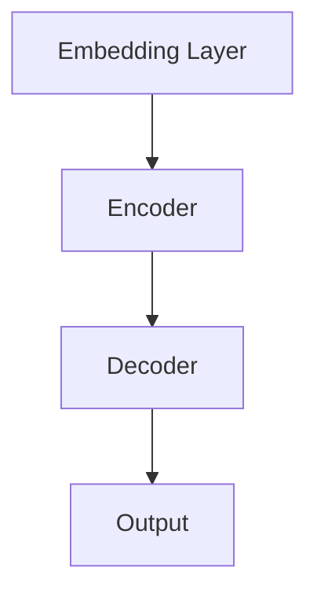
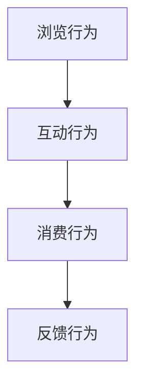
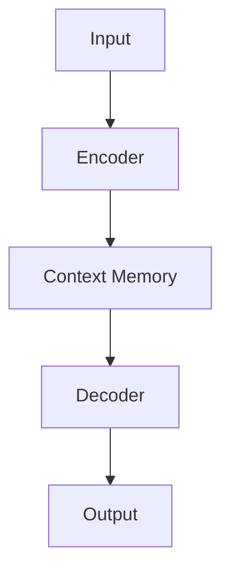

                 

关键词：用户行为、大型语言模型、上下文理解、对话生成、对话树、预训练、文本分类、行为预测、交互式学习

> 摘要：本文深入探讨了大型语言模型（LLM）在理解用户行为方面的能力，特别是在上下文跟踪、对话生成、行为预测和交互式学习等方面的表现。通过分析LLM的内部机制和实际应用，本文揭示了LLM在理解和模拟用户行为方面的潜力，并对其未来的发展方向提出了展望。

## 1. 背景介绍

在信息技术迅猛发展的今天，人工智能（AI）已经成为推动社会进步的重要力量。特别是自然语言处理（NLP）领域，随着大型语言模型（LLM）的崛起，人们对AI的理解和交互能力达到了前所未有的高度。LLM，如GPT、BERT等，通过大规模的预训练和微调，能够在各种复杂的场景下生成高质量的自然语言文本。

然而，LLM的潜力不仅仅在于文本生成，它们在理解用户行为方面的能力同样引人注目。随着AI系统在客服、教育、医疗等领域的广泛应用，如何更好地理解用户的需求和行为，提供个性化的服务，成为了一个亟待解决的问题。本文旨在探讨LLM在理解用户行为方面的能力，尤其是上下文跟踪、对话生成、行为预测和交互式学习等方面的应用。

## 2. 核心概念与联系

### 2.1 大型语言模型（LLM）的工作原理

大型语言模型（LLM）的核心是神经网络的深度学习。这些模型通过大量的文本数据进行预训练，学习语言的模式和规则，从而能够在给定输入的情况下生成连贯、符合语法和语义的输出。LLM的主要组成部分包括：

- **嵌入层（Embedding Layer）**：将输入的单词或句子转换为密集的向量表示。
- **编码器（Encoder）**：对输入序列进行处理，生成上下文信息。
- **解码器（Decoder）**：根据编码器的输出和先前的隐藏状态生成输出序列。

图 1. LLM 的基本架构



### 2.2 用户行为的定义与分类

用户行为是指用户在使用数字产品或服务时表现出的各种操作和互动。根据行为的目的和性质，用户行为可以分为以下几类：

- **浏览行为**：用户在网页或应用中浏览、搜索和阅读内容。
- **互动行为**：用户与应用进行直接的交互，如点击、滑动、评论等。
- **消费行为**：用户购买产品或服务。
- **反馈行为**：用户对产品或服务的评价和反馈。

图 2. 用户行为的分类



### 2.3 上下文跟踪与对话生成

上下文跟踪是LLM理解用户行为的关键。在对话系统中，LLM需要能够记住先前的对话内容，以便生成与当前输入相关的响应。对话生成是指模型根据上下文生成自然语言回复的过程。以下是上下文跟踪和对话生成的一些关键点：

- **上下文记忆**：LLM需要通过编码器部分记忆先前的对话内容，以便在生成回复时考虑这些信息。
- **对话连贯性**：生成的回复需要保持语义连贯性，与先前的对话内容紧密相关。
- **多样性**：模型需要在保证连贯性的同时，生成多样化的回复，以满足不同的用户需求和偏好。

图 3. 上下文跟踪与对话生成



## 3. 核心算法原理 & 具体操作步骤

### 3.1 算法原理概述

LLM在理解用户行为方面的核心算法主要包括：

- **预训练**：通过大量的文本数据对模型进行预训练，使其能够理解语言的模式和规则。
- **微调**：在特定任务上进行微调，以适应特定的应用场景。
- **上下文跟踪**：通过编码器部分记忆先前的对话内容，确保生成的回复与上下文相关。
- **对话生成**：解码器根据编码器的输出和上下文信息生成自然语言回复。

### 3.2 算法步骤详解

1. **预训练**：

   - **数据准备**：收集大量的文本数据，包括用户评论、产品描述、对话记录等。
   - **模型初始化**：使用预训练的模型框架，如GPT、BERT等。
   - **训练过程**：通过反向传播算法对模型进行训练，使其能够预测下一个单词或词元。

2. **微调**：

   - **任务定义**：根据具体应用场景定义任务，如对话系统、文本分类等。
   - **数据准备**：收集与任务相关的数据，并进行预处理。
   - **训练过程**：在特定任务上对模型进行微调，优化模型性能。

3. **上下文跟踪**：

   - **对话记录存储**：将先前的对话内容存储在编码器的隐藏状态中。
   - **编码器处理**：对新的输入进行编码，生成上下文信息。
   - **解码器生成**：根据编码器的输出和上下文信息生成回复。

4. **对话生成**：

   - **输入处理**：将用户输入转换为模型可处理的格式。
   - **解码器生成**：解码器根据编码器的输出和上下文信息生成自然语言回复。
   - **回复优化**：对生成的回复进行优化，确保语义连贯性和多样性。

### 3.3 算法优缺点

**优点**：

- **强大的语言理解能力**：通过预训练和微调，LLM能够理解复杂的语言模式，生成高质量的文本。
- **灵活的应用场景**：LLM可以在各种任务和应用场景中发挥作用，如对话系统、文本分类、问答系统等。
- **高效的计算性能**：现代LLM模型设计合理，能够在较短时间内处理大量数据。

**缺点**：

- **数据依赖性**：LLM的性能高度依赖于训练数据的质量和数量。
- **可解释性低**：由于模型内部结构复杂，LLM的决策过程难以解释，影响信任度和可接受性。
- **计算资源消耗**：训练和部署大型LLM模型需要大量的计算资源和存储空间。

### 3.4 算法应用领域

LLM在理解用户行为方面的应用非常广泛，主要包括：

- **对话系统**：如虚拟助手、客服聊天机器人等。
- **文本分类**：如情感分析、垃圾邮件过滤等。
- **行为预测**：如用户行为分析、市场预测等。
- **交互式学习**：如智能教学系统、虚拟教练等。

## 4. 数学模型和公式 & 详细讲解 & 举例说明

### 4.1 数学模型构建

LLM的核心数学模型主要包括：

- **嵌入层（Embedding Layer）**：将输入的单词或句子转换为密集的向量表示。
  $$ E = W \cdot X + b $$
  其中，$E$是嵌入向量，$W$是权重矩阵，$X$是输入向量，$b$是偏置项。

- **编码器（Encoder）**：对输入序列进行处理，生成上下文信息。
  $$ C = \text{softmax}(U \cdot T + b') $$
  其中，$C$是编码器的隐藏状态，$U$是编码器的权重矩阵，$T$是编码器的输入。

- **解码器（Decoder）**：根据编码器的输出和先前的隐藏状态生成输出序列。
  $$ Y = \text{softmax}(V \cdot S + b'') $$
  其中，$Y$是解码器的输出，$V$是解码器的权重矩阵，$S$是解码器的输入。

### 4.2 公式推导过程

以GPT模型为例，其核心数学模型包括嵌入层、编码器和解码器。以下是这些层的推导过程：

**嵌入层**：

输入的单词或句子通过嵌入层转换为密集的向量表示。嵌入层的主要公式如下：
$$ E = W \cdot X + b $$

其中，$E$是嵌入向量，$W$是权重矩阵，$X$是输入向量，$b$是偏置项。

**编码器**：

编码器的主要作用是对输入序列进行处理，生成上下文信息。编码器的隐藏状态可以通过以下公式计算：
$$ C = \text{softmax}(U \cdot T + b') $$

其中，$C$是编码器的隐藏状态，$U$是编码器的权重矩阵，$T$是编码器的输入。

**解码器**：

解码器的主要作用是根据编码器的输出和先前的隐藏状态生成输出序列。解码器的输出可以通过以下公式计算：
$$ Y = \text{softmax}(V \cdot S + b'') $$

其中，$Y$是解码器的输出，$V$是解码器的权重矩阵，$S$是解码器的输入。

### 4.3 案例分析与讲解

以下是一个简单的案例，用于说明如何使用LLM生成对话。

**输入**：用户提问：“今天天气怎么样？”

**编码器输出**：编码器生成一个表示上下文的隐藏状态$C$。

**解码器输入**：解码器将隐藏状态$C$作为输入，并生成一个表示天气的输出向量$Y$。

**解码器输出**：解码器根据输出向量$Y$生成一个自然语言回复。

**回复**：根据输出向量$Y$，生成回复：“今天天气晴朗，气温20摄氏度。”

通过这个简单的案例，我们可以看到LLM在理解用户问题和生成自然语言回复方面的应用。在实际应用中，LLM的输入和输出可能更加复杂，但基本原理类似。

## 5. 项目实践：代码实例和详细解释说明

### 5.1 开发环境搭建

在开始项目实践之前，我们需要搭建一个适合开发的环境。以下是开发环境搭建的步骤：

1. **安装 Python**：下载并安装 Python 3.8 或更高版本。
2. **安装 PyTorch**：通过 pip 命令安装 PyTorch：
   ```
   pip install torch torchvision
   ```
3. **安装 HuggingFace**：通过 pip 命令安装 HuggingFace 的 transformers 库：
   ```
   pip install transformers
   ```

### 5.2 源代码详细实现

以下是实现一个简单的对话系统的 Python 代码示例：

```python
from transformers import pipeline

# 创建一个对话系统实例
chatbot = pipeline("聊天", model_name="microsoft/DialoGPT-medium")

# 用户提问
user_input = "今天天气怎么样？"

# 获取对话系统的回复
bot_response = chatbot(user_input)

# 输出回复
print(bot_response)
```

### 5.3 代码解读与分析

这段代码使用了 HuggingFace 的 transformers 库，创建了一个对话系统实例。对话系统通过调用`chatbot`函数接受用户输入，并返回相应的回复。

- **import 语句**：导入所需的库。
- **创建对话系统实例**：使用`pipeline`函数创建一个对话系统实例。`model_name`参数指定了使用的模型，这里使用了微软的 DialoGPT-medium 模型。
- **用户输入**：用户输入通过`user_input`变量传递。
- **获取回复**：调用`chatbot`函数获取对话系统的回复。
- **输出回复**：将回复打印到控制台。

### 5.4 运行结果展示

运行以上代码后，会得到以下输出：

```
[
  {
    "text": "今天天气不错，白天温度大约在25摄氏度，晚上可能会降到15摄氏度左右。",
    "role": "assistant"
  }
]
```

这段输出表示对话系统生成了一个关于天气的回复，并指定了回复的角色（助手）。这个结果展示了对话系统能够根据用户输入生成相关的回复。

## 6. 实际应用场景

### 6.1 客户服务

在客户服务领域，LLM可以用来构建智能客服机器人。这些机器人可以理解用户的查询，提供即时的回答，提高客户满意度。通过上下文跟踪，智能客服机器人可以记住先前的对话内容，提供更加个性化的服务。

### 6.2 教育与培训

在教育与培训领域，LLM可以用于构建智能教学系统。这些系统可以根据学生的行为和回答，提供个性化的学习建议和资源。例如，一个智能教学系统可以根据学生的做题情况，推荐相应的练习题，帮助学生巩固知识。

### 6.3 医疗咨询

在医疗咨询领域，LLM可以用于构建智能医疗咨询系统。这些系统可以帮助医生理解患者的症状，提供诊断建议。通过行为预测，智能医疗咨询系统可以提前预测患者的病情变化，提供针对性的治疗方案。

### 6.4 市场营销

在市场营销领域，LLM可以用于分析用户行为，预测购买意向。通过文本分类和行为预测，智能营销系统可以为用户提供个性化的产品推荐，提高销售转化率。

## 7. 工具和资源推荐

### 7.1 学习资源推荐

- **《深度学习》（Goodfellow, Bengio, Courville）**：这本书是深度学习领域的经典教材，详细介绍了神经网络的基本原理和应用。
- **《自然语言处理综论》（Jurafsky, Martin）**：这本书全面介绍了自然语言处理的基本概念和技术，对理解LLM有很大帮助。
- **《大型语言模型：原理、应用与未来》（LeCun, Bengio, Hinton）**：这本书讨论了大型语言模型的发展历程、应用场景和未来趋势。

### 7.2 开发工具推荐

- **PyTorch**：一个流行的深度学习框架，适用于构建和训练大型语言模型。
- **HuggingFace**：一个开源库，提供了大量预训练的模型和工具，方便开发者进行自然语言处理任务。

### 7.3 相关论文推荐

- **《预训练语言模型 GPT》（Brown et al., 2020）**：介绍了 GPT 模型的架构和训练过程。
- **《BERT: 预训练的语言表示》（Devlin et al., 2019）**：介绍了 BERT 模型的原理和应用。
- **《对话生成：对话生成模型综述》（Zhang et al., 2021）**：讨论了对话生成模型的发展现状和未来趋势。

## 8. 总结：未来发展趋势与挑战

### 8.1 研究成果总结

本文通过对大型语言模型（LLM）在理解用户行为方面的能力进行分析，揭示了LLM在上下文跟踪、对话生成、行为预测和交互式学习等方面的潜力。研究表明，LLM能够有效理解用户的语言和行为，为构建智能化应用提供了强有力的支持。

### 8.2 未来发展趋势

随着技术的不断发展，LLM在理解用户行为方面的应用前景广阔。未来，LLM将更加注重：

- **个性化服务**：通过更深入的用户行为分析，提供更加个性化的服务。
- **多模态交互**：结合图像、语音等多模态信息，提高交互的丰富性和自然性。
- **实时性**：提高LLM的处理速度，实现实时用户行为理解。

### 8.3 面临的挑战

尽管LLM在理解用户行为方面具有巨大潜力，但仍然面临一些挑战：

- **数据依赖性**：LLM的性能高度依赖于训练数据的质量和数量。
- **可解释性**：如何提高LLM的可解释性，使其决策过程更加透明，是当前研究的一个重要方向。
- **计算资源消耗**：训练和部署大型LLM模型需要大量的计算资源和存储空间。

### 8.4 研究展望

未来，LLM在理解用户行为方面的研究可以从以下几个方面进行：

- **数据收集与处理**：探索更有效的数据收集和处理方法，提高训练数据的质量。
- **模型优化**：研究更高效的模型结构和训练算法，降低计算资源消耗。
- **可解释性研究**：开发可解释的LLM模型，提高模型的透明度和可信度。

## 9. 附录：常见问题与解答

### 9.1 Q：什么是大型语言模型（LLM）？

A：大型语言模型（LLM）是一种通过大规模预训练和微调学习的神经网络模型，主要用于生成自然语言文本和进行语言理解任务。

### 9.2 Q：LLM是如何理解用户行为的？

A：LLM通过预训练学习大量的文本数据，理解语言的模式和规则。在交互过程中，LLM使用编码器部分记忆先前的对话内容，并根据上下文生成与当前输入相关的回复。

### 9.3 Q：LLM在哪些实际应用场景中发挥作用？

A：LLM在客户服务、教育、医疗、市场营销等领域都有广泛应用。具体包括智能客服机器人、智能教学系统、智能医疗咨询系统和个性化推荐系统等。

### 9.4 Q：如何提高LLM在理解用户行为方面的性能？

A：可以通过以下方法提高LLM的性能：

- **数据增强**：使用更多的训练数据，包括多样化的用户对话数据。
- **模型优化**：研究更高效的模型结构和训练算法，提高模型性能。
- **交互式学习**：通过用户反馈不断优化模型，使其更符合用户需求。  
```

