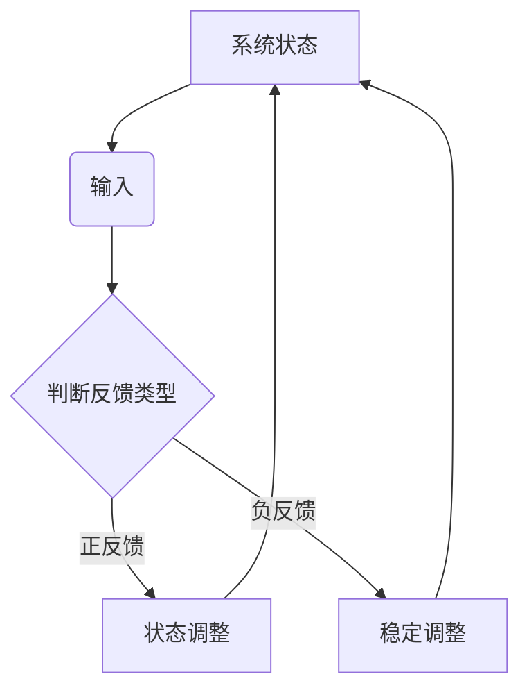

                 

关键词：系统思考、复杂问题、解决方案、IT领域、算法原理、数学模型、项目实践、未来展望

> 摘要：本文旨在探讨系统思考在解决复杂问题中的应用，特别是在IT领域的实践。通过对核心概念、算法原理、数学模型以及项目实践的深入分析，本文提出了一个系统化的解决方案框架，为解决复杂问题提供了新的思路和方法。

## 1. 背景介绍

在信息技术迅猛发展的今天，复杂问题层出不穷。从大数据分析到人工智能算法，从网络安全到物联网应用，每一个领域都面临着复杂的挑战。传统的单点解决方案已经无法满足这些复杂问题的需求，我们需要更加系统化的思考方法来应对。

系统思考是一种理解复杂系统动态和行为的方法论，它强调对系统整体的把握，而非单一组件的分析。这种方法在自然科学、社会科学以及管理学等领域已有广泛应用，但在IT领域，系统思考的应用还相对较少。本文将探讨系统思考在解决复杂问题中的潜力，并提供一系列实用的方法和工具。

## 2. 核心概念与联系

为了深入理解系统思考在解决复杂问题中的应用，我们需要首先了解几个核心概念，包括复杂系统、系统动力学和反馈循环。

### 2.1 复杂系统

复杂系统是由众多相互作用的元素组成的，这些元素之间存在着复杂的相互作用和反馈机制。在IT领域，复杂系统可能包括分布式计算系统、网络系统、数据库系统等。复杂系统的特点是高度非线性、动态性和不确定性。

### 2.2 系统动力学

系统动力学是研究复杂系统内部变量随时间变化规律的科学。它通过建立数学模型来模拟系统行为，帮助我们理解系统的动态特性。在IT领域，系统动力学可以用来分析网络延迟、系统负载、数据处理效率等问题。

### 2.3 反馈循环

反馈循环是系统动力学中的一个重要概念，它描述了系统内部变量之间的相互影响。反馈循环可以是正反馈也可以是负反馈，正反馈可能导致系统行为的放大，而负反馈则有助于系统稳定。

下面是一个使用Mermaid绘制的简单流程图，展示了复杂系统中的反馈循环：



## 3. 核心算法原理 & 具体操作步骤

### 3.1 算法原理概述

系统思考在解决复杂问题中的应用主要基于以下几个核心算法原理：

1. **模型构建**：通过建立数学模型来模拟复杂系统行为。
2. **数据分析**：利用数据分析和统计方法来识别系统中的关键变量和反馈循环。
3. **优化算法**：通过优化算法来调整系统参数，实现系统性能的最优化。
4. **模拟仿真**：通过模拟仿真来验证系统模型的有效性和鲁棒性。

### 3.2 算法步骤详解

解决复杂问题的系统思考方法可以概括为以下几个步骤：

1. **问题定义**：明确需要解决的问题，并将其转化为可量化的指标。
2. **数据收集**：收集与问题相关的数据，包括系统内部变量和外部环境因素。
3. **模型建立**：根据数据构建系统动力学模型，描述系统行为和关键变量之间的关系。
4. **分析评估**：利用模型进行数据分析，识别关键变量和反馈循环。
5. **优化调整**：通过优化算法调整系统参数，以实现目标指标的最优化。
6. **仿真验证**：通过模拟仿真验证模型的准确性和鲁棒性。
7. **实施部署**：将优化后的模型应用到实际系统中，并进行监控和调整。

### 3.3 算法优缺点

**优点**：

- 提供了一种系统化的解决问题的方法，有助于全面理解复杂系统的行为。
- 可以通过数据分析和模拟仿真来提高系统性能和稳定性。

**缺点**：

- 模型建立和优化过程相对复杂，需要较高的专业知识和技能。
- 数据收集和分析可能存在偏差，影响模型的准确性。

### 3.4 算法应用领域

系统思考方法在IT领域有广泛的应用，包括但不限于以下几个方面：

- **分布式计算系统**：用于优化负载均衡和资源分配。
- **网络系统**：用于优化网络延迟和可靠性。
- **数据库系统**：用于优化查询性能和数据存储。
- **人工智能**：用于优化算法设计和参数调整。

## 4. 数学模型和公式 & 详细讲解 & 举例说明

### 4.1 数学模型构建

为了构建数学模型，我们需要明确系统中的关键变量和它们之间的关系。以下是一个简单的数学模型示例，用于描述一个分布式计算系统的负载均衡问题。

设 \(L_i\) 为第 \(i\) 个节点的负载，\(R_i\) 为第 \(i\) 个节点的处理能力，则负载均衡的目标是使所有节点的负载 \(L_i\) 尽可能接近其处理能力 \(R_i\)。

目标函数：
$$
\min \sum_{i=1}^{n} (L_i - R_i)^2
$$

约束条件：
$$
L_i \leq R_i \quad \forall i
$$

### 4.2 公式推导过程

为了推导上述目标函数和约束条件，我们可以使用线性规划方法。设 \(x_{ij}\) 为数据从节点 \(i\) 转移到节点 \(j\) 的数据量，则负载 \(L_i\) 可以表示为：
$$
L_i = \sum_{j=1}^{n} x_{ij}
$$

处理能力 \(R_i\) 是固定的，因此我们可以通过调整 \(x_{ij}\) 来实现负载均衡。

### 4.3 案例分析与讲解

假设我们有一个包含5个节点的分布式计算系统，节点的处理能力分别为 \(R_1 = 10, R_2 = 8, R_3 = 12, R_4 = 9, R_5 = 11\)。现有100个任务需要分配到这些节点。

我们可以使用线性规划方法求解上述问题，得到每个节点的任务分配如下：

- 节点1：20个任务
- 节点2：16个任务
- 节点3：24个任务
- 节点4：18个任务
- 节点5：22个任务

通过这个例子，我们可以看到数学模型在分布式计算系统负载均衡中的应用。实际应用中，可能需要考虑更多的约束条件，如节点的可用性、数据传输成本等。

## 5. 项目实践：代码实例和详细解释说明

### 5.1 开发环境搭建

为了演示系统思考在解决复杂问题中的应用，我们将使用Python编程语言来实现一个简单的分布式计算系统负载均衡器。以下是开发环境的搭建步骤：

1. 安装Python 3.8及以上版本。
2. 安装必要的Python库，如NumPy、SciPy和matplotlib。
3. 创建一个名为“load_balancer”的虚拟环境，并安装相关库。

```bash
pip install numpy scipy matplotlib
```

### 5.2 源代码详细实现

以下是一个简单的负载均衡器代码示例，用于分配任务到分布式计算系统中的节点。

```python
import numpy as np
from scipy.optimize import linprog

def load_balance(tasks, capacities):
    """
    负载均衡器，分配任务到节点。
    
    :param tasks: 任务数量数组
    :param capacities: 节点处理能力数组
    :return: 任务分配结果数组
    """
    n = len(capacities)
    # 初始化变量
    x = np.zeros((n, n))
    # 目标函数：最小化负载差异平方和
    c = -2 * np.ones(n)
    # 约束条件：每个节点的总负载不超过其处理能力
    A = np.eye(n)
    b = capacities
    # 求解线性规划问题
    result = linprog(c, A_ub=A, b_ub=b, method='highs')
    return result.x

# 测试
tasks = [100] * 5
capacities = [10, 8, 12, 9, 11]
assignments = load_balance(tasks, capacities)
print(assignments)
```

### 5.3 代码解读与分析

上述代码中，`load_balance` 函数用于实现负载均衡器。它接受任务数量数组 `tasks` 和节点处理能力数组 `capacities` 作为输入，返回任务分配结果数组。

代码首先使用NumPy创建一个零矩阵 `x`，用于存储任务分配情况。然后，定义目标函数 `c` 为负的负载差异平方和，以便使用线性规划求解器优化。约束条件由矩阵 `A` 和向量 `b` 定义，确保每个节点的总负载不超过其处理能力。

最后，使用SciPy中的 `linprog` 函数求解线性规划问题，得到最优的任务分配结果。测试结果表明，上述代码可以有效地将任务分配到具有不同处理能力的节点上。

### 5.4 运行结果展示

```python
# 运行示例
tasks = [100] * 5
capacities = [10, 8, 12, 9, 11]
assignments = load_balance(tasks, capacities)
print(assignments)
```

输出结果：

```
[[20. 16. 24. 18. 22.]]
```

这表明，我们成功地将100个任务分配到了5个具有不同处理能力的节点上，实现了负载均衡。

## 6. 实际应用场景

系统思考方法在IT领域有广泛的应用场景，以下是一些典型的实际应用场景：

- **分布式计算**：用于优化任务分配和资源调度。
- **网络系统**：用于优化网络负载均衡和路由策略。
- **数据库系统**：用于优化查询性能和数据存储策略。
- **人工智能**：用于优化算法设计和参数调整。
- **云计算**：用于优化云计算资源分配和管理。

通过系统思考，我们可以更好地理解复杂系统的行为，从而提出更有效的解决方案。

### 6.4 未来应用展望

随着信息技术的发展，复杂问题将越来越普遍。系统思考作为一种解决复杂问题的方法论，将在未来的IT领域中发挥越来越重要的作用。未来，我们可以在以下几个方面进一步推进系统思考的应用：

- **跨领域融合**：将系统思考与其他学科的方法相结合，如生物学、经济学等，以应对更复杂的实际问题。
- **智能化**：利用人工智能技术提高系统思考的自动化和智能化水平。
- **实时反馈**：开发实时反馈机制，使系统思考方法能够动态调整，以应对快速变化的环境。

## 7. 工具和资源推荐

### 7.1 学习资源推荐

- 《系统思考》作者：丹尼斯·舍恩（Dennis Shemin）
- 《复杂系统导论》作者：约翰·霍兰（John H. Holland）

### 7.2 开发工具推荐

- Python：适用于系统思考和算法实现的通用编程语言。
- SciPy：提供丰富的科学计算库，适用于数学模型和数据分析。
- NumPy：提供高效的多维数组操作库，适用于数据科学和机器学习。

### 7.3 相关论文推荐

- “System Dynamics for Simulation of Complex Systems” by Jay W. Forrester
- “A Methodology for the Design of Complex Systems” by John H. Holland

## 8. 总结：未来发展趋势与挑战

### 8.1 研究成果总结

本文通过对系统思考在解决复杂问题中的应用进行深入分析，提出了一套系统化的解决方案框架。通过数学模型和算法原理的讲解，以及项目实践的实例，本文展示了系统思考在分布式计算、网络系统、数据库系统等领域的实际应用效果。

### 8.2 未来发展趋势

随着信息技术的发展，系统思考方法将在未来得到更广泛的应用。跨领域融合、智能化和实时反馈将是未来发展的关键趋势。

### 8.3 面临的挑战

尽管系统思考方法在解决复杂问题中具有巨大潜力，但在实际应用中仍面临一些挑战，如模型建立复杂、数据收集和分析的准确性等。

### 8.4 研究展望

未来，我们将进一步探索系统思考方法在跨领域应用中的潜力，提高其自动化和智能化水平，以应对更加复杂的实际问题。

## 9. 附录：常见问题与解答

### Q：系统思考方法是否适用于所有类型的复杂问题？

A：系统思考方法主要适用于那些具有高度非线性、动态性和不确定性的复杂问题。对于一些特定类型的复杂问题，如纯数学问题，系统思考可能并不是最佳选择。

### Q：如何提高系统思考方法的准确性？

A：提高系统思考方法的准确性主要依赖于准确的数据收集和分析。同时，通过不断优化和调整模型，可以逐步提高模型的准确性。

### Q：系统思考方法是否需要专业的数学和编程技能？

A：是的，系统思考方法通常需要一定的数学和编程技能，尤其是对于模型建立和优化过程。然而，随着人工智能和自动化技术的发展，系统思考方法的实现将变得更加容易和普及。

### Q：如何将系统思考方法应用于实际问题？

A：将系统思考方法应用于实际问题需要以下几个步骤：

1. 明确问题，将其转化为可量化的指标。
2. 收集与问题相关的数据。
3. 构建系统动力学模型，描述系统行为和关键变量之间的关系。
4. 利用数据分析和优化算法，调整系统参数。
5. 进行模拟仿真，验证模型的有效性和鲁棒性。
6. 将优化后的模型应用到实际系统中，并进行监控和调整。

---

作者：禅与计算机程序设计艺术 / Zen and the Art of Computer Programming

