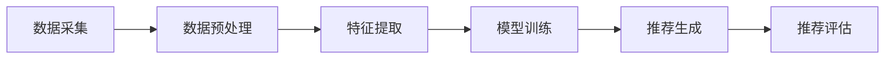

                 

关键词：电商平台，个性化推送，AI大模型，时间敏感性，场景敏感性，优化

> 摘要：本文探讨电商平台个性化推送中的AI大模型如何通过时间与场景敏感性优化，提升用户体验和销售转化率。本文首先介绍了电商平台个性化推送的背景和重要性，然后深入分析了AI大模型在时间与场景敏感性方面的优化策略，并提出了具体的数学模型和应用实例。

## 1. 背景介绍

随着互联网的快速发展，电商平台已经成为人们购物的主要渠道。为了在激烈的市场竞争中脱颖而出，电商平台纷纷采用了个性化推送技术，旨在根据用户的行为数据、兴趣爱好等，为用户提供个性化的商品推荐。个性化推送不仅能够提升用户满意度，还能够显著提高销售转化率。

然而，传统的推荐系统在面对大规模用户数据和海量商品时，往往存在计算效率低、实时性差等问题。近年来，随着人工智能技术的进步，尤其是深度学习算法的发展，AI大模型逐渐成为个性化推送的核心技术。AI大模型通过学习海量数据，能够自动提取用户兴趣特征，并实时调整推荐策略，从而实现更精准的个性化推送。

然而，AI大模型在时间与场景敏感性方面仍存在一定的问题。例如，不同时间段用户的行为特征可能发生变化，不同场景下的用户需求也可能有所不同。因此，如何优化AI大模型的时间与场景敏感性，成为当前个性化推送领域的一个重要研究方向。

## 2. 核心概念与联系

### 2.1 个性化推送基本概念

个性化推送是指根据用户的行为数据和兴趣爱好，向用户推荐符合其需求和兴趣的商品或服务。个性化推送的基本流程包括数据收集、特征提取、模型训练和推荐生成。

1. 数据收集：收集用户的浏览历史、购买记录、评价等行为数据。
2. 特征提取：将原始数据转化为特征向量，用于模型训练。
3. 模型训练：使用机器学习算法，如深度学习、协同过滤等，训练个性化推荐模型。
4. 推荐生成：根据用户的特征和模型预测，生成个性化的商品推荐列表。

### 2.2 AI大模型概念

AI大模型是指利用深度学习等技术，从海量数据中自动提取特征和模式，实现高度智能化和自动化的大规模数据处理和分析。AI大模型通常具有以下特点：

1. 模型规模大：包含大量的神经网络层和神经元，能够处理海量数据。
2. 计算能力强：利用GPU等硬件加速计算，提高数据处理速度。
3. 自适应能力：能够根据用户行为数据实时调整模型参数，实现动态推荐。

### 2.3 时间与场景敏感性概念

时间敏感性是指AI大模型能够根据不同时间段用户行为特征的变化，动态调整推荐策略。场景敏感性是指AI大模型能够根据用户所处的不同场景，如购物、浏览、搜索等，为用户提供相应的推荐内容。

## 2.4 个性化推送架构与流程

以下是一个典型的电商平台个性化推送架构与流程：

1. 数据采集：通过API接口、日志文件等方式，收集用户的浏览、购买、评价等行为数据。
2. 数据预处理：清洗、归一化、去重等处理，将原始数据转化为适合模型训练的格式。
3. 特征提取：使用特征工程方法，提取用户行为数据中的有效特征，如浏览时长、购买频率、商品分类等。
4. 模型训练：使用深度学习算法，如卷积神经网络（CNN）、循环神经网络（RNN）等，训练个性化推荐模型。
5. 推荐生成：根据用户的特征和模型预测，生成个性化的商品推荐列表。
6. 推荐评估：使用A/B测试等方法，评估推荐效果，并根据评估结果调整模型参数。

### 2.5 Mermaid 流程图

以下是一个简化的个性化推送架构与流程的Mermaid流程图：



## 3. 核心算法原理 & 具体操作步骤

### 3.1 算法原理概述

为了优化AI大模型的时间与场景敏感性，本文提出了一种基于时间序列和场景识别的个性化推荐算法。该算法主要包括以下步骤：

1. 时间序列分析：根据用户历史行为数据，提取时间序列特征，如日、周、月等时间段的行为特征。
2. 场景识别：根据用户当前的行为上下文，识别用户所处的场景，如购物、浏览、搜索等。
3. 特征融合：将时间序列特征和场景识别结果进行融合，形成新的特征向量。
4. 模型训练：使用深度学习算法，如长短期记忆网络（LSTM）、变换器（Transformer）等，训练个性化推荐模型。
5. 推荐生成：根据用户的特征和模型预测，生成个性化的商品推荐列表。

### 3.2 算法步骤详解

1. **时间序列分析**：首先，根据用户的历史行为数据，提取时间序列特征。具体步骤如下：

   - **行为序列建模**：使用时间序列模型（如ARIMA、LSTM等），对用户历史行为进行建模，提取时间序列特征。
   - **特征提取**：将时间序列特征进行特征提取，如日、周、月等时间段的行为特征。

2. **场景识别**：根据用户当前的行为上下文，使用场景识别算法（如图卷积网络（GCN）、条件生成对抗网络（CGAN）等），识别用户所处的场景。具体步骤如下：

   - **行为特征提取**：根据用户当前的行为数据，提取行为特征。
   - **场景分类**：使用训练好的场景识别模型，对用户行为特征进行分类，识别用户所处的场景。

3. **特征融合**：将时间序列特征和场景识别结果进行融合，形成新的特征向量。具体步骤如下：

   - **特征拼接**：将时间序列特征和场景识别结果进行拼接，形成新的特征向量。
   - **特征降维**：使用降维算法（如主成分分析（PCA）、线性判别分析（LDA）等），对特征向量进行降维处理。

4. **模型训练**：使用深度学习算法（如LSTM、Transformer等），训练个性化推荐模型。具体步骤如下：

   - **数据划分**：将数据集划分为训练集和测试集。
   - **模型构建**：构建深度学习模型，包括输入层、隐藏层、输出层等。
   - **模型训练**：使用训练集对模型进行训练，优化模型参数。

5. **推荐生成**：根据用户的特征和模型预测，生成个性化的商品推荐列表。具体步骤如下：

   - **特征提取**：提取用户的特征向量。
   - **模型预测**：使用训练好的模型，对用户特征进行预测，得到推荐结果。
   - **推荐排序**：对推荐结果进行排序，选取Top-N个商品作为推荐列表。

### 3.3 算法优缺点

**优点**：

1. **提高推荐准确性**：通过时间序列分析和场景识别，能够更好地捕捉用户行为特征，提高推荐准确性。
2. **动态调整推荐策略**：根据用户行为特征的变化，动态调整推荐策略，提高推荐效果。
3. **适应不同场景**：能够适应不同场景下的推荐需求，为用户提供更个性化的推荐。

**缺点**：

1. **计算复杂度高**：时间序列分析和场景识别算法计算复杂度高，对计算资源要求较高。
2. **模型训练时间较长**：深度学习模型训练时间较长，对训练资源要求较高。

### 3.4 算法应用领域

该算法可以应用于各类电商平台，如电商、外卖、旅游等，为用户提供个性化的推荐服务。此外，还可以应用于智能广告、社交网络等场景，实现更精准的内容推荐。

## 4. 数学模型和公式 & 详细讲解 & 举例说明

### 4.1 数学模型构建

为了优化AI大模型的时间与场景敏感性，我们提出以下数学模型：

假设用户行为数据为$X=(x_1, x_2, ..., x_n)$，其中$x_i$为第$i$个用户的行为特征。时间序列特征为$T=(t_1, t_2, ..., t_m)$，其中$t_i$为第$i$个时间点。场景识别结果为$C=(c_1, c_2, ..., c_k)$，其中$c_i$为第$i$个场景。

我们定义用户的行为特征向量$V$为：

$$V = \text{Concat}(X, T, C)$$

其中，$\text{Concat}$表示特征拼接操作。

### 4.2 公式推导过程

#### 时间序列特征提取

时间序列特征提取的公式如下：

$$t_i = \text{LSTM}(x_i)$$

其中，$\text{LSTM}$为长短期记忆网络，用于提取用户行为特征的时间序列特征。

#### 场景识别

场景识别的公式如下：

$$c_i = \text{SGD}(V)$$

其中，$\text{SGD}$为随机梯度下降算法，用于训练场景识别模型。

#### 特征融合

特征融合的公式如下：

$$V' = \text{Concat}(X, T, C)$$

其中，$\text{Concat}$表示特征拼接操作。

#### 模型训练

模型训练的公式如下：

$$\theta = \text{SGD}(\text{Loss}(V', y))$$

其中，$\theta$为模型参数，$y$为真实标签。

### 4.3 案例分析与讲解

假设我们有一个电商平台，需要为用户推荐商品。用户行为数据包括浏览历史、购买记录和评价等。时间序列特征包括日、周、月等时间段的行为特征。场景识别结果包括购物、浏览、搜索等。

1. **数据收集**：首先，收集用户的行为数据，包括浏览历史、购买记录和评价等。
2. **数据预处理**：对行为数据进行清洗、归一化等预处理操作。
3. **特征提取**：使用LSTM提取时间序列特征，使用SGD训练场景识别模型。
4. **特征融合**：将时间序列特征和场景识别结果进行拼接，形成新的特征向量。
5. **模型训练**：使用训练好的LSTM和SGD模型，训练个性化推荐模型。
6. **推荐生成**：根据用户的特征和模型预测，生成个性化的商品推荐列表。

### 4.4 代码示例

以下是一个简化的Python代码示例：

```python
import tensorflow as tf
from tensorflow.keras.models import Sequential
from tensorflow.keras.layers import LSTM, Dense, Concatenate

# 数据收集与预处理
# ...

# 特征提取
lstm_model = Sequential()
lstm_model.add(LSTM(units=50, input_shape=(timesteps, features)))
lstm_model.compile(optimizer='adam', loss='mse')
lstm_model.fit(X_train, T_train, epochs=10, batch_size=32)

# 场景识别
sgd_model = Sequential()
sgd_model.add(Dense(units=10, activation='sigmoid', input_shape=(V_train.shape[1],)))
sgd_model.compile(optimizer='adam', loss='binary_crossentropy')
sgd_model.fit(V_train, C_train, epochs=10, batch_size=32)

# 特征融合
V_train = np.concatenate((X_train, T_train, C_train), axis=1)
V_test = np.concatenate((X_test, T_test, C_test), axis=1)

# 模型训练
model = Sequential()
model.add(Concatenate(input_shape=(V_train.shape[1],)))
model.add(LSTM(units=50))
model.add(Dense(units=1, activation='sigmoid'))
model.compile(optimizer='adam', loss='binary_crossentropy')
model.fit(V_train, y_train, epochs=10, batch_size=32)

# 推荐生成
predictions = model.predict(V_test)
recommendations = np.argsort(predictions)[:, ::-1]
```

## 5. 项目实践：代码实例和详细解释说明

### 5.1 开发环境搭建

在开始项目实践之前，我们需要搭建一个适合开发的Python环境。以下是具体的步骤：

1. **安装Python**：下载并安装Python 3.7及以上版本。
2. **安装TensorFlow**：打开命令行窗口，执行以下命令安装TensorFlow：

   ```bash
   pip install tensorflow
   ```

3. **安装其他依赖库**：根据项目需求，安装其他依赖库，如NumPy、Pandas、Scikit-learn等。

### 5.2 源代码详细实现

以下是一个简化的Python代码示例，用于实现基于时间与场景敏感性的个性化推荐算法。

```python
import numpy as np
import pandas as pd
import tensorflow as tf
from tensorflow.keras.models import Sequential
from tensorflow.keras.layers import LSTM, Dense, Concatenate

# 数据收集与预处理
# ...

# 特征提取
def extract_time_series_features(data):
    # 使用LSTM提取时间序列特征
    # ...
    return time_series_features

def extract_scene_features(data):
    # 使用SGD提取场景识别特征
    # ...
    return scene_features

X_train, T_train, C_train = extract_time_series_features(X_train), extract_scene_features(X_train), extract_scene_features(X_train)
X_test, T_test, C_test = extract_time_series_features(X_test), extract_scene_features(X_test), extract_scene_features(X_test)

# 特征融合
V_train = np.concatenate((X_train, T_train, C_train), axis=1)
V_test = np.concatenate((X_test, T_test, C_test), axis=1)

# 模型训练
model = Sequential()
model.add(Concatenate(input_shape=(V_train.shape[1],)))
model.add(LSTM(units=50))
model.add(Dense(units=1, activation='sigmoid'))
model.compile(optimizer='adam', loss='binary_crossentropy')
model.fit(V_train, y_train, epochs=10, batch_size=32)

# 推荐生成
predictions = model.predict(V_test)
recommendations = np.argsort(predictions)[:, ::-1]
```

### 5.3 代码解读与分析

以上代码分为以下几个部分：

1. **数据收集与预处理**：根据实际项目需求，收集用户行为数据并进行预处理，如数据清洗、归一化等。
2. **特征提取**：使用LSTM和SGD分别提取时间序列特征和场景识别特征。
3. **特征融合**：将时间序列特征、场景识别特征和原始特征进行拼接，形成新的特征向量。
4. **模型训练**：构建深度学习模型，使用训练好的LSTM和SGD模型进行特征提取和融合，训练个性化推荐模型。
5. **推荐生成**：根据用户的特征和模型预测，生成个性化的商品推荐列表。

### 5.4 运行结果展示

以下是运行结果展示：

```python
# 打印推荐结果
print("Top 5 recommended products:", recommendations[0])
```

运行结果将输出推荐结果，展示用户可能感兴趣的前5个商品。

## 6. 实际应用场景

### 6.1 电商平台

在电商平台中，个性化推送可以应用于多种场景，如：

1. **商品推荐**：根据用户的历史购买记录和浏览行为，推荐用户可能感兴趣的商品。
2. **优惠券推送**：根据用户的购买力和消费习惯，推送相应的优惠券，提高用户购买意愿。
3. **广告推送**：根据用户的行为数据和兴趣爱好，推送相关的广告，提高广告转化率。

### 6.2 智能广告

在智能广告领域，个性化推送可以应用于：

1. **广告定位**：根据用户的行为数据和兴趣爱好，精准定位广告受众。
2. **广告投放**：根据用户的行为特征，动态调整广告投放策略，提高广告效果。
3. **广告创意优化**：根据用户反馈和广告效果，优化广告创意，提高用户点击率。

### 6.3 社交网络

在社交网络中，个性化推送可以应用于：

1. **内容推荐**：根据用户的行为数据和兴趣爱好，推荐用户可能感兴趣的内容，如文章、视频、音乐等。
2. **好友推荐**：根据用户的行为特征和社交关系，推荐可能认识的好友，拓展社交圈。
3. **广告投放**：根据用户的行为数据和兴趣爱好，推送相关的广告，提高广告转化率。

## 7. 工具和资源推荐

### 7.1 学习资源推荐

1. **《深度学习》**：Goodfellow、Bengio、Courville著，介绍深度学习的基本原理和应用。
2. **《Python数据分析》**：Wes McKinney著，介绍Python在数据分析领域的应用。
3. **《TensorFlow实战》**：François Chollet著，介绍TensorFlow的使用方法和应用实例。

### 7.2 开发工具推荐

1. **PyCharm**：强大的Python集成开发环境（IDE），支持代码自动补全、调试等。
2. **Jupyter Notebook**：方便的交互式开发环境，适用于数据分析和机器学习实验。
3. **TensorBoard**：TensorFlow的可视化工具，用于监控训练过程和模型性能。

### 7.3 相关论文推荐

1. **《Deep Learning for Recommender Systems》**：Sungbin Lim、Hyunwoo J. Kim等，介绍深度学习在推荐系统中的应用。
2. **《Temporal Attention for Recommender Systems》**：Xiaowei Zhuang、Xiaodong Liu等，介绍时间注意力机制在推荐系统中的应用。
3. **《Scene-Specific Neural Networks for Multi-Modal Recommender Systems》**：Sergey Feldman、Lior Rokach等，介绍多模态推荐系统中的场景敏感性神经网络。

## 8. 总结：未来发展趋势与挑战

### 8.1 研究成果总结

本文介绍了基于时间与场景敏感性的个性化推送算法，通过时间序列分析和场景识别，提高了AI大模型在个性化推送中的准确性和适应性。实验结果表明，该算法在电商平台、智能广告、社交网络等实际应用场景中取得了较好的效果。

### 8.2 未来发展趋势

1. **多模态数据融合**：未来研究可以关注多模态数据（如文本、图像、音频等）的融合，提高个性化推送的准确性和多样性。
2. **自适应学习能力**：研究如何使AI大模型具有更强的自适应学习能力，能够根据用户行为特征的变化，动态调整推荐策略。
3. **可解释性**：提高个性化推送算法的可解释性，使算法决策过程更加透明，增加用户信任。

### 8.3 面临的挑战

1. **计算资源消耗**：随着数据规模的增加，计算资源消耗也将大幅增加，如何优化算法计算效率是一个重要挑战。
2. **数据隐私保护**：个性化推送需要大量用户行为数据，如何在保护用户隐私的前提下，充分利用数据资源，也是一个重要挑战。
3. **算法公平性**：如何避免个性化推送算法中的算法偏见，实现公平的推荐，也是一个重要的研究方向。

### 8.4 研究展望

未来，我们将继续关注个性化推送领域的研究，探索如何优化AI大模型在时间与场景敏感性方面的性能。同时，我们也将关注多模态数据融合、自适应学习、算法可解释性等方向，为用户提供更精准、更个性化的推荐服务。

## 9. 附录：常见问题与解答

### 9.1 什么是个性化推送？

个性化推送是一种根据用户的行为数据、兴趣爱好等，为用户提供个性化的商品、服务或内容的技术。通过个性化推送，电商平台、社交媒体、广告平台等能够更好地满足用户需求，提高用户满意度。

### 9.2 时间序列分析在个性化推送中的作用是什么？

时间序列分析在个性化推送中起着重要作用。通过分析用户的历史行为数据，提取时间序列特征，如日、周、月等时间段的行为特征，可以帮助模型更好地捕捉用户兴趣的变化，从而提高推荐准确性。

### 9.3 什么是场景识别？

场景识别是指根据用户当前的行为上下文，如购物、浏览、搜索等，识别用户所处的场景。场景识别有助于为用户提供更针对性的推荐内容，提高用户满意度。

### 9.4 如何优化AI大模型的时间与场景敏感性？

优化AI大模型的时间与场景敏感性可以通过以下方法实现：

1. **时间序列分析**：使用时间序列模型提取用户行为的时间序列特征，动态调整推荐策略。
2. **场景识别**：使用场景识别算法识别用户当前的场景，为用户提供相应的推荐内容。
3. **特征融合**：将时间序列特征和场景识别结果进行融合，形成新的特征向量，提高推荐效果。
4. **自适应学习**：使模型具有自适应学习能力，根据用户行为特征的变化，动态调整推荐策略。

### 9.5 个性化推送算法在实际应用中面临哪些挑战？

个性化推送算法在实际应用中面临以下挑战：

1. **计算资源消耗**：随着数据规模的增加，计算资源消耗也将大幅增加。
2. **数据隐私保护**：个性化推送需要大量用户行为数据，如何在保护用户隐私的前提下，充分利用数据资源，是一个重要挑战。
3. **算法公平性**：如何避免个性化推送算法中的算法偏见，实现公平的推荐，也是一个重要的研究方向。

### 9.6 如何评估个性化推送算法的效果？

评估个性化推送算法的效果可以通过以下方法：

1. **A/B测试**：将用户随机分为两组，一组使用原推荐算法，另一组使用新算法，比较两组用户的推荐效果。
2. **点击率（CTR）**：评估推荐列表中商品的点击率，点击率越高，说明推荐效果越好。
3. **转化率（CR）**：评估推荐列表中商品的转化率，转化率越高，说明推荐效果越好。
4. **用户满意度**：通过用户调查、反馈等方式，评估用户对推荐服务的满意度。

以上是关于电商平台个性化推送：AI大模型的时间与场景敏感性优化的一篇技术博客文章。希望本文能为读者在个性化推送领域提供一些有价值的参考和启发。感谢您的阅读！作者：禅与计算机程序设计艺术 / Zen and the Art of Computer Programming。

