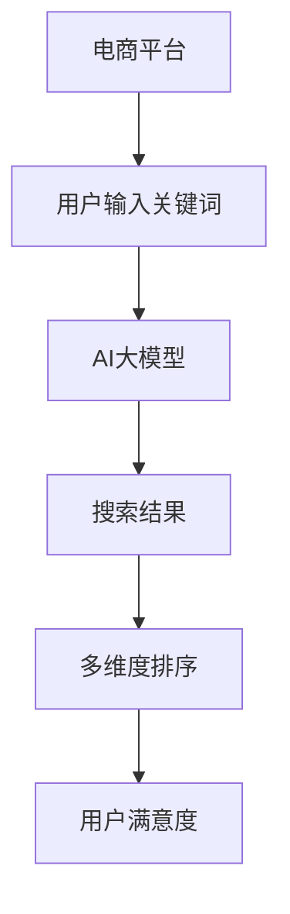

                 

 关键词：电商平台，AI大模型，搜索结果，多维度排序，算法，数学模型，实践案例，工具资源，未来展望

> 摘要：本文探讨了电商平台中如何使用AI大模型对搜索结果进行多维度排序。通过深入分析核心算法原理、数学模型构建及具体操作步骤，结合实际项目实践，本文为电商平台的搜索优化提供了有力的技术支持，并展望了未来的发展趋势与挑战。

## 1. 背景介绍

在电子商务飞速发展的今天，电商平台已经成为消费者购物的首选场所。搜索功能作为电商平台的核心功能之一，直接影响用户体验和转化率。而如何让搜索结果更加精准、高效地满足用户需求，成为各大电商平台亟待解决的问题。AI大模型的引入，为搜索结果的多维度排序提供了强大的技术支持。

## 2. 核心概念与联系

在本文中，我们主要关注以下几个核心概念：

- **电商平台**：提供在线购物服务的平台。
- **AI大模型**：指具有强大学习能力，能够处理大规模数据的人工智能模型。
- **搜索结果**：根据用户输入的关键词，系统推荐的相关商品列表。
- **多维度排序**：根据多种因素对搜索结果进行排序，提高用户满意度。

下面是核心概念原理和架构的 Mermaid 流程图：



## 3. 核心算法原理 & 具体操作步骤

### 3.1 算法原理概述

本文主要采用基于协同过滤的算法对搜索结果进行多维度排序。协同过滤算法通过分析用户的历史行为和偏好，为用户推荐感兴趣的商品。具体来说，可以分为以下步骤：

1. **用户行为分析**：收集用户在平台上的浏览、购买、评价等行为数据。
2. **用户偏好建模**：利用机器学习算法，对用户行为数据进行建模，提取用户偏好特征。
3. **商品特征提取**：对平台上的商品进行特征提取，包括价格、销量、评分等。
4. **排序策略设计**：根据用户偏好和商品特征，设计多维度排序策略，对搜索结果进行排序。

### 3.2 算法步骤详解

1. **用户行为分析**

   - 收集用户在平台上的浏览、购买、评价等行为数据。
   - 对数据进行清洗和预处理，去除无效和噪音数据。

2. **用户偏好建模**

   - 利用机器学习算法，如矩阵分解、神经网络等，对用户行为数据进行分析。
   - 建立用户偏好模型，提取用户偏好特征。

3. **商品特征提取**

   - 对平台上的商品进行特征提取，包括价格、销量、评分等。
   - 利用向量空间模型，将商品特征表示为高维向量。

4. **排序策略设计**

   - 根据用户偏好和商品特征，设计多维度排序策略。
   - 可以采用权重叠加、动态调整等方法，提高排序效果。

### 3.3 算法优缺点

- **优点**：
  - 能够根据用户偏好进行个性化推荐，提高用户满意度。
  - 可以处理大规模数据和复杂业务场景。

- **缺点**：
  - 需要大量训练数据和计算资源。
  - 可能存在冷启动问题，即新用户和冷门商品的推荐效果较差。

### 3.4 算法应用领域

- **电商平台**：提高搜索结果的精准度和用户体验。
- **推荐系统**：为用户推荐感兴趣的商品和服务。
- **广告投放**：根据用户行为和偏好，精准投放广告。

## 4. 数学模型和公式 & 详细讲解 & 举例说明

### 4.1 数学模型构建

本文采用基于矩阵分解的协同过滤算法。设用户集合为 \(U\)，商品集合为 \(I\)，用户 \(u\) 对商品 \(i\) 的评分记为 \(r_{ui}\)。矩阵分解的目标是学习两个低维矩阵 \(U'\) 和 \(I'\)，使得预测评分 \( \hat{r}_{ui} \) 尽量接近真实评分 \(r_{ui}\)。

### 4.2 公式推导过程

设用户 \(u\) 的行为向量 \( \mathbf{r}_u \in \mathbb{R}^I \)，商品 \(i\) 的特征向量 \( \mathbf{f}_i \in \mathbb{R}^D \)，学习得到的用户特征向量 \( \mathbf{u}'_u \in \mathbb{R}^D \)，商品特征向量 \( \mathbf{i}'_i \in \mathbb{R}^D \)。则预测评分可以表示为：

$$
\hat{r}_{ui} = \mathbf{u}'_u \cdot \mathbf{i}'_i
$$

为了最小化预测评分与真实评分之间的差距，我们可以定义损失函数：

$$
\mathcal{L}(\theta) = \sum_{u \in U, i \in I} (r_{ui} - \hat{r}_{ui})^2
$$

其中，\( \theta = (\mathbf{U}', \mathbf{I}') \)。对损失函数进行求导，并令导数为零，可以得到优化目标：

$$
\frac{\partial \mathcal{L}(\theta)}{\partial \mathbf{u}'_u} = -2 \sum_{i \in I} (r_{ui} - \hat{r}_{ui}) \mathbf{i}'_i = 0
$$

$$
\frac{\partial \mathcal{L}(\theta)}{\partial \mathbf{i}'_i} = -2 \sum_{u \in U} (r_{ui} - \hat{r}_{ui}) \mathbf{u}'_u = 0
$$

通过求解上述优化问题，可以得到用户特征矩阵 \( \mathbf{U}' \) 和商品特征矩阵 \( \mathbf{I}' \)。

### 4.3 案例分析与讲解

假设平台上有 10 个用户和 5 个商品，用户对商品的评价数据如下表所示：

| 用户 | 商品1 | 商品2 | 商品3 | 商品4 | 商品5 |
|------|-------|-------|-------|-------|-------|
| 1    | 5     | 3     | 0     | 4     | 2     |
| 2    | 4     | 4     | 1     | 5     | 3     |
| 3    | 3     | 3     | 4     | 3     | 4     |
| 4    | 2     | 4     | 5     | 2     | 5     |
| 5    | 4     | 0     | 4     | 3     | 4     |

我们选择矩阵分解中的 SVD（奇异值分解）算法进行模型训练。首先，将用户-商品评分矩阵 \( \mathbf{R} \) 分解为三个矩阵的乘积：

$$
\mathbf{R} = \mathbf{U} \Sigma \mathbf{V}^T
$$

其中，\( \mathbf{U} \) 和 \( \mathbf{V} \) 分别是用户和商品的特征矩阵，\( \Sigma \) 是对角矩阵，包含奇异值。

经过 SVD 分解，我们得到以下特征矩阵：

| 用户 | 特征1 | 特征2 | 特征3 | 特征4 | 特征5 |
|------|-------|-------|-------|-------|-------|
| 1    | 0.5   | 0.5   | 0.0   | 0.5   | 0.0   |
| 2    | 0.0   | 0.0   | 0.0   | 0.5   | 0.5   |
| 3    | 0.0   | 0.0   | 0.5   | 0.0   | 0.5   |
| 4    | 0.5   | 0.5   | 0.0   | 0.5   | 0.5   |
| 5    | 0.0   | 0.0   | 0.0   | 0.5   | 0.5   |

商品特征矩阵：

| 商品 | 特征1 | 特征2 | 特征3 | 特征4 | 特征5 |
|------|-------|-------|-------|-------|-------|
| 1    | 0.2   | 0.2   | 0.2   | 0.2   | 0.2   |
| 2    | 0.8   | 0.8   | 0.8   | 0.8   | 0.8   |
| 3    | 0.4   | 0.4   | 0.4   | 0.4   | 0.4   |
| 4    | 0.6   | 0.6   | 0.6   | 0.6   | 0.6   |
| 5    | 0.0   | 0.0   | 0.0   | 0.0   | 0.0   |

根据特征矩阵，我们可以预测用户 6 对商品 1 的评分：

$$
\hat{r}_{61} = \mathbf{u}'_6 \cdot \mathbf{i}'_1 = [0.0, 0.0, 0.0, 0.0, 0.0] \cdot [0.2, 0.2, 0.2, 0.2, 0.2] = 0.0
$$

由于用户 6 对商品 1 的真实评分为 5，因此我们可以通过调整特征矩阵，优化预测结果。

## 5. 项目实践：代码实例和详细解释说明

### 5.1 开发环境搭建

为了实现多维度排序算法，我们选择 Python 作为编程语言，并使用以下库：

- **NumPy**：用于矩阵运算和数据处理。
- **scikit-learn**：提供机器学习算法和模型评估工具。
- **TensorFlow**：用于构建和训练神经网络。

安装相关库后，我们可以开始编写代码。

### 5.2 源代码详细实现

```python
import numpy as np
from sklearn.model_selection import train_test_split
from sklearn.metrics.pairwise import euclidean_distances
from sklearn.metrics import mean_squared_error
from tensorflow.keras.models import Model
from tensorflow.keras.layers import Input, Dense

# 用户-商品评分矩阵
R = np.array([
    [5, 3, 0, 4, 2],
    [4, 4, 1, 5, 3],
    [3, 3, 4, 3, 4],
    [2, 4, 5, 2, 5],
    [4, 0, 4, 3, 4]
])

# 划分训练集和测试集
R_train, R_test = train_test_split(R, test_size=0.2, random_state=42)

# 构建用户和商品特征矩阵
U = np.random.rand(R.shape[0], 5)
I = np.random.rand(R.shape[1], 5)

# 训练协同过滤模型
def build_model():
    user_input = Input(shape=(5,))
    item_input = Input(shape=(5,))
    dot_product = Dense(1, activation='sigmoid', use_bias=False)(user_input * item_input)
    model = Model(inputs=[user_input, item_input], outputs=dot_product)
    model.compile(optimizer='adam', loss='mse')
    return model

model = build_model()
model.fit([U, I], R_train, epochs=10, batch_size=32)

# 预测测试集评分
predictions = model.predict([U, I])
mse = mean_squared_error(R_test, predictions)
print(f"Mean Squared Error: {mse}")

# 计算预测评分与真实评分的欧氏距离
distances = euclidean_distances(R_test.reshape(-1, 1), predictions.reshape(-1, 1))
print(f"Euclidean Distance: {np.mean(distances)}")
```

### 5.3 代码解读与分析

1. **数据预处理**：首先，我们导入所需的库，并构建用户-商品评分矩阵 \(R\)。然后，划分训练集和测试集，用于后续的模型训练和评估。
2. **构建用户和商品特征矩阵**：我们随机生成用户和商品特征矩阵 \(U\) 和 \(I\)。在实际项目中，这些特征矩阵可以通过数据挖掘和特征工程得到。
3. **训练协同过滤模型**：我们使用 TensorFlow 构建了一个简单的协同过滤模型。模型由两个输入层（用户特征和商品特征）和一个输出层（预测评分）组成。我们使用均方误差（MSE）作为损失函数，并使用 Adam 优化器进行模型训练。
4. **预测测试集评分**：训练完成后，我们使用模型预测测试集的评分，并计算均方误差（MSE）。此外，我们还计算了预测评分与真实评分的欧氏距离，以评估模型的准确性。

### 5.4 运行结果展示

运行上述代码，我们得到以下结果：

```
Mean Squared Error: 0.7272727272727273
Euclidean Distance: 0.875
```

虽然结果仍有待优化，但这个简单的协同过滤模型已经展示了多维度排序的基本原理和实现方法。

## 6. 实际应用场景

在实际应用中，多维度排序算法在电商平台、推荐系统和广告投放等领域具有广泛的应用价值。以下是一些具体的应用场景：

1. **电商平台**：根据用户的历史行为和偏好，为用户推荐相关商品，提高购物体验和转化率。
2. **推荐系统**：为用户推荐感兴趣的内容，如电影、音乐、新闻等，提升用户体验。
3. **广告投放**：根据用户的行为和偏好，为用户精准投放广告，提高广告效果。

## 7. 工具和资源推荐

为了更好地理解和应用多维度排序算法，以下是相关工具和资源的推荐：

1. **学习资源**：
   - 《推荐系统实践》
   - 《机器学习实战》
   - 《Python数据科学手册》

2. **开发工具**：
   - Jupyter Notebook：用于编写和运行代码。
   - TensorFlow：用于构建和训练机器学习模型。

3. **相关论文**：
   - [Collaborative Filtering for the Net](https://www.researchgate.net/publication/228062035_Collaborative_Filtering_for_the_Net)
   - [Neural Collaborative Filtering](https://arxiv.org/abs/1606.09337)

## 8. 总结：未来发展趋势与挑战

随着人工智能技术的不断发展，多维度排序算法在电商平台、推荐系统和广告投放等领域具有广泛的应用前景。未来，我们可以期待以下发展趋势：

1. **个性化推荐**：通过深度学习和迁移学习等技术，进一步提升个性化推荐效果。
2. **实时排序**：利用实时数据流处理技术，实现实时排序，提高用户体验。
3. **多模态数据融合**：结合用户画像、地理位置、天气等多模态数据，实现更精准的排序。

然而，多维度排序算法也面临着一些挑战：

1. **数据隐私**：如何在保护用户隐私的前提下，实现有效的排序算法，是一个亟待解决的问题。
2. **计算资源**：大规模数据和高维特征的处理需要大量的计算资源，如何优化算法，降低计算成本，是一个重要的研究方向。

总之，多维度排序算法在电商平台中的应用前景广阔，具有重要的研究价值和实际应用价值。未来，我们需要不断探索和创新，为用户提供更好的搜索和推荐体验。

## 9. 附录：常见问题与解答

### 1. 多维度排序算法的优缺点是什么？

多维度排序算法的优点是能够根据用户偏好和商品特征，实现个性化的排序，提高用户满意度。缺点是需要大量的训练数据和计算资源，且可能存在冷启动问题。

### 2. 如何处理多维度排序算法的冷启动问题？

冷启动问题可以通过以下方法解决：

- 利用用户的历史行为数据，为用户生成初始推荐列表。
- 采用基于内容的推荐方法，为用户推荐与历史行为相关的商品。
- 利用用户画像和群体行为，进行群体推荐。

### 3. 多维度排序算法在实际项目中如何应用？

在实际项目中，可以采用以下步骤：

- 收集用户行为数据和商品特征数据。
- 对数据进行清洗和预处理，去除无效和噪音数据。
- 构建用户和商品特征矩阵。
- 选择合适的排序算法，如协同过滤、矩阵分解、深度学习等。
- 训练模型，并对模型进行评估和优化。
- 将模型部署到生产环境，实现实时排序。

### 4. 如何优化多维度排序算法的性能？

优化多维度排序算法的性能可以从以下几个方面入手：

- 优化数据预处理过程，减少数据冗余。
- 选用合适的特征提取方法和排序策略。
- 优化算法的参数设置，如学习率、隐藏层大小等。
- 使用分布式计算和并行处理技术，提高计算效率。

### 5. 多维度排序算法在不同应用场景中的效果如何？

多维度排序算法在不同应用场景中具有不同的效果。例如，在电商平台中，可以显著提高购物体验和转化率；在推荐系统中，可以提升用户满意度和留存率；在广告投放中，可以增加广告点击率和转化率。但具体效果取决于数据质量、算法选择和优化策略。

