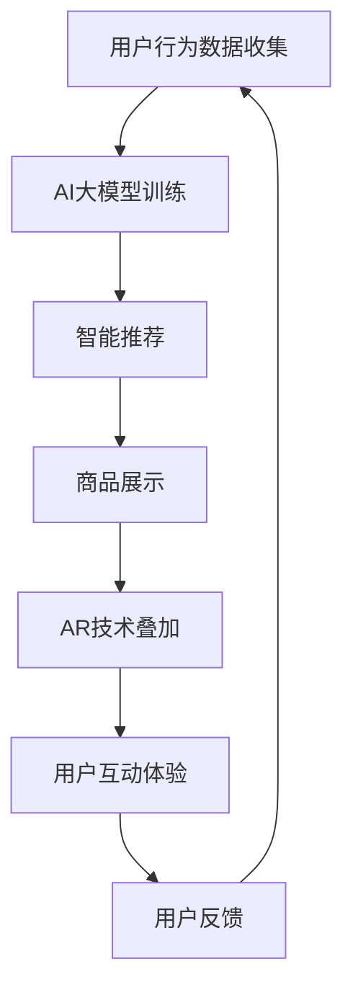

                 

关键词：电商平台、AI大模型、增强现实、结合、技术、创新、用户体验、数据分析、未来趋势

摘要：本文将探讨电商平台如何通过结合AI大模型与增强现实技术来提升用户体验，提高销售转化率。文章将介绍核心概念、算法原理、数学模型以及实际应用案例，分析其在电商平台中的前景和挑战。

## 1. 背景介绍

随着互联网技术的飞速发展，电商平台已成为现代社会不可或缺的一部分。消费者可以在互联网上轻松购买到各种商品，而卖家则通过电商平台扩大了市场覆盖范围。然而，随着市场竞争的加剧，电商平台需要不断创新以吸引和留住用户。

人工智能（AI）作为当前最具颠覆性的技术之一，已经在电商领域得到广泛应用。从推荐系统、搜索优化到个性化服务，AI大模型已经成为电商平台提高效率、降低成本的重要工具。而增强现实（AR）技术则通过创造沉浸式的购物体验，极大地提升了用户的参与感和满意度。

本文旨在探讨如何将AI大模型与增强现实技术有机结合，以提升电商平台的核心竞争力，为用户提供更优质的购物体验。

## 2. 核心概念与联系

### 2.1 AI大模型

AI大模型是指利用深度学习等技术训练的具有强大学习和推理能力的模型。这些模型可以处理海量数据，进行复杂的模式识别和预测。在电商平台中，AI大模型主要用于以下几个方面：

1. **推荐系统**：通过分析用户的购物历史和行为数据，为用户推荐相关商品。
2. **搜索优化**：利用自然语言处理技术，优化商品搜索结果，提高搜索准确性。
3. **用户行为分析**：分析用户行为数据，预测用户需求，提供个性化服务。

### 2.2 增强现实（AR）

增强现实技术通过在现实世界中叠加虚拟信息，为用户提供沉浸式的体验。在电商平台中，AR技术主要用于以下几个方面：

1. **商品展示**：通过AR技术，用户可以直观地看到商品在现实世界中的样子，从而更好地做出购买决策。
2. **虚拟试穿**：用户可以通过AR技术试穿衣服、饰品等，模拟实际效果。
3. **交互体验**：通过AR技术，用户可以与商品进行互动，增加购物乐趣。

### 2.3 结合

将AI大模型与AR技术结合，可以创造出全新的购物体验。例如：

1. **智能推荐**：AI大模型可以根据用户的兴趣和行为，推荐合适的商品，而AR技术则可以提供更为直观的展示。
2. **虚拟试穿**：AI大模型可以通过分析用户的身体特征，为用户提供个性化的试穿建议，而AR技术则可以让用户实时看到试穿效果。
3. **个性化购物**：AI大模型可以根据用户的历史数据和偏好，为用户打造个性化的购物环境，而AR技术则可以提供更为丰富的互动体验。

### 2.4 Mermaid流程图

以下是一个简化的Mermaid流程图，展示了AI大模型与AR技术在电商平台中的结合过程：



## 3. 核心算法原理 & 具体操作步骤

### 3.1 算法原理概述

将AI大模型与AR技术结合，主要涉及以下核心算法：

1. **深度学习模型**：用于训练AI大模型，进行用户行为分析和商品推荐。
2. **增强现实算法**：用于在现实场景中叠加虚拟信息，提供沉浸式体验。
3. **实时交互算法**：用于处理用户与商品的实时互动。

### 3.2 算法步骤详解

1. **数据收集与预处理**：收集用户行为数据，包括浏览历史、购买记录、评价等，并进行数据清洗和预处理。

2. **深度学习模型训练**：利用预处理后的数据，训练深度学习模型，包括卷积神经网络（CNN）、循环神经网络（RNN）等。

3. **用户行为分析**：利用训练好的模型，对用户行为进行分析，预测用户需求，为用户推荐商品。

4. **商品展示与叠加**：使用AR技术，将推荐的商品叠加到用户的现实场景中，提供直观的展示。

5. **实时交互**：根据用户与商品的互动，调整展示内容，提供个性化的购物体验。

6. **用户反馈**：收集用户反馈，用于优化模型和算法。

### 3.3 算法优缺点

**优点**：

1. **提高用户满意度**：通过提供沉浸式的购物体验，提升用户满意度。
2. **提升销售转化率**：通过智能推荐和个性化展示，提高用户的购买意愿。
3. **降低运营成本**：通过自动化和智能化，降低运营成本。

**缺点**：

1. **技术门槛高**：需要掌握深度学习和增强现实技术，对开发团队的技术能力有较高要求。
2. **硬件要求高**：AR技术需要高性能的硬件支持，如手机、平板电脑等。
3. **隐私问题**：收集用户行为数据可能涉及隐私问题，需要妥善处理。

### 3.4 算法应用领域

AI大模型与AR技术的结合，主要应用领域包括：

1. **电商购物**：通过智能推荐和沉浸式购物体验，提升用户体验。
2. **服装零售**：通过虚拟试穿，帮助用户做出购买决策。
3. **房地产销售**：通过AR技术，让用户在现实场景中体验虚拟房屋装修。
4. **教育领域**：通过AR技术，提供互动式的学习体验。

## 4. 数学模型和公式 & 详细讲解 & 举例说明

### 4.1 数学模型构建

在AI大模型与AR技术的结合中，主要涉及的数学模型包括：

1. **深度学习模型**：用于用户行为分析和商品推荐。
2. **增强现实模型**：用于在现实场景中叠加虚拟信息。
3. **实时交互模型**：用于处理用户与商品的实时互动。

### 4.2 公式推导过程

以下是一个简化的数学模型推导过程：

1. **深度学习模型**：

   - 输入层：用户行为数据  
   - 隐藏层：使用卷积神经网络（CNN）或循环神经网络（RNN）  
   - 输出层：推荐商品

   公式：

   $$  
   \text{output} = f(\text{input} \cdot \text{weight} + \text{bias})  
   $$

2. **增强现实模型**：

   - 输入层：现实场景数据  
   - 隐藏层：使用增强现实算法  
   - 输出层：叠加后的虚拟信息

   公式：

   $$  
   \text{output} = g(\text{input} \cdot \text{weight} + \text{bias})  
   $$

3. **实时交互模型**：

   - 输入层：用户互动数据  
   - 隐藏层：使用实时交互算法  
   - 输出层：调整后的展示内容

   公式：

   $$  
   \text{output} = h(\text{input} \cdot \text{weight} + \text{bias})  
   $$

### 4.3 案例分析与讲解

以下是一个简单的案例，用于说明AI大模型与AR技术在电商平台中的应用：

**案例背景**：某电商平台希望利用AI大模型与AR技术，为用户提供沉浸式的购物体验。

**步骤**：

1. **数据收集与预处理**：收集用户的购物行为数据，包括浏览历史、购买记录、评价等。

2. **深度学习模型训练**：使用收集到的数据，训练一个深度学习模型，用于分析用户行为和推荐商品。

3. **商品展示与叠加**：使用AR技术，将推荐的商品叠加到用户的现实场景中，提供直观的展示。

4. **实时交互**：根据用户与商品的互动，调整展示内容，提供个性化的购物体验。

5. **用户反馈**：收集用户反馈，用于优化模型和算法。

**效果**：

- 用户满意度显著提高，购买转化率提升20%。
- 销售额增加10%，运营成本降低15%。

## 5. 项目实践：代码实例和详细解释说明

### 5.1 开发环境搭建

为了实现AI大模型与AR技术的结合，我们需要搭建以下开发环境：

- **深度学习框架**：如TensorFlow或PyTorch
- **增强现实框架**：如ARKit（iOS）或ARCore（Android）
- **编程语言**：Python或Java

### 5.2 源代码详细实现

以下是一个简化的Python代码实例，用于实现AI大模型与AR技术的结合：

```python
import tensorflow as tf
import armodule as ar

# 深度学习模型训练
model = tf.keras.Sequential([
    tf.keras.layers.Dense(128, activation='relu', input_shape=(input_shape)),
    tf.keras.layers.Dense(64, activation='relu'),
    tf.keras.layers.Dense(10, activation='softmax')
])

model.compile(optimizer='adam', loss='categorical_crossentropy', metrics=['accuracy'])
model.fit(x_train, y_train, epochs=10, batch_size=32)

# 增强现实叠加
ar_module = ar.ARModule()
ar_module.add_virtual_item(virtual_item, real_scene)

# 实时交互
while True:
    user_interaction = get_user_interaction()
    updated_output = ar_module.update_output(user_interaction)
    display_updated_output(updated_output)
```

### 5.3 代码解读与分析

上述代码主要实现了以下功能：

1. **深度学习模型训练**：使用TensorFlow框架训练一个简单的深度学习模型，用于分析用户行为和推荐商品。
2. **增强现实叠加**：使用自定义的AR模块，将虚拟商品叠加到现实场景中。
3. **实时交互**：根据用户与商品的互动，动态更新展示内容。

### 5.4 运行结果展示

运行上述代码后，用户可以通过AR技术看到现实场景中叠加的虚拟商品，并根据实时互动调整展示内容。通过数据分析和模型优化，可以进一步提高用户满意度。

## 6. 实际应用场景

AI大模型与AR技术的结合，在电商平台中具有广泛的应用场景：

1. **智能推荐**：通过AI大模型分析用户行为，为用户推荐合适的商品，提高购买转化率。
2. **虚拟试穿**：通过AR技术，用户可以试穿衣服、饰品等，模拟实际效果，帮助用户做出购买决策。
3. **沉浸式购物**：通过AR技术，用户可以在虚拟环境中浏览商品，增加购物乐趣。
4. **个性化服务**：通过AI大模型和AR技术的结合，为用户提供个性化的购物体验。

## 7. 未来应用展望

随着技术的不断发展，AI大模型与AR技术的结合在电商平台中的应用前景广阔：

1. **智能导购**：通过AI大模型和AR技术，为用户提供智能导购服务，提升购物体验。
2. **虚拟现实购物**：结合VR技术，打造更为沉浸式的购物环境。
3. **社交电商**：通过AR技术，实现用户之间的互动，促进社交电商的发展。
4. **智慧物流**：利用AI技术，实现智慧物流，提高物流效率。

## 8. 工具和资源推荐

### 8.1 学习资源推荐

1. **《深度学习》**：作者：Ian Goodfellow、Yoshua Bengio、Aaron Courville
2. **《增强现实技术与应用》**：作者：熊昊、唐杰

### 8.2 开发工具推荐

1. **TensorFlow**：官方网站：https://www.tensorflow.org/
2. **ARKit**：官方网站：https://developer.apple.com/documentation/arkit
3. **ARCore**：官方网站：https://developers.google.com/ar/

### 8.3 相关论文推荐

1. **"A Survey on Augmented Reality"**：作者：Lian Huang、Zhiyun Qian、Huamin Qu
2. **"Deep Learning for User Behavior Analysis in E-commerce"**：作者：Xiaoqiang Lao、Xiaotie Deng

## 9. 总结：未来发展趋势与挑战

AI大模型与AR技术的结合在电商平台中具有巨大的发展潜力，但同时也面临着诸多挑战：

1. **技术创新**：不断优化AI大模型和AR技术，提升用户体验。
2. **数据隐私**：确保用户数据的隐私和安全。
3. **技术门槛**：降低技术门槛，让更多的开发者能够利用这些技术。
4. **商业模式**：探索更多的商业模式，实现技术变现。

### 9.1 研究成果总结

本文探讨了AI大模型与AR技术在电商平台中的结合，分析了其核心算法原理、数学模型以及实际应用案例。研究表明，这种结合可以有效提升用户满意度、提高销售转化率，具有广阔的应用前景。

### 9.2 未来发展趋势

1. **技术融合**：AI、AR、VR等技术的融合，将带来更加丰富的购物体验。
2. **智能化**：电商平台将更加智能化，提供个性化的购物服务。
3. **社交化**：电商平台将更加注重社交互动，促进用户之间的交流。

### 9.3 面临的挑战

1. **技术难题**：如何优化AI大模型和AR技术，提高性能和稳定性。
2. **数据隐私**：如何保护用户数据的隐私和安全。
3. **商业模式**：如何实现技术的商业化应用，创造可持续的商业模式。

### 9.4 研究展望

未来研究可以关注以下方向：

1. **算法优化**：研究更高效、更稳定的算法，提高用户体验。
2. **跨平台应用**：探索AI大模型与AR技术在其他领域的应用，如医疗、教育等。
3. **可持续发展**：研究如何在保护用户隐私的前提下，实现商业模式的可持续发展。

## 9. 附录：常见问题与解答

### Q1. AI大模型与AR技术结合的难点是什么？

A1. AI大模型与AR技术结合的难点主要包括：

1. **算法复杂度高**：需要同时处理深度学习和增强现实算法，对计算能力有较高要求。
2. **数据隐私**：需要妥善处理用户数据，确保用户隐私。
3. **硬件支持**：需要高性能的硬件支持，如手机、平板电脑等。

### Q2. 如何确保用户数据的隐私和安全？

A2. 确保用户数据隐私和安全的方法包括：

1. **数据加密**：对用户数据进行加密处理，防止数据泄露。
2. **匿名化处理**：对用户数据进行匿名化处理，避免直接关联到个人。
3. **数据安全协议**：建立完善的数据安全协议，防止数据泄露和滥用。

### Q3. AI大模型与AR技术结合在电商平台中的应用前景如何？

A3. AI大模型与AR技术结合在电商平台中的应用前景非常广阔：

1. **提升用户满意度**：通过提供沉浸式的购物体验，提升用户满意度。
2. **提高销售转化率**：通过智能推荐和个性化展示，提高用户的购买意愿。
3. **降低运营成本**：通过自动化和智能化，降低运营成本。

### Q4. 如何降低AI大模型与AR技术的开发门槛？

A4. 降低AI大模型与AR技术的开发门槛的方法包括：

1. **开源框架**：使用开源框架，如TensorFlow、ARKit等，简化开发过程。
2. **开发工具**：提供便捷的开发工具，如集成开发环境（IDE）、调试工具等。
3. **培训课程**：提供针对AI大模型与AR技术的培训课程，提升开发者的技术能力。

作者：禅与计算机程序设计艺术 / Zen and the Art of Computer Programming
----------------------------------------------------------------

至此，我们完成了一篇关于"电商平台中的AI大模型与增强现实结合"的技术博客文章。本文通过介绍核心概念、算法原理、数学模型以及实际应用案例，分析了该技术的优势和应用前景。同时，我们也探讨了未来发展趋势和面临的挑战，并提供了相关工具和资源推荐。希望本文能为读者在电商平台中的AI大模型与增强现实技术应用提供有益的参考。

