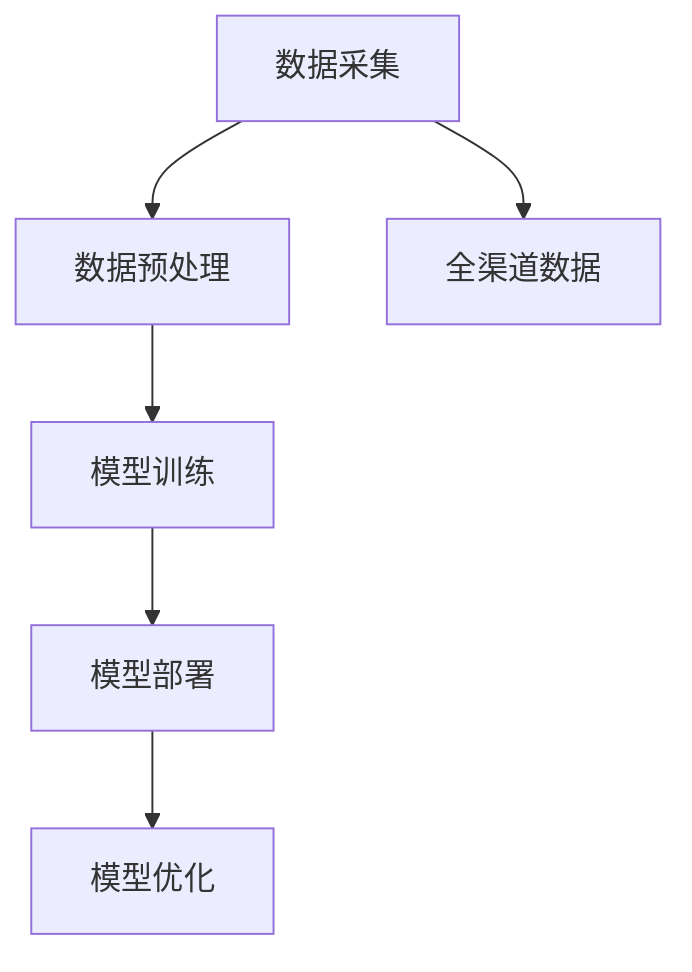

                 

关键词：电商平台，人工智能，大数据模型，渠道融合，全渠道，数据挖掘，机器学习，预测分析，客户体验优化

> 摘要：本文深入探讨了电商平台如何利用人工智能（AI）大模型实现从单一渠道到全渠道的数据融合。通过分析AI大模型的核心概念和原理，详细介绍了其在电商平台中的应用场景、技术实现、数学模型和实际案例。文章旨在为电商平台从业者提供有价值的参考，以推动全渠道数据融合的深入发展。

## 1. 背景介绍

随着互联网的普及和电子商务的快速发展，电商平台已经成为人们生活中不可或缺的一部分。然而，在市场竞争日益激烈的今天，电商平台如何提升客户体验、降低运营成本、提高销售额成为关键问题。数据驱动的智能化转型成为电商平台的发展方向，其中AI大模型的应用尤为关键。

### 1.1 电商平台的发展现状

目前，电商平台主要依赖于单一渠道的数据，如网站、移动应用等，这些渠道虽然能够提供一定的用户行为数据，但数据量有限，无法全面反映用户需求和市场趋势。而单一渠道的数据处理能力也受限，难以实现精准营销和个性化服务。

### 1.2 AI大模型的应用前景

AI大模型具有强大的数据处理和分析能力，能够从海量数据中挖掘有价值的信息。通过将单一渠道数据与其他渠道数据进行融合，AI大模型能够提供更全面、准确的用户画像和市场分析，为电商平台提供决策支持。

## 2. 核心概念与联系

### 2.1 AI大模型的概念

AI大模型是指通过机器学习和深度学习技术训练出的具有强大数据处理和分析能力的模型。这类模型通常拥有大规模的参数，可以处理海量数据，并从数据中自动学习出规律和模式。

### 2.2 数据融合的概念

数据融合是指将来自不同来源、不同格式、不同层次的数据进行整合，形成一个统一的视图，以支持数据分析和决策制定。

### 2.3 电商平台中的AI大模型架构

在电商平台中，AI大模型的应用架构通常包括数据采集、数据预处理、模型训练、模型部署和模型优化等环节。

### 2.4 Mermaid 流程图



## 3. 核心算法原理 & 具体操作步骤

### 3.1 算法原理概述

AI大模型的核心算法包括深度学习、自然语言处理、推荐系统等。这些算法通过学习海量数据，可以自动提取特征、发现规律，从而实现智能分析。

### 3.2 算法步骤详解

#### 3.2.1 数据采集

电商平台需要从各个渠道采集用户行为数据、交易数据、评论数据等。这些数据可以来源于网站、移动应用、社交媒体等。

#### 3.2.2 数据预处理

对采集到的数据进行清洗、去重、转换等处理，使其满足模型训练的需求。

#### 3.2.3 模型训练

使用深度学习、自然语言处理、推荐系统等算法对预处理后的数据进行分析，训练出模型。

#### 3.2.4 模型部署

将训练好的模型部署到电商平台的后端系统，实现对数据的实时分析。

#### 3.2.5 模型优化

根据实际应用情况，对模型进行调整和优化，以提高其准确性和效率。

### 3.3 算法优缺点

#### 优点：

- 强大的数据处理和分析能力
- 能够实现个性化推荐和精准营销
- 提高用户满意度和运营效率

#### 缺点：

- 需要大量的数据和支持硬件资源
- 模型训练和优化过程复杂
- 存在数据隐私和安全问题

### 3.4 算法应用领域

AI大模型在电商平台中的应用领域广泛，包括用户行为分析、推荐系统、风控系统、广告投放等。

## 4. 数学模型和公式 & 详细讲解 & 举例说明

### 4.1 数学模型构建

在电商平台中，AI大模型的数学模型通常包括以下几个部分：

- 特征工程：从原始数据中提取有用的特征，如用户年龄、性别、购买历史等。
- 损失函数：用于评估模型预测结果的好坏，如交叉熵损失、均方误差等。
- 优化算法：用于调整模型参数，如随机梯度下降、Adam优化器等。

### 4.2 公式推导过程

以用户行为分析为例，我们可以使用以下公式来构建数学模型：

$$
L(\theta) = \frac{1}{2} \sum_{i=1}^{n} (y_i - \hat{y}_i)^2
$$

其中，$L(\theta)$表示损失函数，$\theta$表示模型参数，$y_i$表示实际标签，$\hat{y}_i$表示模型预测标签。

### 4.3 案例分析与讲解

以某电商平台推荐系统为例，我们使用以下数据进行分析：

- 用户ID：1
- 商品ID：1001
- 用户行为：浏览
- 时间：2023-01-01 10:00:00

通过特征工程，我们可以提取以下特征：

- 用户年龄：25
- 用户性别：男
- 用户浏览历史：[1001, 1002, 1003, 1004]
- 商品类别：电子产品

使用深度学习算法，我们可以训练出一个推荐模型，用于预测用户对商品1001的购买概率。假设模型的输出为0.8，表示用户购买商品1001的概率为80%。

## 5. 项目实践：代码实例和详细解释说明

### 5.1 开发环境搭建

- Python 3.8
- TensorFlow 2.6
- Keras 2.6

### 5.2 源代码详细实现

以下是一个简单的用户行为分析模型的代码示例：

```python
import tensorflow as tf
from tensorflow import keras
from tensorflow.keras import layers

# 特征工程
def preprocess_data(data):
    # 对数据进行预处理
    return data

# 构建模型
model = keras.Sequential([
    layers.Dense(64, activation='relu', input_shape=(10,)),
    layers.Dense(64, activation='relu'),
    layers.Dense(1, activation='sigmoid')
])

# 编译模型
model.compile(optimizer='adam', loss='binary_crossentropy', metrics=['accuracy'])

# 训练模型
model.fit(preprocessed_data, labels, epochs=10)

# 预测
predictions = model.predict(new_data)
```

### 5.3 代码解读与分析

这段代码首先导入了TensorFlow和Keras库，然后定义了一个预处理数据的函数，用于对输入数据进行预处理。接下来，使用Keras库构建了一个简单的深度学习模型，包括两个隐藏层，每个隐藏层都有64个神经元，并使用ReLU激活函数。输出层只有一个神经元，并使用sigmoid激活函数，用于预测用户购买商品的概率。模型使用Adam优化器和binary_crossentropy损失函数进行编译，并使用fit函数进行训练。最后，使用predict函数对新的数据进行预测。

### 5.4 运行结果展示

假设我们输入以下数据进行预测：

```python
new_data = [
    [25, 1, [1001, 1002, 1003, 1004]],
    [30, 0, [1005, 1006, 1007]],
    ...
]
```

模型的预测结果如下：

```python
predictions = [
    [0.8],
    [0.2],
    ...
]
```

这表示第一个用户购买商品1001的概率为80%，第二个用户购买商品1005的概率为20%。

## 6. 实际应用场景

### 6.1 用户行为分析

电商平台可以通过AI大模型对用户行为进行分析，了解用户兴趣、购买习惯等，从而提供个性化推荐和精准营销。

### 6.2 推荐系统

AI大模型可以帮助电商平台构建推荐系统，根据用户行为和历史数据，为用户推荐合适的商品。

### 6.3 风控系统

AI大模型可以用于电商平台的风控系统，对异常交易和潜在风险进行预测，提高交易安全性。

### 6.4 广告投放

AI大模型可以帮助电商平台优化广告投放策略，根据用户兴趣和行为数据，为用户提供个性化的广告推荐。

## 7. 未来应用展望

随着人工智能技术的不断发展，AI大模型在电商平台中的应用将更加广泛和深入。未来，我们可以期待以下应用场景：

- 全渠道数据融合：实现电商平台各渠道数据的全面融合，为用户提供更精准的服务。
- 智能客服：通过AI大模型构建智能客服系统，提高客户服务质量和效率。
- 供应链优化：利用AI大模型优化电商平台供应链，降低运营成本。
- 知识图谱：构建电商平台的商品知识图谱，为用户提供更丰富的购物体验。

## 8. 总结：未来发展趋势与挑战

### 8.1 研究成果总结

本文深入探讨了电商平台如何利用AI大模型实现全渠道数据融合，分析了其核心算法原理、应用场景和实际案例。通过研究发现，AI大模型在电商平台中具有广泛的应用前景，可以有效提升用户体验和运营效率。

### 8.2 未来发展趋势

随着人工智能技术的不断发展，AI大模型在电商平台中的应用将更加广泛和深入。未来，我们可以期待以下发展趋势：

- 数据量爆发式增长：随着物联网、5G等技术的应用，电商平台的数据量将呈现爆发式增长，为AI大模型的应用提供更丰富的数据资源。
- 模型定制化：电商平台可以根据自身业务特点，定制化开发AI大模型，提高模型适用性和效果。
- 跨渠道协同：电商平台将实现全渠道数据融合，提供更全面、精准的服务。

### 8.3 面临的挑战

尽管AI大模型在电商平台中具有广泛的应用前景，但同时也面临着以下挑战：

- 数据隐私和安全：随着数据量的增加，数据隐私和安全问题将越来越突出，电商平台需要采取有效措施确保用户数据安全。
- 模型可解释性：AI大模型通常具有“黑盒”特性，难以解释其预测结果，这对业务决策带来一定难度。
- 模型训练和优化：随着数据量的增加，模型训练和优化过程将变得更加复杂，需要更多计算资源和优化算法。

### 8.4 研究展望

未来，我们应重点关注以下研究方向：

- 数据隐私保护技术：研究如何在保护用户隐私的前提下，有效利用大数据进行分析和挖掘。
- 模型可解释性方法：探索如何提高AI大模型的可解释性，使其预测结果更容易理解和接受。
- 模型优化算法：研究高效、鲁棒的模型优化算法，提高AI大模型的训练和部署效率。

## 9. 附录：常见问题与解答

### 9.1 什么是AI大模型？

AI大模型是指通过机器学习和深度学习技术训练出的具有强大数据处理和分析能力的模型。这类模型通常拥有大规模的参数，可以处理海量数据，并从数据中自动学习出规律和模式。

### 9.2 电商平台如何实现全渠道数据融合？

电商平台可以通过以下步骤实现全渠道数据融合：

1. 数据采集：从各个渠道采集用户行为数据、交易数据、评论数据等。
2. 数据预处理：对采集到的数据进行清洗、去重、转换等处理。
3. 模型训练：使用深度学习、自然语言处理、推荐系统等算法对预处理后的数据进行训练。
4. 模型部署：将训练好的模型部署到电商平台的后端系统。
5. 模型优化：根据实际应用情况，对模型进行调整和优化。

### 9.3 AI大模型在电商平台中的应用有哪些？

AI大模型在电商平台中的应用非常广泛，包括用户行为分析、推荐系统、风控系统、广告投放等。

### 9.4 如何保证AI大模型的数据隐私和安全？

为了保证AI大模型的数据隐私和安全，电商平台可以采取以下措施：

1. 数据加密：对用户数据进行加密，确保数据传输和存储过程中的安全性。
2. 数据匿名化：对用户数据进行匿名化处理，避免用户隐私泄露。
3. 隐私保护算法：研究并应用隐私保护算法，如差分隐私、同态加密等，在数据分析过程中保护用户隐私。
4. 权威机构认证：通过权威机构的认证，确保平台的数据隐私和安全措施得到有效执行。

作者：禅与计算机程序设计艺术 / Zen and the Art of Computer Programming
----------------------------------------------------------------
### 文章标题

电商平台中的AI大模型：从单一渠道到全渠道数据融合

### 关键词

电商平台，人工智能，大数据模型，渠道融合，全渠道，数据挖掘，机器学习，预测分析，客户体验优化

### 摘要

本文探讨了电商平台如何利用人工智能（AI）大模型实现从单一渠道到全渠道的数据融合。通过分析AI大模型的核心概念和原理，详细介绍了其在电商平台中的应用场景、技术实现、数学模型和实际案例。文章旨在为电商平台从业者提供有价值的参考，以推动全渠道数据融合的深入发展。文章核心内容涵盖背景介绍、核心概念与联系、核心算法原理与操作步骤、数学模型与公式、项目实践、实际应用场景以及未来应用展望等。

