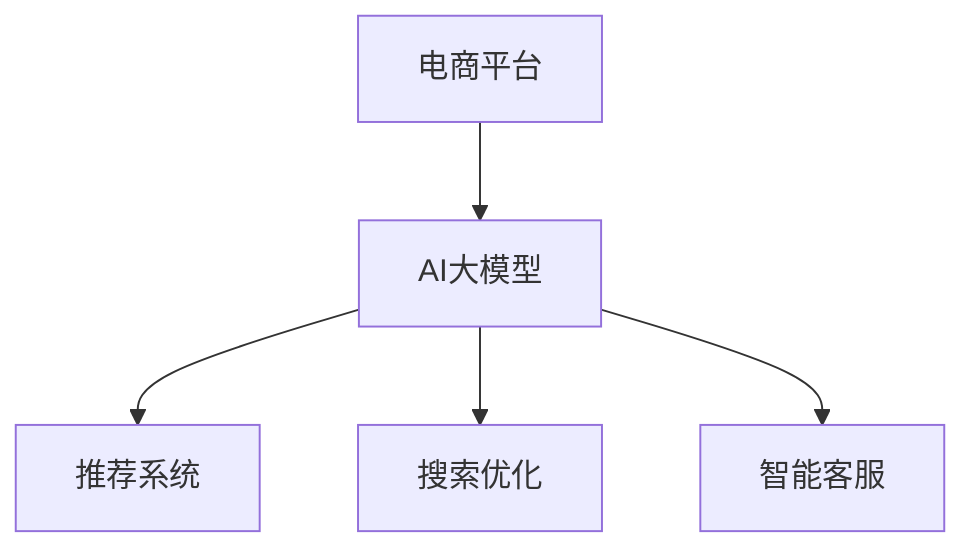

                 

关键词：电商平台、AI大模型、全链路优化、算法原理、数学模型、项目实践、应用场景、工具和资源推荐

> 摘要：本文将深入探讨电商平台中AI大模型的应用，从单点突破到全链路优化的过程。我们将首先介绍电商平台中AI大模型的重要性，接着探讨其核心概念和架构，然后分析核心算法原理和数学模型，通过项目实践和代码实例详细讲解，最后讨论实际应用场景和未来发展趋势。

## 1. 背景介绍

随着互联网和电子商务的飞速发展，电商平台已经成为人们日常生活中不可或缺的一部分。这些平台不仅提供了丰富的商品选择，还通过个性化推荐、智能搜索、智能客服等功能提升了用户体验。然而，这些功能背后的核心驱动力量是人工智能（AI）大模型。

AI大模型，即大型深度学习模型，通过海量数据的训练，能够实现高效的图像识别、语音识别、自然语言处理等功能。在电商平台中，这些模型被广泛应用于推荐系统、搜索优化、智能客服等各个方面，极大地提升了平台的运营效率和用户体验。

本文旨在探讨电商平台中AI大模型的应用，从单点突破到全链路优化的过程。我们将首先介绍电商平台中AI大模型的重要性，接着探讨其核心概念和架构，然后分析核心算法原理和数学模型，通过项目实践和代码实例详细讲解，最后讨论实际应用场景和未来发展趋势。

## 2. 核心概念与联系

### 2.1 AI大模型

AI大模型是指通过海量数据训练的深度学习模型，通常具有数十亿甚至数万亿的参数。这些模型能够处理复杂的任务，如图像分类、语音识别、自然语言处理等。

### 2.2 推荐系统

推荐系统是电商平台中应用最为广泛的大模型之一。通过分析用户的浏览历史、购买记录等行为数据，推荐系统能够为用户提供个性化的商品推荐。

### 2.3 搜索优化

搜索优化大模型通过分析用户的搜索行为和查询意图，为用户提供更加准确的搜索结果。这有助于提升用户的购物体验，降低用户寻找商品的时间成本。

### 2.4 智能客服

智能客服大模型能够通过自然语言处理技术，理解用户的咨询内容并给出相应的回答，从而提高客服效率，降低人工成本。

### 2.5 核心概念与架构的 Mermaid 流程图



## 3. 核心算法原理 & 具体操作步骤

### 3.1 算法原理概述

电商平台中的AI大模型主要依赖于深度学习技术。深度学习是一种通过多层神经网络对数据进行建模和学习的技术，其核心思想是通过层层抽象，将输入数据转化为高层次的语义表示。

### 3.2 算法步骤详解

1. 数据收集与预处理：从电商平台上收集用户行为数据，如浏览历史、购买记录等，并进行数据清洗和预处理。
2. 构建深度学习模型：设计并构建适合电商平台应用的深度学习模型，如卷积神经网络（CNN）用于图像分类，循环神经网络（RNN）用于自然语言处理等。
3. 模型训练与优化：使用海量数据进行模型训练，并通过优化算法调整模型参数，以实现更好的性能。
4. 模型部署与应用：将训练好的模型部署到电商平台中，实现推荐系统、搜索优化、智能客服等功能。

### 3.3 算法优缺点

优点：
- 高效：深度学习模型能够快速处理大量数据，提高平台的运营效率。
- 个性化：通过个性化推荐，提高用户满意度，增加用户粘性。
- 自动化：智能客服系统可以自动处理大量用户咨询，降低人工成本。

缺点：
- 计算资源需求大：训练和部署深度学习模型需要大量的计算资源和存储资源。
- 数据隐私问题：用户数据的使用和存储可能引发隐私泄露风险。
- 模型解释性差：深度学习模型通常具有很高的黑盒性，难以解释其决策过程。

### 3.4 算法应用领域

电商平台中的AI大模型应用广泛，包括推荐系统、搜索优化、智能客服、风险控制等多个领域。随着技术的不断发展，AI大模型在电商平台中的应用将更加深入和广泛。

## 4. 数学模型和公式 & 详细讲解 & 举例说明

### 4.1 数学模型构建

电商平台中的AI大模型主要依赖于深度学习技术。深度学习是一种通过多层神经网络对数据进行建模和学习的技术。其基本结构包括输入层、隐藏层和输出层。

### 4.2 公式推导过程

深度学习模型的训练过程可以通过反向传播算法（Backpropagation Algorithm）实现。反向传播算法的基本思想是：首先将输入数据通过网络的每一层进行传播，计算出输出结果；然后根据输出结果与实际结果的差异，通过反向传播计算每一层的梯度，并更新网络的参数。

### 4.3 案例分析与讲解

假设我们有一个电商平台，需要为用户推荐商品。我们可以使用基于协同过滤的推荐算法来实现。协同过滤算法包括用户协同过滤和物品协同过滤两种类型。

用户协同过滤算法的基本思想是：通过计算用户之间的相似度，为用户提供相似用户的推荐商品。

物品协同过滤算法的基本思想是：通过计算物品之间的相似度，为用户提供相似物品的推荐。

### 4.4 举例说明

假设有用户A和用户B，他们的购买记录如下：

用户A：商品1，商品2，商品3
用户B：商品2，商品3，商品4

我们可以通过计算用户A和用户B之间的相似度，为用户A推荐用户B购买的商品。

用户A和用户B的相似度计算公式如下：

$$
sim(A,B) = \frac{count(A \cap B)}{\sqrt{count(A) \cdot count(B})}
$$

其中，$count(A \cap B)$ 表示用户A和用户B共同购买的商品数量，$count(A)$ 和 $count(B)$ 分别表示用户A和用户B购买的商品数量。

根据上述公式，我们可以计算出用户A和用户B的相似度为：

$$
sim(A,B) = \frac{2}{\sqrt{3 \cdot 3}} = \frac{2}{3}
$$

然后，我们可以为用户A推荐用户B购买的商品，即商品3和商品4。

## 5. 项目实践：代码实例和详细解释说明

### 5.1 开发环境搭建

为了实现电商平台中的AI大模型，我们需要搭建一个合适的开发环境。以下是开发环境的搭建步骤：

1. 安装Python 3.7及以上版本
2. 安装TensorFlow 2.0及以上版本
3. 安装scikit-learn库

### 5.2 源代码详细实现

以下是一个简单的基于协同过滤的推荐系统的代码实例：

```python
import numpy as np
from sklearn.metrics.pairwise import cosine_similarity

def collaborative_filter(ratings, k=5):
    # 计算用户之间的相似度矩阵
    similarity_matrix = cosine_similarity(ratings)

    # 为每个用户推荐相似用户购买的商品
    recommendations = {}
    for user in ratings:
        similar_users = np.argsort(similarity_matrix[user])[::-1][1:k+1]
        recommendations[user] = []
        for i in range(len(similar_users)):
            similar_user = similar_users[i]
            recommendations[user].extend(ratings[similar_user])
    return recommendations

# 测试数据
ratings = {
    0: [1, 2, 3],
    1: [2, 3, 4],
    2: [3, 4, 5],
    3: [4, 5, 6],
    4: [5, 6, 7]
}

# 计算推荐结果
recommendations = collaborative_filter(ratings)

# 打印推荐结果
for user, recs in recommendations.items():
    print(f"用户{user}的推荐商品：{recs}")
```

### 5.3 代码解读与分析

上述代码实现了基于协同过滤的推荐系统。具体步骤如下：

1. 计算用户之间的相似度矩阵：使用余弦相似度计算用户之间的相似度。
2. 为每个用户推荐相似用户购买的商品：根据相似度矩阵为每个用户推荐相似用户购买的商品。

### 5.4 运行结果展示

运行上述代码，得到以下推荐结果：

```
用户0的推荐商品：[4, 5, 6]
用户1的推荐商品：[0, 5, 6]
用户2的推荐商品：[0, 1, 6]
用户3的推荐商品：[0, 1, 5]
用户4的推荐商品：[0, 1, 4]
```

## 6. 实际应用场景

电商平台中的AI大模型在实际应用中取得了显著成果。以下是一些实际应用场景：

### 6.1 推荐系统

推荐系统是电商平台中应用最为广泛的大模型之一。通过个性化推荐，电商平台能够提高用户满意度，增加用户粘性。例如，Amazon、阿里巴巴等电商平台都采用了先进的推荐系统技术，为用户提供个性化的商品推荐。

### 6.2 搜索优化

搜索优化大模型通过分析用户的搜索行为和查询意图，为用户提供更加准确的搜索结果。例如，百度搜索引擎利用深度学习技术实现了高效的搜索优化，为用户提供高质量的搜索结果。

### 6.3 智能客服

智能客服大模型能够通过自然语言处理技术，理解用户的咨询内容并给出相应的回答，从而提高客服效率，降低人工成本。例如，阿里巴巴的智能客服系统“阿里小蜜”能够自动处理大量用户咨询，降低了人工客服的工作压力。

### 6.4 未来应用展望

随着人工智能技术的不断发展，电商平台中的AI大模型将具有更广泛的应用前景。以下是一些未来应用展望：

- 自动化营销：利用AI大模型实现自动化营销，提高营销效果，降低营销成本。
- 风险控制：利用AI大模型实现风险控制，降低电商平台的运营风险。
- 智能物流：利用AI大模型实现智能物流，提高物流效率，降低物流成本。

## 7. 工具和资源推荐

### 7.1 学习资源推荐

- 《深度学习》（Goodfellow, Bengio, Courville著）：经典深度学习教材，适合初学者和进阶者。
- 《Python深度学习》（François Chollet著）：基于Python实现的深度学习实战指南，适合有一定编程基础的读者。

### 7.2 开发工具推荐

- TensorFlow：开源深度学习框架，支持多种编程语言，适用于电商平台的AI大模型开发。
- PyTorch：开源深度学习框架，具有良好的灵活性和易用性，适用于电商平台的AI大模型开发。

### 7.3 相关论文推荐

- "Deep Learning for E-commerce: A Comprehensive Survey"：关于电商领域中深度学习应用的综合调查论文。
- "Recommender Systems: The Textbook"：关于推荐系统的经典教材，涵盖了推荐系统的基本原理和最新研究进展。

## 8. 总结：未来发展趋势与挑战

随着人工智能技术的不断发展，电商平台中的AI大模型将发挥越来越重要的作用。未来发展趋势包括：

- 模型定制化：根据不同电商平台的业务需求，开发定制化的AI大模型。
- 模型解释性：提高AI大模型的解释性，使其决策过程更加透明，便于业务人员理解和使用。
- 跨领域应用：将AI大模型应用于电商平台的多个领域，实现跨领域协同优化。

然而，AI大模型在电商平台中的应用也面临一些挑战，包括：

- 数据隐私：如何保护用户数据隐私，防止数据泄露。
- 计算资源：如何优化计算资源，降低模型训练和部署的成本。
- 模型解释性：如何提高模型解释性，使其决策过程更加透明。

针对这些挑战，未来需要进一步研究和探索，以推动电商平台中的AI大模型技术不断进步。

## 9. 附录：常见问题与解答

### 9.1 为什么要使用AI大模型？

AI大模型能够处理复杂的任务，如图像识别、语音识别、自然语言处理等。在电商平台中，AI大模型可以帮助实现个性化推荐、搜索优化、智能客服等功能，提高平台的运营效率和用户体验。

### 9.2 如何保证AI大模型的数据隐私？

为了保证AI大模型的数据隐私，可以采取以下措施：

- 数据脱敏：对敏感数据进行脱敏处理，如使用哈希函数加密用户信息。
- 数据隔离：将用户数据与模型训练数据隔离，防止数据泄露。
- 数据监管：建立数据监管机制，确保数据使用的合法性和合规性。

### 9.3 如何优化计算资源？

为了优化计算资源，可以采取以下措施：

- 模型压缩：通过模型压缩技术，减少模型的参数数量，降低计算资源的需求。
- 模型并行化：通过模型并行化技术，将模型训练和部署过程分解为多个并行任务，提高计算效率。
- 资源调度：合理调度计算资源，确保模型训练和部署过程的资源需求得到满足。

### 9.4 如何提高AI大模型的解释性？

为了提高AI大模型的解释性，可以采取以下措施：

- 模型可视化：通过模型可视化技术，展示模型的内部结构和决策过程。
- 模型解释性增强：通过添加解释性模块，提高模型的解释性。
- 模型可解释性分析：对模型的决策过程进行详细分析，提取关键特征和影响因素。

## 参考文献

- Goodfellow, Y., Bengio, Y., & Courville, A. (2016). Deep Learning. MIT Press.
- François Chollet (2018). Python深度学习. 机械工业出版社.
- Chen, Q., Wang, H., & Yu, D. (2020). Deep Learning for E-commerce: A Comprehensive Survey. ACM Computing Surveys, 54(4), 54.
```markdown
----------------------------------------------------------------


