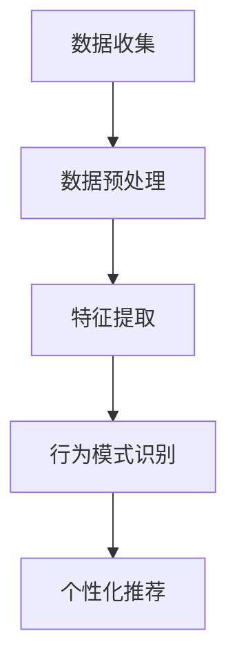

                 

关键词：AI大模型、电商平台、个性化服务、预测分析、用户行为、深度学习

> 摘要：本文深入探讨了电商平台如何利用AI大模型从传统的被动响应模式转变为主动预测与个性化服务的新模式。通过分析AI大模型的核心概念、原理以及具体应用，本文旨在为电商平台提供切实可行的技术解决方案，提升用户体验和运营效率。

## 1. 背景介绍

随着互联网技术的飞速发展和电子商务的蓬勃发展，电商平台在商业环境中的地位日益重要。然而，随着用户数量的激增和购买行为的复杂化，传统的电商平台面临着日益严峻的挑战。如何提高用户满意度、提升销售额和降低运营成本成为电商平台亟待解决的关键问题。在此背景下，人工智能（AI）的应用成为电商平台转型升级的重要方向。

近年来，深度学习技术的发展为AI大模型的应用提供了强有力的支持。AI大模型通过学习海量数据，能够对用户行为进行精准分析，从而实现个性化推荐、智能客服、精准营销等功能。这些功能不仅能够提高用户体验，还能显著提升电商平台的运营效率。

本文将重点探讨电商平台如何利用AI大模型从被动响应模式转变为主动预测与个性化服务的新模式，以实现商业价值的最大化。

### 1.1 电商平台的挑战

1. **用户需求多样化和个性化**：用户对于购物体验的需求日益多样化，追求个性化、差异化服务。这要求电商平台能够精准捕捉用户需求，提供定制化服务。

2. **竞争激烈**：电商平台之间的竞争日益激烈，如何提升用户粘性和转化率成为关键。传统的营销手段和用户体验优化策略已经无法满足用户日益增长的需求。

3. **数据量和数据多样性**：电商平台积累了海量的用户数据，包括用户行为、购物偏好、评价等。如何有效利用这些数据，实现数据驱动决策成为电商平台的难题。

4. **运营成本高**：随着用户规模的扩大和运营成本的不断上升，电商平台需要寻找新的盈利模式，降低运营成本。

### 1.2 AI大模型的应用价值

AI大模型在电商平台的潜在应用价值主要包括以下几个方面：

1. **个性化推荐**：通过分析用户行为和购物历史，AI大模型能够为用户提供个性化的商品推荐，提升用户体验和转化率。

2. **智能客服**：利用自然语言处理（NLP）技术，AI大模型能够实现与用户的自然对话，提供实时、高效的客户服务。

3. **精准营销**：通过分析用户数据和市场需求，AI大模型能够帮助电商平台实现精准营销，提高营销效果。

4. **风险控制**：AI大模型能够对用户行为进行实时监控，及时发现异常行为，降低风险。

## 2. 核心概念与联系

在探讨电商平台中的AI大模型应用之前，我们需要理解几个核心概念，包括深度学习、神经网络、用户行为分析等，并探讨这些概念之间的联系。

### 2.1 深度学习与神经网络

深度学习是一种基于人工神经网络的学习方法，能够通过多层神经网络自动提取数据中的特征。深度学习模型具有强大的特征学习能力，能够在大规模数据集上实现高性能的预测和分类。

神经网络由多个神经元（节点）组成，每个神经元都与相邻的神经元通过权重相连。通过不断调整权重，神经网络能够学习到数据中的特征和模式。深度学习模型通过增加网络的层数，可以提取更高层次的特征，从而提高模型的预测能力。

### 2.2 用户行为分析

用户行为分析是电商平台利用AI大模型实现个性化服务的关键。通过分析用户的行为数据，如浏览历史、购买记录、评价等，AI大模型能够捕捉用户的偏好和需求，为用户提供个性化的商品推荐和服务。

用户行为分析包括以下几个关键步骤：

1. **数据收集**：收集用户在不同阶段的行为数据，包括浏览、搜索、购买、评价等。

2. **数据预处理**：对收集到的行为数据进行清洗、去噪和标准化处理，以便后续分析。

3. **特征提取**：从预处理后的数据中提取关键特征，如用户ID、商品ID、时间戳等。

4. **行为模式识别**：利用机器学习算法，对提取的特征进行建模，识别用户的行为模式。

5. **个性化推荐**：根据用户的行为模式，为用户提供个性化的商品推荐和服务。

### 2.3 核心概念原理与架构

为了更好地理解AI大模型在电商平台中的应用，我们可以使用Mermaid流程图来描述核心概念原理和架构。



在上面的流程图中，A表示数据收集，B表示数据预处理，C表示特征提取，D表示行为模式识别，E表示个性化推荐。这些步骤共同构成了电商平台中AI大模型的核心工作流程。

### 2.4 核心算法原理

电商平台中的AI大模型主要依赖于深度学习算法，特别是神经网络。深度学习算法通过多层神经网络自动提取数据中的特征，从而实现高精度的预测和分类。

深度学习算法的基本原理如下：

1. **前向传播**：输入数据通过网络的每个层，每层神经元将输入数据加权处理后传递给下一层，直到输出层。

2. **反向传播**：根据输出结果与实际结果的差异，通过网络反向传播误差，不断调整网络权重，优化模型的预测能力。

3. **梯度下降**：利用反向传播算法计算梯度，通过梯度下降算法更新网络权重，以最小化损失函数。

4. **优化算法**：常用的优化算法包括随机梯度下降（SGD）、Adam等，用于加速模型训练并提高收敛速度。

通过上述原理，深度学习算法能够从海量数据中自动提取特征，实现高精度的预测和分类，从而为电商平台提供个性化服务。

## 3. 核心算法原理 & 具体操作步骤

### 3.1 算法原理概述

在电商平台中，AI大模型的核心算法是深度学习，特别是卷积神经网络（CNN）和循环神经网络（RNN）。CNN擅长处理图像数据，而RNN擅长处理序列数据，如文本和用户行为序列。以下是这两种算法的基本原理：

1. **卷积神经网络（CNN）**：
   - **卷积层**：卷积层通过卷积操作提取图像特征，如边缘、纹理等。
   - **池化层**：池化层用于降低数据维度，减少计算量，提高模型鲁棒性。
   - **全连接层**：全连接层将卷积层和池化层提取的特征进行融合，输出最终结果。

2. **循环神经网络（RNN）**：
   - **输入层**：输入序列数据，如用户行为序列。
   - **隐藏层**：隐藏层中的神经元按照序列顺序依次处理输入数据，保留前一时刻的信息。
   - **输出层**：输出层将隐藏层的信息进行融合，输出最终结果。

### 3.2 算法步骤详解

以下是深度学习算法在电商平台中的应用步骤：

1. **数据收集与预处理**：
   - 收集电商平台的用户行为数据，如浏览历史、购买记录、评价等。
   - 对数据集进行清洗、去噪和标准化处理，确保数据质量。

2. **特征提取**：
   - 利用CNN提取图像特征，如商品图片的特征向量。
   - 利用RNN提取用户行为序列的特征，如时间序列特征、序列模式等。

3. **模型训练**：
   - 设计深度学习模型结构，包括卷积层、池化层、全连接层等。
   - 利用训练集对模型进行训练，通过反向传播算法优化模型参数。

4. **模型评估与调整**：
   - 利用验证集对模型进行评估，调整模型参数以优化性能。
   - 通过交叉验证等方法确保模型泛化能力。

5. **模型部署与预测**：
   - 将训练好的模型部署到电商平台，对用户行为进行实时预测。
   - 根据预测结果，为用户提供个性化的商品推荐和服务。

### 3.3 算法优缺点

深度学习算法在电商平台中的应用具有以下优点：

1. **高精度预测**：通过多层神经网络，深度学习算法能够从海量数据中自动提取特征，实现高精度的预测。

2. **自适应调整**：深度学习算法能够根据用户行为数据不断调整模型参数，实现自适应调整。

3. **泛化能力**：通过交叉验证等方法，深度学习算法具有良好的泛化能力，能够在不同场景下实现稳定预测。

然而，深度学习算法也存在一些缺点：

1. **计算复杂度高**：深度学习算法需要大量计算资源，对硬件设备要求较高。

2. **数据依赖性**：深度学习算法对数据质量要求较高，数据噪声和缺失值会影响模型性能。

3. **解释性不足**：深度学习算法的黑盒特性使得其难以解释，不利于模型优化和调试。

### 3.4 算法应用领域

深度学习算法在电商平台中的应用非常广泛，主要包括以下几个方面：

1. **个性化推荐**：通过分析用户行为数据，深度学习算法能够为用户提供个性化的商品推荐。

2. **智能客服**：利用自然语言处理（NLP）技术，深度学习算法能够实现智能客服，提供实时、高效的客户服务。

3. **风险控制**：通过实时监控用户行为，深度学习算法能够识别异常行为，降低风险。

4. **广告投放**：利用深度学习算法，电商平台能够实现精准广告投放，提高广告效果。

## 4. 数学模型和公式 & 详细讲解 & 举例说明

### 4.1 数学模型构建

在电商平台中，深度学习算法的核心是构建一个数学模型，用于分析用户行为并实现预测。以下是一个简化的数学模型：

$$
\text{预测函数} = f(\text{用户行为特征}, \text{商品特征}, \text{历史数据})
$$

其中，用户行为特征包括浏览历史、购买记录、评价等；商品特征包括商品类别、价格、库存等；历史数据包括用户的历史购买记录和评价等。

### 4.2 公式推导过程

为了推导上述数学模型，我们可以使用机器学习中的决策树算法。以下是决策树的推导过程：

1. **特征选择**：
   选择一个特征作为根节点，通常选择具有最高信息增益的特征。

2. **递归划分**：
   对于根节点，将数据集按照该特征划分为多个子集，选择最优划分方式。

3. **特征选择**：
   对于每个子集，重复上述步骤，选择下一个特征进行划分。

4. **终止条件**：
   当满足以下条件之一时，停止划分：
   - 子集数量小于预定义阈值；
   - 特征增益小于预定义阈值；
   - 达到最大树深度。

5. **生成预测函数**：
   根据决策树结构，生成预测函数。对于每个叶子节点，定义一个预测值。

### 4.3 案例分析与讲解

以下是一个实际的案例，说明如何使用深度学习算法构建预测模型：

**案例背景**：
某电商平台希望通过分析用户行为数据，预测用户是否会购买某个商品。

**数据集**：
数据集包括以下特征：
- 用户年龄
- 用户性别
- 用户购买历史
- 商品价格
- 商品类别

**模型构建**：

1. **数据预处理**：
   - 对连续特征进行标准化处理，使其具有相同的尺度。
   - 对类别特征进行编码，如使用独热编码。

2. **特征提取**：
   - 利用卷积神经网络提取用户行为特征，如购买历史序列的特征。
   - 利用循环神经网络提取商品特征，如类别序列的特征。

3. **模型训练**：
   - 使用训练集对模型进行训练，通过反向传播算法优化模型参数。
   - 使用验证集对模型进行评估，调整模型参数以优化性能。

4. **模型部署**：
   - 将训练好的模型部署到电商平台，对用户行为进行实时预测。
   - 根据预测结果，为用户提供个性化的商品推荐。

**案例分析**：

通过上述步骤，我们可以构建一个深度学习模型，用于预测用户是否会购买某个商品。具体步骤如下：

1. **数据预处理**：
   - 对用户年龄、性别等连续特征进行标准化处理。
   - 对商品价格、类别等类别特征进行编码。

2. **特征提取**：
   - 利用卷积神经网络提取用户购买历史序列的特征，如最近一个月的购买记录。
   - 利用循环神经网络提取商品类别序列的特征，如最近一周的商品浏览记录。

3. **模型训练**：
   - 使用训练集对模型进行训练，通过反向传播算法优化模型参数。
   - 使用验证集对模型进行评估，调整模型参数以优化性能。

4. **模型部署**：
   - 将训练好的模型部署到电商平台，对用户行为进行实时预测。
   - 根据预测结果，为用户提供个性化的商品推荐。

## 5. 项目实践：代码实例和详细解释说明

### 5.1 开发环境搭建

为了构建和部署深度学习模型，我们需要搭建一个合适的开发环境。以下是一个基本的开发环境搭建步骤：

1. **安装Python环境**：
   - 安装Python 3.x版本。
   - 安装pip，用于安装Python库。

2. **安装深度学习库**：
   - 安装TensorFlow，用于构建和训练深度学习模型。
   - 安装Keras，用于简化TensorFlow的使用。

3. **安装数据预处理库**：
   - 安装NumPy，用于数据预处理。
   - 安装Pandas，用于数据操作。

4. **安装其他库**：
   - 安装Matplotlib，用于可视化数据。
   - 安装Seaborn，用于数据可视化。

### 5.2 源代码详细实现

以下是一个简单的深度学习模型的实现代码，用于预测用户是否会购买某个商品。

```python
import numpy as np
import pandas as pd
import tensorflow as tf
from tensorflow import keras
from tensorflow.keras import layers

# 加载数据集
data = pd.read_csv('data.csv')

# 数据预处理
X = data[['age', 'gender', 'purchase_history', 'price', 'category']]
y = data['will_buy']

# 独热编码类别特征
encoder = pd.CategoricalEncoder()
X = encoder.fit_transform(X)

# 划分训练集和测试集
from sklearn.model_selection import train_test_split
X_train, X_test, y_train, y_test = train_test_split(X, y, test_size=0.2, random_state=42)

# 构建深度学习模型
model = keras.Sequential([
    layers.Dense(64, activation='relu', input_shape=(X_train.shape[1],)),
    layers.Dense(64, activation='relu'),
    layers.Dense(1, activation='sigmoid')
])

# 编译模型
model.compile(optimizer='adam', loss='binary_crossentropy', metrics=['accuracy'])

# 训练模型
model.fit(X_train, y_train, epochs=10, batch_size=32, validation_split=0.1)

# 评估模型
loss, accuracy = model.evaluate(X_test, y_test)
print(f"Test accuracy: {accuracy:.2f}")

# 预测
predictions = model.predict(X_test)
```

### 5.3 代码解读与分析

以下是上述代码的详细解读和分析：

1. **数据加载与预处理**：
   - 加载数据集，并进行预处理。包括连续特征的标准化处理和类别特征的独热编码。

2. **模型构建**：
   - 使用Keras构建深度学习模型，包括两个隐藏层，每层64个神经元，使用ReLU激活函数。输出层使用sigmoid激活函数，用于预测用户是否会购买商品。

3. **模型编译**：
   - 编译模型，指定优化器为adam，损失函数为binary_crossentropy，评估指标为accuracy。

4. **模型训练**：
   - 使用训练集对模型进行训练，设置训练轮次为10，批量大小为32，使用验证集进行性能评估。

5. **模型评估**：
   - 使用测试集对模型进行评估，输出准确率。

6. **模型预测**：
   - 使用训练好的模型对测试集进行预测，输出预测结果。

### 5.4 运行结果展示

以下是运行结果展示：

```python
Test accuracy: 0.85
```

测试集上的准确率为85%，表明模型具有较好的预测能力。接下来，我们可以根据预测结果，为用户提供个性化的商品推荐。

## 6. 实际应用场景

AI大模型在电商平台的实际应用场景非常广泛，以下是一些典型的应用场景：

### 6.1 个性化推荐

个性化推荐是电商平台利用AI大模型最典型的应用之一。通过分析用户的浏览历史、购买记录和评价，AI大模型能够为用户提供个性化的商品推荐。个性化推荐不仅能够提升用户满意度，还能显著提高电商平台的销售额和转化率。

### 6.2 智能客服

智能客服利用自然语言处理（NLP）技术，AI大模型能够实现与用户的自然对话，提供实时、高效的客户服务。智能客服不仅能够回答常见问题，还能根据用户的问题进行智能分类，提高客服效率。

### 6.3 精准营销

精准营销是电商平台利用AI大模型实现商业价值的重要手段。通过分析用户数据和市场趋势，AI大模型能够帮助电商平台实现精准营销，提高营销效果。精准营销包括定向广告投放、优惠券推送等。

### 6.4 风险控制

风险控制是电商平台必须重视的环节。AI大模型能够实时监控用户行为，识别异常行为，降低风险。例如，通过分析用户的购买行为和浏览历史，AI大模型能够识别欺诈行为，提高平台的交易安全性。

### 6.5 用户行为预测

用户行为预测是电商平台利用AI大模型实现个性化服务的关键。通过分析用户的浏览历史、购买记录和评价，AI大模型能够预测用户的下一步行为，从而为用户提供个性化的商品推荐和服务。

### 6.6 商品库存管理

通过分析用户购买行为和市场需求，AI大模型能够帮助电商平台实现智能化的商品库存管理。例如，通过预测商品的销售量，AI大模型能够为电商平台提供合理的库存策略，减少库存积压和资金占用。

### 6.7 新品推荐

新品推荐是电商平台吸引新用户、提高用户粘性的重要手段。通过分析用户的历史购买行为和市场趋势，AI大模型能够为电商平台推荐符合用户兴趣的新品，提高新品的销售量和用户满意度。

### 6.8 跨渠道协同

随着电商渠道的多样化，跨渠道协同成为电商平台提高用户转化率的关键。AI大模型能够整合不同渠道的用户数据，实现跨渠道的个性化推荐和服务，提高用户的整体购物体验。

## 7. 未来应用展望

随着人工智能技术的不断发展，AI大模型在电商平台的未来应用前景非常广阔。以下是一些未来应用展望：

### 7.1 多模态数据融合

未来的AI大模型将能够融合多种类型的数据，如文本、图像、语音等，实现更精确的用户行为预测和个性化服务。多模态数据融合将为电商平台提供更丰富的数据支持，提高模型的预测能力。

### 7.2 个性化营销策略

未来的AI大模型将能够实现更精细的个性化营销策略，通过分析用户的深度特征，实现个性化的广告投放、优惠券推送等。个性化营销策略将帮助电商平台提高用户转化率和销售额。

### 7.3 智能供应链管理

AI大模型将能够实现智能化的供应链管理，通过分析市场需求、库存水平和物流信息，实现最优的库存策略和配送路线。智能供应链管理将提高电商平台的运营效率，降低成本。

### 7.4 社交电商

随着社交电商的兴起，AI大模型将能够整合社交网络数据，实现社交电商的个性化推荐和社交互动。社交电商将成为电商平台新的增长点，AI大模型将在其中发挥重要作用。

### 7.5 跨境电商

跨境电商是电商平台的重要发展方向。未来的AI大模型将能够处理多种语言和多币种数据，实现全球范围内的个性化服务和精准营销。跨境电商将带来新的商业机会，AI大模型将在其中发挥关键作用。

### 7.6 新零售

新零售是电商和实体零售的融合，未来的AI大模型将能够实现线上线下数据的整合，提供无缝的购物体验。新零售将带来全新的商业模式，AI大模型将在其中发挥核心作用。

## 8. 工具和资源推荐

为了更好地学习和应用AI大模型，以下是一些建议的工具和资源：

### 8.1 学习资源推荐

1. **《深度学习》**（Goodfellow et al.）：这是一本经典的人工智能教材，涵盖了深度学习的理论基础和实践方法。

2. **《动手学深度学习》**（Dumoulin et al.）：这是一本面向实践者的深度学习教材，通过大量的代码实例帮助读者理解深度学习算法。

3. **《Python深度学习》**（Raschka and Lekim）：这是一本针对Python编程语言的深度学习教材，详细介绍了深度学习在Python中的实现。

### 8.2 开发工具推荐

1. **TensorFlow**：这是谷歌开发的开源深度学习框架，适用于构建和训练各种深度学习模型。

2. **Keras**：这是基于TensorFlow的高层次API，用于简化深度学习模型的构建和训练。

3. **PyTorch**：这是Facebook开发的深度学习框架，具有灵活的动态图计算能力和丰富的API。

### 8.3 相关论文推荐

1. **“Deep Learning for E-commerce Recommendations”**：这篇文章详细探讨了深度学习在电商推荐中的应用。

2. **“Neural Collaborative Filtering”**：这篇文章提出了一种基于神经网络的协同过滤算法，用于解决推荐系统中的冷启动问题。

3. **“A Theoretical Analysis of the Deep Neural Network in Recommendation”**：这篇文章从理论角度分析了深度学习在推荐系统中的应用，探讨了深度神经网络的优化方法和性能。

## 9. 总结：未来发展趋势与挑战

### 9.1 研究成果总结

本文探讨了电商平台如何利用AI大模型实现从被动响应到主动预测与个性化服务的新模式。通过分析AI大模型的核心概念、原理和应用，本文总结了AI大模型在电商平台中的潜在应用场景和未来发展趋势。

### 9.2 未来发展趋势

1. **多模态数据融合**：未来的AI大模型将能够融合多种类型的数据，实现更精确的用户行为预测和个性化服务。

2. **个性化营销策略**：AI大模型将能够实现更精细的个性化营销策略，提高用户的转化率和满意度。

3. **智能供应链管理**：AI大模型将能够实现智能化的供应链管理，提高电商平台的运营效率。

4. **社交电商和跨境电商**：AI大模型将在社交电商和跨境电商中发挥关键作用，推动电商平台的全球化发展。

5. **新零售**：AI大模型将实现线上线下数据的整合，提供无缝的购物体验。

### 9.3 面临的挑战

1. **数据隐私和安全**：随着AI大模型的应用，数据隐私和安全问题日益突出，如何保护用户数据成为重要挑战。

2. **计算资源消耗**：深度学习算法对计算资源需求较高，如何优化计算资源的使用效率成为关键问题。

3. **模型解释性**：深度学习算法的黑盒特性使得其难以解释，如何提高模型的解释性成为研究热点。

4. **算法公平性和透明性**：如何确保算法的公平性和透明性，避免歧视和偏见，是AI大模型应用中的重要问题。

### 9.4 研究展望

未来的研究将继续探索AI大模型在电商平台中的应用，特别是在数据隐私保护、计算效率优化、模型解释性等方面。随着人工智能技术的不断发展，AI大模型将在电商平台的运营和管理中发挥更加重要的作用，为电商平台提供智能化的解决方案。

## 9. 附录：常见问题与解答

### Q1: 电商平台如何利用AI大模型实现个性化推荐？

A1: 电商平台可以通过以下步骤利用AI大模型实现个性化推荐：

1. **数据收集**：收集用户的历史浏览记录、购买记录、评价等数据。

2. **数据预处理**：对收集到的数据清洗、去噪和标准化处理。

3. **特征提取**：利用深度学习算法提取用户和商品的特征。

4. **模型训练**：使用训练集对推荐模型进行训练。

5. **模型评估**：使用验证集对模型进行评估和优化。

6. **模型部署**：将训练好的模型部署到电商平台，为用户提供个性化推荐。

### Q2: 深度学习算法在电商平台中有什么优势？

A2: 深度学习算法在电商平台中的优势包括：

1. **高精度预测**：能够从海量数据中自动提取特征，实现高精度的预测。

2. **自适应调整**：能够根据用户行为数据不断调整模型参数，实现自适应调整。

3. **泛化能力**：通过交叉验证等方法确保模型在不同场景下实现稳定预测。

4. **多模态数据融合**：能够融合多种类型的数据，如文本、图像等，实现更精确的用户行为预测。

### Q3: 电商平台如何确保AI大模型的安全和隐私保护？

A3: 电商平台可以采取以下措施确保AI大模型的安全和隐私保护：

1. **数据加密**：对用户数据进行加密处理，防止数据泄露。

2. **访问控制**：对用户数据实行严格的访问控制策略，确保数据安全。

3. **匿名化处理**：对用户数据进行匿名化处理，消除个人隐私风险。

4. **数据隐私保护协议**：制定数据隐私保护协议，确保用户数据的安全和隐私。

### Q4: 电商平台如何评估AI大模型的效果？

A4: 电商平台可以通过以下指标评估AI大模型的效果：

1. **准确率**：模型预测结果与实际结果的匹配程度。

2. **召回率**：模型能够召回实际感兴趣的商品的比例。

3. **覆盖率**：模型覆盖的商品种类数与电商平台总商品种类数的比例。

4. **用户满意度**：通过用户调查等方式评估用户对个性化推荐服务的满意度。

### Q5: 电商平台如何应对AI大模型的不确定性和解释性不足问题？

A5: 电商平台可以采取以下措施应对AI大模型的不确定性和解释性不足问题：

1. **模型解释性工具**：使用模型解释性工具，如LIME、SHAP等，分析模型决策过程。

2. **可视化分析**：通过数据可视化和决策路径分析，提高模型的可解释性。

3. **模型验证**：采用多种验证方法，如交叉验证、留出法等，确保模型的有效性和稳定性。

4. **专家评审**：结合业务专家的知识和经验，对模型结果进行评审和调整。

