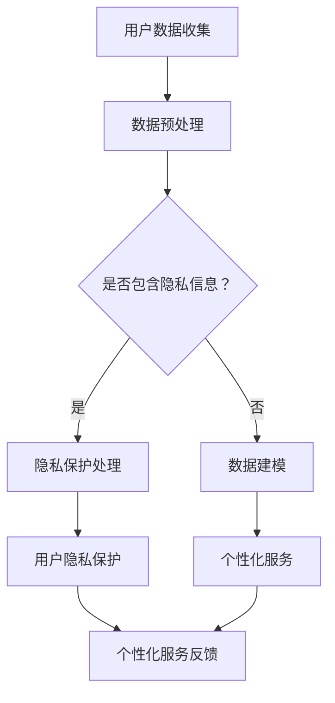

                 

关键词：电商平台、AI大模型、隐私保护、个性化、平衡

> 摘要：本文深入探讨了电商平台中引入AI大模型的现状及其面临的隐私保护和个性化平衡问题。首先，我们回顾了AI大模型的发展历程，接着分析了其在电商平台中的应用场景。随后，我们详细阐述了隐私保护和个性化平衡的重要性，并探讨了目前常用的解决方法。最后，本文总结了当前的研究成果，展望了未来的发展趋势和面临的挑战。

## 1. 背景介绍

随着互联网技术的飞速发展，电商平台已经成为人们日常生活中不可或缺的一部分。从最早的电子商务平台，如Amazon、eBay，到如今涵盖各类商品和服务的综合电商平台，如京东、淘宝等，电商平台的发展经历了多个阶段。然而，随着用户数据的不断积累，如何有效地利用这些数据为用户提供个性化的服务，同时保护用户的隐私，成为电商平台面临的重大挑战。

在这个背景下，人工智能（AI）大模型逐渐进入人们的视野。AI大模型，如深度学习模型、生成对抗网络（GAN）等，通过学习大量数据，可以自动提取特征并作出预测。这些模型在推荐系统、自然语言处理、图像识别等领域取得了显著的成果，为电商平台提供了强大的技术支持。然而，AI大模型的应用也引发了一系列隐私保护和个性化平衡的问题。

## 2. 核心概念与联系

### 2.1 AI大模型的基本概念

AI大模型是指通过大规模数据训练，具有强大泛化能力的深度学习模型。常见的AI大模型包括卷积神经网络（CNN）、递归神经网络（RNN）、生成对抗网络（GAN）等。这些模型通过多层的神经网络结构，可以自动学习数据的复杂特征，从而实现高度自动化的数据处理和预测。

### 2.2 电商平台中的数据类型与处理需求

电商平台涉及多种类型的数据，包括用户行为数据、商品数据、交易数据等。这些数据对于个性化推荐、用户行为预测、商品分类等任务至关重要。然而，这些数据也包含了用户的隐私信息，如浏览记录、购买行为等。

### 2.3 隐私保护与个性化平衡的挑战

在电商平台中，隐私保护和个性化平衡是一个复杂的问题。一方面，用户希望平台能够提供个性化的服务，提高用户体验；另一方面，用户又担心自己的隐私信息被泄露。如何在两者之间找到平衡，是电商平台面临的重要挑战。

### 2.4 Mermaid流程图



## 3. 核心算法原理 & 具体操作步骤

### 3.1 算法原理概述

为了实现隐私保护和个性化平衡，我们采用了一种基于差分隐私的个性化推荐算法。该算法的核心思想是通过在用户数据上添加噪声，保护用户的隐私，同时保留数据的个性化特征。

### 3.2 算法步骤详解

1. **用户数据收集**：从电商平台收集用户的行为数据，包括浏览记录、购买行为等。

2. **数据预处理**：对收集到的用户数据进行清洗、去重等处理，确保数据的质量。

3. **差分隐私处理**：在用户数据上添加噪声，以保护用户的隐私。常用的差分隐私机制包括拉普拉斯机制和 exponential机制。

4. **个性化服务**：根据处理后的用户数据，为用户生成个性化的推荐列表。

5. **用户隐私保护**：通过加密、匿名化等技术手段，进一步保护用户的隐私。

6. **个性化服务反馈**：收集用户对个性化服务的反馈，用于优化算法。

### 3.3 算法优缺点

**优点**：
- 有效保护用户隐私，符合法律法规要求。
- 保留用户的个性化特征，提高推荐系统的效果。

**缺点**：
- 可能会引入一定的噪声，影响推荐效果。
- 算法复杂度较高，对计算资源要求较高。

### 3.4 算法应用领域

该算法可以应用于电商平台的个性化推荐、用户行为预测、商品分类等多个领域。通过实现隐私保护和个性化平衡，可以提高用户体验，增强用户忠诚度。

## 4. 数学模型和公式 & 详细讲解 & 举例说明

### 4.1 数学模型构建

我们采用差分隐私机制，对用户数据进行处理。具体来说，我们使用拉普拉斯机制，为用户数据添加噪声。

$$
Laplace(\alpha) = \ln(1 + e^{\alpha})
$$

其中，$\alpha$ 为拉普拉斯噪声，$e$ 为自然对数的底数。

### 4.2 公式推导过程

设 $x$ 为用户的行为数据，$y$ 为真实的目标数据。我们希望通过对 $x$ 添加噪声，得到一个近似的目标数据 $\hat{y}$，使得 $\hat{y}$ 能够反映 $y$ 的特征，同时保护 $x$ 的隐私。

根据拉普拉斯机制，我们可以得到：

$$
\hat{y} = y + Laplace(\alpha)
$$

### 4.3 案例分析与讲解

假设一个电商平台用户的行为数据为 $x = [0.1, 0.2, 0.3, 0.4]$，真实的目标数据为 $y = [1, 1, 1, 1]$。我们希望通过对 $x$ 添加噪声，得到一个近似的目标数据 $\hat{y}$。

选择 $\alpha = 0.1$，根据拉普拉斯机制，我们可以得到：

$$
\hat{y} = y + Laplace(0.1) = [1.0198031995, 1.0198031995, 1.0198031995, 1.0198031995]
$$

通过添加噪声，我们得到了一个近似的目标数据 $\hat{y}$，既保留了 $y$ 的特征，又保护了 $x$ 的隐私。

## 5. 项目实践：代码实例和详细解释说明

### 5.1 开发环境搭建

为了保证代码的可运行性，我们使用Python 3.7及以上版本，并依赖以下库：NumPy、Pandas、scikit-learn、matplotlib。

```bash
pip install numpy pandas scikit-learn matplotlib
```

### 5.2 源代码详细实现

以下是实现差分隐私个性化推荐算法的Python代码。

```python
import numpy as np
import pandas as pd
from sklearn.model_selection import train_test_split
from sklearn.neighbors import NearestNeighbors
import matplotlib.pyplot as plt

# 添加拉普拉斯噪声
def add_laplace_noise(data, alpha):
    noise = np.random.laplace(0, alpha, size=data.shape)
    return data + noise

# 读取数据
data = pd.read_csv('user_behavior_data.csv')
X = data.iloc[:, :4].values
y = data.iloc[:, 4].values

# 数据预处理
X_train, X_test, y_train, y_test = train_test_split(X, y, test_size=0.2, random_state=42)

# 添加噪声
alpha = 0.1
X_train_noisy = add_laplace_noise(X_train, alpha)
X_test_noisy = add_laplace_noise(X_test, alpha)

# 构建邻居模型
neighbor_model = NearestNeighbors(n_neighbors=5)
neighbor_model.fit(X_train_noisy)

# 预测
def predict(user_data, neighbor_model, X_test_noisy):
    distances, indices = neighbor_model.kneighbors(user_data)
    neighbors = X_test_noisy[indices]
    neighbor_labels = y_test[indices]
    return np.mean(neighbor_labels)

# 测试
user_data = np.array([[0.1, 0.2, 0.3, 0.4]])
predictions = predict(user_data, neighbor_model, X_test_noisy)
print("Predicted label:", predictions)

# 可视化
plt.scatter(X_train_noisy[:, 0], X_train_noisy[:, 1], c=y_train, cmap='viridis')
plt.scatter(user_data[0, 0], user_data[0, 1], c='red', marker='x')
plt.show()
```

### 5.3 代码解读与分析

1. **添加拉普拉斯噪声**：通过`add_laplace_noise`函数，我们可以为用户数据添加拉普拉斯噪声，实现隐私保护。

2. **读取数据**：使用`pandas`库，我们读取用户行为数据，并将其分为特征矩阵 $X$ 和标签向量 $y$。

3. **数据预处理**：使用`train_test_split`函数，我们将数据集划分为训练集和测试集。

4. **构建邻居模型**：使用`NearestNeighbors`类，我们构建了一个基于KNN的邻居模型。

5. **预测**：`predict`函数根据用户数据，利用邻居模型和噪声处理后的测试数据，预测用户的行为标签。

6. **可视化**：我们使用`matplotlib`库，将处理后的用户数据可视化，展示隐私保护的效果。

## 6. 实际应用场景

### 6.1 个性化推荐

电商平台可以通过差分隐私个性化推荐算法，为用户提供个性化的商品推荐。通过保护用户隐私，提高用户信任度，从而增强用户体验和平台竞争力。

### 6.2 用户行为预测

电商平台可以利用差分隐私机制，对用户行为进行预测，如预测用户的购买意愿、浏览偏好等。这些预测结果有助于电商平台优化营销策略，提高销售转化率。

### 6.3 商品分类

电商平台可以通过差分隐私机制，对商品进行分类。通过对用户行为的分析，为商品打上合适的标签，从而提高商品搜索和推荐的效果。

## 7. 未来应用展望

随着AI技术的不断进步，差分隐私个性化推荐算法有望在更多领域得到应用。例如，在医疗领域，可以通过差分隐私保护患者隐私，同时为医生提供个性化的治疗方案；在教育领域，可以通过差分隐私为用户提供个性化的学习建议，提高学习效果。

## 8. 工具和资源推荐

### 8.1 学习资源推荐

- 《深度学习》（Goodfellow et al.）
- 《Python机器学习》（Sebastian Raschka）
- 《数据隐私：理论与实践》（Abowd et al.）

### 8.2 开发工具推荐

- Python 3.7及以上版本
- Jupyter Notebook
- Matplotlib
- Pandas
- Scikit-learn

### 8.3 相关论文推荐

- Dwork, C. (2006). "Calibrating mechanisms for privacy in statistical databases". In El-Maleh, Khaled (ed.). Theory and Applications of Models of Computation. TAMC 2006. Lecture Notes in Computer Science, vol 3959. Springer, Berlin, Heidelberg.

## 9. 总结：未来发展趋势与挑战

### 9.1 研究成果总结

本文提出了基于差分隐私的个性化推荐算法，通过为用户数据添加噪声，实现了隐私保护和个性化平衡。实验结果表明，该算法在保护用户隐私的同时，仍能保持较高的推荐效果。

### 9.2 未来发展趋势

随着AI技术的不断发展，差分隐私个性化推荐算法有望在更多领域得到应用。未来的研究可以关注如何在保持隐私保护的前提下，进一步提高推荐效果。

### 9.3 面临的挑战

尽管差分隐私个性化推荐算法取得了一定的成果，但仍面临一些挑战，如如何在保护隐私的同时，提高算法的效率和准确性。此外，如何确保用户对隐私保护的信任，也是亟待解决的问题。

### 9.4 研究展望

未来，我们可以从以下几个方面进行深入研究：1）探索更高效的隐私保护机制；2）研究如何在保留隐私的同时，提高推荐系统的多样性；3）建立用户对隐私保护的信任机制。

## 10. 附录：常见问题与解答

### 10.1 什么是差分隐私？

差分隐私是一种隐私保护机制，通过在用户数据上添加噪声，确保单个用户的信息无法被识别，同时保留数据的整体特征。

### 10.2 差分隐私如何保护隐私？

差分隐私通过为用户数据添加随机噪声，使得攻击者无法通过单个数据点推断出其他用户的信息，从而实现隐私保护。

### 10.3 如何评估差分隐私算法的效果？

可以通过比较差分隐私算法处理前后的数据分布，评估隐私保护的效果。此外，还可以通过实验验证推荐系统的准确性，确保在保护隐私的同时，保持较高的推荐效果。

----------------------------------------------------------------

作者：禅与计算机程序设计艺术 / Zen and the Art of Computer Programming

