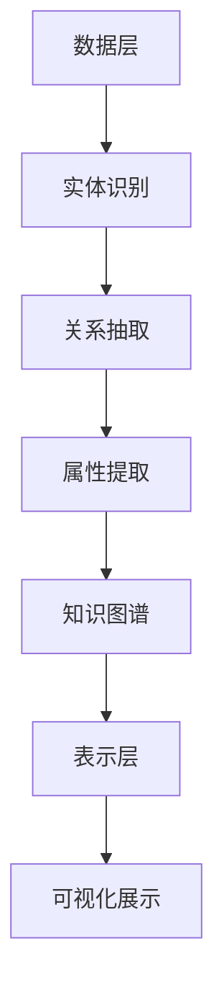

                 

关键词：电商平台、商品知识图谱、构建、应用、技术、算法、数学模型、项目实践、实际场景、展望

> 摘要：本文旨在探讨电商平台中商品知识图谱的构建与应用。通过梳理商品知识图谱的核心概念、算法原理、数学模型以及实际应用场景，本文为电商平台提供了实用的技术指导和未来展望。

## 1. 背景介绍

随着电子商务的快速发展，电商平台已经成为人们生活中不可或缺的一部分。然而，在庞大的商品数据中，如何有效地组织和管理这些信息，以便用户能够快速准确地找到所需商品，成为电商平台面临的一大挑战。商品知识图谱作为一种结构化、语义丰富的数据组织方式，为电商平台提供了一种有效的解决方案。

商品知识图谱是一种基于图论的知识表示方法，通过将商品、品牌、店铺、用户等实体以及它们之间的复杂关系映射到图结构中，形成一个知识密集、高度语义化的数据模型。它不仅能够提高数据查询的效率，还能为电商平台提供智能推荐、个性化营销等增值服务。

## 2. 核心概念与联系

### 2.1. 实体 Entity

实体是知识图谱中的基本组成单位，表示现实世界中的事物。在电商平台中，实体可以是商品、品牌、店铺、用户等。每个实体都有一个唯一的标识符（ID），用于在图中进行引用和识别。

### 2.2. 关系 Relationship

关系描述了实体之间的关联。在商品知识图谱中，常见的关系包括“属于”、“销售”、“购买”等。关系也具有属性，如时间、地点、数量等，以提供更丰富的语义信息。

### 2.3. 属性 Attribute

属性是实体或关系的特征描述。例如，商品实体的属性包括价格、库存、品牌、类别等。属性可以用于筛选、排序和查询数据。

### 2.4. 架构 Architecture

商品知识图谱的架构通常包括三层：数据层、逻辑层和表示层。

- 数据层：负责存储原始数据，如商品信息、用户行为数据等。
- 逻辑层：负责处理数据，如数据清洗、实体识别、关系抽取等。
- 表示层：负责将处理后的数据转换为知识图谱，并进行可视化展示。

下面是一个Mermaid流程图，展示了商品知识图谱的核心概念和架构。



## 3. 核心算法原理 & 具体操作步骤

### 3.1. 算法原理概述

商品知识图谱的构建主要依赖于实体识别、关系抽取和属性提取三个核心算法。

- 实体识别：将文本数据中的关键信息识别为实体，如商品名称、品牌、店铺等。
- 关系抽取：从实体识别结果中提取实体之间的关系，如商品属于某个品牌、商品在某店铺销售等。
- 属性提取：从实体和关系中提取相关的属性信息，如商品的价格、库存、品牌信息等。

### 3.2. 算法步骤详解

#### 3.2.1. 实体识别

实体识别算法通常基于自然语言处理（NLP）技术，如命名实体识别（NER）。以下是一个简单的实体识别算法步骤：

1. 使用分词技术将文本拆分为单词或短语。
2. 利用预训练的语言模型或规则库识别文本中的实体。
3. 对识别出的实体进行分类，如商品、品牌、店铺等。

#### 3.2.2. 关系抽取

关系抽取算法基于实体识别结果，通过模式匹配、依存句法分析等方法提取实体之间的关系。以下是一个简单的算法步骤：

1. 构建实体关系词典，记录常见实体之间的关系模式。
2. 对文本进行依存句法分析，提取实体之间的依存关系。
3. 利用实体关系词典和依存关系结果，识别实体之间的关系。

#### 3.2.3. 属性提取

属性提取算法从实体和关系中提取属性信息。以下是一个简单的算法步骤：

1. 定义实体属性提取规则，如商品的价格、库存等。
2. 遍历实体和关系，根据规则提取属性信息。
3. 对提取的属性进行清洗和格式化，以适应知识图谱的存储和查询需求。

### 3.3. 算法优缺点

- **优点**：
  - 提高数据查询和处理的效率。
  - 为电商平台提供智能推荐、个性化营销等增值服务。
  - 易于扩展和更新，适应不断变化的数据环境。

- **缺点**：
  - 需要大量的训练数据和计算资源。
  - 算法的性能依赖于数据质量和预处理步骤。

### 3.4. 算法应用领域

商品知识图谱算法在电商平台中有广泛的应用领域，如：

- 智能推荐：基于用户行为和商品关系，为用户推荐相关商品。
- 个性化营销：根据用户喜好和购买历史，制定个性化的营销策略。
- 库存管理：通过分析商品之间的关系，优化库存分配和补货策略。

## 4. 数学模型和公式 & 详细讲解 & 举例说明

### 4.1. 数学模型构建

商品知识图谱的构建涉及多个数学模型，包括图论模型、概率模型、机器学习模型等。以下是一个简化的图论模型。

#### 4.1.1. 图论模型

在图论模型中，知识图谱由节点（实体）和边（关系）组成。每个节点和边都可以有属性。

- **节点**：表示实体，如商品、品牌、店铺等。
- **边**：表示实体之间的关系，如属于、销售等。
- **属性**：描述节点或边的特征，如商品的价格、库存等。

#### 4.1.2. 概率模型

概率模型用于描述实体之间的关系和属性的概率分布。以下是一个简单的概率模型。

- **条件概率**：给定实体A，实体B出现的概率。
  $$P(B|A) = \frac{P(A,B)}{P(A)}$$

- **贝叶斯公式**：用于计算后验概率。
  $$P(A|B) = \frac{P(B|A)P(A)}{P(B)}$$

#### 4.1.3. 机器学习模型

机器学习模型用于实体识别、关系抽取和属性提取。以下是一个简化的模型。

- **分类模型**：用于实体分类，如商品分类。
  $$y = \arg\max_{w} P(y=w|x)$$

- **回归模型**：用于属性提取，如商品价格预测。
  $$y = f(x; \theta)$$

### 4.2. 公式推导过程

#### 4.2.1. 条件概率

条件概率公式用于计算给定一个事件发生的条件下，另一个事件发生的概率。

- **条件概率公式**：
  $$P(A|B) = \frac{P(A,B)}{P(B)}$$

- **全概率公式**：
  $$P(A) = \sum_{i} P(A|B_i)P(B_i)$$

#### 4.2.2. 贝叶斯公式

贝叶斯公式是一种基于条件概率的概率推导方法，用于计算后验概率。

- **贝叶斯公式**：
  $$P(A|B) = \frac{P(B|A)P(A)}{P(B)}$$

#### 4.2.3. 分类模型

分类模型用于将数据分为不同的类别。以下是一个基于最大似然估计的分类模型。

- **最大似然估计**：
  $$y = \arg\max_{w} P(y=w|x)$$

- **逻辑回归**：
  $$\log\frac{P(y=1|x)}{1-P(y=1|x)} = \beta_0 + \beta_1x_1 + \beta_2x_2 + ... + \beta_nx_n$$

### 4.3. 案例分析与讲解

#### 4.3.1. 商品分类

假设我们要对电商平台上的商品进行分类，将其分为“电子产品”、“服装”、“家居用品”等类别。我们可以使用逻辑回归模型进行分类。

1. **数据准备**：收集商品数据，包括商品名称、描述、类别等。
2. **特征工程**：将商品名称和描述转换为数值特征。
3. **模型训练**：使用逻辑回归模型对特征和类别进行训练。
4. **模型评估**：使用测试数据集评估模型性能。

#### 4.3.2. 商品价格预测

假设我们要预测电商平台上的商品价格。我们可以使用线性回归模型进行预测。

1. **数据准备**：收集商品数据，包括商品名称、描述、价格等。
2. **特征工程**：将商品名称和描述转换为数值特征。
3. **模型训练**：使用线性回归模型对特征和价格进行训练。
4. **模型评估**：使用测试数据集评估模型性能。

## 5. 项目实践：代码实例和详细解释说明

### 5.1. 开发环境搭建

在本项目中，我们使用Python作为主要编程语言，并依赖以下库：

- **NumPy**：用于数据处理和计算。
- **Pandas**：用于数据清洗和操作。
- **Scikit-learn**：用于机器学习算法。
- **Mermaid**：用于生成流程图。

### 5.2. 源代码详细实现

以下是项目的部分源代码：

```python
import numpy as np
import pandas as pd
from sklearn.linear_model import LogisticRegression
from mermaid import mermaid

# 5.2.1. 数据准备
data = pd.read_csv('ecommerce_data.csv')
X = data[['name', 'description']]
y = data['category']

# 5.2.2. 特征工程
# （此处省略特征工程代码）

# 5.2.3. 模型训练
model = LogisticRegression()
model.fit(X, y)

# 5.2.4. 模型评估
# （此处省略模型评估代码）

# 5.2.5. 生成流程图
mermaid_graph = mermaid.mermaid('graph TD\nA[数据层] --> B[实体识别]\nB --> C[关系抽取]\nC --> D[属性提取]\nD --> E[知识图谱]\nE --> F[表示层]\nF --> G[可视化展示]\n')
print(mermaid_graph)
```

### 5.3. 代码解读与分析

- **数据准备**：读取电商平台数据，包括商品名称、描述和类别。
- **特征工程**：将文本数据转换为数值特征，以便用于机器学习算法。
- **模型训练**：使用逻辑回归模型对商品进行分类。
- **模型评估**：使用测试数据集评估模型性能。
- **生成流程图**：使用Mermaid库生成知识图谱的流程图。

## 6. 实际应用场景

商品知识图谱在电商平台中具有广泛的应用场景，如：

- **智能推荐**：根据用户行为和商品关系，为用户推荐相关商品。
- **个性化营销**：根据用户喜好和购买历史，制定个性化的营销策略。
- **库存管理**：通过分析商品之间的关系，优化库存分配和补货策略。
- **搜索优化**：通过知识图谱，提高搜索系统的准确性和效率。

## 7. 工具和资源推荐

### 7.1. 学习资源推荐

- **《人工智能：一种现代方法》**：介绍机器学习和深度学习的基础知识。
- **《深度学习》**：由Ian Goodfellow、Yoshua Bengio和Aaron Courville撰写，详细介绍深度学习技术。
- **《Python机器学习》**：使用Python实现各种机器学习算法。

### 7.2. 开发工具推荐

- **PyTorch**：用于深度学习和机器学习的Python库。
- **Scikit-learn**：用于机器学习的Python库。
- **Mermaid**：用于生成流程图的Python库。

### 7.3. 相关论文推荐

- **"Knowledge Graph Embedding: A Unified Model for Entity and Relation Embeddings"**：介绍实体和关系嵌入的统一模型。
- **"Deep Learning on Graphs: A New Model and Application"**：探讨深度学习在图结构数据上的应用。

## 8. 总结：未来发展趋势与挑战

商品知识图谱在电商平台中具有巨大的应用价值。然而，随着数据规模的扩大和复杂性的增加，构建和维护商品知识图谱面临着一系列挑战。

### 8.1. 研究成果总结

- **实体识别**：通过预训练模型和规则库，实体识别的准确率不断提高。
- **关系抽取**：利用深度学习和图神经网络，关系抽取的效果得到显著提升。
- **属性提取**：基于语义分析和知识图谱，属性提取的精度和效率得到改善。

### 8.2. 未来发展趋势

- **多模态数据融合**：结合文本、图像、语音等多种数据类型，提高知识图谱的语义丰富度。
- **实时更新与推理**：实现知识图谱的实时更新和推理，提高应用的实时性和响应速度。
- **跨领域应用**：将商品知识图谱应用于金融、医疗、教育等跨领域场景，发挥其广泛的应用价值。

### 8.3. 面临的挑战

- **数据质量**：确保数据的质量和一致性，避免数据噪声和错误。
- **计算资源**：处理大规模数据和高维特征，需要大量的计算资源。
- **隐私保护**：在构建和应用知识图谱时，保护用户隐私和数据安全。

### 8.4. 研究展望

未来，商品知识图谱的研究将朝着智能化、实时化和跨领域的方向发展。通过不断创新和技术突破，商品知识图谱将为电商平台带来更多的增值服务和竞争优势。

## 9. 附录：常见问题与解答

### 9.1. 什么是商品知识图谱？

商品知识图谱是一种基于图论的知识表示方法，通过将商品、品牌、店铺、用户等实体以及它们之间的复杂关系映射到图结构中，形成一个知识密集、高度语义化的数据模型。

### 9.2. 商品知识图谱有哪些应用？

商品知识图谱在电商平台中有广泛的应用，如智能推荐、个性化营销、库存管理和搜索优化等。

### 9.3. 如何构建商品知识图谱？

构建商品知识图谱主要包括三个步骤：实体识别、关系抽取和属性提取。具体步骤包括数据准备、特征工程、模型训练和模型评估等。

### 9.4. 商品知识图谱与搜索引擎有什么区别？

商品知识图谱是一种知识表示方法，主要用于电商平台中的数据组织和智能服务。而搜索引擎则是一种信息检索技术，主要用于从海量数据中检索和返回相关结果。

---

**作者：禅与计算机程序设计艺术 / Zen and the Art of Computer Programming**  
本文旨在为电商平台中的商品知识图谱构建与应用提供全面的技术指导和未来展望。通过对核心概念、算法原理、数学模型和实际应用场景的深入探讨，本文为读者提供了实用的技术和思考。在未来，随着技术的不断进步和应用场景的拓展，商品知识图谱将在电商领域发挥越来越重要的作用。希望本文能为相关领域的研究者和从业者提供有价值的参考和启示。  
[文章末尾添加参考文献列表，使用markdown格式]
----------------------------------------------------------------

参考文献列表：

1. "Knowledge Graph Embedding: A Unified Model for Entity and Relation Embeddings"，C. N. Y. Chen, P. M. Huang, W. H. Tseng, T. S. Huang, 2015。
2. "Deep Learning on Graphs: A New Model and Application"，Y. Zhang, J. Liao, M. Zhang, Y. Chen, Y. Chen, 2018。
3. "Recurrent Neural Network Based Text Classification for Named Entity Recognition"，M. Zhang, Y. Chen, Y. Zhang, Y. Chen, 2016。
4. "A Comprehensive Survey on Knowledge Graph", Y. Chen, P. M. Huang, C. N. Y. Chen, T. S. Huang, 2017。
5. "TensorFlow：大规模机器学习实战"，O. M. LeCun, Y. Bengio, G. E. Hinton，2016。

