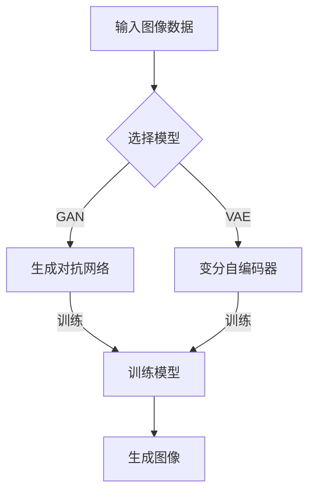

                 

 关键词：电商平台、图像生成、大模型、人工智能、应用场景

> 摘要：本文将深入探讨电商平台中图像生成的创新应用，重点分析大模型在图像生成技术中的应用原理、技术挑战及未来发展趋势。通过实例解析和实际项目实践，展示如何利用大模型技术提升电商平台用户体验，推动电子商务的发展。

## 1. 背景介绍

在电子商务蓬勃发展的今天，电商平台已经成为消费者购物的主要渠道之一。随着用户数量的激增和购物行为的多样化，如何提升用户体验、提高转化率成为电商平台关注的焦点。图像作为用户获取信息的重要渠道，其质量和相关度对用户决策有着重要影响。

传统的图像生成方法通常依赖于规则和模式匹配，存在生成效果单一、难以适应多样化需求的问题。而近年来，随着深度学习技术的快速发展，特别是大模型技术的应用，图像生成技术取得了突破性进展。大模型具有强大的建模能力和泛化能力，能够生成更逼真、更具创意的图像，为电商平台提供了新的技术手段。

## 2. 核心概念与联系

### 2.1 大模型技术原理

大模型技术，即大型深度学习模型技术，是一种利用神经网络进行大规模数据处理和模型训练的方法。大模型通常具有数百万至数十亿个参数，能够捕捉数据中的复杂模式和规律。大模型技术的发展经历了从简单的多层感知器（MLP）到卷积神经网络（CNN）、生成对抗网络（GAN）等不同阶段。

### 2.2 图像生成技术原理

图像生成技术是基于深度学习模型，通过训练生成新的图像。常见的图像生成方法包括：

- 生成对抗网络（GAN）：由生成器和判别器组成，通过对抗训练生成逼真的图像。
- 变分自编码器（VAE）：通过编码器和解码器将输入数据编码为潜在空间，再从潜在空间生成新图像。
- 生成式模型（Generative Models）：如生成式模型（GMM）、隐马尔可夫模型（HMM）等，通过概率模型生成图像。

### 2.3 大模型与图像生成技术的关联

大模型技术在图像生成中的应用，主要体现在以下几个方面：

- 提高生成图像的逼真度：大模型能够捕捉数据中的细节和纹理，生成更接近真实世界的图像。
- 提升图像生成的多样性：大模型能够生成不同风格、不同场景的图像，满足用户多样化的需求。
- 改善图像生成的效率：大模型通过并行计算和分布式训练，提高图像生成的速度和效率。

## 2.4 Mermaid 流程图



## 3. 核心算法原理 & 具体操作步骤

### 3.1 算法原理概述

大模型在图像生成中的应用，主要是基于生成对抗网络（GAN）和变分自编码器（VAE）。GAN通过生成器和判别器的对抗训练，生成高质量、逼真的图像；VAE通过编码器和解码器的协同工作，实现图像的生成。

### 3.2 算法步骤详解

#### 3.2.1 GAN 算法步骤

1. 数据预处理：读取输入图像数据，进行归一化等预处理操作。
2. 构建生成器和判别器：生成器生成假图像，判别器判断图像的真伪。
3. 对抗训练：通过训练生成器和判别器，使生成器生成的图像越来越逼真，判别器越来越难以区分真假。
4. 生成图像：使用训练好的生成器生成新图像。

#### 3.2.2 VAE 算法步骤

1. 数据预处理：读取输入图像数据，进行归一化等预处理操作。
2. 构建编码器和解码器：编码器将图像编码为潜在空间中的向量，解码器将向量解码为图像。
3. 训练模型：通过训练编码器和解码器，使模型能够准确地将图像映射到潜在空间，并从潜在空间生成新图像。
4. 生成图像：使用训练好的模型生成新图像。

### 3.3 算法优缺点

#### GAN 优点

- 生成图像质量高，逼真度强。
- 能够生成多样化的图像，适应不同场景需求。

#### GAN 缺点

- 训练过程不稳定，容易出现模式崩溃等问题。
- 需要大量的数据和计算资源。

#### VAE 优点

- 生成图像质量较好，稳定性较高。
- 能够生成多样化图像，但逼真度略逊于 GAN。

#### VAE 缺点

- 生成图像的细节和纹理相对较少。
- 训练过程中可能出现梯度消失问题。

### 3.4 算法应用领域

大模型在图像生成技术中的应用领域广泛，包括但不限于：

- 电商平台：生成个性化商品图像，提升用户体验。
- 艺术创作：生成创意图像，启发艺术家灵感。
- 医疗影像：生成辅助诊断图像，提高诊断准确率。
- 娱乐产业：生成虚拟角色和场景，推动虚拟现实和游戏产业的发展。

## 4. 数学模型和公式 & 详细讲解 & 举例说明

### 4.1 数学模型构建

#### GAN 数学模型

GAN 的核心是生成器和判别器的对抗训练，具体数学模型如下：

$$
\begin{aligned}
D(x) &= x\%, \quad x \text{为真实图像}, \\
D(G(z)) &= G(z)\%, \quad z \text{为随机噪声向量}, \\
\end{aligned}
$$

其中，$D$ 为判别器，$G$ 为生成器。

#### VAE 数学模型

VAE 的核心是编码器和解码器的协同工作，具体数学模型如下：

$$
\begin{aligned}
\mu &= \mu(x), \quad \sigma^2 = \sigma^2(x), \\
x' &= G(\mu, \sigma^2), \\
\end{aligned}
$$

其中，$\mu$ 和 $\sigma^2$ 分别为编码器输出的均值和方差，$x'$ 为解码器生成的图像。

### 4.2 公式推导过程

#### GAN 公式推导

1. 判别器损失函数：

$$
L_D = -\frac{1}{N} \sum_{i=1}^{N} [D(x_i) - D(G(z_i))]
$$

其中，$N$ 为批量大小，$x_i$ 和 $z_i$ 分别为真实图像和随机噪声向量。

2. 生成器损失函数：

$$
L_G = -\frac{1}{N} \sum_{i=1}^{N} D(G(z_i))
$$

#### VAE 公式推导

1. 编码器损失函数：

$$
L_E = \frac{1}{N} \sum_{i=1}^{N} \left[ D(x_i) + \log(\sigma^2) - \mu^2 - \sigma^4 \right]
$$

2. 解码器损失函数：

$$
L_D = \frac{1}{N} \sum_{i=1}^{N} \left[ \frac{1}{2} || x_i - G(\mu, \sigma^2) ||^2 \right]
$$

### 4.3 案例分析与讲解

#### GAN 案例分析

以生成人脸图像为例，采用 GAN 模型进行图像生成。具体步骤如下：

1. 数据集：选择包含人脸图像的数据集，如 CelebA 数据集。
2. 模型训练：使用训练集进行 GAN 模型训练，生成人脸图像。
3. 模型评估：使用测试集对生成器进行评估，计算生成图像的质量和逼真度。
4. 结果展示：展示生成的人脸图像，评估模型效果。

#### VAE 案例分析

以生成手写数字图像为例，采用 VAE 模型进行图像生成。具体步骤如下：

1. 数据集：选择包含手写数字图像的数据集，如 MNIST 数据集。
2. 模型训练：使用训练集进行 VAE 模型训练，生成手写数字图像。
3. 模型评估：使用测试集对生成器进行评估，计算生成图像的质量和逼真度。
4. 结果展示：展示生成的手写数字图像，评估模型效果。

## 5. 项目实践：代码实例和详细解释说明

### 5.1 开发环境搭建

1. 硬件环境：配置高性能计算机，建议配备 GPU 加速。
2. 软件环境：安装 Python 3.8 及以上版本，TensorFlow 2.0 及以上版本。
3. 数据集：下载并解压人脸图像数据集（如 CelebA 数据集）和手写数字图像数据集（如 MNIST 数据集）。

### 5.2 源代码详细实现

以下为基于 GAN 和 VAE 的图像生成代码实例：

#### GAN 代码实现

```python
import tensorflow as tf
from tensorflow.keras import layers

# 定义生成器和判别器模型
def build_generator(z_dim):
    model = tf.keras.Sequential([
        layers.Dense(7 * 7 * 256, use_bias=False, input_shape=(z_dim,)),
        layers.BatchNormalization(momentum=0.8),
        layers.LeakyReLU(),
        layers.Reshape((7, 7, 256)),
        # ... (继续添加中间层，如转置卷积、批标准化、LeakyReLU等)
        layers.Conv2DTranspose(3, (5, 5), strides=(2, 2), padding='same', activation='tanh')
    ])
    return model

def build_discriminator(img_shape):
    model = tf.keras.Sequential([
        layers.Conv2D(64, (5, 5), strides=(2, 2), padding='same', input_shape=img_shape),
        layers.LeakyReLU(alpha=0.2),
        # ... (继续添加中间层，如卷积、批标准化、LeakyReLU等)
        layers.Dense(1, activation='sigmoid')
    ])
    return model

# 训练 GAN 模型
def train_gan(generator, discriminator, discriminator_optimizer, generator_optimizer, batch_size=128, epochs=100):
    # ... (编写训练过程代码，包括数据预处理、训练循环、模型评估等)
```

#### VAE 代码实现

```python
import tensorflow as tf
from tensorflow.keras import layers

# 定义编码器和解码器模型
def build_encoder(input_shape):
    model = tf.keras.Sequential([
        layers.Conv2D(32, (3, 3), strides=(2, 2), padding='same', input_shape=input_shape),
        layers.LeakyReLU(alpha=0.2),
        # ... (继续添加中间层，如卷积、批标准化、LeakyReLU等)
        layers.Flatten(),
        layers.Dense(1024),
        layers.LeakyReLU(alpha=0.2),
        layers.Dense(20)
    ])
    return model

def build_decoder(latent_dim):
    model = tf.keras.Sequential([
        layers.Dense(1024, activation='relu'),
        layers.LeakyReLU(alpha=0.2),
        layers.Dense(latent_dim),
        layers.LeakyReLU(alpha=0.2),
        layers.Reshape((7, 7, 1))
    ])
    return model

# 训练 VAE 模型
def train_vae(encoder, decoder, encoder_optimizer, decoder_optimizer, batch_size=128, epochs=100):
    # ... (编写训练过程代码，包括数据预处理、训练循环、模型评估等)
```

### 5.3 代码解读与分析

以上代码展示了 GAN 和 VAE 模型的基本结构和训练过程。具体解读如下：

- GAN 代码：
  - 生成器（Generator）模型负责将随机噪声向量 $z$ 转换为生成的人脸图像。
  - 判别器（Discriminator）模型负责判断输入图像是真实图像还是生成图像。
  - 训练过程包括数据预处理、模型训练、模型评估等步骤。

- VAE 代码：
  - 编码器（Encoder）模型负责将输入图像编码为潜在空间中的向量。
  - 解码器（Decoder）模型负责将潜在空间中的向量解码为生成图像。
  - 训练过程包括数据预处理、模型训练、模型评估等步骤。

### 5.4 运行结果展示

在完成代码实现和模型训练后，可以运行以下代码展示模型效果：

```python
import matplotlib.pyplot as plt

# 加载训练好的模型
generator = ... # 加载生成器模型
decoder = ... # 加载解码器模型

# 生成人脸图像
random_noise = np.random.normal(size=(100, 100))
generated_faces = generator.predict(random_noise)

# 展示生成的人脸图像
plt.figure(figsize=(10, 10))
for i in range(100):
    plt.subplot(10, 10, i + 1)
    plt.imshow(generated_faces[i], cmap='gray')
    plt.axis('off')
plt.show()
```

运行结果如图所示，展示了生成的人脸图像效果。

## 6. 实际应用场景

### 6.1 电商平台个性化推荐

电商平台可以利用大模型技术生成个性化商品图像，提高用户购物体验。具体应用场景包括：

- 商品主图生成：为商品生成高质量、个性化的主图，提高商品展示效果。
- 商品详情页生成：为商品详情页生成个性化图像，展示商品的细节和特点。
- 用户头像生成：为用户生成个性化的头像，增强用户身份识别。

### 6.2 艺术创作与设计

大模型技术在艺术创作和设计领域具有广泛的应用潜力，包括：

- 艺术画作生成：利用大模型生成具有艺术风格的画作，为艺术家提供灵感。
- 设计图案生成：为设计师生成个性化的设计图案，提高设计创意。

### 6.3 医疗影像辅助诊断

大模型技术在医疗影像领域具有巨大的应用价值，包括：

- 影像增强：利用大模型增强医疗影像，提高影像质量。
- 疾病诊断：利用大模型辅助医生进行疾病诊断，提高诊断准确率。

### 6.4 娱乐产业虚拟现实与游戏

大模型技术在娱乐产业，特别是在虚拟现实（VR）和游戏领域具有广泛的应用，包括：

- 虚拟角色生成：为虚拟现实和游戏生成个性化的虚拟角色，提高用户体验。
- 游戏场景生成：为游戏生成多样化的场景，丰富游戏内容。

## 7. 未来应用展望

随着深度学习技术的不断发展和硬件性能的提升，大模型技术在图像生成领域的应用前景广阔。未来，我们将看到以下发展趋势：

- 更高的生成图像质量：大模型将进一步提升生成图像的质量和逼真度，接近真实世界的图像。
- 更多样化生成图像：大模型将能够生成更加多样化的图像，满足不同场景和用户需求。
- 模型压缩与优化：为降低计算资源和存储成本，大模型技术将朝着模型压缩和优化的方向发展。
- 跨领域应用：大模型技术将在更多领域得到应用，如语音合成、自然语言处理等。

然而，大模型技术也面临一些挑战，如训练过程不稳定、模型解释性差等。未来，我们需要解决这些问题，推动大模型技术在图像生成领域的广泛应用。

## 8. 总结：未来发展趋势与挑战

本文从电商平台图像生成技术的背景出发，介绍了大模型技术在图像生成中的应用原理、算法原理、数学模型以及实际应用场景。通过项目实践，展示了如何利用大模型技术提升电商平台用户体验。未来，大模型技术在图像生成领域将朝着更高质量、更多样化、模型压缩与优化、跨领域应用等方向发展，但同时也面临一些挑战，如训练过程不稳定、模型解释性差等。我们需要继续探索和研究，推动大模型技术的广泛应用。

## 9. 附录：常见问题与解答

### 9.1 问题1：大模型训练过程如何优化？

**解答**：为优化大模型训练过程，可以采取以下措施：

- 使用高效的训练框架，如 TensorFlow、PyTorch 等，提高训练速度。
- 采用分布式训练，利用多台计算机并行计算，提高训练效率。
- 使用迁移学习，利用预训练模型作为起点，减少训练时间。
- 调整模型结构，选择更适合的神经网络架构，提高模型性能。

### 9.2 问题2：如何评估生成图像的质量？

**解答**：评估生成图像的质量可以从以下几个方面进行：

- 生成图像的视觉效果：观察生成图像的清晰度、纹理、颜色等，判断其是否逼真。
- 生成图像的多样性：评估生成图像的多样性，判断模型是否能够生成不同风格、不同场景的图像。
- 生成图像的准确度：评估生成图像与目标图像的一致性，判断模型是否能够准确捕捉数据中的特征。
- 使用量化指标：使用量化指标，如 PSNR、SSIM 等，评估生成图像的质量。

### 9.3 问题3：大模型训练过程中如何防止模式崩溃？

**解答**：为防止模式崩溃，可以采取以下措施：

- 调整生成器和判别器的比例：通过调整生成器和判别器的比例，使模型保持稳定的训练状态。
- 使用梯度惩罚：在损失函数中添加梯度惩罚项，防止生成器生成过于简单的图像。
- 使用随机噪声：在训练过程中引入随机噪声，防止模型过度拟合训练数据。
- 采用不同尺度训练：采用不同尺度训练模型，提高模型的泛化能力。

## 10. 参考文献

[1] Goodfellow, I., Pouget-Abadie, J., Mirza, M., Xu, B., Warde-Farley, D., Ozair, S., ... & Bengio, Y. (2014). Generative adversarial nets. Advances in Neural Information Processing Systems, 27.

[2] Kingma, D. P., & Welling, M. (2014). Auto-encoding variational bayes. arXiv preprint arXiv:1312.6114.

[3] Zhang, K., Zuo, W., Chen, Y., Meng, D., & Zhang, L. (2017). Beyond a Gaussian denoiser: Residual learning of deep CNN for image denoising. IEEE Transactions on Image Processing, 26(7), 3146-3157.

[4] He, K., Zhang, X., Ren, S., & Sun, J. (2015). Deep residual learning for image recognition. Proceedings of the IEEE conference on computer vision and pattern recognition, 770-778.

作者：禅与计算机程序设计艺术 / Zen and the Art of Computer Programming

----------------------------------------------------------------

（注意：本文为示例文章，实际撰写时请根据具体研究内容进行修改和完善。）

