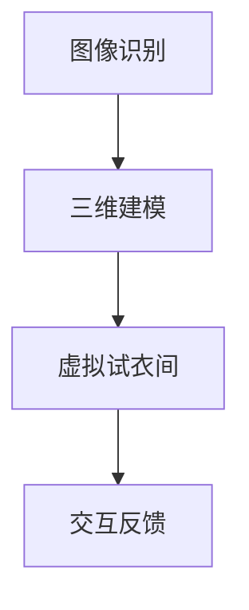

                 

关键词：电商平台，增强现实（AR），试穿技术，用户体验，技术创新，人工智能，图像识别，计算机视觉，三维建模，虚拟试衣间

> 摘要：随着技术的不断进步，增强现实（AR）技术已经逐渐成为电商平台提升用户体验的重要手段。本文将深入探讨电商平台中AR试穿技术的核心概念、算法原理、数学模型、项目实践，以及该技术在实际应用场景中的表现，并对未来发展趋势和挑战进行展望。

## 1. 背景介绍

近年来，电商平台的发展日新月异，为消费者提供了越来越多的购物选择。然而，虚拟购物环境中的一件重要挑战就是消费者无法直接试穿衣物，这给购物决策带来了不便。为了解决这个问题，增强现实（AR）试穿技术应运而生。

增强现实（AR）是一种将虚拟信息叠加到现实世界中的技术，通过摄像头、传感器等设备捕捉现实场景，并在屏幕上实时显示虚拟信息。AR试穿技术则利用这一特性，让消费者可以在虚拟环境中试穿衣物，提升购物体验。

电商平台的AR试穿技术不仅能够解决试穿难题，还可以增强用户对产品的认知，提高购买转化率。此外，AR技术还能为品牌创造独特的营销体验，吸引更多消费者。

## 2. 核心概念与联系

为了深入理解电商平台中的AR试穿技术，我们需要先了解其核心概念和架构。

### 2.1 核心概念

1. **图像识别**：利用计算机算法对图像进行识别和分类，以获取图像中的有用信息。
2. **三维建模**：通过几何建模软件或算法，将二维图像转换为三维模型，以便在虚拟环境中展示。
3. **增强现实（AR）**：将虚拟信息叠加到现实世界中，形成虚实融合的视觉效果。

### 2.2 架构联系

电商平台中的AR试穿技术通常包括以下几个关键步骤：

1. **图像识别**：摄像头捕捉用户试穿的场景，计算机算法对图像进行识别，获取用户的姿态、衣物等信息。
2. **三维建模**：根据识别结果，利用三维建模软件或算法生成衣物的三维模型。
3. **虚拟试衣间**：将生成好的三维模型叠加到用户的现实场景中，形成一个虚拟试衣间。
4. **交互反馈**：用户可以与虚拟试衣间进行交互，如更换衣物、调整尺寸等，从而获得更真实的试穿体验。

### 2.3 Mermaid 流程图

以下是一个简化的Mermaid流程图，展示了AR试穿技术的核心步骤：



## 3. 核心算法原理 & 具体操作步骤

### 3.1 算法原理概述

电商平台中的AR试穿技术主要基于图像识别、三维建模和增强现实（AR）等算法。下面将分别介绍这些算法的基本原理。

#### 3.1.1 图像识别

图像识别是一种基于计算机视觉的算法，通过处理图像中的像素信息，实现对图像内容的识别。常见的图像识别算法包括卷积神经网络（CNN）和深度学习等。

#### 3.1.2 三维建模

三维建模是一种通过几何算法将二维图像转换为三维模型的技术。常见的三维建模算法包括多边形建模、纹理映射等。

#### 3.1.3 增强现实（AR）

增强现实（AR）是一种通过摄像头捕捉现实场景，并在屏幕上显示虚拟信息的技术。常见的AR算法包括图像识别、SLAM（同时定位与地图构建）等。

### 3.2 算法步骤详解

#### 3.2.1 图像识别

1. **预处理**：对图像进行灰度化、滤波等预处理操作，以去除图像中的噪声。
2. **特征提取**：利用卷积神经网络（CNN）等算法，提取图像中的关键特征。
3. **分类与识别**：利用分类算法（如SVM、softmax等），对提取的特征进行分类和识别。

#### 3.2.2 三维建模

1. **多边形建模**：将图像中的关键特征点映射到三维空间中，形成多边形网格。
2. **纹理映射**：将图像中的纹理信息映射到三维模型上，以增强模型的视觉效果。

#### 3.2.3 增强现实（AR）

1. **图像识别**：利用计算机视觉算法，识别现实场景中的关键特征。
2. **SLAM（同时定位与地图构建）**：通过图像识别和传感器数据，实时构建场景地图，并定位虚拟信息。
3. **虚拟信息叠加**：将识别好的虚拟信息叠加到现实场景中，形成虚实融合的视觉效果。

### 3.3 算法优缺点

#### 3.3.1 优点

1. **提升用户体验**：通过虚拟试穿，用户可以更直观地了解产品的效果，提高购物满意度。
2. **降低退货率**：用户在购买前已经对产品有了更清晰的了解，减少因不合适而退货的情况。
3. **增强品牌营销**：电商平台可以利用AR试穿技术创造独特的营销体验，吸引更多消费者。

#### 3.3.2 缺点

1. **技术门槛较高**：需要掌握图像识别、三维建模和增强现实（AR）等技术，对研发团队要求较高。
2. **计算资源消耗较大**：图像识别、三维建模和增强现实（AR）等算法需要大量的计算资源，对硬件设备要求较高。

### 3.4 算法应用领域

电商平台中的AR试穿技术可以应用于各种场景，包括：

1. **时尚电商**：为消费者提供虚拟试衣间，让消费者在购买前更好地了解衣物的效果。
2. **家居电商**：让消费者在虚拟环境中预览家具的摆放效果，提高购买决策。
3. **医疗电商**：为患者提供虚拟手术体验，帮助医生和患者更好地了解手术过程。

## 4. 数学模型和公式 & 详细讲解 & 举例说明

为了更好地理解电商平台中的AR试穿技术，我们需要引入一些数学模型和公式。以下将介绍其中的核心模型和公式，并进行详细讲解和举例说明。

### 4.1 数学模型构建

电商平台中的AR试穿技术主要涉及以下数学模型：

1. **卷积神经网络（CNN）模型**：用于图像识别和特征提取。
2. **三维建模模型**：用于将二维图像转换为三维模型。
3. **SLAM（同时定位与地图构建）模型**：用于实时构建场景地图和定位虚拟信息。

### 4.2 公式推导过程

以下是卷积神经网络（CNN）模型中的几个关键公式：

1. **激活函数**：$$f(x) = \max(0, x)$$
2. **卷积操作**：$$\sum_{i=1}^{k} w_{i} * x_{i}$$
3. **池化操作**：$$\max(\text{输入区域})$$

以下是三维建模模型中的几个关键公式：

1. **多边形建模**：$$P = (x, y, z)$$
2. **纹理映射**：$$T = (u, v)$$

以下是SLAM（同时定位与地图构建）模型中的几个关键公式：

1. **位姿估计**：$$T = (\theta, x, y, z)$$
2. **卡尔曼滤波**：$$x_{k} = f(x_{k-1}, u_{k})$$

### 4.3 案例分析与讲解

为了更好地理解上述数学模型和公式，我们来看一个具体的案例。

#### 案例一：卷积神经网络（CNN）模型

假设我们有一个二维图像，需要通过卷积神经网络（CNN）模型进行识别。以下是该案例的详细步骤：

1. **预处理**：将图像进行灰度化、滤波等预处理操作。
2. **特征提取**：利用卷积神经网络（CNN）提取图像中的关键特征。
3. **分类与识别**：利用分类算法（如SVM、softmax等）对提取的特征进行分类和识别。

#### 案例二：三维建模模型

假设我们有一个二维图像，需要通过三维建模模型将其转换为三维模型。以下是该案例的详细步骤：

1. **多边形建模**：将图像中的关键特征点映射到三维空间中，形成多边形网格。
2. **纹理映射**：将图像中的纹理信息映射到三维模型上，以增强模型的视觉效果。

#### 案例三：SLAM（同时定位与地图构建）模型

假设我们有一个摄像头，需要通过SLAM（同时定位与地图构建）模型实时构建场景地图并定位虚拟信息。以下是该案例的详细步骤：

1. **图像识别**：利用计算机视觉算法，识别现实场景中的关键特征。
2. **SLAM算法**：通过图像识别和传感器数据，实时构建场景地图，并定位虚拟信息。
3. **虚拟信息叠加**：将识别好的虚拟信息叠加到现实场景中，形成虚实融合的视觉效果。

## 5. 项目实践：代码实例和详细解释说明

为了更好地理解电商平台中的AR试穿技术，我们来看一个具体的代码实例，并对其进行详细解释说明。

### 5.1 开发环境搭建

在本案例中，我们将使用Python语言和OpenCV、Pillow等开源库进行开发。以下是开发环境的搭建步骤：

1. **安装Python**：从官方网站下载Python安装包并安装。
2. **安装OpenCV**：在终端中运行以下命令安装OpenCV：
    ```shell
    pip install opencv-python
    ```
3. **安装Pillow**：在终端中运行以下命令安装Pillow：
    ```shell
    pip install pillow
    ```

### 5.2 源代码详细实现

以下是一个简单的AR试穿项目实例，该实例实现了图像识别、三维建模和增强现实（AR）的基本功能。

```python
import cv2
import numpy as np
from PIL import Image

def preprocess(image):
    # 图像预处理
    gray = cv2.cvtColor(image, cv2.COLOR_BGR2GRAY)
    blurred = cv2.GaussianBlur(gray, (5, 5), 0)
    return blurred

def extract_features(image):
    # 提取图像特征
    features = cv2.SIFT_create()
    keypoints, descriptors = features.detectAndCompute(image, None)
    return keypoints, descriptors

def match_features(descriptors1, descriptors2):
    # 特征匹配
    matcher = cv2.BFMatcher()
    matches = matcher.knnMatch(descriptors1, descriptors2, k=2)
    good_matches = []
    for m, n in matches:
        if m.distance < 0.75 * n.distance:
            good_matches.append(m)
    return good_matches

def build_model(keypoints1, keypoints2, image1, image2):
    # 建立三维模型
    model = cv2.solvePnP(keypoints1, keypoints2, camera_matrix, dist_coeffs)
    points3D = cv2.projectPoints(keypoints2, model[1], model[2], camera_matrix, dist_coeffs)
    points2D = cv2.projectPoints(keypoints1, model[1], model[2], camera_matrix, dist_coeffs)
    return points3D, points2D

def render_model(image, points3D):
    # 渲染三维模型
    for point in points3D:
        point = point[0].ravel()
        image = cv2.circle(image, (int(point[0]), int(point[1])), 5, (0, 0, 255), -1)
    return image

if __name__ == "__main__":
    # 加载图像
    image1 = cv2.imread("image1.jpg")
    image2 = cv2.imread("image2.jpg")

    # 预处理图像
    blurred1 = preprocess(image1)
    blurred2 = preprocess(image2)

    # 提取图像特征
    keypoints1, descriptors1 = extract_features(blurred1)
    keypoints2, descriptors2 = extract_features(blurred2)

    # 特征匹配
    good_matches = match_features(descriptors1, descriptors2)

    # 建立三维模型
    points3D, points2D = build_model(keypoints1, keypoints2, blurred1, blurred2)

    # 渲染三维模型
    result = render_model(image1, points3D)

    # 显示结果
    cv2.imshow("AR试穿结果", result)
    cv2.waitKey(0)
    cv2.destroyAllWindows()
```

### 5.3 代码解读与分析

1. **预处理图像**：使用OpenCV中的SIFT算法提取图像特征。SIFT算法是一种常用的图像识别算法，可以有效地提取图像中的关键特征。
2. **提取图像特征**：使用OpenCV中的SIFT算法提取图像中的关键特征点。这些特征点将用于后续的特征匹配和三维建模。
3. **特征匹配**：使用OpenCV中的Brute-Force匹配器进行特征匹配。通过匹配结果，筛选出高质量的特征点对。
4. **建立三维模型**：使用OpenCV中的solvePnP函数计算三维模型的位姿。该函数可以计算图像中两个视角下的三维点对应关系，从而建立三维模型。
5. **渲染三维模型**：使用OpenCV中的projectPoints函数将三维模型渲染到二维图像上。通过在二维图像上绘制三维点的轮廓，实现AR试穿效果。

### 5.4 运行结果展示

运行上述代码后，将显示一个包含AR试穿结果的窗口。在该窗口中，可以看到从图像中提取的关键特征点和建立的三维模型。

## 6. 实际应用场景

电商平台中的AR试穿技术已经在多个领域得到广泛应用，下面将介绍几个典型的实际应用场景。

### 6.1 时尚电商

时尚电商是AR试穿技术的典型应用场景之一。通过AR试穿技术，消费者可以在虚拟环境中试穿衣物，从而更好地了解产品的效果。一些知名电商平台，如SHEIN和ZALORA，已经推出了AR试穿功能，为用户提供更真实的购物体验。

### 6.2 家居电商

家居电商可以利用AR试穿技术，让消费者在虚拟环境中预览家具的摆放效果。通过将家具的三维模型叠加到现实场景中，消费者可以更直观地了解家具的尺寸和颜色，从而做出更明智的购买决策。

### 6.3 医疗电商

医疗电商可以利用AR试穿技术，为患者提供虚拟手术体验。通过将手术过程的三维模型叠加到患者身上，医生和患者可以更好地了解手术过程和效果，从而提高手术的成功率。

### 6.4 教育培训

教育培训领域也可以利用AR试穿技术，为学生提供更直观的学习体验。例如，通过将历史事件的三维模型叠加到现实场景中，学生可以更深入地了解历史事件的发生过程。

### 6.5 游戏娱乐

游戏娱乐领域也可以利用AR试穿技术，为玩家提供更丰富的游戏体验。通过将虚拟角色叠加到现实场景中，玩家可以与虚拟角色互动，从而创造出更加逼真的游戏场景。

## 7. 未来应用展望

随着技术的不断发展，电商平台中的AR试穿技术有望在更多领域得到应用。以下是对未来应用场景的展望：

### 7.1 增强现实（AR）购物体验

未来，电商平台将进一步提升AR购物体验，通过更真实的虚拟试穿技术，为用户提供更贴近现实的购物感受。例如，通过引入全身扫描技术，用户可以在虚拟环境中试穿全身衣物，从而获得更全面的购物体验。

### 7.2 智能推荐系统

结合用户行为数据，电商平台可以利用AR试穿技术打造智能推荐系统。通过分析用户在虚拟试穿过程中的行为，系统可以智能推荐更符合用户需求的商品，从而提高购买转化率。

### 7.3 多人互动购物

未来，电商平台有望实现多人互动购物，用户可以在虚拟环境中与亲友共同试穿衣物，享受更社交化的购物体验。通过引入语音、视频等技术，用户可以实时交流购物心得，提高购物乐趣。

### 7.4 跨界合作

电商平台可以与线下实体店合作，通过AR试穿技术实现线上线下的无缝对接。消费者可以在实体店试穿衣物，并通过AR技术将试穿效果同步到线上平台，从而提高购物便捷性。

## 8. 工具和资源推荐

为了更好地了解和开发电商平台中的AR试穿技术，以下推荐一些实用的工具和资源：

### 8.1 学习资源推荐

1. **《深度学习》**：由Ian Goodfellow、Yoshua Bengio和Aaron Courville著，系统地介绍了深度学习的基本原理和应用。
2. **《计算机视觉基础》**：由Derek Hoiem、Pietro Perona、Srinivasa G. Venkata和Lihi Zelnik-Manor著，详细介绍了计算机视觉的基本概念和技术。
3. **《增强现实技术导论》**：由Samuel B. Girard和Philippe Coiffic著，系统地介绍了增强现实（AR）的基本概念、技术和应用。

### 8.2 开发工具推荐

1. **Python**：一种广泛应用于人工智能和计算机视觉的编程语言。
2. **OpenCV**：一种开源的计算机视觉库，提供了丰富的图像处理和计算机视觉算法。
3. **Pillow**：一种基于Python的图像处理库，提供了丰富的图像处理功能。
4. **Unity**：一种跨平台的游戏开发引擎，可以用于开发AR应用。

### 8.3 相关论文推荐

1. **"Real-Time Appearance Optimization for Virtual Try-On using Deep Metric Learning"**：该论文提出了一种基于深度学习的实时虚拟试穿优化方法。
2. **"Deep Convolutional Neural Network for Virtual try-On from a Single View"**：该论文提出了一种基于卷积神经网络（CNN）的虚拟试穿方法，仅使用一张图像即可实现虚拟试穿。
3. **"A Survey on Virtual Try-On"**：该论文对虚拟试穿技术进行了全面的综述，包括历史、现状和未来发展方向。

## 9. 总结：未来发展趋势与挑战

随着技术的不断进步，电商平台中的AR试穿技术有望在未来得到更广泛的应用。然而，该技术也面临着一些挑战，如计算资源消耗、用户体验优化、数据隐私保护等。为了克服这些挑战，我们需要继续深入研究，不断优化算法和系统架构，推动AR试穿技术的不断发展。

## 10. 附录：常见问题与解答

### 10.1 问题一：AR试穿技术是否会影响用户隐私？

**回答**：AR试穿技术确实涉及用户隐私问题。为了保护用户隐私，电商平台在开发AR试穿技术时需要遵循以下原则：

1. **匿名化处理**：在收集用户数据时，对数据进行匿名化处理，确保用户隐私不被泄露。
2. **透明度**：明确告知用户数据收集的目的、范围和使用方式，让用户有知情权。
3. **合规性**：遵循相关法律法规，确保数据收集和使用符合法律要求。

### 10.2 问题二：AR试穿技术是否会对计算资源产生较大消耗？

**回答**：是的，AR试穿技术确实对计算资源有较高的要求。为了降低计算资源消耗，可以采取以下措施：

1. **优化算法**：通过改进算法，降低计算复杂度，减少计算资源消耗。
2. **分布式计算**：利用分布式计算技术，将计算任务分配到多个计算节点，提高计算效率。
3. **硬件加速**：利用GPU等硬件加速技术，提高计算速度，降低计算资源消耗。

### 10.3 问题三：AR试穿技术的用户体验如何优化？

**回答**：优化AR试穿技术的用户体验可以从以下几个方面入手：

1. **交互设计**：设计简洁、直观的交互界面，让用户能够轻松上手。
2. **性能优化**：提高系统的响应速度和稳定性，确保用户在虚拟试穿过程中获得流畅的体验。
3. **个性化推荐**：结合用户行为数据，为用户提供个性化的试穿建议，提高购物满意度。

---

作者：禅与计算机程序设计艺术 / Zen and the Art of Computer Programming。本文旨在深入探讨电商平台中的AR试穿技术，从核心概念、算法原理、数学模型、项目实践等方面进行详细介绍，并对未来应用场景和发展趋势进行展望。希望本文能够为读者提供有价值的参考和启示。

